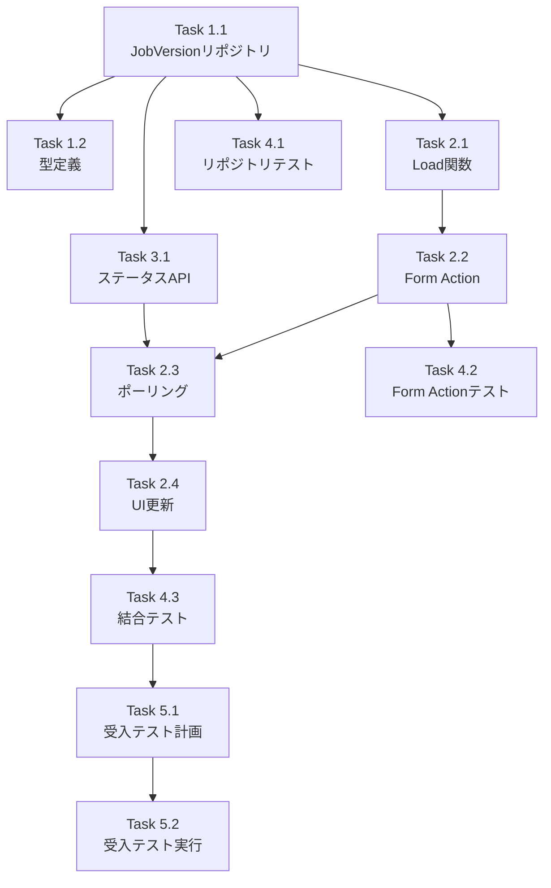

# 作業計画書: Issue #291 - Generate画面（Job生成）

## Issue概要

**Issue番号**: [#291](https://github.com/Kewton/MySwiftAgent/issues/291)
**タイトル**: [myAgentDesk] #279-7: Generate画面（Job生成）
**親Issue**: #279 myAgentDesk MVP再構築
**Phase**: Phase 4 - Job生成（ExpertAgent連携）
**サイズ**: L (8 SP)
**優先度**: P1 (High)
**見積**: 2.5日
**依存Issue**: #279-3 (APIクライアント), #279-6 (Requirements管理) → 両方完了済み

---

## 現状分析

### 既存実装状況

| コンポーネント | 状態 | ファイルパス |
|--------------|------|-------------|
| Generate画面 (+page.svelte) | プレースホルダーのみ | `src/routes/.../generate/+page.svelte` |
| Generate画面 (+page.server.ts) | 未作成 | - |
| ExpertAgentClient | 完成済み | `src/lib/api/clients/expert-agent.ts` |
| ExpertAgentClientMock | 完成済み | `src/lib/api/mock/expert-agent.mock.ts` |
| JobVersion DBスキーマ | 完成済み | `src/lib/server/db/schema.ts` |
| JobVersionリポジトリ | 未作成 | - |

### 技術スタック確認

- **フロントエンド**: Svelte 5 (runes API: $state, $derived, $effect)
- **バックエンド**: SvelteKit 2.x (form actions, load functions)
- **ORM**: Drizzle ORM (SQLite)
- **API**: ExpertAgent Job Generator API (`/aiagent-api/v1/job-generator`)
- **テスト**: Vitest (単体), Playwright (E2E)

---

## 詳細タスク分解

### Phase 1: データ層（Day 1 午前）

#### Task 1.1: JobVersionリポジトリ作成
**所要時間**: 2時間
**成果物**: `src/lib/server/repositories/job-version.ts`
**依存**: なし

**実装内容**:
```typescript
// 必要なメソッド
- findById(id: string): Promise<JobVersionDetail | null>
- findByWorkbenchId(workbenchId: string): Promise<JobVersionSummary[]>
- findGenerating(workbenchId: string): Promise<JobVersionDetail | null>  // ★追加: status='generating' のJobVersionを取得
- create(workbenchId: string, data: CreateJobVersionData): Promise<JobVersion>
- updateStatus(id: string, status: JobVersionStatus, errorMessage?: string): Promise<void>  // ★errorMessage追加
- updateGenerationResult(id: string, result: GenerationResult): Promise<void>
- getNextVersion(workbenchId: string, requirementVersionNumber: number): Promise<{major: number, minor: number}>
```

**バージョン採番ルール (vN.M形式)**:
```
採番ロジック:
- majorVersion = sourceRequirementVersion.version (RequirementVersionのバージョン番号)
- minorVersion = 同一majorVersionでの連番 (1から開始)
- versionLabel = "v{majorVersion}.{minorVersion}" (例: "v5.1", "v5.2")

例: RequirementVersion v5 から生成した場合
- 1回目: majorVersion=5, minorVersion=1 → versionLabel="v5.1"
- 2回目: majorVersion=5, minorVersion=2 → versionLabel="v5.2"
- 3回目: majorVersion=5, minorVersion=3 → versionLabel="v5.3"

RequirementVersion v6 に更新後:
- 1回目: majorVersion=6, minorVersion=1 → versionLabel="v6.1"
```

#### Task 1.2: JobVersion型定義
**所要時間**: 0.5時間
**成果物**: `src/lib/types/job-version.ts`
**依存**: Task 1.1

**実装内容**:
```typescript
// 型定義
- JobVersionSummary (一覧表示用)
- JobVersionDetail (詳細表示用)
- CreateJobVersionData
- GenerationResult
- JOB_VERSION_STATUS_CONFIG (ステータス表示設定)
```

---

### Phase 2: Generate画面実装（Day 1 午後〜Day 2 午前）

#### Task 2.1: サーバーサイドLoad関数
**所要時間**: 1.5時間
**成果物**: `src/routes/.../generate/+page.server.ts`
**依存**: Task 1.1

**実装内容**:
- Active RequirementVersion取得（parent layoutから）
- 最新のJobVersion取得（生成中のものがあるか確認）
- ExpertAgent APIヘルスチェック

```typescript
export const load: PageServerLoad = async ({ params, parent }) => {
  const parentData = await parent();
  const { workbenchId, projectId } = params;

  // Active RequirementVersionがあるか確認
  const activeRequirement = parentData.workbenchDetail?.activeRequirementVersion;

  // 現在生成中のJobVersionがあるか確認
  const generatingJob = await jobVersionRepository.findGenerating(workbenchId);

  return {
    activeRequirement,
    generatingJob,
    canGenerate: !!activeRequirement && !generatingJob
  };
};
```

#### Task 2.2: Form Action - generateJob
**所要時間**: 2時間
**成果物**: `src/routes/.../generate/+page.server.ts` (actions追加)
**依存**: Task 2.1

**実装内容**:
1. Active RequirementVersionのcontentを取得
2. JobVersion(status=generating)をDBに作成
3. ExpertAgent API呼び出し（`POST /v1/job-generator`）
4. ポーリング用のjob_idを一時保存
5. 生成開始画面へリダイレクト

**ExternalJobId 保存方針**:
```
ExpertAgent API のレスポンスと保存先の対応:

API レスポンス              | DB フィールド            | 用途
---------------------------|-------------------------|---------------------------
job_id (非同期処理ID)       | externalTraceId (一時的) | ポーリング中のみ使用
job_master_id (完了時)      | externalJobMasterId      | JobMaster参照用（永続）
langfuse_trace_id (完了時)  | externalTraceId          | Langfuse参照用（上書き）

処理フロー:
1. API呼び出し直後: job_id → externalTraceId に一時保存（ポーリング用）
2. ポーリング完了時:
   - job_master_id → externalJobMasterId
   - langfuse_trace_id → externalTraceId (上書き)

※ job_id はポーリング完了後は不要なため、externalTraceIdを再利用
```

```typescript
export const actions: Actions = {
  generateJob: async ({ params, request }) => {
    // 1. バリデーション（activeRequirement存在確認、生成中Job存在確認）
    // 2. バージョン採番 (vN.M形式) - getNextVersion使用
    // 3. JobVersion作成 (status=generating)
    // 4. ExpertAgent API呼び出し (POST /v1/job-generator)
    // 5. job_id を externalTraceId に一時保存
    // 6. 生成中状態でリダイレクト（ポーリング開始）
  }
};
```

#### Task 2.3: ポーリング実装
**所要時間**: 2時間
**成果物**: `src/routes/.../generate/+page.svelte`, `+page.server.ts`
**依存**: Task 2.2

**実装内容**:
- クライアントサイドでの2秒間隔ポーリング
- `GET /api/jobs/{jobVersionId}/status` APIエンドポイント呼び出し（内部API）
- ステータス更新: generating → success/failed
- タイムアウト処理（5分）
- ポーリング停止条件（success/failed/コンポーネントアンマウント）

**タイムアウト処理方針**:
```
重要: DBスキーマに 'timeout' ステータスは存在しない
JOB_VERSION_STATUSES = ['generating', 'success', 'failed', 'active', 'deprecated']

タイムアウト時の処理:
- status = 'failed' に更新
- errorMessage = 'Timeout: Job generation exceeded 5 minutes' を設定

タイムアウト判定:
- クライアントサイド: ポーリング開始から5分（300秒）経過
- または ExpertAgent API が 'failed' を返却

実装:
1. ポーリング開始時刻を記録
2. 各ポーリング時に経過時間をチェック
3. 5分超過時: /api/jobs/{id}/timeout を呼び出して status='failed' + errorMessage 更新
```

```typescript
// クライアントサイドポーリング
const POLLING_INTERVAL = 2000;  // 2秒
const TIMEOUT_MS = 5 * 60 * 1000;  // 5分

$effect(() => {
  if (generatingJobId && isPolling) {
    const startTime = Date.now();

    const interval = setInterval(async () => {
      // タイムアウトチェック
      if (Date.now() - startTime > TIMEOUT_MS) {
        await fetch(`/api/jobs/${generatingJobId}/timeout`, { method: 'POST' });
        isPolling = false;
        return;
      }

      const response = await fetch(`/api/jobs/${generatingJobId}/status`);
      const data = await response.json();

      if (data.status === 'success' || data.status === 'failed') {
        isPolling = false;
        // UI更新処理
      }
    }, POLLING_INTERVAL);

    return () => clearInterval(interval);
  }
});
```

#### Task 2.4: Generate画面UI更新
**所要時間**: 2時間
**成果物**: `src/routes/.../generate/+page.svelte`
**依存**: Task 2.3

**実装内容**:
- Active RequirementVersion表示（バージョン番号、ステータス、プレビュー）
- 「Generate Job」ボタン（ActiveRequirementがない場合は無効化）
- 生成中状態表示（プログレスバー、スピナー）
- 生成完了/失敗表示
- 「Retry」ボタン（失敗時）
- 「Open Trace」リンク（Langfuse）
- 「Review Results」リンク（成功時）

---

### Phase 3: APIルート実装（Day 2 午前）

#### Task 3.1: ステータス確認APIエンドポイント
**所要時間**: 1時間
**成果物**: `src/routes/api/jobs/[jobId]/status/+server.ts`
**依存**: Task 1.1

**実装内容**:
- JobVersionからexternalJobIdを取得
- ExpertAgent APIにステータス問い合わせ
- DBのJobVersionステータスを更新
- レスポンス返却

```typescript
export const GET: RequestHandler = async ({ params }) => {
  const { jobId } = params;

  // 1. JobVersionからexternalJobId取得
  // 2. ExpertAgent APIにステータス問い合わせ
  // 3. DBのステータス更新
  // 4. レスポンス返却

  return json({ status, progress, result });
};
```

---

### Phase 4: テスト（Day 2 午後）

#### Task 4.1: JobVersionリポジトリ単体テスト
**所要時間**: 1.5時間
**成果物**: `tests/unit/repositories/job-version.test.ts`
**カバレッジ目標**: 95%

**テストケース**:
- [ ] create: 新規JobVersion作成
- [ ] getNextVersion: バージョン採番ロジック（vN.M形式）
- [ ] getNextVersion: 同一majorVersionでminorVersion連番
- [ ] findById: 存在するIDで取得
- [ ] findById: 存在しないIDでnull返却
- [ ] findByWorkbenchId: 一覧取得（降順ソート）
- [ ] findGenerating: status='generating' のJobVersion取得
- [ ] findGenerating: 生成中がない場合はnull返却
- [ ] updateStatus: ステータス更新
- [ ] updateStatus: errorMessage付きステータス更新（タイムアウト用）
- [ ] updateGenerationResult: 生成結果更新

#### Task 4.2: Generate画面Form Action単体テスト
**所要時間**: 1.5時間
**成果物**: `tests/unit/routes/generate.test.ts`
**カバレッジ目標**: 90%

**テストケース**:
- [ ] generateJob: Active RequirementVersionがない場合はエラー
- [ ] generateJob: 既に生成中のJobがある場合はエラー
- [ ] generateJob: 正常系（JobVersion作成、API呼び出し）
- [ ] generateJob: API呼び出し失敗時のエラーハンドリング

#### Task 4.3: 結合テスト
**所要時間**: 1.5時間
**成果物**: `tests/integration/generate-job.test.ts`

**テストケース**:
- [ ] Generate画面表示（Active Requirementあり）
- [ ] Generate画面表示（Active Requirementなし → ボタン無効）
- [ ] Job生成開始 → ポーリング → 完了
- [ ] Job生成開始 → ポーリング → 失敗 → Retryボタン表示

---

### Phase 5: L3受入テスト（Day 3 午前）

#### Task 5.1: L3受入テスト計画
**所要時間**: 0.5時間
**成果物**: テストシナリオ文書

#### Task 5.2: L3受入テスト実行
**所要時間**: 1.5時間
**成果物**: `tests/acceptance/test_issue_291_acceptance.sh`

**詳細は後述の「L3受入テスト計画」セクション参照**

---

## タスク依存関係



---

## 作業スケジュール

### Day 1（6時間）

| 時間 | タスク | 成果物 |
|------|--------|--------|
| 09:00-11:00 | Task 1.1: JobVersionリポジトリ | `job-version.ts` |
| 11:00-11:30 | Task 1.2: 型定義 | `job-version.ts` (types) |
| 13:00-14:30 | Task 2.1: Load関数 | `+page.server.ts` |
| 14:30-16:30 | Task 2.2: Form Action | `+page.server.ts` |

### Day 2（7時間）

| 時間 | タスク | 成果物 |
|------|--------|--------|
| 09:00-10:00 | Task 3.1: ステータスAPI | `status/+server.ts` |
| 10:00-12:00 | Task 2.3: ポーリング | `+page.svelte` |
| 13:00-15:00 | Task 2.4: UI更新 | `+page.svelte` |
| 15:00-16:30 | Task 4.1: リポジトリテスト | `job-version.test.ts` |
| 16:30-18:00 | Task 4.2: Form Actionテスト | `generate.test.ts` |

### Day 3（4時間）

| 時間 | タスク | 成果物 |
|------|--------|--------|
| 09:00-10:30 | Task 4.3: 結合テスト | `generate-job.test.ts` |
| 10:30-11:00 | Task 5.1: 受入テスト計画 | シナリオ文書 |
| 11:00-12:30 | Task 5.2: 受入テスト実行 | `test_issue_291_acceptance.sh` |
| 13:00-14:00 | PR作成・レビュー対応 | PR |

**総作業時間**: 17時間（約2.5日）

---

## L3受入テスト計画（具体的なコマンド）

### 前提条件

- myVaultの「default_project」を使用
- ANTHROPIC_API_KEYがmyVaultに設定済み
- ExpertAgentサービスが起動済み

### Step 1: サービス起動確認

```bash
# サービス起動
./scripts/dev-start.sh

# ヘルスチェック
curl -sf http://localhost:8104/health && echo "✅ expertAgent: healthy"
curl -sf http://localhost:8103/health && echo "✅ myVault: healthy"
curl -sf http://localhost:5173 > /dev/null && echo "✅ myAgentDesk: running"

# myVaultにANTHROPIC_API_KEYが設定されていることを確認
curl -s http://localhost:8103/api/v1/secrets/expertagent/default_project | grep -q "ANTHROPIC_API_KEY" && echo "✅ ANTHROPIC_API_KEY: configured"
```

### Step 2: テストデータ準備（myVault default_project使用）

```bash
# default_projectを使用（myVaultで管理）
PROJECT_ID="default_project"

# 2.1 Project確認（myAgentDesk DBにdefault_projectが存在するか確認）
sqlite3 myAgentDesk/data/local.db "SELECT id, name FROM project WHERE external_project_id = '${PROJECT_ID}';"

# default_projectがなければ作成
sqlite3 myAgentDesk/data/local.db "
INSERT OR IGNORE INTO project (id, external_project_id, name, created_at, updated_at)
VALUES ('prj_default', '${PROJECT_ID}', 'Default Project', strftime('%s','now'), strftime('%s','now'));
"

# 2.2 テスト用Workbench作成
WORKBENCH_ID="wb_test_291"
sqlite3 myAgentDesk/data/local.db "
INSERT OR REPLACE INTO workbench (id, project_id, name, status, created_at, updated_at)
VALUES ('${WORKBENCH_ID}', 'prj_default', 'Issue291 Test Workbench', 'active', strftime('%s','now'), strftime('%s','now'));
"

# 2.3 テスト用RequirementVersion作成
REQ_VERSION_ID="rv_test_291"
sqlite3 myAgentDesk/data/local.db "
INSERT OR REPLACE INTO requirement_version (id, workbench_id, version, content, status, created_at, updated_at)
VALUES (
  '${REQ_VERSION_ID}',
  '${WORKBENCH_ID}',
  1,
  'PDFファイルをGoogle Driveにアップロードして、完了をメール通知する。

## 入力
- ローカルのPDFファイルパス

## 処理
1. 指定されたPDFファイルをGoogle Driveにアップロード
2. アップロード完了後、共有リンクを生成

## 出力
- アップロード完了メールを指定アドレスに送信
- メールには共有リンクを含める',
  'active',
  strftime('%s','now'),
  strftime('%s','now')
);
"

# 2.4 Workbenchに active_requirement_version_id を設定
sqlite3 myAgentDesk/data/local.db "
UPDATE workbench SET active_requirement_version_id = '${REQ_VERSION_ID}' WHERE id = '${WORKBENCH_ID}';
"

# 2.5 確認
echo "=== Test Data Created ==="
sqlite3 myAgentDesk/data/local.db "
SELECT w.id, w.name, w.active_requirement_version_id, rv.version, rv.status
FROM workbench w
LEFT JOIN requirement_version rv ON w.active_requirement_version_id = rv.id
WHERE w.id = '${WORKBENCH_ID}';
"
```

### Step 3: Job生成フロー確認（ブラウザ操作）

```bash
# 1. Generate画面にアクセス
open "http://localhost:5173/projects/${PROJECT_ID}/workbenches/${WORKBENCH_ID}/generate"

# 確認項目:
# - Active RequirementVersionが表示される
# - 「Generate Job」ボタンが有効

# 2. 「Generate Job」ボタンをクリック
# 確認項目:
# - JobVersion(status=generating)がDBに作成される
# - プログレス表示が開始される

# 3. ポーリング監視（DB確認）
sqlite3 myAgentDesk/data/local.db "SELECT id, status, version_label, external_trace_id FROM job_version ORDER BY created_at DESC LIMIT 1;"

# 4. 生成完了確認
# 確認項目:
# - status が 'success' に変更
# - task_breakdown が設定される
# - 「Review Results」リンクが表示される
```

### Step 4: ExpertAgent API直接テスト

```bash
# Job Generator API呼び出し（正常系）
curl -s -X POST http://localhost:8104/aiagent-api/v1/job-generator \
  -H "Content-Type: application/json" \
  -d '{
    "user_requirement": "テスト用の簡単なジョブを生成してください。ファイルをコピーするだけの処理です。",
    "max_retry": 3
  }' | tee /tmp/job_generator_response.json

# job_idを取得
JOB_ID=$(cat /tmp/job_generator_response.json | python3 -c "import sys,json; print(json.load(sys.stdin)['job_id'])")
echo "Job ID: ${JOB_ID}"

# ステータス確認（ポーリング）
for i in {1..30}; do
  STATUS=$(curl -s "http://localhost:8104/aiagent-api/v1/jobs/${JOB_ID}/status" | python3 -c "import sys,json; print(json.load(sys.stdin)['status'])")
  echo "Attempt $i: status=${STATUS}"

  if [ "$STATUS" = "completed" ] || [ "$STATUS" = "failed" ]; then
    echo "✅ Job generation finished with status: ${STATUS}"
    break
  fi
  sleep 2
done

# 最終結果確認
curl -s "http://localhost:8104/aiagent-api/v1/jobs/${JOB_ID}/status" | python3 -m json.tool
```

### Step 5: バージョン採番確認

```bash
# 同じRequirementVersionから複数回生成した場合のバージョン確認
# 1回目: v5.1, 2回目: v5.2, 3回目: v5.3 のように採番されることを確認

sqlite3 myAgentDesk/data/local.db "
SELECT
  rv.version as req_version,
  jv.major_version,
  jv.minor_version,
  jv.version_label,
  jv.status
FROM job_version jv
JOIN requirement_version rv ON jv.source_requirement_version_id = rv.id
WHERE jv.workbench_id = '${WORKBENCH_ID}'
ORDER BY jv.created_at;
"
```

### Step 6: エラーケース確認

```bash
# 6.1 Active RequirementVersionがない場合
# Workbenchのactive_requirement_version_idをnullに設定
sqlite3 myAgentDesk/data/local.db "UPDATE workbench SET active_requirement_version_id = NULL WHERE id = '${WORKBENCH_ID}';"

# → Generate画面で「Generate Job」ボタンが無効化されていることを確認
open "http://localhost:5173/projects/prj_default/workbenches/${WORKBENCH_ID}/generate"

# テスト後、元に戻す
sqlite3 myAgentDesk/data/local.db "UPDATE workbench SET active_requirement_version_id = '${REQ_VERSION_ID}' WHERE id = '${WORKBENCH_ID}';"

# 6.2 既に生成中のJobがある場合
# status='generating' のJobVersionを手動作成
sqlite3 myAgentDesk/data/local.db "
INSERT INTO job_version (id, workbench_id, source_requirement_version_id, major_version, minor_version, version_label, status, created_at, updated_at)
VALUES ('jv_test_generating', '${WORKBENCH_ID}', '${REQ_VERSION_ID}', 1, 99, 'v1.99', 'generating', strftime('%s','now'), strftime('%s','now'));
"

# → Generate画面で新規生成ができないことを確認（エラーメッセージ表示）
# テスト後、削除
sqlite3 myAgentDesk/data/local.db "DELETE FROM job_version WHERE id = 'jv_test_generating';"

# 6.3 タイムアウト確認（5分後）
# ※重要: DBスキーマに 'timeout' ステータスは存在しない
# タイムアウト時は status='failed' + errorMessage で処理される

# 確認項目:
# → status が 'failed' に更新されること
# → errorMessage が 'Timeout: Job generation exceeded 5 minutes' に設定されること
# → UI上で「Generation timed out」等のエラーメッセージが表示されること

sqlite3 myAgentDesk/data/local.db "
SELECT id, status, error_message, version_label
FROM job_version
WHERE workbench_id = '${WORKBENCH_ID}'
ORDER BY created_at DESC
LIMIT 1;
"
```

### Step 7: エビデンス収集

```bash
# スクリーンショット保存（手動）
# - Generate画面（生成前）
# - Generate画面（生成中）
# - Generate画面（生成完了）

# ログ確認
tail -50 expertAgent/logs/expertagent.log | grep -E "(ERROR|WARNING|job-generator)"

# DB状態保存
sqlite3 myAgentDesk/data/local.db ".dump job_version" > /tmp/job_version_dump.sql
```

---

## 成果物チェックリスト

### コード

- [ ] `src/lib/server/repositories/job-version.ts`
- [ ] `src/lib/types/job-version.ts`
- [ ] `src/routes/.../generate/+page.server.ts`
- [ ] `src/routes/.../generate/+page.svelte`（更新）
- [ ] `src/routes/api/jobs/[jobId]/status/+server.ts` (ステータス確認API)
- [ ] `src/routes/api/jobs/[jobId]/timeout/+server.ts` (タイムアウト処理API)

### テスト

- [ ] `tests/unit/repositories/job-version.test.ts`
- [ ] `tests/unit/routes/generate.test.ts`
- [ ] `tests/integration/generate-job.test.ts`
- [ ] `tests/acceptance/test_issue_291_acceptance.sh`

### ドキュメント

- [ ] 本作業計画書（`work-plan.md`）
- [ ] 実装レポート（`implementation-report.md`）- 完了後

---

## リスクと対策

| リスク | 発生確率 | 影響 | 対策 |
|-------|---------|------|------|
| ExpertAgent API仕様変更 | 低 | 実装遅延2時間 | APIクライアント層で吸収、型定義で早期検出 |
| LLM API レート制限 | 中 | テスト遅延 | リトライロジック、テスト間隔調整 |
| ポーリングのメモリリーク | 中 | 品質問題 | $effect内でクリーンアップ処理を確実に実装 |
| タイムアウト処理の複雑さ | 低 | 実装遅延1時間 | シンプルな実装から開始、段階的に改善 |

---

## Definition of Done

Issue完了条件：

- [ ] すべてのタスクが完了
- [ ] 単体テストカバレッジ90%以上
- [ ] 結合テスト全シナリオパス
- [ ] **L3受入テスト全パス**（実際のExpertAgent APIを使用）
- [ ] CI/CDグリーン（`./scripts/pre-push-check-all.sh`）
- [ ] コードレビュー承認
- [ ] 以下の受入基準を満たす:
  - [ ] Active RequirementVersionが未設定の場合、生成ボタン無効化
  - [ ] 生成開始でJobVersion(status=generating)が作成される
  - [ ] 生成完了でJobVersion(status=success, task_breakdown等)が更新される
  - [ ] バージョンがvN.M形式で正しく採番される

---

## 次のアクション

1. **ブランチ作成**: `feature/issue/291`
2. **worktree作成**（必要に応じて）: `/work/MySwiftAgent-feature-issue-291`
3. **Task 1.1から実装開始**: JobVersionリポジトリ作成
4. **進捗報告**: `/progress-report`で定期報告

---

**作成日**: 2025-12-18
**更新日**: 2025-12-18
**作成者**: Claude (AI Assistant)
**対象Issue**: #291 Generate画面（Job生成）
**ステータス**: レビュー完了・実装準備完了

---

## 更新履歴

| 日付 | 変更内容 |
|------|---------|
| 2025-12-18 (v1) | 初版作成 |
| 2025-12-18 (v2) | レビュー指摘対応: findGeneratingメソッド追加、タイムアウト処理方針明記、バージョン採番ルール詳細化、ExternalJobId保存方針明確化、テストデータSQL追加 |
