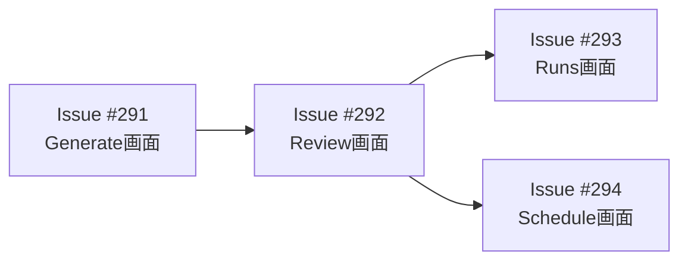
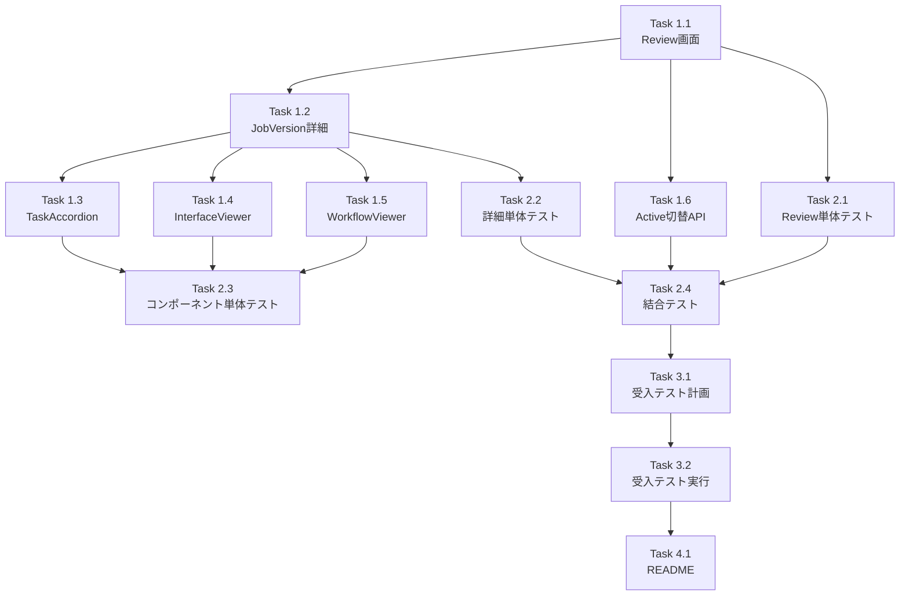

# 作業計画書: Issue #292 - Review画面（JobVersion詳細）

## Issue概要

```markdown
## Issue: [myAgentDesk] #279-8: Review画面（JobVersion詳細）
**Issue番号**: #292
**サイズ**: M (5 SP)
**優先度**: P1 (High)
**依存Issue**: #291 (Generate画面) - OPEN
**ブロック対象**: #293 (Runs画面), #294 (Schedule画面)
```

## 現状分析

### 既存実装

| 項目 | 状況 | 詳細 |
|------|------|------|
| Review画面 (`review/+page.svelte`) | スケルトン | モックデータ使用、プレースホルダーUI |
| JobVersion詳細 (`job-versions/[id]/+page.svelte`) | スケルトン | プレースホルダーのみ |
| JobVersionリポジトリ | 実装済 | `findByWorkbenchId`, `updateStatus` 等完備 |
| DBスキーマ | 完備 | `taskBreakdown`, `interfaceDefinitions`, `workflows` フィールドあり |
| 生成系コンポーネント | 部分実装 | `TaskBreakdownList.svelte` 等 Issue #305 で作成済み |

### 技術的な依存関係



---

## 詳細タスク分解

### Phase 1: 実装タスク

#### Task 1.1: Review画面（JobVersion一覧）の実装
- **成果物**: `myAgentDesk/src/routes/projects/[projectId]/workbenches/[workbenchId]/review/+page.svelte`, `+page.server.ts`
- **依存**: なし
- **内容**:
  - `+page.server.ts` でJobVersionリポジトリからデータ取得
  - vN.M形式でのバージョン表示
  - Active/Deprecated ステータスバッジ
  - Active切り替えアクション
  - JobVersion詳細へのリンク

#### Task 1.2: JobVersion詳細画面の実装
- **成果物**: `myAgentDesk/src/routes/projects/[projectId]/workbenches/[workbenchId]/job-versions/[jobVersionId]/+page.svelte`, `+page.server.ts`
- **依存**: Task 1.1
- **内容**:
  - `+page.server.ts` でJobVersionとWorkbench情報を取得
  - 所属確認ガード（セキュリティ）
  - 基本情報表示（バージョン、ステータス、生成日時）
  - 生成元RequirementVersionへのリンク
  - 「Start Run」ボタン

#### Task 1.3: タスク分解アコーディオンコンポーネントの作成
- **成果物**: `myAgentDesk/src/lib/components/job-version/TaskAccordion.svelte`
- **依存**: Task 1.2
- **内容**:
  - アコーディオン開閉機能
  - タスク名、説明表示
  - 推奨API一覧表示
  - 既存の `TaskBreakdownList.svelte` をベースに拡張

#### Task 1.4: IF定義表示コンポーネントの作成
- **成果物**: `myAgentDesk/src/lib/components/job-version/InterfaceViewer.svelte`
- **依存**: Task 1.2
- **内容**:
  - Input/Output Interface (JSON Schema) のフォーマット表示
  - シンタックスハイライト
  - コピーボタン

#### Task 1.5: ワークフロー表示コンポーネントの作成
- **成果物**: `myAgentDesk/src/lib/components/job-version/WorkflowViewer.svelte`
- **依存**: Task 1.2
- **内容**:
  - YAML表示（highlight.js使用）
  - シンタックスハイライト
  - コピーボタン
  - 折りたたみ機能

#### Task 1.6: Active切り替え機能の実装
- **成果物**: `myAgentDesk/src/routes/api/job-versions/[id]/activate/+server.ts`
- **依存**: Task 1.1
- **内容**:
  - API エンドポイント作成
  - 既存のActiveをdeprecatedに変更
  - 新しいJobVersionをactiveに設定
  - トランザクション処理

### Phase 2: テストタスク (TDD - CI実行可能)

#### Task 2.1: Review画面の単体テスト
- **成果物**: `myAgentDesk/tests/unit/routes/review.test.ts`
- **カバレッジ目標**: 90%
- **内容**:
  - +page.server.ts のloadロジック
  - JobVersion一覧のソート順確認
  - ステータス表示確認

#### Task 2.2: JobVersion詳細画面の単体テスト
- **成果物**: `myAgentDesk/tests/unit/routes/job-version-detail.test.ts`
- **カバレッジ目標**: 90%
- **内容**:
  - +page.server.ts のloadロジック
  - 所属確認ガードのテスト
  - データパース処理

#### Task 2.3: コンポーネント単体テスト
- **成果物**: `myAgentDesk/tests/unit/components/job-version/*.test.ts`
- **カバレッジ目標**: 90%
- **内容**:
  - TaskAccordion開閉動作
  - InterfaceViewer JSON表示
  - WorkflowViewer YAML表示

#### Task 2.4: 結合テスト
- **成果物**: `tests/integration/myAgentDesk/test_review_flow.py`
- **シナリオ数**: 3
- **内容**:
  - Review一覧→詳細への遷移
  - Active切り替えAPI
  - 不正アクセス（所属確認）

### Phase 3: L3受入テスト（ローカル受入テスト）

#### Task 3.1: L3受入テスト計画
- **成果物**: 受入テストシナリオ（本計画書のセクション8に記載）

#### Task 3.2: L3受入テスト実行
- **成果物**: `tests/acceptance/test_issue_292_acceptance.sh`
- **内容**:
  - サービス起動確認
  - Review画面の表示確認
  - JobVersion詳細の表示確認
  - Active切り替え動作確認

### Phase 4: ドキュメントタスク

#### Task 4.1: コンポーネントREADME
- **成果物**: `myAgentDesk/src/lib/components/job-version/README.md`

---

## タスク依存関係



---

## チェックポイント

| タイミング | 確認事項 | 対応 |
|-----------|---------|------|
| Task 1.2完了時 | JobVersion詳細画面の基本動作 | 手動でUI確認 |
| Task 1.5完了時 | 全コンポーネントの統合動作 | ローカルで動作確認 |
| Phase 2完了時 | 単体テストカバレッジ90%達成 | `npm run test:coverage` |
| Phase 3完了時 | 受入テストパス | シェルスクリプト実行 |

---

## リスクと対策

| リスク | 発生確率 | 影響 | 対策 |
|-------|---------|------|------|
| Issue #291 (Generate画面) 未完了 | 高 | 実際のJobVersionデータなし | モックデータで開発継続、後で統合 |
| highlight.js 依存追加 | 低 | バンドルサイズ増加 | 必要な言語のみインポート |
| JSON Schema 複雑なケース | 中 | 表示崩れ | 深さ制限、折りたたみで対応 |

---

## 成果物チェックリスト

### コード

- [ ] `myAgentDesk/src/routes/projects/[projectId]/workbenches/[workbenchId]/review/+page.server.ts`
- [ ] `myAgentDesk/src/routes/projects/[projectId]/workbenches/[workbenchId]/review/+page.svelte`
- [ ] `myAgentDesk/src/routes/projects/[projectId]/workbenches/[workbenchId]/job-versions/[jobVersionId]/+page.server.ts`
- [ ] `myAgentDesk/src/routes/projects/[projectId]/workbenches/[workbenchId]/job-versions/[jobVersionId]/+page.svelte`
- [ ] `myAgentDesk/src/lib/components/job-version/TaskAccordion.svelte`
- [ ] `myAgentDesk/src/lib/components/job-version/InterfaceViewer.svelte`
- [ ] `myAgentDesk/src/lib/components/job-version/WorkflowViewer.svelte`
- [ ] `myAgentDesk/src/routes/api/job-versions/[id]/activate/+server.ts`

### テスト

- [ ] `myAgentDesk/tests/unit/routes/review.test.ts`
- [ ] `myAgentDesk/tests/unit/routes/job-version-detail.test.ts`
- [ ] `myAgentDesk/tests/unit/components/job-version/*.test.ts`
- [ ] `tests/integration/myAgentDesk/test_review_flow.py`
- [ ] `tests/acceptance/test_issue_292_acceptance.sh`

### ドキュメント

- [ ] `myAgentDesk/src/lib/components/job-version/README.md`

---

## L3受入テスト計画（自動化シェルスクリプト）

### 前提条件

| 項目 | 要件 |
|------|------|
| myAgentDesk | `npm install` 完了済み |
| SQLite3 | `sqlite3` コマンドが利用可能 |
| サービス起動 | `npm run dev` または `./scripts/dev-start.sh` で起動済み |
| テストデータ | `npm run db:seed` でシードデータ投入済み（スクリプトで自動確認） |

### 受入テストスクリプト

**成果物**: `tests/acceptance/test_issue_292_acceptance.sh`

```bash
#!/bin/bash
#
# Issue #292 受入テスト（L3: ローカル受入テスト）
# [myAgentDesk] Review画面（JobVersion詳細）
#
# 実行方法:
#   ./tests/acceptance/test_issue_292_acceptance.sh
#

set -euo pipefail

# =============================================================================
# 設定・ヘルパー関数
# =============================================================================

RED='\033[0;31m'
GREEN='\033[0;32m'
YELLOW='\033[1;33m'
NC='\033[0m'

PASSED=0
FAILED=0
TOTAL=0

pass() { echo -e "${GREEN}✅ PASS${NC}: $1"; ((PASSED++)); ((TOTAL++)); }
fail() { echo -e "${RED}❌ FAIL${NC}: $1 - $2"; ((FAILED++)); ((TOTAL++)); }
warn() { echo -e "${YELLOW}⚠️  WARN${NC}: $1"; }

SCRIPT_DIR="$(cd "$(dirname "${BASH_SOURCE[0]}")" && pwd)"
PROJECT_ROOT="$(cd "$SCRIPT_DIR/../.." && pwd)"
MYAGENTDESK_DIR="$PROJECT_ROOT/myAgentDesk"
EVIDENCE_DIR="$PROJECT_ROOT/dev-reports/acceptance-test-evidence/issue-292"
mkdir -p "$EVIDENCE_DIR"

MYAGENTDESK_URL="${MYAGENTDESK_URL:-http://localhost:5173}"

echo "=============================================="
echo "Issue #292 受入テスト: Review画面（JobVersion詳細）"
echo "=============================================="
echo ""
echo "Working directory: $MYAGENTDESK_DIR"
echo "Evidence directory: $EVIDENCE_DIR"
echo ""

cd "$MYAGENTDESK_DIR"

# =============================================================================
# Step 1: 前提条件確認
# =============================================================================
echo "--- Step 1: 前提条件確認 ---"

# 1.1 DBファイル存在確認
if [ -f "data/local.db" ]; then
    pass "data/local.db ファイルが存在"
else
    fail "data/local.db が存在しない" "npm run db:push を実行してください"
    exit 1
fi

# 1.2 JobVersionテーブルにデータがあるか（なければシード投入）
JV_COUNT=$(sqlite3 data/local.db "SELECT COUNT(*) FROM job_version;" 2>/dev/null || echo "0")
if [ "$JV_COUNT" -eq 0 ]; then
    warn "JobVersionデータがないため、シードデータを投入します..."
    npm run db:seed --silent 2>/dev/null || true
    JV_COUNT=$(sqlite3 data/local.db "SELECT COUNT(*) FROM job_version;" 2>/dev/null || echo "0")
fi

if [ "$JV_COUNT" -ge 1 ]; then
    pass "JobVersionデータが存在 (件数: $JV_COUNT)"
else
    fail "JobVersionデータがない" "シードデータにJobVersionを追加してください"
    exit 1
fi

# =============================================================================
# Step 2: サービス起動確認
# =============================================================================
echo ""
echo "--- Step 2: サービス起動確認 ---"

# myAgentDeskが起動しているか確認（トップページへのアクセス）
if curl -sf "$MYAGENTDESK_URL" -o /dev/null 2>&1; then
    pass "myAgentDesk が起動している ($MYAGENTDESK_URL)"
else
    fail "myAgentDesk が起動していない" "npm run dev を実行してください"
    exit 1
fi

# =============================================================================
# Step 3: テストデータ取得（DBから動的に取得）
# =============================================================================
echo ""
echo "--- Step 3: テストデータ取得 ---"

# 実際のWorkbenchとJobVersionのIDをDBから取得
WORKBENCH_ID=$(sqlite3 data/local.db "SELECT id FROM workbench LIMIT 1;" 2>/dev/null)
if [ -z "$WORKBENCH_ID" ]; then
    fail "Workbenchデータがない" "シードデータを確認してください"
    exit 1
fi

PROJECT_ID=$(sqlite3 data/local.db "SELECT project_id FROM workbench WHERE id='$WORKBENCH_ID';" 2>/dev/null)
JOB_VERSION_ID=$(sqlite3 data/local.db "SELECT id FROM job_version WHERE workbench_id='$WORKBENCH_ID' LIMIT 1;" 2>/dev/null)

echo "  Project ID:    $PROJECT_ID"
echo "  Workbench ID:  $WORKBENCH_ID"
echo "  JobVersion ID: $JOB_VERSION_ID"

if [ -n "$PROJECT_ID" ] && [ -n "$WORKBENCH_ID" ]; then
    pass "テストデータの取得に成功"
else
    fail "テストデータが不完全" "Project/Workbenchデータを確認してください"
    exit 1
fi

# =============================================================================
# Step 4: Review画面アクセス確認
# =============================================================================
echo ""
echo "--- Step 4: Review画面アクセス確認 ---"

REVIEW_URL="$MYAGENTDESK_URL/projects/$PROJECT_ID/workbenches/$WORKBENCH_ID/review"
RESPONSE=$(curl -s -o "$EVIDENCE_DIR/review_page.html" -w "%{http_code}" "$REVIEW_URL" 2>/dev/null || echo "000")

if [ "$RESPONSE" -eq 200 ]; then
    pass "Review画面にアクセス可能 (HTTP $RESPONSE)"

    # HTMLにJobVersion関連の要素が含まれているか確認
    if grep -q "job-version\|JobVersion\|versionLabel\|jv_" "$EVIDENCE_DIR/review_page.html" 2>/dev/null; then
        pass "Review画面にJobVersion関連コンテンツが存在"
    else
        warn "Review画面にJobVersion関連コンテンツが見つからない（スケルトン状態の可能性）"
    fi
else
    fail "Review画面にアクセス失敗" "HTTP $RESPONSE - URL: $REVIEW_URL"
fi

# =============================================================================
# Step 5: JobVersion詳細画面アクセス確認
# =============================================================================
echo ""
echo "--- Step 5: JobVersion詳細画面アクセス確認 ---"

if [ -n "$JOB_VERSION_ID" ]; then
    DETAIL_URL="$MYAGENTDESK_URL/projects/$PROJECT_ID/workbenches/$WORKBENCH_ID/job-versions/$JOB_VERSION_ID"
    RESPONSE=$(curl -s -o "$EVIDENCE_DIR/job_version_detail.html" -w "%{http_code}" "$DETAIL_URL" 2>/dev/null || echo "000")

    if [ "$RESPONSE" -eq 200 ]; then
        pass "JobVersion詳細画面にアクセス可能 (HTTP $RESPONSE)"

        # HTMLにタスク/IF/ワークフロー関連の要素が含まれているか確認
        if grep -q "task\|Task\|interface\|Interface\|workflow\|Workflow" "$EVIDENCE_DIR/job_version_detail.html" 2>/dev/null; then
            pass "JobVersion詳細画面にタスク/IF関連コンテンツが存在"
        else
            warn "JobVersion詳細画面にタスク/IF関連コンテンツが見つからない（スケルトン状態の可能性）"
        fi
    else
        fail "JobVersion詳細画面にアクセス失敗" "HTTP $RESPONSE"
    fi
else
    warn "JobVersionIDがないためスキップ"
fi

# =============================================================================
# Step 6: 不正アクセステスト（所属確認ガード）
# =============================================================================
echo ""
echo "--- Step 6: 不正アクセステスト ---"

# 存在しないJobVersionIDでアクセス → 404を期待
INVALID_URL="$MYAGENTDESK_URL/projects/$PROJECT_ID/workbenches/$WORKBENCH_ID/job-versions/jv_nonexistent_12345"
RESPONSE=$(curl -s -o /dev/null -w "%{http_code}" "$INVALID_URL" 2>/dev/null || echo "000")

if [ "$RESPONSE" -eq 404 ]; then
    pass "存在しないJobVersionIDで404が返る (HTTP $RESPONSE)"
elif [ "$RESPONSE" -eq 200 ]; then
    fail "存在しないJobVersionIDで200が返った" "404を期待したが$RESPONSE"
else
    warn "存在しないJobVersionIDへのアクセスでHTTP $RESPONSE（500等はエラーハンドリング未実装の可能性）"
fi

# 別のWorkbenchに属するJobVersionへのアクセステスト（データがあれば）
OTHER_WB=$(sqlite3 data/local.db "SELECT id FROM workbench WHERE id != '$WORKBENCH_ID' LIMIT 1;" 2>/dev/null || echo "")
if [ -n "$OTHER_WB" ] && [ -n "$JOB_VERSION_ID" ]; then
    CROSS_URL="$MYAGENTDESK_URL/projects/$PROJECT_ID/workbenches/$OTHER_WB/job-versions/$JOB_VERSION_ID"
    RESPONSE=$(curl -s -o /dev/null -w "%{http_code}" "$CROSS_URL" 2>/dev/null || echo "000")

    if [ "$RESPONSE" -eq 404 ]; then
        pass "別Workbench経由のアクセスで404が返る（所属確認OK）"
    else
        warn "別Workbench経由のアクセスでHTTP $RESPONSE（所属確認ガード未実装の可能性）"
    fi
fi

# =============================================================================
# Step 7: Active切り替えAPI確認（実装後のテスト）
# =============================================================================
echo ""
echo "--- Step 7: Active切り替えAPI確認 ---"

# APIエンドポイントの存在確認
ACTIVATE_API_URL="$MYAGENTDESK_URL/api/job-versions/$JOB_VERSION_ID/activate"
RESPONSE=$(curl -s -o "$EVIDENCE_DIR/activate_api_response.json" -w "%{http_code}" \
    -X POST "$ACTIVATE_API_URL" \
    -H "Content-Type: application/json" 2>/dev/null || echo "000")

if [ "$RESPONSE" -eq 200 ]; then
    pass "Active切り替えAPIが正常応答 (HTTP $RESPONSE)"

    # レスポンス内容を確認
    if grep -q '"success"\s*:\s*true' "$EVIDENCE_DIR/activate_api_response.json" 2>/dev/null; then
        pass "APIレスポンスに成功フラグが含まれる"
    fi

    # DBでステータス変更を確認
    NEW_STATUS=$(sqlite3 data/local.db "SELECT status FROM job_version WHERE id='$JOB_VERSION_ID';" 2>/dev/null || echo "")
    if [ "$NEW_STATUS" = "active" ]; then
        pass "DBでJobVersionのステータスがactiveに変更された"
    else
        warn "DBステータス確認: $NEW_STATUS（期待: active）"
    fi
elif [ "$RESPONSE" -eq 404 ]; then
    warn "Active切り替えAPIが未実装 (HTTP 404) - Task 1.6完了後に再テスト"
elif [ "$RESPONSE" -eq 405 ]; then
    warn "Active切り替えAPIがPOSTメソッド未対応 (HTTP 405)"
else
    warn "Active切り替えAPIでHTTP $RESPONSE"
fi

# =============================================================================
# Step 8: TypeScriptビルド確認
# =============================================================================
echo ""
echo "--- Step 8: TypeScriptビルド確認 ---"

if npm run build 2>&1 | tee "$EVIDENCE_DIR/build.log" | grep -iq "error\|failed"; then
    fail "ビルドが失敗" "詳細は $EVIDENCE_DIR/build.log を確認"
else
    pass "ビルドが成功"
fi

# =============================================================================
# Step 9: 型チェック確認
# =============================================================================
echo ""
echo "--- Step 9: TypeScript型チェック ---"

if npm run type-check 2>&1 | tee "$EVIDENCE_DIR/type-check.log" | grep -iq "error"; then
    fail "型チェックが失敗" "詳細は $EVIDENCE_DIR/type-check.log を確認"
else
    pass "型チェックが成功"
fi

# =============================================================================
# 結果サマリー・エビデンス収集
# =============================================================================
echo ""
echo "--- エビデンス収集 ---"

# テストサマリーファイル作成
cat > "$EVIDENCE_DIR/test_summary.md" << EOF
# Issue #292 受入テスト結果

## 実行日時
$(date '+%Y-%m-%d %H:%M:%S')

## テスト結果
| 項目 | 結果 |
|------|------|
| Passed | $PASSED |
| Failed | $FAILED |
| Total | $TOTAL |

## テスト環境
- myAgentDesk URL: $MYAGENTDESK_URL
- Project ID: $PROJECT_ID
- Workbench ID: $WORKBENCH_ID
- JobVersion ID: $JOB_VERSION_ID

## 収集エビデンス
- review_page.html: Review画面のHTML
- job_version_detail.html: JobVersion詳細画面のHTML
- activate_api_response.json: Active切り替えAPIレスポンス
- build.log: ビルドログ
- type-check.log: 型チェックログ

## Definition of Done確認
- [$([ "$FAILED" -eq 0 ] && echo "x" || echo " ")] 全受入テストがパス
- [ ] 単体テストカバレッジ90%以上（別途確認）
- [ ] 結合テスト全シナリオパス（別途確認）
- [ ] コードレビュー承認（別途確認）
EOF

echo "  エビデンス保存先: $EVIDENCE_DIR"
pass "エビデンス収集完了"

# =============================================================================
# 最終結果
# =============================================================================
echo ""
echo "=============================================="
echo "受入テスト結果サマリー"
echo "=============================================="
echo -e "Total: $TOTAL, ${GREEN}Passed: $PASSED${NC}, ${RED}Failed: $FAILED${NC}"
echo ""

if [ "$FAILED" -eq 0 ]; then
    echo -e "${GREEN}🎉 全ての受入テストがパスしました！${NC}"
    exit 0
else
    echo -e "${RED}❌ 一部の受入テストが失敗しました${NC}"
    echo "詳細は $EVIDENCE_DIR/test_summary.md を確認してください"
    exit 1
fi
```

### テスト項目一覧

| Step | テスト内容 | 検証方法 | 期待結果 |
|------|-----------|---------|---------|
| 1 | 前提条件確認 | DB存在、データ件数 | local.db存在、JobVersion >= 1件 |
| 2 | サービス起動確認 | トップページHTTP GET | HTTP 200 |
| 3 | テストデータ取得 | SQLiteから動的取得 | Project/Workbench/JobVersion ID取得成功 |
| 4 | Review画面アクセス | HTTP GET + HTML解析 | HTTP 200、関連コンテンツ存在 |
| 5 | JobVersion詳細アクセス | HTTP GET + HTML解析 | HTTP 200、タスク/IF関連コンテンツ存在 |
| 6 | 不正アクセステスト | 存在しないID/別Workbench経由 | HTTP 404 |
| 7 | Active切り替えAPI | POST + DB確認 | HTTP 200、status=active |
| 8 | ビルド確認 | npm run build | エラーなし |
| 9 | 型チェック | npm run type-check | エラーなし |

### 実行方法

```bash
# 1. サービス起動（別ターミナル）
cd myAgentDesk && npm run dev

# 2. 受入テスト実行
./tests/acceptance/test_issue_292_acceptance.sh

# 3. エビデンス確認
ls -la dev-reports/acceptance-test-evidence/issue-292/
cat dev-reports/acceptance-test-evidence/issue-292/test_summary.md
```

---

## Definition of Done

Issue完了条件:

- [ ] すべてのタスクが完了
- [ ] 単体テストカバレッジ90%以上
- [ ] 結合テスト全シナリオパス
- [ ] L3受入テスト全パス
- [ ] CI/CDグリーン
- [ ] コードレビュー承認
- [ ] ドキュメント更新完了

---

## 次のアクション

作業計画承認後:

1. **依存確認**: Issue #291 (Generate画面) の完了状況を確認
2. **ブランチ作成**: `issue/292-review-page`
3. **worktree作成**: `./scripts/worktree-create-from-issue.sh 292`
4. **タスク実行**: Phase 1 から順次実装
5. **進捗報告**: `/progress-report` で定期報告

---

## 参照ドキュメント

- [Issue分割計画書](../279/issue-split.md)
- [画面遷移図](../279/screen-transition.md)
- [E-R図](../279/er-diagram.md)
- [myAgentDesk README](../../../../myAgentDesk/README.md)

---

**作成日**: 2025-12-25
**対象Issue**: #292 Review画面（JobVersion詳細）
**ステータス**: 計画完了、承認待ち
