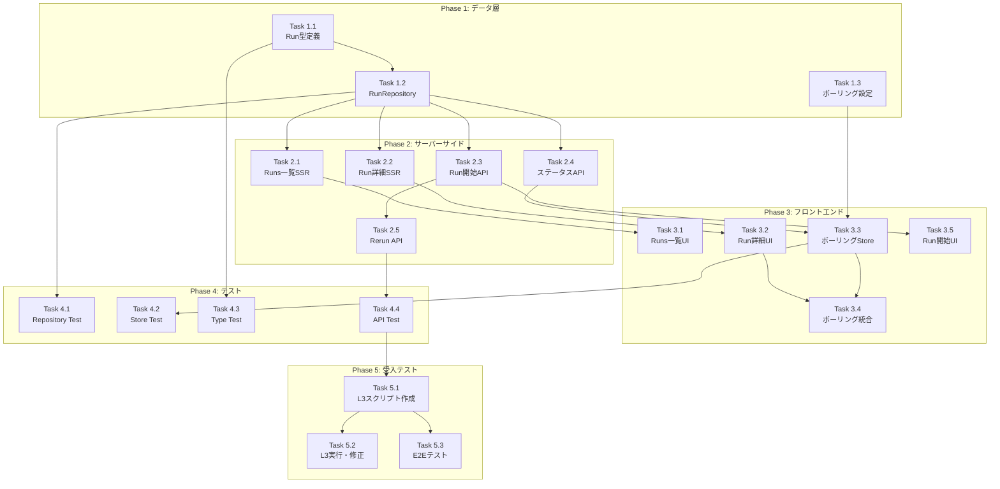

# Issue #293 作業計画書

## Runs画面（実行履歴・監視）

---

## 1. Issue概要の確認

```markdown
## Issue: [myAgentDesk] #279-9: Runs画面（実行履歴・監視）
**Issue番号**: #293
**親Issue**: #279 (myAgentDesk MVP再構築)
**サイズ**: L (8 SP)
**作業見積**: 2.5日（約22時間）
**優先度**: P1 (High)
**依存Issue**: #279-3 (APIクライアント), #279-8 (Review画面)
```

### 現状分析

| 項目 | 状況 | 詳細 |
|------|------|------|
| UIルート | ✅ 存在 | Issue #285で作成済み（モックデータのみ） |
| `+page.svelte` | ✅ 存在 | runs/, runs/[runId]/ |
| `+page.server.ts` | ❌ 未実装 | SSRデータ取得未実装 |
| RunRepository | ❌ 未実装 | 設計方針書で設計済み |
| Run型定義 | ❌ 未実装 | DBスキーマは存在 |
| ポーリング | ❌ 未実装 | 設計方針書で設計済み |
| JobQueue連携 | ⚠️ 部分実装 | ClientはあるがRun連携なし |

---

## 2. 詳細タスク分解

### Phase 1: データ層・型定義（基盤）

#### Task 1.1: Run型定義の作成
- **所要時間**: 1時間
- **成果物**: `src/lib/types/run.ts`
- **依存**: なし
- **内容**:
  - `RunStatus`型（'queued' | 'running' | 'success' | 'failed' | 'canceled' | 'timeout'）
  - `Run`インターフェース
  - `RunWithJobVersion`インターフェース
  - `RunListItem`インターフェース
  - `isTerminalStatus()`, `isRerunnable()`ヘルパー関数

#### Task 1.2: RunRepositoryの実装
- **所要時間**: 2時間
- **成果物**: `src/lib/server/repositories/run.ts`
- **依存**: Task 1.1
- **内容**:
  - `findById(id: string)`
  - `findByWorkbenchId(workbenchId: string, options?)`
  - `create(data: InsertRun)`
  - `updateStatus(id: string, status: RunStatus)`
  - `updateFromJobQueue(id: string, jobQueueResponse)`

#### Task 1.3: ポーリング設定の統合
- **所要時間**: 0.5時間
- **成果物**: `src/lib/config/polling.ts`
- **依存**: なし
- **内容**:
  - `POLLING_CONFIGS`オブジェクト
  - `jobGeneration`: 1秒間隔、15分タイムアウト
  - `runMonitoring`: 5秒間隔、30分タイムアウト

### Phase 2: サーバーサイド実装

#### Task 2.1: Runs一覧のサーバーサイドデータ取得
- **所要時間**: 1.5時間
- **成果物**: `src/routes/projects/[projectId]/workbenches/[workbenchId]/runs/+page.server.ts`
- **依存**: Task 1.2
- **内容**:
  - `load`関数でRunRepository.findByWorkbenchId()呼び出し
  - ページネーションパラメータ処理
  - JobVersionとのJOIN

#### Task 2.2: Run詳細のサーバーサイドデータ取得
- **所要時間**: 1時間
- **成果物**: `src/routes/projects/[projectId]/workbenches/[workbenchId]/runs/[runId]/+page.server.ts`
- **依存**: Task 1.2
- **内容**:
  - `load`関数でRunRepository.findById()呼び出し
  - JobVersion情報の取得
  - 404エラーハンドリング

#### Task 2.3: Run開始APIエンドポイント
- **所要時間**: 2時間
- **成果物**: `src/routes/api/runs/+server.ts`
- **依存**: Task 1.2, JobQueueClient
- **内容**:
  - POST: Run作成 + JobQueue連携
  - バリデーション（Zod）
  - エラーハンドリング

#### Task 2.4: ステータスポーリングAPIエンドポイント
- **所要時間**: 1時間
- **成果物**: `src/routes/api/runs/[runId]/status/+server.ts`
- **依存**: Task 1.2
- **内容**:
  - GET: 軽量ステータス取得
  - JobQueueからの最新ステータス同期
  - キャッシュヘッダー設定

#### Task 2.5: Rerun APIエンドポイント
- **所要時間**: 1時間
- **成果物**: `src/routes/api/runs/[runId]/rerun/+server.ts`
- **依存**: Task 2.3
- **内容**:
  - POST: 新Run作成（元Runのパラメータコピー）
  - Rerun可能性チェック

### Phase 3: フロントエンド実装

#### Task 3.1: Runs一覧画面の実装
- **所要時間**: 2時間
- **成果物**: `src/routes/projects/[projectId]/workbenches/[workbenchId]/runs/+page.svelte`（更新）
- **依存**: Task 2.1
- **内容**:
  - モックデータ → SSRデータに置換
  - ステータスバッジコンポーネント
  - ページネーションUI
  - フィルタリングUI（オプション）

#### Task 3.2: Run詳細画面の実装
- **所要時間**: 2.5時間
- **成果物**: `src/routes/projects/[projectId]/workbenches/[workbenchId]/runs/[runId]/+page.svelte`（更新）
- **依存**: Task 2.2
- **内容**:
  - モックデータ → SSRデータに置換
  - プログレスバー
  - ステータスバッジ
  - Langfuseリンク
  - Rerunボタン（失敗時のみ表示）

#### Task 3.3: ポーリングストアの実装
- **所要時間**: 1.5時間
- **成果物**: `src/lib/stores/run-polling.svelte.ts`
- **依存**: Task 1.3, Task 2.4
- **内容**:
  - `createRunPollingStore(runId)`
  - Svelte 5 Runesによる状態管理
  - 自動停止（終了ステータス時）
  - エラーハンドリング

#### Task 3.4: Run詳細画面へのポーリング統合
- **所要時間**: 1時間
- **成果物**: Task 3.2の更新
- **依存**: Task 3.2, Task 3.3
- **内容**:
  - `$effect`でポーリング開始/停止
  - リアルタイムUI更新
  - ローディング状態表示

#### Task 3.5: Run開始機能の実装
- **所要時間**: 1時間
- **成果物**: `src/lib/components/runs/StartRunButton.svelte`
- **依存**: Task 2.3
- **内容**:
  - モーダルまたは直接実行
  - API呼び出し
  - 成功時のナビゲーション

### Phase 4: テスト（TDD）

#### Task 4.1: 単体テスト - RunRepository
- **所要時間**: 2時間
- **成果物**: `tests/unit/repositories/run.test.ts`
- **依存**: Task 1.2
- **カバレッジ目標**: 95%
- **テストケース**:
  - findById: 正常系、存在しない場合
  - findByWorkbenchId: 正常系、空配列、ページネーション
  - create: 正常系
  - updateStatus: 正常系、存在しない場合

#### Task 4.2: 単体テスト - ポーリングストア
- **所要時間**: 1.5時間
- **成果物**: `tests/unit/stores/run-polling.test.ts`
- **依存**: Task 3.3
- **カバレッジ目標**: 90%
- **テストケース**:
  - 開始/停止
  - ステータス更新
  - 終了ステータスで自動停止
  - エラーハンドリング

#### Task 4.3: 単体テスト - Run型・ヘルパー
- **所要時間**: 0.5時間
- **成果物**: `tests/unit/types/run.test.ts`
- **依存**: Task 1.1
- **カバレッジ目標**: 100%
- **テストケース**:
  - isTerminalStatus: 各ステータスの判定
  - isRerunnable: 各ステータスの判定

#### Task 4.4: APIエンドポイントテスト
- **所要時間**: 2時間
- **成果物**: `tests/unit/routes/api/runs.test.ts`
- **依存**: Task 2.3, Task 2.4, Task 2.5
- **カバレッジ目標**: 90%
- **テストケース**:
  - POST /api/runs: 正常系、バリデーションエラー
  - GET /api/runs/:runId/status: 正常系、404
  - POST /api/runs/:runId/rerun: 正常系、Rerun不可

### Phase 5: L3受入テスト【必須・自動化】

#### Task 5.1: L3受入テストスクリプト作成
- **所要時間**: 1.5時間
- **成果物**: `tests/acceptance/test_issue_293_acceptance.sh`
- **依存**: Phase 4完了
- **内容**:
  - 完全自動化されたシェルスクリプト
  - プレースホルダーなし（動的ID取得）
  - エラー時の自動終了（set -e）
  - エビデンス自動収集
  - ステータス遷移の完全検証

#### Task 5.2: L3受入テスト実行・修正
- **所要時間**: 1時間
- **成果物**: エビデンスファイル群
- **依存**: Task 5.1
- **内容**:
  - スクリプト実行
  - 失敗時の修正
  - エビデンス確認

#### Task 5.3: E2Eテスト（Playwright）
- **所要時間**: 2時間
- **成果物**: `tests/e2e/runs.spec.ts`
- **依存**: Task 5.1
- **内容**:
  - Runs一覧画面表示テスト
  - Run詳細画面表示テスト
  - ポーリングによるUI更新確認
  - 画面遷移後のポーリング停止確認

---

## 3. タスク依存関係



---

## 4. 作業スケジュール

### Day 1 (8時間) - 基盤構築

| 時間 | タスク | 成果物 |
|------|--------|--------|
| 09:00-10:00 | Task 1.1: Run型定義 | `src/lib/types/run.ts` |
| 10:00-10:30 | Task 1.3: ポーリング設定 | `src/lib/config/polling.ts` |
| 10:30-12:30 | Task 1.2: RunRepository | `src/lib/server/repositories/run.ts` |
| 13:30-15:00 | Task 2.1: Runs一覧SSR | `runs/+page.server.ts` |
| 15:00-16:00 | Task 2.2: Run詳細SSR | `runs/[runId]/+page.server.ts` |
| 16:00-18:00 | Task 2.3: Run開始API | `api/runs/+server.ts` |

### Day 2 (8時間) - 機能実装

| 時間 | タスク | 成果物 |
|------|--------|--------|
| 09:00-10:00 | Task 2.4: ステータスAPI | `api/runs/[runId]/status/+server.ts` |
| 10:00-11:00 | Task 2.5: Rerun API | `api/runs/[runId]/rerun/+server.ts` |
| 11:00-13:00 | Task 3.1: Runs一覧UI | `runs/+page.svelte`更新 |
| 14:00-16:30 | Task 3.2: Run詳細UI | `runs/[runId]/+page.svelte`更新 |
| 16:30-18:00 | Task 3.3: ポーリングStore | `stores/run-polling.svelte.ts` |

### Day 3 (6時間) - テスト・受入確認

| 時間 | タスク | 成果物 |
|------|--------|--------|
| 09:00-10:00 | Task 3.4 + 3.5: ポーリング統合・Run開始UI | UI更新 |
| 10:00-10:30 | Task 4.3: Type Test | `tests/unit/types/run.test.ts` |
| 10:30-12:30 | Task 4.1: Repository Test | `tests/unit/repositories/run.test.ts` |
| 13:30-15:00 | Task 4.2: Store Test | `tests/unit/stores/run-polling.test.ts` |
| 15:00-17:00 | Task 4.4: API Test | `tests/unit/routes/api/runs.test.ts` |
| 17:00-18:30 | Task 5.1: L3受入テストスクリプト作成 | `test_issue_293_acceptance.sh` |
| 18:30-19:30 | Task 5.2: L3受入テスト実行 | エビデンス |

### Day 4 (2時間) - E2E・仕上げ（オプション）

| 時間 | タスク | 成果物 |
|------|--------|--------|
| 09:00-11:00 | Task 5.3: E2Eテスト | `tests/e2e/runs.spec.ts` |

**総作業時間**: 22時間（約2.75日）

---

## 5. チェックポイント

| タイミング | 確認事項 | 対応 |
|-----------|---------|------|
| Task 1.2完了時 | Repositoryが正常動作 | `npm run test:unit -- run.test.ts` |
| Task 2.3完了時 | Run開始APIが動作 | curl でエンドポイントテスト |
| Task 3.2完了時 | UI表示確認 | 手動で画面確認 |
| Task 3.4完了時 | ポーリング動作 | 5秒間隔で更新確認 |
| Phase 4完了時 | カバレッジ90%以上 | `npm run test:coverage` |
| Phase 5完了時 | L3受入テストパス | `./tests/acceptance/test_issue_293_acceptance.sh` |

---

## 6. リスクと対策

| リスク | 発生確率 | 影響 | 対策 |
|-------|---------|------|------|
| JobQueue APIとの連携エラー | 中 | 2時間遅延 | モック実装を先行、実連携は後半 |
| ポーリングのメモリリーク | 低 | 品質問題 | `$effect`クリーンアップ徹底、テスト追加 |
| Svelte 5 Runes APIの不慣れ | 低 | 1時間遅延 | 既存コード参照、公式ドキュメント確認 |
| 依存Issue (#279-3, #279-8) 未完了 | 中 | 着手遅延 | 依存確認してから着手 |

---

## 7. 成果物チェックリスト

### コード

#### 型定義・設定
- [ ] `src/lib/types/run.ts`
- [ ] `src/lib/config/polling.ts`

#### サーバーサイド
- [ ] `src/lib/server/repositories/run.ts`
- [ ] `src/routes/projects/[projectId]/workbenches/[workbenchId]/runs/+page.server.ts`
- [ ] `src/routes/projects/[projectId]/workbenches/[workbenchId]/runs/[runId]/+page.server.ts`
- [ ] `src/routes/api/runs/+server.ts`
- [ ] `src/routes/api/runs/[runId]/status/+server.ts`
- [ ] `src/routes/api/runs/[runId]/rerun/+server.ts`

#### フロントエンド
- [ ] `src/routes/projects/[projectId]/workbenches/[workbenchId]/runs/+page.svelte`（更新）
- [ ] `src/routes/projects/[projectId]/workbenches/[workbenchId]/runs/[runId]/+page.svelte`（更新）
- [ ] `src/lib/stores/run-polling.svelte.ts`
- [ ] `src/lib/components/runs/StartRunButton.svelte`（オプション）

### テスト
- [ ] `tests/unit/types/run.test.ts`
- [ ] `tests/unit/repositories/run.test.ts`
- [ ] `tests/unit/stores/run-polling.test.ts`
- [ ] `tests/unit/routes/api/runs.test.ts`
- [ ] `tests/acceptance/test_issue_293_acceptance.sh`
- [ ] `tests/e2e/runs.spec.ts`（オプション）

---

## 8. L3受入テスト計画（自動化スクリプト）

### 受入テストスクリプト

```bash
#!/bin/bash
# tests/acceptance/test_issue_293_acceptance.sh
# Issue #293: Runs画面（実行履歴・監視）受入テスト
#
# 実行方法:
#   ./tests/acceptance/test_issue_293_acceptance.sh
#
# 前提条件:
#   - サービスが起動していること（./scripts/dev-hybrid.sh）
#   - jq がインストールされていること

set -e  # エラー時に即座に終了

echo "=============================================="
echo "Issue #293 L3受入テスト"
echo "=============================================="

# --- 設定 ---
BASE_URL="${BASE_URL:-http://localhost:8000}"
JOBQUEUE_URL="${JOBQUEUE_URL:-http://localhost:8001}"
EVIDENCE_DIR="/tmp/issue-293-evidence-$(date +%Y%m%d_%H%M%S)"
mkdir -p "$EVIDENCE_DIR"

# 結果カウンター
PASSED=0
FAILED=0

# テスト結果記録関数
pass() {
  echo "✅ $1"
  ((PASSED++))
}

fail() {
  echo "❌ $1"
  ((FAILED++))
}

# --- Step 1: サービス起動確認 ---
echo ""
echo "[Step 1] サービスヘルスチェック"
echo "----------------------------------------------"

if curl -sf "${BASE_URL}/api/health" > /dev/null 2>&1; then
  pass "myAgentDesk (${BASE_URL})"
else
  fail "myAgentDesk (${BASE_URL}) - サービスが応答しません"
  echo "サービスを起動してください: ./scripts/dev-hybrid.sh"
  exit 1
fi

if curl -sf "${JOBQUEUE_URL}/health" > /dev/null 2>&1; then
  pass "JobQueue (${JOBQUEUE_URL})"
else
  fail "JobQueue (${JOBQUEUE_URL}) - サービスが応答しません"
  echo "JobQueueサービスを起動してください"
  exit 1
fi

# --- Step 2: テストデータ取得（自動） ---
echo ""
echo "[Step 2] テストデータ取得"
echo "----------------------------------------------"

# Workbench取得
WORKBENCHES_RESPONSE=$(curl -s "${BASE_URL}/api/workbenches" 2>/dev/null || echo "[]")
WORKBENCH_ID=$(echo "$WORKBENCHES_RESPONSE" | jq -r '.[0].id // empty')

if [ -z "$WORKBENCH_ID" ]; then
  fail "Workbenchが見つかりません"
  echo "シードデータを投入してください: cd myAgentDesk && npm run db:seed"
  exit 1
fi
echo "  Workbench ID: $WORKBENCH_ID"

# Project ID取得
PROJECT_ID=$(echo "$WORKBENCHES_RESPONSE" | jq -r '.[0].projectId // empty')
echo "  Project ID: $PROJECT_ID"

# JobVersion取得
JOB_VERSIONS_RESPONSE=$(curl -s "${BASE_URL}/api/workbenches/${WORKBENCH_ID}/job-versions" 2>/dev/null || echo "[]")
JOB_VERSION_ID=$(echo "$JOB_VERSIONS_RESPONSE" | jq -r '.[0].id // empty')

if [ -z "$JOB_VERSION_ID" ]; then
  fail "JobVersionが見つかりません"
  echo "JobVersionを作成してから再実行してください"
  exit 1
fi
echo "  JobVersion ID: $JOB_VERSION_ID"
pass "テストデータ取得完了"

# --- Step 3: Run開始APIテスト ---
echo ""
echo "[Step 3] Run開始APIテスト"
echo "----------------------------------------------"

# 正常系: Run開始
echo "  3.1 正常系テスト..."
RESPONSE=$(curl -s -w "\n%{http_code}" -X POST "${BASE_URL}/api/runs" \
  -H "Content-Type: application/json" \
  -d "{\"jobVersionId\": \"${JOB_VERSION_ID}\"}" 2>/dev/null)
HTTP_CODE=$(echo "$RESPONSE" | tail -1)
BODY=$(echo "$RESPONSE" | sed '$d')

if [ "$HTTP_CODE" = "201" ] || [ "$HTTP_CODE" = "200" ]; then
  RUN_ID=$(echo "$BODY" | jq -r '.id // empty')
  INITIAL_STATUS=$(echo "$BODY" | jq -r '.status // empty')

  if [ -n "$RUN_ID" ]; then
    echo "      Run ID: $RUN_ID"
    echo "      初期ステータス: $INITIAL_STATUS"

    if [ "$INITIAL_STATUS" = "queued" ]; then
      pass "Run開始成功（status=queued）"
    else
      fail "初期ステータスがqueuedではない: $INITIAL_STATUS"
    fi
  else
    fail "Run IDが取得できない"
  fi
else
  fail "Run開始失敗: HTTP $HTTP_CODE"
  echo "$BODY" | jq . 2>/dev/null || echo "$BODY"
fi

# 異常系: 存在しないJobVersion
echo "  3.2 異常系テスト（存在しないJobVersion）..."
HTTP_CODE=$(curl -s -o /dev/null -w "%{http_code}" -X POST "${BASE_URL}/api/runs" \
  -H "Content-Type: application/json" \
  -d '{"jobVersionId": "nonexistent-id-12345"}' 2>/dev/null)

if [ "$HTTP_CODE" -ge 400 ]; then
  pass "存在しないJobVersionでエラー返却（HTTP $HTTP_CODE）"
else
  fail "存在しないJobVersionでエラーにならない: HTTP $HTTP_CODE"
fi

# --- Step 4: JobQueue連携確認 ---
echo ""
echo "[Step 4] JobQueue連携確認"
echo "----------------------------------------------"

if [ -n "$RUN_ID" ]; then
  RUN_DETAIL=$(curl -s "${BASE_URL}/api/runs/${RUN_ID}" 2>/dev/null)
  EXTERNAL_JOB_ID=$(echo "$RUN_DETAIL" | jq -r '.externalJobId // empty')

  if [ -n "$EXTERNAL_JOB_ID" ] && [ "$EXTERNAL_JOB_ID" != "null" ]; then
    echo "  External Job ID: $EXTERNAL_JOB_ID"

    # JobQueue側でジョブ存在確認
    JQ_RESPONSE=$(curl -s "${JOBQUEUE_URL}/api/v1/jobs/${EXTERNAL_JOB_ID}" 2>/dev/null)
    JQ_STATUS=$(echo "$JQ_RESPONSE" | jq -r '.status // empty')

    if [ -n "$JQ_STATUS" ]; then
      echo "  JobQueue側ステータス: $JQ_STATUS"
      pass "JobQueue連携確認"
    else
      fail "JobQueue側でジョブが見つからない"
    fi
  else
    echo "  ⚠️ externalJobIdが設定されていません（JobQueue連携未実装の可能性）"
    echo "  スキップします"
  fi
fi

# --- Step 5: ステータス取得APIテスト ---
echo ""
echo "[Step 5] ステータス取得APIテスト"
echo "----------------------------------------------"

if [ -n "$RUN_ID" ]; then
  STATUS_RESPONSE=$(curl -s "${BASE_URL}/api/runs/${RUN_ID}/status" 2>/dev/null)
  CURRENT_STATUS=$(echo "$STATUS_RESPONSE" | jq -r '.status // empty')

  if [ -n "$CURRENT_STATUS" ]; then
    echo "  現在のステータス: $CURRENT_STATUS"
    pass "ステータス取得API正常動作"
  else
    fail "ステータス取得失敗"
  fi
else
  fail "RUN_IDがないためスキップ"
fi

# --- Step 6: ステータス遷移テスト ---
echo ""
echo "[Step 6] ステータス遷移テスト（最大60秒待機）"
echo "----------------------------------------------"

if [ -n "$RUN_ID" ]; then
  MAX_WAIT=60
  WAIT_INTERVAL=5
  ELAPSED=0
  PREV_STATUS="queued"
  TRANSITIONS=()

  while [ $ELAPSED -lt $MAX_WAIT ]; do
    sleep $WAIT_INTERVAL
    ELAPSED=$((ELAPSED + WAIT_INTERVAL))

    CURRENT_STATUS=$(curl -s "${BASE_URL}/api/runs/${RUN_ID}/status" 2>/dev/null | jq -r '.status // empty')

    if [ -z "$CURRENT_STATUS" ]; then
      echo "  ⚠️ ステータス取得失敗"
      continue
    fi

    echo "  ${ELAPSED}秒経過: status=$CURRENT_STATUS"

    # ステータス変化を記録
    if [ "$CURRENT_STATUS" != "$PREV_STATUS" ]; then
      echo "  📍 ステータス変化: $PREV_STATUS → $CURRENT_STATUS"
      TRANSITIONS+=("$PREV_STATUS→$CURRENT_STATUS")
      PREV_STATUS="$CURRENT_STATUS"
    fi

    # 終了ステータスに達したら終了
    case "$CURRENT_STATUS" in
      success|failed|canceled|timeout)
        echo "  終了ステータスに到達: $CURRENT_STATUS"
        break
        ;;
    esac
  done

  if [ ${#TRANSITIONS[@]} -gt 0 ]; then
    pass "ステータス遷移確認: ${TRANSITIONS[*]}"
  else
    echo "  ⚠️ ステータス変化なし（タイムアウトまたは即時完了）"
  fi

  FINAL_STATUS="$CURRENT_STATUS"
fi

# --- Step 7: Rerunテスト ---
echo ""
echo "[Step 7] Rerunテスト"
echo "----------------------------------------------"

# 失敗Runを探す
FAILED_RUN_ID=""
if [ "$FINAL_STATUS" = "failed" ] || [ "$FINAL_STATUS" = "timeout" ]; then
  FAILED_RUN_ID="$RUN_ID"
  echo "  現在のRunが失敗ステータスのため使用"
else
  # 失敗Runを検索
  FAILED_RUNS=$(curl -s "${BASE_URL}/api/workbenches/${WORKBENCH_ID}/runs?status=failed" 2>/dev/null || echo "[]")
  FAILED_RUN_ID=$(echo "$FAILED_RUNS" | jq -r '.[0].id // empty')
fi

if [ -n "$FAILED_RUN_ID" ] && [ "$FAILED_RUN_ID" != "null" ]; then
  echo "  7.1 Rerun実行テスト（Run ID: $FAILED_RUN_ID）..."
  RERUN_RESPONSE=$(curl -s -w "\n%{http_code}" -X POST "${BASE_URL}/api/runs/${FAILED_RUN_ID}/rerun" 2>/dev/null)
  RERUN_HTTP=$(echo "$RERUN_RESPONSE" | tail -1)
  RERUN_BODY=$(echo "$RERUN_RESPONSE" | sed '$d')

  if [ "$RERUN_HTTP" = "201" ] || [ "$RERUN_HTTP" = "200" ]; then
    NEW_RUN_ID=$(echo "$RERUN_BODY" | jq -r '.id // empty')
    echo "      新Run ID: $NEW_RUN_ID"
    pass "Rerun成功"
  else
    fail "Rerun失敗: HTTP $RERUN_HTTP"
  fi
else
  echo "  ⚠️ Rerun対象の失敗Runがありません（スキップ）"
fi

# 成功Runに対するRerun拒否テスト
echo "  7.2 Rerun拒否テスト（成功Run）..."
SUCCESS_RUNS=$(curl -s "${BASE_URL}/api/workbenches/${WORKBENCH_ID}/runs?status=success" 2>/dev/null || echo "[]")
SUCCESS_RUN_ID=$(echo "$SUCCESS_RUNS" | jq -r '.[0].id // empty')

if [ -n "$SUCCESS_RUN_ID" ] && [ "$SUCCESS_RUN_ID" != "null" ]; then
  HTTP_CODE=$(curl -s -o /dev/null -w "%{http_code}" -X POST "${BASE_URL}/api/runs/${SUCCESS_RUN_ID}/rerun" 2>/dev/null)

  if [ "$HTTP_CODE" = "400" ]; then
    pass "成功Runへの Rerun 拒否確認"
  else
    fail "成功Runへの Rerun が拒否されない: HTTP $HTTP_CODE"
  fi
else
  echo "  ⚠️ 成功Runがないためスキップ"
fi

# --- Step 8: エビデンス収集 ---
echo ""
echo "[Step 8] エビデンス収集"
echo "----------------------------------------------"

curl -s "${BASE_URL}/api/workbenches/${WORKBENCH_ID}/runs" > "$EVIDENCE_DIR/runs-list.json" 2>/dev/null
if [ -n "$RUN_ID" ]; then
  curl -s "${BASE_URL}/api/runs/${RUN_ID}" > "$EVIDENCE_DIR/run-detail.json" 2>/dev/null
fi
echo "  保存先: $EVIDENCE_DIR"
ls -la "$EVIDENCE_DIR"

# --- 結果サマリ ---
echo ""
echo "=============================================="
echo "L3受入テスト結果"
echo "=============================================="
echo "✅ PASSED: $PASSED"
echo "❌ FAILED: $FAILED"
echo ""
echo "エビデンス: $EVIDENCE_DIR"
if [ -n "$RUN_ID" ]; then
  echo "作成したRun ID: $RUN_ID"
  echo "最終ステータス: $FINAL_STATUS"
fi
echo ""

if [ $FAILED -eq 0 ]; then
  echo "🎉 全テストパス！"
  exit 0
else
  echo "⚠️ 一部テストが失敗しました"
  exit 1
fi
```

### テストシナリオ一覧

| # | シナリオ | 検証内容 | 自動化 |
|---|---------|---------|--------|
| 1 | サービス起動確認 | myAgentDesk, JobQueueのヘルスチェック | ✅ |
| 2 | テストデータ取得 | Workbench, JobVersionの自動取得 | ✅ |
| 3.1 | Run開始（正常系） | POST /api/runs → status=queued | ✅ |
| 3.2 | Run開始（異常系） | 存在しないJobVersion → 4xx | ✅ |
| 4 | JobQueue連携 | externalJobIdでJobQueue確認 | ✅ |
| 5 | ステータス取得 | GET /api/runs/:id/status | ✅ |
| 6 | ステータス遷移 | queued→running→success/failed | ✅ |
| 7.1 | Rerun（正常系） | 失敗Runから新Run作成 | ✅ |
| 7.2 | Rerun（拒否） | 成功Runへの Rerun → 400 | ✅ |
| 8 | エビデンス収集 | JSON保存 | ✅ |

---

## 9. Definition of Done

### 必須完了条件

- [ ] すべてのタスク（Task 1.1 ~ Task 5.2）が完了
- [ ] 単体テストカバレッジ90%以上
- [ ] TypeScript型チェックエラーなし（`npm run check`）
- [ ] ESLintエラーなし（`npm run lint`）
- [ ] **L3受入テスト全パス**（`./tests/acceptance/test_issue_293_acceptance.sh`）
- [ ] CI/CDグリーン
- [ ] コードレビュー承認

### 機能要件

- [ ] Run開始でRun(status=queued)が作成される
- [ ] ステータスがqueued→running→success/failedと遷移する
- [ ] プログレスがリアルタイム更新される（5秒間隔）
- [ ] external_trace_idでLangfuseリンクが生成される
- [ ] 失敗したRunをRerunできる

### 品質基準

- [ ] ポーリング停止（成功/失敗時）
- [ ] メモリリークなし（コンポーネントアンマウント時）
- [ ] ページ読み込み1秒以内

---

## 10. 次のアクション

### 作業計画承認後

1. **ブランチ作成**: `feature/issue-293`
2. **worktree作成**:
   ```bash
   ./scripts/worktree-create-from-issue.sh 293
   ```
3. **タスク実行**: Day 1から順次実装
4. **進捗報告**: `/progress-report`で定期報告
5. **PR作成**: `/pm-create-pr`で作成

### 依存確認

着手前に以下を確認:
- [ ] #279-3 (APIクライアント) が完了している
- [ ] #279-8 (Review画面) が完了している

---

## 付録: 参照ドキュメント

- [Issue #293](https://github.com/kewton/MySwiftAgent/issues/293)
- [設計方針書](./design-policy.md)
- [アーキテクチャレビュー](./architecture-review.md)
- [Issue #279 分割計画](../279/issue-split.md)
