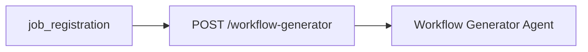
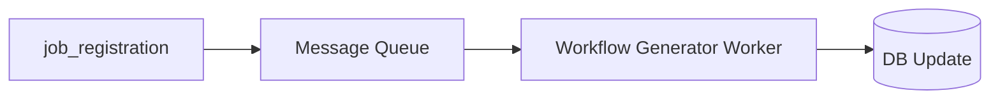

# アーキテクチャレビュー: Issue #305 設計方針書

**レビュー日**: 2025-12-22
**レビュアー**: Claude Code (シニアアーキテクト)
**対象ドキュメント**: `dev-reports/feature/issue/305/design-policy.md`
**Issue**: #305 [expertAgent] Job生成時にLLMワークフローが生成されない

---

## 1. 設計原則の遵守確認

### SOLID原則チェック

| 原則 | 判定 | 評価コメント |
|------|------|-------------|
| **S**ingle Responsibility | ✅ 遵守 | `workflow_generation_node`は「ワークフロー生成」という単一責任を持つ。既存の`job_registration_node`と責務が明確に分離されている |
| **O**pen/Closed | ✅ 遵守 | 既存ノードを変更せず、新規ノードとエッジ追加による拡張。`agent.py`への最小限の変更 |
| **L**iskov Substitution | ✅ 遵守 | `JobTaskGeneratorState`のTypeDict継承パターンは置換可能性を維持。新規フィールドは`total=False`で追加 |
| **I**nterface Segregation | ✅ 遵守 | 必要なインターフェース（`workflow_results`, `workflow_generation_status`）のみ追加。既存インターフェースは変更なし |
| **D**ependency Inversion | ✅ 遵守 | `generate_workflow`関数への依存は抽象化済み。内部呼び出しパターンは適切 |

### その他の原則

| 原則 | 判定 | 評価コメント |
|------|------|-------------|
| **KISS** | ✅ 遵守 | 既存パターン（LangGraph Node、Router）の再利用。新規概念の導入なし |
| **YAGNI** | ✅ 遵守 | キャッシング機能は「将来拡張」として記録のみ。必要最小限の実装範囲 |
| **DRY** | ✅ 遵守 | `generate_workflow`関数の再利用。Workflow Generator Agentの重複実装なし |

**SOLID原則スコア**: 5/5 ✅

---

## 2. アーキテクチャ評価

### 構造的品質

| 評価項目 | スコア(1-5) | コメント |
|---------|------------|----------|
| **モジュール性** | ⭐⭐⭐⭐⭐ (5) | ノード単位での分離が明確。独立してテスト可能 |
| **結合度** | ⭐⭐⭐⭐☆ (4) | 内部関数直接呼び出しによる密結合あり。ただしトレードオフとして許容範囲 |
| **凝集度** | ⭐⭐⭐⭐⭐ (5) | ワークフロー生成ノードは高い凝集度。関連する処理が1箇所に集約 |
| **拡張性** | ⭐⭐⭐⭐☆ (4) | Routerパターンで将来的な分岐拡張が可能。ただしオプション機能（FR-7）は未実装 |
| **保守性** | ⭐⭐⭐⭐⭐ (5) | 既存パターン踏襲により保守が容易。ドキュメントも充実 |

**構造的品質スコア**: 4.6/5 ✅

### パフォーマンス観点

| 項目 | 評価 | コメント |
|------|------|----------|
| **レスポンスタイム予測** | ⚠️ 注意 | 処理時間50-75%増加（90-210秒）は許容範囲だが、UX影響あり |
| **スループット評価** | ✅ 良好 | 並列実行（最大3並列）でスループット維持 |
| **リソース使用効率** | ✅ 良好 | Semaphoreによる並列度制限でリソース使用量を制御 |
| **スケーラビリティ** | ✅ 良好 | 非同期バックグラウンド処理により水平スケール可能 |

**パフォーマンス評価**: 良好（注意点あり）

---

## 3. セキュリティレビュー

### OWASP Top 10 チェック

| 項目 | 判定 | コメント |
|------|------|----------|
| インジェクション対策 | ✅ | Pydantic検証によるユーザー入力のサニタイズ |
| 認証の破綻対策 | ✅ | 既存認証パターン（Admin Token）を踏襲 |
| 機微データの露出対策 | ⚠️ 要確認 | YAML ContentへのAPIキー混入リスクを設計書で認識済み |
| XXE対策 | N/A | YAML処理はGraphAIサーバー側で実施 |
| アクセス制御の不備対策 | ✅ | 既存のX-Admin-Tokenによるアクセス制御 |
| セキュリティ設定ミス対策 | ✅ | 新規環境変数なし。既存設定を継承 |
| XSS対策 | N/A | バックエンドAPI。フロントエンドは別途対応 |
| 安全でないデシリアライゼーション対策 | ✅ | Pydantic BaseModelによる型安全なデシリアライズ |
| 既知の脆弱性対策 | ✅ | 新規依存ライブラリの追加なし |
| ログとモニタリング不足対策 | ✅ | Langfuse統合、ログレベル定義あり |

**セキュリティスコア**: 9/10 ✅

**要確認事項**:
- [ ] ワークフロー生成時のログ出力にAPIキーが含まれないことを実装時に検証

---

## 4. 既存システムとの整合性

### 統合ポイント

| 項目 | 評価 | コメント |
|------|------|----------|
| **API互換性** | ✅ 完全互換 | 既存フィールドは変更なし。新規フィールドはオプショナル |
| **データモデル整合性** | ✅ 完全互換 | `JobTaskGeneratorState`への追加のみ。既存フィールドは影響なし |
| **認証/認可の一貫性** | ✅ 一貫 | 既存のAdmin Token認証パターンを継承 |
| **ログ/監視の統合** | ✅ 一貫 | Langfuse CallbackHandlerパターンを継承 |

### 技術スタックの適合性

| 項目 | 評価 | コメント |
|------|------|----------|
| **既存技術との親和性** | ✅ 高い | LangGraph, asyncio, Pydantic - すべて既存採用済み |
| **チームのスキルセット** | ✅ 適合 | 新規技術導入なし。学習コストゼロ |
| **運用負荷への影響** | ✅ 最小限 | 既存の監視・運用パターンで対応可能 |

**整合性スコア**: 5/5 ✅

---

## 5. リスク評価

| リスク種別 | 内容 | 影響度 | 発生確率 | 対策優先度 | 設計書での対策状況 |
|-----------|------|-------|---------|-----------|------------------|
| **技術的リスク** | 処理時間増加によるタイムアウト | 中 | 高 | 高 | ✅ 並列実行、進捗表示で対策 |
| **技術的リスク** | LLM APIレート制限 | 中 | 中 | 中 | ✅ Semaphore(3)で制御 |
| **運用リスク** | E2Eテスト破壊 | 高 | 高 | 高 | ✅ モック追加、段階的導入を計画 |
| **運用リスク** | メモリ使用量増加 | 低 | 低 | 低 | ✅ 並列度制限で対策 |
| **セキュリティリスク** | YAML内への機密情報混入 | 中 | 低 | 中 | ⚠️ 認識済み、実装時検証必要 |
| **ビジネスリスク** | ユーザー体験悪化（待ち時間増） | 中 | 高 | 高 | ✅ 進捗表示改善で緩和 |

**リスク対策状況**: 主要リスクは認識・対策済み ✅

---

## 6. 改善提案

### 必須改善項目（Must Fix）

**なし** - 設計方針に重大な問題は検出されませんでした。

### 推奨改善項目（Should Fix）

#### SF-1: タイムアウト設定の明確化

**現状**: タイムアウト設定への言及なし

**提案**: ワークフロー生成ノードにタイムアウト設定を追加

```python
WORKFLOW_GENERATION_TIMEOUT_PER_TASK = 90  # 秒
WORKFLOW_GENERATION_TOTAL_TIMEOUT = 300   # 秒（5分）

async def workflow_generation_node(state):
    async with asyncio.timeout(WORKFLOW_GENERATION_TOTAL_TIMEOUT):
        ...
```

**理由**: 長時間ハングアップを防止し、予測可能な障害処理を実現

#### SF-2: 進捗コールバックの追加

**現状**: 進捗率計算の改善は記載あるが、リアルタイム更新の詳細なし

**提案**: ワークフロー生成中の進捗コールバック

```python
async def workflow_generation_node(state, progress_callback=None):
    for i, task in enumerate(task_masters):
        if progress_callback:
            progress_callback(70 + (i / len(task_masters)) * 25)  # 70-95%
        ...
```

**理由**: ユーザー体験向上（長時間処理中の進捗可視化）

### 検討事項（Consider）

#### C-1: サーキットブレーカーパターンの検討

**背景**: LLM API障害時の連鎖障害防止

**提案**: 連続失敗時に一時的にワークフロー生成をスキップ

**優先度**: 低（将来的な拡張として記録）

#### C-2: ワークフロー生成のオプション化（FR-7の早期実装検討）

**背景**: 処理時間増加によるUX影響

**提案**: `skip_workflow_generation`パラメータを初期リリースに含める

**優先度**: 中（デバッグ・テスト効率化のため）

---

## 7. ベストプラクティスとの比較

### 業界標準との差異

| 項目 | 業界標準 | 本設計 | 評価 |
|------|---------|--------|------|
| **ワークフローエンジン** | Temporal, Airflow | LangGraph | ✅ ユースケースに適合 |
| **非同期処理** | Celery, RQ | BackgroundTasks | ✅ 規模に適合 |
| **オブザーバビリティ** | OpenTelemetry | Langfuse | ✅ LLM特化で適切 |
| **エラーハンドリング** | Circuit Breaker | Retry + Partial Success | ⚠️ 基本は十分、拡張余地あり |

### 代替アーキテクチャ案

#### 代替案1: API経由呼び出し



**メリット**:
- サービス分離
- 独立スケール可能
- 障害分離

**デメリット**:
- HTTPオーバーヘッド
- トレース分断リスク
- 複雑性増加

**判定**: ❌ 不採用 - 現段階では過剰設計

#### 代替案2: イベント駆動（非同期）



**メリット**:
- 完全な非同期処理
- スケーラビリティ向上
- 障害時のリトライ容易

**デメリット**:
- インフラ追加（Redis/RabbitMQ）
- 実装複雑化
- 状態同期の課題

**判定**: ❌ 不採用 - YAGNI原則。将来的な拡張オプションとして記録

---

## 8. 総合評価

### レビューサマリ

| カテゴリ | スコア | 評価 |
|---------|--------|------|
| SOLID原則 | 5/5 | ✅ 優秀 |
| 構造的品質 | 4.6/5 | ✅ 優秀 |
| セキュリティ | 9/10 | ✅ 良好 |
| 整合性 | 5/5 | ✅ 優秀 |
| リスク対策 | 4/5 | ✅ 良好 |

### 全体評価

**⭐⭐⭐⭐☆（4.5/5）**

### 強み

1. **既存パターンの徹底的な活用**: LangGraph Node、Router、TypedDict Stateなど既存パターンを100%再利用
2. **明確な責務分離**: SRPに基づく新規ノード設計
3. **後方互換性の確保**: 既存APIクライアントへの影響ゼロ
4. **包括的なリスク分析**: 主要リスクの認識と対策計画
5. **適切な技術選定**: 新規依存ライブラリなし、学習コストゼロ

### 弱み

1. **処理時間増加**: 50-75%の処理時間増加は避けられない（緩和策あり）
2. **密結合**: 内部関数直接呼び出しによる密結合（トレードオフとして許容）
3. **タイムアウト設定の不明確さ**: 明示的なタイムアウト値の定義が不足

### 総評

本設計は、既存アーキテクチャとの整合性を維持しながら、必要な機能を最小限の変更で実現する優れた設計です。SOLID原則を遵守し、既存パターンを徹底的に再利用することで、保守性と拡張性を確保しています。

主要なリスク（処理時間増加、LLM API障害、テスト破壊）は認識・対策されており、実装段階での追加検討事項（タイムアウト設定、進捗コールバック）も明確です。

---

## 承認判定

### ✅ 条件付き承認（Conditionally Approved）

以下の条件を満たした上で実装を開始してください：

1. **実装時確認事項**:
   - [ ] ワークフロー生成ログにAPIキーが含まれないことを検証
   - [ ] タイムアウト設定（推奨: タスク単位90秒、全体5分）を実装

2. **推奨対応**（実装中に検討）:
   - [ ] 進捗コールバックの追加検討
   - [ ] `skip_workflow_generation`オプションの初期リリース検討

---

## 次のステップ

1. **設計方針書の軽微更新**: タイムアウト設定値を明記
2. **実装着手**: 高優先度ファイルから順次実装
   - `state.py` → `workflow_generation.py` → `agent.py` → `job_generator.py`
3. **テスト作成**: 単体テスト → E2Eテスト更新
4. **PR作成**: `feature/issue/305` ブランチからdevelopへ

---

_レビュー完了日: 2025-12-22_
_レビュアー: Claude Code (シニアアーキテクト)_
