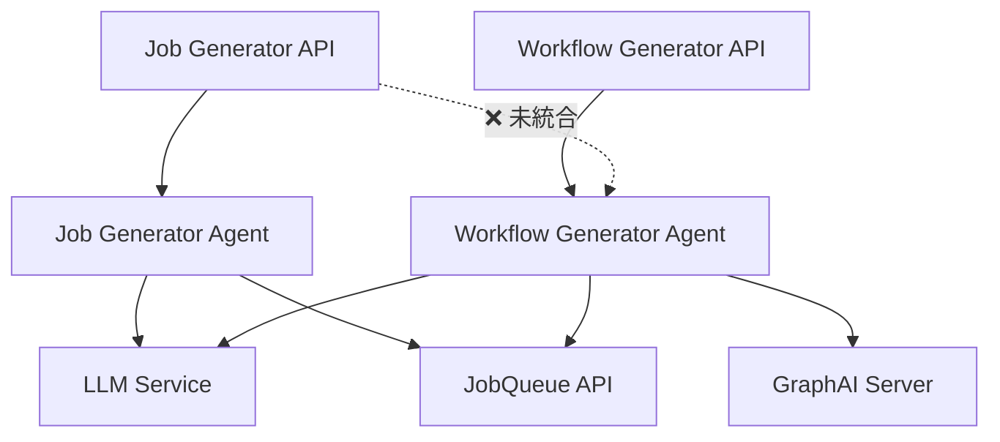

# 設計方針書: Job生成時のワークフロー自動生成統合

**作成日**: 2025-12-22
**ブランチ**: feature/issue/305
**担当**: Claude Code
**Issue**: #305 [expertAgent] Job生成時にLLMワークフローが生成されない

---

## 現状調査サマリ

### 対象プロジェクト

- **プロジェクト名**: expertAgent
- **主要モジュール**:
  - `expertAgent/aiagent/langgraph/jobTaskGeneratorAgents/` - Job Generator エージェント
  - `expertAgent/aiagent/langgraph/workflowGeneratorAgents/` - Workflow Generator エージェント
  - `expertAgent/app/api/v1/job_generator_endpoints.py` - Job Generator API

### 既存アーキテクチャパターン

| パターン | 使用箇所 | 目的 |
|---------|---------|------|
| **LangGraph StateGraph** | jobTaskGeneratorAgents, workflowGeneratorAgents | 状態駆動型ワークフロー管理 |
| **TypedDict State** | `JobTaskGeneratorState`, `WorkflowGeneratorState` | 型安全な状態管理 |
| **条件付きエッジ (Router)** | `evaluator_router`, `validator_router` | 動的なフロー分岐 |
| **シングルトンサービス** | `LangfuseService` | アプリケーション全体での共有リソース |
| **非同期バックグラウンド処理** | `BackgroundTasks` | 即座のレスポンス返却 |

### 類似機能の設計

#### Job Generator Agent (7ノード構成)
```
START → requirement_analysis → evaluator → interface_definition
      → schema_enrichment → master_creation → validation → job_registration → END
```

#### Workflow Generator Agent (5ノード構成)
```
START → generator → sample_input_generator → workflow_tester
      → validator → (self_repair ↔ generator) → END
```

### モジュール間依存関係



### 既存API設計パターン

| 項目 | パターン |
|------|---------|
| エンドポイント命名規則 | `/api/v1/{resource}` (REST準拠) |
| レスポンス形式 | Pydantic BaseModel (JSON シリアライズ) |
| エラーハンドリング | HTTPException + error_message フィールド |
| 非同期処理 | BackgroundTasks + ポーリングAPI |
| Langfuse統合 | CallbackHandler + trace_id 抽出 |

### 参照したドキュメント

| ドキュメント | 関連する内容 |
|-------------|-------------|
| `docs/spec/job-generation-workflow.md` | 7段階ワークフローの詳細仕様 |
| `docs/arch/service-dependencies.md` | サービス間依存関係 |
| `docs/design/architecture-overview.md` | システム全体構成 |
| `expertAgent/docs/API_REFERENCE.md` | API仕様 |

### 設計上の制約

1. **LangGraphノード構成**: 既存7ノード + 新規1ノードで8ノード構成
2. **状態サイズ**: `JobTaskGeneratorState`への追加フィールドによるメモリ使用量増加
3. **処理時間**: ワークフロー生成追加により全体処理時間が2-3倍に増加
4. **Langfuse統合**: 既存のtrace_id管理パターンを維持

---

## アーキテクチャ設計

### システム構成図

```mermaid
graph TB
    subgraph "Client Layer"
        UI[myAgentDesk UI]
    end

    subgraph "API Layer"
        API[POST /api/v1/job-generator]
        STATUS[GET /api/v1/jobs/{id}/status]
    end

    subgraph "LangGraph Agent - Job/Task Generator"
        N1[1. requirement_analysis]
        N2[2. evaluator]
        N3[3. interface_definition]
        N4[4. schema_enrichment]
        N5[5. master_creation]
        N6[6. validation]
        N7[7. job_registration]
        N8[8. workflow_generation<br/>🆕 新規追加]
    end

    subgraph "Workflow Generator (内部呼び出し)"
        WG1[generator]
        WG2[sample_input_generator]
        WG3[workflow_tester]
        WG4[validator]
        WG5[self_repair]
    end

    subgraph "External Services"
        LLM[Anthropic API]
        JQ[JobQueue API]
        GAS[GraphAI Server]
        LF[Langfuse]
    end

    UI --> API
    API --> N1
    N1 --> N2 --> N3 --> N4 --> N5 --> N6 --> N7 --> N8
    N8 --> WG1 --> WG2 --> WG3 --> WG4
    WG4 -.->|retry| WG5 --> WG1

    N8 --> API
    UI --> STATUS

    N1 --> LLM
    N2 --> LLM
    N3 --> LLM
    WG1 --> LLM
    N5 --> JQ
    N7 --> JQ
    WG3 --> GAS
    API --> LF

    style N8 fill:#90EE90
```

### レイヤー構成（既存踏襲）

```
expertAgent/
├── app/
│   └── api/v1/
│       └── job_generator_endpoints.py    # API層（変更最小化）
├── aiagent/
│   └── langgraph/
│       ├── jobTaskGeneratorAgents/
│       │   ├── agent.py                  # グラフ定義（エッジ追加）
│       │   ├── state.py                  # 状態定義（フィールド追加）
│       │   └── nodes/
│       │       ├── job_registration.py   # 既存ノード
│       │       └── workflow_generation.py # 🆕 新規ノード
│       └── workflowGeneratorAgents/
│           └── agent.py                  # generate_workflow（内部呼び出し）
└── tests/
    ├── unit/
    │   └── test_workflow_generation_node.py  # 🆕 新規テスト
    └── integration/
        └── test_e2e_workflow.py              # 既存テスト更新
```

---

## 技術選定

| カテゴリ | 選定技術 | 選定理由 | 既存との整合性 |
|---------|---------|---------|---------------|
| ワークフローエンジン | LangGraph | 既存採用済み、状態駆動型 | ✅ 完全互換 |
| 状態管理 | TypedDict | 既存パターン踏襲 | ✅ 完全互換 |
| 非同期処理 | asyncio | 既存パターン踏襲 | ✅ 完全互換 |
| トレーシング | Langfuse CallbackHandler | Issue #278で実装済み | ✅ 完全互換 |
| 並列処理 | asyncio.gather | タスク並列実行に最適 | ✅ 互換 |

### 新規技術導入: なし

既存の技術スタックで完全に対応可能。新規ライブラリの追加は不要。

---

## 設計パターン

### 採用するパターン（既存踏襲）

#### 1. LangGraph Node パターン

```python
async def workflow_generation_node(
    state: JobTaskGeneratorState
) -> JobTaskGeneratorState:
    """ワークフロー生成ノード.

    既存ノードと同一のシグネチャを維持。
    """
    # 1. 入力検証
    task_masters = state.get("task_masters", [])
    if not task_masters:
        return {**state, "error_message": "No task masters available"}

    # 2. 処理（各タスクのワークフロー生成）
    workflow_results = []
    for task in task_masters:
        result = await generate_workflow(...)
        workflow_results.append(result)

    # 3. 状態更新
    return {
        **state,
        "workflow_results": workflow_results,
        "workflow_generation_status": "completed",
    }
```

#### 2. Router パターン（条件付きエッジ）

```python
def workflow_generation_router(
    state: JobTaskGeneratorState
) -> Literal["END"]:
    """ワークフロー生成後のルーティング.

    Issue #305では常にENDに遷移。将来的な拡張ポイント。
    """
    return "END"
```

#### 3. 内部関数直接呼び出しパターン

```python
# ❌ API経由（オーバーヘッド大）
# response = await http_client.post("/api/v1/workflow-generator", ...)

# ✅ 内部関数直接呼び出し（推奨）
from aiagent.langgraph.workflowGeneratorAgents.agent import generate_workflow

final_state = await generate_workflow(
    task_master_id=task_master_id,
    task_data=task_data,
    max_retry=3,
    callback_handler=callback_handler,
)
```

### 設計判断: API経由 vs 直接呼び出し

| 方式 | メリット | デメリット | 採用 |
|------|---------|----------|------|
| **API経由** | サービス分離、独立スケール | オーバーヘッド、複雑性増 | ❌ |
| **直接呼び出し** | 低レイテンシ、シンプル | 密結合 | ✅ |

**理由**:
- 同一プロセス内での呼び出しであり、HTTP通信のオーバーヘッドは不要
- `generate_workflow`関数は既に非同期設計
- Langfuse CallbackHandler の共有が容易

---

## データモデル設計

### 状態スキーマ拡張

```python
# expertAgent/aiagent/langgraph/jobTaskGeneratorAgents/state.py

class JobTaskGeneratorState(TypedDict, total=False):
    # ... 既存フィールド ...

    # ===== Workflow Generation (新規追加) =====
    workflow_results: list[dict[str, Any]]
    """各タスクのワークフロー生成結果リスト.

    構造:
    [
        {
            "task_master_id": "tm_xxx",
            "status": "success" | "failed",
            "yaml_content": "---\nname: ...",
            "workflow_name": "task_name",
            "error_message": None | "エラー内容",
            "retry_count": 0
        },
        ...
    ]
    """

    workflow_generation_status: str
    """ワークフロー生成全体のステータス.

    - "pending": 未実行
    - "in_progress": 実行中
    - "completed": 全タスク成功
    - "partial_success": 一部成功
    - "failed": 全タスク失敗
    """

    failed_workflow_tasks: list[str]
    """ワークフロー生成に失敗したタスクIDリスト."""
```

### レスポンススキーマ拡張

```python
# expertAgent/app/schemas/job_generator.py

class JobGeneratorResponse(BaseModel):
    # ... 既存フィールド ...

    # ===== Workflow Generation (新規追加) =====
    workflow_generation_status: str | None = Field(
        default=None,
        description="Workflow generation status: pending, completed, partial_success, failed",
    )

    workflow_results: list[dict[str, Any]] = Field(
        default_factory=list,
        description="List of workflow generation results per task",
    )

    failed_workflow_tasks: list[str] = Field(
        default_factory=list,
        description="List of task IDs that failed workflow generation",
    )
```

---

## API設計

### エンドポイント変更（後方互換）

既存エンドポイントは変更なし。レスポンスに新規フィールドを追加（オプショナル）。

#### POST /api/v1/job-generator

**リクエスト（変更なし）**:
```json
{
  "user_requirement": "PDFをGoogle Driveにアップロードしてメール通知",
  "max_retry": 5
}
```

**レスポンス（拡張）**:
```json
{
  "status": "success",
  "job_id": "550e8400-...",
  "job_master_id": "jm_01K89W9...",
  "task_breakdown": [...],
  "evaluation_result": {...},
  "langfuse_trace_id": "trace-abc123",

  // 🆕 新規フィールド
  "workflow_generation_status": "completed",
  "workflow_results": [
    {
      "task_master_id": "tm_xxx",
      "status": "success",
      "workflow_name": "upload_pdf_to_drive",
      "yaml_content": "---\nname: upload_pdf_to_drive\n..."
    },
    {
      "task_master_id": "tm_yyy",
      "status": "success",
      "workflow_name": "send_notification_email",
      "yaml_content": "---\nname: send_notification_email\n..."
    }
  ],
  "failed_workflow_tasks": []
}
```

### 進捗率API拡張

#### GET /api/v1/jobs/{job_id}/status

**レスポンス（拡張）**:
```json
{
  "job_id": "550e8400-...",
  "status": "creating",
  "progress": 75,
  "current_phase": "workflow_generation",  // 🆕 新規フィールド
  "phases": {  // 🆕 新規フィールド
    "langgraph": {"progress": 100, "status": "completed"},
    "workflow_generation": {"progress": 50, "status": "in_progress"}
  }
}
```

---

## セキュリティ設計

### 既存方式の踏襲

| 項目 | 方式 | 備考 |
|------|------|------|
| API認証 | Admin Token (X-Admin-Token) | 変更なし |
| シークレット管理 | myVault連携 | 変更なし |
| Langfuse認証 | 環境変数 + myVaultフォールバック | 変更なし |

### 追加考慮事項

- **YAML Content**: GraphAI YAML内に機密情報が含まれないことを確認
- **ログ出力**: ワークフロー生成時のログにAPIキー等が含まれないよう注意

---

## パフォーマンス設計

### 処理時間見積もり

| フェーズ | 現在 | 変更後 | 増加率 |
|---------|------|--------|--------|
| LangGraph処理 | 60-120秒 | 60-120秒 | 0% |
| ワークフロー生成 | 0秒 | 30-90秒 | 🆕 |
| **合計** | 60-120秒 | 90-210秒 | +50-75% |

### 最適化戦略

#### 1. 並列ワークフロー生成

```python
async def workflow_generation_node(state: JobTaskGeneratorState) -> JobTaskGeneratorState:
    task_masters = state.get("task_masters", [])

    # 並列実行（最大3並列）
    semaphore = asyncio.Semaphore(3)

    async def generate_with_limit(task):
        async with semaphore:
            return await generate_workflow(...)

    results = await asyncio.gather(
        *[generate_with_limit(task) for task in task_masters],
        return_exceptions=True
    )

    return {**state, "workflow_results": results}
```

#### 2. 進捗率計算の改善

```python
# 進捗配分
PROGRESS_PHASES = {
    "initialization": (0, 10),
    "langgraph_processing": (10, 70),
    "workflow_generation": (70, 95),
    "finalization": (95, 100),
}
```

### キャッシング戦略

- **検討のみ**: 類似タスクのワークフローテンプレートキャッシュ
- **今回は実装しない**: YAGNI原則に基づき、将来の拡張として記録

---

## 設計判断とトレードオフ

### DJ-1: ノード追加 vs ルーター分岐

| 選択肢 | 説明 | メリット | デメリット |
|--------|------|---------|----------|
| **A: 新規ノード追加** | `workflow_generation`ノードを追加 | 明確な責務分離、テスト容易 | ノード数増加 |
| B: job_registration拡張 | 既存ノード内で処理 | ノード数維持 | 責務混在、テスト困難 |

**決定**: A（新規ノード追加）

**理由**: 単一責任原則（SRP）に従い、ワークフロー生成は独立したノードとして実装

### DJ-2: 同期処理 vs 非同期処理

| 選択肢 | 説明 | メリット | デメリット |
|--------|------|---------|----------|
| **A: 同期処理（シーケンシャル）** | LangGraph終了後にワークフロー生成 | シンプル、デバッグ容易 | 処理時間増加 |
| B: 非同期処理（バックグラウンド） | 別タスクで並列実行 | 高速レスポンス | 状態管理複雑化 |

**決定**: A（同期処理）

**理由**:
- 既存の非同期バックグラウンド処理パターンと整合
- ステータスAPIで進捗確認可能
- 実装複雑性の回避

### DJ-3: 全タスク生成 vs 選択的生成

| 選択肢 | 説明 | メリット | デメリット |
|--------|------|---------|----------|
| **A: 全タスク生成** | 全TaskMasterのワークフローを生成 | 一貫性、即使用可能 | 処理時間増加 |
| B: オンデマンド生成 | 実行時に初めて生成 | 初期処理短縮 | 実行時遅延 |

**決定**: A（全タスク生成）

**理由**: ユーザー体験優先。Job生成完了 = 即実行可能な状態を目指す

### DJ-4: エラー時の振る舞い

| 選択肢 | 説明 | 採用 |
|--------|------|------|
| A: 全体失敗 | 1タスク失敗で全体失敗 | ❌ |
| **B: 部分成功** | 成功タスクは保持、失敗タスクのみ記録 | ✅ |
| C: リトライ後失敗 | 全タスク再試行後に失敗判定 | ❌ |

**決定**: B（部分成功）

**理由**: 一部タスクの失敗が他タスクに影響しないよう設計。`partial_success`ステータスで報告。

---

## 制約条件チェック結果

### コード品質原則

- [x] **SOLID原則**: 遵守
  - SRP: workflow_generation_nodeは単一責任
  - OCP: 既存ノードを変更せず拡張
  - LSP: 既存State型を継承・拡張
  - ISP: 必要なインターフェースのみ追加
  - DIP: generate_workflow関数への依存（抽象化済み）
- [x] **KISS原則**: 遵守 - 既存パターンの再利用
- [x] **YAGNI原則**: 遵守 - 必要最小限の機能のみ
- [x] **DRY原則**: 遵守 - generate_workflow関数の再利用

### アーキテクチャガイドライン

- [x] `architecture-overview.md`: 準拠 - レイヤー構成維持
- [x] レイヤー分離: 遵守 - API層・Agent層を分離

### 設定管理ルール

- [x] 環境変数: 遵守 - 新規環境変数なし
- [x] myVault: 遵守 - 既存のシークレット管理パターン維持

### 品質担保方針

- [ ] 単体テストカバレッジ: 90%以上（実装後確認）
- [ ] 結合テストカバレッジ: 50%以上（実装後確認）
- [x] Ruff linting: エラーゼロ目標
- [x] MyPy type checking: エラーゼロ目標

### CI/CD準拠

- [x] PRラベル: `bug`, `project: expertAgent` を付与予定
- [x] コミットメッセージ: 規約に準拠
- [ ] pre-push-check-all.sh: 実装完了後に実行

### 参照ドキュメント遵守

- [x] `job-generation-workflow.md`: 7段階ワークフロー仕様を理解
- [x] `service-dependencies.md`: サービス間依存関係を把握

### 違反・要検討項目

**なし**

---

## 参照ドキュメント

| ドキュメント | 参照目的 |
|-------------|---------|
| [job-generation-workflow.md](../../../docs/spec/job-generation-workflow.md) | 7段階ワークフロー仕様 |
| [service-dependencies.md](../../../docs/arch/service-dependencies.md) | サービス間依存関係 |
| [architecture-overview.md](../../../docs/design/architecture-overview.md) | システム全体構成 |
| [API_REFERENCE.md](../../docs/API_REFERENCE.md) | API仕様 |
| [requirements-definition.md](./requirements-definition.md) | Issue #305 要件定義書 |

---

## 実装ファイル一覧

### 修正対象

| ファイル | 修正内容 | 優先度 |
|----------|---------|--------|
| `expertAgent/aiagent/langgraph/jobTaskGeneratorAgents/agent.py` | ノード追加、エッジ定義 | 高 |
| `expertAgent/aiagent/langgraph/jobTaskGeneratorAgents/state.py` | 状態フィールド追加 | 高 |
| `expertAgent/app/schemas/job_generator.py` | レスポンススキーマ拡張 | 高 |
| `expertAgent/app/api/v1/job_generator_endpoints.py` | 進捗率計算調整 | 中 |
| `expertAgent/tests/integration/test_e2e_workflow.py` | E2Eテスト更新 | 高 |

### 新規作成

| ファイル | 内容 | 優先度 |
|----------|------|--------|
| `expertAgent/aiagent/langgraph/jobTaskGeneratorAgents/nodes/workflow_generation.py` | ワークフロー生成ノード | 高 |
| `expertAgent/tests/unit/test_workflow_generation_node.py` | 単体テスト | 高 |

---

_作成日: 2025-12-22_
_対象Issue: #305_
