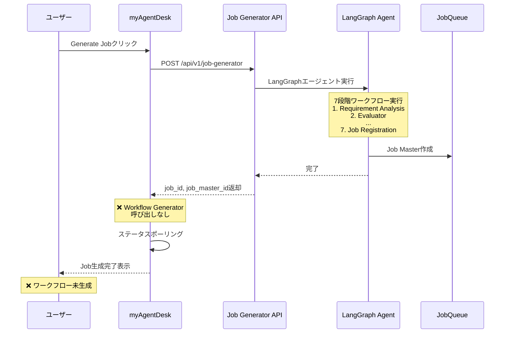

# 要件定義書: Job生成時にLLMワークフローを自動生成する機能

## Issue情報
- **Issue番号**: #305
- **タイトル**: [expertAgent] Job生成時にLLMワークフローが生成されない
- **ラベル**: bug
- **対象プロジェクト**: expertAgent, myAgentDesk

---

## 現状調査サマリ

### 対象プロジェクト
- **プロジェクト名**: expertAgent（主）, myAgentDesk（副）
- **関連モジュール**:
  - `expertAgent/app/api/v1/job_generator_endpoints.py` - Job Generator API
  - `expertAgent/aiagent/langgraph/jobTaskGeneratorAgents/` - LangGraphエージェント
  - `myAgentDesk/src/routes/projects/[projectId]/workbenches/[workbenchId]/generate/+page.server.ts` - フロントエンド

### 問題の根本原因

**Job GeneratorとWorkflow Generatorが独立したAPIとして設計されており、統合されていない。**

| 処理 | 対応するAPI | 呼び出し元 | 状態 |
|------|-----------|---------|------|
| Job/Task生成（LLM分析） | `POST /api/v1/job-generator` | myAgentDesk | ✅ 実装済み |
| Task/Job Master作成 | JobqueueAPI（内部） | Job Generator内部 | ✅ 実装済み |
| **ワークフロー生成** | `POST /api/v1/workflow-generator` | **呼び出し元なし** | ❌ 未統合 |
| Job実行 | JobqueueAPI（内部） | Job Generator内部 | ✅ 実装済み |

### 現在の処理フロー（問題のある状態）



### 既存の類似機能
- **Workflow Generator API** (`POST /api/v1/workflow-generator`): 単独で呼び出し可能だが、Job Generator完了後に自動呼び出しされない
- **LangGraph workflowGeneratorAgents**: GraphAI YAML生成のためのエージェント実装あり

### 使用されている設計パターン
- **LangGraphエージェント**: 状態グラフベースの多段階処理
- **非同期バックグラウンド処理**: job_id即座返却 + ポーリングによる進捗確認
- **シングルトンサービス**: LangfuseService等

### 参照したドキュメント
- `docs/spec/job-generation-workflow.md`: 7段階ワークフローの詳細仕様
- `docs/arch/service-dependencies.md`: サービス間依存関係
- `expertAgent/docs/API_REFERENCE.md`: API仕様

### 制約事項
1. **LangGraphエージェントの終了地点**: 現在は`job_registration`ノードで終了
2. **Workflow Generator APIの独立性**: `job_master_id`または`task_master_id`を引数として受け取る設計
3. **ワークフロー生成の処理時間**: 1タスクあたり30-60秒程度（LLM呼び出し含む）

---

## ユーザーストーリー

### メインストーリー

```
As a myAgentDeskユーザー
I want to Job生成完了時に各タスクのGraphAIワークフローも自動生成される
So that 生成したJobをそのまま実行可能な状態で利用できる
```

### 補助ストーリー

```
As a myAgentDeskユーザー
I want to ワークフロー生成の進捗を確認できる
So that 長時間処理の状況を把握できる
```

```
As a 開発者
I want to ワークフロー生成の失敗時にリトライできる
So that 一時的なエラーで全体が失敗しないようにできる
```

---

## 受入条件（Acceptance Criteria）

### AC1: 基本フロー - 自動ワークフロー生成

```gherkin
Given myAgentDeskのGenerate画面でJob生成が完了した状態
When Job Generatorの処理が正常終了する
Then 各TaskMasterに対してGraphAIワークフローYAMLが自動生成される
And 生成されたワークフローがWorkflowMasterに保存される
And Review画面でワークフローを確認できる
```

### AC2: 進捗表示

```gherkin
Given Job生成が開始された状態
When ワークフロー生成処理が進行中
Then 進捗率にワークフロー生成フェーズが反映される
And ステータスAPIでワークフロー生成の進捗を確認できる
```

### AC3: エラーハンドリング

```gherkin
Given ワークフロー生成中にLLM APIエラーが発生した場合
When 最大リトライ回数（3回）に達する
Then エラーステータスがレスポンスに含まれる
And Job生成自体は成功として記録される（partial_success）
And 失敗したタスクのリストが返却される
```

### AC4: Langfuseトレーシング

```gherkin
Given ワークフロー生成が実行される
When 処理が完了する
Then Langfuseにワークフロー生成のトレースが記録される
And Job生成のtrace_idとワークフロー生成のtrace_idが関連付けられる
```

### AC5: 後方互換性

```gherkin
Given 既存のJob Generator APIを使用するクライアント
When 従来と同じリクエストを送信する
Then 既存のレスポンス形式が維持される
And 追加フィールドとしてworkflow_generationステータスが含まれる
```

---

## 機能要件

### 必須機能（Must Have）

#### FR-1: LangGraphエージェントへのワークフロー生成ノード追加

| 項目 | 内容 |
|------|------|
| **概要** | Job Generatorの`job_registration`ノード後に`workflow_generation`ノードを追加 |
| **対象ファイル** | `expertAgent/aiagent/langgraph/jobTaskGeneratorAgents/agent.py` |
| **処理内容** | 各TaskMasterに対してWorkflow Generator APIを呼び出し |
| **エッジ定義** | `job_registration` → `workflow_generation` → END |

#### FR-2: ワークフロー生成ノードの実装

| 項目 | 内容 |
|------|------|
| **概要** | 新規ノード`workflow_generation_node`の実装 |
| **対象ファイル** | `expertAgent/aiagent/langgraph/jobTaskGeneratorAgents/nodes/workflow_generation.py`（新規） |
| **入力** | `job_master_id`, `task_masters`リスト |
| **出力** | 各タスクのワークフロー生成結果 |
| **エラー処理** | 個別タスク失敗時も他タスクの処理を継続 |

#### FR-3: 状態スキーマの拡張

| 項目 | 内容 |
|------|------|
| **概要** | `JobTaskGeneratorState`にワークフロー生成関連フィールドを追加 |
| **対象ファイル** | `expertAgent/aiagent/langgraph/jobTaskGeneratorAgents/state.py` |
| **追加フィールド** | `workflow_results: list[dict]`, `workflow_errors: list[dict]` |

#### FR-4: レスポンススキーマの拡張

| 項目 | 内容 |
|------|------|
| **概要** | `JobGeneratorResponse`にワークフロー生成結果を追加 |
| **対象ファイル** | `expertAgent/app/schemas/job_generator.py` |
| **追加フィールド** | `workflow_generation_status`, `workflow_results`, `failed_workflow_tasks` |

#### FR-5: 進捗率の調整

| 項目 | 内容 |
|------|------|
| **概要** | 進捗率計算にワークフロー生成フェーズを含める |
| **対象ファイル** | `expertAgent/app/api/v1/job_generator_endpoints.py` |
| **進捗配分** | LangGraph処理（0-70%）、ワークフロー生成（70-95%）、完了処理（95-100%） |

### あると良い機能（Nice to Have）

#### FR-6: ワークフロー生成の並列実行

| 項目 | 内容 |
|------|------|
| **概要** | 複数タスクのワークフロー生成を並列で実行 |
| **効果** | 3タスク × 30秒 → 30秒程度に短縮 |
| **実装方式** | `asyncio.gather()`による並列呼び出し |

#### FR-7: ワークフロー生成のスキップオプション

| 項目 | 内容 |
|------|------|
| **概要** | リクエストパラメータでワークフロー生成をスキップ可能にする |
| **パラメータ** | `skip_workflow_generation: bool = False` |
| **用途** | クイックテスト、デバッグ時 |

### 将来的な拡張（Future Enhancement）

#### FR-8: ワークフローテンプレート機能

| 項目 | 内容 |
|------|------|
| **概要** | 類似タスクに対してキャッシュされたテンプレートを適用 |
| **効果** | LLM呼び出し削減、処理時間短縮 |

---

## 非機能要件

### NFR-1: パフォーマンス

| 項目 | 要件 |
|------|------|
| **ワークフロー生成時間** | 1タスクあたり60秒以内 |
| **全体処理時間** | 5タスクの場合、Job生成 + ワークフロー生成で5分以内 |
| **並列度** | 最大3タスク並列（LLM APIレート制限考慮） |

### NFR-2: 信頼性

| 項目 | 要件 |
|------|------|
| **リトライ回数** | 各タスクのワークフロー生成で最大3回 |
| **部分成功** | 一部タスクが失敗しても他は正常に完了 |
| **べき等性** | 同一job_master_idでの再実行をサポート |

### NFR-3: 可観測性

| 項目 | 要件 |
|------|------|
| **Langfuseトレーシング** | ワークフロー生成ごとにspanを記録 |
| **ログ出力** | INFO: 開始/完了、WARNING: リトライ、ERROR: 最終失敗 |
| **メトリクス** | 成功率、処理時間、リトライ回数 |

### NFR-4: 後方互換性

| 項目 | 要件 |
|------|------|
| **API互換性** | 既存クライアントが追加フィールドを無視できる |
| **レスポンス形式** | 既存フィールドの型・構造を変更しない |

---

## 技術的制約

### TC-1: 既存アーキテクチャの制約

| 制約 | 内容 |
|------|------|
| **LangGraphノード追加** | 既存の7ノード構成に1ノード追加（影響最小化） |
| **Workflow Generator API** | 既存APIを内部呼び出し（再実装しない） |
| **状態管理** | `job_state_manager`の既存インターフェースを維持 |

### TC-2: 外部サービス依存

| 依存先 | 制約 |
|--------|------|
| **Anthropic API** | レート制限: 60 RPM（Claude Sonnet） |
| **JobQueue API** | TaskMaster取得・更新 |
| **Langfuse** | トレーシング送信（非同期） |

### TC-3: データ整合性

| 制約 | 内容 |
|------|------|
| **トランザクション** | ワークフロー生成失敗時もJob/TaskMaster削除しない |
| **状態遷移** | `creating` → `completed`/`partial_success`/`failed` |

---

## リスクと対策

### R-1: 処理時間の増加

| 項目 | 内容 |
|------|------|
| **リスク** | ワークフロー生成追加により全体処理時間が大幅増加 |
| **影響度** | 中 |
| **発生確率** | 高 |
| **対策** | 並列実行（FR-6）、進捗表示改善（FR-5） |

### R-2: LLM APIエラー

| 項目 | 内容 |
|------|------|
| **リスク** | Anthropic APIのレート制限・一時障害 |
| **影響度** | 中 |
| **発生確率** | 中 |
| **対策** | リトライ機構（NFR-2）、部分成功サポート |

### R-3: 既存テストの破壊

| 項目 | 内容 |
|------|------|
| **リスク** | LangGraphエージェント変更により既存E2Eテストが失敗 |
| **影響度** | 高 |
| **発生確率** | 高 |
| **対策** | モック追加、テストケース更新、段階的導入 |

### R-4: メモリ使用量増加

| 項目 | 内容 |
|------|------|
| **リスク** | 並列ワークフロー生成によるメモリ使用量増加 |
| **影響度** | 低 |
| **発生確率** | 低 |
| **対策** | 並列度制限（最大3）、ストリーミング処理検討 |

---

## 参照ドキュメント

| ドキュメント | 関連する内容 |
|-------------|-------------|
| [job-generation-workflow.md](../../docs/spec/job-generation-workflow.md) | 7段階LangGraphワークフローの詳細仕様 |
| [service-dependencies.md](../../docs/arch/service-dependencies.md) | サービス間依存関係、API統合 |
| [API_REFERENCE.md](./docs/API_REFERENCE.md) | Job Generator API、Workflow Generator API仕様 |
| [GRAPHAI_WORKFLOW_GENERATION_RULES.md](../../graphAiServer/docs/GRAPHAI_WORKFLOW_GENERATION_RULES.md) | GraphAIワークフロー生成ルール |

---

## 実装対象ファイル一覧

### 修正対象

| ファイル | 修正内容 |
|----------|---------|
| `expertAgent/aiagent/langgraph/jobTaskGeneratorAgents/agent.py` | ワークフロー生成ノード追加、エッジ定義 |
| `expertAgent/aiagent/langgraph/jobTaskGeneratorAgents/state.py` | 状態スキーマ拡張 |
| `expertAgent/app/schemas/job_generator.py` | レスポンススキーマ拡張 |
| `expertAgent/app/api/v1/job_generator_endpoints.py` | 進捗率調整 |
| `expertAgent/tests/integration/test_e2e_workflow.py` | E2Eテスト更新 |

### 新規作成

| ファイル | 内容 |
|----------|------|
| `expertAgent/aiagent/langgraph/jobTaskGeneratorAgents/nodes/workflow_generation.py` | ワークフロー生成ノード |
| `expertAgent/tests/unit/test_workflow_generation_node.py` | 単体テスト |

---

## 見積もり

| 項目 | 工数目安 |
|------|---------|
| FR-1〜FR-5（必須機能） | 中規模（8〜16時間） |
| FR-6〜FR-7（Nice to Have） | 小規模（4〜8時間） |
| テスト作成・更新 | 中規模（4〜8時間） |
| ドキュメント更新 | 小規模（2〜4時間） |

---

_作成日: 2025-12-22_
_対象Issue: #305_
