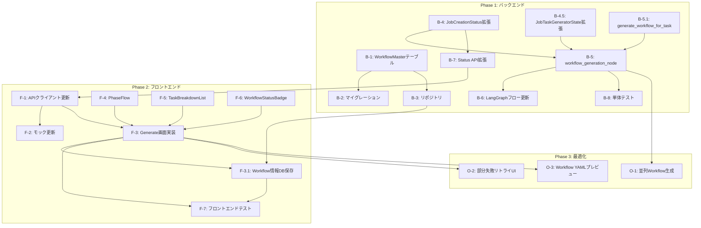

# 作業計画書: Issue #305 Job生成時ワークフロー自動生成

**作成日**: 2025-12-22
**改訂日**: 2025-12-22（レビュー指摘反映）
**対象Issue**: [#305](https://github.com/kewton/MySwiftAgent/issues/305)
**採用UIパターン**: Pattern B（標準・バランス型）
**承認状態**: ✅ 承認（レビュー指摘反映済み）

---

## 改訂履歴

| 日付 | 内容 |
|------|------|
| 2025-12-22 | 初版作成 |
| 2025-12-22 | レビュー指摘反映: B-4.5, B-5.1, F-3.1追加、L3テスト改善、依存関係図更新 |

---

## 概要

Job Generator APIでJobを生成した際に、Workflow Generatorを自動呼び出しし、各TaskMasterに対応するGraphAI YAMLワークフローを生成する機能を実装する。

### 主要な変更点

1. **新規LangGraphノード追加**: `workflow_generation_node`
2. **JobCreationStatusモデル拡張**: `phase`, `task_breakdown`, `workflow_statuses`フィールド追加
3. **WorkflowMasterテーブル新設**: TaskMasterと1:1の関係
4. **Generate画面更新**: 2フェーズ進捗表示（Pattern B準拠）

---

## タスク一覧

### Phase 1: バックエンド（必須）

| ID | タスク | 対象ファイル | 依存 | 見積もり |
|----|--------|-------------|------|---------|
| B-1 | WorkflowMasterテーブル作成 | `myAgentDesk/src/lib/server/db/schema.ts` | - | S |
| B-2 | DBマイグレーション実行 | `myAgentDesk/src/lib/server/db/migrations/` | B-1 | S |
| B-3 | WorkflowMasterリポジトリ作成 | `myAgentDesk/src/lib/server/repositories/workflow-master.ts` | B-1 | M |
| B-4 | JobCreationStatus拡張 | `expertAgent/app/services/job_creation_state.py` | - | M |
| B-4.5 | JobTaskGeneratorState拡張 | `expertAgent/aiagent/langgraph/jobTaskGeneratorAgents/state.py` | - | S |
| B-5.1 | generate_workflow_for_task実装 | `expertAgent/aiagent/langgraph/jobTaskGeneratorAgents/utils/workflow_helper.py` | - | M |
| B-5 | workflow_generation_node新規作成 | `expertAgent/aiagent/langgraph/jobTaskGeneratorAgents/nodes/workflow_generation.py` | B-4, B-4.5, B-5.1 | L |
| B-6 | LangGraphフロー更新 + ノードエクスポート | `expertAgent/aiagent/langgraph/jobTaskGeneratorAgents/agent.py`, `nodes/__init__.py` | B-5 | M |
| B-7 | Status APIレスポンス拡張 | `expertAgent/app/api/v1/job_generator_endpoints.py` | B-4 | M |
| B-8 | 単体テスト追加 | `expertAgent/tests/unit/test_workflow_generation_node.py` | B-5 | M |

### Phase 2: フロントエンド（必須）

| ID | タスク | 対象ファイル | 依存 | 見積もり |
|----|--------|-------------|------|---------|
| F-1 | expert-agent APIクライアント更新 | `myAgentDesk/src/lib/api/clients/expert-agent.ts`, `src/routes/api/jobs/[jobId]/status/+server.ts` | B-7 | S |
| F-2 | expert-agent モック更新 | `myAgentDesk/src/lib/api/mock/expert-agent.mock.ts` | F-1 | S |
| F-3 | Generate画面Pattern B実装 | `myAgentDesk/src/routes/projects/[projectId]/workbenches/[workbenchId]/generate/+page.svelte` | F-1 | L |
| F-3.1 | Workflow情報DB保存ロジック | `myAgentDesk/src/routes/projects/[projectId]/workbenches/[workbenchId]/generate/+page.server.ts` | F-3, B-3 | M |
| F-4 | PhaseFlowコンポーネント作成 | `myAgentDesk/src/lib/components/generation/PhaseFlow.svelte` | - | M |
| F-5 | TaskBreakdownListコンポーネント作成 | `myAgentDesk/src/lib/components/generation/TaskBreakdownList.svelte` | - | M |
| F-6 | WorkflowStatusBadgeコンポーネント作成 | `myAgentDesk/src/lib/components/generation/WorkflowStatusBadge.svelte` | - | S |
| F-7 | フロントエンドテスト | `myAgentDesk/tests/components/` | F-3~F-6 | M |

### Phase 3: 最適化（推奨・後日対応可）

| ID | タスク | 対象ファイル | 依存 | 見積もり |
|----|--------|-------------|------|---------|
| O-1 | 並列Workflow生成 | `expertAgent/aiagent/langgraph/jobTaskGeneratorAgents/nodes/workflow_generation.py` | B-5 | M |
| O-2 | 部分失敗リトライUI | `myAgentDesk/src/routes/projects/[projectId]/workbenches/[workbenchId]/generate/+page.svelte` | F-3 | M |
| O-3 | Workflow YAMLプレビュー | 新規コンポーネント | F-3 | M |

---

## 詳細設計

### B-1: WorkflowMasterテーブル設計

```typescript
// myAgentDesk/src/lib/server/db/schema.ts に追加
export const workflowMasters = sqliteTable('workflow_masters', {
  id: text('id').primaryKey(),              // ULID: wm_xxx
  taskMasterId: text('task_master_id')
    .notNull()
    .unique()
    .references(() => taskMasters.id, { onDelete: 'cascade' }),
  workflowName: text('workflow_name').notNull(),
  yamlContent: text('yaml_content').notNull(),
  status: text('status').notNull().default('pending'),  // pending | success | failed
  generationTimeMs: integer('generation_time_ms'),
  errorMessage: text('error_message'),
  langfuseTraceId: text('langfuse_trace_id'),
  createdAt: text('created_at').default(sql`CURRENT_TIMESTAMP`),
  updatedAt: text('updated_at').default(sql`CURRENT_TIMESTAMP`),
});
```

### B-4: JobCreationStatus拡張

```python
# expertAgent/app/services/job_creation_state.py

class TaskBreakdownItem(BaseModel):
    """タスク分解結果の1項目"""
    task_id: str
    name: str
    description: str
    recommended_apis: list[str]


class WorkflowStatusItem(BaseModel):
    """Workflow生成状況の1項目"""
    task_id: str
    status: str  # 'pending' | 'generating' | 'success' | 'failed'
    workflow_name: Optional[str] = None
    generation_time_ms: Optional[int] = None
    error_message: Optional[str] = None


class JobCreationStatus(BaseModel):
    """Job作成状態（拡張版）"""
    # 既存フィールド
    job_id: str
    status: str  # 'creating' | 'completed' | 'failed'
    progress: int  # 0-100
    start_time: datetime
    end_time: Optional[datetime] = None
    job_master_id: Optional[str] = None
    error_message: Optional[str] = None
    result: Optional[dict[str, Any]] = None

    # 新規フィールド（Issue #305）
    phase: Optional[str] = None  # 'task_analysis' | 'workflow_generation' | 'complete'
    task_breakdown: Optional[list[TaskBreakdownItem]] = None
    workflow_statuses: Optional[list[WorkflowStatusItem]] = None


class JobCreationStateManager:
    """拡張メソッド（既存クラスに追加）"""

    async def update_phase(self, job_id: str, phase: str) -> None:
        """フェーズを更新（task_analysis → workflow_generation → complete）"""
        status = await self.get_status(job_id)
        if status:
            status.phase = phase
            await self._save_status(status)

    async def set_task_breakdown(
        self, job_id: str, breakdown: list[TaskBreakdownItem]
    ) -> None:
        """タスク分解結果を設定（Phase 1完了時）"""
        status = await self.get_status(job_id)
        if status:
            status.task_breakdown = breakdown
            status.phase = "workflow_generation"
            await self._save_status(status)

    async def update_workflow_status(
        self,
        job_id: str,
        task_id: str,
        workflow_status: str,
        workflow_name: Optional[str] = None,
        generation_time_ms: Optional[int] = None,
        error_message: Optional[str] = None,
    ) -> None:
        """個別Workflowの生成状況を更新"""
        status = await self.get_status(job_id)
        if status and status.workflow_statuses:
            for ws in status.workflow_statuses:
                if ws.task_id == task_id:
                    ws.status = workflow_status
                    ws.workflow_name = workflow_name
                    ws.generation_time_ms = generation_time_ms
                    ws.error_message = error_message
                    break
            await self._save_status(status)

    async def init_workflow_statuses(
        self, job_id: str, task_ids: list[str]
    ) -> None:
        """Workflow状況を初期化（すべてpending）"""
        status = await self.get_status(job_id)
        if status:
            status.workflow_statuses = [
                WorkflowStatusItem(task_id=tid, status="pending")
                for tid in task_ids
            ]
            await self._save_status(status)
```

### B-4.5: JobTaskGeneratorState拡張

```python
# expertAgent/aiagent/langgraph/jobTaskGeneratorAgents/state.py

class JobTaskGeneratorState(TypedDict, total=False):
    # ... 既存フィールド（変更なし）

    # ===== 新規フィールド（Issue #305）=====
    # Workflow生成結果
    workflow_results: list[dict[str, Any]]
    # 現在のフェーズ
    phase: str  # 'task_analysis' | 'workflow_generation' | 'complete'
```

### B-5.1: generate_workflow_for_task実装

```python
# expertAgent/aiagent/langgraph/jobTaskGeneratorAgents/utils/workflow_helper.py

from expertAgent.aiagent.langgraph.workflowGeneratorAgents.agent import generate_workflow


async def generate_workflow_for_task(
    task_master: dict[str, Any],
    langfuse_handler: Optional[Any] = None,
) -> dict[str, Any]:
    """
    TaskMasterに対応するGraphAI YAMLワークフローを生成する。

    既存のWorkflow Generator Agentをラップし、TaskMaster形式の入力を
    Workflow Generator形式に変換する。

    Args:
        task_master: TaskMaster定義（id, name, description, recommended_apis等）
        langfuse_handler: Langfuseコールバックハンドラ（オプション）

    Returns:
        {
            "workflow_name": str,
            "yaml_content": str,
            "status": "success" | "failed",
            "error_message": Optional[str]
        }
    """
    try:
        # TaskMasterからWorkflow Generator入力形式に変換
        workflow_request = {
            "task_name": task_master["name"],
            "task_description": task_master["description"],
            "recommended_apis": task_master.get("recommended_apis", []),
            "input_schema": task_master.get("input_schema", {}),
            "output_schema": task_master.get("output_schema", {}),
        }

        # 既存Workflow Generatorを呼び出し
        result = await generate_workflow(
            request=workflow_request,
            langfuse_handler=langfuse_handler,
        )

        return {
            "workflow_name": f"workflow_{task_master['id']}",
            "yaml_content": result.get("yaml_content", ""),
            "status": "success",
        }

    except Exception as e:
        return {
            "workflow_name": None,
            "yaml_content": None,
            "status": "failed",
            "error_message": str(e),
        }
```

### B-5: workflow_generation_node設計

```python
# expertAgent/aiagent/langgraph/jobTaskGeneratorAgents/nodes/workflow_generation.py

async def workflow_generation_node(
    state: JobTaskGeneratorState,
) -> JobTaskGeneratorState:
    """
    各TaskMasterに対してWorkflow Generatorを呼び出し、
    GraphAI YAMLワークフローを生成する。

    進捗: 70-95%（Task Analysis完了後）
    """
    task_masters = state.get("task_masters", [])
    job_id = state["job_id"]
    langfuse_handler = state.get("langfuse_handler")

    # Phase更新
    await update_job_status(job_id, phase="workflow_generation")

    workflow_results = []
    total_tasks = len(task_masters)

    for idx, task_master in enumerate(task_masters):
        task_id = task_master["id"]

        # Workflow生成開始
        await update_workflow_status(
            job_id=job_id,
            task_id=task_id,
            status="generating"
        )

        try:
            start_time = time.time()

            # Workflow Generator呼び出し
            result = await generate_workflow_for_task(
                task_master=task_master,
                langfuse_handler=langfuse_handler
            )

            generation_time_ms = int((time.time() - start_time) * 1000)

            workflow_results.append({
                "task_id": task_id,
                "status": "success",
                "workflow_name": result["workflow_name"],
                "yaml_content": result["yaml_content"],
                "generation_time_ms": generation_time_ms
            })

            # Workflow成功更新
            await update_workflow_status(
                job_id=job_id,
                task_id=task_id,
                status="success",
                workflow_name=result["workflow_name"],
                generation_time_ms=generation_time_ms
            )

        except Exception as e:
            workflow_results.append({
                "task_id": task_id,
                "status": "failed",
                "error_message": str(e)
            })

            await update_workflow_status(
                job_id=job_id,
                task_id=task_id,
                status="failed",
                error_message=str(e)
            )

        # 進捗更新（70% + (idx+1)/total * 25%）
        progress = 70 + int(((idx + 1) / total_tasks) * 25)
        await update_job_progress(job_id, progress)

    return {
        **state,
        "workflow_results": workflow_results,
        "phase": "complete"
    }
```

### B-6: LangGraphフロー更新

```python
# expertAgent/aiagent/langgraph/jobTaskGeneratorAgents/agent.py

# 既存ノード
workflow.add_node("requirement_analysis", requirement_analysis_node)
workflow.add_node("evaluator", evaluator_node)
workflow.add_node("interface_definition", interface_definition_node)
workflow.add_node("schema_enrichment", schema_enrichment_node)
workflow.add_node("master_creation", master_creation_node)
workflow.add_node("validation", validation_node)
workflow.add_node("job_registration", job_registration_node)

# 新規ノード追加
workflow.add_node("workflow_generation", workflow_generation_node)

# エッジ更新
workflow.add_edge("job_registration", "workflow_generation")  # 変更
workflow.add_edge("workflow_generation", END)  # 新規
```

---

## L3受入テスト計画

### 前提条件

```bash
# サービス起動
./scripts/dev-hybrid.sh  # Platform=Docker, Agent=ローカル

# 環境確認
curl -s http://localhost:8004/health | jq .
# 期待: {"status": "healthy"}
```

### テスト1: Job生成〜Workflow自動生成フロー

```bash
# Step 1: Job Generator呼び出し
JOB_RESPONSE=$(curl -s -X POST "http://localhost:8004/api/v1/job-generator" \
  -H "Content-Type: application/json" \
  -d '{
    "requirement_text": "Gmailから未読メールを取得し、AI分析後にSlackへ通知するワークフロー",
    "project_id": "test-project"
  }')

JOB_ID=$(echo $JOB_RESPONSE | jq -r '.job_id')
TRACE_ID=$(echo $JOB_RESPONSE | jq -r '.langfuse_trace_id')

echo "Job ID: $JOB_ID"
echo "Trace ID: $TRACE_ID"
```

### テスト2: Phase 1（Task Analysis）の進捗確認

```bash
# 2秒間隔でポーリング（進捗0-70%）
for i in {1..30}; do
  STATUS=$(curl -s "http://localhost:8004/api/v1/jobs/$JOB_ID/status")
  PROGRESS=$(echo $STATUS | jq -r '.progress')
  PHASE=$(echo $STATUS | jq -r '.phase')

  echo "[$i] Progress: $PROGRESS%, Phase: $PHASE"

  if [ "$PHASE" = "workflow_generation" ] || [ "$PROGRESS" -ge 70 ]; then
    echo "Phase 1完了！Task Breakdown:"
    echo $STATUS | jq '.task_breakdown'
    break
  fi

  sleep 2
done
```

**期待結果**:
```json
{
  "progress": 70,
  "phase": "workflow_generation",
  "task_breakdown": [
    {
      "task_id": "tm_001",
      "name": "Gmail未読メール取得",
      "description": "Gmail APIを使用して未読メールを取得",
      "recommended_apis": ["Gmail API (users.messages.list)"]
    },
    {
      "task_id": "tm_002",
      "name": "メール内容AI分析",
      "description": "取得したメール内容をLLMで分析",
      "recommended_apis": ["Claude API (messages.create)"]
    },
    {
      "task_id": "tm_003",
      "name": "Slack通知送信",
      "description": "分析結果をSlackチャンネルに投稿",
      "recommended_apis": ["Slack API (chat.postMessage)"]
    }
  ]
}
```

### テスト3: Phase 2（Workflow Generation）の進捗確認

```bash
# Workflow生成中の状況確認（進捗70-95%）
for i in {1..60}; do
  STATUS=$(curl -s "http://localhost:8004/api/v1/jobs/$JOB_ID/status")
  PROGRESS=$(echo $STATUS | jq -r '.progress')
  PHASE=$(echo $STATUS | jq -r '.phase')

  echo "[$i] Progress: $PROGRESS%, Phase: $PHASE"
  echo "Workflow Statuses:"
  echo $STATUS | jq '.workflow_statuses'

  if [ "$PHASE" = "complete" ] || [ "$PROGRESS" -ge 95 ]; then
    echo "Phase 2完了！"
    break
  fi

  sleep 2
done
```

**期待結果**:
```json
{
  "progress": 95,
  "phase": "complete",
  "workflow_statuses": [
    {
      "task_id": "tm_001",
      "status": "success",
      "workflow_name": "workflow_tm_001",
      "generation_time_ms": 28500
    },
    {
      "task_id": "tm_002",
      "status": "success",
      "workflow_name": "workflow_tm_002",
      "generation_time_ms": 32100
    },
    {
      "task_id": "tm_003",
      "status": "success",
      "workflow_name": "workflow_tm_003",
      "generation_time_ms": 25800
    }
  ]
}
```

### テスト4: 最終結果確認

```bash
# 完了状態の確認
FINAL_STATUS=$(curl -s "http://localhost:8004/api/v1/jobs/$JOB_ID/status")
echo $FINAL_STATUS | jq .

# 期待するフィールド
echo "=== 検証項目 ==="
echo "status: $(echo $FINAL_STATUS | jq -r '.status')"  # completed
echo "progress: $(echo $FINAL_STATUS | jq -r '.progress')"  # 100
echo "phase: $(echo $FINAL_STATUS | jq -r '.phase')"  # complete
echo "job_master_id: $(echo $FINAL_STATUS | jq -r '.job_master_id')"  # jm_xxx
echo "task_count: $(echo $FINAL_STATUS | jq '.task_breakdown | length')"  # 3
echo "successful_workflows: $(echo $FINAL_STATUS | jq '[.workflow_statuses[] | select(.status=="success")] | length')"  # 3
```

### テスト5: 部分失敗シナリオ

```bash
# 無効なAPI推奨でWorkflow生成失敗を誘発
JOB_RESPONSE=$(curl -s -X POST "http://localhost:8004/api/v1/job-generator" \
  -H "Content-Type: application/json" \
  -d '{
    "requirement_text": "存在しない架空のAPIを使用するワークフロー（テスト用）",
    "project_id": "test-project"
  }')

JOB_ID=$(echo $JOB_RESPONSE | jq -r '.job_id')

# ポーリングで完了を待機（最大3分）
for i in {1..90}; do
  STATUS=$(curl -s "http://localhost:8004/api/v1/jobs/$JOB_ID/status")
  JOB_STATUS=$(echo $STATUS | jq -r '.status')
  PROGRESS=$(echo $STATUS | jq -r '.progress')

  echo "[$i] Status: $JOB_STATUS, Progress: $PROGRESS%"

  if [ "$JOB_STATUS" = "completed" ] || [ "$JOB_STATUS" = "failed" ]; then
    break
  fi

  sleep 2
done

# 結果確認
FINAL_STATUS=$(curl -s "http://localhost:8004/api/v1/jobs/$JOB_ID/status")
echo "=== 部分失敗シナリオ結果 ==="
echo "Status: $(echo $FINAL_STATUS | jq -r '.status')"  # 期待: completed (部分成功) or failed (全失敗)
echo "Failed workflows: $(echo $FINAL_STATUS | jq '[.workflow_statuses[] | select(.status=="failed")] | length')"
echo "Error messages:"
echo $FINAL_STATUS | jq '[.workflow_statuses[] | select(.status=="failed") | {task_id, error_message}]'
```

**検証ポイント**:
- `status`が`completed`（部分成功）または`failed`（全失敗）
- `workflow_statuses`に`status: "failed"`のエントリが存在
- `error_message`が適切に設定されている

### テスト6: Langfuseトレース確認

```bash
# 環境変数の設定確認
# .envファイルに以下が設定されていることを確認:
# LANGFUSE_PUBLIC_KEY=pk-lf-xxx
# LANGFUSE_SECRET_KEY=sk-lf-xxx

# Langfuse UIで確認（ブラウザで開く）
echo "Langfuse URL: http://localhost:3001/traces/$TRACE_ID"

# API経由で確認する場合
# 注意: LANGFUSE_PUBLIC_KEYとLANGFUSE_SECRET_KEYを設定する必要あり
if [ -n "$LANGFUSE_PUBLIC_KEY" ] && [ -n "$LANGFUSE_SECRET_KEY" ]; then
  curl -s "http://localhost:3001/api/public/traces/$TRACE_ID" \
    -u "$LANGFUSE_PUBLIC_KEY:$LANGFUSE_SECRET_KEY" | jq '{name, status, metadata}'
else
  echo "警告: LANGFUSE_PUBLIC_KEY/LANGFUSE_SECRET_KEYが未設定です"
  echo "手動でLangfuse UIを確認してください: http://localhost:3001"
fi
```

**検証ポイント**:
- トレースが存在し、全ノードの実行が記録されている
- `workflow_generation`ノードのspanが含まれている
- 各Workflow生成のサブスパンが記録されている

### テスト7: DB確認（myAgentDesk側）

```bash
# ===== 前提条件 =====
# F-3.1（Workflow情報DB保存ロジック）が実装されている必要あり
# このテストはフロントエンド実装完了後に実行

# myAgentDeskのDB確認
cd myAgentDesk

# workflow_mastersテーブルの確認
sqlite3 .data/myAgentDesk.db "
SELECT
  wm.id,
  wm.task_master_id,
  wm.workflow_name,
  wm.status,
  wm.generation_time_ms,
  substr(wm.yaml_content, 1, 100) as yaml_preview
FROM workflow_masters wm
JOIN task_masters tm ON wm.task_master_id = tm.id
JOIN job_masters jm ON tm.job_master_id = jm.id
ORDER BY wm.created_at DESC
LIMIT 10;
"

# または、API経由で確認（F-3.1実装後）
# JOB_MASTER_IDはテスト1-4で取得したものを使用
curl -s "http://localhost:5173/api/jobs/$JOB_MASTER_ID/workflows" | jq .
```

**検証ポイント**:
- `workflow_masters`テーブルにレコードが存在
- `task_master_id`と`workflow_name`が正しく設定されている
- `yaml_content`にGraphAI YAML形式のワークフローが保存されている
- `status`が`success`または`failed`

**注意**:
- このテストはF-3.1（Workflow情報DB保存ロジック）の実装後に実行
- expertAgent APIから取得したWorkflow情報をmyAgentDesk DBに保存する処理が必要

---

## 品質基準

### 単体テスト（90%以上カバレッジ）

| テストファイル | 対象 | カバレッジ目標 |
|---------------|------|--------------|
| `test_workflow_generation_node.py` | `workflow_generation_node` | 90% |
| `test_job_creation_state.py` | `JobCreationStatus`拡張 | 95% |
| `test_langfuse_service.py` | Langfuse統合 | 90% |

### 結合テスト（50%以上カバレッジ）

| テストファイル | 対象 | シナリオ |
|---------------|------|---------|
| `test_e2e_workflow.py` | 全フロー | Job生成→Workflow生成→完了 |
| `test_partial_failure.py` | 部分失敗 | 3タスク中1タスク失敗 |

### 静的解析

```bash
# プッシュ前に必ず実行
./scripts/pre-push-check-all.sh

# 個別実行
cd expertAgent && uv run ruff check . && uv run mypy .
cd myAgentDesk && npm run check
```

---

## 依存関係図



---

## 実装順序

### Week 1: バックエンド基盤

1. **Day 1-2**: B-1, B-2, B-3 (DBスキーマ、マイグレーション、リポジトリ)
2. **Day 3**: B-4, B-4.5 (JobCreationStatus拡張、JobTaskGeneratorState拡張)
3. **Day 4**: B-5.1 (generate_workflow_for_task実装)
4. **Day 5**: B-5 (workflow_generation_node実装 - 開始)

### Week 2: バックエンド完成〜フロントエンド開始

1. **Day 1**: B-5 (workflow_generation_node実装 - 完了)
2. **Day 2**: B-6 (LangGraphフロー更新 + ノードエクスポート)
3. **Day 3**: B-7 (Status API拡張)
4. **Day 4**: B-8 (単体テスト)
5. **Day 5**: F-1, F-2 (APIクライアント、モック更新)

### Week 3: フロントエンド実装〜テスト

1. **Day 1**: F-4, F-5, F-6 (コンポーネント作成)
2. **Day 2-3**: F-3 (Generate画面Pattern B実装)
3. **Day 4**: F-3.1 (Workflow情報DB保存ロジック)
4. **Day 5**: F-7 (フロントエンドテスト)、L3受入テスト（テスト1〜6）

### Week 4: 最終テスト〜リリース準備

1. **Day 1**: L3受入テスト（テスト7: DB確認）
2. **Day 2**: バグ修正、ドキュメント更新
3. **Day 3**: PRレビュー、修正対応
4. **Day 4-5**: リリース準備、マージ

---

## リスクと対策

| リスク | 影響度 | 発生確率 | 対策 |
|--------|--------|---------|------|
| Workflow生成の長時間化 | 中 | 高 | Phase 3で並列化。MVP時は進捗表示で緩和 |
| 部分失敗時のUX混乱 | 中 | 中 | Pattern Bモックアップの「Partial Success」表示を実装 |
| Valkey接続障害 | 低 | 低 | L1メモリキャッシュのフォールバック |

---

## Definition of Done

### 必須項目
- [ ] すべてのタスク（B-1〜B-8, B-4.5, B-5.1, F-1〜F-7, F-3.1）完了
- [ ] 単体テストカバレッジ90%以上
- [ ] 結合テストカバレッジ50%以上
- [ ] `./scripts/pre-push-check-all.sh` パス
- [ ] L3受入テスト（テスト1〜7）パス
- [ ] Pattern Bモックアップと実装の一致確認
- [ ] Langfuseトレースで全フロー可視化確認
- [ ] PRレビュー承認

### 検証チェックリスト
- [ ] Job Generator呼び出し後、自動的にWorkflow Generatorが実行される
- [ ] Phase 1（0-70%）→ Phase 2（70-95%）の進捗表示が正しい
- [ ] Task Breakdown結果がUIに表示される
- [ ] 各タスクのWorkflow生成状況（pending/generating/success/failed）が表示される
- [ ] 部分失敗時もJob全体は`completed`になり、失敗したWorkflowのみエラー表示
- [ ] workflow_mastersテーブルにYAMLが正しく保存される

---

## 参照ドキュメント

| ドキュメント | 用途 |
|-------------|------|
| `dev-reports/feature/305-workflow-auto-generation/design-policy.md` | 設計方針 |
| `dev-reports/feature/305-workflow-auto-generation/architecture-review.md` | アーキテクチャレビュー |
| `myAgentDesk/src/routes/(preview)/mockups/feature-305/pattern-b/` | UIモックアップ |
| `docs/spec/job-generation-workflow.md` | Job Generator仕様 |
| `expertAgent/docs/API_REFERENCE.md` | API仕様 |

---

_作成日: 2025-12-22_
_採用パターン: Pattern B（標準・バランス型）_
