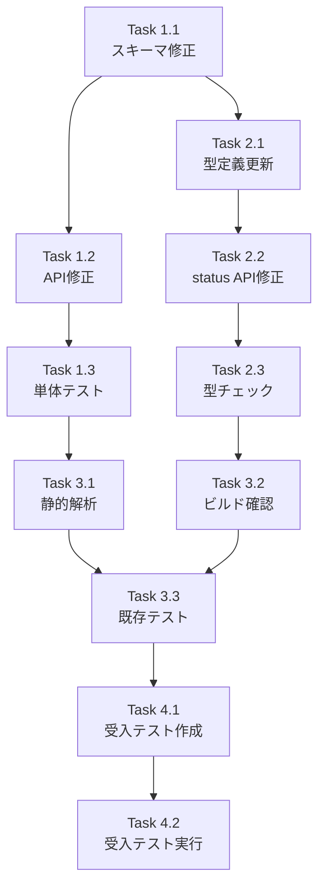

# Issue #310 作業計画書

## Issue概要

```markdown
## Issue: [expertAgent] Job生成時のtask_breakdown/interface_definitionsがDBに保存されない
**Issue番号**: #310
**サイズ**: M
**作業見積**: 8時間
**優先度**: High（P1バグ）
**依存Issue**: なし（#279の補完）
**ラベル**: bug
```

## 関連ドキュメント

- 設計方針書: `dev-reports/feature/issue/310/design-policy.md`
- アーキテクチャレビュー: `dev-reports/feature/issue/310/architecture-review.md`

---

## 1. 問題の概要

Job Generator機能で生成された `task_breakdown` と `interface_definitions` がDBに保存されず、Review画面で「No task breakdown available.」と表示される問題。

### 根本原因（3箇所）

| # | ファイル | 問題 |
|---|----------|------|
| 1 | `expertAgent/app/schemas/job_generator.py` | `interface_definitions`フィールドがない |
| 2 | `expertAgent/app/api/v1/job_generator_endpoints.py` | `_build_response_from_state()`が`interface_definitions`を抽出しない |
| 3 | `myAgentDesk/src/routes/api/jobs/[jobId]/status/+server.ts` | `taskBreakdown`/`interfaceDefinitions`をDBに保存しない |

---

## 2. 詳細タスク分解

### Phase 1: expertAgent側の修正（3時間）

- [ ] **Task 1.1**: JobGeneratorResponseスキーマ修正
  - 所要時間: 0.5時間
  - 成果物: `expertAgent/app/schemas/job_generator.py`
  - 内容: `interface_definitions: dict[str, Any] | None = None` フィールド追加
  - 依存: なし

- [ ] **Task 1.2**: _build_response_from_state()修正
  - 所要時間: 1時間
  - 成果物: `expertAgent/app/api/v1/job_generator_endpoints.py`
  - 内容: `state.get("interface_definitions")` を抽出してレスポンスに含める
  - 依存: Task 1.1

- [ ] **Task 1.3**: expertAgent単体テスト追加
  - 所要時間: 1.5時間
  - 成果物: `expertAgent/tests/unit/test_job_generator_endpoints.py`
  - 内容:
    - `test_build_response_from_state_includes_interface_definitions()`
    - `test_job_generator_response_schema_has_interface_definitions()`
  - 依存: Task 1.2

### Phase 2: myAgentDesk側の修正（2.5時間）

- [ ] **Task 2.1**: expert-agentクライアント型定義更新
  - 所要時間: 0.5時間
  - 成果物: `myAgentDesk/src/lib/api/clients/expert-agent.ts`
  - 内容: `interface_definitions` 型追加
  - 依存: Task 1.1

- [ ] **Task 2.2**: status API修正
  - 所要時間: 1.5時間
  - 成果物: `myAgentDesk/src/routes/api/jobs/[jobId]/status/+server.ts`
  - 内容:
    - 成功時: `taskBreakdown`, `interfaceDefinitions` をDB保存
    - 失敗時: 同様にDB保存（デバッグ用）
  - 依存: Task 2.1

- [ ] **Task 2.3**: myAgentDesk型チェック確認
  - 所要時間: 0.5時間
  - 成果物: 型エラーなし
  - 内容: `npm run type-check` 実行・修正
  - 依存: Task 2.2

### Phase 3: テスト（TDD - CI実行可能）（1.5時間）

- [ ] **Task 3.1**: expertAgent静的解析
  - 所要時間: 0.5時間
  - 成果物: Ruff/MyPyエラーなし
  - 依存: Task 1.3

- [ ] **Task 3.2**: myAgentDeskビルド確認
  - 所要時間: 0.5時間
  - 成果物: `npm run build` 成功
  - 依存: Task 2.3

- [ ] **Task 3.3**: 既存テスト確認
  - 所要時間: 0.5時間
  - 成果物: 既存テストがパス
  - 依存: Task 3.1, Task 3.2

### Phase 4: L3受入テスト（1時間）

- [ ] **Task 4.1**: 受入テストスクリプト作成
  - 所要時間: 0.5時間
  - 成果物: `tests/acceptance/test_issue_310_acceptance.sh`
  - 依存: Task 3.3

- [ ] **Task 4.2**: L3受入テスト実行・確認
  - 所要時間: 0.5時間
  - 成果物: 全テストパス、エビデンス収集
  - 依存: Task 4.1

---

## 3. タスク依存関係



---

## 4. 作業スケジュール

### セッション1（4時間）: expertAgent + myAgentDesk修正

| 時間 | タスク | 成果物 |
|------|--------|--------|
| 0:00-0:30 | Task 1.1 | スキーマ修正 |
| 0:30-1:30 | Task 1.2 | API修正 |
| 1:30-2:00 | Task 2.1 | 型定義更新 |
| 2:00-3:30 | Task 2.2 | status API修正 |
| 3:30-4:00 | Task 2.3 | 型チェック |

### セッション2（4時間）: テスト + 受入テスト

| 時間 | タスク | 成果物 |
|------|--------|--------|
| 0:00-1:30 | Task 1.3 | 単体テスト追加 |
| 1:30-2:00 | Task 3.1 | 静的解析 |
| 2:00-2:30 | Task 3.2 | ビルド確認 |
| 2:30-3:00 | Task 3.3 | 既存テスト確認 |
| 3:00-3:30 | Task 4.1 | 受入テスト作成 |
| 3:30-4:00 | Task 4.2 | 受入テスト実行 |

**総作業時間**: 8時間

---

## 5. チェックポイント

| タイミング | 確認事項 | 対応 |
|-----------|---------|------|
| Task 1.2完了時 | APIレスポンスに`interface_definitions`が含まれる | curl確認 |
| Task 2.2完了時 | DBに`taskBreakdown`/`interfaceDefinitions`が保存される | SQLite確認 |
| Phase 3完了時 | CI相当のチェックがパス | 静的解析・ビルド・テスト |
| Phase 4完了時 | L3受入テスト全パス | エビデンス収集 |

---

## 6. リスクと対策

| リスク | 発生確率 | 影響 | 対策 |
|-------|---------|------|------|
| expertAgent APIの起動失敗 | 低 | テスト遅延 | `./scripts/dev-hybrid.sh`で起動確認 |
| 型定義の不整合 | 中 | ビルドエラー | 型チェックを早期に実行 |
| 既存テストの失敗 | 低 | 修正時間増 | 変更前に既存テスト確認 |

---

## 7. 成果物チェックリスト

### コード
- [ ] `expertAgent/app/schemas/job_generator.py` - `interface_definitions`追加
- [ ] `expertAgent/app/api/v1/job_generator_endpoints.py` - `_build_response_from_state()`修正
- [ ] `myAgentDesk/src/lib/api/clients/expert-agent.ts` - 型定義更新
- [ ] `myAgentDesk/src/routes/api/jobs/[jobId]/status/+server.ts` - DB保存処理追加

### テスト
- [ ] `expertAgent/tests/unit/test_job_generator_endpoints.py` - 単体テスト追加
- [ ] `tests/acceptance/test_issue_310_acceptance.sh` - L3受入テスト

### ドキュメント
- [ ] `dev-reports/feature/issue/310/design-policy.md` - 作成済み
- [ ] `dev-reports/feature/issue/310/architecture-review.md` - 作成済み
- [ ] `dev-reports/feature/issue/310/work-plan.md` - 本ドキュメント

---

## 8. L3受入テスト計画（具体的なコマンド）

> **重要**: myAgentDeskのForm Action経由でJob生成を行わないと、job_versionレコードがDBに作成されません。
> 直接expertAgent APIを呼び出してもDBには保存されないため、myAgentDesk経由でテストを行います。

### 前提条件

- expertAgent: http://localhost:8004 (Job生成エンジン)
- myAgentDesk: http://localhost:5173 (フロントエンド、DB管理)
- テスト用のProject/Workbench/RequirementVersionが必要

### 完全なL3受入テストスクリプト

```bash
#!/bin/bash
# tests/acceptance/test_issue_310_acceptance.sh
# Issue #310: task_breakdown/interface_definitionsのDB保存確認

set -e

# カラー定義
RED='\033[0;31m'
GREEN='\033[0;32m'
YELLOW='\033[1;33m'
NC='\033[0m'

PASSED=0
FAILED=0

pass() {
    echo -e "${GREEN}✅ PASS${NC}: $1"
    ((PASSED++))
}

fail() {
    echo -e "${RED}❌ FAIL${NC}: $1"
    echo -e "${RED}  Error: $2${NC}"
    ((FAILED++))
}

warn() {
    echo -e "${YELLOW}⚠️  WARN${NC}: $1"
}

echo "=============================================="
echo "Issue #310 受入テスト"
echo "task_breakdown/interface_definitionsのDB保存"
echo "=============================================="
echo ""

# ================================================================
# Step 1: サービス起動確認
# ================================================================
echo "--- Step 1: サービス起動確認 ---"

# expertAgent ヘルスチェック（Job生成エンジン）
if curl -sf http://localhost:8004/health > /dev/null 2>&1; then
    pass "expertAgent ヘルスチェック (http://localhost:8004)"
else
    fail "expertAgent ヘルスチェック" "http://localhost:8004/health が応答しない"
    echo "サービスを起動してください: ./scripts/dev-hybrid.sh"
    exit 1
fi

# myAgentDesk ヘルスチェック（フロントエンド・DB管理）
if curl -sf http://localhost:5173 > /dev/null 2>&1; then
    pass "myAgentDesk ヘルスチェック (http://localhost:5173)"
else
    fail "myAgentDesk ヘルスチェック" "http://localhost:5173 が応答しない"
    echo "myAgentDeskを起動してください: cd myAgentDesk && npm run dev"
    exit 1
fi

# myVault ヘルスチェック（オプション）
if curl -sf http://localhost:8003/health > /dev/null 2>&1; then
    pass "myVault ヘルスチェック (http://localhost:8003)"
else
    warn "myVault ヘルスチェック失敗（オプション）"
fi

# ================================================================
# Step 2: テスト用Workbench準備
# ================================================================
echo ""
echo "--- Step 2: テスト用Workbench準備 ---"

cd myAgentDesk

# 既存のテスト用Workbenchを確認、なければ作成
TEST_WORKBENCH_ID=$(sqlite3 data/local.db \
  "SELECT id FROM workbench WHERE name LIKE '%Test%' OR name LIKE '%test%' LIMIT 1;" 2>/dev/null || echo "")

if [ -z "$TEST_WORKBENCH_ID" ]; then
    echo "テスト用Workbenchがありません。手動で作成してください:"
    echo "  1. http://localhost:5173 にアクセス"
    echo "  2. 新規Projectを作成"
    echo "  3. Workbenchを作成"
    echo "  4. Requirement Version を作成（任意のテキスト）"
    echo "  5. Requirement Version を Active に設定"
    fail "テスト用Workbenchがない" "手動でセットアップが必要"
    cd ..
    exit 1
fi

pass "テスト用Workbench発見 (ID: ${TEST_WORKBENCH_ID:0:8}...)"

# Active Requirement Versionを確認
ACTIVE_REQ_VERSION=$(sqlite3 data/local.db \
  "SELECT rv.id FROM requirement_version rv
   JOIN workbench w ON rv.workbenchId = w.id
   WHERE w.id = '${TEST_WORKBENCH_ID}' AND rv.status = 'active'
   LIMIT 1;" 2>/dev/null || echo "")

if [ -z "$ACTIVE_REQ_VERSION" ]; then
    fail "Active Requirement Versionがない" "Workbench $TEST_WORKBENCH_ID にActive版が必要"
    cd ..
    exit 1
fi

pass "Active Requirement Version発見 (ID: ${ACTIVE_REQ_VERSION:0:8}...)"

# ProjectIDを取得
PROJECT_ID=$(sqlite3 data/local.db \
  "SELECT projectId FROM workbench WHERE id = '${TEST_WORKBENCH_ID}';" 2>/dev/null || echo "")

cd ..

# ================================================================
# Step 3: myAgentDesk Form Action経由でJob生成
# ================================================================
echo ""
echo "--- Step 3: myAgentDesk経由でJob生成 ---"

# SvelteKit Form Actionを直接POSTで呼び出し
# Content-Type: application/x-www-form-urlencoded でgenerateJobアクションを実行
FORM_RESPONSE=$(curl -s -X POST \
  "http://localhost:5173/projects/${PROJECT_ID}/workbenches/${TEST_WORKBENCH_ID}/generate?/generateJob" \
  -H "Content-Type: application/x-www-form-urlencoded" \
  -d "" \
  -w "\n%{http_code}" \
  --max-time 30)

HTTP_CODE=$(echo "$FORM_RESPONSE" | tail -1)
RESPONSE_BODY=$(echo "$FORM_RESPONSE" | sed '$d')

# SvelteKitはForm Actionのレスポンスでリダイレクトを返すか、JSONを返す
if [ "$HTTP_CODE" = "200" ] || [ "$HTTP_CODE" = "303" ]; then
    pass "Form Action呼び出し成功 (HTTP $HTTP_CODE)"
else
    # Form Actionの代替: 直接SQLでjob_versionを作成してexpertAgentを呼び出す
    warn "Form Action呼び出しが想定外の応答 (HTTP $HTTP_CODE)"
    echo "  手動でUIからJob生成を実行してください"
fi

# 最新のjob_versionを取得
cd myAgentDesk
sleep 2  # DB更新を待つ

JOB_VERSION_ID=$(sqlite3 data/local.db \
  "SELECT id FROM job_version
   WHERE workbenchId = '${TEST_WORKBENCH_ID}'
   ORDER BY createdAt DESC LIMIT 1;" 2>/dev/null || echo "")

EXTERNAL_JOB_ID=$(sqlite3 data/local.db \
  "SELECT externalJobId FROM job_version
   WHERE id = '${JOB_VERSION_ID}';" 2>/dev/null || echo "")

if [ -n "$JOB_VERSION_ID" ] && [ -n "$EXTERNAL_JOB_ID" ] && [ "$EXTERNAL_JOB_ID" != "" ]; then
    pass "job_version作成成功 (ID: ${JOB_VERSION_ID:0:8}..., externalJobId: ${EXTERNAL_JOB_ID:0:20}...)"
else
    fail "job_versionが作成されていない" "UIから手動でJob生成を実行してください"
    cd ..
    exit 1
fi

cd ..

# ================================================================
# Step 4: myAgentDesk status API経由でポーリング
# ================================================================
echo ""
echo "--- Step 4: myAgentDesk status APIでポーリング ---"

MAX_POLLS=60
POLL_INTERVAL=5
POLL_COUNT=0
FINAL_STATUS=""

while [ $POLL_COUNT -lt $MAX_POLLS ]; do
    # myAgentDeskのstatus APIを呼び出す（これがDBを更新する）
    STATUS_RESPONSE=$(curl -s "http://localhost:5173/api/jobs/${JOB_VERSION_ID}/status")
    STATUS=$(echo "$STATUS_RESPONSE" | jq -r '.status // "unknown"')
    PROGRESS=$(echo "$STATUS_RESPONSE" | jq -r '.progress // "N/A"')
    PHASE=$(echo "$STATUS_RESPONSE" | jq -r '.phase // "N/A"')

    echo "  [$POLL_COUNT] status=$STATUS, progress=$PROGRESS, phase=$PHASE"

    if [ "$STATUS" = "success" ]; then
        pass "Job完了 (status: $STATUS)"
        FINAL_STATUS="success"
        break
    elif [ "$STATUS" = "failed" ]; then
        ERROR_MSG=$(echo "$STATUS_RESPONSE" | jq -r '.errorMessage // "Unknown error"')
        warn "Job失敗 ($ERROR_MSG) - 失敗ケースもDB保存を確認"
        FINAL_STATUS="failed"
        break
    fi

    ((POLL_COUNT++))
    sleep $POLL_INTERVAL
done

if [ $POLL_COUNT -ge $MAX_POLLS ]; then
    fail "ポーリングタイムアウト" "5分以内に完了しなかった"
    exit 1
fi

# ================================================================
# Step 5: expertAgent APIレスポンスにinterface_definitionsが含まれるか確認
# ================================================================
echo ""
echo "--- Step 5: expertAgent APIレスポンス確認 ---"

# expertAgentのstatus APIを直接呼び出してレスポンス形式を確認
EXPERT_STATUS=$(curl -s "http://localhost:8004/aiagent-api/v1/jobs/${EXTERNAL_JOB_ID}/status")

# task_breakdown確認（result内）
TASK_BREAKDOWN_API=$(echo "$EXPERT_STATUS" | jq -r '.result.task_breakdown // empty')
if [ -n "$TASK_BREAKDOWN_API" ] && [ "$TASK_BREAKDOWN_API" != "null" ]; then
    TASK_COUNT=$(echo "$TASK_BREAKDOWN_API" | jq 'length')
    pass "expertAgent: task_breakdown がAPIレスポンスに含まれる (${TASK_COUNT}タスク)"
else
    fail "expertAgent: task_breakdown がAPIレスポンスに含まれない" "result.task_breakdown が空"
fi

# interface_definitions確認（result内）- 修正後に有効になる
INTERFACE_DEFS_API=$(echo "$EXPERT_STATUS" | jq -r '.result.interface_definitions // empty')
if [ -n "$INTERFACE_DEFS_API" ] && [ "$INTERFACE_DEFS_API" != "null" ] && [ "$INTERFACE_DEFS_API" != "{}" ]; then
    IFACE_COUNT=$(echo "$INTERFACE_DEFS_API" | jq 'keys | length')
    pass "expertAgent: interface_definitions がAPIレスポンスに含まれる (${IFACE_COUNT}件)"
else
    fail "expertAgent: interface_definitions がAPIレスポンスに含まれない" "修正対象: JobGeneratorResponseにフィールド追加が必要"
fi

# ================================================================
# Step 6: myAgentDesk DB保存確認（最重要）
# ================================================================
echo ""
echo "--- Step 6: myAgentDesk DB保存確認 ---"

cd myAgentDesk

# DBからtaskBreakdown/interfaceDefinitionsを確認
TASK_BREAKDOWN_DB=$(sqlite3 data/local.db \
  "SELECT taskBreakdown FROM job_version WHERE id = '${JOB_VERSION_ID}';" 2>/dev/null || echo "")

INTERFACE_DEFS_DB=$(sqlite3 data/local.db \
  "SELECT interfaceDefinitions FROM job_version WHERE id = '${JOB_VERSION_ID}';" 2>/dev/null || echo "")

# taskBreakdown確認
if [ -n "$TASK_BREAKDOWN_DB" ] && [ "$TASK_BREAKDOWN_DB" != "" ]; then
    # JSONとしてパース可能か確認
    if echo "$TASK_BREAKDOWN_DB" | jq . > /dev/null 2>&1; then
        TASK_COUNT=$(echo "$TASK_BREAKDOWN_DB" | jq 'length')
        pass "DB: taskBreakdown が保存されている (${TASK_COUNT}タスク)"
    else
        pass "DB: taskBreakdown が保存されている（非JSONフォーマット）"
    fi
else
    fail "DB: taskBreakdown がNULL" "修正対象: status APIでtaskBreakdownをDB保存する必要がある"
fi

# interfaceDefinitions確認
if [ -n "$INTERFACE_DEFS_DB" ] && [ "$INTERFACE_DEFS_DB" != "" ]; then
    if echo "$INTERFACE_DEFS_DB" | jq . > /dev/null 2>&1; then
        IFACE_COUNT=$(echo "$INTERFACE_DEFS_DB" | jq 'keys | length')
        pass "DB: interfaceDefinitions が保存されている (${IFACE_COUNT}件)"
    else
        pass "DB: interfaceDefinitions が保存されている（非JSONフォーマット）"
    fi
else
    fail "DB: interfaceDefinitions がNULL" "修正対象: status APIでinterfaceDefinitionsをDB保存する必要がある"
fi

cd ..

# ================================================================
# Step 7: 結果サマリー
# ================================================================
echo ""
echo "=============================================="
echo "受入テスト結果サマリー"
echo "=============================================="
echo ""
TOTAL=$((PASSED + FAILED))
echo -e "Total: $TOTAL, ${GREEN}Passed: $PASSED${NC}, ${RED}Failed: $FAILED${NC}"
echo ""

echo "検証ポイント:"
echo "  1. expertAgent APIレスポンス: task_breakdown ✓, interface_definitions (修正対象)"
echo "  2. myAgentDesk DB保存: taskBreakdown (修正対象), interfaceDefinitions (修正対象)"
echo ""

if [ "$FAILED" -eq 0 ]; then
    echo -e "${GREEN}🎉 全ての受入テストがパスしました！${NC}"
    echo ""
    echo "Issue #310 修正完了の確認ができました。"
    exit 0
else
    echo -e "${RED}❌ 一部の受入テストが失敗しました${NC}"
    echo ""
    echo "以下の修正が必要です:"
    echo "  1. expertAgent: JobGeneratorResponseにinterface_definitionsフィールド追加"
    echo "  2. expertAgent: _build_response_from_state()でinterface_definitions抽出"
    echo "  3. myAgentDesk: status APIでtaskBreakdown/interfaceDefinitionsをDB保存"
    exit 1
fi
```

### 手動テスト手順（スクリプトが動作しない場合）

1. **サービス起動**
   ```bash
   ./scripts/dev-hybrid.sh  # Platform=Docker, Agent=ローカル
   cd myAgentDesk && npm run dev  # フロントエンド起動
   ```

2. **UIからJob生成**
   - http://localhost:5173 にアクセス
   - 既存のProject/Workbenchを選択（または新規作成）
   - Requirement Version を Active に設定
   - Generate ページで「Generate Job」ボタンをクリック

3. **ポーリング完了まで待機**
   - UI上でステータスが `success` または `failed` になるまで待つ

4. **DB確認**
   ```bash
   cd myAgentDesk
   sqlite3 data/local.db "SELECT id, status, taskBreakdown, interfaceDefinitions FROM job_version ORDER BY createdAt DESC LIMIT 1;"
   ```

5. **結果判定**
   - `taskBreakdown` がNULLでないこと → ✅
   - `interfaceDefinitions` がNULLでないこと → ✅（修正後）

---

## 9. Definition of Done

Issue完了条件：
- [ ] すべてのタスクが完了
- [ ] expertAgent単体テスト追加・パス
- [ ] 静的解析（Ruff/MyPy）エラーなし
- [ ] myAgentDeskビルド成功
- [ ] **L3受入テスト全パス**
  - [ ] Job Generator APIレスポンスに`interface_definitions`が含まれる
  - [ ] myAgentDesk status API経由でDBに`taskBreakdown`が保存される
  - [ ] myAgentDesk status API経由でDBに`interfaceDefinitions`が保存される
- [ ] コードレビュー承認
- [ ] PRマージ

---

## 10. 次のアクション

作業計画承認後：
1. **worktree作成**: `./scripts/worktree-create-from-issue.sh 310 feature`
2. **ブランチ確認**: `feature/issue/310`
3. **タスク実行**: Phase 1から順に実装
4. **進捗報告**: 各Phase完了時に報告
5. **PR作成**: 全テストパス後
