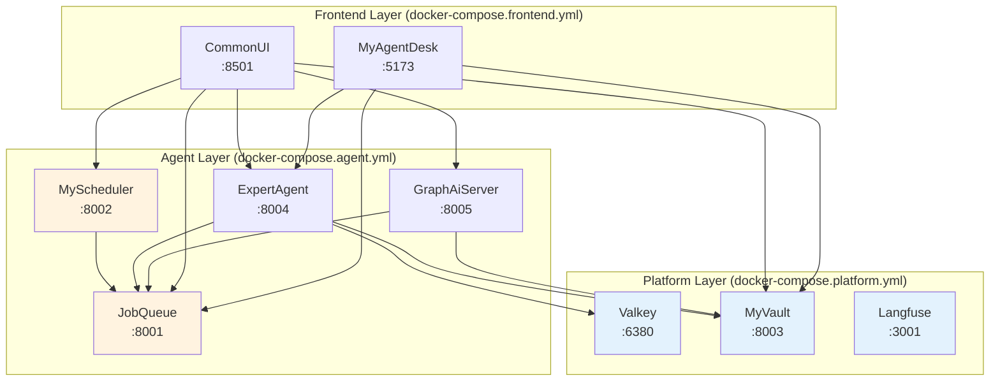

# 設計方針書: ３層構造の組み換え (Issue #316)

## 現状調査サマリ

### 対象プロジェクト
- **プロジェクト名**: MySwiftAgent (インフラストラクチャ/Docker構成)
- **主要モジュール**:
  - `docker-compose.platform.yml` - Platform層定義
  - `docker-compose.agent.yml` - Agent層定義
  - `docker-compose.frontend.yml` - Frontend層定義
  - `scripts/dev-hybrid.sh` - ハイブリッド開発スクリプト
  - `Makefile` - ビルド・起動コマンド

### 既存アーキテクチャパターン

| パターン | 使用箇所 | 目的 |
|---------|---------|------|
| **外部ネットワーク** | 全docker-compose.*.yml | サービス間通信の統一 |
| **depends_on + service_healthy** | docker-compose内 | 起動順序制御 |
| **ヘルスチェックエンドポイント** | 全サービス `/health` | サービス死活監視 |
| **層別Docker Compose分離** | platform/agent/frontend | 独立デプロイ・管理 |
| **PIDファイル管理** | dev-hybrid.sh | ローカルプロセス管理 |

### モジュール間依存関係（現状）

```
Platform層                     Agent層                    Frontend層
┌─────────────────────┐       ┌──────────────────┐       ┌────────────────┐
│ valkey              │       │ expertagent      │       │ commonui       │
│ myvault             │──────▶│ graphaiserver    │──────▶│ myagentdesk    │
│ jobqueue            │       └──────────────────┘       └────────────────┘
│ myscheduler ────────┤
│ langfuse-*          │
└─────────────────────┘
```

### 既存API設計パターン
- **エンドポイント命名規則**: `/api/v1/{resource}` または `/v1/{resource}`
- **レスポンス形式**: JSON（`{"status": "healthy"}` 等）
- **エラーハンドリング**: HTTPステータスコード + エラーメッセージJSON

### 参照したドキュメント
| ドキュメント | 関連内容 |
|-------------|---------|
| `docker-compose.platform.yml` | 現在のPlatform層サービス定義（jobqueue, myscheduler含む） |
| `docker-compose.agent.yml` | 現在のAgent層サービス定義 |
| `Makefile` | 層別起動コマンド、ヘルスチェック設定 |
| `scripts/dev-hybrid.sh` | ハイブリッド開発のDOCKER_SERVICES変数 |
| `docs/arch/service-dependencies.md` | サービス依存関係マトリクス |

### 設計上の制約
1. **外部ネットワーク必須**: 全サービスは `myswiftagent-network` に接続
2. **起動順序**: Platform → Agent → Frontend の順序は維持
3. **ヘルスチェック**: 各サービスは `/health` エンドポイントを提供
4. **後方互換性**: 既存のコマンド（`make dev-all`, `docker compose up`）は動作継続

---

## アーキテクチャ設計

### 変更後のシステム構成図



### 変更後の依存関係マトリクス

| 層 | サービス | 依存先 | 依存条件 |
|---|---------|--------|---------|
| **Platform** | valkey | なし | - |
| **Platform** | myvault | なし | - |
| **Platform** | langfuse-* | langfuse-db | service_healthy |
| **Agent** | jobqueue | なし | - |
| **Agent** | myscheduler | jobqueue | service_healthy |
| **Agent** | expertagent | myvault | service_healthy (外部) |
| **Agent** | graphaiserver | myvault | service_healthy (外部) |
| **Frontend** | commonui | expertagent, graphaiserver | - |
| **Frontend** | myagentdesk | expertagent | - |

### レイヤー間の起動順序

```
[Phase 1] Platform Layer
    ├── valkey (並列)
    ├── myvault (並列)
    └── langfuse-* (依存チェーン)
            ↓ (service_healthy待機)
[Phase 2] Agent Layer
    ├── jobqueue (最初に起動)
    │       ↓ (service_healthy待機)
    ├── myscheduler
    ├── expertagent (myvault依存)
    └── graphaiserver (myvault依存)
            ↓ (service_healthy待機)
[Phase 3] Frontend Layer
    ├── commonui
    └── myagentdesk (profile: production)
```

---

## 技術選定

| カテゴリ | 選定技術 | 選定理由 | 既存との整合性 |
|---------|---------|---------|---------------|
| コンテナ管理 | Docker Compose v2 | includeディレクティブ使用 | ✅ 既存パターン踏襲 |
| ネットワーク | 外部ネットワーク | 層間通信の統一 | ✅ 既存パターン踏襲 |
| ヘルスチェック | curl + /health | 標準的なHTTPヘルスチェック | ✅ 既存パターン踏襲 |
| プロセス管理 | PIDファイル | ローカルプロセスの管理 | ✅ 既存パターン踏襲 |
| 起動順序制御 | depends_on + service_healthy | Composeネイティブ機能 | ✅ 既存パターン踏襲 |

---

## 設計パターン

### 採用パターン（既存踏襲）

| パターン | 適用箇所 | 理由 |
|---------|---------|------|
| **層別分離** | docker-compose.*.yml | 既存パターン踏襲、独立デプロイ可能 |
| **ヘルスチェック駆動起動** | depends_on条件 | サービス準備完了を確実に確認 |
| **外部ネットワーク共有** | 全層 | 層間通信の簡素化 |
| **PIDファイル管理** | dev-hybrid.sh | ローカルプロセスの安全な管理 |

### 新規パターン導入なし

既存のパターンで十分に対応可能なため、新規パターンの導入は不要。

---

## 変更対象ファイル詳細設計

### 1. docker-compose.platform.yml

**変更内容**: jobqueue と myscheduler のサービス定義を削除

```yaml
# 削除対象セクション
services:
  # 削除: jobqueue サービス定義全体
  # 削除: myscheduler サービス定義全体
```

**変更後のサービス一覧**:
- valkey
- myvault
- langfuse-db
- langfuse-clickhouse
- langfuse-redis
- langfuse-minio
- langfuse-minio-init
- langfuse-worker
- langfuse-server

### 2. docker-compose.agent.yml

**変更内容**: jobqueue と myscheduler のサービス定義を追加

```yaml
services:
  # ============================================================================
  # Job Management Services (moved from Platform layer)
  # ============================================================================

  # JobQueue Service - Job queue management API
  jobqueue:
    env_file:
      - .env.docker
    image: myswiftagent-jobqueue:${JOBQUEUE_VERSION:-0.1.0}
    build:
      context: ./jobqueue
      dockerfile: Dockerfile
    container_name: myswiftagent-jobqueue
    ports:
      - "${JOBQUEUE_PORT:-8001}:8000"
    environment:
      - PYTHONPATH=/app
      - JOBQUEUE_DB_URL=sqlite+aiosqlite:///./data/jobqueue.db
      - TZ=Asia/Tokyo
      - LOG_DIR=/app/logs
      - LOG_LEVEL=${LOG_LEVEL:-INFO}
    volumes:
      - ./docker-compose-data/jobqueue:/app/data
      - ./docker-compose-data/jobqueue/logs:/app/logs
    networks:
      - myswiftagent
    healthcheck:
      test: ["CMD", "curl", "-f", "http://localhost:8000/health"]
      interval: 30s
      timeout: 10s
      retries: 3
      start_period: 5s
    restart: unless-stopped

  # MyScheduler Service - Job scheduling service
  myscheduler:
    env_file:
      - .env.docker
    image: myswiftagent-myscheduler:${MYSCHEDULER_VERSION:-0.2.0}
    build:
      context: ./myscheduler
      dockerfile: Dockerfile
    container_name: myswiftagent-myscheduler
    ports:
      - "${MYSCHEDULER_PORT:-8002}:8000"
    environment:
      - PYTHONPATH=/app
      - TZ=Asia/Tokyo
      - JOBQUEUE_API_URL=http://jobqueue:8000
      - DATABASE_URL=sqlite:///./data/jobs.db
      - LOG_DIR=/app/logs
      - LOG_LEVEL=${LOG_LEVEL:-INFO}
    volumes:
      - ./docker-compose-data/myscheduler:/app/data
      - ./docker-compose-data/myscheduler/logs:/app/logs
    depends_on:
      jobqueue:
        condition: service_healthy
    networks:
      - myswiftagent
    healthcheck:
      test: ["CMD", "curl", "-f", "http://localhost:8000/health"]
      interval: 30s
      timeout: 10s
      retries: 3
      start_period: 10s
    restart: unless-stopped

  # ============================================================================
  # AI Agent Services (existing)
  # ============================================================================

  expertagent:
    # ... (既存設定は変更なし、ただしmyvaultへの依存は外部参照のまま)

  graphaiserver:
    # ... (既存設定は変更なし)
```

**サービス起動順序**:
1. jobqueue（依存なし）
2. myscheduler（jobqueue依存）
3. expertagent / graphaiserver（並列起動可能）

### 3. Makefile

**変更内容**: ヘルスチェック対象ポートの調整

```makefile
# 変更前
JOBQUEUE_PORT := 8001    # Platform層でチェック

# 変更後: _check-platform から JOBQUEUE_PORT を削除
# _check-agent に JOBQUEUE_PORT を追加

# 変更: _check-platform
_check-platform:
	@echo "🔍 Checking Platform layer dependencies..."
	@myvault_ok=0; \
	if curl -sf http://localhost:$(MYVAULT_PORT)/health >/dev/null 2>&1; then myvault_ok=1; fi; \
	if [ $$myvault_ok -eq 0 ]; then \
		echo "❌ ERROR: Platform layer is not running!"; \
		exit 1; \
	fi; \
	echo "✅ Platform layer is running (MyVault=OK)"

# 変更: _check-agent (JobQueue追加)
_check-agent: _check-platform
	@echo "🔍 Checking Agent layer dependencies..."
	@jobqueue_ok=0; expertagent_ok=0; \
	if curl -sf http://localhost:$(JOBQUEUE_PORT)/health >/dev/null 2>&1; then jobqueue_ok=1; fi; \
	if curl -sf http://localhost:$(EXPERTAGENT_PORT)/health >/dev/null 2>&1; then expertagent_ok=1; fi; \
	if [ $$jobqueue_ok -eq 0 ]; then \
		echo "❌ ERROR: Agent layer is not running (JobQueue)!"; \
		exit 1; \
	fi; \
	if [ $$expertagent_ok -eq 0 ]; then \
		echo "❌ ERROR: Agent layer is not running (ExpertAgent)!"; \
		exit 1; \
	fi; \
	echo "✅ Agent layer is running (JobQueue=OK, ExpertAgent=OK)"

# 変更: _wait-platform (JobQueue削除)
_wait-platform:
	@echo "⏳ Waiting for Platform services..."
	# MyVaultのみチェック

# 変更: _wait-agent (JobQueue追加)
_wait-agent:
	@echo "⏳ Waiting for Agent services..."
	# JobQueue + ExpertAgentをチェック
```

### 4. scripts/dev-hybrid.sh

**変更内容**: Platform層からAgent層へのサービス移動

```bash
# 変更前（行68）
DOCKER_SERVICES="valkey myvault jobqueue myscheduler langfuse-db langfuse-clickhouse langfuse-redis langfuse-minio langfuse-worker langfuse-server"

# 変更後
DOCKER_SERVICES="valkey myvault langfuse-db langfuse-clickhouse langfuse-redis langfuse-minio langfuse-worker langfuse-server"

# 追加: ローカルサービスディレクトリ
JOBQUEUE_DIR="$PROJECT_ROOT/jobqueue"
MYSCHEDULER_DIR="$PROJECT_ROOT/myscheduler"

# 追加: ログ/PIDファイル
JOBQUEUE_LOG="$LOG_DIR/jobqueue.log"
MYSCHEDULER_LOG="$LOG_DIR/myscheduler.log"
JOBQUEUE_PID="$PID_DIR/jobqueue.pid"
MYSCHEDULER_PID="$PID_DIR/myscheduler.pid"

# 追加: start_jobqueue 関数
start_jobqueue() {
    print_service "📋" "JobQueue" "Starting on port $JOBQUEUE_PORT..."
    # (start_expertagent と同様のパターンで実装)
    cd "$JOBQUEUE_DIR"
    nohup bash -c "uv run uvicorn app.main:app --host 0.0.0.0 --port $JOBQUEUE_PORT --reload" > "$JOBQUEUE_LOG" 2>&1 &
    echo $! > "$JOBQUEUE_PID"
    # ヘルスチェック待機
}

# 追加: start_myscheduler 関数
start_myscheduler() {
    print_service "⏰" "MyScheduler" "Starting on port $MYSCHEDULER_PORT..."
    # JobQueue起動待機後に起動
    cd "$MYSCHEDULER_DIR"
    nohup bash -c "JOBQUEUE_API_URL=http://localhost:$JOBQUEUE_PORT uv run uvicorn app.main:app --host 0.0.0.0 --port $MYSCHEDULER_PORT --reload" > "$MYSCHEDULER_LOG" 2>&1 &
    echo $! > "$MYSCHEDULER_PID"
    # ヘルスチェック待機
}

# 変更: start_docker_services のヘルスチェック
# JobQueueのチェックを削除（ローカル起動に移行）

# 変更: start コマンドの実行順序
start_all() {
    start_docker_services   # Platform層 (Docker)
    start_jobqueue          # Agent層 (Local)
    start_myscheduler       # Agent層 (Local) - JobQueue依存
    start_expertagent       # Agent層 (Local)
    start_graphaiserver     # Agent層 (Local)
    start_myagentdesk       # Frontend層 (Local)
}
```

### 5. ドキュメント更新

**docs/arch/service-dependencies.md**:
- レイヤ構成表の更新
- 依存関係マトリクスの更新
- 起動順序図の更新

**docs/design/architecture-overview.md**:
- システム構成図の更新
- サービス一覧表の更新

---

## セキュリティ設計

### 変更なし（既存踏襲）

| 項目 | 方式 | 備考 |
|------|------|------|
| サービス間認証 | `X-API-Token`, `X-Service`, `X-Token` | 変更なし |
| ネットワーク分離 | 外部ネットワーク | 変更なし |
| シークレット管理 | MyVault | 変更なし |

---

## パフォーマンス設計

### 起動時間への影響

| シナリオ | 変更前 | 変更後 | 備考 |
|---------|-------|-------|------|
| `make dev-all` | ~90秒 | ~90秒 | 全体時間は変わらず |
| `make dev-platform` | ~60秒 | ~45秒 | jobqueue/myscheduler分短縮 |
| `make dev-agent` | ~30秒 | ~45秒 | jobqueue/myscheduler分増加 |

### ヘルスチェック設定

| サービス | interval | timeout | start_period | retries |
|---------|----------|---------|--------------|---------|
| jobqueue | 30s | 10s | 5s | 3 |
| myscheduler | 30s | 10s | 10s | 3 |
| expertagent | 30s | 10s | 10s | 3 |
| graphaiserver | 30s | 10s | 10s | 3 |

---

## 設計判断とトレードオフ

### 判断1: jobqueue/myscheduler をAgent層に移動

**採用理由**:
- ネットワーク接続問題の根本解決
- AIエージェントサービスとの密結合を反映した論理的な層分離
- expertagent/graphaiserver と同一Docker Composeファイルで管理することで依存関係が明確化

**代替案との比較**:

| 案 | メリット | デメリット | 判定 |
|---|---------|----------|------|
| **A: Agent層に移動（採用）** | ネットワーク問題解消、論理的な層分離 | Platform層の責務変更 | ✅ 採用 |
| B: 同一ネットワーク設定の見直し | 層構造変更不要 | 根本解決にならない | ❌ 不採用 |
| C: 全サービスを単一Composeに統合 | 依存関係シンプル | 独立デプロイ不可 | ❌ 不採用 |

### 判断2: dev-hybrid.sh のローカル起動対象拡大

**採用理由**:
- Agent層=ローカル、Platform層=Docker の原則を維持
- jobqueue/myscheduler のデバッグ効率向上

**想定されるリスク**:
- ローカル起動サービス増加によるリソース消費増

**対策**:
- 最小構成起動オプションの提供（将来検討）

### 判断3: Makefile ヘルスチェック対象の変更

**採用理由**:
- 層構造変更に合わせた論理的な依存チェック
- `_check-platform` は本当のPlatform層のみチェック

**代替案との比較**:

| 案 | メリット | デメリット | 判定 |
|---|---------|----------|------|
| **A: チェック対象を層に合わせて変更（採用）** | 論理的に正しい | コード変更必要 | ✅ 採用 |
| B: チェック対象を変更しない | コード変更不要 | 層構造と不整合 | ❌ 不採用 |

---

## テスト計画

### 確認項目

| テスト | コマンド | 期待結果 |
|-------|---------|---------|
| 全サービス起動 | `docker compose up -d` | 全サービスhealthy |
| Platform層起動 | `make dev-platform` | valkey, myvault, langfuse healthy |
| Agent層起動 | `make dev-agent` | jobqueue, myscheduler, expertagent, graphaiserver healthy |
| Frontend層起動 | `make dev-frontend` | commonui, myagentdesk healthy |
| ハイブリッド起動 | `./scripts/dev-hybrid.sh start` | 全サービス正常動作 |
| サービス間通信 | expertagent → jobqueue API呼び出し | 正常応答 |

---

## 参照ドキュメント

| ドキュメント | パス | 関連内容 |
|-------------|------|---------|
| 要件定義書 | `dev-reports/feature/issue/316/requirements.md` | 受入条件、機能要件 |
| サービス依存関係 | `docs/arch/service-dependencies.md` | 依存関係マトリクス |
| アーキテクチャ概要 | `docs/design/architecture-overview.md` | システム構成図 |
| Docker Compose | `docker-compose.*.yml` | 現在のサービス定義 |
| Makefile | `Makefile` | 起動コマンド定義 |
| ハイブリッドスクリプト | `scripts/dev-hybrid.sh` | 開発環境起動 |

---

**作成日**: 2025-12-28
**Issue**: [#316](https://github.com/kewton/MySwiftAgent/issues/316)
**ステータス**: レビュー待ち
