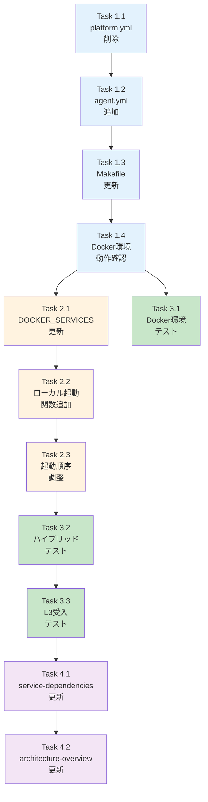

# 作業計画書: ３層構造の組み換え (Issue #316)

## 1. Issue概要の確認

```markdown
## Issue: ３層構造の組み換え
**Issue番号**: #316
**サイズ**: M（Medium）
**作業見積**: 8時間
**優先度**: Medium
**依存Issue**: なし
**ラベル**: feature
```

### 変更概要

| 層 | 変更前 | 変更後 |
|---|--------|--------|
| **Platform** | valkey, jobqueue, myscheduler, myvault, langfuse-* | valkey, myvault, langfuse-* |
| **Agent** | expertagent, graphaiserver | jobqueue, myscheduler, expertagent, graphaiserver |
| **Frontend** | commonui, myagentdesk | commonui, myagentdesk |

---

## 2. 詳細タスク分解

### Phase 1: Docker Compose変更（3.5時間）

- [ ] **Task 1.1**: docker-compose.platform.yml から jobqueue/myscheduler 削除
  - 所要時間: 0.5時間
  - 成果物: `docker-compose.platform.yml`
  - 依存: なし
  - 作業内容:
    - jobqueue サービス定義の削除
    - myscheduler サービス定義の削除

- [ ] **Task 1.2**: docker-compose.agent.yml に jobqueue/myscheduler 追加
  - 所要時間: 1時間
  - 成果物: `docker-compose.agent.yml`
  - 依存: Task 1.1
  - 作業内容:
    - jobqueue サービス定義の追加（先頭に配置）
    - myscheduler サービス定義の追加（depends_on: jobqueue）
    - サービス順序を依存関係順に整理

- [ ] **Task 1.3**: Makefile のヘルスチェック対象更新
  - 所要時間: 1時間
  - 成果物: `Makefile`
  - 依存: Task 1.2
  - 作業内容:
    - `_check-platform` から JOBQUEUE_PORT チェック削除
    - `_check-agent` に JOBQUEUE_PORT チェック追加
    - `_wait-platform` の更新
    - `_wait-agent` の更新
    - コメント更新（Layer description）

- [ ] **Task 1.4**: Docker環境動作確認
  - 所要時間: 1時間
  - 成果物: 動作確認ログ
  - 依存: Task 1.3
  - 作業内容:
    - `docker compose up -d` で全サービス起動確認
    - `make dev-platform` で Platform 層のみ起動確認
    - `make dev-agent` で Agent 層起動確認
    - `make status` で全サービス状態確認

### Phase 2: dev-hybrid.sh 更新（2時間）

- [ ] **Task 2.1**: DOCKER_SERVICES 変数更新
  - 所要時間: 0.5時間
  - 成果物: `scripts/dev-hybrid.sh`
  - 依存: Task 1.4
  - 作業内容:
    - DOCKER_SERVICES から jobqueue, myscheduler を削除
    - バナー表示の更新

- [ ] **Task 2.2**: ローカル起動関数追加
  - 所要時間: 1時間
  - 成果物: `scripts/dev-hybrid.sh`
  - 依存: Task 2.1
  - 作業内容:
    - `start_jobqueue()` 関数追加
    - `start_myscheduler()` 関数追加
    - `stop_jobqueue()` 関数追加
    - `stop_myscheduler()` 関数追加
    - PID/LOG ファイルパス変数追加

- [ ] **Task 2.3**: 起動順序の調整
  - 所要時間: 0.5時間
  - 成果物: `scripts/dev-hybrid.sh`
  - 依存: Task 2.2
  - 作業内容:
    - `start_all()` 関数の起動順序更新
    - `stop_all()` 関数の停止順序更新
    - ヘルスチェック待機の調整

### Phase 3: テスト（1.5時間）

- [ ] **Task 3.1**: Docker環境テスト
  - 所要時間: 0.5時間
  - 成果物: テスト結果ログ
  - 依存: Task 1.4
  - 作業内容:
    - `docker compose up -d` 全サービス起動
    - 全サービス healthy 確認
    - サービス間通信テスト（expertagent → jobqueue）

- [ ] **Task 3.2**: ハイブリッド環境テスト
  - 所要時間: 0.5時間
  - 成果物: テスト結果ログ
  - 依存: Task 2.3
  - 作業内容:
    - `./scripts/dev-hybrid.sh start` 実行
    - 全サービス起動確認
    - ログファイル確認

- [ ] **Task 3.3**: L3受入テスト実行
  - 所要時間: 0.5時間
  - 成果物: `tests/acceptance/test_issue_316_acceptance.sh`
  - 依存: Task 3.2
  - 作業内容:
    - 受入テストスクリプト作成
    - テスト実行・エビデンス収集

### Phase 4: ドキュメント更新（1時間）

- [ ] **Task 4.1**: service-dependencies.md 更新
  - 所要時間: 0.5時間
  - 成果物: `docs/arch/service-dependencies.md`
  - 依存: Task 3.3
  - 作業内容:
    - レイヤ構成表の更新
    - 依存関係マトリクスの更新
    - 起動順序図の更新

- [ ] **Task 4.2**: architecture-overview.md 更新
  - 所要時間: 0.5時間
  - 成果物: `docs/design/architecture-overview.md`
  - 依存: Task 4.1
  - 作業内容:
    - システム構成図の更新
    - サービス一覧表の更新

---

## 3. タスク依存関係



---

## 4. 作業スケジュール

### 日次計画

**Day 1 (8時間)**

| 時間 | タスク | 成果物 |
|------|-------|--------|
| 09:00-09:30 | Task 1.1: platform.yml から削除 | docker-compose.platform.yml |
| 09:30-10:30 | Task 1.2: agent.yml に追加 | docker-compose.agent.yml |
| 10:30-11:30 | Task 1.3: Makefile 更新 | Makefile |
| 11:30-12:30 | Task 1.4: Docker環境動作確認 | 動作確認ログ |
| 13:30-14:00 | Task 2.1: DOCKER_SERVICES 更新 | dev-hybrid.sh |
| 14:00-15:00 | Task 2.2: ローカル起動関数追加 | dev-hybrid.sh |
| 15:00-15:30 | Task 2.3: 起動順序調整 | dev-hybrid.sh |
| 15:30-16:00 | Task 3.1: Docker環境テスト | テスト結果 |
| 16:00-16:30 | Task 3.2: ハイブリッド環境テスト | テスト結果 |
| 16:30-17:00 | Task 3.3: L3受入テスト | 受入テストスクリプト |
| 17:00-17:30 | Task 4.1: service-dependencies.md | ドキュメント |
| 17:30-18:00 | Task 4.2: architecture-overview.md | ドキュメント |

**総作業時間**: 8時間（1日）

---

## 5. チェックポイント

| タイミング | 確認事項 | 対応 |
|-----------|---------|------|
| Task 1.2完了時 | agent.yml の構文確認 | `docker compose -f docker-compose.agent.yml config` |
| Task 1.4完了時 | 全サービス healthy | `make status` で確認 |
| Task 2.3完了時 | dev-hybrid.sh 構文確認 | `bash -n scripts/dev-hybrid.sh` |
| Task 3.2完了時 | 全サービス正常起動 | ログ確認 |
| PR作成前 | pre-push-check 実行 | `./scripts/pre-push-check-all.sh` |

---

## 6. リスクと対策

| リスク | 発生確率 | 影響 | 対策 |
|-------|---------|------|------|
| Docker Compose 構文エラー | 低 | 実装遅延30分 | 各段階で config コマンドで検証 |
| サービス起動順序の問題 | 中 | 実装遅延1時間 | depends_on + service_healthy 条件を厳密に設定 |
| dev-hybrid.sh の互換性問題 | 中 | 実装遅延1時間 | 変更前後でテストを実施 |
| ドキュメント更新漏れ | 低 | 品質問題 | チェックリストで確認 |

---

## 7. 成果物チェックリスト

### コード変更
- [ ] `docker-compose.platform.yml` - jobqueue/myscheduler 削除
- [ ] `docker-compose.agent.yml` - jobqueue/myscheduler 追加
- [ ] `Makefile` - ヘルスチェック対象更新
- [ ] `scripts/dev-hybrid.sh` - ローカル起動関数追加

### テスト
- [ ] `tests/acceptance/test_issue_316_acceptance.sh` - 受入テストスクリプト

### ドキュメント
- [ ] `docs/arch/service-dependencies.md` - レイヤ構成更新
- [ ] `docs/design/architecture-overview.md` - システム構成図更新

---

## 8. L3受入テスト計画（具体的なコマンド）

### Step 1: サービス起動確認

```bash
# Docker環境の場合
docker compose up -d
sleep 30  # サービス起動待機

# ヘルスチェック（Platform層）
curl -sf http://localhost:8003/health && echo "✅ myVault: healthy" || echo "❌ myVault: unhealthy"

# ヘルスチェック（Agent層 - 移動後）
curl -sf http://localhost:8001/health && echo "✅ jobqueue: healthy" || echo "❌ jobqueue: unhealthy"
curl -sf http://localhost:8002/health && echo "✅ myscheduler: healthy" || echo "❌ myscheduler: unhealthy"
curl -sf http://localhost:8004/health && echo "✅ expertagent: healthy" || echo "❌ expertagent: unhealthy"
curl -sf http://localhost:8005/health && echo "✅ graphaiserver: healthy" || echo "❌ graphaiserver: unhealthy"
```

### Step 2: サービス間通信テスト

```bash
# expertagent → jobqueue 通信確認
# jobqueue API にジョブ一覧取得リクエスト
curl -s -X GET http://localhost:8001/api/v1/jobs \
  -H "X-API-Token: ${JOBQUEUE_API_TOKEN:-test}" \
  -w "\nHTTP Status: %{http_code}\n"

# 期待するレスポンス:
# - HTTPステータス: 200
# - レスポンスボディ: {"items": [...], ...}

# myscheduler → jobqueue 通信確認
curl -s -X GET http://localhost:8002/api/v1/jobs \
  -H "X-API-Token: ${MYSCHEDULER_API_TOKEN:-test}" \
  -w "\nHTTP Status: %{http_code}\n"

# 期待するレスポンス:
# - HTTPステータス: 200
```

### Step 3: 層別起動テスト

```bash
# 一度全停止
docker compose down

# Platform層のみ起動
make dev-platform
sleep 20

# Platform層ヘルスチェック
curl -sf http://localhost:8003/health && echo "✅ Platform: myVault healthy"

# Agent層起動（Platform依存）
make dev-agent
sleep 30

# Agent層ヘルスチェック
curl -sf http://localhost:8001/health && echo "✅ Agent: jobqueue healthy"
curl -sf http://localhost:8004/health && echo "✅ Agent: expertagent healthy"

# ステータス確認
make status
```

### Step 4: ハイブリッド環境テスト

```bash
# 全停止
docker compose down
pkill -f "uvicorn" || true
pkill -f "npm" || true

# ハイブリッド起動
./scripts/dev-hybrid.sh start

# 全サービスヘルスチェック
for port in 8001 8002 8003 8004 8005; do
  curl -sf http://localhost:$port/health && echo "✅ Port $port: healthy" || echo "❌ Port $port: unhealthy"
done

# ログ確認
ls -la logs/
tail -20 logs/jobqueue.log
tail -20 logs/myscheduler.log
```

### Step 5: エビデンス収集

```bash
# サービス状態をファイルに保存
make status > /tmp/issue_316_status.txt 2>&1

# ヘルスチェック結果を保存
for port in 8001 8002 8003 8004 8005; do
  echo "=== Port $port ===" >> /tmp/issue_316_health.txt
  curl -s http://localhost:$port/health >> /tmp/issue_316_health.txt
  echo "" >> /tmp/issue_316_health.txt
done

# Docker ps 結果を保存
docker compose ps > /tmp/issue_316_docker_ps.txt 2>&1
```

---

## 9. Definition of Done

Issue完了条件：

### 必須条件
- [ ] すべてのタスクが完了
- [ ] Docker環境で全サービス healthy
- [ ] ハイブリッド環境で全サービス正常起動
- [ ] サービス間通信（expertagent → jobqueue）正常
- [ ] L3受入テスト全パス
- [ ] `./scripts/pre-push-check-all.sh` パス
- [ ] ドキュメント更新完了

### コードレビュー観点
- [ ] docker-compose.*.yml の構文正確性
- [ ] Makefile のロジック正確性
- [ ] dev-hybrid.sh の互換性維持
- [ ] ドキュメントと実装の整合性

---

## 10. 次のアクション

作業計画承認後：

1. **ブランチ作成**
   ```bash
   git checkout -b issue/316-layer-restructure
   ```

2. **worktree作成**（別セッションで作業する場合）
   ```bash
   ./scripts/worktree-create-from-issue.sh 316
   ```

3. **タスク実行**
   - 本計画に従って実装
   - 各タスク完了時にコミット

4. **進捗報告**
   - `/progress-report` で定期報告

5. **PR作成**
   - `/pm-create-pr` でPR作成

---

## 参照ドキュメント

| ドキュメント | パス |
|-------------|------|
| 要件定義書 | `dev-reports/feature/issue/316/requirements.md` |
| 設計方針書 | `dev-reports/feature/issue/316/design-policy.md` |
| アーキテクチャレビュー | `dev-reports/feature/issue/316/architecture-review.md` |
| サービス依存関係 | `docs/arch/service-dependencies.md` |
| アーキテクチャ概要 | `docs/design/architecture-overview.md` |

---

**作成日**: 2025-12-28
**Issue**: [#316](https://github.com/kewton/MySwiftAgent/issues/316)
**ステータス**: 承認待ち
