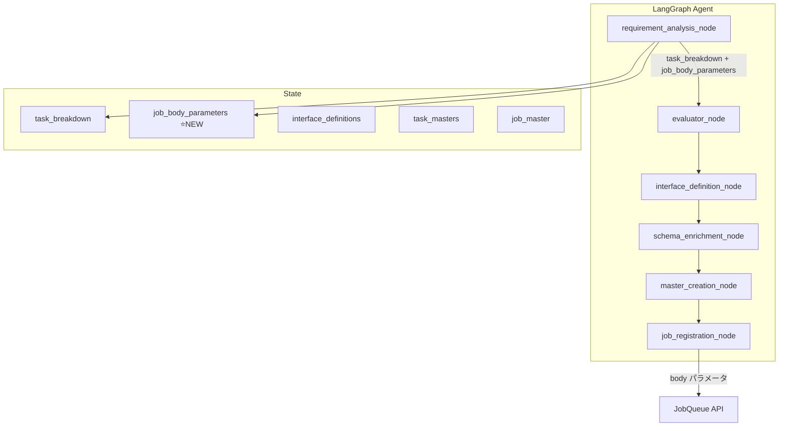

# 設計方針書: Job Generator パラメータ抽出機能

**Issue**: #321
**親Issue**: #325 (Job Generator 実行信頼性向上)
**作成日**: 2025-12-29
**対象プロジェクト**: expertAgent

---

## 現状調査サマリ

### 対象プロジェクト

- **プロジェクト名**: expertAgent
- **主要モジュール**: `aiagent/langgraph/jobTaskGeneratorAgents/`
- **関連サービス**: jobqueue (Job登録API)

### 既存アーキテクチャパターン

| パターン | 使用箇所 | 目的 |
|---------|---------|------|
| LangGraph StateGraph | `agent.py` | 多段階ワークフロー制御 |
| TypedDict State | `state.py` | 型安全なステート管理 |
| Pydantic Models | `prompts/task_breakdown.py` | LLM出力の構造化 |
| Async HTTP Client | `utils/jobqueue_client.py` | JobQueue API呼び出し |

### 既存データフロー

```
user_requirement (自然言語)
    ↓
requirement_analysis_node
    → task_breakdown: list[TaskBreakdownItem]
    → ❌ Job body パラメータ抽出なし
    ↓
evaluator_node → interface_definition_node → schema_enrichment_node
    → interface_definitions: {task_id: {input_schema, output_schema}}
    → ❌ Job body スキーマ定義なし
    ↓
master_creation_node
    → TaskMaster.body_template: {"user_input": "{{job.body}}"}
    → ❌ Job body 構造は未定義
    ↓
job_registration_node
    → JobqueueClient.create_job(body=None)  ← ❌ body パラメータ未設定
    ↓
[Task実行時]
    → TemplateResolver: {{job.body.field}} → null
    → HTTP 422 エラー
```

### 設計上の制約

1. **既存API互換性**: JobQueue API は `body` パラメータをサポート済み（`JobCreateFromMaster.body`）
2. **テンプレート解決器**: `{{job.body.field}}` 形式のテンプレート変数はすでに動作する
3. **LLM出力構造**: `TaskBreakdownResponse` スキーマの拡張が必要
4. **後方互換性**: 既存のJobMaster/TaskMasterに影響を与えない

### 参照したドキュメント

| ドキュメント | 内容 |
|-------------|------|
| `docs/spec/job-generation-workflow.md` | Job Generator 7段階ワークフロー仕様 |
| `expertAgent/docs/API_REFERENCE.md` | Expert Agent API仕様 |
| `jobqueue/app/schemas/job.py` | JobCreateFromMaster スキーマ |

---

## アーキテクチャ設計

### システム構成図（変更後）



### レイヤー構成

変更は主に以下のレイヤーに影響：

| レイヤー | ファイル | 変更内容 |
|---------|---------|---------|
| **プロンプト層** | `prompts/task_breakdown.py` | パラメータ抽出指示追加 |
| **ステート層** | `state.py` | `job_body_parameters` フィールド追加 |
| **ノード層** | `nodes/requirement_analysis.py` | パラメータ抽出処理 |
| **クライアント層** | `utils/jobqueue_client.py` | `body` パラメータ追加 |
| **登録層** | `nodes/job_registration.py` | `body` 渡し処理 |

---

## 技術選定

| カテゴリ | 選定技術 | 選定理由 | 既存との整合性 |
|---------|---------|---------|---------------|
| LLM出力構造 | Pydantic + structured output | 既存パターン踏襲 | ✅ 完全互換 |
| パラメータスキーマ | JSON Schema | Interface定義と統一 | ✅ 完全互換 |
| HTTP通信 | httpx (既存) | 変更不要 | ✅ 完全互換 |

---

## 設計パターン

### 採用パターン

1. **Pydantic Model拡張** (既存パターン)
   - `TaskBreakdownResponse` に `job_body_parameters` フィールドを追加
   - 既存の `TaskBreakdownItem` は変更なし

2. **TypedDict State拡張** (既存パターン)
   - `JobTaskGeneratorState` に `job_body_parameters` フィールドを追加
   - 初期値は空dict

3. **Optional Parameter Pattern** (既存パターン)
   - `JobqueueClient.create_job()` に `body` オプションパラメータ追加
   - 未指定時は既存動作（body=None）

---

## データモデル設計

### 新規スキーマ: JobBodyParameter

```python
# 許容する値の型（セキュリティのため Any は使用しない）
JobBodyValueType = str | int | float | bool | list[str] | list[int] | dict[str, str]


class JobBodyParameter(BaseModel):
    """Job body に含めるパラメータ定義.

    セキュリティ考慮:
    - value の型をプリミティブ型と単純構造に制限
    - 任意オブジェクト（Any）は許容しない
    - 機密パラメータ名（password, api_key等）は抽出対象外
    """

    name: str = Field(
        description="パラメータ名（例: 'recipient_email', 'search_query'）",
        pattern=r"^[a-z][a-z0-9_]*$",  # 有効な識別子のみ許容
    )
    value: JobBodyValueType = Field(
        description="ユーザー要件から抽出した値（プリミティブ型または単純構造のみ）"
    )
    type: str = Field(
        default="string",
        description="データ型（string, number, boolean, array, object）"
    )
    description: str = Field(
        default="",
        description="パラメータの説明"
    )
    source: str = Field(
        default="user_requirement",
        description="抽出元（user_requirement, default, derived）"
    )

    @field_validator("name")
    @classmethod
    def validate_not_sensitive(cls, v: str) -> str:
        """機密パラメータ名を拒否."""
        sensitive_names = {"password", "api_key", "secret", "token", "credential", "auth"}
        if v.lower() in sensitive_names or any(s in v.lower() for s in sensitive_names):
            raise ValueError(f"Sensitive parameter name not allowed: {v}")
        return v
```

### State拡張

```python
class JobTaskGeneratorState(TypedDict, total=False):
    # ... 既存フィールド ...

    # ===== NEW: Job Body Parameters =====
    job_body_parameters: list[dict[str, Any]]  # JobBodyParameter のリスト
```

### TaskBreakdownResponse 拡張

```python
class TaskBreakdownResponse(BaseModel):
    """Task breakdown response from LLM."""

    tasks: list[TaskBreakdownItem] = Field(...)
    overall_summary: str = Field(...)

    # ⭐ NEW: Job-level input parameters
    job_body_parameters: list[JobBodyParameter] = Field(
        default_factory=list,
        description="ユーザー要件から抽出したJob入力パラメータ"
    )
```

---

## API設計

### JobqueueClient.create_job() 変更

```python
async def create_job(
    self,
    master_id: str,
    name: str,
    method: str,
    url: str,
    tasks: list[dict] | None = None,
    priority: int = 5,
    scheduled_at: str | None = None,
    timeout_sec: int = 120,
    body: dict[str, Any] | None = None,  # ⭐ NEW
) -> dict:
    """Create new Job from JobMaster.

    Args:
        ...
        body: Job body parameters for template resolution (optional)
    """
    return await self._request(
        "POST",
        f"/api/v1/jobs/from-master/{master_id}",
        json={
            "name": name,
            "tasks": tasks,
            "priority": priority,
            "scheduled_at": scheduled_at,
            "timeout_sec": timeout_sec,
            "body": body,  # ⭐ NEW
        },
    )
```

### job_registration_node 変更

```python
async def job_registration_node(state: JobTaskGeneratorState) -> JobTaskGeneratorState:
    # ... 既存処理 ...

    # ⭐ NEW: Extract job body parameters from state
    job_body_parameters = state.get("job_body_parameters", [])
    job_body = {}
    for param in job_body_parameters:
        job_body[param["name"]] = param["value"]

    job = await client.create_job(
        master_id=job_master_id,
        name=job_name,
        method=job_method,
        url=job_url,
        tasks=tasks,
        priority=priority,
        scheduled_at=None,
        timeout_sec=job_timeout_sec,
        body=job_body if job_body else None,  # ⭐ NEW
    )
```

---

## LLMプロンプト設計

### task_breakdown.py への追加

```markdown
## 6. Job入力パラメータの抽出（NEW）

ユーザー要件から、Job全体で必要な入力パラメータを抽出してください。
これらのパラメータは `job.body` に格納され、各タスクから `{{job.body.パラメータ名}}` で参照できます。

### 抽出すべきパラメータの例

| パラメータ種別 | 例 | 抽出パターン |
|--------------|---|------------|
| メールアドレス | `recipient_email` | "〜にメールを送信" |
| 検索キーワード | `search_query` | "〜について検索" |
| ファイルパス | `file_path` | "〜ファイルを" |
| 件数指定 | `max_results` | "〜件取得" |
| 日付範囲 | `start_date`, `end_date` | "〜から〜まで" |

### 出力形式

```json
{
  "tasks": [...],
  "overall_summary": "...",
  "job_body_parameters": [
    {
      "name": "recipient_email",
      "value": "user@example.com",
      "type": "string",
      "description": "メール送信先アドレス",
      "source": "user_requirement"
    },
    {
      "name": "search_query",
      "value": "大谷翔平",
      "type": "string",
      "description": "Google検索キーワード",
      "source": "user_requirement"
    }
  ]
}
```

### 注意事項

- 明示的にユーザーが指定した値のみ抽出する
- 推測や補完は行わない（source="derived" として明示的に区別）
- 各タスクの body_template で参照されることを想定
```

---

## セキュリティ設計

### データ検証

1. **パラメータ値のサニタイズ**:
   - LLM出力を Pydantic でバリデーション
   - 型チェック（string, number, boolean等）

2. **機密情報の取り扱い**:
   - パスワード、APIキーは抽出対象外
   - `source: "user_requirement"` で明示的に追跡

---

## パフォーマンス設計

### 影響評価

| 項目 | 影響 | 対策 |
|-----|------|------|
| LLM呼び出し | なし | 既存の requirement_analysis 呼び出しで同時抽出 |
| State サイズ | 微増 | パラメータ数は通常5件以下 |
| API呼び出し | なし | 既存の create_job 呼び出しに body 追加のみ |

---

## 設計判断とトレードオフ

### 判断1: パラメータ抽出をどの段階で行うか

| 選択肢 | メリット | デメリット |
|-------|---------|-----------|
| **A. requirement_analysis で同時抽出** ✅採用 | LLM呼び出し1回で完了、タスク分解と整合性確保 | プロンプト複雑化 |
| B. 新規ノードを追加 | 責務分離 | LLM呼び出し増加、遅延 |
| C. interface_definition で抽出 | スキーマと統合 | タスク分解後では文脈喪失 |

**決定**: 選択肢A - 既存の requirement_analysis_node でタスク分解と同時にパラメータ抽出

**理由**:
- ユーザー要件の解析は1回で行う方が文脈を保持できる
- 追加のLLM呼び出しを避け、レイテンシ増加を防ぐ
- 既存の `TaskBreakdownResponse` を拡張するだけで実装可能

### 判断2: body_template との整合性確保

| 選択肢 | メリット | デメリット |
|-------|---------|-----------|
| **A. 静的body_template + 動的job.body** ✅採用 | 既存body_template変更不要 | パラメータ名の整合性は手動 |
| B. body_template をパラメータに応じて動的生成 | 完全な整合性 | 複雑、既存破壊的変更 |

**決定**: 選択肢A - body_template は既存の `{{job.body}}` のまま、job.body の中身を動的に設定

**理由**:
- 既存の TaskMaster に影響なし
- `{{job.body.field}}` 形式のテンプレート解決は既に動作する
- #322 (body_template検証) で整合性チェックを強化

### 判断3: パラメータが抽出できない場合の挙動

| 選択肢 | メリット | デメリット |
|-------|---------|-----------|
| A. エラーとして処理中断 | 明確な失敗 | ユーザー体験悪化 |
| **B. 空のbodyで続行 + 警告ログ** ✅採用 | 後方互換性維持 | 実行時エラーの可能性 |
| C. ユーザーに確認を求める | 明示的な対話 | 非同期処理に不向き |

**決定**: 選択肢B - パラメータ抽出が空の場合も処理を続行し、警告ログを出力

**理由**:
- 既存ワークフローとの互換性維持
- #324 (ログ強化) でデバッグ情報を充実
- 実行時エラーは #322 (body_template検証) で早期検出

---

## 実装計画

### Phase 1: スキーマ・State拡張

1. `JobBodyParameter` モデル作成 (`prompts/task_breakdown.py`)
2. `TaskBreakdownResponse` に `job_body_parameters` 追加
3. `JobTaskGeneratorState` に `job_body_parameters` 追加 (`state.py`)
4. `create_initial_state()` に初期値追加

### Phase 2: LLMプロンプト修正

1. システムプロンプトにパラメータ抽出指示追加 (`task_breakdown.py`)
2. 出力形式例に `job_body_parameters` 追加
3. `prompts/task_breakdown.yaml` にサンプル追加

### Phase 3: ノード実装

1. `requirement_analysis_node` でパラメータをStateに格納
2. `JobqueueClient.create_job()` に `body` パラメータ追加
3. `job_registration_node` でbodyを組み立てて渡す

#### requirement_analysis_node 変更詳細

**変更前** (`nodes/requirement_analysis.py:194-200`):
```python
return {
    **state,
    "task_breakdown": [task.model_dump() for task in response.tasks],
    "overall_summary": response.overall_summary,
    "evaluator_stage": "after_task_breakdown",
    "retry_count": updated_retry,
}
```

**変更後**:
```python
return {
    **state,
    "task_breakdown": [task.model_dump() for task in response.tasks],
    "overall_summary": response.overall_summary,
    "job_body_parameters": [p.model_dump() for p in response.job_body_parameters],  # ⭐ NEW
    "evaluator_stage": "after_task_breakdown",
    "retry_count": updated_retry,
}
```

#### パラメータ検証関数の追加

既存の `_validate_task_breakdown_response` を拡張:

```python
def _validate_task_breakdown_response(
    response: TaskBreakdownResponse | None,
) -> TaskBreakdownResponse:
    """Validate that the LLM response contains a usable task list."""

    # ... 既存の検証処理 ...

    # ⭐ NEW: パラメータ名の検証
    if response.job_body_parameters:
        for param in response.job_body_parameters:
            if not param.name or not param.name.isidentifier():
                logger.warning(
                    "Invalid parameter name: %s (must be valid Python identifier)",
                    param.name
                )
        # パラメータ抽出が空でも警告のみ（エラーにしない）
        logger.info(
            "Extracted %d job body parameters: %s",
            len(response.job_body_parameters),
            [p.name for p in response.job_body_parameters]
        )

    return response
```

### Phase 4: テスト

1. 単体テスト: `test_task_breakdown.py` - パラメータ抽出
2. 単体テスト: `test_job_registration.py` - body パラメータ伝播
3. 結合テスト: E2Eでパラメータがjob.bodyに設定されることを確認

---

## 影響範囲

### 変更ファイル一覧

| ファイル | 変更種別 | 内容 |
|---------|---------|------|
| `prompts/task_breakdown.py` | 修正 | JobBodyParameter追加、プロンプト修正 |
| `prompts/task_breakdown.yaml` | 修正 | サンプル追加 |
| `state.py` | 修正 | job_body_parameters フィールド追加 |
| `nodes/requirement_analysis.py` | 修正 | パラメータ抽出・State格納 |
| `utils/jobqueue_client.py` | 修正 | body パラメータ追加 |
| `nodes/job_registration.py` | 修正 | body 組み立て・渡し |
| `tests/unit/test_task_breakdown.py` | 修正 | パラメータ抽出テスト追加 |
| `tests/unit/test_job_registration.py` | 新規 | body伝播テスト |

### 影響を受けない既存機能

- TaskMaster body_template（`{{job.body}}` 形式は変更なし）
- TemplateResolver（既存のテンプレート解決ロジック）
- JobQueue API（既に body パラメータをサポート）
- 既存のJobMaster/TaskMaster定義

---

## 関連Issue

| Issue | 関係 | 備考 |
|-------|------|------|
| #325 | 親Issue | Job Generator 実行信頼性向上 |
| #322 | 後続 | body_template 検証機能（本Issueで抽出したパラメータの検証） |
| #324 | 補助 | ログ強化（パラメータ抽出結果のログ出力） |
| #316 | 発端 | 3層構造組み換え（問題発覚のきっかけ） |

---

## アーキテクチャレビュー結果

**レビュー日**: 2025-12-29
**判定**: ✅ 承認（Approved）

### レビュー指摘事項と対応

| # | 指摘事項 | 対応状況 |
|---|---------|---------|
| 1 | `JobBodyParameter.value` の型を `Any` → プリミティブ型に制限 | ✅ 対応済 - `JobBodyValueType` を定義し型制限を追加 |
| 2 | `requirement_analysis_node` の戻り値に `job_body_parameters` を明示追加 | ✅ 対応済 - Phase 3 に実装詳細を追加 |
| 3 | パラメータ検証関数の追加 | ✅ 対応済 - `_validate_task_breakdown_response` 拡張案を追加 |
| 4 | 機密パラメータ名のブラックリスト | ✅ 対応済 - `validate_not_sensitive` バリデータを追加 |

### セキュリティ強化項目

- `value` 型を `Any` から `JobBodyValueType` に変更（プリミティブ型と単純構造のみ許容）
- `name` フィールドにパターンバリデーション追加（`^[a-z][a-z0-9_]*$`）
- 機密パラメータ名（password, api_key, secret 等）の拒否バリデータを追加

### 次のステップ

1. ✅ 設計書への改善項目反映（本対応）
2. 作業計画書 (`work-plan.md`) の作成
3. 実装開始
