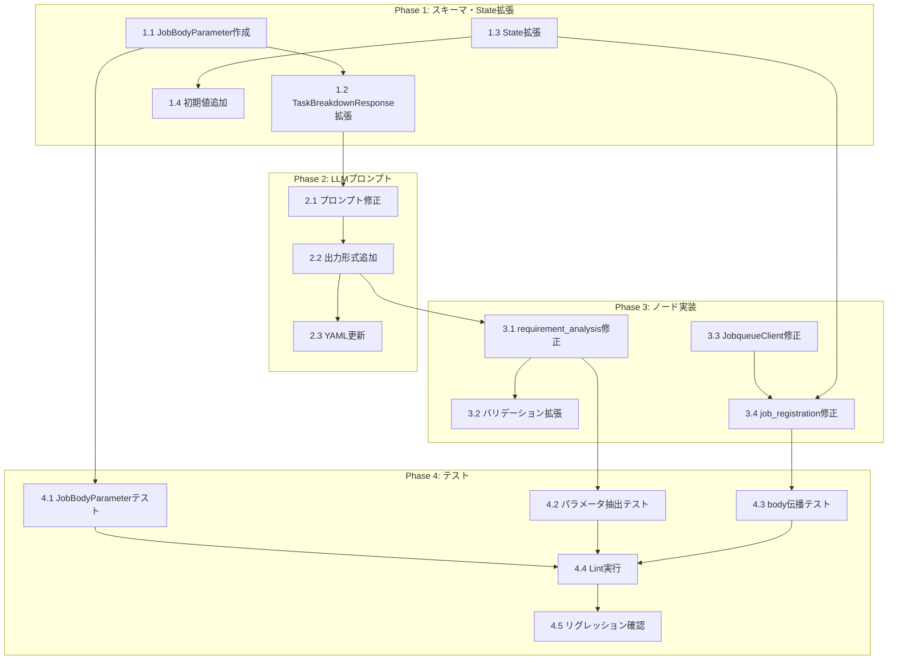

# 作業計画書: Job Generator パラメータ抽出機能

**Issue**: #321
**親Issue**: #325 (Job Generator 実行信頼性向上)
**作成日**: 2025-12-29
**対象プロジェクト**: expertAgent

---

## 概要

Job Generator がユーザー要件から抽出したパラメータ（メールアドレス、検索キーワード等）を Job body に自動的に含める機能を実装する。

---

## タスク一覧

### Phase 1: スキーマ・State拡張

| # | タスク | ファイル | 工数(h) | 依存 |
|---|--------|---------|---------|------|
| 1.1 | `JobBodyParameter` Pydanticモデル作成 | `prompts/task_breakdown.py` | 0.5 | - |
| 1.2 | `TaskBreakdownResponse` に `job_body_parameters` フィールド追加 | `prompts/task_breakdown.py` | 0.25 | 1.1 |
| 1.3 | `JobTaskGeneratorState` に `job_body_parameters` フィールド追加 | `state.py` | 0.25 | - |
| 1.4 | `create_initial_state()` に初期値追加 | `state.py` | 0.25 | 1.3 |

**Phase 1 合計**: 1.25h

### Phase 2: LLMプロンプト修正

| # | タスク | ファイル | 工数(h) | 依存 |
|---|--------|---------|---------|------|
| 2.1 | システムプロンプトにパラメータ抽出指示追加 | `prompts/task_breakdown.py` | 0.5 | 1.2 |
| 2.2 | 出力形式例に `job_body_parameters` 追加 | `prompts/task_breakdown.py` | 0.25 | 2.1 |
| 2.3 | `task_breakdown.yaml` にサンプル追加（任意） | `prompts/task_breakdown.yaml` | 0.25 | 2.2 |

**Phase 2 合計**: 1.0h

### Phase 3: ノード実装

| # | タスク | ファイル | 工数(h) | 依存 |
|---|--------|---------|---------|------|
| 3.1 | `requirement_analysis_node` でパラメータをStateに格納 | `nodes/requirement_analysis.py` | 0.5 | 2.2 |
| 3.2 | `_validate_task_breakdown_response` 拡張 | `nodes/requirement_analysis.py` | 0.5 | 3.1 |
| 3.3 | `JobqueueClient.create_job()` に `body` パラメータ追加 | `utils/jobqueue_client.py` | 0.5 | - |
| 3.4 | `job_registration_node` でbodyを組み立てて渡す | `nodes/job_registration.py` | 0.5 | 3.3, 1.3 |

**Phase 3 合計**: 2.0h

### Phase 4: テスト

| # | タスク | ファイル | 工数(h) | 依存 |
|---|--------|---------|---------|------|
| 4.1 | `JobBodyParameter` 単体テスト追加 | `tests/unit/test_task_breakdown.py` | 0.5 | 1.1 |
| 4.2 | パラメータ抽出の単体テスト追加 | `tests/unit/test_task_breakdown.py` | 0.5 | 3.1 |
| 4.3 | `job_registration_node` body伝播テスト | `tests/unit/test_job_registration.py` | 0.5 | 3.4 |
| 4.4 | 静的解析・Lint実行 | - | 0.25 | 4.1-4.3 |
| 4.5 | 既存テスト全体実行（リグレッション確認） | - | 0.25 | 4.4 |

**Phase 4 合計**: 2.0h

---

## 依存関係図



---

## 実行順序（推奨）

```
[並列可能グループ A]
├── 1.1 JobBodyParameter作成
├── 1.3 State拡張
└── 3.3 JobqueueClient修正

[順次実行]
1.1 → 1.2 → 2.1 → 2.2 → 2.3 → 3.1 → 3.2
1.3 → 1.4 → 3.4
3.3 → 3.4

[並列可能グループ B（Phase 4）]
├── 4.1 JobBodyParameterテスト（1.1完了後）
├── 4.2 パラメータ抽出テスト（3.1完了後）
└── 4.3 body伝播テスト（3.4完了後）

[最終]
4.4 → 4.5
```

---

## 変更ファイル一覧

| ファイル | 変更種別 | Phase |
|---------|---------|-------|
| `expertAgent/aiagent/langgraph/jobTaskGeneratorAgents/prompts/task_breakdown.py` | 修正 | 1, 2 |
| `expertAgent/aiagent/langgraph/jobTaskGeneratorAgents/state.py` | 修正 | 1 |
| `expertAgent/aiagent/langgraph/jobTaskGeneratorAgents/nodes/requirement_analysis.py` | 修正 | 3 |
| `expertAgent/aiagent/langgraph/jobTaskGeneratorAgents/utils/jobqueue_client.py` | 修正 | 3 |
| `expertAgent/aiagent/langgraph/jobTaskGeneratorAgents/nodes/job_registration.py` | 修正 | 3 |
| `expertAgent/aiagent/langgraph/jobTaskGeneratorAgents/prompts/task_breakdown.yaml` | 修正 | 2 |
| `expertAgent/tests/unit/test_task_breakdown.py` | 修正 | 4 |
| `expertAgent/tests/unit/test_job_registration.py` | 新規/修正 | 4 |

---

## L3 受入テスト計画

### テスト環境

```bash
# サービス起動
./scripts/dev-hybrid.sh
```

### テストケース 1: パラメータ抽出の検証

**目的**: ユーザー要件からメールアドレスが Job body に抽出されることを確認

**前提条件**:
- expertAgent が起動中 (port 8004)
- jobqueue が起動中 (port 8001)

**手順**:

```bash
# Step 1: Job Generator API を呼び出し
curl -X POST http://localhost:8004/api/v1/job-generator/generate \
  -H "Content-Type: application/json" \
  -d '{
    "user_requirement": "大谷翔平についてGoogle検索し、結果を2件取得して、newtons.boiled.clock@gmail.com にメールで送信してください",
    "project_id": "test-project-321"
  }' | jq '.'

# Step 2: レスポンスから job_id を取得
JOB_ID="<response の job_id>"

# Step 3: 作成された Job を確認
curl -X GET "http://localhost:8001/api/v1/jobs/${JOB_ID}" | jq '.body'
```

**期待結果**:

```json
{
  "recipient_email": "newtons.boiled.clock@gmail.com",
  "search_query": "大谷翔平",
  "num_results": 2
}
```

### テストケース 2: 複数パラメータの抽出

**目的**: 複数の異なる種類のパラメータが正しく抽出されることを確認

```bash
curl -X POST http://localhost:8004/api/v1/job-generator/generate \
  -H "Content-Type: application/json" \
  -d '{
    "user_requirement": "2024年1月1日から2024年12月31日までの売上データを集計し、report.pdf として保存してください",
    "project_id": "test-project-321"
  }' | jq '.job_body_parameters'
```

**期待結果**:
- `start_date`: "2024-01-01"
- `end_date`: "2024-12-31"
- `output_filename`: "report.pdf"

### テストケース 3: パラメータなしの要件

**目的**: パラメータが抽出できない場合も正常に処理されることを確認

```bash
curl -X POST http://localhost:8004/api/v1/job-generator/generate \
  -H "Content-Type: application/json" \
  -d '{
    "user_requirement": "システムの状態を確認してください",
    "project_id": "test-project-321"
  }' | jq '.body'
```

**期待結果**:
- `body` が `null` または空オブジェクト `{}`
- エラーにならず正常にJob作成完了

### テストケース 4: 機密パラメータの除外

**目的**: パスワードやAPIキーが抽出対象から除外されることを確認

```bash
curl -X POST http://localhost:8004/api/v1/job-generator/generate \
  -H "Content-Type: application/json" \
  -d '{
    "user_requirement": "APIキー sk-1234567890 を使ってOpenAI APIを呼び出してください",
    "project_id": "test-project-321"
  }' | jq '.job_body_parameters'
```

**期待結果**:
- `api_key` や `password` を含むパラメータが抽出されていない
- または Pydantic ValidationError でリジェクト

---

## Definition of Done (DoD)

### 必須項目

- [ ] 全タスク（1.1〜4.5）が完了している
- [ ] 単体テストカバレッジ 90%以上を維持
- [ ] Ruff / MyPy エラーがゼロ
- [ ] `./scripts/pre-push-check-all.sh` が成功
- [ ] L3 受入テスト 4ケースがすべてパス

### 確認項目

- [ ] `JobBodyParameter` に型制限（`JobBodyValueType`）が適用されている
- [ ] 機密パラメータ名のバリデーションが動作する
- [ ] `requirement_analysis_node` が `job_body_parameters` を State に格納する
- [ ] `job_registration_node` が `body` パラメータを JobQueue API に渡す
- [ ] パラメータ抽出が空の場合も正常に処理される（後方互換性）

### ドキュメント

- [x] 設計方針書 (`design-policy.md`) 作成済
- [x] アーキテクチャレビュー (`architecture-review.md`) 承認済
- [x] 作業計画書 (`work-plan.md`) 作成済

---

## リスクと対策

| リスク | 影響度 | 発生確率 | 対策 |
|-------|--------|---------|------|
| LLMがパラメータを正しく抽出しない | 中 | 中 | プロンプトに具体例を追加、Few-shot learning |
| 既存テストが破損 | 高 | 低 | Phase 4.5 でリグレッション確認 |
| TaskBreakdownResponse の後方互換性 | 中 | 低 | `job_body_parameters` に default_factory=list を設定 |

---

## 関連ドキュメント

| ドキュメント | 用途 |
|-------------|------|
| [design-policy.md](./design-policy.md) | 設計方針・詳細設計 |
| [architecture-review.md](./architecture-review.md) | アーキテクチャレビュー結果 |
| [job-generation-workflow.md](../../../docs/spec/job-generation-workflow.md) | Job Generator 仕様 |
| [API_REFERENCE.md](../../../expertAgent/docs/API_REFERENCE.md) | Expert Agent API仕様 |

---

## 次のステップ

1. 本作業計画書の承認
2. Phase 1 から順次実装開始
3. 各Phase完了時にテスト実行
4. 全Phase完了後、L3 受入テスト実施
5. PR作成・レビュー依頼
