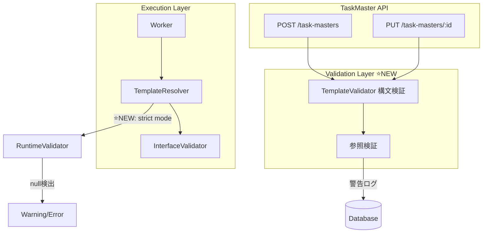

# 設計方針書: TaskMaster body_template 検証機能

**Issue**: #322
**親Issue**: #325 (Job Generator 実行信頼性向上)
**作成日**: 2025-12-29
**対象プロジェクト**: jobqueue

---

## 現状調査サマリ

### 対象プロジェクト

- **プロジェクト名**: jobqueue
- **主要モジュール**: `app/services/template_resolver.py`, `app/api/v1/task_masters.py`
- **関連サービス**: expertAgent (Job Generator)

### 既存アーキテクチャパターン

| パターン | 使用箇所 | 目的 |
|---------|---------|------|
| Static Method Class | `TemplateResolver` | テンプレート変数解決 |
| Pydantic Validation | `schemas/task_master.py` | APIリクエスト検証 |
| JSON Schema Validation | `InterfaceValidator` | 入出力スキーマ検証 |
| Repository Pattern | `api/v1/task_masters.py` | TaskMaster CRUD操作 |

### 既存データフロー

```
[TaskMaster作成/更新時]
TaskMasterCreate (Pydantic) → body_template バリデーションなし → DB保存
    ↓
[Task実行時]
Worker._execute_tasks()
    → task_master.body_template 取得
    → TemplateResolver.has_template_variables() でチェック
    → TemplateResolver.resolve_template() で解決
        ├─ 成功: resolved_body に値設定
        ├─ フィールド不在: logger.warning + None 返却
        └─ 致命的エラー: TemplateResolverError → Task FAILED
    → InterfaceValidator.validate_input() でスキーマ検証
    → HTTP リクエスト送信
```

### 設計上の制約

1. **動的 Job body**: Job body の構造は実行時まで確定しない（#321で改善予定）
2. **タスク間依存**: `{{tasks[N].output_data}}` は実行時の順序に依存
3. **後方互換性**: 既存の TaskMaster 定義を破壊しない
4. **パフォーマンス**: 検証処理が実行時オーバーヘッドにならない

### 参照したドキュメント

| ドキュメント | 内容 |
|-------------|------|
| `jobqueue/app/services/template_resolver.py` | テンプレート解決実装 |
| `jobqueue/app/schemas/task_master.py` | TaskMaster スキーマ定義 |
| `jobqueue/app/core/worker.py` | タスク実行ロジック |
| `dev-reports/feature/issue/321/design-policy.md` | Job body パラメータ抽出設計 |

---

## アーキテクチャ設計

### システム構成図（変更後）



### レイヤー構成

変更は主に以下のレイヤーに影響：

| レイヤー | ファイル | 変更内容 |
|---------|---------|---------|
| **サービス層** | `services/template_patterns.py` | 新規: 正規表現パターン共通定義 |
| **サービス層** | `services/template_validator.py` | 新規: テンプレート検証クラス |
| **サービス層** | `services/template_resolver.py` | strict モード追加、ログ強化、パターン共通化 |
| **API層** | `api/v1/task_masters.py` | バリデーション呼び出し追加 |
| **スキーマ層** | `schemas/task_master.py` | レスポンスに警告フィールド追加 |

---

## 技術選定

| カテゴリ | 選定技術 | 選定理由 | 既存との整合性 |
|---------|---------|---------|---------------|
| 構文解析 | 正規表現 (既存) | `TemplateResolver` と同じパターン | ✅ 完全互換 |
| バリデーション | Pydantic field_validator | 既存パターン踏襲 | ✅ 完全互換 |
| ログ出力 | Python logging (既存) | 一貫性維持 | ✅ 完全互換 |
| エラーハンドリング | カスタム例外 | 既存 `TemplateResolverError` パターン | ✅ 完全互換 |

---

## 設計パターン

### 採用パターン

1. **Strategy パターン** (新規)
   - 検証モードを切り替え可能に（warn/strict）
   - 既存動作との後方互換性を維持

2. **Decorator パターン** (既存拡張)
   - Pydantic `field_validator` による入力時検証
   - 既存の TaskMasterCreate に追加

3. **Result Object パターン** (新規)
   - 検証結果を構造化して返却
   - 警告とエラーを区別

---

## データモデル設計

### 新規スキーマ: TemplateValidationResult

```python
class TemplateValidationWarning(BaseModel):
    """テンプレート検証警告."""

    variable: str = Field(description="問題のあるテンプレート変数（例: {{job.body.email}}）")
    message: str = Field(description="警告メッセージ")
    severity: Literal["warning", "error"] = Field(default="warning")


class TemplateValidationResult(BaseModel):
    """テンプレート検証結果."""

    is_valid: bool = Field(description="構文が有効か")
    warnings: list[TemplateValidationWarning] = Field(default_factory=list)
    extracted_variables: list[str] = Field(
        default_factory=list,
        description="抽出されたテンプレート変数のリスト"
    )
```

### TaskMasterResponse 拡張

```python
class TaskMasterResponse(BaseModel):
    """TaskMaster作成/更新レスポンス."""

    id: str
    name: str
    # ... 既存フィールド ...

    # ⭐ NEW: テンプレート検証結果
    template_validation: TemplateValidationResult | None = None
```

---

## API設計

### TaskMaster 作成/更新レスポンスの拡張

**エンドポイント**: `POST /api/v1/task-masters`, `PUT /api/v1/task-masters/{id}`

**レスポンス例** (警告あり):

```json
{
  "id": "tm_01KDKSCCRAKTCFTZWGN4D1ZZ2Z",
  "name": "send_email",
  "body_template": {
    "user_input": {
      "recipient": "{{job.body.recipient_email}}",
      "subject": "{{job.body.email_subject}}"
    }
  },
  "template_validation": {
    "is_valid": true,
    "warnings": [
      {
        "variable": "{{job.body.recipient_email}}",
        "message": "Template references 'job.body.recipient_email'. Ensure Job body contains this field at runtime.",
        "severity": "warning"
      }
    ],
    "extracted_variables": [
      "{{job.body.recipient_email}}",
      "{{job.body.email_subject}}"
    ]
  }
}
```

### 新規エンドポイント: テンプレート検証（オプション）

**エンドポイント**: `POST /api/v1/task-masters/validate-template`

```python
@router.post("/task-masters/validate-template", response_model=TemplateValidationResult)
async def validate_template(
    body_template: dict[str, Any],
    job_body_schema: dict[str, Any] | None = None,  # オプション: Job bodyのJSONスキーマ
):
    """body_template の事前検証.

    Args:
        body_template: 検証するテンプレート
        job_body_schema: Job body の期待スキーマ（任意）

    Returns:
        検証結果（is_valid, warnings, extracted_variables）
    """
```

---

## 正規表現パターン共通化設計

### 新規モジュール: TemplatePatterns

**目的**: DRY原則に従い、`TemplateResolver` と `TemplateValidator` で使用する正規表現パターンを共通化。

```python
# jobqueue/app/services/template_patterns.py

import re


class TemplatePatterns:
    """テンプレート変数の正規表現パターン（共通定義）.

    TemplateResolver と TemplateValidator の両方で使用し、
    パターンの不整合を防止する。
    """

    # タスク参照: {{tasks[N].output_data.field}}
    TASK_VARIABLE = re.compile(
        r"\{\{tasks\[(\d+)\]\.(input_data|output_data)(\.[\w.]+)?\}\}"
    )

    # ジョブ参照: {{job.body.field}}
    JOB_VARIABLE = re.compile(
        r"\{\{job\.(body|input_data)(\.[\w.]+)?\}\}"
    )

    # 現在タスク参照: {{task.input_data.field}}
    CURRENT_TASK_VARIABLE = re.compile(
        r"\{\{task\.(input_data)(\.[\w.]+)?\}\}"
    )

    # 全パターン検出用
    ANY_VARIABLE = re.compile(
        r"\{\{(tasks\[\d+\]|job|task)\.(input_data|output_data|body)(\.[\w.]+)?\}\}"
    )
```

### TemplateResolver での使用

```python
# jobqueue/app/services/template_resolver.py

from app.services.template_patterns import TemplatePatterns


class TemplateResolver:
    """Service for resolving template variables in task bodies."""

    # パターンは共通モジュールから参照
    VARIABLE_PATTERN = TemplatePatterns.TASK_VARIABLE
    JOB_VARIABLE_PATTERN = TemplatePatterns.JOB_VARIABLE
    CURRENT_TASK_PATTERN = TemplatePatterns.CURRENT_TASK_VARIABLE
    ANY_VARIABLE_PATTERN = TemplatePatterns.ANY_VARIABLE

    # ... 既存メソッド ...
```

---

## TemplateValidator 設計

### 新規クラス: TemplateValidator

```python
# jobqueue/app/services/template_validator.py

import json
from typing import Any

from app.schemas.template_validation import (
    TemplateValidationResult,
    TemplateValidationWarning,
)
from app.services.template_patterns import TemplatePatterns


class TemplateValidator:
    """body_template の構文および参照検証."""

    # パターンは共通モジュールから参照（DRY原則）
    VARIABLE_PATTERN = TemplatePatterns.TASK_VARIABLE
    JOB_VARIABLE_PATTERN = TemplatePatterns.JOB_VARIABLE
    CURRENT_TASK_PATTERN = TemplatePatterns.CURRENT_TASK_VARIABLE

    # セキュリティ制限
    MAX_TEMPLATE_SIZE = 64 * 1024  # 64KB
    MAX_VARIABLES_COUNT = 100
    MAX_PATH_DEPTH = 10

    @classmethod
    def validate(
        cls,
        body_template: dict[str, Any] | None,
        job_body_schema: dict[str, Any] | None = None,
    ) -> TemplateValidationResult:
        """body_template を検証.

        Args:
            body_template: 検証対象のテンプレート
            job_body_schema: Job body の期待スキーマ（任意）

        Returns:
            検証結果
        """
        if body_template is None:
            return TemplateValidationResult(is_valid=True)

        warnings: list[TemplateValidationWarning] = []
        extracted_variables: list[str] = []

        # 0. サイズチェック（DoS対策）
        template_str = json.dumps(body_template, ensure_ascii=False)
        if len(template_str.encode("utf-8")) > cls.MAX_TEMPLATE_SIZE:
            return TemplateValidationResult(
                is_valid=False,
                warnings=[
                    TemplateValidationWarning(
                        variable="",
                        message=f"Template size exceeds maximum ({cls.MAX_TEMPLATE_SIZE} bytes)",
                        severity="error",
                    )
                ],
            )

        # 1. テンプレート変数の抽出
        cls._extract_variables(body_template, extracted_variables)

        # 1.1. 変数数チェック（DoS対策）
        if len(extracted_variables) > cls.MAX_VARIABLES_COUNT:
            warnings.append(
                TemplateValidationWarning(
                    variable="",
                    message=f"Too many template variables ({len(extracted_variables)} > {cls.MAX_VARIABLES_COUNT})",
                    severity="error",
                )
            )

        # 2. 構文検証
        syntax_warnings = cls._validate_syntax(extracted_variables)
        warnings.extend(syntax_warnings)

        # 3. 参照検証（Job body スキーマが提供された場合）
        if job_body_schema:
            ref_warnings = cls._validate_job_body_references(
                extracted_variables, job_body_schema
            )
            warnings.extend(ref_warnings)
        else:
            # スキーマなしの場合は参照に関する警告を出力
            for var in extracted_variables:
                if var.startswith("{{job.body."):
                    warnings.append(
                        TemplateValidationWarning(
                            variable=var,
                            message=f"Template references '{var}'. "
                                    "Ensure Job body contains this field at runtime.",
                            severity="warning",
                        )
                    )

        return TemplateValidationResult(
            is_valid=not any(w.severity == "error" for w in warnings),
            warnings=warnings,
            extracted_variables=extracted_variables,
        )

    @classmethod
    def _extract_variables(
        cls,
        template: dict[str, Any] | str | list[Any] | None,
        result: list[str],
    ) -> None:
        """テンプレートから変数を再帰的に抽出."""
        if template is None:
            return
        if isinstance(template, dict):
            for value in template.values():
                cls._extract_variables(value, result)
        elif isinstance(template, list):
            for item in template:
                cls._extract_variables(item, result)
        elif isinstance(template, str):
            # 全パターンをチェック
            for match in cls.VARIABLE_PATTERN.finditer(template):
                result.append(match.group(0))
            for match in cls.JOB_VARIABLE_PATTERN.finditer(template):
                result.append(match.group(0))
            for match in cls.CURRENT_TASK_PATTERN.finditer(template):
                result.append(match.group(0))

    @classmethod
    def _validate_syntax(
        cls,
        variables: list[str],
    ) -> list[TemplateValidationWarning]:
        """テンプレート変数の構文を検証."""
        warnings: list[TemplateValidationWarning] = []

        for var in variables:
            # タスクインデックスのチェック
            task_match = cls.VARIABLE_PATTERN.match(var)
            if task_match:
                task_index = int(task_match.group(1))
                if task_index > 100:  # 異常に大きいインデックス
                    warnings.append(
                        TemplateValidationWarning(
                            variable=var,
                            message=f"Task index {task_index} seems unusually large. "
                                    "Verify task order.",
                            severity="warning",
                        )
                    )

        return warnings

    @classmethod
    def _validate_job_body_references(
        cls,
        variables: list[str],
        job_body_schema: dict[str, Any],
    ) -> list[TemplateValidationWarning]:
        """Job body 参照がスキーマに存在するか検証."""
        warnings: list[TemplateValidationWarning] = []
        schema_properties = job_body_schema.get("properties", {})

        for var in variables:
            job_match = cls.JOB_VARIABLE_PATTERN.match(var)
            if job_match and job_match.group(1) == "body":
                path = job_match.group(2)
                if path:
                    field_name = path.strip(".").split(".")[0]
                    if field_name not in schema_properties:
                        warnings.append(
                            TemplateValidationWarning(
                                variable=var,
                                message=f"Field '{field_name}' not found in Job body schema. "
                                        "Available fields: {list(schema_properties.keys())}",
                                severity="warning",
                            )
                        )

        return warnings
```

---

## TemplateResolver 拡張設計

### strict モードの追加

```python
# jobqueue/app/services/template_resolver.py に追加

class TemplateResolver:
    # ... 既存コード ...

    @staticmethod
    def resolve_template(
        template: dict[str, Any] | str | list[Any] | None,
        tasks: list[Any],
        job: Any | None = None,
        current_task: Any | None = None,
        # ⭐ NEW: 検証オプション
        strict: bool = False,
        log_context: dict[str, str] | None = None,
    ) -> dict[str, Any] | str | list[Any] | None:
        """
        Resolve template variables in a template.

        Args:
            template: Template with variables
            tasks: List of task objects
            job: Optional job object
            current_task: Optional current task
            strict: If True, raise error on null resolution (default: False)
            log_context: Additional context for logging

        Raises:
            TemplateResolverError: If strict=True and variable resolves to null
        """
        # ... 既存の解決ロジック ...

    @staticmethod
    def _navigate_path(
        data: Any,
        path: str,
        context: str,
        strict: bool = False,
        log_context: dict[str, str] | None = None,
    ) -> Any:
        """Navigate through a dot-separated path in a dict.

        Enhanced with contextual logging and strict mode.
        """
        if not path:
            return data

        current = data
        field_names = path.strip(".").split(".")

        for field in field_names:
            if isinstance(current, dict):
                if field not in current:
                    # ⭐ NEW: 詳細ログ出力
                    available_fields = list(current.keys())
                    ctx_str = ""
                    if log_context:
                        ctx_str = (
                            f"\n  Task: {log_context.get('task_id', 'unknown')}"
                            f"\n  TaskMaster: {log_context.get('task_master_name', 'unknown')}"
                        )

                    message = (
                        f"Field '{field}' not found in {context}"
                        f"\n  Available fields: {available_fields}"
                        f"{ctx_str}"
                    )

                    if strict:
                        raise TemplateResolverError(message)
                    else:
                        logger.warning(message)
                        return None

                current = current.get(field)
            else:
                error_msg = f"Cannot access field '{field}' in non-dict value"
                logger.error(error_msg)
                raise TemplateResolverError(error_msg)

        return current
```

---

## Worker 連携設計

### 実行時検証の強化

```python
# jobqueue/app/core/worker.py の _execute_tasks メソッド拡張

# テンプレート解決前のログ強化
if resolved_body and TemplateResolver.has_template_variables(resolved_body):
    # ⭐ NEW: 解決コンテキストのログ
    logger.info(
        f"[TASK] Template resolution context:\n"
        f"  TaskMaster: {task_master.id} ({task_master.name})\n"
        f"  Job: {job.id}\n"
        f"  Job body fields: {list(job.body.keys()) if job.body else []}"
    )

    log_context = {
        "task_id": task.id,
        "task_master_id": task_master.id,
        "task_master_name": task_master.name,
        "job_id": job.id,
    }

    try:
        result = TemplateResolver.resolve_template(
            resolved_body,
            tasks,
            job=job,
            current_task=task,
            strict=False,  # デフォルトは警告モード
            log_context=log_context,
        )

        if isinstance(result, dict):
            resolved_body = result

            # ⭐ NEW: null フィールド検出
            null_fields = _find_null_fields(resolved_body)
            if null_fields:
                logger.warning(
                    f"[TASK] Null fields detected after template resolution: {null_fields}"
                )

    except TemplateResolverError as e:
        raise Exception(f"Template resolution failed: {e}") from e


def _find_null_fields(data: dict, prefix: str = "") -> list[str]:
    """辞書内のnullフィールドを再帰的に検出."""
    null_fields = []
    for key, value in data.items():
        path = f"{prefix}.{key}" if prefix else key
        if value is None:
            null_fields.append(path)
        elif isinstance(value, dict):
            null_fields.extend(_find_null_fields(value, path))
    return null_fields
```

---

## セキュリティ設計

### 入力検証

1. **テンプレート構文の制限**:
   - 許可されたパターン以外を拒否
   - インジェクション攻撃の防止

2. **パス深度の制限**:
   - ネストされたフィールドパスの深度を制限（例: 最大10レベル）

```python
MAX_PATH_DEPTH = 10

@classmethod
def _validate_syntax(cls, variables: list[str]) -> list[TemplateValidationWarning]:
    warnings = []
    for var in variables:
        # パス深度チェック
        path_match = re.search(r"\.[\w.]+", var)
        if path_match:
            depth = path_match.group(0).count(".")
            if depth > MAX_PATH_DEPTH:
                warnings.append(
                    TemplateValidationWarning(
                        variable=var,
                        message=f"Path depth {depth} exceeds maximum {MAX_PATH_DEPTH}",
                        severity="error",
                    )
                )
    return warnings
```

---

## パフォーマンス設計

### 影響評価

| 項目 | 影響 | 対策 |
|-----|------|------|
| TaskMaster 作成/更新 | 微増 | 正規表現は事前コンパイル済み |
| タスク実行 | 微増（ログ増加のみ） | ログレベルで制御可能 |
| メモリ | 無視可能 | 検証結果は一時的 |

### 最適化方針

- 正規表現パターンはクラス変数として事前コンパイル（既存）
- 検証結果はレスポンスに含めるのみ（永続化しない）

---

## 設計判断とトレードオフ

### 判断1: 検証タイミング

| 選択肢 | メリット | デメリット |
|-------|---------|-----------|
| A. 作成時のみ | 早期検出 | 実行時データがないため完全検証不可 |
| B. 実行時のみ | 完全な検証が可能 | 問題発見が遅い |
| **C. 両方** ✅採用 | 段階的検証 | 実装コスト増 |

**決定**: 選択肢C - 作成時は構文検証＋警告、実行時は値検証

**理由**:
- 作成時に明らかな問題を早期検出
- 実行時に動的データに基づく完全検証
- Issue #321 と連携し、Job body スキーマが利用可能になれば作成時検証も強化可能

### 判断2: 検証失敗時の動作

| 選択肢 | メリット | デメリット |
|-------|---------|-----------|
| A. エラーで拒否 | 問題の明確化 | 既存動作の破壊 |
| **B. 警告 + 続行** ✅採用 | 後方互換性 | 問題の見逃し可能性 |
| C. 設定可能（strict mode） | 柔軟性 | 設定の複雑化 |

**決定**: 選択肢B（デフォルト）+ 選択肢C（オプション）

**理由**:
- 既存の TaskMaster 定義を壊さない
- strict モードは将来的にオプトイン可能
- #324（ログ強化）と連携して警告を見逃さない

### 判断3: Job body スキーマとの連携

| 選択肢 | メリット | デメリット |
|-------|---------|-----------|
| A. スキーマなしでも検証 | 即座に利用可能 | 参照検証が限定的 |
| **B. スキーマ提供時に強化検証** ✅採用 | 段階的改善 | #321 完了まで部分的 |
| C. スキーマ必須 | 完全な検証 | 既存との互換性問題 |

**決定**: 選択肢B - スキーマはオプション、提供時に検証強化

**理由**:
- #321 が完了すれば Job body スキーマが利用可能になる
- 段階的に検証精度を向上できる
- 既存の TaskMaster 作成フローを壊さない

---

## 実装計画

### Phase 1: TemplateValidator 実装

1. `TemplateValidationResult`, `TemplateValidationWarning` スキーマ作成
2. `TemplateValidator` クラス実装（構文検証）
3. 単体テスト作成

### Phase 2: API 連携

1. `TaskMasterResponse` にバリデーション結果追加
2. `POST /task-masters` に検証呼び出し追加
3. `PUT /task-masters/{id}` に検証呼び出し追加
4. 結合テスト作成

### Phase 3: TemplateResolver 拡張

1. `log_context` パラメータ追加
2. `_navigate_path` の詳細ログ強化
3. `_find_null_fields` ヘルパー追加
4. 単体テスト更新

### Phase 4: Worker 連携

1. `_execute_tasks` のログ強化
2. null フィールド検出ログ追加
3. 統合テスト作成

---

## 影響範囲

### 変更ファイル一覧

| ファイル | 変更種別 | 内容 |
|---------|---------|------|
| `app/services/template_patterns.py` | 新規 | 正規表現パターン共通定義 |
| `app/schemas/template_validation.py` | 新規 | 検証結果スキーマ |
| `app/services/template_validator.py` | 新規 | テンプレート検証クラス |
| `app/services/template_resolver.py` | 修正 | パターン共通化、log_context追加、詳細ログ |
| `app/schemas/task_master.py` | 修正 | レスポンスにバリデーション結果追加 |
| `app/api/v1/task_masters.py` | 修正 | 検証呼び出し追加 |
| `app/core/worker.py` | 修正 | ログ強化、null検出 |
| `tests/unit/test_template_patterns.py` | 新規 | パターン共通クラステスト |
| `tests/unit/test_template_validator.py` | 新規 | 検証クラステスト |
| `tests/unit/test_template_resolver.py` | 修正 | log_context テスト追加 |

### 影響を受けない既存機能

- TaskMaster の作成/更新処理自体（検証は追加のみ）
- 既存のテンプレート解決ロジック（後方互換）
- InterfaceValidator（独立）

---

## 関連Issue

| Issue | 関係 | 備考 |
|-------|------|------|
| #325 | 親Issue | Job Generator 実行信頼性向上 |
| #321 | 前提 | Job body パラメータ抽出（スキーマ提供源） |
| #324 | 補助 | ログ強化（検出された問題のログ出力） |
| #316 | 発端 | 3層構造組み換え（問題発覚のきっかけ） |

---

## テスト計画

### 単体テスト

```python
# tests/unit/test_template_validator.py

class TestTemplateValidator:

    def test_validate_empty_template(self):
        """空テンプレートは有効."""
        result = TemplateValidator.validate(None)
        assert result.is_valid is True
        assert result.warnings == []

    def test_extract_job_body_variables(self):
        """Job body 変数の抽出."""
        template = {"recipient": "{{job.body.email}}"}
        result = TemplateValidator.validate(template)
        assert "{{job.body.email}}" in result.extracted_variables

    def test_warning_for_job_body_reference(self):
        """Job body 参照に対する警告."""
        template = {"recipient": "{{job.body.email}}"}
        result = TemplateValidator.validate(template)
        assert len(result.warnings) == 1
        assert result.warnings[0].severity == "warning"

    def test_validate_with_schema_field_exists(self):
        """スキーマ提供時：フィールド存在."""
        template = {"recipient": "{{job.body.email}}"}
        schema = {"properties": {"email": {"type": "string"}}}
        result = TemplateValidator.validate(template, job_body_schema=schema)
        # email は存在するので追加警告なし
        assert all(
            "not found in Job body schema" not in w.message
            for w in result.warnings
        )

    def test_validate_with_schema_field_missing(self):
        """スキーマ提供時：フィールド不在."""
        template = {"recipient": "{{job.body.email}}"}
        schema = {"properties": {"name": {"type": "string"}}}
        result = TemplateValidator.validate(template, job_body_schema=schema)
        assert any(
            "not found in Job body schema" in w.message
            for w in result.warnings
        )
```

### 統合テスト

```python
# tests/integration/test_task_master_validation.py

@pytest.mark.asyncio
async def test_create_task_master_with_template_validation(client):
    """TaskMaster作成時にテンプレート検証結果が返される."""
    response = await client.post(
        "/api/v1/task-masters",
        json={
            "name": "test_task",
            "method": "POST",
            "url": "http://example.com/api",
            "body_template": {
                "user_input": "{{job.body.query}}"
            }
        }
    )
    assert response.status_code == 201
    data = response.json()
    assert "template_validation" in data
    assert data["template_validation"]["is_valid"] is True
    assert "{{job.body.query}}" in data["template_validation"]["extracted_variables"]
```

---

## アーキテクチャレビュー結果

**レビュー日**: 2025-12-29
**判定**: ✅ 承認（Approved）

### レビュー指摘事項と対応

| # | 指摘事項 | 対応状況 |
|---|---------|---------|
| 1 | 正規表現パターンの重複（DRY違反） | ✅ 対応済 - `TemplatePatterns` 共通モジュールを追加 |
| 2 | テンプレートサイズ制限なし（DoS対策） | ✅ 対応済 - `MAX_TEMPLATE_SIZE`, `MAX_VARIABLES_COUNT` を追加 |

### セキュリティ強化項目

- テンプレートサイズ制限: 64KB
- テンプレート変数数制限: 100個
- パス深度制限: 10レベル

### 次のステップ

1. ✅ 設計書への改善項目反映（本対応）
2. 作業計画書 (`work-plan.md`) の作成
3. 実装開始
