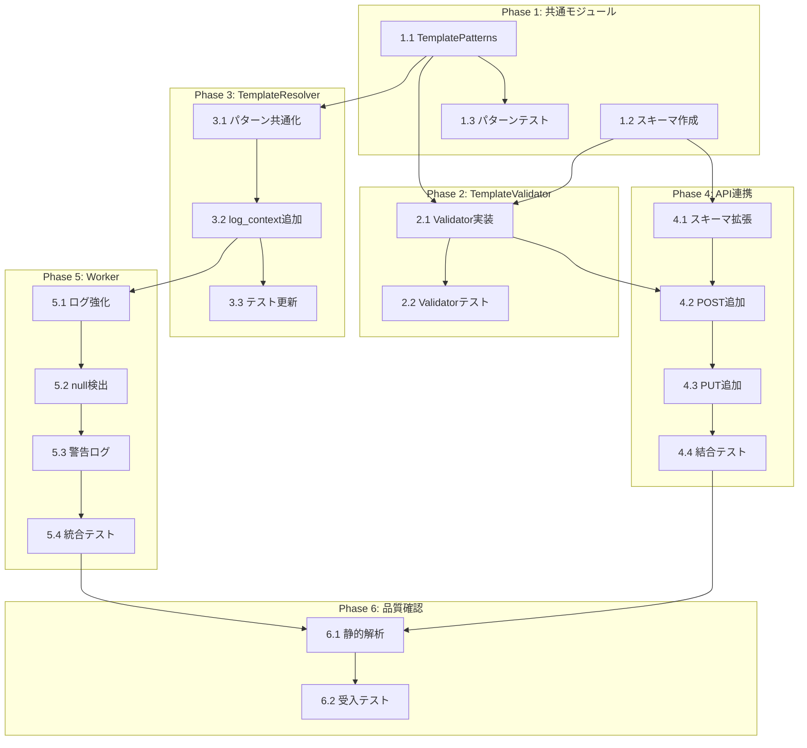

# 作業計画書: TaskMaster body_template 検証機能

**Issue**: #322
**親Issue**: #325 (Job Generator 実行信頼性向上)
**作成日**: 2025-12-29
**対象プロジェクト**: jobqueue

---

## Issue概要

| 項目 | 内容 |
|------|------|
| **タイトル** | TaskMaster: body_template のテンプレート変数参照先検証機能 |
| **Issue番号** | #322 |
| **サイズ** | M |
| **作業見積** | 7.5時間 |
| **優先度** | High |
| **依存Issue** | #321（推奨: Job body スキーマ連携のため） |

---

## タスク一覧

### Phase 1: 共通モジュール・スキーマ作成 (1.5h)

| # | タスク | ファイル | 工数(h) | 依存 |
|---|--------|---------|---------|------|
| 1.1 | `TemplatePatterns` 共通モジュール作成 | `services/template_patterns.py` | 0.5 | - |
| 1.2 | `TemplateValidationResult`, `TemplateValidationWarning` スキーマ作成 | `schemas/template_validation.py` | 0.5 | - |
| 1.3 | `TemplatePatterns` 単体テスト | `tests/unit/test_template_patterns.py` | 0.5 | 1.1 |

### Phase 2: TemplateValidator 実装 (2.0h)

| # | タスク | ファイル | 工数(h) | 依存 |
|---|--------|---------|---------|------|
| 2.1 | `TemplateValidator` クラス実装 | `services/template_validator.py` | 1.0 | 1.1, 1.2 |
| 2.2 | `TemplateValidator` 単体テスト | `tests/unit/test_template_validator.py` | 1.0 | 2.1 |

### Phase 3: TemplateResolver パターン共通化 (1.0h)

| # | タスク | ファイル | 工数(h) | 依存 |
|---|--------|---------|---------|------|
| 3.1 | `TemplateResolver` のパターン参照を共通モジュールに変更 | `services/template_resolver.py` | 0.5 | 1.1 |
| 3.2 | `log_context` パラメータ追加、詳細ログ強化 | `services/template_resolver.py` | 0.25 | 3.1 |
| 3.3 | 単体テスト更新 | `tests/unit/test_template_resolver.py` | 0.25 | 3.2 |

### Phase 4: API 連携 (1.5h)

| # | タスク | ファイル | 工数(h) | 依存 |
|---|--------|---------|---------|------|
| 4.1 | `TaskMasterResponse` にバリデーション結果フィールド追加 | `schemas/task_master.py` | 0.25 | 1.2 |
| 4.2 | `POST /task-masters` に検証呼び出し追加 | `api/v1/task_masters.py` | 0.5 | 2.1, 4.1 |
| 4.3 | `PUT /task-masters/{id}` に検証呼び出し追加 | `api/v1/task_masters.py` | 0.25 | 4.2 |
| 4.4 | API 結合テスト作成 | `tests/integration/test_task_master_validation.py` | 0.5 | 4.3 |

### Phase 5: Worker 連携 (1.0h)

| # | タスク | ファイル | 工数(h) | 依存 |
|---|--------|---------|---------|------|
| 5.1 | `_execute_tasks` のログ強化 | `core/worker.py` | 0.25 | 3.2 |
| 5.2 | `_find_null_fields` ヘルパー実装 | `core/worker.py` | 0.25 | 5.1 |
| 5.3 | null フィールド検出ログ追加 | `core/worker.py` | 0.25 | 5.2 |
| 5.4 | Worker 統合テスト更新 | `tests/integration/test_task_execution_flow.py` | 0.25 | 5.3 |

### Phase 6: 品質確認・受入テスト (0.5h)

| # | タスク | 内容 | 工数(h) | 依存 |
|---|--------|------|---------|------|
| 6.1 | 静的解析・Lint実行 | Ruff, MyPy | 0.25 | 5.4 |
| 6.2 | L3 受入テスト実行 | ローカルサービス起動、API確認 | 0.25 | 6.1 |

---

## タスク依存関係



---

## 実行順序（推奨）

```
[並列可能グループ A - Phase 1]
├── 1.1 TemplatePatterns 作成
└── 1.2 スキーマ作成

[順次実行 - Phase 1完了後]
1.1 → 1.3 (パターンテスト)
1.1 + 1.2 → 2.1 → 2.2 (TemplateValidator)

[並列可能グループ B - Phase 2完了後]
├── 3.1 → 3.2 → 3.3 (TemplateResolver)
└── 4.1 → 4.2 → 4.3 → 4.4 (API連携)

[順次実行 - Phase 3, 4完了後]
5.1 → 5.2 → 5.3 → 5.4 (Worker)

[最終]
6.1 → 6.2 (品質確認・受入テスト)
```

---

## 変更ファイル一覧

| ファイル | 変更種別 | Phase |
|---------|---------|-------|
| `jobqueue/app/services/template_patterns.py` | 新規 | 1 |
| `jobqueue/app/schemas/template_validation.py` | 新規 | 1 |
| `jobqueue/app/services/template_validator.py` | 新規 | 2 |
| `jobqueue/app/services/template_resolver.py` | 修正 | 3 |
| `jobqueue/app/schemas/task_master.py` | 修正 | 4 |
| `jobqueue/app/api/v1/task_masters.py` | 修正 | 4 |
| `jobqueue/app/core/worker.py` | 修正 | 5 |
| `jobqueue/tests/unit/test_template_patterns.py` | 新規 | 1 |
| `jobqueue/tests/unit/test_template_validator.py` | 新規 | 2 |
| `jobqueue/tests/unit/test_template_resolver.py` | 修正 | 3 |
| `jobqueue/tests/integration/test_task_master_validation.py` | 新規 | 4 |
| `jobqueue/tests/integration/test_task_execution_flow.py` | 修正 | 5 |

---

## L3 受入テスト計画

### テスト環境

```bash
# サービス起動（Platform層をDocker、Agent層をローカル）
./scripts/dev-hybrid.sh

# または全サービスDocker
make dev-all
```

### Step 1: サービス起動確認

```bash
# ヘルスチェック
curl -sf http://localhost:8001/health && echo "✅ jobqueue: healthy"
```

### Step 2: TaskMaster 作成時の検証確認

```bash
# テストケース 1: 正常なテンプレート（変数なし）
curl -s -X POST http://localhost:8001/api/v1/task-masters \
  -H "Content-Type: application/json" \
  -d '{
    "name": "test_task_no_template",
    "method": "POST",
    "url": "http://example.com/api",
    "body_template": {"action": "test"}
  }' | jq '.template_validation'

# 期待結果:
# {
#   "is_valid": true,
#   "warnings": [],
#   "extracted_variables": []
# }
```

```bash
# テストケース 2: Job body 参照テンプレート（警告あり）
curl -s -X POST http://localhost:8001/api/v1/task-masters \
  -H "Content-Type: application/json" \
  -d '{
    "name": "test_task_with_job_ref",
    "method": "POST",
    "url": "http://example.com/api",
    "body_template": {
      "user_input": {
        "email": "{{job.body.recipient_email}}",
        "query": "{{job.body.search_query}}"
      }
    }
  }' | jq '.template_validation'

# 期待結果:
# {
#   "is_valid": true,
#   "warnings": [
#     {"variable": "{{job.body.recipient_email}}", "severity": "warning", ...},
#     {"variable": "{{job.body.search_query}}", "severity": "warning", ...}
#   ],
#   "extracted_variables": ["{{job.body.recipient_email}}", "{{job.body.search_query}}"]
# }
```

```bash
# テストケース 3: タスク参照テンプレート
curl -s -X POST http://localhost:8001/api/v1/task-masters \
  -H "Content-Type: application/json" \
  -d '{
    "name": "test_task_with_task_ref",
    "method": "POST",
    "url": "http://example.com/api",
    "body_template": {
      "previous_result": "{{tasks[0].output_data.result}}"
    }
  }' | jq '.template_validation.extracted_variables'

# 期待結果:
# ["{{tasks[0].output_data.result}}"]
```

### Step 3: サイズ制限の確認

```bash
# テストケース 4: 過大なテンプレート（エラー）
# 64KB超のテンプレートを生成
LARGE_TEMPLATE=$(python3 -c "import json; print(json.dumps({'key_' + str(i): '{{job.body.field_' + str(i) + '}}' for i in range(10000)}))")

curl -s -X POST http://localhost:8001/api/v1/task-masters \
  -H "Content-Type: application/json" \
  -d "{
    \"name\": \"test_large_template\",
    \"method\": \"POST\",
    \"url\": \"http://example.com/api\",
    \"body_template\": $LARGE_TEMPLATE
  }" | jq '.template_validation'

# 期待結果:
# {
#   "is_valid": false,
#   "warnings": [{"severity": "error", "message": "Template size exceeds maximum..."}]
# }
```

### Step 4: TaskMaster 更新時の検証確認

```bash
# 既存TaskMasterを更新
TASK_MASTER_ID="<前のテストで作成されたID>"

curl -s -X PUT "http://localhost:8001/api/v1/task-masters/${TASK_MASTER_ID}" \
  -H "Content-Type: application/json" \
  -d '{
    "body_template": {
      "new_field": "{{job.body.new_param}}"
    }
  }' | jq '.template_validation'

# 期待結果:
# template_validation に新しいテンプレートの検証結果が含まれる
```

### Step 5: Worker ログ確認（テンプレート解決）

```bash
# Job を作成してタスクを実行
# （事前に JobMaster, TaskMaster を設定済みと仮定）

# ログ確認
tail -50 jobqueue/logs/jobqueue.log | grep -E "Template resolution|Null fields"

# 期待結果:
# [TASK] Template resolution context:
#   TaskMaster: tm_xxx (task_name)
#   Job: j_xxx
#   Job body fields: [...]
# [TASK] Null fields detected: [...]  # null フィールドがある場合
```

### Step 6: エビデンス収集

```bash
# レスポンスをファイルに保存
curl -s -X POST http://localhost:8001/api/v1/task-masters \
  -H "Content-Type: application/json" \
  -d '{
    "name": "evidence_test",
    "method": "POST",
    "url": "http://example.com/api",
    "body_template": {"email": "{{job.body.email}}"}
  }' > /tmp/issue322_acceptance_evidence.json

cat /tmp/issue322_acceptance_evidence.json | jq '.template_validation'
```

---

## Definition of Done (DoD)

### 必須項目

- [ ] 全タスク（1.1〜6.2）が完了している
- [ ] 単体テストカバレッジ 90%以上を維持
- [ ] Ruff / MyPy エラーがゼロ
- [ ] `./scripts/pre-push-check-all.sh` が成功
- [ ] L3 受入テスト 6ケースがすべてパス

### 確認項目

- [ ] `TemplatePatterns` で正規表現パターンが共通化されている
- [ ] `TemplateValidator` がサイズ・変数数・パス深度を制限している
- [ ] `TaskMasterResponse` に `template_validation` フィールドが含まれる
- [ ] `TemplateResolver` が `log_context` を受け取り詳細ログを出力する
- [ ] Worker が null フィールドを検出してログ出力する
- [ ] 既存の TaskMaster 作成/更新が正常動作する（後方互換性）

### ドキュメント

- [x] 設計方針書 (`design-policy.md`) 作成済・承認済
- [x] アーキテクチャレビュー (`architecture-review.md`) 承認済
- [x] 作業計画書 (`work-plan.md`) 作成済

---

## リスクと対策

| リスク | 影響度 | 発生確率 | 対策 |
|-------|--------|---------|------|
| 既存テストが破損 | 高 | 低 | Phase 3, 5 で既存テスト更新を明示 |
| パターン共通化で動作変更 | 中 | 低 | 単体テストで同一動作を確認 |
| API レスポンスサイズ増加 | 低 | 中 | `template_validation` は小さいオブジェクト |
| #321 未完了でスキーマ検証不可 | 低 | 高 | スキーマなしでも基本機能は動作する設計 |

---

## 関連ドキュメント

| ドキュメント | 用途 |
|-------------|------|
| [design-policy.md](./design-policy.md) | 設計方針・詳細設計 |
| [architecture-review.md](./architecture-review.md) | アーキテクチャレビュー結果 |
| [template_resolver.py](../../../jobqueue/app/services/template_resolver.py) | 既存テンプレート解決実装 |
| [task_masters.py](../../../jobqueue/app/api/v1/task_masters.py) | TaskMaster API |

---

## 次のステップ

1. 本作業計画書の承認
2. worktree 作成（`/worktree-setup 322`）
3. Phase 1 から順次実装開始
4. 各 Phase 完了時にテスト実行
5. 全 Phase 完了後、L3 受入テスト実施
6. PR 作成・レビュー依頼
