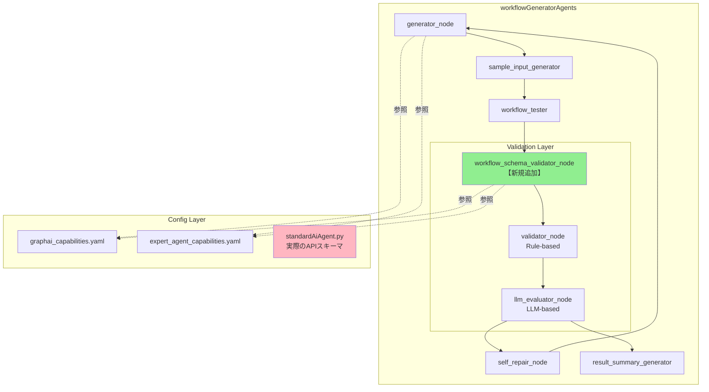

# 設計方針書: ワークフロー生成時のAPI型・フィールド名検証機能

**Issue**: #333
**作成日**: 2025-12-30
**対象プロジェクト**: expertAgent

---

## 現状調査サマリ

### 対象プロジェクト

- **プロジェクト名**: expertAgent
- **主要モジュール**: `aiagent/langgraph/workflowGeneratorAgents/`
- **関連モジュール**: `aiagent/langgraph/jobTaskGeneratorAgents/` (参考パターン)

### 問題の詳細

#### 問題1: 型ミスマッチ
```yaml
# 生成されたワークフロー
transform_results:
  body:
    user_input: :fetch_search_results  # Object型（fetchAgentの出力）
```
- **期待値**: `user_input: str` (String型)
- **実際**: Object型を渡している
- **エラー**: HTTP 422 Validation Error

#### 問題2: フィールド名不一致
| 場所 | フィールド名 |
|------|-------------|
| 生成されたワークフロー | `system_prompt` |
| capabilities.yaml | `system_prompt` |
| 実際のAPIスキーマ (standardAiAgent.py) | `system_imput` ← **タイポ** |

### 既存アーキテクチャパターン

#### workflowGeneratorAgents フロー
```
generator → sample_input_generator → workflow_tester → validator
    ↓
    (conditional: validator_router)
    ├→ llm_evaluator → (conditional)
    │   ├→ test_data_regenerator → workflow_tester (re-test)
    │   ├→ self_repair → generator (retry)
    │   └→ result_summary_generator → END
    └→ result_summary_generator → END (fast_mode)
```

#### 既存の検証ノード
| ノード | 種類 | 検証内容 |
|--------|------|----------|
| `validator_node` | ルールベース | YAML構文、HTTP status、GraphAIエラー |
| `llm_evaluator_node` | LLMベース | 意味的品質評価（6次元スコア） |
| **MISSING** | - | API型・フィールド名整合性検証 |

#### 設計パターン（既存）
1. **State Merge Pattern**: `return {**state, "field": value}`
2. **Router Pattern**: `Literal["path1", "path2"]` で条件分岐
3. **LLM Invocation Pattern**: `invoke_structured_llm()` + Pydantic ResponseModel
4. **Graceful Degradation**: max_retry時に高コストチェックをスキップ

### モジュール間依存関係

```
workflowGeneratorAgents
    ├── utils/config/graphai_capabilities.yaml      # GraphAI Agent定義
    ├── utils/config/expert_agent_capabilities.yaml # expertAgent API定義
    └── prompts/workflow_generation.py              # 生成プロンプト

expertAgent/app/schemas/standardAiAgent.py          # 実際のAPIスキーマ
```

### 参照したドキュメント
- `docs/spec/job-generation-workflow.md` - LangGraphエージェント設計
- `expertAgent/docs/API_REFERENCE.md` - API仕様
- `docs/arch/service-dependencies.md` - サービス依存関係
- `expertAgent/aiagent/langgraph/workflowGeneratorAgents/` - 既存実装

### 設計上の制約
1. 既存のワークフロー生成機能に影響を与えない（後方互換性）
2. 単体テストカバレッジ90%以上を維持
3. LLM呼び出しコストを最小化（可能な限りルールベース検証）

---

## アーキテクチャ設計

### システム構成図



### レイヤー構成

| レイヤー | 役割 | コンポーネント |
|---------|------|----------------|
| **Generation Layer** | ワークフロー生成 | generator_node, sample_input_generator |
| **Execution Layer** | ワークフロー実行テスト | workflow_tester |
| **Validation Layer** | 検証 | **workflow_schema_validator_node (新規)**, validator_node, llm_evaluator_node |
| **Recovery Layer** | エラー回復 | self_repair_node, test_data_regenerator |
| **Config Layer** | 設定・スキーマ | capabilities.yaml, APIスキーマ |

---

## 技術選定

| カテゴリ | 選定技術 | 選定理由 | 既存との整合性 |
|---------|---------|---------|---------------|
| 検証ロジック | ルールベース + LLM補助 | 低コスト・高精度 | validator_node パターン踏襲 |
| スキーマ定義 | Pydantic BaseModel | 型安全性 | 既存パターン踏襲 |
| 設定ファイル | YAML | 既存capabilities.yaml形式 | 完全互換 |
| LLM呼び出し | invoke_structured_llm() | 既存ユーティリティ活用 | 完全互換 |

---

## 設計パターン

### 採用パターン

#### 1. Multi-Stage Validation Pattern (既存踏襲)
```python
# 検証を段階的に実行（軽量→重量）
async def validate_workflow(state: WorkflowGeneratorState):
    # Stage 1: 静的スキーマ検証（軽量・高速）
    schema_issues = _validate_api_schemas(yaml_content, capabilities)

    # Stage 2: 実行時検証（中程度）
    execution_issues = await _validate_execution(test_result)

    # Stage 3: LLM評価（重量・高コスト）- 必要時のみ
    if needs_semantic_evaluation:
        llm_issues = await _evaluate_with_llm(state)
```

#### 2. Capability Registry Pattern (既存踏襲)
```python
# モジュール初期化時にキャッシュ
GRAPHAI_AGENTS = _load_graphai_agents()      # Agent定義
EXPERT_AGENT_APIS = _load_expert_agent_apis() # API定義

def get_api_by_endpoint(endpoint: str) -> ExpertAgentAPI | None:
    """エンドポイントからAPI定義を検索"""
    for api in EXPERT_AGENT_APIS:
        if api.endpoint == endpoint:
            return api
    return None
```

#### 3. Issue Aggregation Pattern (validator_nodeから踏襲)
```python
def _issue(category: str, message: str, detail: str = "") -> dict:
    """検証問題を標準形式で生成"""
    return {
        "category": category,  # "type_mismatch", "field_name", "missing_field"
        "message": message,
        "detail": detail,
        "severity": "error" | "warning"
    }
```

---

## データモデル設計

### 新規Pydanticモデル

```python
# models/schema_validation.py

from pydantic import BaseModel
from typing import Literal

class SchemaValidationIssue(BaseModel):
    """API スキーマ検証の問題"""
    node_id: str
    issue_type: Literal[
        "type_mismatch",      # 型不一致
        "field_name_error",   # フィールド名エラー
        "missing_required",   # 必須フィールド欠落
        "unknown_agent",      # 未知のAgent
        "unknown_endpoint"    # 未知のエンドポイント
    ]
    field_name: str
    expected_value: str
    actual_value: str
    severity: Literal["error", "warning"]
    suggestion: str | None = None

class SchemaValidationResult(BaseModel):
    """スキーマ検証結果"""
    is_valid: bool
    issues: list[SchemaValidationIssue]
    validated_nodes: int
    api_calls_detected: int
    warning_count: int
    error_count: int
```

### State拡張

```python
# state.py への追加

class WorkflowGeneratorState(TypedDict):
    # ... 既存フィールド ...

    # Schema Validation (新規追加)
    schema_validation_result: dict | None
    schema_validation_issues: list[dict]
    has_schema_errors: bool
```

---

## API設計

### 内部インターフェース

#### workflow_schema_validator_node

**入力 (State)**:
```python
{
    "yaml_content": str,           # 生成されたYAML
    "task_data": dict,             # TaskMasterメタデータ
    "test_execution_result": dict  # テスト実行結果（オプション）
}
```

**出力 (State更新)**:
```python
{
    "schema_validation_result": {
        "is_valid": bool,
        "issues": list[SchemaValidationIssue],
        ...
    },
    "schema_validation_issues": list[dict],
    "has_schema_errors": bool
}
```

### 検証ルール

| ルールID | 検証内容 | 重要度 |
|----------|----------|--------|
| SVR-001 | fetchAgentのbody.user_input型チェック | error |
| SVR-002 | APIフィールド名とcapabilities.yaml整合性 | error |
| SVR-003 | 必須フィールド存在確認 | error |
| SVR-004 | Agent名の存在確認 | error |
| SVR-005 | エンドポイントの存在確認 | warning |
| SVR-006 | 参照値の型互換性チェック | warning |

---

## セキュリティ設計

### 考慮事項
- 検証ロジックはサーバーサイドで実行（クライアント入力の検証）
- YAMLパース時のインジェクション対策（`yaml.safe_load`使用）
- 設定ファイルの改ざん防止（読み取り専用アクセス）

---

## パフォーマンス設計

### キャッシング戦略

```python
# モジュール初期化時に1回だけロード
@lru_cache(maxsize=1)
def _load_capabilities() -> tuple[dict, dict]:
    """capabilities.yamlをキャッシュ付きでロード"""
    graphai = yaml.safe_load(open(GRAPHAI_PATH))
    expert = yaml.safe_load(open(EXPERT_PATH))
    return graphai, expert
```

### 検証順序の最適化

```
1. YAML構文検証（0.1ms）
2. Agent名存在確認（0.5ms）
3. エンドポイント存在確認（0.5ms）
4. フィールド名整合性チェック（1ms）
5. 型互換性チェック（2ms）
---
合計: ~4ms（LLM呼び出しなし）
```

### Graceful Degradation

```python
# max_retry時は軽量検証のみ
if state.get("retry_count", 0) >= MAX_RETRY:
    logger.warning("Skipping detailed schema validation at max retry")
    return _quick_validation(state)  # エラーのみ検出
```

---

## 設計判断とトレードオフ

### 判断1: 検証ノードの配置位置

**選択肢**:
| 選択肢 | 配置 | メリット | デメリット |
|--------|------|----------|------------|
| A | generator直後 | 早期検出 | サンプル入力なし |
| B | workflow_tester後 | 実行結果も考慮可能 | 遅延検出 |
| C | validator_node統合 | 実装シンプル | 責務肥大化 |

**決定**: **選択肢B** - workflow_tester後に配置

**理由**:
1. 実行結果（HTTP status, GraphAIエラー）も検証材料として活用可能
2. 既存のvalidator_nodeとの責務分離が明確
3. self_repair_nodeへのフィードバック情報が豊富

### 判断2: LLM使用の有無

**選択肢**:
| 選択肢 | 方式 | コスト | 精度 |
|--------|------|--------|------|
| A | 完全ルールベース | 低 | 中 |
| B | LLM補助 | 高 | 高 |
| C | ハイブリッド | 中 | 高 |

**決定**: **選択肢C** - ハイブリッド

**理由**:
1. 明確なルール（型、フィールド名）はルールベースで高速検証
2. 曖昧なケース（意味的互換性）のみLLMで判断
3. コスト最適化と精度のバランス

### 判断3: APIスキーマのタイポ修正

**決定**: Phase 3で `system_imput` → `system_prompt` に修正

**理由**:
1. 根本原因の解消
2. capabilities.yamlとの整合性確保
3. 後方互換性はプロンプト側で吸収（両フィールド名を許容）

---

## 実装フェーズ

### Phase 1: プロンプト強化（低コスト・即効性）

**対象ファイル**: `prompts/workflow_generation.py`

**追加内容**:
```python
# 型検証ルールをプロンプトに追加
TYPE_VALIDATION_RULES = """
## 重要な型検証ルール

### fetchAgent出力の型
- fetchAgentの出力は常にObject型（辞書）
- :previous_nodeは前ノードの出力全体を参照

### API期待型の確認
- /aiagent/utility/jsonoutput の user_input は **String型**
- Object型を渡す場合は JSON.stringify または stringTemplateAgent で変換必要

### フィールド名検証
- capabilities.yamlの Request Schema を正確に参照
- タイポに注意: system_prompt（正）vs system_imput（誤）
"""
```

**効果**: 生成時点でエラーを防止

### Phase 2: 検証ノード追加（高信頼性）

**新規ファイル**: `nodes/workflow_schema_validator.py`

**実装概要**:
```python
async def workflow_schema_validator_node(
    state: WorkflowGeneratorState
) -> WorkflowGeneratorState:
    """API型・フィールド名の整合性を検証"""
    yaml_content = state.get("yaml_content", "")

    # 1. YAMLパース
    workflow = yaml.safe_load(yaml_content)

    # 2. fetchAgentノードを抽出
    fetch_nodes = _extract_fetch_agent_nodes(workflow)

    # 3. 各ノードのbodyを検証
    issues = []
    for node_id, node_def in fetch_nodes.items():
        issues.extend(_validate_node_body(node_id, node_def))

    # 4. 結果を返却
    is_valid = len([i for i in issues if i["severity"] == "error"]) == 0

    return {
        **state,
        "schema_validation_result": {
            "is_valid": is_valid,
            "issues": issues,
        },
        "schema_validation_issues": issues,
        "has_schema_errors": not is_valid,
    }
```

### Phase 3: APIスキーマ修正

**対象ファイル**: `app/schemas/standardAiAgent.py`

**修正内容**:
```python
class ExpertAiAgentRequest(BaseModel):
    user_input: str
    system_prompt: str | None = None  # system_imput → system_prompt に修正
    # ... 他のフィールド
```

**後方互換性対応**:
```python
# エイリアスを設定（移行期間中）
system_imput: str | None = Field(None, alias="system_prompt", deprecated=True)
```

---

## テスト戦略

### 単体テスト

```python
# tests/unit/test_workflow_schema_validator.py

class TestWorkflowSchemaValidator:
    def test_detect_type_mismatch(self):
        """Object型をString型フィールドに渡すケースを検出"""

    def test_detect_field_name_error(self):
        """存在しないフィールド名を検出"""

    def test_valid_workflow_passes(self):
        """正しいワークフローはエラーなし"""

    def test_graceful_degradation_at_max_retry(self):
        """max_retry時は軽量検証のみ"""
```

### カバレッジ目標
- 単体テスト: 90%以上
- 結合テスト: 50%以上

---

## 参照ドキュメント

| ドキュメント | 参照内容 |
|-------------|----------|
| `docs/spec/job-generation-workflow.md` | LangGraphエージェント設計パターン |
| `expertAgent/docs/API_REFERENCE.md` | API仕様・スキーマ定義 |
| `docs/arch/service-dependencies.md` | サービス間依存関係 |
| `graphAiServer/docs/GRAPHAI_WORKFLOW_GENERATION_RULES.md` | ワークフロー生成ルール |

---

## 完了条件

- [ ] Phase 1: プロンプト強化が完了
- [ ] Phase 2: workflow_schema_validator_nodeが実装・テスト完了
- [ ] Phase 3: APIスキーマのタイポが修正
- [ ] 単体テストカバレッジ90%以上
- [ ] 既存のワークフロー生成に影響なし（回帰テストパス）
- [ ] Issue #333の完了条件を満たす

---

**作成者**: Claude Code
**レビュー**: 未実施
