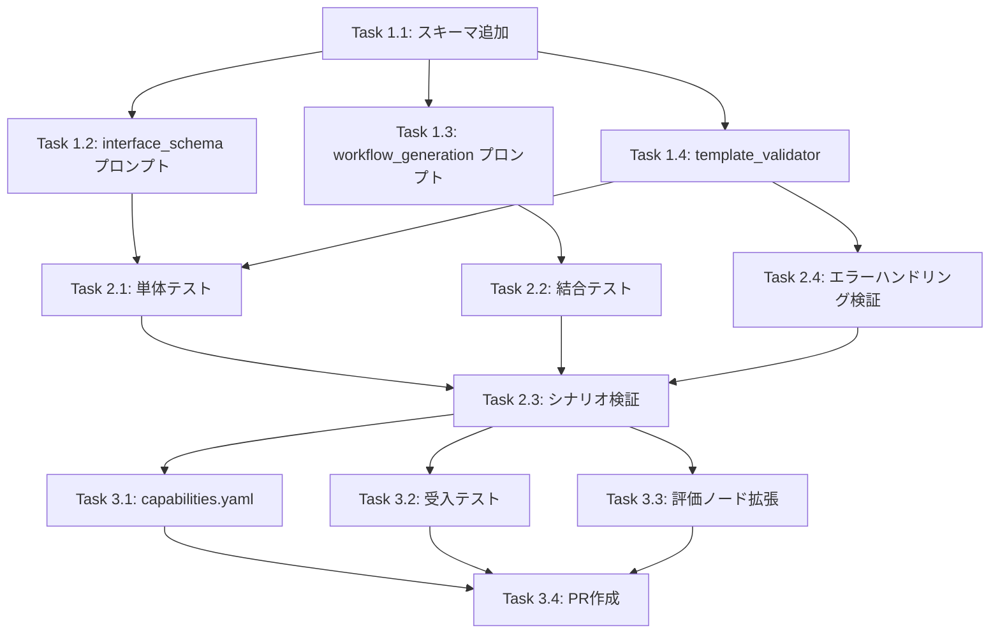

# Issue #337: タスクチェーン Ready-to-Use Output 原則の導入 - 作業計画書

## 概要

| 項目 | 内容 |
|------|------|
| Issue | #337 |
| 親Issue | #325 (Job Generator 実行信頼性向上) |
| 目的 | タスクチェーン間のデータ受け渡しで「Ready-to-Use Output」原則を導入 |
| 推定工数 | 4日 |

## 参照ドキュメント

- [設計方針書](./design-policy.md)
- [アーキテクチャレビュー](./architecture-review.md)
- [Issue #337 サマリ](./issue-337-summary.md)
- [job-generation-workflow.md](../../../docs/spec/job-generation-workflow.md)
- [GRAPHAI_WORKFLOW_GENERATION_RULES.md](../../../graphAiServer/docs/GRAPHAI_WORKFLOW_GENERATION_RULES.md)

## 作業タスク

### Phase 1: 基盤実装（1日）

#### Task 1.1: DerivedFieldDefinition スキーマ追加

**対象ファイル**: `expertAgent/aiagent/langgraph/jobTaskGeneratorAgents/prompts/interface_schema.py`

```python
class DerivedFieldDefinition(BaseModel):
    """派生フィールド定義"""
    model_config = ConfigDict(extra="forbid")

    template: str = Field(description="テンプレート文字列。{field} で元データ参照")
    type: str = Field(default="string", description="生成値の型")
    description: str | None = Field(default=None)
    source_mapping: dict[str, str] | None = Field(
        default=None,
        description="変数名 → ソースパスの明示的マッピング（オプション）"
    )
```

**受入条件**:
- [ ] DerivedFieldDefinition がバリデーション可能
- [ ] `source_mapping` フィールドが正しく動作
- [ ] InterfaceSchemaDefinition に derived_fields フィールド追加
- [ ] 単体テスト: `tests/unit/test_interface_schema.py`

#### Task 1.2: interface_schema プロンプト拡張

**対象ファイル**: `expertAgent/aiagent/langgraph/jobTaskGeneratorAgents/prompts/interface_schema.yaml`

**追加内容**:
- derived_fields の目的と使用ケース説明
- x-derived-fields の定義方法
- テンプレート記法の説明
- **テンプレート変数のソース解決ルール**:
  1. `{var}` が同一タスクの properties に存在 → 同一タスクの出力から取得
  2. `{var}` が properties に存在しない → source.user_input から取得
  3. 明示的指定 → source_mapping を使用

**受入条件**:
- [ ] プロンプトに derived_fields セクション追加
- [ ] 具体例（メール送信ケース）を含む
- [ ] **テンプレート変数のソース解決ルールを明記**

#### Task 1.3: ワークフロー生成プロンプト拡張

**対象ファイル**: `expertAgent/aiagent/langgraph/jobTaskGeneratorAgents/prompts/workflow_generation.yaml`

**追加内容**:
- x-derived-fields がある場合の stringTemplateAgent ノード生成ルール
- 出力ノードへの derived_fields 含め方
- **変数ソース解決の優先順位ルール**
- **GraphAI 参照形式の統一**: `:node_name.field` 形式を推奨

**受入条件**:
- [ ] derived_fields 処理ルールがプロンプトに記載
- [ ] stringTemplateAgent ノード生成の具体例を含む
- [ ] **変数ソース解決ルールを明記**
- [ ] **参照形式 `:node.field` の統一ルールを明記**

#### Task 1.4: テンプレート検証ユーティリティ作成（新規）

**対象ファイル**: `expertAgent/aiagent/langgraph/jobTaskGeneratorAgents/utils/template_validator.py`

**実装内容**:
```python
def validate_template(
    template: str,
    properties: dict[str, Any],
    source_mapping: dict[str, str] | None = None
) -> list[str]:
    """テンプレートを検証し、解決不能な変数を返す"""

def validate_derived_fields(output_schema: dict[str, Any]) -> list[dict[str, Any]]:
    """x-derived-fields 全体を検証"""
```

**受入条件**:
- [ ] `validate_template` が変数抽出・検証可能
- [ ] `validate_derived_fields` が全フィールドを検証
- [ ] source_mapping 指定時の検証が正しく動作
- [ ] 単体テスト: `tests/unit/test_template_validator.py`

### Phase 2: 検証・テスト（2日）

#### Task 2.1: 単体テスト作成

**対象ファイル**: `expertAgent/tests/unit/test_derived_fields.py`

**テストケース**:
1. DerivedFieldDefinition の正常系・異常系
2. **source_mapping の検証**
3. extract_derived_fields ユーティリティ
4. validate_template 参照チェック
5. **変数ソース解決ロジックの検証**:
   - properties に存在する変数 → 同一タスク出力から取得
   - properties に存在しない変数 → source.user_input から取得
   - source_mapping 指定時 → 指定パスから取得

**受入条件**:
- [ ] カバレッジ 90% 以上
- [ ] すべてのテストがパス
- [ ] **ソース解決の優先順位テストを含む**

#### Task 2.2: 結合テスト作成

**対象ファイル**: `expertAgent/tests/integration/test_derived_fields_workflow.py`

**テストケース**:
1. interface_definition_node が derived_fields を含む output_schema 生成
2. workflow_generation_node が stringTemplateAgent ノードを追加
3. **生成されたノードの inputs が正しいソースを参照**
4. **source_mapping 指定時の動作確認**

**受入条件**:
- [ ] E2E フローで derived_fields が正しく伝搬
- [ ] **変数ソースが正しく解決されている**
- [ ] すべてのテストがパス

#### Task 2.3: メール送信シナリオ検証

**実行環境**: ローカル開発環境

**手順**:
1. Job 生成: 「Googleで検索して結果をメールで送信」
2. 生成された TaskMaster の output_schema 確認
3. ワークフロー YAML の stringTemplateAgent ノード確認
4. **inputs の変数ソースが正しいことを確認**:
   - `{query}` → `:source.user_input.query`
   - `{summary_text}` → `:summarize.summary_text`
5. ワークフロー実行

**受入条件**:
- [ ] 要約タスクの output_schema に x-derived-fields 存在
- [ ] **変数ソースが正しく解決されている**
- [ ] メール送信が成功
- [ ] 件名・本文が正しくフォーマットされている

#### Task 2.4: エラーハンドリング検証（新規）

**実行環境**: ローカル開発環境

**テストケース**:
1. 解決不能な変数を含むテンプレート → エラー検出
2. 無効なテンプレート構文 → バリデーションエラー
3. 不正な source_mapping パス → エラーログ出力

**受入条件**:
- [ ] 各エラーケースが適切に検出される
- [ ] エラーメッセージが明確

### Phase 3: ドキュメント・完了（1日）

#### Task 3.1: capabilities.yaml 更新

**対象ファイル**: `expertAgent/aiagent/langgraph/jobTaskGeneratorAgents/utils/config/expert_agent_capabilities.yaml`

**追加内容**:
- derived_fields の説明
- **テンプレート変数のソース解決ルール**
- 使用例

**受入条件**:
- [ ] capabilities.yaml に derived_fields 記載
- [ ] **ソース解決ルールを記載**

#### Task 3.2: 受入テスト作成

**対象ファイル**: `expertAgent/tests/acceptance/test_issue_337_acceptance.py`

**テストケース**:
1. derived_fields 定義可能
2. ワークフロー生成で derived_fields が展開される
3. 下流タスクが文字列加工なしでデータ使用
4. **テンプレート変数が正しいソースから解決される**
5. **source_mapping による明示的指定が動作する**

**受入条件**:
- [ ] Issue #337 の受入条件すべてカバー
- [ ] **変数ソース解決の検証を含む**
- [ ] ローカル実行で全パス

#### Task 3.3: 評価ノード拡張（新規）

**対象ファイル**: `expertAgent/aiagent/langgraph/jobTaskGeneratorAgents/nodes/evaluator.py`

**追加内容**:
- 下流タスクがメール送信等の場合、上流タスクに適切な derived_fields が定義されているかチェック

```python
def check_derived_fields_in_evaluator(state: dict) -> dict:
    """評価ノードで derived_fields の妥当性をチェック"""
```

**受入条件**:
- [ ] メール送信タスクの前タスクに email_subject/email_body チェック
- [ ] 不足時は is_valid=False と feedback を返す

#### Task 3.4: PR作成・マージ

**受入条件**:
- [ ] CI 全パス
- [ ] レビュー承認

## 依存関係



## リスクと軽減策

| リスク | 軽減策 |
|--------|--------|
| LLMが derived_fields を無視 | プロンプトに明示的な指示、評価ノードでチェック |
| テンプレート構文エラー | バリデーション関数で事前チェック |
| 既存ワークフローへの影響 | x-derived-fields はオプショナル、後方互換性維持 |
| **変数ソースの曖昧さ** | **優先順位ルールの明確化、source_mapping で明示的指定を推奨** |
| **無効な source_mapping パス** | **バリデーションでパス存在チェック、エラーログ出力** |

## 完了基準

- [ ] Phase 1 完了: 基盤実装（スキーマ、プロンプト、バリデータ）
- [ ] Phase 2 完了: 検証・テスト（単体、結合、シナリオ、エラーハンドリング）
- [ ] Phase 3 完了: ドキュメント・評価ノード・PR
- [ ] Issue #337 クローズ

## 修正ファイル一覧

| Phase | ファイル | 変更内容 |
|-------|----------|----------|
| 1 | `prompts/interface_schema.py` | DerivedFieldDefinition + source_mapping 追加 |
| 1 | `prompts/interface_schema.yaml` | プロンプト拡張（ソース解決ルール含む） |
| 1 | `prompts/workflow_generation.yaml` | 自動展開ルール + 参照形式統一 |
| 1 | `utils/template_validator.py` | **新規作成** |
| 2 | `tests/unit/test_derived_fields.py` | 単体テスト |
| 2 | `tests/unit/test_template_validator.py` | バリデータ単体テスト |
| 2 | `tests/integration/test_derived_fields_workflow.py` | 結合テスト |
| 3 | `utils/config/expert_agent_capabilities.yaml` | 説明追加 |
| 3 | `tests/acceptance/test_issue_337_acceptance.py` | 受入テスト |
| 3 | `nodes/evaluator.py` | derived_fields チェック追加 |

---

**作成日**: 2026-01-01
**更新日**: 2026-01-01
**担当**: -
