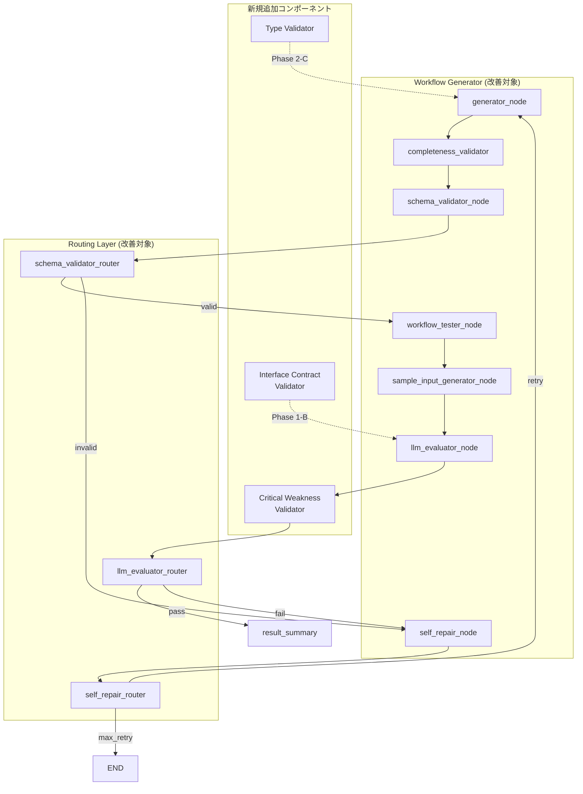
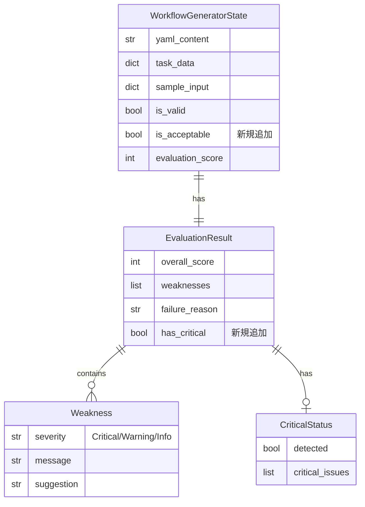

# 設計方針書: Issue #338 タスクチェーン インターフェース契約強制メカニズム

**作成日**: 2026-01-06
**Issue**: [#338 Task Chain Interface Contract Enforcement](https://github.com/Kewton/MySwiftAgent/issues/338)
**関連Issue**: #337, #340

---

## 現状調査サマリ

### 対象プロジェクト

- **プロジェクト名**: expertAgent
- **主要モジュール**:
  - `aiagent/langgraph/workflowGeneratorAgents/` - GraphAIワークフロー生成
  - `aiagent/langgraph/jobTaskGeneratorAgents/` - Job/Task生成
- **関連サービス**: graphAiServer, jobqueue

### 既存アーキテクチャパターン

| パターン | 使用箇所 | 目的 |
|---------|---------|------|
| **LangGraph StateGraph** | `agent.py` | 状態遷移ベースのワークフロー実行 |
| **Router Pattern** | `*_router()` 関数群 | 条件分岐による動的ルーティング |
| **Pydantic BaseModel** | `models/`, `state.py` | スキーマ定義・バリデーション |
| **Node Pattern** | `nodes/*.py` | 単一責任の処理ユニット |
| **Prompt Engineering** | `prompts/*.py` | LLM向けプロンプト生成 |

### 類似機能の設計

| 機能 | 設計概要 |
|------|---------|
| `evaluator_node` (jobTaskGenerator) | LLMによる実現可能性評価、`check_interface_compatibility()` 関数 |
| `llm_evaluator_node` (workflowGenerator) | LLMによるワークフロー品質評価、スコアベース合否判定 |
| `schema_enrichment_node` | OpenAPI仕様との照合・補完 |
| `validation_node` | ルールベース検証 |

### モジュール間依存関係

```
expertAgent
├── aiagent/langgraph/
│   ├── jobTaskGeneratorAgents/     # Job/Task生成
│   │   ├── agent.py               # LangGraph定義
│   │   ├── nodes/                 # 処理ノード
│   │   │   ├── evaluator.py      # 実現可能性評価
│   │   │   └── ...
│   │   └── prompts/              # LLMプロンプト
│   │
│   └── workflowGeneratorAgents/   # ワークフロー生成
│       ├── agent.py              # LangGraph定義
│       ├── nodes/
│       │   ├── generator.py      # YAML生成
│       │   ├── llm_evaluator.py  # 品質評価
│       │   └── ...
│       └── prompts/
│
└── app/api/v1/                   # REST API
    └── job_generator_endpoints.py
```

### 既存API設計パターン

- **エンドポイント命名規則**: `/v1/{resource}` (RESTful)
- **レスポンス形式**: JSON (`{"status": ..., "result": ...}`)
- **エラーハンドリング**: HTTPステータス + `error_message` フィールド

### 参照したドキュメント

| ドキュメント | 関連内容 |
|------------|---------|
| `docs/spec/job-generation-workflow.md` | LangGraph 7段階ワークフロー設計 |
| `docs/arch/service-dependencies.md` | サービス間通信フロー |
| `docs/design/architecture-overview.md` | 4層アーキテクチャ |
| `root-cause-analysis.md` | 6つの真因と改善提案 |

### 設計上の制約

1. **後方互換性**: 既存APIインターフェースを維持
2. **LangGraph互換**: StateGraph/Router パターンに準拠
3. **非破壊的変更**: 既存ワークフローの動作を保証
4. **テストカバレッジ**: 単体90%/結合50%維持

---

## アーキテクチャ設計

### システム構成図



### レイヤー構成

| レイヤー | 責務 | 改善対象 |
|---------|------|---------|
| **Routing Layer** | 条件分岐ロジック | `llm_evaluator_router` の改善 |
| **Validation Layer** | 検証ロジック | Critical Weakness検出、型検証 |
| **Generation Layer** | LLM呼び出し・YAML生成 | プロンプト改善 |
| **State Layer** | 状態管理 | `is_acceptable` フラグ伝播 |

---

## 技術選定

| カテゴリ | 選定技術 | 選定理由 | 既存との整合性 |
|---------|---------|---------|---------------|
| **状態管理** | LangGraph TypedDict | 型安全な状態定義 | 既存パターン踏襲 |
| **バリデーション** | Pydantic v2 | スキーマ検証 | 既存パターン踏襲 |
| **ルーティング** | 関数ベースRouter | 条件分岐の明示化 | 既存パターン踏襲 |
| **テスト** | pytest + pytest-asyncio | 非同期テスト対応 | 既存パターン踏襲 |
| **型チェック** | `isinstance()` + Union types | ランタイム型検証 | Python標準 |

---

## 設計パターン

### 採用パターン

#### 1. Strategy Pattern (評価戦略)

**目的**: Critical Weakness検出ロジックの差し替え可能化

```python
# 既存パターン: 単純なスコア閾値
if evaluation_score < 70:
    return "self_repair"

# 新規: Strategy Patternによる複合評価
class EvaluationStrategy(Protocol):
    def should_reject(self, result: LLMEvaluationResult) -> bool: ...

class CriticalWeaknessStrategy:
    def should_reject(self, result: LLMEvaluationResult) -> bool:
        return any("Critical" in w for w in result.weaknesses)

class CompositeStrategy:
    def __init__(self, strategies: list[EvaluationStrategy]):
        self.strategies = strategies

    def should_reject(self, result: LLMEvaluationResult) -> bool:
        return any(s.should_reject(result) for s in self.strategies)
```

**既存パターンとの整合性**: `evaluator_node` の `check_interface_compatibility()` と同様の関数分離パターン

#### 2. Chain of Responsibility (検証チェーン)

**目的**: 複数の検証ロジックを順次適用

```python
# 既存: 単一ルーターで複数条件チェック
def llm_evaluator_router(state):
    if needs_test_data_regeneration:
        return "test_data_regenerator"
    if not is_rule_valid:
        return "self_repair"
    if failure_reason in ("workflow_quality", "both"):
        return "self_repair"
    if evaluation_score < 70:
        return "self_repair"
    return "result_summary_generator"

# 新規: 検証チェーンの明示化
validators = [
    TestDataRegenerationValidator(),
    RuleBasedValidator(),
    CriticalWeaknessValidator(),  # 新規追加
    AcceptabilityValidator(),      # 新規追加
    ScoreThresholdValidator(),
]
```

#### 3. Type Guard Pattern (型検証)

**目的**: `recommended_apis` の型安全性確保

```python
# 真因2-C対応: 型ガード関数
def normalize_api_item(api: str | dict) -> dict[str, str]:
    """Normalize API item to dict format."""
    if isinstance(api, str):
        return {"api_name": api, "endpoint": api}
    if isinstance(api, dict):
        return {
            "api_name": api.get("api_name") or api.get("name") or "",
            "endpoint": api.get("endpoint") or "",
        }
    raise TypeError(f"Expected str or dict, got {type(api)}")
```

---

## データモデル設計

### ER図 (State拡張)



### State拡張

```python
class WorkflowGeneratorState(TypedDict):
    # 既存フィールド
    yaml_content: str
    task_data: dict
    sample_input: dict | str | None
    is_valid: bool
    evaluation_score: int
    llm_evaluation_result: dict

    # 新規追加フィールド (Phase 4)
    is_acceptable: bool  # 真因2-B対応
    has_critical_weakness: bool  # 真因2-A対応
    critical_issues: list[str]  # 真因2-A対応
```

---

## API設計

### 既存APIへの影響

**変更なし** - 内部実装のみの改善

### 内部インターフェース変更

#### llm_evaluator_router (改善)

```python
def llm_evaluator_router(
    state: WorkflowGeneratorState,
) -> Literal["test_data_regenerator", "self_repair", "result_summary_generator"]:
    """
    改善点:
    1. is_acceptable フラグを判定に使用 (真因2-B)
    2. Critical weakness検出で自動失敗 (真因2-A)
    """
    # 既存ロジック
    needs_test_data_regeneration = state.get("needs_test_data_regeneration", False)
    if needs_test_data_regeneration:
        return "test_data_regenerator"

    is_rule_valid = state.get("is_valid", False)
    if not is_rule_valid:
        return "self_repair"

    # 新規: is_acceptable フラグを使用 (真因2-B)
    is_acceptable = state.get("is_acceptable", True)
    if not is_acceptable:
        logger.info("Workflow not acceptable (is_acceptable=False), routing to self_repair")
        return "self_repair"

    # 新規: Critical weakness検出 (真因2-A)
    has_critical = state.get("has_critical_weakness", False)
    if has_critical:
        logger.info("Critical weakness detected, routing to self_repair")
        return "self_repair"

    # 既存ロジック継続
    evaluation_result = state.get("llm_evaluation_result") or {}
    failure_reason = evaluation_result.get("failure_reason", "none")
    if failure_reason in ("workflow_quality", "both"):
        return "self_repair"

    evaluation_score = state.get("evaluation_score") or 0
    if evaluation_score < 70:
        return "self_repair"

    return "result_summary_generator"
```

---

## セキュリティ設計

**変更なし** - 既存のセキュリティ実装を継続

---

## パフォーマンス設計

### 検証処理の最適化

| 項目 | 現状 | 改善後 |
|------|------|--------|
| Critical検出 | LLM判断のみ | プログラム的検出追加 |
| 型検証 | 実行時エラー | 事前検証 |
| 早期終了 | スコア閾値のみ | 複合条件で早期終了 |

### 期待される効果

- **不要なリトライ削減**: Critical検出で早期終了
- **ランタイムエラー削減**: 型検証で事前検出
- **評価精度向上**: 複合評価による誤判定削減

---

## 設計判断とトレードオフ

### 判断1: Critical Weakness の検出方法

| 選択肢 | メリット | デメリット | 採用 |
|--------|---------|-----------|------|
| **A. LLMに`failure_reason`設定を強制** | 変更少 | LLM依存度高 | - |
| **B. プログラム的に`weaknesses`を解析** | 確実 | 文字列マッチング | 採用 |
| **C. 新規フィールド`has_critical`追加** | 明示的 | 既存LLMプロンプト変更必要 | - |

**採用理由**: 選択肢Bは既存のLLMレスポンスを変更せず、確実に検出可能

```python
def _has_critical_weakness(weaknesses: list[str]) -> bool:
    """Check if any weakness contains 'Critical' keyword."""
    critical_patterns = ["Critical", "CRITICAL", "critical", "致命的"]
    return any(
        any(pattern in w for pattern in critical_patterns)
        for w in weaknesses
    )
```

### 判断2: is_acceptable フラグの伝播

| 選択肢 | メリット | デメリット | 採用 |
|--------|---------|-----------|------|
| **A. State に新規フィールド追加** | 明示的 | State変更 | 採用 |
| **B. llm_evaluation_result 内で計算** | 変更少 | 責務混在 | - |

**採用理由**: 選択肢Aは責務が明確で、テストが容易

### 判断3: 型バリデーションの実装箇所

| 選択肢 | メリット | デメリット | 採用 |
|--------|---------|-----------|------|
| **A. 各利用箇所でガード** | 局所的 | 重複コード | - |
| **B. ユーティリティ関数で一元化** | DRY | 呼び出し漏れリスク | 採用 |
| **C. Pydantic Validatorで強制** | 自動 | State変更大 | - |

**採用理由**: 選択肢Bは既存コードへの影響最小でDRY原則に準拠

---

## 実装フェーズ

### Phase 4: 評価ルーティングの改善 (高優先度)

| タスク | 対象ファイル | 内容 |
|--------|------------|------|
| 4-1 | `llm_evaluator.py` | `_has_critical_weakness()` 関数追加 |
| 4-2 | `llm_evaluator.py` | `has_critical_weakness` をStateに設定 |
| 4-3 | `agent.py` | `llm_evaluator_router` でis_acceptable使用 |
| 4-4 | `state.py` | `is_acceptable`, `has_critical_weakness` フィールド追加 |
| 4-5 | `tests/unit/` | 単体テスト追加 |

### Phase 5: 型バリデーション強化 (高優先度)

| タスク | 対象ファイル | 内容 |
|--------|------------|------|
| 5-1 | `utils/type_guards.py` | `normalize_api_item()` 関数作成 |
| 5-2 | `nodes/*.py` | 各ノードで型ガード適用 |
| 5-3 | `tests/unit/` | 単体テスト追加 |

### Phase 6: 動的配列処理パターン (中優先度)

| タスク | 対象ファイル | 内容 |
|--------|------------|------|
| 6-1 | `prompts/workflow_generation.py` | 配列処理パターンをプロンプトに追加 |
| 6-2 | `tests/unit/` | プロンプトテスト追加 |

### Phase 7: タスクチェーンインターフェース検証 (中優先度)

| タスク | 対象ファイル | 内容 |
|--------|------------|------|
| 7-1 | `nodes/interface_validator.py` | 新規バリデーターノード作成 |
| 7-2 | `agent.py` | グラフにノード追加 |
| 7-3 | `tests/unit/` | 単体テスト追加 |

---

## テスト計画

### 単体テスト

```python
# tests/unit/test_critical_weakness_detection.py
class TestCriticalWeaknessDetection:
    def test_detect_critical_keyword(self):
        weaknesses = ["Critical: Missing output node"]
        assert _has_critical_weakness(weaknesses) is True

    def test_no_critical(self):
        weaknesses = ["Warning: Consider adding error handling"]
        assert _has_critical_weakness(weaknesses) is False

    def test_japanese_critical(self):
        weaknesses = ["致命的: 出力ノードがありません"]
        assert _has_critical_weakness(weaknesses) is True
```

### 結合テスト

```python
# tests/integration/test_issue_338_routing.py
class TestIssue338Routing:
    async def test_critical_weakness_triggers_self_repair(self):
        """Critical weaknessが検出された場合、self_repairにルーティングされる"""
        state = {
            "evaluation_score": 72,  # 閾値以上
            "llm_evaluation_result": {
                "weaknesses": ["Critical: Output node missing search_results"],
                "failure_reason": "none",  # LLMはnoneを返す
            },
            "is_valid": True,
        }
        result = llm_evaluator_router(state)
        assert result == "self_repair"

    async def test_is_acceptable_false_triggers_self_repair(self):
        """is_acceptable=Falseの場合、self_repairにルーティングされる"""
        state = {
            "evaluation_score": 72,
            "is_acceptable": False,  # 新規フラグ
            "is_valid": True,
        }
        result = llm_evaluator_router(state)
        assert result == "self_repair"
```

---

## 参照ドキュメント

- [Issue #338](https://github.com/Kewton/MySwiftAgent/issues/338)
- [root-cause-analysis.md](./root-cause-analysis.md)
- [job-generation-workflow.md](../../../docs/spec/job-generation-workflow.md)
- [service-dependencies.md](../../../docs/arch/service-dependencies.md)
- [GRAPHAI_WORKFLOW_GENERATION_RULES.md](../../../graphAiServer/docs/GRAPHAI_WORKFLOW_GENERATION_RULES.md)

---

## 実装状況

| フェーズ | 状態 | 完了日 |
|---------|------|--------|
| Phase 4: 評価ルーティング改善 | ✅ 完了 | 2026-01-06 |
| Phase 5: 型バリデーション強化 | ✅ 完了 | 2026-01-06 |
| Phase 6: 動的配列処理パターン | ✅ 完了 | 2026-01-06 |
| Phase 7: タスクチェーンIF検証 | ✅ 完了 | 2026-01-06 |

### Phase 4 実装詳細

**変更ファイル:**
- `state.py`: `is_acceptable`, `has_critical_weakness`, `critical_issues` フィールド追加
- `llm_evaluator.py`: `_has_critical_weakness()` 関数追加、`llm_evaluator_node` で新フィールド設定
- `agent.py`: `llm_evaluator_router` に `is_acceptable` と `has_critical_weakness` チェック追加

**追加テスト:**
- `test_llm_evaluator_node.py`: `TestHasCriticalWeakness` (8テスト), `TestLLMEvaluatorNodeCriticalWeakness` (3テスト)
- `test_llm_evaluator_routers.py`: `TestIssue338CriticalWeaknessRouting` (5テスト)
- `test_issue_338_critical_weakness_routing.py`: 結合テスト (7テスト)

### Phase 5 実装詳細

**対応した真因:** 真因2-C (型バリデーション不足)

**新規ファイル:**
- `utils/type_guards.py`: 型ガード関数モジュール
  - `normalize_api_item()`: str/dict を統一形式に変換
  - `normalize_recommended_apis()`: APIリストを正規化
  - `get_api_name()`, `get_api_endpoint()`: 安全なアクセサ
  - `format_apis_comma_separated()`: プロンプト用フォーマット
  - `format_apis_for_prompt()`: 詳細フォーマット

**変更ファイル:**
- `utils/__init__.py`: 型ガード関数をエクスポート
- `prompts/llm_evaluation.py`: `_format_recommended_apis()` を `format_apis_comma_separated()` に置換
- `prompts/test_data_regeneration.py`: 同上

**追加テスト:**
- `test_type_guards.py`: 39テスト（単体テスト）
- `test_type_guard_integration.py`: 9テスト（結合テスト）
- 既存テスト更新: `test_llm_evaluation_prompt.py`, `test_test_data_regeneration_prompt.py`

### Phase 6 実装詳細

**対応した真因:** 真因1-A (LLMが固定長の配列処理を生成)

**新規定数:**
- `DYNAMIC_ARRAY_PROCESSING_PATTERNS`: 動的配列処理パターンのガイドライン
  - `mapAgent` を使用した均一処理パターン
  - `reduceAgent` を使用した集約パターン
  - ハードコードされた固定長パターンの禁止

**変更ファイル:**
- `prompts/workflow_generation.py`: `DYNAMIC_ARRAY_PROCESSING_PATTERNS` 定数追加、プロンプトに統合

**追加テスト:**
- `test_workflow_generation_prompts.py`:
  - `TestDynamicArrayProcessingPatterns` (7テスト): 定数内容テスト
  - `TestDynamicArrayPatternsIntegration` (3テスト): プロンプト統合テスト

### Phase 7 実装詳細

**対応した真因:** 真因1-B (タスクチェーンのインターフェース不整合)

**新規ファイル:**
- `utils/interface_validator.py`: インターフェース検証モジュール
  - `InterfaceIssue`: 検証問題を表すモデル
  - `InterfaceValidationResult`: 検証結果モデル
  - `validate_interface_compatibility()`: 2タスク間の互換性検証
  - `validate_task_chain_interfaces()`: タスクチェーン全体の検証
  - `format_interface_issues()`: 問題のフォーマット出力

**変更ファイル:**
- `utils/__init__.py`: インターフェース検証関数をエクスポート

**追加テスト:**
- `test_interface_validator.py`: 24テスト（単体テスト）
  - 互換性検証: 必須フィールド欠落、型不一致、互換型
  - タスクチェーン検証: 空チェーン、単一タスク、複数タスク
  - フォーマット: エラー/警告の表示

---

## Phase 8: derived_fields バリデーション強化

### 背景

2026-01-06 の Langfuse トレース分析により、`interface_definition` ノードで `derived_fields` の Pydantic バリデーションエラーが発生し、ワークフローが18回リトライして最終的に失敗する事象を確認。

**エラー詳細:**
```
PydanticToolsParser ERROR:
3 validation errors for InterfaceSchemaResponse
interfaces.0.derived_fields Input should be a valid dictionary
  [type=dict_type, input_value='results -> task_002.input.search_results', input_type=str]
```

### 真因分析

#### 作り込んだ真因

| ID | 真因 | 影響 |
|----|------|------|
| 1-A | `INTERFACE_SCHEMA_SYSTEM_PROMPT` に `derived_fields` の説明・例がない | LLMが正しい形式を理解できず推測で出力 |
| 1-B | `InterfaceSchemaDefinition.derived_fields` に field_validator がない | 文字列入力が即エラーになる |
| 1-C | Issue #337 でスキーマは追加したがプロンプト更新が漏れた | 機能追加とLLMガイダンスが分離 |

#### チェック機構で是正できなかった真因

| ID | 真因 | 影響 |
|----|------|------|
| 2-A | Pydantic解析が evaluator より先に失敗 | evaluator の検証ロジックに到達しない |
| 2-B | リトライ時にエラーフィードバックがない | LLMが同じ間違いを繰り返す |
| 2-C | `check_derived_fields_for_downstream_tasks` が未使用 | 定義済み関数がワークフローに統合されていない |

### 設計方針

#### Phase 8-1: プロンプト改善（優先度: 高）

**対象ファイル:** `expertAgent/aiagent/langgraph/jobTaskGeneratorAgents/prompts/interface_schema.py`

**変更内容:**
`INTERFACE_SCHEMA_SYSTEM_PROMPT` に以下のガイダンスを追加：

```markdown
## derived_fields（派生フィールド）の定義

downstream タスクが直接使用できる事前フォーマット済みデータを定義します。
このフィールドは **オプション** です。必要な場合のみ定義してください。

### 形式（重要: 文字列ではなくオブジェクト形式で指定）

✅ **正しい形式**:
```json
{
  "derived_fields": {
    "email_subject": {
      "template": "検索結果: {query}",
      "type": "string",
      "description": "メール件名"
    },
    "summary_text": {
      "template": "{count}件のメールが見つかりました",
      "type": "string"
    }
  }
}
```

❌ **禁止形式（バリデーションエラーになります）**:
```json
{
  "derived_fields": "email_subject -> task_002.input.subject"
}
```

### derived_fields が不要な場合

derived_fields を使用しない場合は、空オブジェクトを指定するか、フィールド自体を省略してください：
```json
{
  "derived_fields": {}
}
```
```

**期待効果:** LLMが正しい形式を理解し、文字列形式での出力を防止

#### Phase 8-2: field_validator 追加（優先度: 高）

**対象ファイル:** `expertAgent/aiagent/langgraph/jobTaskGeneratorAgents/prompts/interface_schema.py`

**変更内容:**
`InterfaceSchemaDefinition` クラスに `derived_fields` 用の field_validator を追加：

```python
@field_validator("derived_fields", mode="before")
@classmethod
def parse_derived_fields(cls, value: Any) -> dict[str, Any]:
    """Parse derived_fields with graceful degradation.

    If the LLM outputs a string instead of dict (common error),
    return empty dict to allow the workflow to continue.
    """
    if value is None:
        return {}
    if isinstance(value, str):
        logger.warning(
            "derived_fields received as string (%s...), using empty dict. "
            "LLM should output dict format: {'field_name': {'template': '...', 'type': '...'}}",
            value[:50] if len(value) > 50 else value,
        )
        return {}
    if isinstance(value, dict):
        return value
    logger.warning(
        "derived_fields has unexpected type %s, using empty dict",
        type(value).__name__,
    )
    return {}
```

**期待効果:** 不正な入力を graceful degradation で処理し、ワークフローが継続可能に

#### Phase 8-3: リトライ時エラーフィードバック（優先度: 中）

**対象ファイル:** `expertAgent/aiagent/langgraph/jobTaskGeneratorAgents/nodes/interface_definition.py`

**変更内容:**
リトライ時にエラー内容をプロンプトに追加：

```python
for attempt in range(max_internal_retries):
    try:
        call_result = await invoke_structured_llm(
            messages=messages,
            response_model=InterfaceSchemaResponse,
            ...
        )
        break
    except StructuredLLMError as exc:
        last_error = exc
        logger.warning(
            "Interface schema generation attempt %d/%d failed: %s",
            attempt + 1,
            max_internal_retries,
            exc,
        )
        if attempt < max_internal_retries - 1:
            # 新規: エラーフィードバックをプロンプトに追加
            error_feedback = (
                f"\n\n## 前回の出力でエラーが発生しました\n"
                f"エラー内容: {exc}\n\n"
                f"**重要**: derived_fields は文字列ではなく、"
                f"オブジェクト形式で指定してください。\n"
                f"正しい形式: {{'field_name': {{'template': '...', 'type': 'string'}}}}"
            )
            messages = [
                messages[0],  # system prompt
                {"role": "user", "content": messages[1]["content"] + error_feedback},
            ]
            logger.info("Retrying with error feedback...")
            continue
```

**期待効果:** LLMが前回のエラーを理解し、自己修正できる

### 実装タスク

| タスク | 対象ファイル | 内容 | 優先度 |
|--------|------------|------|--------|
| 8-1 | `prompts/interface_schema.py` | `derived_fields` ガイダンスをプロンプトに追加 | 🔴 高 |
| 8-2 | `prompts/interface_schema.py` | `parse_derived_fields` field_validator 追加 | 🔴 高 |
| 8-3 | `nodes/interface_definition.py` | リトライ時エラーフィードバック追加 | 🟡 中 |
| 8-4 | `tests/unit/test_interface_schema.py` | derived_fields バリデーションテスト追加 | 🔴 高 |
| 8-5 | `tests/integration/` | E2E統合テスト追加 | 🟡 中 |

### テスト計画

#### 単体テスト

```python
# tests/unit/test_interface_schema.py

class TestDerivedFieldsValidator:
    """Issue #338 Phase 8: derived_fields validation tests."""

    def test_derived_fields_dict_passthrough(self):
        """Valid dict format should pass through unchanged."""
        data = {
            "task_id": "task_001",
            "interface_name": "test_interface",
            "description": "Test",
            "input_schema": {"type": "object"},
            "output_schema": {"type": "object"},
            "derived_fields": {
                "email_subject": {"template": "{query}", "type": "string"}
            },
        }
        result = InterfaceSchemaDefinition.model_validate(data)
        assert result.derived_fields == data["derived_fields"]

    def test_derived_fields_string_graceful_degradation(self):
        """String format should degrade to empty dict with warning."""
        data = {
            "task_id": "task_001",
            "interface_name": "test_interface",
            "description": "Test",
            "input_schema": {"type": "object"},
            "output_schema": {"type": "object"},
            "derived_fields": "results -> task_002.input.search_results",
        }
        result = InterfaceSchemaDefinition.model_validate(data)
        assert result.derived_fields == {}

    def test_derived_fields_none_to_empty_dict(self):
        """None should become empty dict."""
        data = {
            "task_id": "task_001",
            "interface_name": "test_interface",
            "description": "Test",
            "input_schema": {"type": "object"},
            "output_schema": {"type": "object"},
            "derived_fields": None,
        }
        result = InterfaceSchemaDefinition.model_validate(data)
        assert result.derived_fields == {}
```

#### 結合テスト

```python
# tests/integration/test_issue_338_derived_fields.py

class TestIssue338DerivedFieldsIntegration:
    """Integration tests for derived_fields validation."""

    async def test_interface_definition_with_invalid_derived_fields(self):
        """Workflow should continue even if LLM outputs invalid derived_fields."""
        # Test that the workflow doesn't crash with string derived_fields
        ...

    async def test_retry_with_error_feedback(self):
        """Error feedback should help LLM correct its output."""
        ...
```

### 設計判断

#### 判断4: derived_fields の graceful degradation 戦略

| 選択肢 | メリット | デメリット | 採用 |
|--------|---------|-----------|------|
| **A. バリデーションエラーでワークフロー停止** | 厳密 | ユーザー体験悪化 | - |
| **B. 空dictで続行 + 警告ログ** | 継続可能 | derived_fields 機能が使えない | 採用 |
| **C. 文字列をパースして変換** | 機能維持 | 複雑、エラーリスク | - |

**採用理由:** 選択肢Bは最も安全で、`derived_fields` はオプション機能のため空でも問題ない

---

## 変更履歴

| 日付 | バージョン | 変更内容 |
|------|-----------|---------|
| 2026-01-06 | 1.0 | 初版作成 |
| 2026-01-06 | 1.1 | Phase 4 実装完了 |
| 2026-01-06 | 1.2 | Phase 5 実装完了 |
| 2026-01-06 | 1.3 | Phase 6 実装完了 (動的配列処理パターン) |
| 2026-01-06 | 1.4 | Phase 7 実装完了 (インターフェース検証) |
| 2026-01-06 | 1.5 | Phase 8 設計追加 (derived_fields バリデーション強化)
