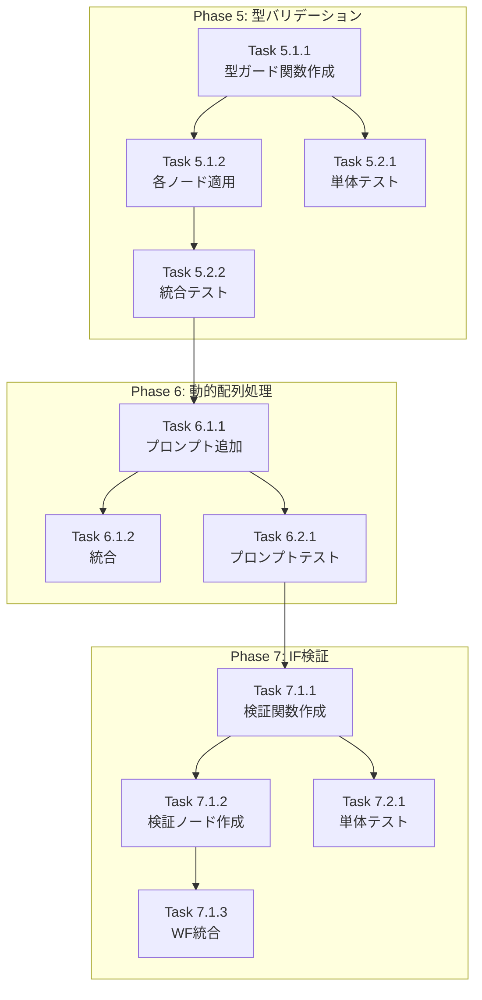

# 作業計画書: Issue #338 Phase 5-7 実装

**作成日**: 2026-01-06
**Issue番号**: #338
**Issue名**: タスクチェーン インターフェース契約強制メカニズムの導入
**作業ブランチ**: `develop` (継続)

---

## Issue概要の確認

```markdown
## Issue: タスクチェーン インターフェース契約強制メカニズム
**Issue番号**: #338
**サイズ**: L
**作業見積**: 12時間（Phase 5-7）
**優先度**: High
**依存Issue**: なし（Phase 4完了済み）
```

### 完了済みフェーズ

| フェーズ | 状態 | 対応した真因 |
|---------|------|-------------|
| Phase 4: 評価ルーティング改善 | ✅ 完了 | 真因2-A, 2-B |

### 残りフェーズ

| フェーズ | 状態 | 対応する真因 | 優先度 | 完了日 |
|---------|------|-------------|--------|--------|
| Phase 5: 型バリデーション強化 | ✅ 完了 | 真因2-C | 🔴 高 | 2026-01-06 |
| Phase 6: 動的配列処理パターン | ✅ 完了 | 真因1-A | 🟠 中 | 2026-01-06 |
| Phase 7: タスクチェーンIF検証 | ✅ 完了 | 真因1-B | 🟠 中 | 2026-01-06 |

---

## 詳細タスク分解

### Phase 5: 型バリデーション強化（真因2-C対応）

**目的**: `recommended_apis`の型が`list[str]`と`list[dict]`で混在し、`.get()`呼び出しでランタイムエラーが発生する問題を解決

#### 実装タスク（Phase 5.1）

- [ ] **Task 5.1.1**: 型ガード関数の作成
  - 所要時間: 1.5時間
  - 成果物: `utils/type_guards.py`
  - 依存: なし
  - 詳細:
    ```python
    def normalize_api_item(api: str | dict) -> dict[str, str]:
        """Normalize API item to dict format."""
        if isinstance(api, str):
            return {"api_name": api, "endpoint": api}
        if isinstance(api, dict):
            return {
                "api_name": api.get("api_name") or api.get("name") or "",
                "endpoint": api.get("endpoint") or "",
            }
        raise TypeError(f"Expected str or dict, got {type(api)}")

    def normalize_recommended_apis(apis: list[str | dict]) -> list[dict[str, str]]:
        """Normalize list of API items."""
        return [normalize_api_item(api) for api in apis]
    ```

- [ ] **Task 5.1.2**: 各ノードへの型ガード適用
  - 所要時間: 2時間
  - 成果物:
    - `nodes/generator.py` 修正
    - `nodes/llm_evaluator.py` 修正
    - `nodes/test_data_regenerator.py` 修正
    - `jobTaskGeneratorAgents/nodes/workflow_generation.py` 修正
  - 依存: Task 5.1.1

#### テストタスク（Phase 5.2: TDD）

- [ ] **Task 5.2.1**: 型ガード関数の単体テスト
  - 所要時間: 1時間
  - 成果物: `tests/unit/test_type_guards.py`
  - カバレッジ目標: 100%
  - テストケース:
    - `str` 型入力の正規化
    - `dict` 型入力の正規化
    - 不正な型入力時のTypeError
    - 空リストの処理
    - 混在リストの処理

- [ ] **Task 5.2.2**: ノード統合テスト
  - 所要時間: 1時間
  - 成果物: `tests/integration/test_type_guard_integration.py`
  - シナリオ:
    - `recommended_apis: ["api1", "api2"]` (str list)
    - `recommended_apis: [{"api_name": "api1"}]` (dict list)
    - `recommended_apis: ["api1", {"api_name": "api2"}]` (mixed)

---

### Phase 6: 動的配列処理パターン（真因1-A対応）

**目的**: LLMが検索結果の件数を固定で想定（3件等）し、0件や5件の場合に対応できない問題を解決

#### 実装タスク（Phase 6.1）

- [ ] **Task 6.1.1**: 配列処理パターンのプロンプト追加
  - 所要時間: 2時間
  - 成果物: `prompts/workflow_generation.py` 修正
  - 依存: なし
  - 詳細:
    ```markdown
    ## DYNAMIC ARRAY PROCESSING PATTERNS (Issue #338)

    When processing arrays of unknown length (e.g., search results):

    ### DO:
    - Use `mapAgent` to process all elements uniformly
    - Use `reduceAgent` to aggregate results
    - Design for 0-N elements

    ### DON'T:
    - Hardcode fixed number of extraction nodes (extract_result_0, extract_result_1, ...)
    - Assume specific array lengths

    ### Example Pattern:
    ```yaml
    process_results:
      agent: mapAgent
      inputs:
        items: :search_node.results
      graph:
        nodes:
          extract:
            agent: copyAgent
            inputs:
              title: :item.title
              snippet: :item.snippet
    ```
    ```

- [ ] **Task 6.1.2**: 既存プロンプトとの統合
  - 所要時間: 0.5時間
  - 成果物: `prompts/workflow_generation.py`
  - 依存: Task 6.1.1

#### テストタスク（Phase 6.2: TDD）

- [ ] **Task 6.2.1**: プロンプト含有テスト
  - 所要時間: 0.5時間
  - 成果物: `tests/unit/test_workflow_generation_prompt.py` 追加
  - テストケース:
    - 動的配列パターンがシステムプロンプトに含まれること
    - `mapAgent` 使用例が含まれること

---

### Phase 7: タスクチェーンインターフェース検証（真因1-B対応）

**目的**: Task間の`output_interface` → `input_interface`の整合性を検証し、不整合を早期検出

#### 実装タスク（Phase 7.1）

- [ ] **Task 7.1.1**: インターフェース検証関数の作成
  - 所要時間: 2時間
  - 成果物: `nodes/interface_validator.py` (新規)
  - 依存: なし
  - 詳細:
    ```python
    def validate_interface_compatibility(
        prev_output: dict[str, Any],
        next_input: dict[str, Any],
    ) -> list[str]:
        """Validate that prev task's output matches next task's input.

        Returns:
            List of compatibility issues (empty if compatible)
        """
        issues = []

        prev_props = prev_output.get("schema", {}).get("properties", {})
        next_props = next_input.get("schema", {}).get("properties", {})
        next_required = next_input.get("schema", {}).get("required", [])

        # Check required fields are provided
        for field in next_required:
            if field not in prev_props:
                issues.append(
                    f"Required field '{field}' not provided by previous task"
                )

        # Check type compatibility
        for field in next_props:
            if field in prev_props:
                prev_type = prev_props[field].get("type")
                next_type = next_props[field].get("type")
                if prev_type != next_type:
                    issues.append(
                        f"Type mismatch for '{field}': "
                        f"output={prev_type}, input={next_type}"
                    )

        return issues
    ```

- [ ] **Task 7.1.2**: 検証ノードの作成
  - 所要時間: 1時間
  - 成果物: `nodes/interface_validator.py` にノード追加
  - 依存: Task 7.1.1

- [ ] **Task 7.1.3**: ワークフローへの統合（オプション）
  - 所要時間: 1時間
  - 成果物: `agent.py` 修正（必要に応じて）
  - 依存: Task 7.1.2
  - 備考: jobTaskGeneratorAgents側での統合が主。workflowGeneratorAgentsは検証関数のみ提供

#### テストタスク（Phase 7.2: TDD）

- [ ] **Task 7.2.1**: 検証関数の単体テスト
  - 所要時間: 1時間
  - 成果物: `tests/unit/test_interface_validator.py`
  - カバレッジ目標: 95%
  - テストケース:
    - 互換性あり（全required提供）
    - 互換性なし（required欠落）
    - 型不一致
    - 空スキーマの処理

---

## タスク依存関係



---

## 作業スケジュール

### Day 1 (6時間) - Phase 5

| 時間 | タスク | 成果物 |
|------|--------|--------|
| 09:00-10:30 | Task 5.1.1（型ガード関数作成） | `utils/type_guards.py` |
| 10:30-11:30 | Task 5.2.1（単体テスト） | `tests/unit/test_type_guards.py` |
| 11:30-12:00 | 休憩 | - |
| 13:00-15:00 | Task 5.1.2（各ノード適用） | 4ファイル修正 |
| 15:00-16:00 | Task 5.2.2（統合テスト） | `tests/integration/test_type_guard_integration.py` |
| 16:00-17:00 | Phase 5 レビュー・修正 | - |

### Day 2 (6時間) - Phase 6 & 7

| 時間 | タスク | 成果物 |
|------|--------|--------|
| 09:00-11:00 | Task 6.1.1（プロンプト追加） | `prompts/workflow_generation.py` |
| 11:00-12:00 | Task 6.1.2 + 6.2.1（統合・テスト） | テスト追加 |
| 13:00-15:00 | Task 7.1.1（検証関数作成） | `nodes/interface_validator.py` |
| 15:00-16:00 | Task 7.1.2（検証ノード作成） | 同上 |
| 16:00-17:00 | Task 7.2.1（単体テスト） | `tests/unit/test_interface_validator.py` |

### Day 3 (2時間) - 仕上げ

| 時間 | タスク | 成果物 |
|------|--------|--------|
| 09:00-10:00 | Task 7.1.3（オプション：WF統合） | `agent.py` |
| 10:00-11:00 | 全体レビュー・ドキュメント更新 | `design-policy.md` 更新 |

**総作業時間**: 14時間（約2日）

---

## チェックポイント

| タイミング | 確認事項 | 合格基準 |
|-----------|---------|---------|
| Phase 5完了時 | 型ガードテスト全パス | 単体100%、統合3シナリオパス |
| Phase 6完了時 | プロンプトテスト全パス | 新パターンが含まれること |
| Phase 7完了時 | 検証関数テスト全パス | カバレッジ95%以上 |
| 全体完了時 | 静的解析パス | ruff check エラーゼロ |

---

## リスクと対策

| リスク | 発生確率 | 影響 | 対策 |
|-------|---------|------|------|
| 既存ノードへの型ガード適用で副作用 | 中 | 実装遅延2時間 | 既存テスト実行で早期検出 |
| プロンプト変更でLLM出力品質低下 | 低 | 実装遅延1時間 | 既存受入テストで検証 |
| インターフェース検証の統合箇所不明確 | 中 | 設計見直し2時間 | jobTaskGenerator側と調整 |

---

## 成果物チェックリスト

### Phase 5 ✅ 完了
- [x] `utils/type_guards.py` (新規) - 型ガード関数6個
- [x] `prompts/llm_evaluation.py` (修正) - 型ガード関数に置換
- [x] `prompts/test_data_regeneration.py` (修正) - 同上
- [x] `utils/__init__.py` (修正) - エクスポート追加
- [x] `tests/unit/test_type_guards.py` (新規) - 39テスト
- [x] `tests/integration/test_type_guard_integration.py` (新規) - 9テスト

### Phase 6 ✅ 完了
- [x] `prompts/workflow_generation.py` (修正) - `DYNAMIC_ARRAY_PROCESSING_PATTERNS` 追加
- [x] `tests/unit/test_workflow_generation_prompts.py` (追加) - 10テスト追加

### Phase 7 ✅ 完了
- [x] `utils/interface_validator.py` (新規) - 5関数/クラス
- [x] `utils/__init__.py` (修正) - エクスポート追加
- [x] `tests/unit/test_interface_validator.py` (新規) - 24テスト

---

## L3受入テスト計画

### Step 1: サービス起動確認

```bash
# サービス起動
./scripts/dev-hybrid.sh

# ヘルスチェック
curl -sf http://localhost:8004/health && echo "✅ expertAgent: healthy"
curl -sf http://localhost:8005/health && echo "✅ graphAiServer: healthy"
```

### Step 2: Phase 5 検証（型バリデーション）

```bash
# 混在型 recommended_apis でワークフロー生成
curl -s -X POST http://localhost:8004/v1/workflow/generate \
  -H "Content-Type: application/json" \
  -d '{
    "task_master_id": "test_tm_001",
    "task_data": {
      "name": "Test Task",
      "description": "Test with mixed API types",
      "recommended_apis": ["google_search", {"api_name": "summarize_api", "endpoint": "/v1/summarize"}],
      "input_interface": {"type": "json_schema", "schema": {}},
      "output_interface": {"type": "json_schema", "schema": {}}
    }
  }'

# 期待: HTTPステータス 200、エラーなし
# 以前: 'str' object has no attribute 'get' エラー
```

### Step 3: Phase 6 検証（動的配列処理）

```bash
# 生成されたワークフローに mapAgent パターンが含まれることを確認
curl -s -X POST http://localhost:8004/v1/workflow/generate \
  -H "Content-Type: application/json" \
  -d '{
    "task_data": {
      "name": "Search and Process",
      "description": "Google検索結果を処理",
      "recommended_apis": ["google_search"],
      "input_interface": {"type": "json_schema", "schema": {"properties": {"query": {"type": "string"}}}},
      "output_interface": {"type": "json_schema", "schema": {"properties": {"results": {"type": "array"}}}}
    }
  }' | jq '.yaml_content' | grep -i "mapAgent"

# 期待: mapAgent を使用した動的配列処理パターン
```

### Step 4: Phase 7 検証（インターフェース検証）

```bash
# インターフェース不整合のあるタスクチェーンで警告が出ることを確認
# （jobTaskGeneratorAgents側で統合後に実施）
```

---

## Definition of Done

Issue #338 Phase 5-7 完了条件：

- [x] Phase 5: 型ガード関数実装・テストパス
- [x] Phase 6: 動的配列プロンプト追加・テストパス
- [x] Phase 7: インターフェース検証関数実装・テストパス
- [x] 全テストパス（単体 + 結合 + 既存テスト）
- [ ] 静的解析パス（ruff check）
- [ ] L3受入テストパス（Phase 5, 6）
- [x] design-policy.md 更新

### 追加で実施したワークフロー統合（2026-01-06）

- [x] `jobTaskGeneratorAgents/agent.py` - `evaluator_router`に`interface_warnings`チェック追加
  - インターフェース不整合検出時に`interface_definition`へリトライルーティング
  - max retry到達時は警告を出しつつ継続（無限ループ回避）

---

## 次のアクション

- [ ] 静的解析（ruff check）実行
- [ ] L3受入テスト実行

---

## 変更履歴

| 日付 | 変更内容 |
|------|---------|
| 2026-01-06 | 初版作成 |
| 2026-01-06 | Phase 5-7 実装完了、Definition of Done更新 |
| 2026-01-06 | evaluator_routerにinterface_warnings統合（ワークフロー統合完了） |
