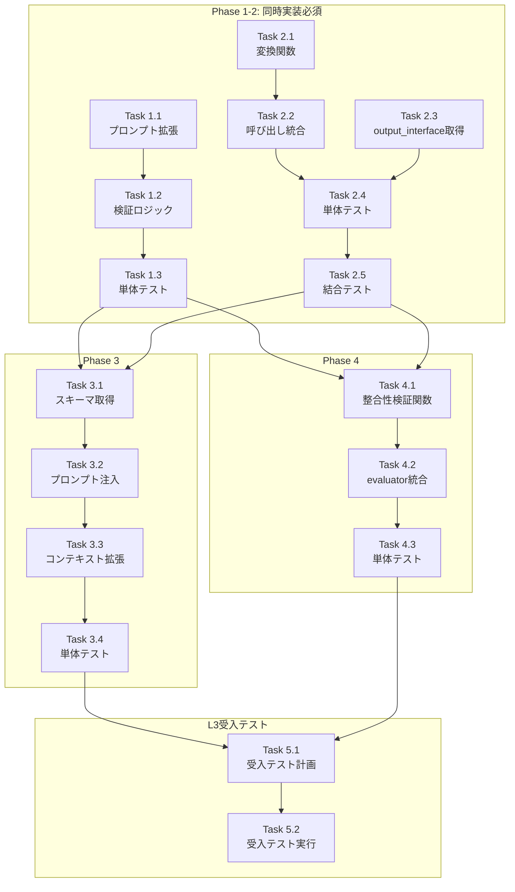

# 作業計画書: Issue #338

## Issue: タスクチェーン インターフェース契約強制メカニズムの導入

**Issue番号**: #338
**サイズ**: L
**作業見積**: 16時間
**優先度**: High
**依存Issue**: #337（Phase 1完了）, #333（関連）
**ラベル**: enhancement

---

## 1. Issue概要の確認

### 目的

タスクチェーン実行時のデータフローにおいて、`input_interface` / `output_interface` の定義を実際のデータ変換に反映し、インターフェース契約を「宣言」から「強制」に変更する。

### 背景

v1.28 タスクチェーン実行で発生した3つの障害（ノード参照エラー、output_interface不一致、タスク間データパス不一致）の共通原因である「インターフェース契約の強制メカニズム欠如」を解決する。

### 対象プロジェクト

| プロジェクト | 対象モジュール |
|-------------|--------------|
| **expertAgent** | prompts, workflow_generation, evaluator |
| **jobqueue** | worker, task_master repository |

---

## 2. 詳細タスク分解

> **重要**: アーキテクチャレビューにより **Phase 1-2 は同時実装必須**

### Phase 1-2: 出力ノード命名規約 + 変換レイヤー（同時実装）

#### Task 1.1: ワークフロー生成プロンプト拡張
- **所要時間**: 1時間
- **成果物**: `expertAgent/aiagent/langgraph/jobTaskGeneratorAgents/prompts/workflow_generation.yaml`
- **変更内容**: `output` ノード強制ルール追加
- **依存**: なし

#### Task 1.2: ワークフロー生成後検証ロジック
- **所要時間**: 2時間
- **成果物**: `expertAgent/aiagent/langgraph/jobTaskGeneratorAgents/nodes/workflow_generation.py`
- **変更内容**: 生成YAMLの `output` ノード存在検証
- **依存**: Task 1.1

#### Task 1.3: 命名規約検証 単体テスト
- **所要時間**: 1時間
- **成果物**: `expertAgent/tests/unit/test_workflow_output_validation.py`
- **カバレッジ目標**: 95%
- **依存**: Task 1.2

#### Task 2.1: `_transform_to_interface` 関数実装
- **所要時間**: 3時間
- **成果物**: `jobqueue/app/core/worker.py`
- **変更内容**:
  - `_transform_to_interface()` 関数追加
  - `_find_field_value()` 関数追加（3戦略サポート）
  - `_recursive_search()` 関数追加
  - `_path_based_search()` 関数追加
- **依存**: なし

#### Task 2.2: `_execute_tasks` での変換呼び出し
- **所要時間**: 1時間
- **成果物**: `jobqueue/app/core/worker.py`
- **変更内容**: タスク実行後に変換処理を呼び出し
- **依存**: Task 2.1

#### Task 2.3: output_interface 取得処理
- **所要時間**: 1時間
- **成果物**: `jobqueue/app/repositories/task_master.py`
- **変更内容**: TaskMasterからoutput_interface取得メソッド
- **依存**: なし

#### Task 2.4: 変換ロジック 単体テスト
- **所要時間**: 2時間
- **成果物**: `jobqueue/tests/unit/test_interface_transformer.py`
- **カバレッジ目標**: 95%
- **テストケース**:
  - output_interface未定義時のパススルー
  - directフィールド探索
  - recursiveフィールド探索（ネスト構造）
  - 必須フィールド欠落時の警告
  - 機密フィールドマスキング
- **依存**: Task 2.1, 2.2

#### Task 2.5: タスクチェーン変換 結合テスト
- **所要時間**: 2時間
- **成果物**: `jobqueue/tests/integration/test_task_chain_transformation.py`
- **シナリオ数**: 3
  1. 単一タスクの変換
  2. 2タスクチェーンの変換連携
  3. output_interface未定義タスクとの混在
- **依存**: Task 2.2, 2.3

### Phase 3: API応答スキーマ提供

#### Task 3.1: スキーマ取得関数
- **所要時間**: 1時間
- **成果物**: `expertAgent/aiagent/langgraph/jobTaskGeneratorAgents/utils/workflow_helper.py`
- **変更内容**: `get_api_response_schemas()` 関数追加
- **依存**: Phase 1-2完了

#### Task 3.2: プロンプトへのスキーマ注入
- **所要時間**: 1時間
- **成果物**: `expertAgent/aiagent/langgraph/jobTaskGeneratorAgents/prompts/workflow_generation.yaml`
- **変更内容**: API応答スキーマプレースホルダー追加
- **依存**: Task 3.1

#### Task 3.3: ワークフロー生成コンテキスト拡張
- **所要時間**: 0.5時間
- **成果物**: `expertAgent/aiagent/langgraph/jobTaskGeneratorAgents/nodes/workflow_generation.py`
- **変更内容**: コンテキストにスキーマ追加
- **依存**: Task 3.1, 3.2

#### Task 3.4: スキーマ注入 単体テスト
- **所要時間**: 1時間
- **成果物**: `expertAgent/tests/unit/test_api_schema_injection.py`
- **カバレッジ目標**: 90%
- **依存**: Task 3.3

### Phase 4: インターフェース整合性検証

#### Task 4.1: `check_interface_compatibility` 関数
- **所要時間**: 1時間
- **成果物**: `expertAgent/aiagent/langgraph/jobTaskGeneratorAgents/nodes/evaluator.py`
- **変更内容**: タスク間整合性検証関数追加
- **依存**: Phase 1-2完了

#### Task 4.2: evaluator_node への統合
- **所要時間**: 0.5時間
- **成果物**: `expertAgent/aiagent/langgraph/jobTaskGeneratorAgents/nodes/evaluator.py`
- **変更内容**: 4層目検証として呼び出し追加
- **依存**: Task 4.1

#### Task 4.3: 整合性検証 単体テスト
- **所要時間**: 1時間
- **成果物**: `expertAgent/tests/unit/test_interface_compatibility.py`
- **カバレッジ目標**: 95%
- **テストケース**:
  - 整合性OK（全必須フィールド存在）
  - 必須フィールド欠落時の警告
  - output_interface未定義タスクの処理
- **依存**: Task 4.2

---

## 3. タスク依存関係



---

## 4. 作業スケジュール

### Day 1 (6時間) - Phase 1-2 実装

| 時間 | タスク | 成果物 |
|------|--------|--------|
| 09:00-10:00 | Task 1.1: プロンプト拡張 | workflow_generation.yaml |
| 10:00-12:00 | Task 2.1: 変換関数実装 | worker.py (_transform_to_interface) |
| 13:00-14:00 | Task 2.3: output_interface取得 | task_master.py |
| 14:00-16:00 | Task 1.2: 検証ロジック | workflow_generation.py |
| 16:00-17:00 | Task 2.2: 変換呼び出し統合 | worker.py |

### Day 2 (6時間) - Phase 1-2 テスト + Phase 3

| 時間 | タスク | 成果物 |
|------|--------|--------|
| 09:00-10:00 | Task 1.3: 命名規約テスト | test_workflow_output_validation.py |
| 10:00-12:00 | Task 2.4: 変換ロジックテスト | test_interface_transformer.py |
| 13:00-15:00 | Task 2.5: 結合テスト | test_task_chain_transformation.py |
| 15:00-16:00 | Task 3.1: スキーマ取得関数 | workflow_helper.py |
| 16:00-17:00 | Task 3.2-3.3: プロンプト・コンテキスト | workflow_generation.yaml, workflow_generation.py |

### Day 3 (4時間) - Phase 3-4 + 受入テスト

| 時間 | タスク | 成果物 |
|------|--------|--------|
| 09:00-10:00 | Task 3.4: スキーマ注入テスト | test_api_schema_injection.py |
| 10:00-11:00 | Task 4.1: 整合性検証関数 | evaluator.py |
| 11:00-11:30 | Task 4.2: evaluator統合 | evaluator.py |
| 11:30-12:30 | Task 4.3: 整合性検証テスト | test_interface_compatibility.py |
| 13:00-15:00 | Task 5.1-5.2: L3受入テスト | test_issue_338_acceptance.py |

**総作業時間**: 16時間（約2.5日）

---

## 5. チェックポイント

| タイミング | 確認事項 | 対応 |
|-----------|---------|------|
| Task 2.1完了時 | 変換関数の動作確認 | ユニットテストで検証 |
| Phase 1-2完了時 | タスクチェーン変換E2E | 結合テスト実行 |
| Phase 3完了時 | LLMへのスキーマ注入確認 | Langfuseでプロンプト確認 |
| PR作成前 | CI/CDパス | `./scripts/pre-push-check-all.sh` |

---

## 6. リスクと対策

| リスク | 発生確率 | 影響 | 対策 |
|-------|---------|------|------|
| 既存ワークフローの動作破壊 | 低 | 高 | output_interface未定義時はパススルー |
| LLMが命名規約を無視 | 中 | 中 | 生成後検証で再生成促進 |
| フィールド探索の失敗 | 中 | 中 | recursive戦略 + ログ出力 |
| 変換処理のパフォーマンス低下 | 低 | 低 | 遅延変換、キャッシュ戦略 |

---

## 7. 成果物チェックリスト

### コード（expertAgent）
- [ ] `prompts/workflow_generation.yaml` - outputノード強制ルール
- [ ] `nodes/workflow_generation.py` - 生成後検証
- [ ] `utils/workflow_helper.py` - スキーマ取得関数
- [ ] `nodes/evaluator.py` - 整合性検証関数

### コード（jobqueue）
- [ ] `app/core/worker.py` - 変換ロジック
- [ ] `app/repositories/task_master.py` - output_interface取得

### テスト（expertAgent）
- [ ] `tests/unit/test_workflow_output_validation.py`
- [ ] `tests/unit/test_api_schema_injection.py`
- [ ] `tests/unit/test_interface_compatibility.py`

### テスト（jobqueue）
- [ ] `tests/unit/test_interface_transformer.py`
- [ ] `tests/integration/test_task_chain_transformation.py`

### 受入テスト
- [ ] `expertAgent/tests/acceptance/test_issue_338_acceptance.py`

---

## 8. L3受入テスト計画

### Step 1: サービス起動確認

```bash
# ハイブリッド起動（Platform=Docker, Agent=ローカル）
./scripts/dev-hybrid.sh

# ヘルスチェック
curl -sf http://localhost:8001/health && echo "jobqueue: healthy"
curl -sf http://localhost:8003/health && echo "myVault: healthy"
curl -sf http://localhost:8004/health && echo "expertAgent: healthy"
curl -sf http://localhost:8005/health && echo "graphAiServer: healthy"
```

### Step 2: ワークフロー生成テスト（Phase 1検証）

```bash
# ジョブ生成API呼び出し
curl -s -X POST http://localhost:8004/v1/job-generator/generate \
  -H "Content-Type: application/json" \
  -d '{
    "requirement_text": "Google検索を実行して結果を要約する",
    "project_id": "test-project-338"
  }' | jq '.tasks[0].workflow_yaml'

# 期待する検証ポイント:
# - ワークフローYAMLに "output:" ノードが存在
# - "isResult: true" が設定されている
# - 正しいAPI応答パス参照（:execute_search.search_results）
```

### Step 3: タスクチェーン実行テスト（Phase 2検証）

```bash
# ジョブ登録
JOB_ID=$(curl -s -X POST http://localhost:8001/v1/jobs \
  -H "Content-Type: application/json" \
  -d '{
    "name": "issue-338-acceptance-test",
    "tasks": [
      {
        "name": "search",
        "workflow_yaml": "...",
        "output_interface": {
          "type": "object",
          "properties": {
            "success": {"type": "boolean"},
            "search_results": {"type": "array"}
          },
          "required": ["success", "search_results"]
        }
      }
    ]
  }' | jq -r '.id')

# 実行状態確認
sleep 30
curl -s http://localhost:8001/v1/jobs/$JOB_ID | jq '.tasks[0].output_data'

# 期待する検証ポイント:
# - output_dataがoutput_interface定義に準拠
# - フラットな構造（ネストなし）
# - 必須フィールド（success, search_results）が存在
```

### Step 4: インターフェース整合性検証テスト（Phase 4検証）

```bash
# 不整合なタスクチェーンを生成
curl -s -X POST http://localhost:8004/v1/job-generator/generate \
  -H "Content-Type: application/json" \
  -d '{
    "requirement_text": "検索して要約（意図的に不整合なインターフェース）",
    "tasks": [
      {"output_interface": {"properties": {"data": {}}, "required": ["data"]}},
      {"input_interface": {"properties": {"results": {}}, "required": ["results"]}}
    ]
  }' 2>&1 | grep -i "warning\|compatibility"

# 期待する検証ポイント:
# - 警告メッセージ出力
# - "Task 1 output missing 'results' required by Task 2"
```

### Step 5: エビデンス収集

```bash
# レスポンス保存
mkdir -p /tmp/issue-338-evidence
curl -s http://localhost:8001/v1/jobs/$JOB_ID > /tmp/issue-338-evidence/job_result.json

# ログ確認
tail -100 expertAgent/logs/expertagent.log | grep -E "(TRANSFORM|interface)" > /tmp/issue-338-evidence/transform_logs.txt
tail -100 jobqueue/logs/worker.log | grep -E "(TRANSFORM|interface)" >> /tmp/issue-338-evidence/transform_logs.txt

echo "Evidence collected in /tmp/issue-338-evidence/"
```

---

## 9. Definition of Done

Issue完了条件：

### コード品質
- [ ] 単体テストカバレッジ 90%以上
- [ ] 結合テスト全シナリオパス
- [ ] Ruff/MyPy エラーゼロ
- [ ] CI/CD グリーン

### 機能検証
- [ ] Phase 1: `output` ノード強制が動作
- [ ] Phase 2: output_interface変換が動作
- [ ] Phase 3: API応答スキーマがLLMに提供される
- [ ] Phase 4: インターフェース不整合時に警告出力

### L3受入テスト
- [ ] サービス起動確認パス
- [ ] ワークフロー生成テストパス
- [ ] タスクチェーン実行テストパス
- [ ] インターフェース整合性検証テストパス

### ドキュメント
- [ ] 設計方針書更新完了
- [ ] 受入テストエビデンス収集

---

## 10. 次のアクション

作業計画承認後：

1. **ブランチ作成**: `issue/338-interface-contract-enforcement`
2. **worktree作成**: `./scripts/worktree-create-from-issue.sh 338`
3. **タスク実行**: Day 1から順次実装
4. **進捗報告**: `/progress-report` で定期報告
5. **PR作成**: `/pm-create-pr` で自動作成

---

## 参照ドキュメント

| ドキュメント | パス |
|-------------|------|
| 根本原因分析 | `dev-reports/feature/issue/337/task-chain-failure-analysis.md` |
| 設計方針書 | `dev-reports/feature/issue/338/design-policy.md` |
| アーキテクチャレビュー | `dev-reports/feature/issue/338/architecture-review.md` |
| 実装サマリ | `dev-reports/feature/issue/338/implementation-summary.md` |
