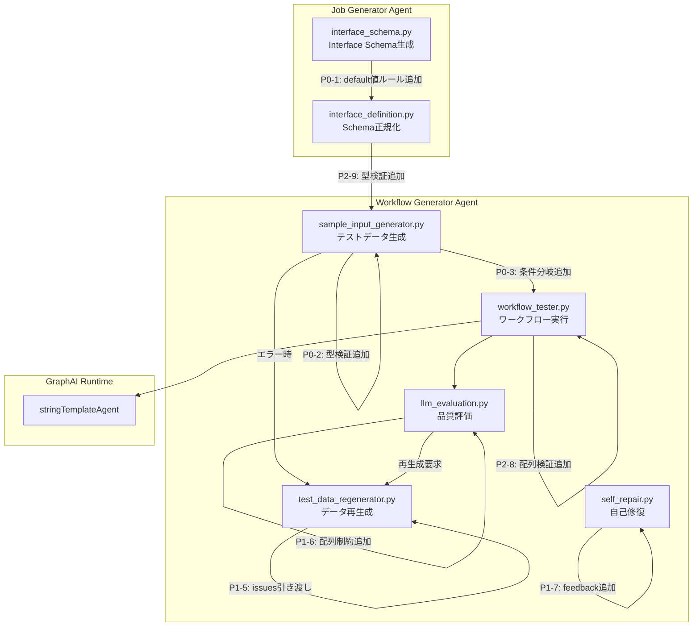

# 設計方針書: Issue #340 [object Object] 問題の完全修正

## 概要

- **Issue番号**: #340
- **作成日**: 2026-01-03
- **対象プロジェクト**: expertAgent
- **修正対象**: stringTemplateAgent がオブジェクトを `[object Object]` に変換し HTTP 500 を引き起こす問題

---

## 現状調査サマリ

### 対象プロジェクト

- **プロジェクト名**: expertAgent
- **主要モジュール**:
  - `workflowGeneratorAgents` - ワークフロー生成LangGraphエージェント
  - `jobTaskGeneratorAgents` - ジョブ/タスク生成LangGraphエージェント

### 既存アーキテクチャパターン

| パターン | 使用箇所 | 目的 |
|---------|---------|------|
| **State フィールド3点セット** | state.py | `{phase}_result`, `{phase}_issues`, `has_{phase}_errors` |
| **Issue構造化dict** | workflow_schema_validator.py | node_id, issue_type, message, severity, suggestion |
| **3層検証** | sample_input_generator.py | 生成時→再生成時→実行時 |
| **条件分岐Router** | agent.py | schema_validator_router, validator_router, llm_evaluator_router |
| **TYPE_VALIDATION_RULES** | workflow_generation.py | Markdown形式のルール定義 |

### 類似機能の設計（Issue #333）

Issue #333（スキーマ検証）と同様のパターンを踏襲:

```
generator → schema_validator → [条件分岐] → sample_input_generator
                                   ↓
                              self_repair (エラー時)
```

### モジュール間依存関係

```
Interface Schema生成 (jobTaskGeneratorAgents)
        ↓
    DBに保存
        ↓
ワークフロー生成 (workflowGeneratorAgents)
        ↓
   GraphAI実行
```

### 既存API設計パターン

- **エンドポイント命名規則**: `/v1/{resource}/{action}`
- **レスポンス形式**: JSONSchema準拠
- **エラーハンドリング**: State フィールドでフラグ管理

### 参照したドキュメント

| ドキュメント | 関連する内容 |
|-------------|-------------|
| `expertAgent/docs/API_REFERENCE.md` | API仕様、テストモード |
| `docs/spec/job-generation-workflow.md` | LangGraphエージェント設計、7段階ワークフロー |
| `dev-reports/feature/issue/340/bug-analysis/root-cause-analysis.md` | 9問題の詳細分析 |
| `dev-reports/feature/issue/340/bug-analysis/issues-summary.json` | 問題一覧JSON |

### 設計上の制約

1. **既存グラフ構造の維持**: 新規ノード追加は既存フローを破壊しない
2. **State immutability**: `{**state, "key": value}` パターン
3. **3層テスト構造**: 単体→統合→受入テスト
4. **Issue参照の義務化**: コード内に `# Issue #XXX:` コメント

---

## アーキテクチャ設計

### システム構成図



### レイヤー構成

現在の3層防御を5層防御に拡張:

| 層 | 名称 | タイミング | 責務 | 実装状況 |
|----|------|----------|------|---------|
| **Layer 0** | スキーマ生成時検証 | Interface Schema生成 | default値の型適合性検証 | **未実装 (P0)** |
| **Layer 1** | テストデータ生成時検証 | sample_input生成 | オブジェクト配列検出 | 部分実装 (要修正 P0) |
| **Layer 2** | プロンプト制約 | LLMへの指示 | 配列型ルールの明示 | 部分実装 (要修正 P1) |
| **Layer 3** | ランタイム検出 | workflow_tester | [object Object]パターン検出 | 実装済み (ルーティング欠如 P0) |
| **Layer 4** | ワークフロー検証 | workflow_validator | 配列要素型検証 | **未実装 (P2)** |

---

## 技術選定

| カテゴリ | 選定技術 | 選定理由 | 既存との整合性 |
|---------|---------|---------|---------------|
| **言語** | Python 3.11+ | 既存プロジェクト | 完全整合 |
| **フレームワーク** | FastAPI + LangGraph | 既存アーキテクチャ | 完全整合 |
| **型検証** | Pydantic + 手動検証 | 既存パターン踏襲 | 完全整合 |
| **テスト** | pytest + pytest-asyncio | 既存テスト基盤 | 完全整合 |
| **ログ** | structlog | 既存ログ基盤 | 完全整合 |

---

## 設計パターン

### 採用パターン

| パターン | 使用箇所 | 理由 |
|---------|---------|------|
| **Strategy** | _enum_or_default の型検証 | 型ごとに異なる検証ロジックを適用 |
| **Chain of Responsibility** | 5層防御アーキテクチャ | 各層で検証を連鎖的に実行 |
| **State Machine** | LangGraph条件分岐 | エラー状態に応じたフロー制御 |
| **Factory** | _object_array_issue | 標準化されたIssue dict生成 |

### 新規パターン導入

**なし** - 既存パターンで全て対応可能

---

## 詳細設計

### P0-1: Interface Schema プロンプト修正

**ファイル**: `expertAgent/aiagent/langgraph/jobTaskGeneratorAgents/prompts/interface_schema.py`

**修正内容**: プロンプトにdefault値生成ルールを追加

```markdown
## default値の生成ルール - Issue #340 CRITICAL

**重要**: default値は実際のデータ値であり、スキーマ定義ではない

❌ 禁止パターン:
```json
{
  "focus_points": {
    "type": "array",
    "items": {"type": "string"},
    "default": [{"type": "string", "description": "最新ニュース"}]
  }
}
```

✅ 正しいパターン:
```json
{
  "focus_points": {
    "type": "array",
    "items": {"type": "string"},
    "default": ["最新ニュース", "主要なトピック"]
  }
}
```

**ルール**:
- default値は items.type と一致する型の値のみ
- items.type="string" なら default は文字列配列
- items.type="number" なら default は数値配列
- オブジェクト（{...}）を default に含めない
```

### P0-2: _enum_or_default 型検証追加

**ファイル**: `expertAgent/aiagent/langgraph/workflowGeneratorAgents/nodes/sample_input_generator.py`

**修正内容**: default値の型検証を追加

```python
def _enum_or_default(schema: dict[str, Any]) -> SchemaValue:
    """Extract enum, default, or example value with type validation.

    Issue #340: Added type validation for default values to prevent
    object arrays from being used as string array defaults.

    MF-2: Added boolean array validation for completeness.
    """
    if "const" in schema:
        return schema["const"]

    enums = schema.get("enum")
    if isinstance(enums, list) and enums:
        return enums[0]

    examples = schema.get("examples")
    if isinstance(examples, list) and examples:
        return examples[0]

    default = schema.get("default")
    if default is not None:
        # Issue #340: Validate default value type
        if isinstance(default, list):
            items_type = schema.get("items", {}).get("type")
            if items_type == "string":
                # All elements must be strings
                if all(isinstance(item, str) for item in default):
                    return default
                # Object array detected, skip this default
                logger.warning(
                    "Skipping invalid default: expected string array, "
                    f"got {[type(x).__name__ for x in default]}"
                )
                return None
            elif items_type in ("number", "integer"):
                # All elements must be numbers
                if all(isinstance(item, (int, float)) for item in default):
                    return default
                logger.warning(
                    "Skipping invalid default: expected number array, "
                    f"got {[type(x).__name__ for x in default]}"
                )
                return None
            elif items_type == "boolean":
                # MF-2: All elements must be booleans
                if all(isinstance(item, bool) for item in default):
                    return default
                logger.warning(
                    "Skipping invalid default: expected boolean array, "
                    f"got {[type(x).__name__ for x in default]}"
                )
                return None
            # For other types (object, array), allow as-is
            # but log warning if contains dict elements
            if any(isinstance(item, dict) for item in default):
                logger.warning(
                    f"Array default contains objects: {[type(x).__name__ for x in default]}"
                )
        return default

    example = schema.get("example")
    if example is not None:
        return example

    return None
```

### P0-3: 条件分岐追加（MF-1: 無限ループ防止対応）

**ファイル**: `expertAgent/aiagent/langgraph/workflowGeneratorAgents/agent.py`

**修正内容**: sample_input_generator後に条件分岐を追加（無限ループ防止機構付き）

```python
# Issue #340: Add router for object array detection with infinite loop prevention
def sample_input_router(
    state: WorkflowGeneratorState,
) -> Literal["workflow_tester", "test_data_regenerator"]:
    """Route based on object array detection results.

    Issue #340: If object array issues are detected, route to
    test_data_regenerator for data regeneration.

    MF-1: Infinite loop prevention - if regeneration count exceeds max,
    continue to workflow_tester with warning log.
    """
    has_object_array_errors = state.get("has_object_array_errors", False)
    regen_count = state.get("object_array_regeneration_count", 0)
    max_regen = state.get("max_object_array_regeneration", 2)

    if has_object_array_errors:
        issues = state.get("object_array_issues", [])

        # MF-1: Check regeneration limit to prevent infinite loops
        if regen_count < max_regen:
            logger.info(
                f"sample_input_router: {len(issues)} object array issues detected, "
                f"regeneration attempt {regen_count + 1}/{max_regen}, "
                "routing to test_data_regenerator"
            )
            return "test_data_regenerator"
        else:
            # Max regeneration exceeded, continue with errors
            logger.warning(
                f"sample_input_router: {len(issues)} object array issues remain "
                f"after {max_regen} regeneration attempts. "
                "Continuing to workflow_tester (may fail at runtime)."
            )
            return "workflow_tester"

    logger.info("sample_input_router: no object array issues, continuing to workflow_tester")
    return "workflow_tester"


# In graph construction:
# Replace: workflow.add_edge("sample_input_generator", "workflow_tester")
# With:
workflow.add_conditional_edges(
    "sample_input_generator",
    sample_input_router,
    {
        "workflow_tester": "workflow_tester",
        "test_data_regenerator": "test_data_regenerator",
    }
)
```

**test_data_regenerator_node への追加修正**:

再生成カウンタをインクリメント:

```python
# test_data_regenerator.py
async def test_data_regenerator_node(
    state: WorkflowGeneratorState,
) -> WorkflowGeneratorState:
    # ... existing logic ...

    # MF-1: Increment regeneration count
    regen_count = state.get("object_array_regeneration_count", 0)

    return {
        **state,
        # ... other fields ...
        "object_array_regeneration_count": regen_count + 1,
    }
```

### P1-4: test_data_regeneration プロンプト修正

**ファイル**: `expertAgent/aiagent/langgraph/workflowGeneratorAgents/prompts/test_data_regeneration.py`

**修正内容**: 配列制約ルールを追加

```python
TEST_DATA_REGENERATION_SYSTEM_PROMPT = """
...

## 配列型の制約 - Issue #340

stringTemplateAgent に渡す配列フィールドには以下の制約があります:

1. **プリミティブ型のみ**: 配列要素は string, number, boolean のみ
2. **オブジェクト禁止**: [{...}, {...}] 形式は禁止
3. **型一貫性**: items.type と一致する型のみ使用

❌ 禁止パターン:
```json
{
  "focus_points": [
    {"type": "string", "description": "最新ニュース"}
  ]
}
```

✅ 正しいパターン:
```json
{
  "focus_points": ["最新ニュース", "主要なトピック"]
}
```

...
"""
```

### P1-5: object_array_issues 引き渡し

**ファイル**: `expertAgent/aiagent/langgraph/workflowGeneratorAgents/nodes/test_data_regenerator.py`

**修正内容**: object_array_issues をテストデータ再生成時の問題リストに含める

```python
# 現在のコード (行83付近)
test_data_issues = state.get("test_data_issues", [])

# 修正後
# Issue #340: Include object_array_issues in regeneration feedback
test_data_issues = (
    state.get("test_data_issues", []) +
    state.get("object_array_issues", [])
)
```

### P1-6: LLM Evaluation プロンプト修正（MF-3: 詳細設計追記）

**ファイル**: `expertAgent/aiagent/langgraph/workflowGeneratorAgents/prompts/llm_evaluation.py`

**修正内容**: 評価基準に配列要素型チェックを追加

**追加するプロンプトセクション**:

```python
LLM_EVALUATION_SYSTEM_PROMPT = """
...

## テストデータ品質評価基準 - Issue #340

以下の観点でテストデータの品質を評価してください:

### 配列型フィールドの検証

1. **stringTemplateAgent 入力の配列**:
   - items.type="string" の配列に文字列のみが含まれているか
   - オブジェクト（{...}）が配列に混入していないか

2. **[object Object] パターンの検出**:
   - テスト結果に "[object Object]" 文字列が含まれていないか
   - 含まれている場合は `failure_reason: "test_data_quality"` を設定

### 評価スコアへの影響

| 問題 | スコア減点 |
|------|----------|
| オブジェクト配列が検出された | -20点 |
| [object Object] が出力に含まれる | -30点 |
| 再生成後も問題が解消されない | -40点 |

...
"""
```

**llm_evaluator_node への修正**:

```python
# llm_evaluation.py (nodes)
async def llm_evaluator_node(
    state: WorkflowGeneratorState,
) -> WorkflowGeneratorState:
    # ... existing logic ...

    # Issue #340: Check for object array issues in evaluation
    object_array_issues = state.get("object_array_issues", [])
    has_object_array_errors = state.get("has_object_array_errors", False)

    # Include object array issues in evaluation context
    evaluation_context = {
        # ... existing context ...
        "object_array_issues": object_array_issues,
        "has_object_array_errors": has_object_array_errors,
    }

    # If object array issues exist, flag for test data regeneration
    if has_object_array_errors:
        return {
            **state,
            "needs_test_data_regeneration": True,
            "llm_evaluation_result": {
                "failure_reason": "test_data_quality",
                "details": f"{len(object_array_issues)} object array issues detected",
            },
        }

    # ... continue with LLM evaluation ...
```

### P1-7: self_repair_node 修正（MF-3: 詳細設計追記）

**ファイル**: `expertAgent/aiagent/langgraph/workflowGeneratorAgents/nodes/self_repair.py`

**修正内容**: object_array_issues をフィードバックに含める

**修正箇所1: エラーメッセージ構築**:

```python
# self_repair.py
async def self_repair_node(
    state: WorkflowGeneratorState,
) -> WorkflowGeneratorState:
    # ... existing logic ...

    # Collect all error sources
    validation_errors = state.get("validation_errors", [])
    schema_validation_issues = state.get("schema_validation_issues", [])

    # Issue #340: Include object_array_issues in repair feedback
    object_array_issues = state.get("object_array_issues", [])

    # Build comprehensive error message
    all_issues = []

    for error in validation_errors:
        all_issues.append(f"[validation] {error}")

    for issue in schema_validation_issues:
        msg = issue.get("message", "Unknown schema issue")
        all_issues.append(f"[schema:{issue.get('issue_type', 'unknown')}] {msg}")

    # Issue #340: Add object array issues to feedback
    for issue in object_array_issues:
        msg = issue.get("message", "Unknown object array issue")
        suggestion = issue.get("suggestion", "")
        all_issues.append(
            f"[object_array:{issue.get('issue_type', 'unknown')}] {msg}\n"
            f"  Suggestion: {suggestion}"
        )

    error_text = "\n".join(all_issues)

    # ... continue with repair prompt construction ...
```

**修正箇所2: 修復プロンプトへの追加ガイダンス**:

```python
# Issue #340: Add specific guidance for object array issues
if object_array_issues:
    error_text += """

## Object Array Issues - Issue #340

The workflow has object arrays being passed to stringTemplateAgent, which will
cause [object Object] conversion errors. To fix:

1. Ensure all array fields passed to stringTemplateAgent contain only primitive
   types (string, number, boolean)
2. If you need to pass object data, extract specific fields first using copyAgent
3. Alternatively, serialize objects to JSON strings before passing to templates

Example fix:
  Before: focus_points: [{"type": "string", "description": "..."}]
  After:  focus_points: ["最新ニュース", "主要なトピック"]
"""
```

**修正箇所3: State リセット**:

```python
    return {
        **state,
        "retry_count": retry_count + 1,
        "error_feedback": error_text,
        "repair_history": repair_history + [repair_entry],
        # Issue #340: Reset object array issues for next iteration
        "object_array_issues": [],
        "has_object_array_errors": False,
        "object_array_regeneration_count": 0,  # MF-1: Reset regeneration count
    }
```

### P2-8: workflow_validator 配列検証

**ファイル**: `expertAgent/aiagent/langgraph/workflowGeneratorAgents/nodes/workflow_validator.py`

**修正内容**: 配列要素の型検証を追加

### P2-9: interface_definition default検証

**ファイル**: `expertAgent/aiagent/langgraph/jobTaskGeneratorAgents/nodes/interface_definition.py`

**修正内容**: normalize_json_schema_properties でdefault値の型検証を追加

---

## データモデル設計

### State フィールド追加

Issue #340 で既に追加済み + **MF-1対応で新規追加**:

```python
# state.py
class WorkflowGeneratorState(TypedDict, total=False):
    # ... existing fields ...

    # ===== Object Array Validation (Issue #340) =====
    object_array_issues: list[dict[str, Any]]
    has_object_array_errors: bool

    # ===== MF-1: Infinite Loop Prevention (Issue #340) =====
    object_array_regeneration_count: int  # 初期値: 0
    max_object_array_regeneration: int    # 初期値: 2
```

**create_initial_state に追加**:
```python
def create_initial_state(...) -> WorkflowGeneratorState:
    return {
        # ... existing fields ...
        # Issue #340: Infinite loop prevention
        "object_array_regeneration_count": 0,
        "max_object_array_regeneration": 2,
    }
```

### Issue dict 構造（既存）

```python
{
    "node_id": "sample_input",
    "issue_type": "object_in_array",
    "message": "Array field 'xxx' contains object at index N...",
    "severity": "error",
    "field_name": str,
    "expected_value": "primitive type (string, number, boolean)",
    "actual_value": str,
    "suggestion": "Use primitive types...",
}
```

---

## テスト設計

### テスト構造

| テスト種別 | ファイル | 対象 |
|-----------|---------|------|
| **単体テスト** | `test_sample_input_type_validation.py` | _enum_or_default 型検証 |
| **単体テスト** | `test_interface_schema_default.py` | default値生成ルール |
| **統合テスト** | `test_object_array_routing.py` | 条件分岐フロー |
| **受入テスト** | `test_issue_340_p0_acceptance.py` | P0修正の完全検証 |

### テストケース

**P0-2: _enum_or_default 型検証（MF-2: boolean追加）**

```python
@pytest.mark.parametrize("schema,expected", [
    # Valid string array default
    ({"type": "array", "items": {"type": "string"}, "default": ["a", "b"]}, ["a", "b"]),
    # Invalid object array default (should return None)
    ({"type": "array", "items": {"type": "string"}, "default": [{"type": "string"}]}, None),
    # Valid number array default
    ({"type": "array", "items": {"type": "number"}, "default": [1, 2, 3]}, [1, 2, 3]),
    # Invalid number array with objects (should return None)
    ({"type": "array", "items": {"type": "integer"}, "default": [{"value": 1}]}, None),
    # MF-2: Valid boolean array default
    ({"type": "array", "items": {"type": "boolean"}, "default": [True, False]}, [True, False]),
    # MF-2: Invalid boolean array with strings (should return None)
    ({"type": "array", "items": {"type": "boolean"}, "default": ["true", "false"]}, None),
    # MF-2: Invalid boolean array with objects (should return None)
    ({"type": "array", "items": {"type": "boolean"}, "default": [{"value": True}]}, None),
])
def test_enum_or_default_type_validation(schema, expected):
    result = _enum_or_default(schema)
    assert result == expected
```

**P0-3: 条件分岐（MF-1: 無限ループ防止）**

```python
def test_sample_input_router_with_errors_first_attempt():
    """First regeneration attempt should route to test_data_regenerator."""
    state = {
        "has_object_array_errors": True,
        "object_array_issues": [{"field_name": "focus_points"}],
        "object_array_regeneration_count": 0,
        "max_object_array_regeneration": 2,
    }
    result = sample_input_router(state)
    assert result == "test_data_regenerator"


def test_sample_input_router_with_errors_max_exceeded():
    """MF-1: When max regeneration exceeded, should continue to workflow_tester."""
    state = {
        "has_object_array_errors": True,
        "object_array_issues": [{"field_name": "focus_points"}],
        "object_array_regeneration_count": 2,
        "max_object_array_regeneration": 2,
    }
    result = sample_input_router(state)
    assert result == "workflow_tester"


def test_sample_input_router_without_errors():
    """No errors should route directly to workflow_tester."""
    state = {"has_object_array_errors": False}
    result = sample_input_router(state)
    assert result == "workflow_tester"


def test_sample_input_router_regeneration_count_increment():
    """MF-1: Verify regeneration count is incremented in test_data_regenerator."""
    initial_state = {
        "object_array_regeneration_count": 0,
    }
    # Simulate test_data_regenerator_node
    result_state = {
        **initial_state,
        "object_array_regeneration_count": initial_state["object_array_regeneration_count"] + 1,
    }
    assert result_state["object_array_regeneration_count"] == 1
```

**P1-6/P1-7: 統合テスト**

```python
async def test_llm_evaluator_with_object_array_issues():
    """P1-6: LLM evaluator should flag test data regeneration for object array issues."""
    state = {
        "has_object_array_errors": True,
        "object_array_issues": [{"field_name": "focus_points", "issue_type": "object_in_array"}],
    }
    result = await llm_evaluator_node(state)
    assert result["needs_test_data_regeneration"] is True
    assert result["llm_evaluation_result"]["failure_reason"] == "test_data_quality"


async def test_self_repair_includes_object_array_feedback():
    """P1-7: Self repair should include object array issues in error feedback."""
    state = {
        "object_array_issues": [
            {
                "message": "Array field 'focus_points' contains object",
                "suggestion": "Use primitive types",
                "issue_type": "object_in_array",
            }
        ],
        "validation_errors": [],
        "schema_validation_issues": [],
        "retry_count": 0,
        "max_retry": 3,
        "repair_history": [],
    }
    result = await self_repair_node(state)
    assert "[object_array:object_in_array]" in result["error_feedback"]
    assert "Object Array Issues - Issue #340" in result["error_feedback"]
    # MF-1: Verify reset
    assert result["object_array_regeneration_count"] == 0
```

---

## セキュリティ設計

**該当なし** - 本修正はバリデーション強化であり、セキュリティ影響なし

---

## パフォーマンス設計

### 影響分析

| 修正箇所 | パフォーマンス影響 |
|---------|------------------|
| _enum_or_default 型検証 | O(n) - 配列要素数に比例、無視可能 |
| 条件分岐Router | O(1) - フラグチェックのみ |
| プロンプト追加 | トークン数微増（~100トークン） |

### 最適化不要

修正による性能影響は無視可能レベル

---

## 設計判断とトレードオフ

### 判断1: 5層防御アーキテクチャ

**採用理由**:
- 単一障害点を避ける
- 各層で異なるタイミングでの検出が可能
- 既存の3層防御パターンの自然な拡張

**代替案**:
- Layer 0 のみで完全ブロック → 採用しない（既存データへの影響、LLM出力の不確実性）

**トレードオフ**:
- 複雑性増加 vs 堅牢性向上 → 堅牢性を優先

### 判断2: 条件分岐 vs エラー返却

**採用理由**:
- 既存のLangGraph条件分岐パターンと整合
- 自己修復ループとの統合

**代替案**:
- 即時エラー返却 → 採用しない（リトライの機会を失う）

**トレードオフ**:
- 処理時間増加 vs 成功率向上 → 成功率を優先

### 判断3: プロンプト vs コード検証

**採用理由**:
- 両方実装（多層防御）
- プロンプトは「予防」、コードは「検出」

**代替案**:
- プロンプトのみ → 採用しない（LLM出力の不確実性）
- コードのみ → 採用しない（根本原因への対処なし）

---

## 実装優先順位

### Phase 1: P0 (v1.39)

| 問題ID | 実装内容 | 工数見積 |
|--------|---------|---------|
| P0-1 | Interface Schema プロンプト修正 | 小 |
| P0-2 | _enum_or_default 型検証追加 | 中 |
| P0-3 | 条件分岐追加 | 中 |

### Phase 2: P1 (v1.40)

| 問題ID | 実装内容 | 工数見積 |
|--------|---------|---------|
| P1-4 | test_data_regeneration プロンプト修正 | 小 |
| P1-5 | object_array_issues 引き渡し | 小 |
| P1-6 | LLM Evaluation プロンプト修正 | 小 |
| P1-7 | self_repair_node 修正 | 小 |

### Phase 3: P2 (v1.41+)

| 問題ID | 実装内容 | 工数見積 |
|--------|---------|---------|
| P2-8 | workflow_validator 配列検証 | 中 |
| P2-9 | interface_definition default検証 | 中 |

---

## 参照ドキュメント

| ドキュメント | 参照目的 |
|-------------|---------|
| `dev-reports/feature/issue/340/bug-analysis/root-cause-analysis.md` | 根本原因と9問題の詳細 |
| `dev-reports/feature/issue/340/bug-analysis/issues-summary.json` | 問題一覧JSON |
| `dev-reports/feature/issue/340/bug-analysis/problem-flow-diagram.md` | 問題発生フロー図 |
| `expertAgent/docs/API_REFERENCE.md` | API仕様 |
| `docs/spec/job-generation-workflow.md` | LangGraphエージェント設計 |
| GitHub Issue #340 | 問題報告と受入条件 |
| GitHub Issue #333 | 類似実装（スキーマ検証）の参考 |

---

## 変更履歴

| 日付 | バージョン | 変更内容 |
|------|----------|---------|
| 2026-01-03 | 1.0 | 初版作成 |
| 2026-01-03 | 1.1 | アーキテクチャレビュー指摘対応 (MF-1, MF-2, MF-3) |

### v1.1 変更詳細

**MF-1: 無限ループ防止**
- State フィールド追加: `object_array_regeneration_count`, `max_object_array_regeneration`
- `sample_input_router` に再生成上限チェックを追加
- `test_data_regenerator_node` で再生成カウンタをインクリメント
- `self_repair_node` で再生成カウンタをリセット

**MF-2: boolean配列検証**
- `_enum_or_default` に `items_type == "boolean"` の検証を追加
- テストケースに boolean 配列のパラメータを追加

**MF-3: P1-6, P1-7 詳細設計**
- P1-6: `LLM_EVALUATION_SYSTEM_PROMPT` に配列検証基準を追加
- P1-6: `llm_evaluator_node` に object_array_issues の評価ロジック追加
- P1-7: `self_repair_node` に object_array_issues のフィードバック構築追加
- P1-7: Object Array Issues 専用のガイダンスセクション追加
- P1-7: State リセット処理追加
