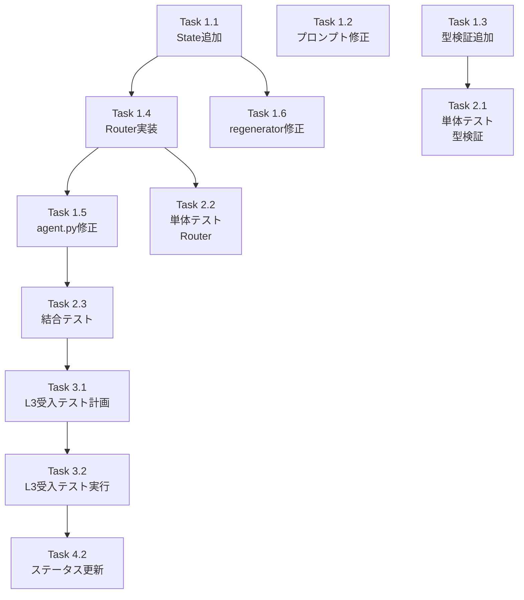

# 作業計画書: Issue #340 P0フェーズ

## Issue概要

```markdown
## Issue: stringTemplateAgent がオブジェクトを [object Object] に変換し HTTP 500 を引き起こす
**Issue番号**: #340
**サイズ**: L
**優先度**: High
**依存Issue**: なし
**フェーズ**: P0 (Critical - 即時対応)
```

---

## 対象範囲（P0フェーズ）

| 問題ID | タイトル | ファイル | 工数 |
|--------|---------|---------|------|
| P0-1 | Interface Schemaプロンプトにdefault値ルール追加 | `interface_schema.py` | 小 |
| P0-2 | `_enum_or_default`型検証追加 | `sample_input_generator.py` | 中 |
| P0-3 | sample_input_generator後に条件分岐追加 | `agent.py`, `state.py` | 中 |

---

## 詳細タスク分解

### Phase 1: 実装タスク

#### Task 1.1: State フィールド追加（MF-1対応）
- 成果物: `expertAgent/aiagent/langgraph/workflowGeneratorAgents/state.py`
- 依存: なし
- 内容:
  - `object_array_regeneration_count: int` 追加
  - `max_object_array_regeneration: int` 追加
  - `create_initial_state` に初期値設定

#### Task 1.2: P0-1 Interface Schema プロンプト修正
- 成果物: `expertAgent/aiagent/langgraph/jobTaskGeneratorAgents/prompts/interface_schema.py`
- 依存: なし
- 内容:
  - default値生成ルールをプロンプトに追加
  - 禁止パターン/正しいパターンの例示

#### Task 1.3: P0-2 _enum_or_default 型検証追加
- 成果物: `expertAgent/aiagent/langgraph/workflowGeneratorAgents/nodes/sample_input_generator.py`
- 依存: なし
- 内容:
  - string, number, integer, boolean 配列の型検証
  - オブジェクト配列検出時は None を返却
  - 警告ログ出力

#### Task 1.4: P0-3 sample_input_router 実装
- 成果物: `expertAgent/aiagent/langgraph/workflowGeneratorAgents/routers/sample_input_router.py`（新規）
- 依存: Task 1.1
- 内容:
  - `sample_input_router` 関数実装
  - 無限ループ防止ロジック（MF-1）
  - 再生成カウンタチェック

#### Task 1.5: P0-3 agent.py グラフ構造修正
- 成果物: `expertAgent/aiagent/langgraph/workflowGeneratorAgents/agent.py`
- 依存: Task 1.4
- 内容:
  - 直接エッジを条件分岐に変更
  - `sample_input_router` をインポート・登録

#### Task 1.6: test_data_regenerator_node 修正
- 成果物: `expertAgent/aiagent/langgraph/workflowGeneratorAgents/nodes/test_data_regenerator.py`
- 依存: Task 1.1
- 内容:
  - 再生成カウンタのインクリメント追加
  - `object_array_regeneration_count` の更新

### Phase 2: テストタスク（TDD - CI実行可能）

#### Task 2.1: 単体テスト - _enum_or_default 型検証
- 成果物: `expertAgent/tests/unit/test_enum_or_default_type_validation.py`
- カバレッジ目標: 95%
- 内容:
  - string配列: 有効/無効ケース
  - number/integer配列: 有効/無効ケース
  - boolean配列: 有効/無効ケース（MF-2）
  - オブジェクト配列検出テスト

#### Task 2.2: 単体テスト - sample_input_router
- 成果物: `expertAgent/tests/unit/test_sample_input_router.py`
- カバレッジ目標: 95%
- 内容:
  - エラーなし→workflow_tester
  - エラーあり（初回）→test_data_regenerator
  - エラーあり（上限超過）→workflow_tester（MF-1）
  - カウンタインクリメント確認

#### Task 2.3: 結合テスト - オブジェクト配列ルーティング
- 成果物: `expertAgent/tests/integration/test_object_array_routing.py`
- シナリオ数: 4
- 内容:
  - sample_input_generator → router → workflow_tester（正常フロー）
  - sample_input_generator → router → test_data_regenerator（エラーフロー）
  - 再生成後の正常フロー
  - 再生成上限超過フロー（MF-1）

### Phase 3: L3受入テストタスク【必須】

#### Task 3.1: L3受入テスト計画
- 成果物: 受入テストシナリオ
- 内容:
  - サービス起動確認コマンド
  - 実APIエンドポイント呼び出しコマンド
  - エビデンス収集方法

#### Task 3.2: L3受入テスト実装・実行
- 成果物: `expertAgent/tests/acceptance/test_issue_340_p0_acceptance.py`
- 必須内容:
  - サービス起動確認（ヘルスチェック）
  - 実APIエンドポイント呼び出し
  - オブジェクト配列を含むInterface Schemaでワークフロー生成
  - [object Object] パターンが発生しないことを確認

### Phase 4: ドキュメントタスク

#### Task 4.1: API仕様書更新（変更がある場合のみ）
- 成果物: `expertAgent/docs/API_REFERENCE.md`
- 内容: 該当なし（API変更なし）

#### Task 4.2: 設計方針書のステータス更新
- 成果物: `dev-reports/feature/issue/340/bug-analysis/design-policy.md`
- 内容: 実装完了ステータスの更新

---

## タスク依存関係



---

## チェックポイント

| タイミング | 確認事項 | 対応 |
|-----------|---------|------|
| Task 1.3完了時 | _enum_or_default が正しく型検証するか | 単体テスト実行 |
| Task 1.5完了時 | グラフ構造が正しく動作するか | 結合テスト実行 |
| Phase 2完了時 | カバレッジ目標達成 | 未達の場合追加テスト |
| Phase 3完了時 | L3受入テスト全パス | 失敗時は原因調査・修正 |

---

## リスクと対策

| リスク | 発生確率 | 影響 | 対策 |
|-------|---------|------|------|
| 既存テスト破壊 | 中 | 実装遅延 | 回帰テスト早期実行 |
| 無限ループ（MF-1） | 低 | 重大 | カウンタ上限で強制終了 |
| プロンプト変更でLLM品質低下 | 低 | 中 | 多層防御で軽減 |
| グラフ構造変更による副作用 | 中 | 中 | 結合テストで検証 |

---

## 成果物チェックリスト

### コード
- [ ] `expertAgent/aiagent/langgraph/workflowGeneratorAgents/state.py`
- [ ] `expertAgent/aiagent/langgraph/jobTaskGeneratorAgents/prompts/interface_schema.py`
- [ ] `expertAgent/aiagent/langgraph/workflowGeneratorAgents/nodes/sample_input_generator.py`
- [ ] `expertAgent/aiagent/langgraph/workflowGeneratorAgents/routers/sample_input_router.py`（新規）
- [ ] `expertAgent/aiagent/langgraph/workflowGeneratorAgents/agent.py`
- [ ] `expertAgent/aiagent/langgraph/workflowGeneratorAgents/nodes/test_data_regenerator.py`

### テスト
- [ ] `expertAgent/tests/unit/test_enum_or_default_type_validation.py`
- [ ] `expertAgent/tests/unit/test_sample_input_router.py`
- [ ] `expertAgent/tests/integration/test_object_array_routing.py`
- [ ] `expertAgent/tests/acceptance/test_issue_340_p0_acceptance.py`

### ドキュメント
- [ ] `dev-reports/feature/issue/340/bug-analysis/design-policy.md`（ステータス更新）

---

## L3受入テスト計画（具体的なコマンド）【必須セクション】

### Step 1: サービス起動確認

```bash
# サービス起動
./scripts/dev-hybrid.sh

# ヘルスチェック（必須）
curl -sf http://localhost:8004/health && echo "✅ expertAgent: healthy"
curl -sf http://localhost:8005/health && echo "✅ graphAiServer: healthy"
curl -sf http://localhost:8003/health && echo "✅ myVault: healthy"
curl -sf http://localhost:8001/health && echo "✅ jobqueue: healthy"
```

### Step 2: P0-2 型検証テスト（API経由）

```bash
# オブジェクト配列を含むInterface Schemaでワークフロー生成
curl -s -X POST http://localhost:8004/v1/aiagent/workflow-generator \
  -H "Content-Type: application/json" \
  -d '{
    "job_id": "test_job_340",
    "task_name": "test_task_340",
    "task_description": "Issue #340 受入テスト",
    "interface_schema": {
      "focus_points": {
        "type": "array",
        "items": {"type": "string"},
        "default": [{"type": "string", "description": "最新ニュース"}]
      }
    }
  }'

# 期待するレスポンス:
# - sample_input に focus_points が含まれる場合、文字列配列であること
# - オブジェクト配列がdefaultとして使用されていないこと
```

### Step 3: P0-3 条件分岐テスト

```bash
# ログ確認
tail -100 expertAgent/logs/expertagent.log | grep -E "(sample_input_router|object_array)"

# 期待するログ:
# - "sample_input_router: no object array issues" または
# - "sample_input_router: N object array issues detected, routing to test_data_regenerator"
```

### Step 4: E2Eテスト（v1.36で失敗したタスク再現）

```bash
# 「検索結果の分析とサマリ生成」タスクの再実行
# 前提: 適切なプロジェクトとワークベンチが存在すること

curl -s -X POST http://localhost:8004/v1/jobs/generate \
  -H "Content-Type: application/json" \
  -d '{
    "project_id": "proj_test",
    "workbench_id": "wb_test",
    "job_name": "Issue340_検証",
    "job_description": "Issue #340 修正検証",
    "tasks": [
      {
        "task_name": "検索結果の分析とサマリ生成",
        "task_description": "検索結果を分析してサマリを生成"
      }
    ]
  }'

# 期待する結果:
# - HTTP 200 (以前はHTTP 500)
# - [object Object] が出力に含まれない
```

### Step 5: エビデンス収集

```bash
# レスポンスをファイルに保存
curl -s ... > /tmp/issue_340_acceptance_response.json

# ログ確認
grep -E "(object_array|sample_input_router)" expertAgent/logs/expertagent.log > /tmp/issue_340_logs.txt

# 結果確認
cat /tmp/issue_340_acceptance_response.json | jq '.sample_input.focus_points'
# 期待: ["文字列1", "文字列2"] (オブジェクトではない)
```

---

## Definition of Done

Issue完了条件（P0フェーズ）：

- [ ] すべてのタスクが完了
- [ ] 単体テストカバレッジ90%以上
- [ ] 結合テスト全シナリオパス
- [ ] **L3受入テスト全パス**（実際のサービス起動・API呼び出し確認）
- [ ] CI/CDグリーン
- [ ] `[object Object]` パターンが発生しないことを確認
- [ ] v1.36で失敗した「検索結果の分析」タスクが成功すること

---

## 次のアクション

作業計画承認後：
1. **ブランチ確認**: `feature/issue-340-object-array-fix` または既存ブランチ
2. **TDD開始**: Task 2.1 → Task 1.3 の順でTDD実装
3. **進捗報告**: `/progress-report`で定期報告

---

## P1/P2 フェーズ（参考）

P0完了後、効果検証を実施してP1/P2の必要性を再評価。

### P1フェーズ（v1.40予定）
| 問題ID | 内容 |
|--------|------|
| P1-4 | test_data_regeneration プロンプト修正 |
| P1-5 | object_array_issues 引き渡し |
| P1-6 | LLM Evaluation プロンプト修正 |
| P1-7 | self_repair_node 修正 |

### P2フェーズ（v1.41+予定）
| 問題ID | 内容 |
|--------|------|
| P2-8 | workflow_validator 配列検証 |
| P2-9 | interface_definition default検証 |

---

## 変更履歴

| 日付 | バージョン | 変更内容 |
|------|----------|---------|
| 2026-01-03 | 1.0 | 初版作成 |
