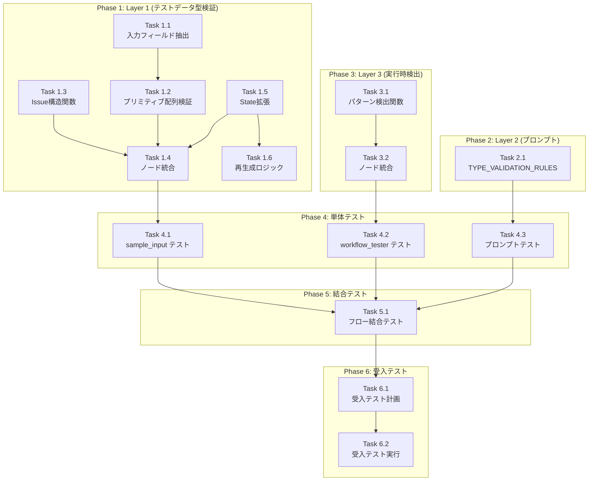

# 作業計画書: Issue #340 - stringTemplateAgent オブジェクト変換問題

## Issue概要

**Issue番号**: #340
**タイトル**: stringTemplateAgent がオブジェクトを [object Object] に変換し HTTP 500 を引き起こす
**サイズ**: M (Medium)
**優先度**: High
**依存Issue**: なし（#337は修正済み）

### 問題概要

`stringTemplateAgent` がオブジェクト型の入力を `[object Object]` 文字列に変換してしまい、後続の LLM 呼び出しが失敗して HTTP 500 エラーが発生する。

### 設計方針

3層防御アーキテクチャで対策：
- **Layer 1**: テストデータ型検証（sample_input_generator.py）
- **Layer 2**: プロンプト型制約（workflow_generation.py）
- **Layer 3**: 実行時検出（workflow_tester.py）

**参照ドキュメント**:
- `dev-reports/feature/issue/340/design-policy.md`
- `dev-reports/feature/issue/340/architecture-review.md`

---

## 詳細タスク分解

### Phase 1: テストデータ型検証（Layer 1）

#### Task 1.1: stringTemplateAgent入力フィールド抽出関数

| 項目 | 内容 |
|------|------|
| **成果物** | `expertAgent/aiagent/langgraph/workflowGeneratorAgents/nodes/sample_input_generator.py` |
| **内容** | `_get_string_template_input_fields()` 関数追加 |
| **依存** | なし |

```python
def _get_string_template_input_fields(yaml_content: str) -> set[str]:
    """YAMLからstringTemplateAgentのinputフィールド名を抽出"""
```

#### Task 1.2: プリミティブ配列検証関数

| 項目 | 内容 |
|------|------|
| **成果物** | `expertAgent/aiagent/langgraph/workflowGeneratorAgents/nodes/sample_input_generator.py` |
| **内容** | `_validate_primitive_arrays()` 関数追加 |
| **依存** | Task 1.1 |

```python
def _validate_primitive_arrays(
    sample_input: dict,
    target_fields: set[str],
) -> list[dict]:
    """配列要素がプリミティブ型であることを検証"""
```

#### Task 1.3: Issue構造関数

| 項目 | 内容 |
|------|------|
| **成果物** | `expertAgent/aiagent/langgraph/workflowGeneratorAgents/nodes/sample_input_generator.py` |
| **内容** | `_object_array_issue()` 関数追加 |
| **依存** | なし |

```python
def _object_array_issue(field_name: str, index: int, actual_type: str) -> dict:
    """オブジェクト配列検出時のIssue構造を生成"""
```

#### Task 1.4: sample_input_generator_node への統合

| 項目 | 内容 |
|------|------|
| **成果物** | `expertAgent/aiagent/langgraph/workflowGeneratorAgents/nodes/sample_input_generator.py` |
| **内容** | `sample_input_generator_node()` に検証ロジック統合 |
| **依存** | Task 1.1, 1.2, 1.3 |

#### Task 1.5: State拡張

| 項目 | 内容 |
|------|------|
| **成果物** | `expertAgent/aiagent/langgraph/workflowGeneratorAgents/state.py` |
| **内容** | `object_array_issues`, `has_object_array_errors` フィールド追加 |
| **依存** | なし |

```python
# WorkflowGeneratorState への追加
object_array_issues: list[dict]  # 検出されたオブジェクト配列問題
has_object_array_errors: bool    # オブジェクト配列エラーの有無
```

#### Task 1.6: test_data_regenerator_node の拡張

| 項目 | 内容 |
|------|------|
| **成果物** | `expertAgent/aiagent/langgraph/workflowGeneratorAgents/nodes/test_data_regenerator.py` |
| **内容** | オブジェクト配列エラー時の再生成ロジック追加 |
| **依存** | Task 1.5 |

---

### Phase 2: プロンプト型制約（Layer 2）

#### Task 2.1: TYPE_VALIDATION_RULES 更新

| 項目 | 内容 |
|------|------|
| **成果物** | `expertAgent/aiagent/langgraph/workflowGeneratorAgents/prompts/workflow_generation.py` |
| **内容** | 配列型制約ルール追加 |
| **依存** | なし |

```python
# 追加するルール
"""
### 配列型の制約
- stringTemplateAgent に渡す配列はプリミティブ型（string, number, boolean）のみ
- オブジェクト配列を渡すと [object Object] に変換される
- オブジェクトを文字列化する必要がある場合は事前に JSON.stringify 相当の処理が必要
"""
```

---

### Phase 3: 実行時検出（Layer 3）

#### Task 3.1: [object Object] パターン検出関数

| 項目 | 内容 |
|------|------|
| **成果物** | `expertAgent/aiagent/langgraph/workflowGeneratorAgents/nodes/workflow_tester.py` |
| **内容** | `_detect_object_object_pattern()` 関数追加 |
| **依存** | なし |

```python
def _detect_object_object_pattern(execution_result: dict) -> list[dict]:
    """[object Object] パターンを再帰的に検出"""
```

#### Task 3.2: workflow_tester_node への統合

| 項目 | 内容 |
|------|------|
| **成果物** | `expertAgent/aiagent/langgraph/workflowGeneratorAgents/nodes/workflow_tester.py` |
| **内容** | 実行結果に対する `[object Object]` 検出ロジック追加 |
| **依存** | Task 3.1 |

---

### Phase 4: 単体テスト

#### Task 4.1: sample_input_generator テスト

| 項目 | 内容 |
|------|------|
| **成果物** | `expertAgent/tests/unit/test_sample_input_object_array.py` |
| **内容** | Layer 1 検証ロジックの単体テスト |
| **依存** | Phase 1 完了 |
| **カバレッジ目標** | 90%以上 |

テストケース:
- `test_get_string_template_input_fields_single_node`
- `test_get_string_template_input_fields_multiple_nodes`
- `test_get_string_template_input_fields_no_string_template`
- `test_validate_primitive_arrays_with_objects`
- `test_validate_primitive_arrays_with_primitives`
- `test_validate_primitive_arrays_non_target_field`
- `test_object_array_issue_structure`

#### Task 4.2: workflow_tester テスト

| 項目 | 内容 |
|------|------|
| **成果物** | `expertAgent/tests/unit/test_workflow_tester_object_detection.py` |
| **内容** | Layer 3 検出ロジックの単体テスト |
| **依存** | Phase 3 完了 |
| **カバレッジ目標** | 90%以上 |

テストケース:
- `test_detect_object_object_pattern_in_string`
- `test_detect_object_object_pattern_nested`
- `test_detect_object_object_pattern_in_array`
- `test_detect_object_object_pattern_clean_result`

#### Task 4.3: プロンプト統合テスト

| 項目 | 内容 |
|------|------|
| **成果物** | `expertAgent/tests/unit/test_workflow_generation_prompts.py` (既存ファイル拡張) |
| **内容** | TYPE_VALIDATION_RULES に配列制約が含まれることを検証 |
| **依存** | Phase 2 完了 |

テストケース:
- `test_type_validation_rules_contains_array_constraint`

---

### Phase 5: 結合テスト

#### Task 5.1: ワークフロー生成フロー結合テスト

| 項目 | 内容 |
|------|------|
| **成果物** | `expertAgent/tests/integration/test_object_array_validation_flow.py` |
| **内容** | Layer 1 → 再生成 → 検証フローの結合テスト |
| **依存** | Phase 4 完了 |

テストケース:
- `test_object_array_triggers_regeneration`
- `test_regeneration_produces_primitive_arrays`
- `test_layer3_detects_runtime_object_object`

---

### Phase 6: 受入テスト（L3ローカル）

#### Task 6.1: 受入テスト計画

| 項目 | 内容 |
|------|------|
| **成果物** | 本ドキュメント「L3受入テスト計画」セクション |
| **内容** | 具体的なcurlコマンドと期待結果の定義 |
| **依存** | Phase 5 完了 |

#### Task 6.2: 受入テスト実装・実行

| 項目 | 内容 |
|------|------|
| **成果物** | `expertAgent/tests/acceptance/test_issue_340_acceptance.py` |
| **内容** | E2E検証（実サービス起動・API呼び出し） |
| **依存** | Task 6.1 |

---

## タスク依存関係



---

## チェックポイント

| タイミング | 確認事項 | 対応 |
|-----------|---------|------|
| Phase 1 完了時 | Layer 1 検証が動作すること | 単体テストパス確認 |
| Phase 3 完了時 | Layer 3 検出が動作すること | 単体テストパス確認 |
| Phase 4 完了時 | カバレッジ90%以上 | `pytest --cov` 実行 |
| Phase 5 完了時 | 結合テストパス | CI確認 |
| PR作成前 | pre-push-check-all.sh パス | ローカル実行 |

---

## リスクと対策

| リスク | 発生確率 | 影響 | 対策 |
|-------|---------|------|------|
| Layer 1 で全ケースを検出できない | 中 | Layer 3 でフォールバック | Layer 3 を必ず実装 |
| 誤検出による再生成ループ | 低 | 無限ループリスク | `max_test_data_regeneration` 上限設定（既存） |
| YAML解析エラー | 低 | 検出スキップ | try-except で安全にフォールバック |
| 既存テストへの影響 | 低 | CI失敗 | 既存テストを先に実行して確認 |

---

## 成果物チェックリスト

### コード

- [ ] `expertAgent/aiagent/langgraph/workflowGeneratorAgents/nodes/sample_input_generator.py`
  - `_get_string_template_input_fields()`
  - `_validate_primitive_arrays()`
  - `_object_array_issue()`
  - `sample_input_generator_node()` 修正

- [ ] `expertAgent/aiagent/langgraph/workflowGeneratorAgents/state.py`
  - `object_array_issues` フィールド
  - `has_object_array_errors` フィールド

- [ ] `expertAgent/aiagent/langgraph/workflowGeneratorAgents/nodes/test_data_regenerator.py`
  - オブジェクト配列エラー対応ロジック

- [ ] `expertAgent/aiagent/langgraph/workflowGeneratorAgents/prompts/workflow_generation.py`
  - 配列型制約ルール追加

- [ ] `expertAgent/aiagent/langgraph/workflowGeneratorAgents/nodes/workflow_tester.py`
  - `_detect_object_object_pattern()`
  - `workflow_tester_node()` 修正

### テスト

- [ ] `expertAgent/tests/unit/test_sample_input_object_array.py`
- [ ] `expertAgent/tests/unit/test_workflow_tester_object_detection.py`
- [ ] `expertAgent/tests/unit/test_workflow_generation_prompts.py` (拡張)
- [ ] `expertAgent/tests/integration/test_object_array_validation_flow.py`
- [ ] `expertAgent/tests/acceptance/test_issue_340_acceptance.py`

---

## L3受入テスト計画（具体的なコマンド）

### Step 1: サービス起動確認

```bash
# サービス起動
./scripts/dev-hybrid.sh

# ヘルスチェック
curl -sf http://localhost:8004/health && echo "✅ expertAgent: healthy"
curl -sf http://localhost:8005/health && echo "✅ graphAiServer: healthy"
curl -sf http://localhost:8001/health && echo "✅ jobqueue: healthy"
```

### Step 2: v1.36相当のシナリオ再現

```bash
# 「検索結果の分析とサマリ生成」タスクに相当するワークフロー生成
# task_master_id は事前にテスト用データを登録するか、既存のIDを使用

# ワークフロー生成API呼び出し
curl -s -X POST http://localhost:8004/v1/workflow-generator \
  -H "Content-Type: application/json" \
  -d '{
    "task_master_id": "<TEST_TASK_MASTER_ID>"
  }' | jq .

# 期待するレスポンス:
# - status: "success"
# - workflows[0].status: "success"
# - yaml_content が空でないこと
```

### Step 3: オブジェクト配列を含むテストデータでの検証

```bash
# stringTemplateAgent を使用するワークフローを直接テスト
curl -s -X POST http://localhost:8005/api/v1/myagent \
  -H "Content-Type: application/json" \
  -d '{
    "user_input": {
      "search_results": [{"title": "Sample", "link": "https://example.com"}],
      "focus_points": ["ニュース", "トピック"]
    },
    "model_name": "test_workflow"
  }'

# 期待するレスポンス:
# - "[object Object]" を含まないこと
# - HTTPステータス: 200
```

### Step 4: Layer 3 検出の確認

```bash
# 意図的に [object Object] を含む結果を生成するテスト
# workflow_tester が検出してエラーを返すことを確認

# ログ確認
tail -50 expertAgent/logs/expertagent.log | grep -E "(OBJECT_ARRAY|object Object)"
```

### Step 5: エビデンス収集

```bash
# レスポンスをファイルに保存
curl -s -X POST http://localhost:8004/v1/workflow-generator \
  -H "Content-Type: application/json" \
  -d '{"task_master_id": "<TEST_TASK_MASTER_ID>"}' \
  > /tmp/issue_340_acceptance_response.json

# 結果確認
cat /tmp/issue_340_acceptance_response.json | jq '.status, .workflows[0].status'
```

---

## Definition of Done

Issue完了条件：

- [ ] すべての実装タスクが完了
- [ ] 単体テストカバレッジ90%以上
- [ ] 結合テスト全シナリオパス
- [ ] **L3受入テスト全パス**（v1.36シナリオで成功確認）
- [ ] `./scripts/pre-push-check-all.sh` パス
- [ ] コードレビュー承認
- [ ] Issue #340 の受入条件すべて達成:
  - [ ] stringTemplateAgent にオブジェクトを渡した場合、`[object Object]` ではなく適切な文字列表現を生成
  - [ ] テストデータ生成時にオブジェクト配列が不適切に使用されないようバリデーション
  - [ ] workflow_tester で `[object Object]` パターンを検出した場合にエラーまたは警告を出力
  - [ ] v1.36 で失敗した「検索結果の分析」タスクが成功することを確認

---

## 次のアクション

作業計画承認後：
1. **ブランチ作成**: `issue/340-string-template-object-validation`
2. **worktree作成**: 別セッションで作業開始
3. **TDD実装**: `/tdd-impl` で Phase 1 から順次実装
4. **進捗報告**: `/progress-report` で定期報告

---

## 改訂履歴

| 日付 | 版 | 内容 |
|------|-----|------|
| 2025-01-03 | 1.0 | 初版作成 |
