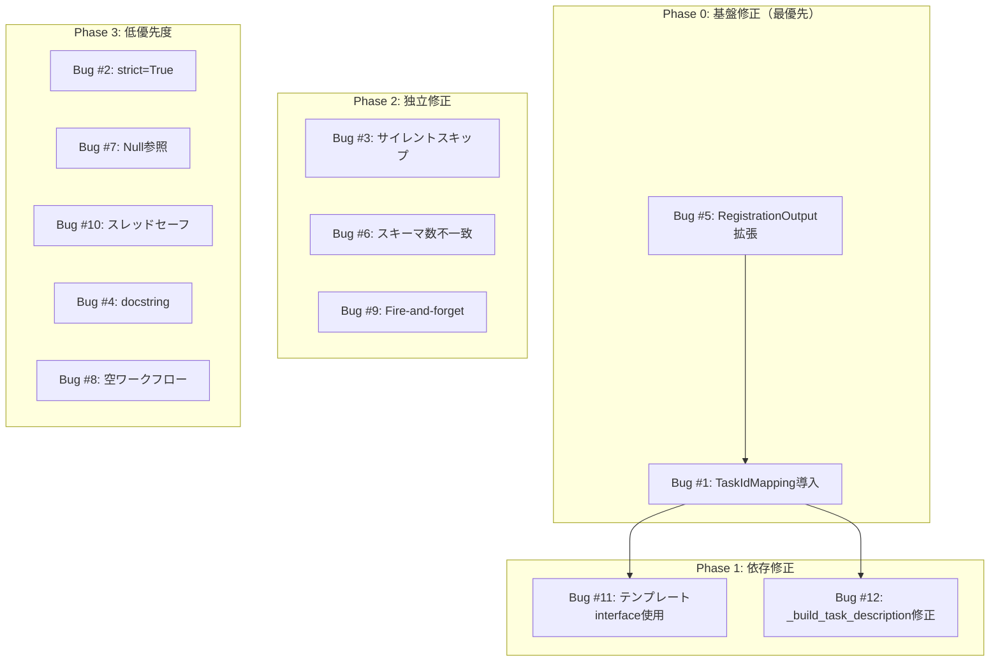

# V2 Job Generator アーキテクチャバグ設計方針書

## 1. 概要

| 項目 | 値 |
|------|-----|
| **Issue** | #342 V2 アーキテクチャ点検 |
| **作成日** | 2026-01-08 |
| **バージョン** | 1.1 |
| **発見バグ数** | 12件 |
| **CRITICAL** | 2件 |
| **HIGH** | 4件 |
| **MEDIUM** | 4件 |
| **LOW/DESIGN** | 2件 |
| **総工数見積** | 9.25h |

---

## 2. 発見バグ一覧

### 2.1 CRITICAL（即時対応必須）

#### Bug #1: Task ID ミスマッチ（Interface Lookup失敗）

**重大度**: CRITICAL
**影響**: 全LLMワークフロー生成が失敗しテンプレートフォールバック

**原因箇所**:
- `yaml_generator.py:378` - `_normalize_task_id(result_task_id)` でULID変換
- `orchestrator.py:453` - `{task_id: interface}` で論理IDをキーに設定

**データフロー**:
```
orchestrator.py:
  interface_for_task = {"task_001_alt": InterfaceSchema}  # 論理IDキー
  WorkflowGenInput(task_master_ids=["tm_01KEC..."], interfaces=interface_for_task)

yaml_generator.py:
  result_task_id = "tm_01KEC..."
  normalized = "01KEC..."  # tm_除去
  interfaces.get("01KEC...")  # 存在しない → フォールバック
```

**修正方針**:
```python
# Option A: yaml_generator.py側でinterfacesの最初のエントリを使用
if interfaces:
    result_interface = next(iter(interfaces.values()))

# Option B: orchestrator.py側でtask_master_idをキーに使用
interface_for_task = {task_master_id: interface}

# Option C（推奨）: 明示的なマッピング辞書を導入
class WorkflowGenInput:
    task_master_ids: list[str]
    interfaces: dict[str, InterfaceSchema]
    task_id_to_master_id: dict[str, str]  # 新規追加
```

---

#### Bug #5: Task順序不整合（Index-based Matching）

**重大度**: CRITICAL
**影響**: 複数タスク時に間違ったtask_master_idが使用される

**原因箇所**:
- `master_manager.py:213` - `sorted(tasks, key=lambda t: t.priority)` でソート
- `master_manager.py:221-222` - interface不在タスクをスキップ
- `orchestrator.py:442` - `task_master_ids[idx]` でインデックスマッチング

**問題シナリオ**:
```
入力: [taskA(p=2), taskB(p=1), taskC(p=3)]

Registration:
  sorted: [taskB, taskA, taskC]
  taskB interface無し → skip
  task_master_ids: [tm_A, tm_C]

Orchestrator (元の順序でイテレート):
  idx=0 (taskA) → tm_A ✓
  idx=1 (taskB) → tm_C ✗ (taskCのID!)
  idx=2 (taskC) → OUT OF BOUNDS
```

**修正方針**:
```python
# Option A（推奨）: RegistrationOutputにマッピング追加
@dataclass
class RegistrationOutput:
    task_master_ids: list[str]
    task_id_to_master_id: dict[str, str]  # 新規: {"task_001_alt": "tm_01KEC..."}

# Option B: orchestrator側でtask.idベースで参照
for task in breakdown_output.tasks:
    task_master_id = registration_output.task_id_to_master_id.get(task.id)
    if not task_master_id:
        logger.error("No task_master_id for task %s", task.id)
        continue
```

---

### 2.2 HIGH（早期対応推奨）

#### Bug #3: サイレントタスクスキップ

**重大度**: HIGH
**影響**: 不完全なワークフロー生成

**原因箇所**:
- `orchestrator.py:440` - `continue` でスキップ
- `master_manager.py:221-222` - `continue` でスキップ
- `master_manager.py:272-273` - `continue` でスキップ

**修正方針**:
```python
# スキップカウンターを追加し、閾値超過時にエラー
skipped_count = 0
for task in tasks:
    if task.id not in interfaces:
        skipped_count += 1
        logger.warning("Skipping task %s: no interface", task.id)
        continue

if skipped_count > 0:
    logger.error("Skipped %d/%d tasks", skipped_count, len(tasks))
    if skipped_count == len(tasks):
        raise WorkflowError("All tasks skipped", ErrorType.VALIDATION)
```

---

#### Bug #6: LLMスキーマ数不一致時のサイレント継続

**重大度**: HIGH
**影響**: 孤立したinterfaceが発生

**原因箇所**: `schema_generator.py:334-340`

**現状の動作**:
- `len(response.interfaces) == len(tasks)` → リマッピングで対応（OK）
- `len(response.interfaces) != len(tasks)` → 警告ログのみで継続（問題）

**修正方針**:
```python
if set(received_task_ids) != set(expected_task_ids):
    count_diff = abs(len(response.interfaces) - len(tasks))

    if count_diff == 0:
        # 数は一致、IDのみ不一致 → リマッピングで対応
        logger.warning(
            "Task ID mismatch detected. Will remap by order. "
            "LLM: %s, Expected: %s",
            received_task_ids, expected_task_ids,
        )
        needs_remapping = True
    elif count_diff == 1:
        # 差が1 → 警告して継続（LLMの軽微なエラー許容）
        logger.warning(
            "Interface count mismatch (diff=1): expected %d, got %d. "
            "Proceeding with available interfaces.",
            len(tasks), len(response.interfaces),
        )
    else:
        # 差が2以上 → 致命的エラーとして失敗
        raise WorkflowError(
            f"Interface count mismatch too large: expected {len(tasks)}, "
            f"got {len(response.interfaces)} (diff={count_diff})",
            ErrorType.VALIDATION,
            Phase.INTERFACE_DESIGN,
        )
```

---

#### Bug #9: Fire-and-Forget非同期タスク

**重大度**: HIGH
**影響**: 例外が失われる

**原因箇所**: `progress.py:123`

```python
asyncio.create_task(self._report_async(phase, context))  # 保存されない
```

**修正方針**:
```python
# Option A: タスクを保存して後でawait
self._pending_tasks.append(
    asyncio.create_task(self._report_async(phase, context))
)

# Option B: 例外ハンドラを設定
task = asyncio.create_task(self._report_async(phase, context))
task.add_done_callback(self._handle_task_exception)

def _handle_task_exception(self, task: asyncio.Task) -> None:
    if task.exception():
        logger.error("Progress report failed: %s", task.exception())
```

---

#### Bug #11: テンプレート生成がinterfacesを無視

**重大度**: HIGH
**影響**: フォールバック時にAPI情報が欠落
**依存**: ⚠️ Bug #1 の修正が前提条件

**原因箇所**: `yaml_generator.py:246-280`

**修正方針**:

> **注意**: この修正は Bug #1（TaskIdMapping導入）の完了後に実施すること。
> 単独で修正すると、同じIDミスマッチ問題が発生する。

```python
def _build_workflow_nodes(self, task_master_ids, interfaces, task_id_mapping: TaskIdMapping):
    """Bug #1 修正後の TaskIdMapping を使用してinterface参照"""
    for idx, tm_id in enumerate(task_master_ids):
        # Bug #1 修正: マッピングを使用して論理IDを取得
        logical_task_id = task_id_mapping.master_to_logical.get(tm_id)

        if not logical_task_id:
            logger.warning("No mapping found for task_master_id %s", tm_id)
            logical_task_id = _normalize_task_id(tm_id)  # フォールバック

        # interfaceからAPI情報を取得（論理IDで参照）
        interface = interfaces.get(logical_task_id)
        if interface and interface.recommended_apis:
            agent = self._select_agent_from_apis(interface.recommended_apis)
            params = self._build_params_from_interface(interface)
        else:
            agent = "fetchAgent"
            params = {"task_master_id": tm_id}

        node = WorkflowNodeDefinition(
            node_id=logical_task_id,
            agent=agent,
            inputs=inputs,
            params=params,
        )
```

---

### 2.3 MEDIUM（計画的対応）

#### Bug #2: 依存関係マッピング脆弱性

**原因箇所**: `task_breakdown/workflow.py:224`

```python
for orig, alt in zip(original_tasks, alternative_tasks, strict=False):
```

**修正**: `strict=True` に変更

---

#### Bug #7: Interface Chaining Null参照

**原因箇所**: `master_manager.py:282`

```python
input_interface_id = prev_output_interface_id or mapping["input_id"]
```

**修正**: 明示的なNullチェックと初期化

---

#### Bug #10: グローバルカウンター非スレッドセーフ

**原因箇所**: `types.py:353`

**修正**:
```python
import threading
_derived_fields_lock = threading.Lock()

with _derived_fields_lock:
    _derived_fields_degradation_count += 1
```

---

#### Bug #12: _build_task_description_from_chainもIDミスマッチ

**原因箇所**: `yaml_generator.py:485-489`

**修正**: Bug #1と同様の修正を適用

---

### 2.4 LOW/DESIGN

#### Bug #4: インターフェース契約曖昧

**原因箇所**: `types.py:564`

**修正**: docstringにキー仕様を明記
```python
@dataclass
class WorkflowGenInput:
    """Input for WorkflowGenWorkflow.

    Attributes:
        task_master_ids: List of registered TaskMaster IDs (ULID format: tm_XXXXX)
        job_master_id: Registered JobMaster ID
        interfaces: Interface schemas keyed by logical task_id (e.g., "task_001_alt")
    """
```

---

#### Bug #8: 空ワークフロー無視

**原因箇所**: `orchestrator.py:533`

**修正**: 警告ログを追加
```python
if task_workflow and task_workflow.workflow_yaml:
    task_yamls.append(...)
else:
    logger.warning("Task %s has no workflow YAML", task.id)
```

---

## 3. 根本原因分析

### 3.1 ID体系の不整合（Bug #1, #5, #12）

**問題**: 2種類のIDが混在
- **論理ID**: `task_001_alt`, `task_002_alt` - TaskDefinition.id
- **ULID**: `tm_01KEC6X7YC76V74Y4E4F98NBFR` - TaskMaster.id

**解決策**: 明示的なマッピング層を導入

```python
@dataclass
class TaskIdMapping:
    """タスクID間のマッピングを管理"""
    logical_to_master: dict[str, str]  # task_001_alt -> tm_01KEC...
    master_to_logical: dict[str, str]  # tm_01KEC... -> task_001_alt

    @classmethod
    def from_registration(cls, tasks: list[TaskDefinition],
                          task_masters: list[TaskMaster]) -> "TaskIdMapping":
        """Registration結果からマッピングを構築"""
        # タスク順序を保持してマッピング
```

### 3.2 サイレント失敗パターン（Bug #3, #6, #8, #11）

**問題**: エラー時に`continue`でスキップし、処理継続

**解決策**: Fail-Fast + 集約エラー報告

```python
class ErrorAggregator:
    """エラーを集約し、閾値超過時に失敗"""
    def __init__(self, max_errors: int = 3):
        self.errors: list[str] = []
        self.max_errors = max_errors

    def add(self, error: str):
        self.errors.append(error)
        if len(self.errors) >= self.max_errors:
            raise WorkflowError(
                f"Too many errors ({len(self.errors)}): {self.errors}",
                ErrorType.VALIDATION,
            )

    def check(self):
        if self.errors:
            logger.warning("Completed with %d errors: %s", len(self.errors), self.errors)
```

### 3.3 非同期/並行処理（Bug #9, #10）

**問題**:
- 非同期タスクの例外喪失
- グローバル状態への非同期アクセス

**解決策**:
- タスク管理とエラーハンドリング
- スレッドセーフなカウンター

---

## 4. 修正優先度と実装計画

### 4.1 修正順序の依存関係



**依存関係の説明**:
- **Bug #5 → Bug #1**: RegistrationOutputにマッピングを追加後、それを使用するTaskIdMappingを導入
- **Bug #1 → Bug #11, #12**: TaskIdMappingが存在しないと、テンプレート生成でも同じIDミスマッチが発生

### 4.2 Phase 0: 基盤修正（最優先・ブロッカー）

| 順序 | Bug | 修正内容 | 工数見積 | 依存 |
|------|-----|---------|---------|------|
| 1 | #5 | RegistrationOutputに`task_id_to_master_id`マッピング追加 | 1.5h | なし |
| 2 | #1 | TaskIdMappingクラス導入、yaml_generator.pyでの使用 | 1.5h | #5 |

### 4.3 Phase 1: 依存修正（P0完了後）

| 順序 | Bug | 修正内容 | 工数見積 | 依存 |
|------|-----|---------|---------|------|
| 3 | #11 | テンプレート生成でTaskIdMapping使用 | 1.5h | #1 |
| 4 | #12 | _build_task_description_from_chainでTaskIdMapping使用 | 0.5h | #1 |

### 4.4 Phase 2: 独立修正（並列実行可能）

| Bug | 修正内容 | 工数見積 | 依存 |
|-----|---------|---------|------|
| #3 | サイレントスキップをエラー集約に変更 | 1h | なし |
| #6 | スキーマ数不一致時の閾値ベース判定 | 0.5h | なし |
| #9 | 非同期タスク管理追加 | 1h | なし |

### 4.5 Phase 3: 低優先度修正

| Bug | 修正内容 | 工数見積 | 依存 |
|-----|---------|---------|------|
| #2 | `strict=True`に変更 | 0.25h | なし |
| #7 | Interface Chaining Null参照修正 | 0.5h | なし |
| #10 | グローバルカウンターのスレッドセーフ化 | 0.5h | なし |
| #4, #8 | ドキュメント/ログ改善 | 0.5h | なし |

### 4.6 総工数見積

| Phase | 工数 | 累計 |
|-------|------|------|
| P0 | 3.0h | 3.0h |
| P1 | 2.0h | 5.0h |
| P2 | 2.5h | 7.5h |
| P3 | 1.75h | 9.25h |

---

## 5. テスト計画

### 5.1 単体テスト追加

```python
# tests/unit/test_job_generator_v2/test_task_id_mapping.py
import pytest
from aiagent.langgraph.jobGeneratorV2.types import TaskIdMapping, TaskDefinition

class TestTaskIdMapping:
    """Bug #1, #5: TaskIdMappingの単体テスト"""

    def test_interface_lookup_with_ulid(self):
        """Bug #1: ULIDでinterface参照できることを確認

        Scenario:
          Given: interfaces = {"task_001_alt": InterfaceSchema(...)}
          And: task_master_ids = ["tm_01KEC6X7YC76V74Y4E4F98NBFR"]
          And: mapping = {"task_001_alt": "tm_01KEC..."}
          When: lookup via master_to_logical
          Then: InterfaceSchema が返される（None ではない）
        """
        # Arrange
        interfaces = {"task_001_alt": InterfaceSchema(task_id="task_001_alt", ...)}
        mapping = TaskIdMapping(
            logical_to_master={"task_001_alt": "tm_01KEC6X7YC76V74Y4E4F98NBFR"},
            master_to_logical={"tm_01KEC6X7YC76V74Y4E4F98NBFR": "task_001_alt"},
        )
        task_master_id = "tm_01KEC6X7YC76V74Y4E4F98NBFR"

        # Act
        logical_id = mapping.master_to_logical.get(task_master_id)
        result = interfaces.get(logical_id)

        # Assert
        assert result is not None
        assert result.task_id == "task_001_alt"

    def test_task_order_preserved_after_registration(self):
        """Bug #5: 登録後もタスク順序が保持されることを確認

        Scenario:
          Given: tasks = [taskA(p=2), taskB(p=1), taskC(p=3)]
          When: Registration with priority sorting
          Then: mapping preserves original task_id -> master_id relationship
        """
        # Arrange
        tasks = [
            TaskDefinition(id="taskA", priority=2),
            TaskDefinition(id="taskB", priority=1),
            TaskDefinition(id="taskC", priority=3),
        ]

        # Act
        mapping = TaskIdMapping.from_registration(tasks, task_masters)

        # Assert
        assert mapping.logical_to_master["taskA"] == "tm_A"
        assert mapping.logical_to_master["taskB"] == "tm_B"
        assert mapping.logical_to_master["taskC"] == "tm_C"

    def test_skip_threshold_exceeded(self):
        """Bug #3: スキップ閾値超過時にエラーになることを確認

        Scenario:
          Given: 5 tasks, but 0 have interfaces
          When: Processing tasks
          Then: WorkflowError raised with "All tasks skipped"
        """
        # Arrange
        tasks = [TaskDefinition(id=f"task_{i}") for i in range(5)]
        interfaces = {}  # 全てのinterfaceが欠落

        # Act & Assert
        with pytest.raises(WorkflowError) as exc_info:
            process_tasks(tasks, interfaces)
        assert "All tasks skipped" in str(exc_info.value)


class TestSchemaCountValidation:
    """Bug #6: スキーマ数不一致検証のテスト"""

    def test_count_mismatch_diff_1_warns(self):
        """差が1の場合は警告のみで継続"""
        # Arrange
        tasks = [TaskDefinition(id=f"task_{i}") for i in range(3)]
        response = LLMResponse(interfaces=[...] * 2)  # 3タスクに対し2インターフェース

        # Act
        result = validate_schema_count(tasks, response)

        # Assert
        assert result.status == "warning"
        assert result.continue_processing is True

    def test_count_mismatch_diff_2_raises(self):
        """差が2以上の場合はエラー"""
        # Arrange
        tasks = [TaskDefinition(id=f"task_{i}") for i in range(5)]
        response = LLMResponse(interfaces=[...] * 2)  # 5タスクに対し2インターフェース

        # Act & Assert
        with pytest.raises(WorkflowError) as exc_info:
            validate_schema_count(tasks, response)
        assert "count mismatch too large" in str(exc_info.value)


class TestAsyncTaskManagement:
    """Bug #9: 非同期タスク管理のテスト"""

    @pytest.mark.asyncio
    async def test_fire_and_forget_exception_logged(self):
        """Fire-and-forgetタスクの例外がログに記録されることを確認"""
        # Arrange
        progress_reporter = ProgressReporter()

        # Act
        await progress_reporter.report(phase="TEST", context={"error": True})
        await progress_reporter.wait_pending_tasks()

        # Assert
        assert progress_reporter.exception_count == 1
```

### 5.2 結合テスト追加

```python
# tests/integration/test_v2_e2e_bug_fixes.py
import pytest
from aiagent.langgraph.jobGeneratorV2.orchestrator import JobGeneratorV2Orchestrator

class TestV2BugFixes:
    """V2バグ修正の結合テスト"""

    @pytest.mark.asyncio
    async def test_multi_task_workflow_generation(self):
        """複数タスク時のワークフロー生成が正常動作することを確認

        Scenario:
          Given: Job with 3 tasks (different priorities)
          When: V2 workflow generation
          Then: All 3 tasks have correct workflow YAML with matching task_master_ids
        """
        # Arrange
        job_input = JobInput(
            title="Multi-task test",
            description="Test with 3 tasks",
            requirements=["Req1", "Req2", "Req3"],
        )

        # Act
        result = await orchestrator.generate(job_input)

        # Assert
        assert len(result.task_workflows) == 3
        for task_wf in result.task_workflows:
            assert task_wf.workflow_yaml is not None
            assert "task_master_id" in task_wf.workflow_yaml

    @pytest.mark.asyncio
    async def test_template_fallback_preserves_api_info(self):
        """Bug #11: テンプレートフォールバック時もAPI情報が保持されることを確認

        Scenario:
          Given: Interface with recommended_apis = ["fetchAgent", "fileReadAgent"]
          When: LLM generation fails and template fallback occurs
          Then: Template still uses fetchAgent (from recommended_apis)
        """
        # Arrange
        interface = InterfaceSchema(
            task_id="task_001_alt",
            recommended_apis=["fetchAgent", "fileReadAgent"],
        )

        # Act (force template fallback by mocking LLM failure)
        with patch("llm_client.generate", side_effect=LLMError("Mock failure")):
            result = await yaml_generator.generate(
                task_master_ids=["tm_01KEC..."],
                interfaces={"task_001_alt": interface},
                task_id_mapping=mapping,
            )

        # Assert
        assert "fetchAgent" in result.workflow_yaml
        assert "fileReadAgent" not in result.workflow_yaml  # 最初のAPIを使用

    @pytest.mark.asyncio
    async def test_interface_lookup_with_real_ulid(self):
        """Bug #1: 実際のULIDでinterface参照が成功することを確認

        E2E Scenario:
          Given: Real registration with ULID generation
          When: Workflow generation phase
          Then: Interface correctly retrieved via TaskIdMapping
        """
        # Full E2E test with real ULID generation
        ...
```

---

## 6. リスク評価

### 6.1 修正によるリスク

| Bug | 修正内容 | リスク | 影響度 | 軽減策 |
|-----|---------|--------|--------|--------|
| #1, #5 | TaskIdMapping導入 | 既存のindex-basedロジックが壊れる可能性 | 高 | 既存テスト全パス確認、段階的ロールアウト |
| #3 | エラー閾値導入 | 正常なケースでもエラーになる可能性 | 中 | 閾値を緩めに設定（全タスクスキップ時のみエラー） |
| #6 | スキーマ数検証強化 | LLMの軽微なエラーで処理が止まる | 中 | 差分1は警告のみで継続 |
| #9 | 非同期タスク管理 | パフォーマンス低下の可能性 | 低 | ベンチマーク実施 |
| #10 | スレッドロック導入 | デッドロックの可能性 | 低 | ロック範囲を最小化、タイムアウト設定 |
| #11, #12 | テンプレート修正 | フォールバック時の動作変更 | 中 | フォールバックパスの結合テスト追加 |

### 6.2 修正しないリスク

| Bug | 放置した場合の影響 |
|-----|-------------------|
| #1, #5 | **全LLMワークフロー生成が失敗し続ける（v1.79問題が再発）** |
| #3 | 不完全なワークフローが生成され、実行時エラー発生 |
| #6 | 孤立したinterfaceにより、一部タスクのワークフローが欠落 |
| #9 | 進捗レポートのエラーが検知されず、デバッグ困難 |
| #11 | テンプレートフォールバック時にAPI情報が欠落し、汎用agentのみ使用 |

### 6.3 後方互換性への影響

| 変更 | 後方互換性 | 対応 |
|------|-----------|------|
| `RegistrationOutput`にフィールド追加 | ✅ 互換（追加のみ） | 新フィールドはOptional |
| `TaskIdMapping`クラス導入 | ✅ 互換（新規追加） | 既存APIに影響なし |
| `WorkflowGenInput`にフィールド追加 | ⚠️ 部分互換 | 既存呼び出し元の更新必要 |
| エラー閾値の導入 | ⚠️ 動作変更 | 既存の「サイレント継続」が「エラー」に変わる |

### 6.4 影響を受けるコンポーネント

```
orchestrator.py        ← Bug #1, #3, #5, #8 修正
yaml_generator.py      ← Bug #1, #11, #12 修正
master_manager.py      ← Bug #3, #5, #7 修正
schema_generator.py    ← Bug #6 修正
progress.py            ← Bug #9 修正
types.py               ← Bug #4, #10 修正
workflow.py            ← Bug #2 修正
```

---

## 7. ロールバック計画

### 7.1 フィーチャーフラグによる段階的ロールアウト

```python
# core/feature_flags.py
V2_BUG_FIXES_ENABLED = os.getenv("V2_BUG_FIXES_ENABLED", "false").lower() == "true"
V2_TASK_ID_MAPPING_ENABLED = os.getenv("V2_TASK_ID_MAPPING_ENABLED", "false").lower() == "true"
V2_ERROR_THRESHOLD_ENABLED = os.getenv("V2_ERROR_THRESHOLD_ENABLED", "false").lower() == "true"
```

### 7.2 ロールバック手順

#### Phase 0 (Bug #1, #5) ロールバック

```bash
# 1. フィーチャーフラグをOFF
export V2_TASK_ID_MAPPING_ENABLED=false

# 2. サービス再起動
./scripts/dev-start.sh restart expertAgent

# 3. 動作確認
curl http://localhost:8004/v1/jobs/{job_id}/status
```

#### 全体ロールバック

```bash
# 1. 全フィーチャーフラグをOFF
export V2_BUG_FIXES_ENABLED=false

# 2. Git revert（必要な場合）
git revert --no-commit HEAD~N..HEAD
git commit -m "Revert: V2 bug fixes rollback"

# 3. デプロイ
./scripts/deploy.sh
```

### 7.3 ロールバック判断基準

| 指標 | 閾値 | アクション |
|------|------|-----------|
| ワークフロー生成成功率 | < 80% | Phase 0 ロールバック検討 |
| エラーログ増加率 | > 200% | エラー閾値調整 or ロールバック |
| レスポンスタイム増加 | > 50% | パフォーマンス調査 |
| 全テンプレートフォールバック | 発生 | 即時ロールバック |

---

## 8. 受入条件

### Definition of Done

- [ ] 全12件のバグが修正されている
- [ ] 各バグに対応する単体テストが追加されている
- [ ] 結合テストが追加されている
- [ ] v1.79相当のワークフローがLLM生成で正常に作成される
- [ ] テンプレートフォールバック時もAPI情報が保持される
- [ ] 静的解析エラー0件（ruff, mypy）
- [ ] カバレッジ90%以上

---

## 9. 関連ドキュメント

- [Issue #342 作業計画書](../work-plan-api-injection.md)
- [V2 タスク分割設計書](../v2-task-breakdown-api-design-policy.md)
- [PM Auto-Dev進捗レポート](../pm-auto-dev/iteration-1/progress-report.md)

---

## 10. 改訂履歴

| 日付 | バージョン | 変更内容 |
|------|-----------|---------|
| 2026-01-08 | 1.0 | 初版作成 |
| 2026-01-08 | 1.1 | レビュー指摘対応: Bug #11修正方針の依存関係明記、Bug #6条件式修正、修正順序依存関係図追加、テスト計画具体化、リスク評価・ロールバック計画追加 |
