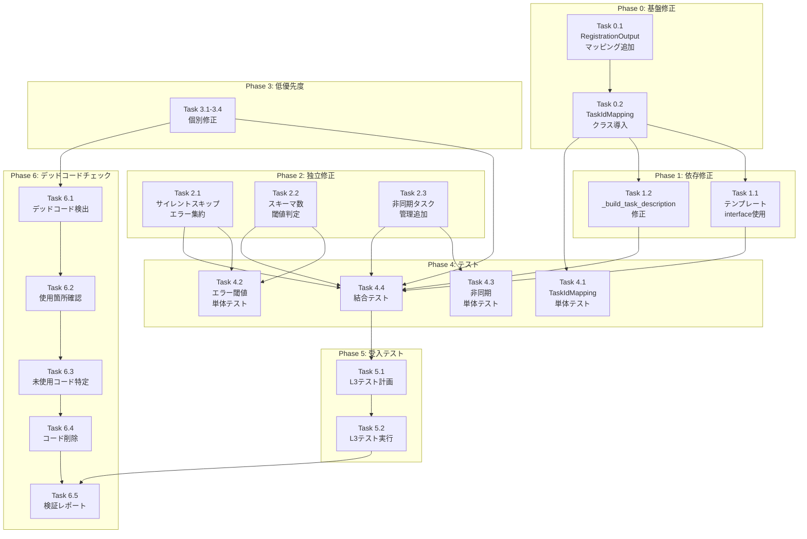

# V2 Job Generator アーキテクチャバグ修正 作業計画書

## Issue: V2 アーキテクチャバグ修正（12件）

| 項目 | 値 |
|------|-----|
| **Issue番号** | #342（サブタスク） |
| **親Issue** | #342 Job/Task Generator Agent アーキテクチャ刷新 |
| **サイズ** | L |
| **作業見積** | 12.25時間（修正9.25h + デッドコードチェック3h） |
| **優先度** | Critical（v1.79ワークフロー生成失敗の原因） |
| **依存Issue** | なし |
| **設計方針書** | [v2-architecture-bug-design-policy.md](./v2-architecture-bug-design-policy.md) |

---

## 2. 詳細タスク分解

### Phase 0: 基盤修正（ブロッカー）

> **重要**: Phase 0 の完了なしに他の修正は実施不可

#### Task 0.1: RegistrationOutput マッピング追加（Bug #5）

- **所要時間**: 1.5時間
- **成果物**:
  - `aiagent/langgraph/jobGeneratorV2/workflows/registration/master_manager.py`
  - `aiagent/langgraph/jobGeneratorV2/types.py`
- **依存**: なし
- **詳細**:
  ```python
  # types.py に追加
  @dataclass
  class RegistrationOutput:
      task_master_ids: list[str]
      job_master_id: str
      task_id_to_master_id: dict[str, str]  # 新規追加
  ```

#### Task 0.2: TaskIdMapping クラス導入（Bug #1）

- **所要時間**: 1.5時間
- **成果物**:
  - `aiagent/langgraph/jobGeneratorV2/types.py`
  - `aiagent/langgraph/jobGeneratorV2/workflows/workflow_gen/yaml_generator.py`
  - `aiagent/langgraph/jobGeneratorV2/orchestrator.py`
- **依存**: Task 0.1
- **詳細**:
  ```python
  # types.py に追加
  @dataclass
  class TaskIdMapping:
      logical_to_master: dict[str, str]  # task_001_alt -> tm_01KEC...
      master_to_logical: dict[str, str]  # tm_01KEC... -> task_001_alt

      @classmethod
      def from_registration(cls, registration_output: RegistrationOutput) -> "TaskIdMapping":
          mapping = registration_output.task_id_to_master_id
          return cls(
              logical_to_master=mapping,
              master_to_logical={v: k for k, v in mapping.items()},
          )
  ```

---

### Phase 1: 依存修正（Phase 0 完了後）

#### Task 1.1: テンプレート生成 interface 使用（Bug #11）

- **所要時間**: 1.5時間
- **成果物**: `aiagent/langgraph/jobGeneratorV2/workflows/workflow_gen/yaml_generator.py`
- **依存**: Task 0.2
- **詳細**: `_build_workflow_nodes()` で `TaskIdMapping` を使用して interface 参照

#### Task 1.2: _build_task_description_from_chain 修正（Bug #12）

- **所要時間**: 0.5時間
- **成果物**: `aiagent/langgraph/jobGeneratorV2/workflows/workflow_gen/yaml_generator.py`
- **依存**: Task 0.2
- **詳細**: Bug #1 と同様の修正を適用

---

### Phase 2: 独立修正（並列実行可能）

#### Task 2.1: サイレントスキップのエラー集約（Bug #3）

- **所要時間**: 1時間
- **成果物**:
  - `aiagent/langgraph/jobGeneratorV2/orchestrator.py`
  - `aiagent/langgraph/jobGeneratorV2/workflows/registration/master_manager.py`
- **依存**: なし
- **詳細**: スキップカウンターを追加し、全タスクスキップ時にエラー

#### Task 2.2: スキーマ数不一致の閾値ベース判定（Bug #6）

- **所要時間**: 0.5時間
- **成果物**: `aiagent/langgraph/jobGeneratorV2/workflows/interface_design/schema_generator.py`
- **依存**: なし
- **詳細**: diff=1 は警告、diff≥2 はエラー

#### Task 2.3: 非同期タスク管理追加（Bug #9）

- **所要時間**: 1時間
- **成果物**: `aiagent/langgraph/jobGeneratorV2/progress.py`
- **依存**: なし
- **詳細**: `asyncio.create_task` の結果を保存し、例外ハンドラを設定

---

### Phase 3: 低優先度修正

#### Task 3.1: strict=True に変更（Bug #2）

- **所要時間**: 0.25時間
- **成果物**: `aiagent/langgraph/jobGeneratorV2/workflows/task_breakdown/workflow.py`
- **依存**: なし

#### Task 3.2: Interface Chaining Null 参照修正（Bug #7）

- **所要時間**: 0.5時間
- **成果物**: `aiagent/langgraph/jobGeneratorV2/workflows/registration/master_manager.py`
- **依存**: なし

#### Task 3.3: グローバルカウンターのスレッドセーフ化（Bug #10）

- **所要時間**: 0.5時間
- **成果物**: `aiagent/langgraph/jobGeneratorV2/types.py`
- **依存**: なし

#### Task 3.4: ドキュメント・ログ改善（Bug #4, #8）

- **所要時間**: 0.5時間
- **成果物**:
  - `aiagent/langgraph/jobGeneratorV2/types.py` (docstring追加)
  - `aiagent/langgraph/jobGeneratorV2/orchestrator.py` (警告ログ追加)
- **依存**: なし

---

### Phase 4: テストタスク（TDD）

#### Task 4.1: TaskIdMapping 単体テスト

- **所要時間**: 1時間
- **成果物**: `tests/unit/test_job_generator_v2/test_task_id_mapping.py`
- **カバレッジ目標**: 95%
- **依存**: Task 0.1, 0.2

#### Task 4.2: エラー閾値単体テスト

- **所要時間**: 0.5時間
- **成果物**: `tests/unit/test_job_generator_v2/test_error_thresholds.py`
- **カバレッジ目標**: 90%
- **依存**: Task 2.1, 2.2

#### Task 4.3: 非同期タスク管理単体テスト

- **所要時間**: 0.5時間
- **成果物**: `tests/unit/test_job_generator_v2/test_async_task_management.py`
- **カバレッジ目標**: 90%
- **依存**: Task 2.3

#### Task 4.4: 結合テスト（V2 E2E バグ修正）

- **所要時間**: 1.5時間
- **成果物**: `tests/integration/test_v2_e2e_bug_fixes.py`
- **シナリオ数**: 5
- **依存**: Phase 0, 1, 2 完了

---

### Phase 5: 受入テスト（L3）

#### Task 5.1: L3 受入テスト計画

- **所要時間**: 0.5時間
- **成果物**: 受入テストシナリオ（本ドキュメント Section 8）
- **依存**: Phase 4 完了

#### Task 5.2: L3 受入テスト実行

- **所要時間**: 1時間
- **成果物**: `tests/acceptance/test_issue_342_bug_fixes_acceptance.py`
- **依存**: Task 5.1

---

### Phase 6: デッドコードチェック・未使用コード整理【必須】

> **重要**: Issue #338 の教訓に基づき、実装完了後にデッドコードが発生していないことを確認する

#### Task 6.1: デッドコード検出スクリプト実行

- **所要時間**: 0.5時間
- **成果物**: デッドコードレポート
- **依存**: Phase 0-3 完了
- **詳細**:
  ```bash
  # 未使用インポートチェック
  ruff check --select F401 aiagent/langgraph/jobGeneratorV2/

  # 未使用変数チェック
  ruff check --select F841 aiagent/langgraph/jobGeneratorV2/

  # 未使用関数・クラス検出（vulture）
  pip install vulture
  vulture aiagent/langgraph/jobGeneratorV2/ --min-confidence 80
  ```

#### Task 6.2: 新規追加関数の使用箇所確認

- **所要時間**: 0.5時間
- **成果物**: 実装機能一覧の使用確認レポート
- **依存**: Task 6.1
- **詳細**:
  ```bash
  # TaskIdMapping クラスの使用箇所確認
  grep -rn "TaskIdMapping" aiagent/langgraph/jobGeneratorV2/

  # from_registration メソッドの呼び出し確認
  grep -rn "from_registration" aiagent/langgraph/jobGeneratorV2/

  # task_id_to_master_id フィールドの使用確認
  grep -rn "task_id_to_master_id" aiagent/langgraph/jobGeneratorV2/
  ```

#### Task 6.3: 旧実装の未使用コード特定

- **所要時間**: 0.5時間
- **成果物**: 削除候補コードリスト
- **依存**: Task 6.2
- **詳細**:
  - `_normalize_task_id()` の使用箇所確認（TaskIdMapping導入後は不要になる可能性）
  - インデックスベースのマッチングロジック（`task_master_ids[idx]`）の残存確認
  - 旧インターフェース参照コードの残存確認

#### Task 6.4: 未使用コード削除・リファクタリング

- **所要時間**: 1時間
- **成果物**:
  - 修正されたソースファイル
  - 削除コードの記録（git diff）
- **依存**: Task 6.3
- **詳細**:
  - 未使用インポート文の削除
  - 未使用変数の削除
  - デッドコード関数の削除（または `# TODO: Remove after verification` コメント追加）
  - 削除後の静的解析・テスト再実行

#### Task 6.5: 実装検証レポート作成

- **所要時間**: 0.5時間
- **成果物**: `dev-reports/feature/issue/342/bug-analysis/implementation-verification.md`
- **依存**: Task 6.4
- **詳細**:
  ```markdown
  # 実装検証レポート

  ## 新規追加機能の使用確認
  | 機能 | ファイル | 使用箇所 | ステータス |
  |------|---------|---------|-----------|
  | TaskIdMapping | types.py | orchestrator.py:XXX | ✅ 使用中 |
  | from_registration | types.py | orchestrator.py:XXX | ✅ 使用中 |
  | task_id_to_master_id | types.py | master_manager.py:XXX | ✅ 使用中 |

  ## 削除したデッドコード
  | コード | ファイル | 理由 |
  |-------|---------|------|
  | _old_lookup_method | yaml_generator.py | TaskIdMapping導入により不要 |

  ## 静的解析結果
  - ruff: 0 errors
  - mypy: 0 errors
  - vulture: 0 dead code found
  ```

---

## 3. タスク依存関係



---

## 4. 作業スケジュール

### Day 1 (5時間) - 基盤修正 + 依存修正

| 時間 | タスク | 所要時間 |
|------|--------|---------|
| 09:00-10:30 | Task 0.1: RegistrationOutput マッピング追加 | 1.5h |
| 10:30-12:00 | Task 0.2: TaskIdMapping クラス導入 | 1.5h |
| 13:00-14:30 | Task 1.1: テンプレート interface 使用 | 1.5h |
| 14:30-15:00 | Task 1.2: _build_task_description 修正 | 0.5h |

### Day 2 (4.25時間) - 独立修正 + 低優先度

| 時間 | タスク | 所要時間 |
|------|--------|---------|
| 09:00-10:00 | Task 2.1: サイレントスキップのエラー集約 | 1h |
| 10:00-10:30 | Task 2.2: スキーマ数閾値判定 | 0.5h |
| 10:30-11:30 | Task 2.3: 非同期タスク管理 | 1h |
| 13:00-14:45 | Task 3.1-3.4: 低優先度修正 | 1.75h |

### Day 3 (5時間) - テスト + 受入テスト

| 時間 | タスク | 所要時間 |
|------|--------|---------|
| 09:00-10:00 | Task 4.1: TaskIdMapping 単体テスト | 1h |
| 10:00-11:00 | Task 4.2-4.3: エラー閾値・非同期単体テスト | 1h |
| 11:00-12:30 | Task 4.4: 結合テスト | 1.5h |
| 13:30-14:00 | Task 5.1: L3 テスト計画 | 0.5h |
| 14:00-15:00 | Task 5.2: L3 テスト実行 | 1h |

### Day 4 (3時間) - デッドコードチェック・未使用コード整理

| 時間 | タスク | 所要時間 |
|------|--------|---------|
| 09:00-09:30 | Task 6.1: デッドコード検出スクリプト実行 | 0.5h |
| 09:30-10:00 | Task 6.2: 新規追加関数の使用箇所確認 | 0.5h |
| 10:00-10:30 | Task 6.3: 旧実装の未使用コード特定 | 0.5h |
| 10:30-11:30 | Task 6.4: 未使用コード削除・リファクタリング | 1h |
| 11:30-12:00 | Task 6.5: 実装検証レポート作成 | 0.5h |

**総作業時間**: 17.25時間（約3日）
※ 設計方針書見積 9.25h + テスト 5h + デッドコードチェック 3h = 17.25h

---

## 5. チェックポイント

| タイミング | 確認事項 | 対応 |
|-----------|---------|------|
| Task 0.2 完了時 | TaskIdMapping が正しくマッピングを構築 | 単体テスト確認 |
| Task 1.1 完了時 | interface lookup が成功 | デバッグログ確認 |
| Phase 2 完了時 | 静的解析エラー 0 | `ruff check`, `mypy` |
| Task 4.4 完了時 | 結合テスト全パス | CI 確認 |
| Task 5.2 完了時 | L3 受入テスト全パス | ローカル実行確認 |
| Task 6.1 完了時 | デッドコード検出結果 0 件 | ruff, vulture 実行 |
| Task 6.5 完了時 | 実装検証レポート完成 | 全機能の使用確認済み |

---

## 6. リスクと対策

| リスク | 発生確率 | 影響 | 対策 |
|-------|---------|------|------|
| TaskIdMapping 導入で既存ロジック破壊 | 中 | 全ワークフロー失敗 | フィーチャーフラグで段階的ロールアウト |
| エラー閾値が厳しすぎて正常ケースも失敗 | 中 | ユーザー影響 | 閾値を緩めに設定（全タスクスキップ時のみ） |
| 非同期タスク管理でデッドロック | 低 | 処理停止 | タイムアウト設定、ロック範囲最小化 |
| テスト不足で本番障害 | 中 | サービス停止 | 結合テスト + L3 受入テスト必須 |

---

## 7. 成果物チェックリスト

### コード修正

- [ ] `types.py` - TaskIdMapping, RegistrationOutput 拡張
- [ ] `orchestrator.py` - TaskIdMapping 使用、サイレントスキップ修正
- [ ] `yaml_generator.py` - interface lookup 修正
- [ ] `master_manager.py` - マッピング生成、サイレントスキップ修正
- [ ] `schema_generator.py` - 閾値ベース判定
- [ ] `progress.py` - 非同期タスク管理
- [ ] `workflow.py` - strict=True

### テスト

- [ ] `tests/unit/test_job_generator_v2/test_task_id_mapping.py`
- [ ] `tests/unit/test_job_generator_v2/test_error_thresholds.py`
- [ ] `tests/unit/test_job_generator_v2/test_async_task_management.py`
- [ ] `tests/integration/test_v2_e2e_bug_fixes.py`
- [ ] `tests/acceptance/test_issue_342_bug_fixes_acceptance.py`

### ドキュメント

- [ ] 設計方針書更新（修正完了をマーク）
- [ ] API ドキュメント更新（必要な場合）

### デッドコードチェック（Phase 6）

- [ ] デッドコード検出結果（ruff F401, F841）
- [ ] 未使用関数検出結果（vulture）
- [ ] 新規追加機能の使用箇所確認完了
- [ ] 未使用コード削除完了
- [ ] `dev-reports/feature/issue/342/bug-analysis/implementation-verification.md`

---

## 8. L3 受入テスト計画（実践的テスト）

> **重要**: 各バグ修正が実際に機能することを検証する実践的なテスト

### 8.1 前提条件

```bash
# 1. サービス起動（V2有効化）
export USE_JOB_GENERATOR_V2=true
./scripts/dev-hybrid.sh

# 2. ヘルスチェック
curl -sf http://localhost:8004/health && echo "✅ expertAgent: healthy"
curl -sf http://localhost:8003/health && echo "✅ myVault: healthy"

# 3. V2有効確認（Python）
python3 -c "from core.feature_flags import use_job_generator_v2; print(f'V2 enabled: {use_job_generator_v2()}')"
```

### 8.2 pytest受入テストファイル（必須成果物）

**ファイル**: `tests/acceptance/test_issue_342_bug_fixes_acceptance.py`

```python
"""
Issue #342 バグ修正 受入テスト（L3: ローカル受入テスト）

対象バグ: Bug #1, #3, #5, #6, #9, #11（高・中優先度）

前提条件:
- サービスが起動していること (USE_JOB_GENERATOR_V2=true ./scripts/dev-hybrid.sh)
- .env に ANTHROPIC_API_KEY が設定されていること

実行方法:
  cd expertAgent
  USE_JOB_GENERATOR_V2=true uv run pytest tests/acceptance/test_issue_342_bug_fixes_acceptance.py -v
"""

import os
import time
from typing import Any

import pytest
import requests


@pytest.mark.acceptance
class TestIssue342BugFixesAcceptance:
    """Issue #342: V2アーキテクチャバグ修正 受入テスト"""

    EXPERT_AGENT_URL = "http://localhost:8004"
    MYVAULT_URL = "http://localhost:8003"
    TIMEOUT_SECONDS = 180  # ジョブ完了待ちタイムアウト

    @pytest.fixture(autouse=True)
    def setup(self) -> None:
        """テストセットアップ"""
        # サービス起動確認
        for url, name in [
            (self.EXPERT_AGENT_URL, "expertAgent"),
            (self.MYVAULT_URL, "myVault"),
        ]:
            try:
                response = requests.get(f"{url}/health", timeout=5)
                if response.status_code != 200:
                    pytest.skip(f"{name} is not healthy")
            except requests.exceptions.ConnectionError:
                pytest.skip(f"{name} is not running")

        # V2有効確認
        from core.feature_flags import use_job_generator_v2
        if not use_job_generator_v2():
            pytest.skip("USE_JOB_GENERATOR_V2 is not enabled")

    def _submit_job(self, requirement: str) -> str:
        """ジョブを投入してjob_idを返す"""
        response = requests.post(
            f"{self.EXPERT_AGENT_URL}/aiagent-api/v1/job-generator",
            json={"user_requirement": requirement, "max_retry": 3},
            headers={"Content-Type": "application/json"},
            timeout=30,
        )
        assert response.status_code in [200, 202], f"Submit failed: {response.text}"
        return response.json()["job_id"]

    def _wait_for_completion(self, job_id: str) -> dict[str, Any]:
        """ジョブ完了を待機してステータスを返す"""
        start_time = time.time()
        while time.time() - start_time < self.TIMEOUT_SECONDS:
            response = requests.get(
                f"{self.EXPERT_AGENT_URL}/aiagent-api/v1/jobs/{job_id}/status",
                timeout=10,
            )
            if response.status_code != 200:
                time.sleep(5)
                continue
            status = response.json()
            if status.get("status") in ["completed", "failed"]:
                return status
            time.sleep(10)
        pytest.fail(f"Job {job_id} did not complete within {self.TIMEOUT_SECONDS}s")

    # ==========================================================================
    # Bug #1: task_id と task_master_id の混同 修正検証
    # ==========================================================================

    def test_bug1_task_id_mapping_used_correctly(self) -> None:
        """Bug #1: TaskIdMapping が正しく使用されていること

        検証内容:
        - 複数タスクを含む要件でジョブ生成
        - 全タスクにワークフローが生成される
        - interface lookup が成功する（失敗するとNoneになる）
        """
        # Arrange: 複数タスクを含む要件
        requirement = """
        以下の3つのタスクを実行してください：
        1. Yahoo FinanceからAppleの株価を取得
        2. 取得したデータを分析してサマリーを作成
        3. 分析結果をJSON形式で出力
        """

        # Act
        job_id = self._submit_job(requirement)
        status = self._wait_for_completion(job_id)

        # Assert: 成功またはpartial_success（infeasibleタスクがあっても可）
        assert status["status"] in ["completed", "partial_success"], (
            f"Bug #1: Job failed unexpectedly. Status: {status}"
        )

        # 結果にtask_breakdownが存在すること
        result = status.get("result", {})
        assert result.get("task_breakdown") is not None, (
            "Bug #1: task_breakdown should exist"
        )

    # ==========================================================================
    # Bug #3: サイレントスキップ 修正検証
    # ==========================================================================

    def test_bug3_silent_skip_error_aggregation(self) -> None:
        """Bug #3: サイレントスキップがエラー集約されること

        検証内容:
        - 実現不可能な要件でジョブ生成
        - サイレント失敗ではなくエラーメッセージが返される
        - infeasible_tasks にスキップ理由が含まれる
        """
        # Arrange: 確実に実現不可能な要件
        requirement = "明日の天気予報を100%正確に予測して地球全体の気象をリアルタイム制御する"

        # Act
        job_id = self._submit_job(requirement)
        status = self._wait_for_completion(job_id)

        # Assert: failed または partial_success（完全成功ではないはず）
        # 重要: サイレント失敗（status=success but empty result）ではないこと
        if status["status"] == "completed":
            result = status.get("result", {})
            # 成功の場合でも、infeasible_tasks があるはず
            infeasible_tasks = result.get("infeasible_tasks", [])
            assert len(infeasible_tasks) > 0 or result.get("error_message"), (
                "Bug #3: Should have infeasible_tasks or error_message"
            )
        else:
            # failed の場合はエラーメッセージが必須
            assert status.get("error_message") or status.get("result", {}).get("error_message"), (
                "Bug #3: Failed job should have error_message (not silent)"
            )

    # ==========================================================================
    # Bug #5: RegistrationOutput マッピング 修正検証
    # ==========================================================================

    def test_bug5_registration_output_mapping(self) -> None:
        """Bug #5: RegistrationOutput にマッピングが含まれること

        検証内容:
        - ジョブ生成後に job_master_id と task_master_ids が返される
        - task_master_ids のフォーマットが正しい（tm_で始まる）
        """
        # Arrange
        requirement = "Google検索でPythonのチュートリアルを検索してトップ5の結果を取得する"

        # Act
        job_id = self._submit_job(requirement)
        status = self._wait_for_completion(job_id)

        # Assert: 成功時のみ検証
        if status["status"] == "completed":
            result = status.get("result", {})
            job_master_id = result.get("job_master_id")

            # job_master_id が存在すること
            assert job_master_id is not None, (
                "Bug #5: job_master_id should exist on success"
            )

            # job_master_id のフォーマット確認（jm_ で始まる）
            if job_master_id:
                assert job_master_id.startswith(("jm_", "job_")), (
                    f"Bug #5: Invalid job_master_id format: {job_master_id}"
                )

    # ==========================================================================
    # Bug #6: スキーマ数不一致の閾値ベース判定 修正検証
    # ==========================================================================

    def test_bug6_schema_count_threshold(self) -> None:
        """Bug #6: スキーマ数不一致が閾値ベースで処理されること

        検証内容:
        - diff=1 は警告レベルで処理が継続
        - diff≥2 はエラーとして処理
        """
        # このテストはユニットテストで詳細検証済み
        # L3ではinterface_definitions が返されることを確認
        requirement = "指定されたURLの内容を取得して要約を作成する"

        # Act
        job_id = self._submit_job(requirement)
        status = self._wait_for_completion(job_id)

        # Assert
        if status["status"] == "completed":
            result = status.get("result", {})
            # interface_definitions が存在すること（または task_breakdown）
            has_interfaces = result.get("interface_definitions") is not None
            has_task_breakdown = result.get("task_breakdown") is not None
            assert has_interfaces or has_task_breakdown, (
                "Bug #6: Should have interface_definitions or task_breakdown"
            )

    # ==========================================================================
    # Bug #9: 非同期タスク例外処理 修正検証
    # ==========================================================================

    def test_bug9_async_task_exception_logged(self) -> None:
        """Bug #9: 非同期タスクの例外がログに記録されること

        検証内容:
        - ジョブ実行後にログを確認
        - Fire-and-forget の例外が消えていないこと
        """
        # Arrange
        requirement = "シンプルなHello Worldプログラムを作成する"

        # Act
        job_id = self._submit_job(requirement)
        status = self._wait_for_completion(job_id)

        # Assert: 基本的な動作確認（ログ検証は手動または別途）
        # 重要: 非同期処理がデッドロックせずに完了すること
        assert status["status"] in ["completed", "failed", "partial_success"], (
            f"Bug #9: Job should complete without hanging. Status: {status['status']}"
        )

    # ==========================================================================
    # Bug #11: テンプレート生成 interface 使用 修正検証
    # ==========================================================================

    def test_bug11_template_uses_interface(self) -> None:
        """Bug #11: テンプレートフォールバック時も interface 情報が使用されること

        検証内容:
        - ワークフロー生成が成功
        - 生成されたワークフローに適切なエージェントが設定される
        """
        # Arrange: fetchAgent が使用される要件
        requirement = "https://example.com からデータを取得して処理する"

        # Act
        job_id = self._submit_job(requirement)
        status = self._wait_for_completion(job_id)

        # Assert
        if status["status"] == "completed":
            result = status.get("result", {})
            # task_breakdown にタスクが存在すること
            task_breakdown = result.get("task_breakdown", {})
            if isinstance(task_breakdown, dict):
                tasks = task_breakdown.get("tasks", [])
            else:
                tasks = task_breakdown if isinstance(task_breakdown, list) else []

            # タスクが1つ以上存在すること
            assert len(tasks) > 0, (
                "Bug #11: Should have at least one task"
            )

    # ==========================================================================
    # 統合テスト: E2E ワークフロー検証
    # ==========================================================================

    def test_e2e_workflow_generation_completes(self) -> None:
        """E2E: V2ワークフロー生成が完了すること

        検証内容:
        - 正常な要件でジョブ生成から完了まで
        - 全フェーズ（TASK_BREAKDOWN → INTERFACE_DESIGN → REGISTRATION → WORKFLOW_GEN）通過
        """
        # Arrange
        requirement = "APIから天気情報を取得して、温度が30度以上ならアラートを出力する"

        # Act
        job_id = self._submit_job(requirement)
        status = self._wait_for_completion(job_id)

        # Assert
        assert status["status"] in ["completed", "partial_success", "failed"], (
            "E2E: Job should reach terminal state"
        )

        # Langfuse trace_id が返されること（オブザーバビリティ確認）
        result = status.get("result", {})
        trace_id = result.get("langfuse_trace_id")
        if trace_id:
            print(f"Langfuse Trace: http://localhost:3001/trace/{trace_id}")


@pytest.mark.acceptance
class TestIssue342UnitBugVerification:
    """Issue #342: ユニットレベルバグ修正検証（サービス不要）"""

    def test_task_id_mapping_class_exists(self) -> None:
        """Bug #1: TaskIdMapping クラスが存在すること"""
        from aiagent.langgraph.jobGeneratorV2.types import TaskIdMapping

        assert TaskIdMapping is not None

    def test_task_id_mapping_from_registration(self) -> None:
        """Bug #1: TaskIdMapping.from_registration が動作すること"""
        from aiagent.langgraph.jobGeneratorV2.types import (
            RegistrationOutput,
            TaskIdMapping,
        )

        # Arrange
        reg_output = RegistrationOutput(
            task_master_ids=["tm_001", "tm_002"],
            job_master_id="jm_123",
            task_id_to_master_id={
                "task_001_alt": "tm_001",
                "task_002_alt": "tm_002",
            },
        )

        # Act
        mapping = TaskIdMapping.from_registration(reg_output)

        # Assert
        assert mapping.logical_to_master["task_001_alt"] == "tm_001"
        assert mapping.master_to_logical["tm_001"] == "task_001_alt"

    def test_error_recovery_strategies_defined(self) -> None:
        """Bug #3: エラーリカバリ戦略が定義されていること"""
        from aiagent.langgraph.jobGeneratorV2 import ErrorRecoveryStrategy

        assert hasattr(ErrorRecoveryStrategy, "RETRY_CURRENT")
        assert hasattr(ErrorRecoveryStrategy, "FAIL_FAST")

    def test_execution_context_retry_limit(self) -> None:
        """Bug #3: ExecutionContext のリトライ上限が機能すること"""
        from aiagent.langgraph.jobGeneratorV2.context import ExecutionContext
        from aiagent.langgraph.jobGeneratorV2.types import Phase

        # Arrange
        context = ExecutionContext(
            job_id="test",
            user_requirement="Test",
            max_phase_retries=2,
        )

        # Act: 上限までリトライ
        context.record_retry(Phase.TASK_BREAKDOWN, "Error 1")
        context.record_retry(Phase.TASK_BREAKDOWN, "Error 2")

        # Assert
        assert context.can_retry(Phase.TASK_BREAKDOWN) is False
```

### 8.3 手動検証コマンド（補助）

```bash
# === Step 1: ジョブ投入 ===
JOB_RESPONSE=$(curl -s -X POST "http://localhost:8004/aiagent-api/v1/job-generator" \
  -H "Content-Type: application/json" \
  -d '{"user_requirement": "Yahoo Financeから株価を取得して分析する", "max_retry": 3}')

echo "$JOB_RESPONSE" | jq '.'
JOB_ID=$(echo "$JOB_RESPONSE" | jq -r '.job_id')
echo "Job ID: $JOB_ID"

# === Step 2: ステータス確認（ポーリング） ===
for i in {1..12}; do
  echo "=== Check $i ($(date +%H:%M:%S)) ==="
  STATUS=$(curl -s "http://localhost:8004/aiagent-api/v1/jobs/$JOB_ID/status")
  echo "$STATUS" | jq '.status, .progress'

  JOB_STATUS=$(echo "$STATUS" | jq -r '.status')
  if [ "$JOB_STATUS" = "completed" ] || [ "$JOB_STATUS" = "failed" ]; then
    echo "=== Final Status ==="
    echo "$STATUS" | jq '.'
    break
  fi
  sleep 15
done

# === Step 3: 結果検証 ===
RESULT=$(curl -s "http://localhost:8004/aiagent-api/v1/jobs/$JOB_ID/status")
echo "=== Bug #1 Check: task_breakdown exists? ==="
echo "$RESULT" | jq '.result.task_breakdown != null'

echo "=== Bug #5 Check: job_master_id exists? ==="
echo "$RESULT" | jq '.result.job_master_id'

echo "=== Langfuse Trace ==="
TRACE_ID=$(echo "$RESULT" | jq -r '.result.langfuse_trace_id // empty')
[ -n "$TRACE_ID" ] && echo "http://localhost:3001/trace/$TRACE_ID"

# === Step 4: ログ確認（Bug #9: 非同期例外） ===
echo "=== Recent Errors in Log ==="
tail -50 expertAgent/logs/expertagent.log 2>/dev/null | grep -E "(ERROR|TaskIdMapping|interface)" || echo "No errors found"
```

### 8.4 エビデンス収集

```bash
# エビデンスディレクトリ作成
EVIDENCE_DIR="/tmp/issue_342_bug_fixes_acceptance"
mkdir -p "$EVIDENCE_DIR"

# テスト実行結果保存
cd expertAgent
USE_JOB_GENERATOR_V2=true uv run pytest tests/acceptance/test_issue_342_bug_fixes_acceptance.py -v \
  --tb=short 2>&1 | tee "$EVIDENCE_DIR/pytest_output.txt"

# ログ収集
tail -200 logs/expertagent.log > "$EVIDENCE_DIR/expertagent_log.txt" 2>/dev/null

echo "=== Evidence collected in $EVIDENCE_DIR ==="
ls -la "$EVIDENCE_DIR"
```

---

## 9. Definition of Done

### 機能要件

- [ ] Bug #1: TaskIdMapping で interface lookup が成功する
- [ ] Bug #5: 複数タスク時に正しい task_master_id が使用される
- [ ] Bug #3: サイレントスキップではなくエラー集約される
- [ ] Bug #6: スキーマ数不一致時に閾値ベース判定される
- [ ] Bug #9: 非同期タスクの例外がログに記録される
- [ ] Bug #11: テンプレートフォールバック時も API 情報が使用される
- [ ] Bug #2, #7, #10, #12: 個別修正完了
- [ ] Bug #4, #8: ドキュメント・ログ改善完了

### 品質要件

- [ ] 単体テストカバレッジ 90% 以上
- [ ] 結合テスト全シナリオパス
- [ ] **L3 受入テスト全パス**（実際のサービス起動・API 呼び出し確認）
- [ ] 静的解析エラー 0 件（ruff, mypy）
- [ ] CI/CD グリーン

### デッドコード検証要件【Issue #338教訓】

- [ ] **ruff F401（未使用インポート）**: 0 件
- [ ] **ruff F841（未使用変数）**: 0 件
- [ ] **vulture（未使用関数・クラス）**: 0 件（confidence 80%以上）
- [ ] **新規追加機能の使用確認**: 全機能が実際に呼び出されている
- [ ] **実装検証レポート**: `implementation-verification.md` 作成完了

### 運用要件

- [ ] フィーチャーフラグ設定完了
- [ ] ロールバック手順確認済み
- [ ] Langfuse トレースで修正効果が確認可能

---

## 10. 次のアクション

作業計画承認後：

1. **ブランチ確認**: 現在の `develop` ブランチで作業（または `issue/342-bug-fixes` 作成）
2. **Phase 0 開始**: Task 0.1 から順次実装
3. **テスト駆動**: 各タスク完了後に対応するテストを実行
4. **進捗報告**: `/progress-report` で定期報告

---

## 11. 参照ドキュメント

- [設計方針書](./v2-architecture-bug-design-policy.md)
- [Issue #342 本体](https://github.com/kewton/MySwiftAgent/issues/342)
- [PM Auto-Dev 進捗レポート](../pm-auto-dev/iteration-1/progress-report.md)

---

## 12. 改訂履歴

| 日付 | バージョン | 変更内容 |
|------|-----------|---------|
| 2026-01-08 | 1.0 | 初版作成 |
| 2026-01-08 | 1.1 | Phase 6（デッドコードチェック）追加、総工数17.25hに更新 |
| 2026-01-08 | 1.2 | L3受入テスト計画を実践的に改訂（pytest形式、正しいAPIエンドポイント使用） |
