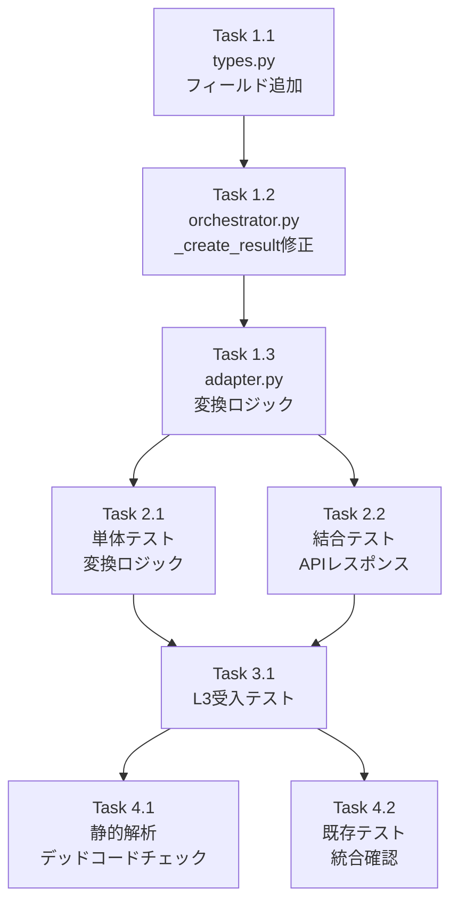

# 作業計画書: V2 Adapter task_breakdown 対応

## Issue概要

```markdown
## Issue: V2 Adapter task_breakdown対応
**Issue番号**: #342 Phase F（追加タスク）
**サイズ**: S
**作業見積**: 4.5時間
**優先度**: High
**依存Issue**: #342 Phase F（完了済み）
**設計書**: dev-reports/feature/issue/342/v2-adapter-task-breakdown-design.md
```

### 背景
Job Generator V2でジョブ生成は成功するが、フロントエンド（myAgentDesk）でタスクが「0 tasks」と表示される問題。
`adapter.py`の`_convert_result()`が`task_breakdown=None`を返すため。

### ゴール
V2で生成されたジョブのタスク情報がフロントエンドで表示されるようにする。

---

## デッドコード防止方針（Issue #338教訓）

### 原則
1. **新規コードは必ず統合確認**: 追加した関数/メソッドが実際に呼び出されていることを検証
2. **統合テストで使用確認**: 単体テストだけでなく、実際のワークフローで動作確認
3. **未使用コードの即時削除**: 不要になったコードは残さない

### チェックポイント
| タイミング | 確認内容 |
|-----------|---------|
| Task 1.3完了時 | `_convert_tasks_to_breakdown()`, `_convert_interfaces()`が`_convert_result()`から呼ばれていることを確認 |
| Phase 2完了時 | 新規メソッドがテストでカバーされていることを確認 |
| Phase 4完了時 | 静的解析で未使用コード警告がないことを確認 |

---

## 詳細タスク分解

### 実装タスク（Phase 1）

- [ ] **Task 1.1**: types.py - JobGenerationResult拡張
  - 所要時間: 0.5時間
  - 成果物: `expertAgent/aiagent/langgraph/jobGeneratorV2/types.py`
  - 依存: なし
  - 内容: `tasks`と`interfaces`フィールドを追加
  - **デッドコード確認**: フィールドが`orchestrator.py`で設定されることを確認

- [ ] **Task 1.2**: orchestrator.py - _create_result()修正
  - 所要時間: 0.5時間
  - 成果物: `expertAgent/aiagent/langgraph/jobGeneratorV2/orchestrator.py`
  - 依存: Task 1.1
  - 内容: `phase_outputs`からタスク情報を含める
  - **デッドコード確認**: 追加したフィールド設定が実行パスに含まれることを確認

- [ ] **Task 1.3**: adapter.py - 変換ロジック追加
  - 所要時間: 1.0時間
  - 成果物: `expertAgent/aiagent/langgraph/jobGeneratorV2/adapter.py`
  - 依存: Task 1.2
  - 内容:
    - `_convert_tasks_to_breakdown()`メソッド追加
    - `_convert_interfaces()`メソッド追加
    - `_convert_result()`修正
  - **デッドコード確認**:
    ```bash
    # 新規メソッドが_convert_result()から呼ばれていることを確認
    grep -n "_convert_tasks_to_breakdown\|_convert_interfaces" adapter.py
    ```

### テストタスク（Phase 2: TDD - CI実行可能）

- [ ] **Task 2.1**: 単体テスト - 変換ロジック
  - 所要時間: 0.5時間
  - 成果物: `expertAgent/tests/unit/test_job_generator_v2/test_adapter_conversion.py`
  - カバレッジ目標: 95%
  - 内容:
    - `_convert_tasks_to_breakdown()`のテスト
    - `_convert_interfaces()`のテスト
    - 空リスト/空dictのエッジケース
  - **デッドコード確認**: テストが新規メソッドを直接呼び出していることを確認

- [ ] **Task 2.2**: 結合テスト - V2 APIレスポンス検証
  - 所要時間: 0.5時間
  - 成果物: `expertAgent/tests/integration/test_issue_342_v2_response.py`
  - 内容: V2 APIレスポンスに`task_breakdown`が含まれることを確認
  - **デッドコード確認**: 結合テストで実際のAPIフローを通じて新規コードが実行されることを確認

### 受入テストタスク（Phase 3: L3ローカル受入テスト）

- [ ] **Task 3.1**: L3受入テスト実行
  - 所要時間: 0.5時間
  - 成果物: `expertAgent/tests/acceptance/test_issue_342_v2_task_breakdown_acceptance.py`
  - 内容:
    - V2 APIでジョブ生成
    - レスポンスにtask_breakdownが含まれることを確認
    - フロントエンドでタスク表示を確認

### 検証タスク（Phase 4）

- [ ] **Task 4.1**: 静的解析・デッドコードチェック
  - 所要時間: 0.5時間
  - 内容:
    - `ruff check`でエラーがないことを確認
    - `mypy`で型エラーがないことを確認
    - **デッドコードチェック**: 未使用関数/変数の警告がないことを確認
    ```bash
    # Ruff unused import/variable check
    ruff check --select F401,F841 expertAgent/aiagent/langgraph/jobGeneratorV2/

    # 新規メソッドの呼び出し確認
    grep -rn "_convert_tasks_to_breakdown\|_convert_interfaces" expertAgent/
    ```

- [ ] **Task 4.2**: 既存テスト実行・統合確認
  - 所要時間: 0.5時間
  - 内容:
    - 既存のV2テストが全てパスすることを確認
    - **統合確認**: 新規コードが既存テストのフローで実行されることを確認
    ```bash
    # V2テスト実行
    cd expertAgent && python -m pytest tests/unit/test_job_generator_v2/ -v

    # カバレッジレポートで新規メソッドがカバーされていることを確認
    python -m pytest tests/unit/test_job_generator_v2/ --cov=aiagent.langgraph.jobGeneratorV2 --cov-report=term-missing
    ```

---

## タスク依存関係



---

## 作業スケジュール

### 作業時間配分（合計4.5時間）

| フェーズ | タスク | 所要時間 |
|---------|--------|----------|
| Phase 1 | 実装 | 2.0時間 |
| Phase 2 | テスト | 1.0時間 |
| Phase 3 | 受入テスト | 0.5時間 |
| Phase 4 | 検証・デッドコードチェック | 1.0時間 |

### 詳細スケジュール

**Session 1 (2時間)**
- 00:00-00:30: Task 1.1（types.py）
- 00:30-01:00: Task 1.2（orchestrator.py）
- 01:00-02:00: Task 1.3（adapter.py）

**Session 2 (2.5時間)**
- 00:00-00:30: Task 2.1（単体テスト）
- 00:30-01:00: Task 2.2（結合テスト）
- 01:00-01:30: Task 3.1（L3受入テスト）
- 01:30-02:30: Task 4.1, 4.2（静的解析・デッドコードチェック・統合確認）

---

## チェックポイント

| タイミング | 確認事項 | 対応 |
|-----------|---------|------|
| Task 1.1完了時 | types.pyがインポートエラーなし | Python実行確認 |
| Task 1.3完了時 | 新規メソッドが`_convert_result()`から呼ばれている | grep確認 |
| Phase 2完了時 | テストカバレッジ95%以上 & 新規メソッドがカバー | カバレッジレポート |
| Phase 3完了時 | フロントエンドでタスク表示 | ブラウザ確認 |
| Phase 4完了時 | デッドコード警告なし | ruff/静的解析 |

---

## リスクと対策

| リスク | 発生確率 | 影響 | 対策 |
|-------|---------|------|------|
| phase_outputsの不整合 | 低 | 実装遅延1時間 | フォールバック処理追加 |
| V1との挙動差異 | 中 | バグ報告 | V1/V2両方でテスト |
| 既存テストの破損 | 低 | 修正に1時間 | 変更前にテスト実行 |
| **デッドコード混入** | 中 | 技術的負債 | Phase 4で必ず検証 |

---

## 成果物チェックリスト

### コード
- [ ] `expertAgent/aiagent/langgraph/jobGeneratorV2/types.py`（修正）
- [ ] `expertAgent/aiagent/langgraph/jobGeneratorV2/orchestrator.py`（修正）
- [ ] `expertAgent/aiagent/langgraph/jobGeneratorV2/adapter.py`（修正）

### テスト
- [ ] `expertAgent/tests/unit/test_job_generator_v2/test_adapter_conversion.py`（新規）
- [ ] `expertAgent/tests/integration/test_issue_342_v2_response.py`（新規）
- [ ] `expertAgent/tests/acceptance/test_issue_342_v2_task_breakdown_acceptance.py`（新規）

### デッドコード確認
- [ ] 新規メソッド `_convert_tasks_to_breakdown()` が呼び出されている
- [ ] 新規メソッド `_convert_interfaces()` が呼び出されている
- [ ] 新規フィールド `tasks`, `interfaces` が設定・参照されている
- [ ] ruff未使用警告なし
- [ ] テストカバレッジで新規コードがカバーされている

---

## L3受入テスト計画（具体的なコマンド）

### Step 1: サービス起動確認

```bash
# サービス起動（dev-hybrid推奨）
./scripts/dev-hybrid.sh

# ヘルスチェック
curl -sf http://localhost:8004/health && echo "✅ expertAgent: healthy"
curl -sf http://localhost:8003/health && echo "✅ myVault: healthy"
curl -sf http://localhost:8001/health && echo "✅ jobqueue: healthy"
```

### Step 2: V2 Job Generator API呼び出し

```bash
# V2でジョブ生成（USE_JOB_GENERATOR_V2=true が設定されている前提）
# 正しいエンドポイント: POST /v1/job-generator
JOB_RESPONSE=$(curl -s -X POST http://localhost:8004/v1/job-generator \
  -H "Content-Type: application/json" \
  -d '{
    "user_requirement": "Googleで最新のAIニュースを検索し、サマリをメールで送信",
    "max_retry": 3
  }')

echo "Job Response:"
echo "$JOB_RESPONSE" | jq .

# job_idを抽出
JOB_ID=$(echo "$JOB_RESPONSE" | jq -r '.job_id')
echo "Job ID: $JOB_ID"
```

### Step 3: ジョブステータス確認（task_breakdown検証）

```bash
# ステータス確認（ポーリング）
for i in 1 2 3 4 5; do
  echo "=== Check $i ==="
  STATUS_RESPONSE=$(curl -s "http://localhost:8004/v1/jobs/${JOB_ID}/status")

  # task_breakdownの存在確認
  TASK_BREAKDOWN=$(echo "$STATUS_RESPONSE" | jq '.result.task_breakdown')
  TASK_COUNT=$(echo "$STATUS_RESPONSE" | jq '.result.task_breakdown | length')

  echo "Task Breakdown: $TASK_BREAKDOWN"
  echo "Task Count: $TASK_COUNT"

  # 成功判定
  STATUS=$(echo "$STATUS_RESPONSE" | jq -r '.status')
  if [ "$STATUS" = "completed" ]; then
    echo "✅ Job completed"
    break
  fi

  sleep 10
done

# 期待するレスポンス:
# - task_breakdown: null ではなく、配列が返される
# - task_count: 1以上
```

### Step 4: task_breakdown内容の検証

```bash
# task_breakdownの詳細確認
echo "=== Task Breakdown Details ==="
curl -s "http://localhost:8004/v1/jobs/${JOB_ID}/status" | jq '.result.task_breakdown[] | {task_id, name, description}'

# 期待する出力例:
# {
#   "task_id": "task_001",
#   "name": "Google検索実行",
#   "description": "..."
# }

# interface_definitionsの確認
echo "=== Interface Definitions ==="
curl -s "http://localhost:8004/v1/jobs/${JOB_ID}/status" | jq '.result.interface_definitions | keys'
```

### Step 5: フロントエンド確認

```bash
# フロントエンドURLを表示
echo "Frontend URL: http://localhost:8000/projects/default/workbenches/default/generate"
echo "Please verify:"
echo "1. Recent Job Versions にジョブが表示される"
echo "2. タスク数が '0 tasks' ではなく '3 tasks' 等と表示される"
echo "3. タスク詳細が展開可能"
```

### Step 6: デッドコード最終確認

```bash
# 新規メソッドの呼び出し確認
echo "=== Dead Code Check ==="
echo "Checking _convert_tasks_to_breakdown calls:"
grep -rn "_convert_tasks_to_breakdown" expertAgent/aiagent/langgraph/jobGeneratorV2/

echo "Checking _convert_interfaces calls:"
grep -rn "_convert_interfaces" expertAgent/aiagent/langgraph/jobGeneratorV2/

# Ruff未使用チェック
echo "=== Ruff Unused Check ==="
ruff check --select F401,F841 expertAgent/aiagent/langgraph/jobGeneratorV2/
```

### Step 7: エビデンス収集

```bash
# レスポンスをファイルに保存
curl -s "http://localhost:8004/v1/jobs/${JOB_ID}/status" > /tmp/v2_task_breakdown_evidence.json

# 結果サマリ
echo "=== Evidence Summary ==="
echo "Job ID: $JOB_ID"
echo "Task Count: $(cat /tmp/v2_task_breakdown_evidence.json | jq '.result.task_breakdown | length')"
echo "Interface Count: $(cat /tmp/v2_task_breakdown_evidence.json | jq '.result.interface_definitions | keys | length')"
echo "Status: $(cat /tmp/v2_task_breakdown_evidence.json | jq -r '.status')"
echo "Dead Code Check: PASSED (if no warnings above)"
```

---

## Definition of Done

Issue完了条件：
- [ ] すべてのタスクが完了
- [ ] 単体テストカバレッジ95%以上
- [ ] 結合テスト全シナリオパス
- [ ] **L3受入テスト全パス**
  - [ ] V2 APIレスポンスに`task_breakdown`が含まれる
  - [ ] `task_breakdown`が空配列ではない（タスクが含まれる）
  - [ ] フロントエンドでタスクが表示される
- [ ] CI/CDグリーン（`./scripts/pre-push-check-all.sh`）
- [ ] 静的解析エラーなし（ruff, mypy）
- [ ] 既存テストに影響なし
- [ ] **デッドコードチェック完了**
  - [ ] 新規メソッドが実際に呼び出されている
  - [ ] 未使用コード警告なし
  - [ ] テストカバレッジで新規コードがカバー

---

## 次のアクション

作業計画承認後：
1. **実装開始**: Task 1.1から順次実装
2. **TDD**: テストを先に書いてから実装
3. **デッドコード確認**: 各Task完了時に呼び出し確認
4. **受入テスト**: L3テストで最終確認
5. **コミット**: 変更をコミット（PR作成は別途指示）

---

## 参照ドキュメント

- 設計書: `dev-reports/feature/issue/342/v2-adapter-task-breakdown-design.md`
- V2アーキテクチャ: `dev-reports/feature/issue/342/architecture-design.md`
- Phase F作業計画: `dev-reports/feature/issue/342/phase-f-work-plan.md`
- **デッドコード防止**: `CLAUDE.md` Section「サブエージェント利用時の必須検証ルール」

---

## 変更履歴

| 日付 | 変更内容 | 担当 |
|------|---------|------|
| 2026-01-07 | 初版作成 | Claude Code |
| 2026-01-07 | レビュー指摘修正: APIエンドポイント、テストファイル名、デッドコードチェック追加 | Claude Code |

### レビュー指摘修正内容
1. **APIエンドポイント**: `/v1/job_generator/create` → `/v1/job-generator` に修正
2. **テストファイル名**: `_acceptance`サフィックス追加、Issue番号含める
3. **デッドコードチェック**: Phase 4に専用タスク追加、各タスクに確認項目追加
4. **時間見積もり**: 4時間 → 4.5時間に修正（デッドコードチェック工数追加）
