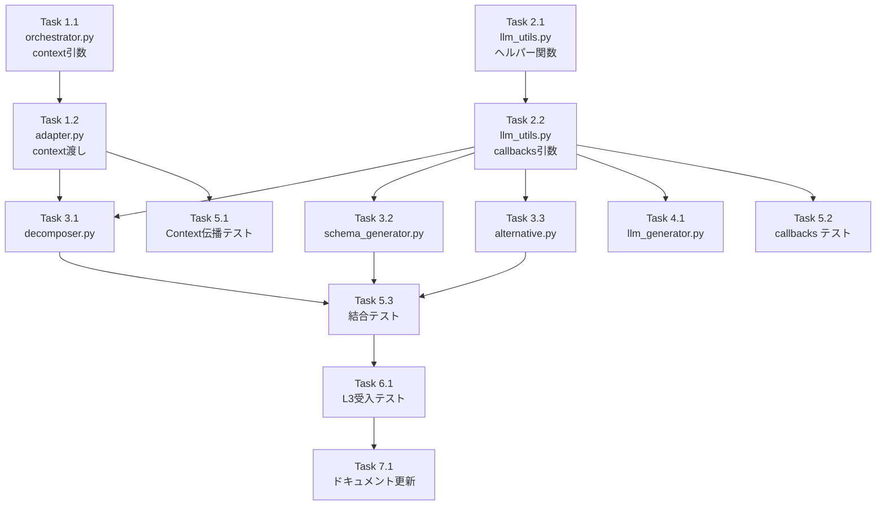

# 作業計画書: Issue #342 V2 Langfuse統合

**作成日**: 2026-01-07
**設計書**: [v2-langfuse-integration-design.md](./v2-langfuse-integration-design.md)
**ステータス**: レビュー完了・承認待ち

---

## Issue概要

```markdown
## Issue: V2 Job Generator Langfuse統合
**Issue番号**: #342（サブタスク: V2-Langfuse）
**サイズ**: M
**作業見積**: 7.5時間
**優先度**: High
**依存Issue**: なし（V2 UX修正完了済み）
```

---

## 1. 詳細タスク分解

### 実装タスク（Phase 1: P0 - Context伝播修正）

- [ ] **Task 1.1**: orchestrator.py - context引数追加
  - 所要時間: 0.5時間
  - 成果物: `aiagent/langgraph/jobGeneratorV2/orchestrator.py`
  - 依存: なし
  - 変更内容:
    - `run_workflow()`にcontext引数追加
    - 渡されたcontextを使用、なければデフォルト作成

- [ ] **Task 1.2**: adapter.py - contextをorchestratorに渡す
  - 所要時間: 0.5時間
  - 成果物: `aiagent/langgraph/jobGeneratorV2/adapter.py`
  - 依存: Task 1.1
  - 変更内容:
    - `_ = self._create_context_builder(...).build()` を修正
    - `context = ...` として `run_workflow(request, context=context)` に渡す

### 実装タスク（Phase 2: P1 - llm_utils拡張）

- [ ] **Task 2.1**: llm_utils.py - ヘルパー関数追加
  - 所要時間: 0.5時間
  - 成果物: `aiagent/langgraph/jobGeneratorV2/llm_utils.py`
  - 依存: なし
  - 変更内容:
    - `get_callbacks_from_context()` 関数追加

- [ ] **Task 2.2**: llm_utils.py - callbacks引数追加
  - 所要時間: 0.5時間
  - 成果物: `aiagent/langgraph/jobGeneratorV2/llm_utils.py`
  - 依存: Task 2.1
  - 変更内容:
    - `invoke_structured_llm()` にcallbacks引数追加
    - ainvoke時にconfig={"callbacks": ...}を渡す

### 実装タスク（Phase 3: P2 - Workflow修正）

- [ ] **Task 3.1**: decomposer.py - callbacks対応
  - 所要時間: 0.5時間
  - 成果物: `workflows/task_breakdown/decomposer.py`
  - 依存: Task 2.2
  - 変更内容:
    - `get_callbacks_from_context(context)` 呼び出し
    - `invoke_structured_llm(..., callbacks=callbacks)` に渡す

- [ ] **Task 3.2**: schema_generator.py - callbacks対応
  - 所要時間: 0.5時間
  - 成果物: `workflows/interface_design/schema_generator.py`
  - 依存: Task 2.2
  - 変更内容: Task 3.1と同様

- [ ] **Task 3.3**: alternative.py - callbacks対応
  - 所要時間: 0.5時間
  - 成果物: `workflows/task_breakdown/alternative.py`
  - 依存: Task 2.2
  - 変更内容: Task 3.1と同様

### 実装タスク（Phase 4: P3 - WorkflowGen修正）

- [ ] **Task 4.1**: llm_generator.py - callbacks対応
  - 所要時間: 0.5時間
  - 成果物: `workflows/workflow_gen/llm_generator.py`
  - 依存: Task 2.2
  - 変更内容: Task 3.1と同様（存在する場合）

---

### テストタスク（Phase 5: TDD - CI実行可能）

- [ ] **Task 5.1**: Context伝播テスト
  - 所要時間: 1時間
  - 成果物: `tests/unit/test_job_generator_v2/test_context_propagation.py`
  - カバレッジ目標: 95%
  - テスト内容:
    - `test_adapter_passes_context_to_orchestrator`
    - `test_orchestrator_uses_provided_context`
    - `test_workflow_receives_context_with_tracer`

- [ ] **Task 5.2**: llm_utils callbacks テスト
  - 所要時間: 0.5時間
  - 成果物: `tests/unit/test_job_generator_v2/test_llm_utils_callbacks.py`
  - カバレッジ目標: 90%
  - テスト内容:
    - `test_get_callbacks_from_context_with_tracer`
    - `test_get_callbacks_from_context_without_tracer`
    - `test_invoke_structured_llm_with_callbacks`

- [ ] **Task 5.3**: 結合テスト
  - 所要時間: 1時間
  - 成果物: `tests/integration/test_v2_langfuse_integration.py`
  - シナリオ数: 2
  - テスト内容:
    - `test_v2_job_generation_creates_langfuse_trace`
    - `test_end_to_end_context_flow`

---

### 受入テストタスク（Phase 6: L3ローカル受入テスト）【必須】

- [ ] **Task 6.1**: L3受入テスト実行
  - 所要時間: 1時間
  - 成果物: `tests/acceptance/test_issue_342_langfuse_acceptance.py`
  - 必須内容:
    - V2 Job Generation実行
    - Langfuseトレースの確認
    - Main Traceリンクの動作確認
    - UIでの表示確認

---

### ドキュメントタスク（Phase 7）

- [ ] **Task 7.1**: 設計書ステータス更新
  - 所要時間: 0.25時間
  - 成果物: `dev-reports/feature/issue/342/v2-langfuse-integration-design.md`
  - 変更内容: ステータスを「実装完了」に更新

---

## 2. タスク依存関係



---

## 3. 作業スケジュール

### セッション計画（7.5時間）

**セッション 1 (3時間) - 実装**
- Task 1.1: orchestrator.py context引数追加（0.5h）
- Task 1.2: adapter.py context渡し（0.5h）
- Task 2.1: ヘルパー関数追加（0.5h）
- Task 2.2: callbacks引数追加（0.5h）
- Task 3.1: decomposer.py修正（0.5h）
- Task 3.2: schema_generator.py修正（0.5h）

**セッション 2 (2時間) - 実装続き + テスト**
- Task 3.3: alternative.py修正（0.5h）
- Task 4.1: llm_generator.py修正（0.5h）
- Task 5.1: Context伝播テスト（1h）

**セッション 3 (2.5時間) - テスト + 検証**
- Task 5.2: callbacks テスト（0.5h）
- Task 5.3: 結合テスト（1h）
- Task 6.1: L3受入テスト（1h）

**総作業時間**: 7.5時間

---

## 4. チェックポイント

| タイミング | 確認事項 | 対応 |
|-----------|---------|------|
| Task 1.2完了時 | Context伝播の動作確認 | デバッグログで確認 |
| Task 2.2完了時 | callbacks引数が機能するか | 単体テスト実行 |
| Phase 3完了時 | 全workflowでcallbacks対応完了 | grep確認 |
| Phase 5完了時 | CI テストパス | GitHub Actions確認 |
| Phase 6完了時 | Langfuseでトレース確認可能 | UIで目視確認 |

---

## 5. リスクと対策

| リスク | 発生確率 | 影響 | 対策 |
|-------|---------|------|------|
| workflowファイルが想定と異なる構造 | 低 | 実装遅延1時間 | 事前にファイル構造確認 |
| LangChain callbacks APIの変更 | 低 | 実装遅延2時間 | 公式ドキュメント確認 |
| Langfuseサーバー接続問題 | 中 | テスト遅延0.5時間 | ローカルLangfuse起動確認 |
| 既存テストの破壊 | 低 | 修正1時間 | デフォルト引数で後方互換性確保 |

---

## 6. 成果物チェックリスト

### コード
- [ ] `aiagent/langgraph/jobGeneratorV2/orchestrator.py`
- [ ] `aiagent/langgraph/jobGeneratorV2/adapter.py`
- [ ] `aiagent/langgraph/jobGeneratorV2/llm_utils.py`
- [ ] `workflows/task_breakdown/decomposer.py`
- [ ] `workflows/interface_design/schema_generator.py`
- [ ] `workflows/task_breakdown/alternative.py`
- [ ] `workflows/workflow_gen/llm_generator.py`（存在する場合）

### テスト
- [ ] `tests/unit/test_job_generator_v2/test_context_propagation.py`
- [ ] `tests/unit/test_job_generator_v2/test_llm_utils_callbacks.py`
- [ ] `tests/integration/test_v2_langfuse_integration.py`
- [ ] `tests/acceptance/test_issue_342_langfuse_acceptance.py`

### ドキュメント
- [ ] `dev-reports/feature/issue/342/v2-langfuse-integration-design.md` 更新

---

## 7. L3受入テスト計画（具体的なコマンド）

### Step 1: サービス起動確認

```bash
# サービス起動
./scripts/dev-hybrid.sh

# ヘルスチェック
curl -sf http://localhost:8004/health && echo "✅ expertAgent: healthy"
curl -sf http://localhost:3001/api/public/health && echo "✅ Langfuse: healthy"
```

### Step 2: V2 Job Generation実行

```bash
# V2でジョブ生成
JOB_ID=$(curl -s -X POST http://localhost:8004/v1/jobs/generate \
  -H "Content-Type: application/json" \
  -d '{
    "user_requirement": "Gmailから未読メールを検索して要約する",
    "project_id": "default",
    "use_v2": true
  }' | jq -r '.job_id')

echo "Job ID: $JOB_ID"

# ステータス確認（完了まで待機）
for i in 1 2 3 4 5; do
  sleep 10
  STATUS=$(curl -s "http://localhost:8004/v1/jobs/$JOB_ID/status" | jq -r '.phase')
  echo "Status check $i: $STATUS"
  if [ "$STATUS" = "complete" ]; then
    break
  fi
done
```

### Step 3: Langfuseトレース確認

```bash
# ジョブステータスからtrace_idを取得
TRACE_ID=$(curl -s "http://localhost:8004/v1/jobs/$JOB_ID/status" | jq -r '.langfuse_trace_id')
echo "Trace ID: $TRACE_ID"

# Langfuse APIでトレース確認（trace_idがnullでないことを確認）
if [ "$TRACE_ID" != "null" ] && [ -n "$TRACE_ID" ]; then
  echo "✅ Langfuse trace ID exists: $TRACE_ID"

  # Langfuse UIでの確認URL
  echo "🔗 Langfuse URL: http://localhost:3001/trace/$TRACE_ID"
else
  echo "❌ Langfuse trace ID is missing!"
  exit 1
fi
```

### Step 4: UIでの確認

```bash
# myAgentDeskでGenerate Pageを開く
echo "🌐 Open: http://localhost:5173/projects/default/workbenches/default/generate"
echo ""
echo "確認項目:"
echo "  1. Main TraceリンクをクリックしてLangfuseが開くこと"
echo "  2. Langfuseでプロンプトと応答が表示されること"
echo "  3. 各フェーズのLLM呼び出しがトレースに記録されていること"
```

### Step 5: エビデンス収集

```bash
# レスポンスをファイルに保存
curl -s "http://localhost:8004/v1/jobs/$JOB_ID/status" > /tmp/v2_langfuse_test_response.json
cat /tmp/v2_langfuse_test_response.json | jq '.'

# サービスログ確認（Langfuse関連）
grep -i "langfuse\|trace\|callback" expertAgent/logs/expertagent.log | tail -20
```

---

## 8. Definition of Done

Issue完了条件：
- [ ] すべてのタスクが完了
- [ ] 単体テストカバレッジ90%以上
- [ ] 結合テスト全シナリオパス
- [ ] **L3受入テスト全パス**（Langfuseでトレース確認可能）
- [ ] CI/CDグリーン
- [ ] V2 Job GeneratorでMain Traceリンクが機能する
- [ ] Langfuseでプロンプトと応答が確認できる

---

## 9. 次のアクション

作業計画承認後：
1. **Task 1.1から順次実装開始**
2. **各Task完了後にテスト実行**
3. **Phase 6でE2E検証**
4. **PR作成**

---

## 10. レビュー履歴

| 日付 | レビュアー | 結果 | 指摘事項 |
|------|-----------|------|----------|
| 2026-01-07 | Claude | 承認 | ファイル名修正: `designer.py` → `schema_generator.py` |

### レビュー時の検証内容

1. **ファイル存在確認**: 全対象ファイルの存在を確認 ✅
2. **invoke_structured_llm呼び出し箇所**: 4ファイル・5箇所を特定 ✅
3. **テストディレクトリ**: `tests/unit/test_job_generator_v2/` 存在確認 ✅
4. **ファイル名の正確性**: `designer.py` → `schema_generator.py` に修正 ✅
