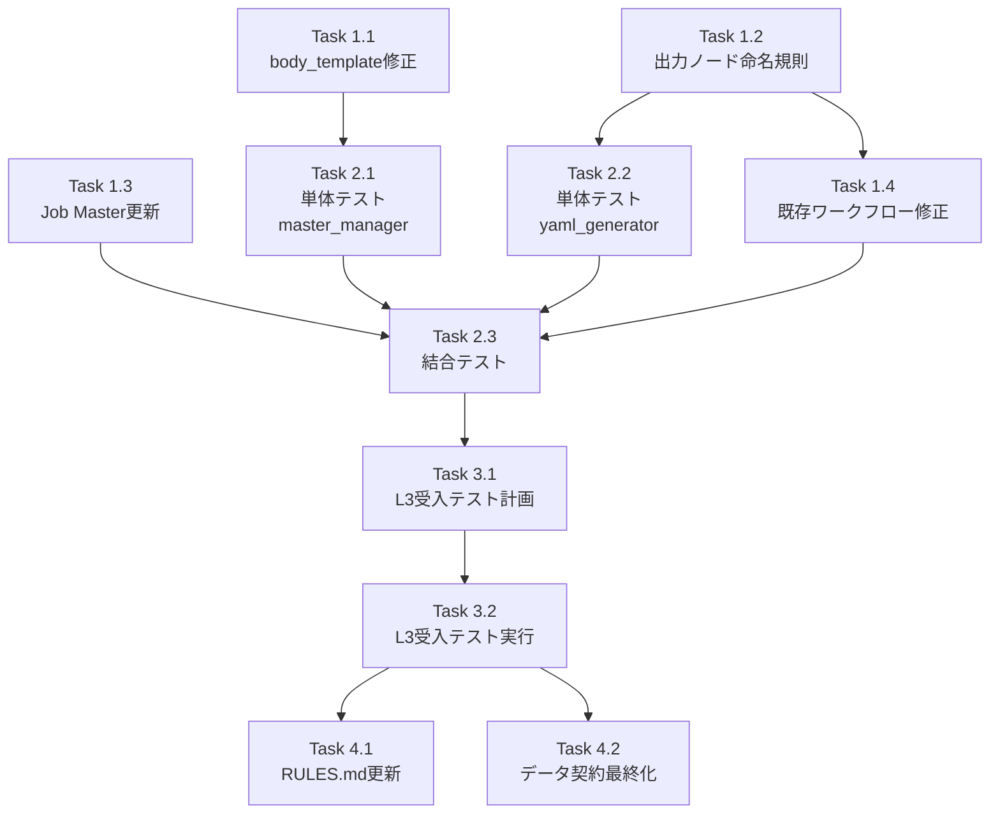

# 作業計画: V2タスクチェーン修正（Issue #342 Phase 1）

**作成日**: 2026-01-09
**関連Issue**: #342
**前提ドキュメント**:
- `v2-taskchain-root-cause-analysis.md`
- `v2-taskchain-remediation-plan.md`
- `docs/spec/taskchain-data-contract.md`

---

## 1. Issue概要の確認

```markdown
## Issue: V2 Job Generator タスクチェーン実行エラー修正
**Issue番号**: #342 (Phase 1)
**サイズ**: M
**作業見積**: 12時間
**優先度**: High (Critical)
**依存Issue**: なし
```

### 修正対象の根本原因

| # | 根本原因 | 重要度 | Phase 1対応 |
|---|---------|-------|------------|
| 1 | body_template二重ネスト | 🔴 Critical | ✅ 対応 |
| 2 | 出力ノード命名不整合 | 🔴 Critical | ✅ 対応（命名統一） |
| 3 | sourceパス参照不整合 | 🟡 High | Phase 2 |
| 4 | recipientフィールド欠落 | 🟡 High | ✅ 対応（即時修正） |
| 5 | Interface変換の不完全性 | 🟡 High | Phase 2 |

---

## 2. 詳細タスク分解

### 実装タスク（Phase 1）

- [ ] **Task 1.1**: body_template修正
  - 所要時間: 2時間
  - 成果物: `expertAgent/aiagent/langgraph/jobGeneratorV2/workflows/registration/master_manager.py`
  - 変更内容: `{{job.body}}` → `{{job.body.user_input}}`
  - 依存: なし

- [ ] **Task 1.2**: 出力ノード命名規則の追加
  - 所要時間: 2時間
  - 成果物: `expertAgent/aiagent/langgraph/jobGeneratorV2/workflows/workflow_gen/yaml_generator.py`
  - 変更内容: LLMプロンプトに「出力ノードは`output`を使用」ルール追加
  - 依存: なし

- [ ] **Task 1.3**: 既存Job Masterのbody更新
  - 所要時間: 1時間
  - 成果物: jobqueue DBの`job_masters`テーブル更新
  - 変更内容: recipientフィールド追加
  - 依存: なし

- [ ] **Task 1.4**: 既存ワークフローの修正
  - 所要時間: 1時間
  - 成果物: `graphAiServer/config/graphai/taskmaster/*/workflow_*.yml`
  - 変更内容: 出力ノード名を`output`に変更、sourceパス修正
  - 依存: Task 1.2

### テストタスク（Phase 2: TDD - CI実行可能）

- [ ] **Task 2.1**: 単体テスト（master_manager）
  - 所要時間: 1.5時間
  - 成果物: `expertAgent/tests/unit/test_job_generator_v2/test_master_manager.py`
  - カバレッジ目標: 90%
  - テストケース:
    - `test_build_body_template_task_0_uses_user_input`
    - `test_build_body_template_task_n_uses_previous_output`

- [ ] **Task 2.2**: 単体テスト（yaml_generator）
  - 所要時間: 1時間
  - 成果物: `expertAgent/tests/unit/test_job_generator_v2/test_yaml_generator.py`
  - カバレッジ目標: 90%
  - テストケース:
    - `test_generated_workflow_has_output_node`
    - `test_output_node_has_isresult_true`

- [ ] **Task 2.3**: 結合テスト（タスクチェーン）
  - 所要時間: 2時間
  - 成果物: `expertAgent/tests/integration/test_task_chain.py`
  - テストケース:
    - `test_two_task_chain_execution`
    - `test_three_task_chain_execution`
    - `test_body_template_resolution`

### 受入テストタスク（Phase 3: L3ローカル受入テスト）【必須】

- [ ] **Task 3.1**: L3受入テスト計画
  - 所要時間: 0.5時間
  - 成果物: 受入テストシナリオ（curlコマンド）

- [ ] **Task 3.2**: L3受入テスト実行
  - 所要時間: 1.5時間
  - 成果物: `expertAgent/tests/acceptance/test_issue_342_taskchain_acceptance.py`
  - **必須内容**:
    - Google検索→要約→メール送信チェーン実行
    - 既存単一タスクジョブの回帰確認
    - エビデンス収集

### ドキュメントタスク（Phase 4）

- [ ] **Task 4.1**: GRAPHAI_WORKFLOW_GENERATION_RULES.md更新
  - 所要時間: 0.5時間
  - 成果物: 出力ノード命名規則の追記

- [ ] **Task 4.2**: データ契約仕様書の最終化
  - 所要時間: 0.5時間
  - 成果物: `docs/spec/taskchain-data-contract.md`（Draft→Final）

---

## 3. タスク依存関係



---

## 4. 作業スケジュール

### 日次計画

**Day 1 (6時間)**

| 時間 | タスク | 成果物 |
|------|-------|--------|
| 09:00-11:00 | Task 1.1（body_template修正） | master_manager.py |
| 11:00-13:00 | Task 1.2（出力ノード命名規則） | yaml_generator.py |
| 14:00-15:00 | Task 1.3（Job Master更新） | DB更新スクリプト |
| 15:00-16:00 | Task 1.4（既存ワークフロー修正） | workflow_*.yml |

**Day 2 (6時間)**

| 時間 | タスク | 成果物 |
|------|-------|--------|
| 09:00-10:30 | Task 2.1（単体テスト・master_manager） | test_master_manager.py |
| 10:30-11:30 | Task 2.2（単体テスト・yaml_generator） | test_yaml_generator.py |
| 13:00-15:00 | Task 2.3（結合テスト） | test_task_chain.py |
| 15:00-15:30 | Task 3.1（L3受入テスト計画） | テストシナリオ |
| 15:30-17:00 | Task 3.2（L3受入テスト実行） | acceptance test |
| 17:00-18:00 | Task 4.1-4.2（ドキュメント） | RULES.md, 契約書 |

**総作業時間**: 12時間（約2日）

---

## 5. チェックポイント

| タイミング | 確認事項 | 対応 |
|-----------|---------|------|
| Task 1.1完了時 | body_template形式が正しいか | 単体テストで検証 |
| Task 1.4完了時 | 既存ワークフローが動作するか | graphAiServer直接呼び出しで確認 |
| Phase 2完了時 | カバレッジ90%以上 | 未達の場合追加テスト |
| Phase 3完了時 | 3タスクチェーン成功 | 失敗時はログ確認・修正 |
| PR作成前 | CI/CDパス | エラー時は修正 |

---

## 6. リスクと対策

| リスク | 発生確率 | 影響 | 対策 |
|-------|---------|------|------|
| 既存Job Masterの破壊 | 中 | 既存機能停止 | 回帰テストで事前確認 |
| body_template変更の副作用 | 中 | 単一タスクジョブ失敗 | 単一タスクの回帰テスト |
| ワークフロー修正漏れ | 低 | 特定タスクチェーン失敗 | 全ワークフロー一括確認 |
| LLMプロンプト変更の影響 | 中 | 生成品質低下 | 既存テストケースで検証 |

---

## 7. 成果物チェックリスト

### コード
- [ ] `expertAgent/.../master_manager.py` - body_template修正
- [ ] `expertAgent/.../yaml_generator.py` - 出力ノード命名規則
- [ ] `graphAiServer/config/graphai/taskmaster/*/workflow_*.yml` - ワークフロー修正

### テスト
- [ ] `expertAgent/tests/unit/test_job_generator_v2/test_master_manager.py`
- [ ] `expertAgent/tests/unit/test_job_generator_v2/test_yaml_generator.py`
- [ ] `expertAgent/tests/integration/test_task_chain.py`
- [ ] `expertAgent/tests/acceptance/test_issue_342_taskchain_acceptance.py`

### ドキュメント
- [ ] `graphAiServer/docs/GRAPHAI_WORKFLOW_GENERATION_RULES.md` - 出力ノード規則追記
- [ ] `docs/spec/taskchain-data-contract.md` - Final化

---

## 8. L3受入テスト計画（具体的なコマンド）【必須セクション】

### Step 1: サービス起動確認

```bash
# ハイブリッド起動（Platform=Docker, Agent=ローカル）
./scripts/dev-hybrid.sh

# ヘルスチェック（必須）
curl -sf http://localhost:8101/health && echo "✅ jobqueue: healthy"
curl -sf http://localhost:8103/health && echo "✅ myVault: healthy"
curl -sf http://localhost:8104/health && echo "✅ expertAgent: healthy"
curl -sf http://localhost:8105/health && echo "✅ graphAiServer: healthy"
```

### Step 2: body_template修正の検証

```bash
# 新規Job Master作成（修正後のbody_template形式）
curl -s -X POST "http://localhost:8104/aiagent-api/v1/job-generator" \
  -H "Content-Type: application/json" \
  -d '{
    "user_requirement": "大谷翔平の最新ニュースを検索して要約してメールで送信",
    "max_retry": 2
  }' | jq '.job_master_id'

# 期待するレスポンス:
# - HTTPステータス: 200
# - job_master_id が返される
```

### Step 3: タスクチェーン実行テスト

```bash
# ジョブ作成（3タスクチェーン）
JOB_MASTER_ID="jm_01KEH9NMY2WHPPSBFV9W5D2R3V"  # 既存または新規作成したID

JOB_RESPONSE=$(curl -s -X POST "http://localhost:8001/api/v1/jobs/from-master/${JOB_MASTER_ID}" \
  -H "Content-Type: application/json" \
  -H "X-API-Token: ${JOBQUEUE_API_TOKEN}" \
  -d '{
    "name": "Acceptance Test - TaskChain",
    "body": {
      "user_input": {"query": "大谷翔平の妻"},
      "recipient": "newtons.boiled.clock@gmail.com"
    }
  }')

JOB_ID=$(echo $JOB_RESPONSE | jq -r '.id')
echo "Job ID: ${JOB_ID}"

# 期待するレスポンス:
# - HTTPステータス: 201
# - Job IDが返される
```

### Step 4: タスク完了待機と結果確認

```bash
# ジョブ完了待機（最大5分）
for i in {1..60}; do
  STATUS=$(curl -s "http://localhost:8001/api/v1/jobs/${JOB_ID}" \
    -H "X-API-Token: ${JOBQUEUE_API_TOKEN}" | jq -r '.status')
  echo "[$i] Job status: ${STATUS}"
  if [ "$STATUS" = "SUCCEEDED" ] || [ "$STATUS" = "FAILED" ]; then
    break
  fi
  sleep 5
done

# タスク詳細確認
curl -s "http://localhost:8001/api/v1/jobs/${JOB_ID}/tasks" \
  -H "X-API-Token: ${JOBQUEUE_API_TOKEN}" | \
  jq '.tasks[] | {order, status, output_data}'

# 期待する結果:
# - 全タスクのstatus: "SUCCEEDED"
# - Task 0: search_results を含む出力
# - Task 1: email_subject, email_body を含む出力
# - Task 2: メール送信成功
```

### Step 5: 回帰テスト（単一タスクジョブ）

```bash
# 既存の単一タスクJob Masterでジョブ作成
SINGLE_TASK_JOB=$(curl -s -X POST "http://localhost:8001/api/v1/jobs/from-master/jm_single_task_test" \
  -H "Content-Type: application/json" \
  -H "X-API-Token: ${JOBQUEUE_API_TOKEN}" \
  -d '{
    "name": "Regression Test - Single Task",
    "body": {"user_input": {"query": "test"}}
  }')

SINGLE_JOB_ID=$(echo $SINGLE_TASK_JOB | jq -r '.id')

# 完了待機
sleep 30

# 結果確認
curl -s "http://localhost:8001/api/v1/jobs/${SINGLE_JOB_ID}" \
  -H "X-API-Token: ${JOBQUEUE_API_TOKEN}" | jq '{status, error_message}'

# 期待する結果:
# - status: "SUCCEEDED"
# - error_message: null
```

### Step 6: graphAiServer直接呼び出しテスト

```bash
# ワークフロー直接実行（修正後のsourceパス確認）
curl -s -X POST "http://localhost:8005/api/v1/myagent" \
  -H "Content-Type: application/json" \
  -d '{
    "user_input": {"query": "テストクエリ"},
    "job_params": {"recipient": "test@example.com"},
    "model_name": "taskmaster/tm_01KEH9NMX4QXABSWVDP6989650/workflow_jm_01KEH9NMY2WHPPSBFV9W5D2R3V"
  }' | jq '.results.output'

# 期待する結果:
# - outputノードの結果が返される
# - エラーなし
```

### Step 7: エビデンス収集

```bash
# レスポンスをファイルに保存
curl -s "http://localhost:8001/api/v1/jobs/${JOB_ID}/tasks" \
  -H "X-API-Token: ${JOBQUEUE_API_TOKEN}" > /tmp/acceptance_taskchain_result.json

# サービスログ確認
tail -100 expertAgent/logs/expertagent.log | grep -E "(ERROR|WARNING)" || echo "No errors"
docker logs myswiftagent-graphaiserver 2>&1 | tail -50 | grep -E "(ERROR|error)" || echo "No errors"

# 結果サマリ出力
echo "=== Acceptance Test Results ==="
echo "Job ID: ${JOB_ID}"
echo "Status: ${STATUS}"
echo "Tasks:"
cat /tmp/acceptance_taskchain_result.json | jq '.tasks[] | {order, status}'
```

---

## 9. Definition of Done

Issue完了条件：
- [ ] すべてのタスクが完了
- [ ] 単体テストカバレッジ90%以上
- [ ] 結合テスト全シナリオパス
- [ ] **L3受入テスト全パス**（3タスクチェーン成功）
- [ ] **回帰テストパス**（単一タスクジョブ成功）
- [ ] CI/CDグリーン
- [ ] コードレビュー承認
- [ ] ドキュメント更新完了

---

## 10. 次のアクション

作業計画承認後：
1. **ブランチ作成**: `issue/342-v2-taskchain-fix`
2. **Task 1.1開始**: master_manager.py の body_template修正
3. **TDD実施**: テストファースト開発
4. **進捗報告**: `/progress-report`で定期報告

---

## 11. 関連ドキュメント

### 分析・対策ドキュメント
- `v2-taskchain-root-cause-analysis.md` - 根本原因分析
- `v2-taskchain-remediation-plan.md` - 対策案
- `task3-email-http422-analysis.md` - Task 3詳細分析

### 仕様・テストドキュメント
- `docs/spec/taskchain-data-contract.md` - データ契約仕様書
- `v2-taskchain-regression-test-plan.md` - 回帰テスト計画

### 参照ドキュメント
- `graphAiServer/docs/GRAPHAI_WORKFLOW_GENERATION_RULES.md` - ワークフロー生成ルール
- `docs/arch/service-dependencies.md` - サービス依存関係
