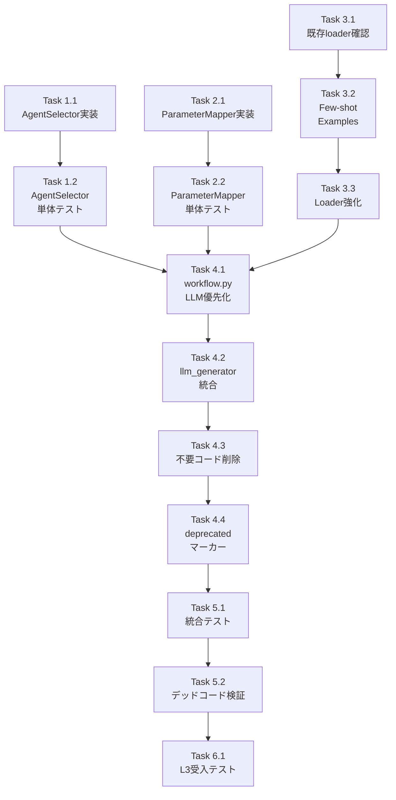

# Issue #342 V2 ワークフロー生成品質改善 - 作業計画書

**作成日**: 2026-01-07
**設計書**: [v2-workflow-quality-improvement-design.md](./v2-workflow-quality-improvement-design.md)

---

## Issue: V2 ワークフロー生成品質改善

**Issue番号**: #342 (追加対応)
**サイズ**: M
**作業見積**: 12.5時間
**優先度**: High
**依存Issue**: #342 V2 Langfuse統合（完了済み）

---

## 1. 詳細タスク分解

### 実装タスク（Phase 1-4）

#### Phase 1: AgentSelector実装
- [ ] **Task 1.1**: AgentSelector クラス実装
  - 所要時間: 1.5時間
  - 成果物: `workflows/workflow_gen/agent_selector.py`
  - 依存: なし
  - 内容:
    - `AgentMapping` dataclass定義
    - `API_AGENT_MAPPINGS` マッピングテーブル
    - `AgentSelector.select_agent()` メソッド

- [ ] **Task 1.2**: AgentSelector 単体テスト
  - 所要時間: 0.5時間
  - 成果物: `tests/unit/test_job_generator_v2/test_agent_selector.py`
  - 依存: Task 1.1
  - カバレッジ目標: 95%

#### Phase 2: ParameterMapper実装
- [ ] **Task 2.1**: ParameterMapper クラス実装
  - 所要時間: 1.5時間
  - 成果物: `workflows/workflow_gen/parameter_mapper.py`
  - 依存: なし
  - 内容:
    - `map_input_params()` - interface → inputs変換
    - `map_api_params()` - API → fetchAgent params変換

- [ ] **Task 2.2**: ParameterMapper 単体テスト
  - 所要時間: 0.5時間
  - 成果物: `tests/unit/test_job_generator_v2/test_parameter_mapper.py`
  - 依存: Task 2.1
  - カバレッジ目標: 95%

#### Phase 3: Few-shot Examples追加

**既存Few-shot構造**:
```
prompt_builder/few_shot/
├── loader.py              # 既存loader
├── api_call_pattern.yaml  # 既存
├── search_pattern.yaml    # 既存
├── map_pattern.yaml       # 既存
└── llm_chain_pattern.yaml # 既存
```

- [ ] **Task 3.1**: 既存loader.py構造確認
  - 所要時間: 0.25時間
  - 成果物: 既存loaderの理解（実装方針の確定）
  - 依存: なし
  - 内容: 既存の読み込み方式・フォーマットを確認

- [ ] **Task 3.2**: Few-shot Example YAMLファイル作成/更新
  - 所要時間: 0.5時間
  - 成果物:
    - `prompt_builder/few_shot/gmail_send_pattern.yaml` (新規)
    - `prompt_builder/few_shot/slack_notify_pattern.yaml` (新規)
    - `prompt_builder/few_shot/api_call_pattern.yaml` (GraphAI仕様準拠に更新)
  - 依存: Task 3.1
  - 内容: GraphAI仕様準拠のYAML例（inputs内にurl/method/body）

- [ ] **Task 3.3**: Few-shot Loader強化
  - 所要時間: 0.5時間
  - 成果物: `prompt_builder/few_shot/loader.py` (修正)
  - 依存: Task 3.2
  - 内容: `select_few_shot_examples()` 関数追加（タグベース選択）

#### Phase 4: LLM生成有効化 + デッドコード整理
- [ ] **Task 4.1**: workflow.py 修正（LLM優先化）
  - 所要時間: 1時間
  - 成果物: `workflows/workflow_gen/workflow.py` (修正)
  - 依存: Phase 1-3
  - 内容:
    - `generate_with_llm()` をデフォルト呼び出しに変更
    - フォールバック機構実装

- [ ] **Task 4.2**: llm_generator.py へのAgentSelector/ParameterMapper統合
  - 所要時間: 1.5時間
  - 成果物: `workflows/workflow_gen/llm_generator.py` (修正)
  - 依存: Task 4.1
  - 内容:
    - AgentSelector をimportしてAgent選択に使用
    - ParameterMapper をimportしてパラメータ生成に使用
    - プロンプト生成時にマッピング結果を活用
  - **統合先の理由**: `generate_with_llm()` は `LLMGeneratorSubWorkflow` を呼び出すため、
    Agent選択とパラメータマッピングはLLM生成コンテキストで使用

- [ ] **Task 4.3**: 不要コード削除
  - 所要時間: 0.5時間
  - 成果物: `workflows/workflow_gen/yaml_generator.py` (修正)
  - 依存: Task 4.2
  - 削除対象:
    - `create_yaml_generation_prompt()` 関数
    - `YAML_GENERATION_SYSTEM_PROMPT` (旧版を新版に置換)

- [ ] **Task 4.4**: フォールバックコードにdeprecatedマーカー追加
  - 所要時間: 0.5時間
  - 成果物: `workflows/workflow_gen/yaml_generator.py` (修正)
  - 依存: Task 4.3
  - 内容:
    - `generate()` メソッドにdeprecated docstring
    - `_build_workflow_nodes()` にdeprecated docstring

### テストタスク（Phase 5: TDD - CI実行可能）

- [ ] **Task 5.1**: 統合テスト作成
  - 所要時間: 1.5時間
  - 成果物: `tests/integration/test_v2_workflow_quality.py`
  - 依存: Phase 4
  - シナリオ:
    1. LLM生成が正常に動作する
    2. フォールバックが正しく機能する
    3. 生成されたYAMLがGraphAI仕様準拠
    4. AgentSelectorが適切なAgentを選択する
    5. ParameterMapperが正しいパラメータを生成する

- [ ] **Task 5.2**: デッドコード検証スクリプト作成・実行
  - 所要時間: 0.5時間
  - 成果物: `scripts/verify_no_dead_code_v2_workflow.sh`
  - 依存: Task 5.1
  - 内容:
    - 削除対象コードが存在しないことを確認
    - 新規クラスが統合されていることを確認

### 受入テストタスク（Phase 6: L3ローカル受入テスト）【必須】

- [ ] **Task 6.1**: L3受入テスト実行
  - 所要時間: 1.5時間
  - 成果物: `tests/acceptance/test_issue_342_workflow_quality_acceptance.py`
  - 依存: Phase 5
  - 内容:
    - V2 Job Generator API呼び出し
    - 生成YAMLの品質検証（GraphAI仕様準拠）
    - Langfuseトレース確認
    - generation_method=llm の確認
    - フォールバック動作の確認（オプション）

---

## 2. タスク依存関係



---

## 3. 作業スケジュール

### 並列実行可能タスク

Phase 1, 2, 3 は**並列実行可能**:
- Task 1.1 + Task 2.1 + Task 3.1 を同時進行
- Task 1.2 + Task 2.2 + Task 3.2 を同時進行
- Task 3.3 は Task 3.2 完了後

### 日次計画

**Day 1 (5.75時間)**
| 時間 | タスク | 成果物 |
|------|-------|--------|
| 09:00-10:30 | Task 1.1 AgentSelector実装 | agent_selector.py |
| 10:30-11:00 | Task 1.2 AgentSelector単体テスト | test_agent_selector.py |
| 11:00-12:30 | Task 2.1 ParameterMapper実装 | parameter_mapper.py |
| 13:30-14:00 | Task 2.2 ParameterMapper単体テスト | test_parameter_mapper.py |
| 14:00-14:15 | Task 3.1 既存loader確認 | 実装方針確定 |
| 14:15-14:45 | Task 3.2 Few-shot Examples作成/更新 | *_pattern.yaml |
| 14:45-15:15 | Task 3.3 Loader強化 | loader.py修正 |

**Day 2 (6.75時間)**
| 時間 | タスク | 成果物 |
|------|-------|--------|
| 09:00-10:00 | Task 4.1 workflow.py修正 | workflow.py |
| 10:00-11:30 | Task 4.2 llm_generator統合 | llm_generator.py |
| 11:30-12:00 | Task 4.3 不要コード削除 | yaml_generator.py |
| 13:00-13:30 | Task 4.4 deprecatedマーカー追加 | yaml_generator.py |
| 13:30-15:00 | Task 5.1 統合テスト作成 | test_v2_workflow_quality.py |
| 15:00-15:30 | Task 5.2 デッドコード検証 | verify_no_dead_code.sh |
| 15:30-17:00 | Task 6.1 L3受入テスト | test_issue_342_acceptance.py |

**総作業時間**: 12.5時間（2日）

---

## 4. チェックポイント

| タイミング | 確認事項 | 対応 |
|-----------|---------|------|
| Task 3.1完了時 | 既存loaderの構造を理解している | ドキュメント化 |
| Phase 1-3完了時 | 新規クラスの単体テストパス | 失敗時は修正 |
| Task 4.2完了時 | AgentSelector/ParameterMapperが`llm_generator.py`でimportされている | grep確認 |
| Task 4.3完了時 | `create_yaml_generation_prompt`が削除されている | grep確認 |
| Phase 5完了時 | 統合テストパス + Ruff/MyPyパス | CI実行 |
| Phase 6完了時 | E2Eで高品質YAMLが生成される（GraphAI仕様準拠） | 目視確認 |

---

## 5. リスクと対策

| リスク | 発生確率 | 影響 | 対策 |
|-------|---------|------|------|
| LLM生成の品質が期待以下 | 中 | 追加調整2時間 | Few-shot例を追加 |
| 既存テストが壊れる | 低 | 修正1時間 | 段階的に変更 |
| GraphAI仕様理解不足 | 低 | 修正1時間 | 仕様書再確認 |
| フォールバックが正しく動作しない | 低 | デバッグ1時間 | 明示的テスト追加 |

---

## 6. 成果物チェックリスト

### コード（新規）
- [ ] `workflows/workflow_gen/agent_selector.py`
- [ ] `workflows/workflow_gen/parameter_mapper.py`
- [ ] `prompt_builder/few_shot/examples/gmail_send.yaml`
- [ ] `prompt_builder/few_shot/examples/google_search.yaml`
- [ ] `prompt_builder/few_shot/examples/search_and_notify.yaml`

### コード（修正）
- [ ] `workflows/workflow_gen/workflow.py` - LLM優先化
- [ ] `workflows/workflow_gen/yaml_generator.py` - 統合 + デッドコード削除
- [ ] `prompt_builder/few_shot/loader.py` - Example選択強化

### テスト
- [ ] `tests/unit/test_job_generator_v2/test_agent_selector.py`
- [ ] `tests/unit/test_job_generator_v2/test_parameter_mapper.py`
- [ ] `tests/integration/test_v2_workflow_quality.py`
- [ ] `tests/acceptance/test_issue_342_workflow_quality_acceptance.py`

### スクリプト
- [ ] `scripts/verify_no_dead_code_v2_workflow.sh`

---

## 7. L3受入テスト計画（具体的なコマンド）

### Step 1: サービス起動確認

```bash
# サービス起動（Hybrid mode推奨）
./scripts/dev-hybrid.sh

# ヘルスチェック
curl -sf http://localhost:8004/health && echo "✅ expertAgent: healthy"
curl -sf http://localhost:8003/health && echo "✅ myVault: healthy"
curl -sf http://localhost:3001/api/public/health && echo "✅ Langfuse: healthy"
```

### Step 2: V2 Job Generator API呼び出し

```bash
# V2 Job Generator でジョブ生成
JOB_RESPONSE=$(curl -s -X POST "http://localhost:8004/v1/job-generator" \
  -H "Content-Type: application/json" \
  -d '{
    "user_requirement": "Google検索で「AI技術」を調べてSlackに通知する"
  }')

echo "$JOB_RESPONSE" | jq .

# 期待するレスポンス:
# - status: "completed"
# - task_count: 2-3
# - langfuse_trace_id: 非null
```

### Step 3: 生成されたYAMLの品質検証

```bash
# ジョブIDを取得
JOB_ID=$(echo "$JOB_RESPONSE" | jq -r '.job_id')

# ステータス確認（workflow_yamlを含む）
curl -s "http://localhost:8004/v1/jobs/${JOB_ID}/status" | jq .

# 期待する検証項目:
# 1. workflow_yaml が存在する
# 2. fetchAgent が inputs ブロック内に url, method, body を持つ
# 3. version: "0.5" が設定されている
# 4. ${EXPERTAGENT_BASE_URL} が使用されている

# YAML内容の検証
curl -s "http://localhost:8004/v1/jobs/${JOB_ID}/status" | jq -r '.workflow_statuses[0].summary.yaml_content' | head -50

# 期待: GraphAI仕様準拠のYAML
# - inputs.url, inputs.method, inputs.body 形式
# - 適切なAgent選択（fetchAgent, stringTemplateAgent等）
```

### Step 4: Langfuseトレース確認

```bash
# Trace ID取得
TRACE_ID=$(echo "$JOB_RESPONSE" | jq -r '.langfuse_trace_id')

echo "Langfuse Trace URL: http://localhost:3001/trace/${TRACE_ID}"

# Langfuse APIでトレース確認
curl -s "http://localhost:3001/api/public/traces/${TRACE_ID}" \
  -H "Authorization: Bearer ${LANGFUSE_PUBLIC_KEY}" | jq .
```

### Step 5: 生成方法の確認

```bash
# ログで generation_method を確認
tail -100 /tmp/expertAgent_v2.log | grep "generation_method"

# 期待: generation_method=llm（LLM生成がデフォルト）
```

### Step 6: フォールバック動作確認（オプション）

```bash
# LLM APIを一時的に無効化してフォールバックをテスト
# （環境変数でAPIキーを空にする等）

# 期待: generation_method=template + ログに "falling back to template" 出力
```

---

## 8. Definition of Done

### 必須条件
- [ ] すべてのタスクが完了
- [ ] 単体テストカバレッジ90%以上
- [ ] 統合テスト全シナリオパス
- [ ] **L3受入テスト全パス**
  - [ ] V2 Job Generator APIで高品質YAMLが生成される
  - [ ] 生成YAMLがGraphAI仕様準拠
  - [ ] Langfuseトレースが記録される
- [ ] CI/CDグリーン（Ruff + MyPy）
- [ ] デッドコード検証スクリプトパス
- [ ] コードレビュー承認

### デッドコード対策確認
- [ ] `create_yaml_generation_prompt()` が削除されている
- [ ] `AgentSelector` が `yaml_generator.py` または `llm_generator.py` でimportされている
- [ ] `ParameterMapper` が `yaml_generator.py` または `llm_generator.py` でimportされている
- [ ] Few-shot examples が `loader.py` で読み込まれている

---

## 9. 次のアクション

作業計画承認後：
1. **現在のブランチで作業継続**: `develop` ブランチ
2. **Phase 1-3 並列実行**: AgentSelector, ParameterMapper, Few-shot
3. **Phase 4 順次実行**: LLM有効化 + デッドコード整理
4. **Phase 5-6 検証**: 統合テスト + L3受入テスト
5. **PR作成**: レビュー依頼

---

**作成者**: Claude Code
**承認待ち**: ユーザー確認後に実装開始
