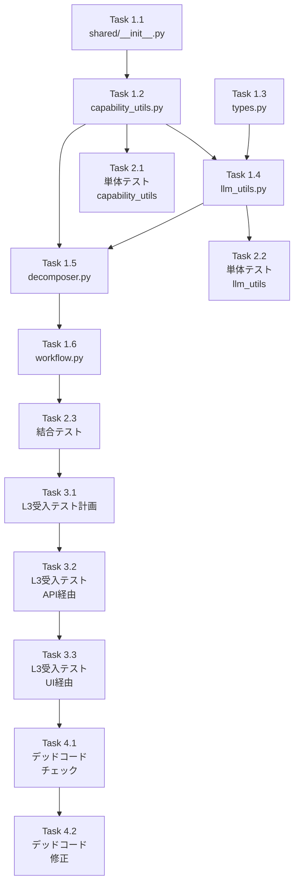

# 作業計画書: Issue #342 V2 タスク分割 API情報注入

## Issue: V2 タスク分割 API情報注入メカニズム実装

**Issue番号**: #342（サブタスク: Phase 1 API情報注入）
**サイズ**: M
**作業見積**: 7.7時間
**優先度**: High（P0 - Critical）
**依存Issue**: なし
**設計書**: `v2-task-breakdown-api-design-policy.md`

---

## 1. 背景・目的

### スコープ

> **重要**: この作業計画は **Phase 1（タスク分割 API情報注入）のみ** を対象とします。
>
> 設計書に記載されている以下のPhaseは、別作業計画で対応予定：
> - Phase 2: TaskMaster URL API固有化（P1）
> - Phase 3: ワークフロー生成プロンプト改善（P1）

### 問題
V2 Job Generator でタスク分割時にAPI情報がLLMに渡されず、`recommended_apis` が空になる。

### 解決策
- `shared/capability_utils.py` で共通ユーティリティを作成
- `TaskDecomposerSubWorkflow` にcapabilities注入機能を追加
- システムプロンプトにAPI一覧を含める

### 成功基準
- `recommended_apis` 設定率: 33% → **100%**
- LLMベース生成成功率: 0% → **80%以上**

---

## 2. 詳細タスク分解

### Phase 1: 実装タスク

- [ ] **Task 1.1**: shared パッケージ作成
  - 所要時間: 0.1時間
  - 成果物: `aiagent/langgraph/shared/__init__.py`
  - 依存: なし

- [ ] **Task 1.2**: capability_utils.py 作成
  - 所要時間: 1時間
  - 成果物: `aiagent/langgraph/shared/capability_utils.py`
  - 依存: Task 1.1
  - 内容:
    - `load_capabilities_from_yaml()` 関数
    - `format_capabilities_for_prompt()` 関数

- [ ] **Task 1.3**: Capability型拡張
  - 所要時間: 0.5時間
  - 成果物: `aiagent/langgraph/jobGeneratorV2/types.py`
  - 依存: なし
  - 内容:
    - `use_cases: list[str]` フィールド追加
    - `method: str` フィールド追加

- [ ] **Task 1.4**: llm_utils.py プロンプトビルダー更新
  - 所要時間: 1時間
  - 成果物: `aiagent/langgraph/jobGeneratorV2/llm_utils.py`
  - 依存: Task 1.2
  - 内容:
    - `_build_task_breakdown_system_prompt()` 関数拡張
    - `shared.format_capabilities_for_prompt()` 使用
    - Few-shot例追加

- [ ] **Task 1.5**: decomposer.py コンストラクタ追加
  - 所要時間: 0.5時間
  - 成果物: `aiagent/langgraph/jobGeneratorV2/workflows/task_breakdown/decomposer.py`
  - 依存: Task 1.2, Task 1.4
  - 内容:
    - `__init__(capabilities)` コンストラクタ追加
    - 自動ロードフォールバック機構

- [ ] **Task 1.6**: workflow.py capabilities渡し
  - 所要時間: 0.5時間
  - 成果物: `aiagent/langgraph/jobGeneratorV2/workflows/task_breakdown/workflow.py`
  - 依存: Task 1.5
  - 内容:
    - capabilities を最初にロード
    - decomposer に capabilities を渡す

### Phase 2: テストタスク（TDD - CI実行可能）

- [ ] **Task 2.1**: 単体テスト（shared/capability_utils + types.py）
  - 所要時間: 0.6時間
  - 成果物: `tests/unit/test_job_generator_v2/test_capability_utils.py`
  - カバレッジ目標: 95%
  - テストケース:
    - `test_load_capabilities_from_yaml`
    - `test_load_capabilities_includes_use_cases`
    - `test_load_capabilities_includes_method`
    - `test_format_capabilities_empty`
    - `test_format_capabilities_includes_api_info`
    - `test_capability_type_has_use_cases_field`（types.py拡張検証）
    - `test_capability_type_has_method_field`（types.py拡張検証）

- [ ] **Task 2.2**: 単体テスト（llm_utils）
  - 所要時間: 0.3時間
  - 成果物: `tests/unit/test_job_generator_v2/test_llm_utils.py`（更新）
  - カバレッジ目標: 90%
  - テストケース:
    - `test_system_prompt_includes_apis`
    - `test_system_prompt_without_apis`

- [ ] **Task 2.3**: 結合テスト
  - 所要時間: 0.7時間
  - 成果物: `tests/integration/test_v2_task_breakdown_api_injection.py`
  - シナリオ数: 3
  - **テスト方針**: LLMはモック使用（CI実行のため）
  - テストケース:
    - `test_recommended_api_in_all_tasks` - モックLLMレスポンスで全タスクにrecommended_api設定を検証
    - `test_system_prompt_contains_api_list` - LLM呼び出し時のsystem_promptをキャプチャし検証
    - `test_capabilities_propagate_to_decomposer` - workflow→decomposerへのcapabilities伝播を検証

### Phase 3: L3ローカル受入テスト【必須】

- [ ] **Task 3.1**: L3受入テスト計画
  - 所要時間: 0.2時間
  - 成果物: 受入テストシナリオ（具体的なcurlコマンド）

- [ ] **Task 3.2**: L3受入テスト実行（API経由）
  - 所要時間: 0.8時間
  - 成果物: `tests/acceptance/test_issue_342_api_injection_acceptance.py`
  - **必須内容**:
    - サービス起動確認（ヘルスチェック）
    - V2 Job Generator API呼び出し
    - 生成されたタスクの `recommended_apis` 検証
    - Langfuse連携確認

- [ ] **Task 3.3**: L3受入テスト実行（UI経由）【追加】
  - 所要時間: 1時間
  - 成果物: `tests/acceptance/test_issue_342_ui_e2e_acceptance.py`
  - **テスト対象URL**: `http://localhost:8000/projects/proj_mjbjua2z7y65wy/workbenches/wb_1766969315404_udrhx79/generate`
  - **検証項目**:
    - UI経由でジョブ生成を実行
    - **タスク分割**が正常終了し、全タスクに `recommended_apis` が設定される
    - **インターフェース定義**が正常終了し、input/output_schema が妥当
    - **LLMワークフロー生成**が正常終了し、YAMLが有効
    - 生成されたワークフロー内容が妥当（テンプレートフォールバックでない）

### Phase 4: デッドコードチェック【追加】

- [ ] **Task 4.1**: デッドコードチェック実行
  - 所要時間: 0.3時間
  - 成果物: `verify_no_dead_code.sh` 実行結果
  - **検証項目**:
    - 新規追加したコード（shared/capability_utils.py）が実際に使用されている
    - 既存コードで不要になった部分がない
    - インポートされているが使用されていない関数がない

- [ ] **Task 4.2**: デッドコード修正（必要な場合）
  - 所要時間: 0.2時間（条件付き）
  - 成果物: デッドコード除去または統合
  - **対応**:
    - 未使用コードの削除
    - 未統合関数のワークフロー組み込み

---

## 3. タスク依存関係



---

## 4. 作業スケジュール

### 実装フロー（約7.6時間）

**Block 1: 基盤構築（1.6時間）**
- Task 1.1: shared/__init__.py 作成（0.1h）
- Task 1.2: capability_utils.py 作成（1h）
- Task 1.3: types.py Capability型拡張（0.5h）

**Block 2: 統合実装（2時間）**
- Task 1.4: llm_utils.py プロンプトビルダー更新（1h）
- Task 1.5: decomposer.py コンストラクタ追加（0.5h）
- Task 1.6: workflow.py capabilities渡し（0.5h）

**Block 3: テスト（1.6時間）**
- Task 2.1: 単体テスト capability_utils + types.py（0.6h）
- Task 2.2: 単体テスト llm_utils（0.3h）
- Task 2.3: 結合テスト（0.7h）

**Block 4: 受入テスト（2時間）**
- Task 3.1: L3受入テスト計画（0.2h）
- Task 3.2: L3受入テスト実行 API経由（0.8h）
- Task 3.3: L3受入テスト実行 UI経由（1h）【追加】

**Block 5: デッドコードチェック（0.5時間）【追加】**
- Task 4.1: デッドコードチェック実行（0.3h）
- Task 4.2: デッドコード修正（0.2h）※条件付き

**総作業時間**: 7.7時間

---

## 5. チェックポイント

| タイミング | 確認事項 | 対応 |
|-----------|---------|------|
| Task 1.2完了時 | YAML読み込み動作確認 | `load_capabilities_from_yaml()` が空でないリストを返す |
| Task 1.4完了時 | プロンプトにAPI情報含む | `## 利用可能なAPI` セクションが存在 |
| Task 1.6完了時 | 手動テスト | V2 Job Generator でタスク分割実行、recommended_apis 確認 |
| Phase 2完了時 | CI通過 | `pytest tests/unit/test_job_generator_v2/` 全パス |
| Task 3.2完了時 | API受入テストパス | 全タスクに recommended_apis が設定される |
| Task 3.3完了時 | UI受入テストパス | タスク分割・インターフェース定義・ワークフロー生成が正常終了 |
| Phase 4完了時 | デッドコードなし | `verify_no_dead_code.sh` パス、新規コードが使用されている |

---

## 6. リスクと対策

| リスク | 発生確率 | 影響 | 対策 |
|-------|---------|------|------|
| LLMがAPI情報を無視 | 中 | recommended_apis が空 | Few-shot例を追加、プロンプト強化 |
| YAMLパス解決失敗 | 低 | capabilities 空 | 絶対パス解決、フォールバック機構 |
| V1との互換性問題 | 低 | V1が壊れる | V2のみ修正、V1は変更なし |
| テストカバレッジ未達 | 中 | CI失敗 | 追加テストケース作成 |
| デッドコード検出 | 中 | CIブロック | 即時修正、統合確認 |
| UI経由テストでLLM不安定 | 中 | テスト失敗 | 複数回実行、プロンプト改善 |

---

## 7. 成果物チェックリスト

### コード
- [ ] `aiagent/langgraph/shared/__init__.py`
- [ ] `aiagent/langgraph/shared/capability_utils.py`
- [ ] `aiagent/langgraph/jobGeneratorV2/types.py`（修正）
- [ ] `aiagent/langgraph/jobGeneratorV2/llm_utils.py`（修正）
- [ ] `aiagent/langgraph/jobGeneratorV2/workflows/task_breakdown/decomposer.py`（修正）
- [ ] `aiagent/langgraph/jobGeneratorV2/workflows/task_breakdown/workflow.py`（修正）

### テスト
- [ ] `tests/unit/test_job_generator_v2/test_capability_utils.py`
- [ ] `tests/unit/test_job_generator_v2/test_llm_utils.py`（更新）
- [ ] `tests/integration/test_v2_task_breakdown_api_injection.py`
- [ ] `tests/acceptance/test_issue_342_api_injection_acceptance.py`
- [ ] `tests/acceptance/test_issue_342_ui_e2e_acceptance.py`【追加】

### デッドコードチェック
- [ ] `verify_no_dead_code.sh` 実行・パス
- [ ] 新規コード（shared/capability_utils.py）の使用確認

### エビデンス
- [ ] `dev-reports/feature/issue/342/evidence/api_acceptance_result.json`
- [ ] `dev-reports/feature/issue/342/evidence/ui_e2e_result.json`

### ドキュメント
- [ ] 設計書更新完了（済み）

---

## 8. L3受入テスト計画（具体的なコマンド）

### Step 1: サービス起動確認

```bash
# サービス起動
cd /Users/maenokota/share/work/github_kewton/MySwiftAgent
./scripts/dev-hybrid.sh

# ヘルスチェック
curl -sf http://localhost:8004/health && echo "✅ expertAgent: healthy"
curl -sf http://localhost:8001/health && echo "✅ jobqueue: healthy"
```

### Step 2: V2 Job Generator API呼び出し

```bash
# テスト用リクエスト
curl -s -X POST http://localhost:8004/v1/job-generator \
  -H "Content-Type: application/json" \
  -d '{
    "user_requirement": "キーワード「大谷翔平」でGoogle検索して得られた情報をサマリしてメール送信する。送信先: test@example.com",
    "use_v2": true
  }' | jq '.'

# レスポンス例:
# {
#   "job_id": "xxx-xxx-xxx",
#   "status": "processing"
# }
```

### Step 3: タスク分割結果の検証

```bash
# ジョブID取得後、ステータス確認
JOB_ID="取得したジョブID"

# 30秒待機後にステータス確認
sleep 30
curl -s "http://localhost:8004/v1/jobs/${JOB_ID}/status" | jq '.'

# 検証項目:
# 1. task_breakdown に3タスクが含まれる
# 2. 各タスクに recommended_apis が設定されている
# 3. task_001: /v1/utility/google_search
# 4. task_002: /v1/myllm または /v1/aiagent/utility/jsonoutput
# 5. task_003: /v1/utility/gmail/send

# recommended_apis 検証スクリプト
curl -s "http://localhost:8004/v1/jobs/${JOB_ID}/status" | \
  jq -e '.task_breakdown[] | select(.recommended_apis | length == 0)' && \
  echo "❌ FAIL: Some tasks missing recommended_apis" || \
  echo "✅ PASS: All tasks have recommended_apis"
```

### Step 4: Langfuse連携確認

```bash
# Langfuseでトレース確認
curl -sf http://localhost:3001/api/public/health && echo "✅ Langfuse: healthy"

# Langfuse UIで以下を確認:
# - トレースに "task_decomposer" が存在
# - システムプロンプトに "## 利用可能なAPI" が含まれる
```

### Step 5: エビデンス収集

```bash
# エビデンス保存先を作成
EVIDENCE_DIR="dev-reports/feature/issue/342/evidence"
mkdir -p ${EVIDENCE_DIR}

# レスポンスをファイルに保存
curl -s "http://localhost:8004/v1/jobs/${JOB_ID}/status" > ${EVIDENCE_DIR}/api_acceptance_result.json

# recommended_apis の内容を確認
cat ${EVIDENCE_DIR}/api_acceptance_result.json | jq '.task_breakdown[].recommended_apis'

# サービスログ確認
tail -100 expertAgent/logs/expertagent.log | grep -E "(capability|recommended_api|API)"
```

---

## 9. L3受入テスト計画（UI経由）【追加】

### Step 0: テスト用プロジェクト・ワークベンチの確認【前提条件】

```bash
# テスト対象のプロジェクト・ワークベンチ
# PROJECT_ID: proj_mjbjua2z7y65wy
# WORKBENCH_ID: wb_1766969315404_udrhx79

# 1. プロジェクト存在確認
curl -s "http://localhost:8000/api/projects/proj_mjbjua2z7y65wy" | jq '.id'

# 2. 存在しない場合はUIから作成、または以下のAPIで確認
curl -s "http://localhost:8000/api/projects" | jq '.[].id'

# 3. ワークベンチ存在確認
curl -s "http://localhost:8000/api/projects/proj_mjbjua2z7y65wy/workbenches" | jq '.[].id'

# 注意: プロジェクト/ワークベンチが存在しない場合は
# http://localhost:8000 からUIでテスト用プロジェクトを作成してください
```

### Step 1: サービス起動確認

```bash
# 全サービス起動（myAgentDesk含む）
cd /Users/maenokota/share/work/github_kewton/MySwiftAgent
./scripts/dev-hybrid.sh

# ヘルスチェック
curl -sf http://localhost:8004/health && echo "✅ expertAgent: healthy"
curl -sf http://localhost:8001/health && echo "✅ jobqueue: healthy"
curl -sf http://localhost:8000/api/health && echo "✅ myAgentDesk: healthy"
```

### Step 2: UI経由でジョブ生成実行

```bash
# ブラウザまたはPlaywrightで以下のURLにアクセス
# http://localhost:8000/projects/proj_mjbjua2z7y65wy/workbenches/wb_1766969315404_udrhx79/generate

# テスト用要件入力
# 「キーワード「大谷翔平」でGoogle検索して得られた情報をサマリしてメール送信する。送信先: test@example.com」

# 「生成」ボタンをクリック
```

### Step 3: 結果検証（タスク分割）

```bash
# 生成されたジョブのステータスをAPIで確認
JOB_ID="生成されたジョブID"

# タスク分割結果の検証
curl -s "http://localhost:8004/v1/jobs/${JOB_ID}/status" | jq '.task_breakdown'

# 検証項目:
# ✅ 3タスクが生成される
# ✅ 各タスクに recommended_apis が設定されている
# ✅ task_001: Google検索 → /v1/utility/google_search
# ✅ task_002: サマリ → /v1/myllm または /v1/aiagent/utility/jsonoutput
# ✅ task_003: メール送信 → /v1/utility/gmail/send
```

### Step 4: 結果検証（インターフェース定義）

```bash
# インターフェース定義の検証
curl -s "http://localhost:8004/v1/jobs/${JOB_ID}/status" | jq '.interface_definitions'

# 検証項目:
# ✅ 各タスクに input_schema が定義されている
# ✅ 各タスクに output_schema が定義されている
# ✅ スキーマが妥当（必須フィールドが含まれる）
```

### Step 5: 結果検証（LLMワークフロー生成）

```bash
# ワークフローYAMLの検証
curl -s "http://localhost:8004/v1/jobs/${JOB_ID}/status" | jq '.workflows'

# 検証項目:
# ✅ 各タスクにYAMLが生成されている
# ✅ YAMLが有効（パース可能）
# ✅ テンプレートフォールバックでない（LLM生成）
# ✅ agentの種類が妥当（fetchAgent, copyAgent等）
# ✅ URLがAPI固有エンドポイントを指している
```

### Step 6: エビデンス収集

```bash
# エビデンス保存先（Step 5と同じディレクトリを使用）
EVIDENCE_DIR="dev-reports/feature/issue/342/evidence"
mkdir -p ${EVIDENCE_DIR}

# 結果をファイルに保存
curl -s "http://localhost:8004/v1/jobs/${JOB_ID}/status" > ${EVIDENCE_DIR}/ui_e2e_result.json

# 各フェーズの結果を個別に確認
echo "=== タスク分割 ==="
cat ${EVIDENCE_DIR}/ui_e2e_result.json | jq '.task_breakdown[] | {name, recommended_apis}'

echo "=== インターフェース定義 ==="
cat ${EVIDENCE_DIR}/ui_e2e_result.json | jq '.interface_definitions[] | {task_id, input_schema: .input_schema | keys, output_schema: .output_schema | keys}'

echo "=== ワークフロー生成 ==="
cat ${EVIDENCE_DIR}/ui_e2e_result.json | jq '.workflows[] | {task_id, yaml_valid: (.yaml != null)}'
```

---

## 10. デッドコードチェック計画【追加】

### Step 1: verify_no_dead_code.sh 実行

```bash
cd /Users/maenokota/share/work/github_kewton/MySwiftAgent/expertAgent
./scripts/verify_no_dead_code.sh
```

### Step 2: 新規コード使用確認

```bash
# shared/capability_utils.py の関数が使用されているか確認
grep -rn "load_capabilities_from_yaml" aiagent/langgraph/jobGeneratorV2/ --include="*.py"
grep -rn "format_capabilities_for_prompt" aiagent/langgraph/jobGeneratorV2/ --include="*.py"

# 期待する結果:
# ✅ workflow.py で load_capabilities_from_yaml が使用されている
# ✅ llm_utils.py で format_capabilities_for_prompt が使用されている
```

### Step 3: 未使用インポートチェック

```bash
# ruff でインポートチェック
ruff check aiagent/langgraph/shared/ --select F401
ruff check aiagent/langgraph/jobGeneratorV2/ --select F401

# 期待する結果:
# ✅ エラーなし
```

---

## 11. Definition of Done

Issue完了条件：
- [ ] すべてのタスク（Task 1.1〜4.2）が完了
- [ ] 単体テストカバレッジ90%以上
- [ ] 結合テスト全シナリオパス
- [ ] **L3受入テスト全パス（API経由）**
  - [ ] 全タスクに `recommended_apis` が設定される
  - [ ] システムプロンプトに API 一覧が含まれる
- [ ] **L3受入テスト全パス（UI経由）**【追加】
  - [ ] タスク分割が正常終了し、recommended_apis が設定される
  - [ ] インターフェース定義が正常終了し、スキーマが妥当
  - [ ] LLMワークフロー生成が正常終了し、YAMLが有効
  - [ ] 生成内容が妥当（テンプレートフォールバックでない）
- [ ] CI/CDグリーン
- [ ] コードレビュー承認
- [ ] **デッドコードなし**【追加】
  - [ ] `verify_no_dead_code.sh` パス
  - [ ] 新規コードが実際に使用されている
  - [ ] 未使用インポートなし

---

## 12. 次のアクション

作業計画承認後：
1. **ブランチ作成**: `git checkout -b issue/342-v2-api-injection`
2. **TDD実装開始**: `/tdd-impl` または `/pm-auto-dev` で実装
3. **進捗報告**: 各Block完了時に `/progress-report`

---

## 13. レビュー履歴

| 日付 | レビュアー | 結果 | 指摘事項 |
|------|-----------|------|---------|
| 2026-01-07 | 内部レビュー | 条件付き承認 | スコープ明確化、UI前提条件、型テスト追加、エビデンス保存先 |
| 2026-01-07 | - | 修正完了 | 上記指摘事項を全て反映 |

---

**作成日**: 2026-01-07
**更新日**: 2026-01-07（レビュー指摘対応: スコープ明確化、UI前提条件追加、型テスト追加、エビデンス保存先変更）
**作成者**: テックリード
**承認**: ✅ 承認
