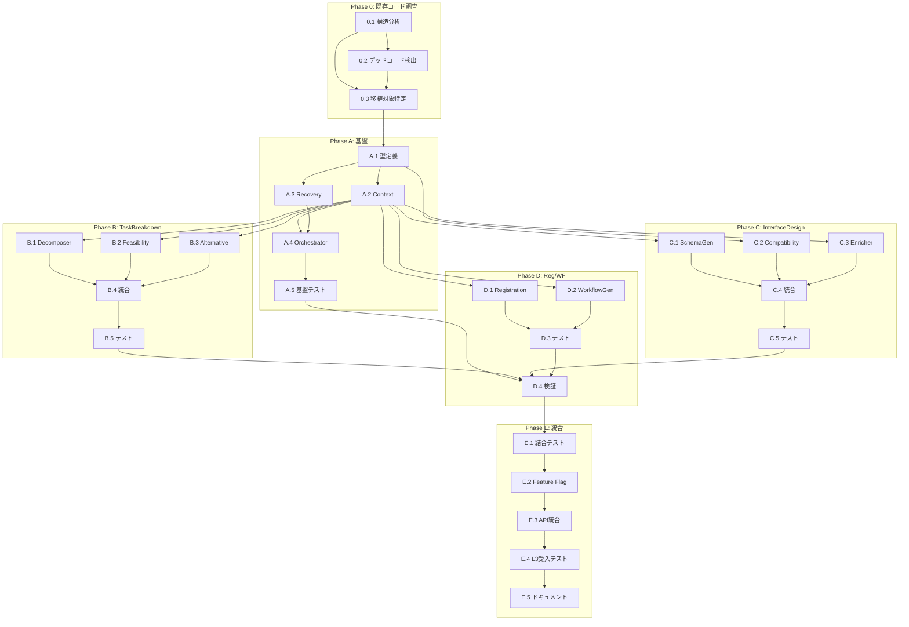

# 作業計画書: Issue #342

## Issue: refactor(expertAgent): Job/Task Generator Agent アーキテクチャ刷新

**Issue番号**: #342
**サイズ**: XL（大規模リファクタリング）
**作業見積**: 75-80時間
**優先度**: High
**依存Issue**: なし

---

## 1. スコープ概要

### 対象範囲
- `expertAgent/aiagent/langgraph/jobTaskGeneratorAgents/` の全面刷新
- 現行コード: 約3,300行（8ノード + agent.py + state.py）
- 新規コード: 約2,500行（4ワークフロー + Orchestrator + Context）

### 対象外
- `workflowGeneratorAgents/` は本Issueでは対象外（別Issue化を推奨）
- API エンドポイントの変更（内部実装のみ）
- フロントエンド変更なし

---

## 2. 詳細タスク分解

### Phase 0: 既存コード調査・デッドコード検出

#### Task 0.1: 既存コード構造分析
- **所要時間**: 3時間
- **成果物**:
  - `dev-reports/feature/issue/342/existing-code-analysis.md`
- **依存**: なし
- **内容**:
  - 全ノードの責務・入出力整理
  - 状態フィールドの使用箇所マッピング
  - ルーター条件分岐の完全な理解
  - 外部依存（API呼び出し等）の洗い出し

#### Task 0.2: デッドコード検出
- **所要時間**: 2時間
- **成果物**:
  - `dev-reports/feature/issue/342/dead-code-report.md`
- **依存**: Task 0.1
- **内容**:
  ```bash
  # 静的解析ツールによる検出
  vulture expertAgent/aiagent/langgraph/jobTaskGeneratorAgents/
  ruff check --select=F401,F841 expertAgent/aiagent/langgraph/jobTaskGeneratorAgents/
  ```
  - 未使用インポート
  - 未使用変数・関数
  - 到達不能コード
  - 使用されていない状態フィールド

#### Task 0.3: 移植対象コードの特定
- **所要時間**: 2時間
- **成果物**:
  - `dev-reports/feature/issue/342/migration-mapping.md`
- **依存**: Task 0.1, 0.2
- **内容**:
  - 旧コード → 新コードの対応表
  - 移植するロジックの一覧
  - 移植しない（削除する）コードの一覧
  - 改善が必要なロジックの特定

```
【移植マッピング例】
┌─────────────────────────────────────┬─────────────────────────────────────┐
│ 旧コード                            │ 新コード                            │
├─────────────────────────────────────┼─────────────────────────────────────┤
│ requirement_analysis.py             │ task_breakdown/decomposer.py        │
│ evaluator.py (feasibility部分)      │ task_breakdown/feasibility.py       │
│ evaluator.py (evaluation部分)       │ 各ワークフロー内に分散              │
│ interface_definition.py             │ interface_design/schema_generator.py│
│ schema_enrichment.py                │ interface_design/enricher.py        │
│ master_creation.py                  │ registration/workflow.py            │
│ validation.py                       │ registration/workflow.py            │
│ job_registration.py                 │ registration/workflow.py            │
│ workflow_generation.py              │ workflow_gen/workflow.py            │
│ state.py (30+フィールド)            │ 各フェーズに分散（10以下/フェーズ） │
│ agent.py (ルーター)                 │ orchestrator.py                     │
└─────────────────────────────────────┴─────────────────────────────────────┘

【削除対象コード】
- 未使用の状態フィールド
- 重複したバリデーションロジック
- デッドコードパス
```

---

### Phase A: 基盤実装（Foundation）

#### Task A.1: 共通型・プロトコル定義
- **所要時間**: 3時間
- **成果物**:
  - `expertAgent/aiagent/langgraph/jobGeneratorV2/types.py`
  - `expertAgent/aiagent/langgraph/jobGeneratorV2/protocols.py`
- **依存**: なし
- **内容**:
  - `Phase`, `PhaseStatus` Enum
  - `WorkflowProtocol` 定義
  - 入出力型（`TaskBreakdownInput/Output` 等）
  - `RetryState`, `RetryAttempt` データクラス

#### Task A.2: ExecutionContext 実装
- **所要時間**: 4時間
- **成果物**:
  - `expertAgent/aiagent/langgraph/jobGeneratorV2/context.py`
- **依存**: Task A.1
- **内容**:
  - `LLMContext` クラス
  - `StorageContext` クラス
  - `IntegrationContext` クラス
  - `ObservabilityContext` クラス
  - `ExecutionContext` ファサード
  - ファクトリメソッド `create()`

#### Task A.3: ErrorRecoveryManager 実装
- **所要時間**: 4時間
- **成果物**:
  - `expertAgent/aiagent/langgraph/jobGeneratorV2/recovery.py`
- **依存**: Task A.1
- **内容**:
  - `ErrorRecoveryStrategy` Enum
  - `ErrorRecoveryDecision` データクラス
  - `ErrorRecoveryManager` クラス
  - フェーズ別回復戦略マトリクス

#### Task A.4: Orchestrator 実装
- **所要時間**: 5時間
- **成果物**:
  - `expertAgent/aiagent/langgraph/jobGeneratorV2/orchestrator.py`
- **依存**: Task A.1, A.2, A.3
- **内容**:
  - `OrchestratorContext` クラス
  - `JobGenerationOrchestrator` クラス
  - フェーズ遷移ロジック
  - 回復戦略適用ロジック
  - 進捗報告機能

#### Task A.5: 基盤単体テスト
- **所要時間**: 4時間
- **成果物**:
  - `expertAgent/tests/unit/test_job_generator_v2/test_types.py`
  - `expertAgent/tests/unit/test_job_generator_v2/test_context.py`
  - `expertAgent/tests/unit/test_job_generator_v2/test_recovery.py`
  - `expertAgent/tests/unit/test_job_generator_v2/test_orchestrator.py`
- **依存**: Task A.1-A.4
- **カバレッジ目標**: 90%

---

### Phase B: TaskBreakdownWorkflow 実装

#### Task B.1: TaskDecomposerSubWorkflow 実装
- **所要時間**: 3時間
- **成果物**:
  - `expertAgent/aiagent/langgraph/jobGeneratorV2/workflows/task_breakdown/decomposer.py`
- **依存**: Task A.2
- **内容**:
  - 現行 `requirement_analysis.py` のロジック移植
  - LLMContext を使用した実装
  - プロンプトテンプレート

#### Task B.2: FeasibilitySubWorkflow 実装
- **所要時間**: 3時間
- **成果物**:
  - `expertAgent/aiagent/langgraph/jobGeneratorV2/workflows/task_breakdown/feasibility.py`
- **依存**: Task A.2
- **内容**:
  - 現行 `evaluator.py` の実現可能性チェックロジック移植
  - capabilities.yaml との照合
  - FeasibilityReport 生成

#### Task B.3: AlternativeSubWorkflow 実装
- **所要時間**: 2時間
- **成果物**:
  - `expertAgent/aiagent/langgraph/jobGeneratorV2/workflows/task_breakdown/alternative.py`
- **依存**: Task A.2
- **内容**:
  - 代替案生成ロジック
  - RelaxationSuggestion 生成

#### Task B.4: TaskBreakdownWorkflow 統合
- **所要時間**: 2時間
- **成果物**:
  - `expertAgent/aiagent/langgraph/jobGeneratorV2/workflows/task_breakdown/__init__.py`
  - `expertAgent/aiagent/langgraph/jobGeneratorV2/workflows/task_breakdown/workflow.py`
- **依存**: Task B.1-B.3
- **内容**:
  - 3つのサブワークフローの統合
  - TaskBreakdownWorkflow クラス実装

#### Task B.5: TaskBreakdown 単体テスト
- **所要時間**: 3時間
- **成果物**:
  - `expertAgent/tests/unit/test_job_generator_v2/test_task_breakdown/`
- **依存**: Task B.4
- **カバレッジ目標**: 90%

---

### Phase C: InterfaceDesignWorkflow 実装

#### Task C.1: SchemaGenerator 実装
- **所要時間**: 4時間
- **成果物**:
  - `expertAgent/aiagent/langgraph/jobGeneratorV2/workflows/interface_design/schema_generator.py`
- **依存**: Task A.2
- **内容**:
  - 現行 `interface_definition.py` のスキーマ生成ロジック移植
  - **重要**: retry_count バグ修正を含む

#### Task C.2: CompatibilityChecker 実装
- **所要時間**: 3時間
- **成果物**:
  - `expertAgent/aiagent/langgraph/jobGeneratorV2/workflows/interface_design/compatibility.py`
- **依存**: Task A.1
- **内容**:
  - タスクチェーン間の互換性検証
  - CompatibilityReport, CompatibilityIssue 生成

#### Task C.3: SchemaEnricher 実装
- **所要時間**: 3時間
- **成果物**:
  - `expertAgent/aiagent/langgraph/jobGeneratorV2/workflows/interface_design/enricher.py`
- **依存**: Task A.2
- **内容**:
  - 現行 `schema_enrichment.py` のロジック移植
  - OpenAPI スキーマとの照合・補完

#### Task C.4: InterfaceDesignWorkflow 統合
- **所要時間**: 2時間
- **成果物**:
  - `expertAgent/aiagent/langgraph/jobGeneratorV2/workflows/interface_design/__init__.py`
  - `expertAgent/aiagent/langgraph/jobGeneratorV2/workflows/interface_design/workflow.py`
- **依存**: Task C.1-C.3
- **内容**:
  - 3つのコンポーネントの統合
  - InterfaceDesignWorkflow クラス実装

#### Task C.5: InterfaceDesign 単体テスト
- **所要時間**: 3時間
- **成果物**:
  - `expertAgent/tests/unit/test_job_generator_v2/test_interface_design/`
- **依存**: Task C.4
- **カバレッジ目標**: 90%
- **重要**: retry_count インクリメントのテストを含む

---

### Phase D: Registration/WorkflowGen 実装

#### Task D.1: RegistrationWorkflow 実装
- **所要時間**: 4時間
- **成果物**:
  - `expertAgent/aiagent/langgraph/jobGeneratorV2/workflows/registration/`
- **依存**: Task A.2
- **内容**:
  - 現行 `master_creation.py`, `validation.py`, `job_registration.py` の統合
  - InterfaceMaster, TaskMaster, JobMaster 登録
  - jobqueue 登録

#### Task D.2: WorkflowGenWorkflow 実装
- **所要時間**: 4時間
- **成果物**:
  - `expertAgent/aiagent/langgraph/jobGeneratorV2/workflows/workflow_gen/`
- **依存**: Task A.2
- **内容**:
  - 現行 `workflow_generation.py` のロジック移植
  - GraphAI YAML 生成
  - サンプル入力生成・テスト実行

#### Task D.3: Registration/WorkflowGen 単体テスト
- **所要時間**: 3時間
- **成果物**:
  - `expertAgent/tests/unit/test_job_generator_v2/test_registration/`
  - `expertAgent/tests/unit/test_job_generator_v2/test_workflow_gen/`
- **依存**: Task D.1, D.2
- **カバレッジ目標**: 90%

#### Task D.4: デッドコード検証・テスト品質確認
- **所要時間**: 2時間
- **成果物**:
  - `dev-reports/feature/issue/342/pre-integration-verification.md`
- **依存**: Task A.5, B.5, C.5, D.3（全単体テスト完了後）
- **内容**:
  - **デッドコード検出**:
    ```bash
    # 新規実装コードのデッドコード検出
    vulture expertAgent/aiagent/langgraph/jobGeneratorV2/
    ruff check --select=F401,F841,F811 expertAgent/aiagent/langgraph/jobGeneratorV2/

    # テストコードのデッドコード検出
    vulture expertAgent/tests/unit/test_job_generator_v2/
    ```
  - **テスト品質確認チェックリスト**:
    - [ ] 各テストが実際にアサーションを含んでいるか
    - [ ] テストがモックだけでなく実ロジックを検証しているか
    - [ ] 存在確認だけでなく統合確認テストを含んでいるか
    - [ ] カバレッジが90%以上か（各モジュール）
    - [ ] 未使用のテストヘルパー関数がないか
  - **確認項目**:
    - 未使用インポート: 0件
    - 未使用変数・関数: 0件
    - 意味のないテスト（アサーションなし）: 0件
    - 統合確認テスト: 各モジュールに1件以上

---

### Phase E: 統合・移行

#### Task E.1: 結合テスト作成
- **所要時間**: 4時間
- **成果物**:
  - `expertAgent/tests/integration/test_job_generator_v2_integration.py`
- **依存**: Phase A-D 完了
- **内容**:
  - フェーズ間連携テスト
  - エラー回復シナリオテスト
  - 全体フローテスト

#### Task E.2: Feature Flag 実装
- **所要時間**: 2時間
- **成果物**:
  - `expertAgent/app/core/feature_flags.py`（既存なら更新）
  - API エンドポイント更新
- **依存**: Task E.1
- **内容**:
  - `USE_JOB_GENERATOR_V2` フラグ追加
  - 新旧実装の切り替えロジック

#### Task E.3: API統合
- **所要時間**: 2時間
- **成果物**:
  - `expertAgent/app/api/v1/job_generator_endpoints.py` 更新
- **依存**: Task E.2
- **内容**:
  - Feature flag による分岐
  - 既存レスポンス形式との互換性維持

#### Task E.4: L3受入テスト
- **所要時間**: 3時間
- **成果物**:
  - `expertAgent/tests/acceptance/test_issue_342_acceptance.py`
- **依存**: Task E.3
- **内容**:
  - 実サービス起動テスト
  - 実際のジョブ生成E2Eテスト
  - リトライ上限動作確認

#### Task E.5: ドキュメント更新
- **所要時間**: 2時間
- **成果物**:
  - `expertAgent/docs/job_generator_v2.md`
  - `expertAgent/docs/API_REFERENCE.md` 更新
- **依存**: Task E.4
- **内容**:
  - アーキテクチャ概要
  - 移行ガイド

---

## 3. タスク依存関係



---

## 4. 作業スケジュール

### Week 1: 既存コード調査 + 基盤 + TaskBreakdown

| Day | タスク | 時間 | 累計 |
|-----|-------|------|------|
| Day 1 | 0.1 構造分析, 0.2 デッドコード検出, 0.3 移植対象特定 | 7h | 7h |
| Day 2 | A.1 型定義, A.2 Context | 7h | 14h |
| Day 3 | A.3 Recovery, A.4 Orchestrator (前半) | 6h | 20h |
| Day 4 | A.4 Orchestrator (後半), A.5 基盤テスト | 7h | 27h |
| Day 5 | B.1 Decomposer, B.2 Feasibility | 6h | 33h |
| Day 6 | B.3 Alternative, B.4 統合, B.5 テスト | 7h | 40h |

### Week 2: InterfaceDesign + Registration/WorkflowGen + 統合

| Day | タスク | 時間 | 累計 |
|-----|-------|------|------|
| Day 7 | C.1 SchemaGen, C.2 Compatibility | 7h | 47h |
| Day 8 | C.3 Enricher, C.4 統合, C.5 テスト | 6h | 53h |
| Day 9 | D.1 Registration, D.2 WorkflowGen (前半) | 6h | 59h |
| Day 10 | D.2 WorkflowGen (後半), D.3 テスト | 5h | 64h |
| Day 11 | **D.4 デッドコード検証・テスト品質確認** | 2h | 66h |
| Day 11 | E.1-E.3 統合, E.4 L3受入テスト, E.5 ドキュメント | 9h | 75h |

**総作業時間**: 約75時間（バッファ込み）

---

## 5. チェックポイント

| タイミング | 確認事項 | 対応 |
|-----------|---------|------|
| Phase 0 完了時 | 移植対象・削除対象が明確化 | 設計書に反映 |
| Phase A 完了時 | Orchestrator が単体テストパス | 問題あれば修正 |
| Phase B 完了時 | TaskBreakdown が現行同等機能 | 機能差異チェック |
| Phase C 完了時 | retry_count バグが修正されている | 無限ループテスト |
| Phase D 完了時 | 全ワークフローが独立動作 | 結合前最終確認 |
| **Task D.4 完了時** | **デッドコード0件、全テスト意味あり** | **問題あれば修正後にE.1へ** |
| Phase E 完了時 | 全テストパス、L3受入テスト完了 | PR作成準備 |

---

## 6. リスクと対策

| リスク | 発生確率 | 影響 | 対策 |
|-------|---------|------|------|
| 現行ロジックの移植漏れ | 中 | 機能退行 | 現行コード詳細レビュー |
| LangGraph APIの互換性 | 低 | 実装変更 | LangGraph ドキュメント確認 |
| テストカバレッジ未達 | 中 | 品質低下 | 各Phase完了時にカバレッジ確認 |
| Feature Flag切り替え問題 | 低 | 本番障害 | 段階的ロールアウト |
| Langfuse トレース変更 | 低 | 運用影響 | トレース形式の事前確認 |

---

## 7. 成果物チェックリスト

### コード（新規）
```
expertAgent/aiagent/langgraph/jobGeneratorV2/
├── __init__.py
├── types.py                    # Task A.1
├── protocols.py                # Task A.1
├── context.py                  # Task A.2
├── recovery.py                 # Task A.3
├── orchestrator.py             # Task A.4
└── workflows/
    ├── __init__.py
    ├── task_breakdown/
    │   ├── __init__.py
    │   ├── workflow.py         # Task B.4
    │   ├── decomposer.py       # Task B.1
    │   ├── feasibility.py      # Task B.2
    │   └── alternative.py      # Task B.3
    ├── interface_design/
    │   ├── __init__.py
    │   ├── workflow.py         # Task C.4
    │   ├── schema_generator.py # Task C.1
    │   ├── compatibility.py    # Task C.2
    │   └── enricher.py         # Task C.3
    ├── registration/
    │   ├── __init__.py
    │   └── workflow.py         # Task D.1
    └── workflow_gen/
        ├── __init__.py
        └── workflow.py         # Task D.2
```

### テスト
```
expertAgent/tests/
├── unit/test_job_generator_v2/
│   ├── test_types.py
│   ├── test_context.py
│   ├── test_recovery.py
│   ├── test_orchestrator.py
│   ├── test_task_breakdown/
│   ├── test_interface_design/
│   ├── test_registration/
│   └── test_workflow_gen/
├── integration/
│   └── test_job_generator_v2_integration.py
└── acceptance/
    └── test_issue_342_acceptance.py
```

### ドキュメント
- [ ] `expertAgent/docs/job_generator_v2.md`
- [ ] `expertAgent/docs/API_REFERENCE.md` 更新

---

## 8. L3受入テスト計画

### Step 1: サービス起動確認

```bash
# サービス起動
./scripts/dev-hybrid.sh

# ヘルスチェック
curl -sf http://localhost:8004/health && echo "✅ expertAgent: healthy"
curl -sf http://localhost:8003/health && echo "✅ myVault: healthy"
curl -sf http://localhost:8001/health && echo "✅ jobqueue: healthy"
curl -sf http://localhost:8005/health && echo "✅ graphAiServer: healthy"
```

### Step 2: Feature Flag 確認

```bash
# V2 有効化確認
curl -s http://localhost:8004/v1/config | jq '.USE_JOB_GENERATOR_V2'
# 期待: true
```

### Step 3: ジョブ生成 E2E テスト

```bash
# 正常系: シンプルな要件でジョブ生成
JOB_RESPONSE=$(curl -s -X POST http://localhost:8004/v1/job-generator \
  -H "Content-Type: application/json" \
  -d '{
    "user_requirement": "Gmail から最新の未読メールを取得して、件名を Slack に投稿してください",
    "project_id": "test_project"
  }')

JOB_ID=$(echo $JOB_RESPONSE | jq -r '.job_id')
echo "Job ID: $JOB_ID"

# ステータス確認（ポーリング）
for i in {1..30}; do
  STATUS=$(curl -s "http://localhost:8004/v1/jobs/${JOB_ID}/status" | jq -r '.status')
  echo "[$i] Status: $STATUS"
  if [ "$STATUS" = "completed" ] || [ "$STATUS" = "failed" ]; then
    break
  fi
  sleep 10
done

# 最終結果確認
curl -s "http://localhost:8004/v1/jobs/${JOB_ID}/status" | jq .
```

### Step 4: リトライ上限テスト（重要）

```bash
# 異常系: 実現不可能な要件でリトライ上限確認
RETRY_RESPONSE=$(curl -s -X POST http://localhost:8004/v1/job-generator \
  -H "Content-Type: application/json" \
  -d '{
    "user_requirement": "存在しないサービスXYZからデータを取得して、存在しないサービスABCに投稿",
    "project_id": "test_project"
  }')

RETRY_JOB_ID=$(echo $RETRY_RESPONSE | jq -r '.job_id')

# ステータス確認（5分以内に終了することを確認）
START_TIME=$(date +%s)
for i in {1..30}; do
  STATUS=$(curl -s "http://localhost:8004/v1/jobs/${RETRY_JOB_ID}/status")
  CURRENT_STATUS=$(echo $STATUS | jq -r '.status')
  ELAPSED=$(($(date +%s) - START_TIME))
  echo "[$i] Status: $CURRENT_STATUS, Elapsed: ${ELAPSED}s"

  if [ "$CURRENT_STATUS" = "failed" ] || [ "$CURRENT_STATUS" = "relaxation_needed" ]; then
    echo "✅ 正常終了（無限ループなし）"
    break
  fi

  if [ $ELAPSED -gt 300 ]; then
    echo "❌ 5分超過 - 無限ループの可能性"
    exit 1
  fi
  sleep 10
done
```

### Step 5: Langfuse トレース確認

```bash
# Langfuse でトレースを確認
echo "Langfuse URL: http://localhost:3001"
echo "Job ID: ${JOB_ID}"
echo "Trace ID は Langfuse UI で確認"

# API経由でトレース取得（オプション）
curl -s "http://localhost:8004/v1/jobs/${JOB_ID}/trace" | jq .
```

### Step 6: エビデンス収集

```bash
# レスポンス保存
curl -s "http://localhost:8004/v1/jobs/${JOB_ID}/status" > /tmp/issue_342_job_status.json
curl -s "http://localhost:8004/v1/jobs/${RETRY_JOB_ID}/status" > /tmp/issue_342_retry_status.json

# ログ確認
tail -100 expertAgent/logs/expertagent.log | grep -E "(ERROR|WARNING|job_generator_v2)" > /tmp/issue_342_logs.txt

echo "エビデンス収集完了"
ls -la /tmp/issue_342_*.json /tmp/issue_342_*.txt
```

---

## 9. Definition of Done

### 機能要件
- [ ] ユーザー要件からジョブを生成できる
- [ ] 処理時間が 1-3分（最大5分）以内
- [ ] リトライ上限（各フェーズ3回、全体5回）が確実に機能する
- [ ] 実現不可能な要求に対して緩和提案ができる
- [ ] Feature Flag で新旧切り替え可能

### 品質要件
- [ ] 単体テストカバレッジ 90%以上
- [ ] 結合テストカバレッジ 50%以上
- [ ] 各フェーズが独立してテスト可能
- [ ] L3受入テスト全パス
- [ ] CI/CDグリーン

### 非機能要件
- [ ] 状態フィールド数が各フェーズ 10以下
- [ ] Langfuse トレースでフェーズ遷移が追跡可能
- [ ] ログマスキングが機能している

---

## 10. 次のアクション

作業計画承認後：
1. **ブランチ作成**: `issue/342-job-generator-v2`
2. **worktree作成**: `./scripts/worktree-create-from-issue.sh 342`
3. **Phase 0実施**: 既存コード調査・デッドコード検出・移植対象特定
4. **TDD開始**: Phase A から順次実装
5. **進捗報告**: `/progress-report #342` で定期報告

---

## 参照ドキュメント

- [アーキテクチャ設計書](./architecture-design.md)
- [アーキテクチャレビュー](./architecture-review.md)
- [現行 vs 提案比較](./comparison-summary.md)

---

**作成日**: 2026-01-07
**作成者**: Claude Code
