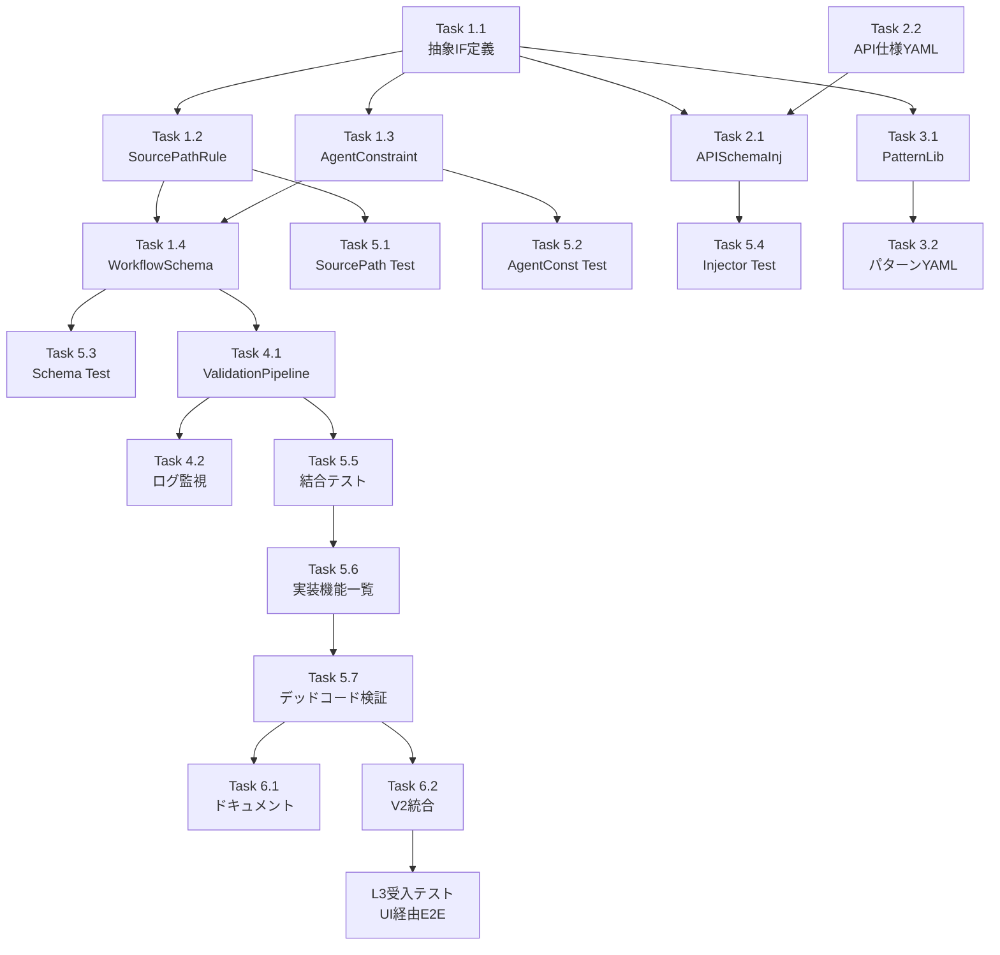

# 作業計画書: Issue #342 AIエージェントワークフロー生成改善

## Issue概要

```markdown
## Issue: refactor(expertAgent): Job/Task Generator Agent アーキテクチャ刷新 - ワークフロー生成品質改善
**Issue番号**: #342
**サイズ**: L
**作業見積**: 58時間（8日）
**優先度**: High
**依存Issue**: #338, #340
```

**スコープ**: 本作業計画は Issue #342 の一部として、**AI生成ワークフローの品質向上**に焦点を当てた実装計画です。

---

## 1. 背景と目的

### 1.1 発見された問題（8カテゴリ）

| # | カテゴリ | 重大度 | 対象コンポーネント |
|---|---------|--------|------------------|
| P1 | APIスキーマ誤り | Critical | APISchemaInjector |
| P2 | ソースパス参照誤り | Critical | SourcePathRuleEngine |
| P3 | stringTemplateAgent誤解 | Critical | AgentConstraintValidator |
| P4 | user_input型制約誤解 | Critical | AgentConstraintValidator |
| P5 | タイムアウト単位誤り | Major | AgentConstraintValidator |
| P6 | 環境変数URL使用 | Major | WorkflowSchemaValidator |
| P7 | 不要な中間ノード | Minor | 最適化（将来対応） |
| P8 | 記事コンテンツ未取得 | Critical | WorkflowPatternLibrary |

### 1.2 成功指標

| 指標 | 現状 | 目標 |
|------|------|------|
| ワークフロー生成成功率 | 30% | 90% |
| 初回実行成功率 | 10% | 70% |
| 検証エラー検出率 | 0% | 95% |

---

## 2. 詳細タスク分解

### Phase 1: 基盤実装（P0優先度）

#### Task 1.1: 抽象インターフェース定義
- **所要時間**: 2時間
- **成果物**: `expertAgent/aiagent/langgraph/jobGeneratorV2/validators/__init__.py`
- **依存**: なし
- **内容**:
  - `WorkflowValidator` 基底クラス
  - `PromptInjector` プロトコル
  - `PatternProvider` プロトコル

#### Task 1.2: SourcePathRuleEngine 実装
- **所要時間**: 4時間
- **成果物**: `expertAgent/aiagent/langgraph/jobGeneratorV2/validators/source_path_rule_engine.py`
- **依存**: Task 1.1
- **内容**:
  - パス検証ロジック（`:source.user_input.*`, `:source.job_params.*`）
  - パス生成ヘルパー
  - エラーメッセージ生成

#### Task 1.3: AgentConstraintValidator 実装
- **所要時間**: 6時間
- **成果物**: `expertAgent/aiagent/langgraph/jobGeneratorV2/validators/agent_constraint_validator.py`
- **依存**: Task 1.1
- **内容**:
  - stringTemplateAgent 制約（JavaScript式検出）
  - fetchAgent タイムアウト検証
  - URL環境変数検出
  - ReDoS対策付き正規表現

#### Task 1.4: WorkflowSchemaValidator 実装
- **所要時間**: 4時間
- **成果物**: `expertAgent/aiagent/langgraph/jobGeneratorV2/validators/workflow_schema_validator.py`
- **依存**: Task 1.2, Task 1.3
- **内容**:
  - ワークフロー全体のスキーマ検証
  - 複数バリデーターの統合呼び出し
  - エラー集約

### Phase 2: 入力強化（P0優先度）

#### Task 2.1: APISchemaInjector 実装
- **所要時間**: 6時間
- **成果物**: `expertAgent/aiagent/langgraph/jobGeneratorV2/injectors/api_schema_injector.py`
- **依存**: Task 1.1
- **内容**:
  - OpenAPIスキーマローダー
  - プロンプト注入ロジック
  - API仕様のMarkdown変換

#### Task 2.2: API仕様YAML作成
- **所要時間**: 3時間
- **成果物**: `expertAgent/aiagent/langgraph/jobGeneratorV2/schemas/available_apis.yaml`
- **依存**: なし
- **内容**:
  - `/utility/google_search` スキーマ
  - `/utility/json_stringify` スキーマ
  - `/utility/fetch_web_content` スキーマ
  - `/utility/extract_article_urls` スキーマ
  - `/aiagent/utility/jsonoutput` スキーマ

### Phase 3: パターンライブラリ（P1優先度）

#### Task 3.1: WorkflowPatternLibrary 実装
- **所要時間**: 6時間
- **成果物**: `expertAgent/aiagent/langgraph/jobGeneratorV2/patterns/workflow_pattern_library.py`
- **依存**: Task 1.1
- **内容**:
  - 標準パターン定義（search_and_summarize, search_fetch_summarize等）
  - パターン選択ロジック
  - テンプレート生成

#### Task 3.2: 標準パターンYAML作成
- **所要時間**: 4時間
- **成果物**: `expertAgent/aiagent/langgraph/jobGeneratorV2/patterns/templates/`
- **依存**: Task 3.1
- **内容**:
  - `search_and_summarize.yaml`
  - `search_fetch_summarize.yaml`
  - `api_transform_output.yaml`

### Phase 4: 統合パイプライン（P1優先度）

#### Task 4.1: ValidationPipeline 実装
- **所要時間**: 4時間
- **成果物**: `expertAgent/aiagent/langgraph/jobGeneratorV2/pipeline/validation_pipeline.py`
- **依存**: Task 1.2, Task 1.3, Task 1.4
- **内容**:
  - バリデーター実行順序管理
  - エラー集約・優先度付け
  - 検証結果レポート生成

#### Task 4.2: ログ・監視統合
- **所要時間**: 3時間
- **成果物**: `expertAgent/aiagent/langgraph/jobGeneratorV2/observability/validation_observer.py`
- **依存**: Task 4.1
- **内容**:
  - 構造化ログフォーマッター
  - Langfuse統合
  - メトリクス収集

### Phase 5: テスト実装（TDD）

#### Task 5.1: SourcePathRuleEngine 単体テスト
- **所要時間**: 2時間
- **成果物**: `expertAgent/tests/unit/test_job_generator_v2/test_source_path_rule_engine.py`
- **依存**: Task 1.2
- **カバレッジ目標**: 95%

#### Task 5.2: AgentConstraintValidator 単体テスト
- **所要時間**: 2時間
- **成果物**: `expertAgent/tests/unit/test_job_generator_v2/test_agent_constraint_validator.py`
- **依存**: Task 1.3
- **カバレッジ目標**: 95%

#### Task 5.3: WorkflowSchemaValidator 単体テスト
- **所要時間**: 2時間
- **成果物**: `expertAgent/tests/unit/test_job_generator_v2/test_workflow_schema_validator.py`
- **依存**: Task 1.4
- **カバレッジ目標**: 90%

#### Task 5.4: APISchemaInjector 単体テスト
- **所要時間**: 2時間
- **成果物**: `expertAgent/tests/unit/test_job_generator_v2/test_api_schema_injector.py`
- **依存**: Task 2.1
- **カバレッジ目標**: 90%

#### Task 5.5: ValidationPipeline 結合テスト
- **所要時間**: 3時間
- **成果物**: `expertAgent/tests/integration/test_validation_pipeline.py`
- **依存**: Task 4.1
- **シナリオ数**: 5

#### Task 5.6: 実装機能一覧の生成【必須】
- **所要時間**: 1時間
- **成果物**: `dev-reports/feature/issue/342/workflow-bug-analysis/implemented-features.json`
- **依存**: Phase 1-4 完了
- **内容**:
  - 新規追加した関数/クラス/定数の一覧化
  - `expected_callers`（呼び出し元）の明記
  - `integration_points`（統合箇所）の明記

#### Task 5.7: デッドコード検証【必須】（Issue #338教訓）
- **所要時間**: 2時間
- **成果物**: `dev-reports/feature/issue/342/workflow-bug-analysis/dead-code-verification.md`
- **依存**: Task 5.6
- **内容**:
  - 全実装機能の呼び出し確認（Grep）
  - 統合テストでの実際の使用確認
  - デッドコード検出スクリプト実行

**検証コマンド**:
```bash
# 新規関数の呼び出し確認
grep -rn "SourcePathRuleEngine" expertAgent/ --include="*.py" | grep -v "test_" | grep -v "__pycache__"
grep -rn "AgentConstraintValidator" expertAgent/ --include="*.py" | grep -v "test_" | grep -v "__pycache__"
grep -rn "WorkflowSchemaValidator" expertAgent/ --include="*.py" | grep -v "test_" | grep -v "__pycache__"
grep -rn "APISchemaInjector" expertAgent/ --include="*.py" | grep -v "test_" | grep -v "__pycache__"
grep -rn "ValidationPipeline" expertAgent/ --include="*.py" | grep -v "test_" | grep -v "__pycache__"
grep -rn "WorkflowPatternLibrary" expertAgent/ --include="*.py" | grep -v "test_" | grep -v "__pycache__"

# 定義のみで呼び出しがない関数を検出
# 各クラスがValidationPipelineまたはアダプターから呼び出されていることを確認
```

**デッドコード判定基準**:
| 状態 | 判定 | アクション |
|------|------|----------|
| テストのみで使用 | ⚠️ 要確認 | 本番コードパスでの使用を追加 |
| 定義のみ（呼び出しなし） | ❌ デッドコード | 統合コードを追加 |
| ValidationPipelineで使用 | ✅ OK | 問題なし |

### Phase 6: ドキュメント・統合

#### Task 6.1: GRAPHAI_WORKFLOW_GENERATION_RULES.md 更新
- **所要時間**: 2時間
- **成果物**: `graphAiServer/docs/GRAPHAI_WORKFLOW_GENERATION_RULES.md`
- **依存**: Task 1.2, Task 1.3
- **内容**:
  - ソースパスルール追加
  - stringTemplateAgent制限事項追加
  - timeout単位明記
  - 記事コンテンツ要約パターン追加

#### Task 6.2: V2統合（Feature Flag）
- **所要時間**: 2時間
- **成果物**: `expertAgent/aiagent/langgraph/jobGeneratorV2/adapter.py`
- **依存**: 全Phase完了
- **内容**:
  - V1互換アダプター
  - Feature flag (`USE_WORKFLOW_VALIDATION_V2`)
  - 段階的ロールアウト準備

---

## 3. タスク依存関係



---

## 4. 作業スケジュール

### Day 1 (8時間) - 基盤実装
| 時間 | タスク | 成果物 |
|------|--------|--------|
| 09:00-11:00 | Task 1.1 | 抽象インターフェース |
| 11:00-15:00 | Task 1.2 | SourcePathRuleEngine |
| 15:00-17:00 | Task 5.1 | SourcePath単体テスト |

### Day 2 (8時間) - バリデーター実装
| 時間 | タスク | 成果物 |
|------|--------|--------|
| 09:00-15:00 | Task 1.3 | AgentConstraintValidator |
| 15:00-17:00 | Task 5.2 | AgentConstraint単体テスト |

### Day 3 (8時間) - スキーマ検証・API注入
| 時間 | タスク | 成果物 |
|------|--------|--------|
| 09:00-13:00 | Task 1.4 | WorkflowSchemaValidator |
| 13:00-14:00 | Task 5.3 | Schema単体テスト |
| 14:00-17:00 | Task 2.2 | API仕様YAML |

### Day 4 (8時間) - インジェクター・パターン
| 時間 | タスク | 成果物 |
|------|--------|--------|
| 09:00-15:00 | Task 2.1 | APISchemaInjector |
| 15:00-17:00 | Task 5.4 | Injector単体テスト |

### Day 5 (8時間) - パターンライブラリ・統合
| 時間 | タスク | 成果物 |
|------|--------|--------|
| 09:00-15:00 | Task 3.1 | WorkflowPatternLibrary |
| 15:00-17:00 | Task 3.2 | パターンYAML (部分) |

### Day 6 (8時間) - 統合・テスト・ドキュメント
| 時間 | タスク | 成果物 |
|------|--------|--------|
| 09:00-11:00 | Task 3.2 | パターンYAML (残り) |
| 11:00-15:00 | Task 4.1 | ValidationPipeline |
| 15:00-17:00 | Task 4.2 | ログ監視統合 |

### Day 7 (8時間) - 最終統合・検証
| 時間 | タスク | 成果物 |
|------|--------|--------|
| 09:00-12:00 | Task 5.5 | 結合テスト |
| 13:00-14:00 | Task 5.6 | 実装機能一覧 |
| 14:00-16:00 | Task 5.7 | デッドコード検証 |
| 16:00-17:00 | Task 6.1 | ドキュメント更新 |

### Day 8 (4時間) - E2E検証・完了
| 時間 | タスク | 成果物 |
|------|--------|--------|
| 09:00-10:00 | Task 6.2 | V2統合・Feature Flag |
| 10:00-12:00 | L3受入テスト | UI経由E2E検証 |
| 13:00-14:00 | エビデンス収集 | スクリーンショット・ログ |

**総作業時間**: 58時間（約8日）

---

## 5. チェックポイント

| タイミング | 確認事項 | 対応 |
|-----------|---------|------|
| Day 1終了時 | SourcePathRuleEngine動作確認 | 単体テスト全パス |
| Day 2終了時 | AgentConstraintValidator動作確認 | 単体テスト全パス |
| Day 4終了時 | APISchemaInjector動作確認 | OpenAPIスキーマ読み込み確認 |
| Day 6終了時 | ValidationPipeline動作確認 | 複数エラー検出確認 |
| Day 7終了時 | 全テストパス | カバレッジ90%達成 |
| Day 8終了時 | E2E検証完了 | UI経由ジョブ生成・実行成功、エビデンス収集完了 |

---

## 6. リスクと対策

| リスク | 発生確率 | 影響 | 対策 |
|-------|---------|------|------|
| 正規表現パターンのReDoS | 低 | セキュリティ脆弱性 | 安全なパターン使用、入力長制限 |
| OpenAPIスキーマ解析複雑 | 中 | 実装遅延2日 | 最小限の解析に限定、段階的拡張 |
| 既存V1との互換性問題 | 中 | 本番影響 | Feature flag、段階的ロールアウト |
| カバレッジ目標未達 | 低 | 品質低下 | TDD徹底、レビュー時確認 |

---

## 7. 成果物チェックリスト

### コード
- [ ] `validators/__init__.py` - 抽象インターフェース
- [ ] `validators/source_path_rule_engine.py`
- [ ] `validators/agent_constraint_validator.py`
- [ ] `validators/workflow_schema_validator.py`
- [ ] `injectors/api_schema_injector.py`
- [ ] `patterns/workflow_pattern_library.py`
- [ ] `patterns/templates/*.yaml`
- [ ] `pipeline/validation_pipeline.py`
- [ ] `observability/validation_observer.py`
- [ ] `adapter.py` - V2統合アダプター

### スキーマ・設定
- [ ] `schemas/available_apis.yaml`

### テスト
- [ ] `tests/unit/test_job_generator_v2/test_source_path_rule_engine.py`
- [ ] `tests/unit/test_job_generator_v2/test_agent_constraint_validator.py`
- [ ] `tests/unit/test_job_generator_v2/test_workflow_schema_validator.py`
- [ ] `tests/unit/test_job_generator_v2/test_api_schema_injector.py`
- [ ] `tests/integration/test_validation_pipeline.py`

### デッドコード検証【必須】
- [ ] `dev-reports/feature/issue/342/workflow-bug-analysis/implemented-features.json`
- [ ] `dev-reports/feature/issue/342/workflow-bug-analysis/dead-code-verification.md`

### ドキュメント
- [ ] `graphAiServer/docs/GRAPHAI_WORKFLOW_GENERATION_RULES.md` 更新

### E2Eエビデンス【必須】
- [ ] ジョブ生成画面スクリーンショット（generate画面）
- [ ] ジョブ実行結果スクリーンショット（runs画面）
- [ ] `/tmp/issue342-evidence/job_status.json`
- [ ] `/tmp/issue342-evidence/dead_code_check.txt`

---

## 8. L3受入テスト計画【必須】

### Step 1: サービス起動確認

```bash
# サービス起動
./scripts/dev-hybrid.sh

# ヘルスチェック
curl -sf http://localhost:8004/health && echo "✅ expertAgent: healthy"
curl -sf http://localhost:8001/health && echo "✅ jobqueue: healthy"
curl -sf http://localhost:8005/health && echo "✅ graphAiServer: healthy"
curl -sf http://localhost:8000 && echo "✅ myAgentDesk: healthy"
```

### Step 2: 検証パイプライン単体テスト

```bash
# 単体テスト実行（カバレッジ90%確認）
cd expertAgent
PYTHONPATH=. uv run pytest tests/unit/test_job_generator_v2/ -v --cov=aiagent/langgraph/jobGeneratorV2 --cov-report=term-missing

# 期待結果:
# - 全テストパス
# - カバレッジ 90%以上
```

### Step 3: 結合テスト

```bash
# 結合テスト実行
PYTHONPATH=. uv run pytest tests/integration/test_validation_pipeline.py -v

# 期待結果:
# - 5シナリオ全パス
```

### Step 4: デッドコード検証【必須】

```bash
# 新規クラスの呼び出し確認（テスト以外で使用されているか）
echo "=== SourcePathRuleEngine 呼び出し確認 ==="
grep -rn "SourcePathRuleEngine" expertAgent/ --include="*.py" | grep -v "test_" | grep -v "__pycache__" | grep -v "def class"

echo "=== AgentConstraintValidator 呼び出し確認 ==="
grep -rn "AgentConstraintValidator" expertAgent/ --include="*.py" | grep -v "test_" | grep -v "__pycache__"

echo "=== WorkflowSchemaValidator 呼び出し確認 ==="
grep -rn "WorkflowSchemaValidator" expertAgent/ --include="*.py" | grep -v "test_" | grep -v "__pycache__"

echo "=== APISchemaInjector 呼び出し確認 ==="
grep -rn "APISchemaInjector" expertAgent/ --include="*.py" | grep -v "test_" | grep -v "__pycache__"

echo "=== ValidationPipeline 呼び出し確認 ==="
grep -rn "ValidationPipeline" expertAgent/ --include="*.py" | grep -v "test_" | grep -v "__pycache__"

# 期待結果:
# - 各クラスがValidationPipelineまたはadapter.pyから呼び出されている
# - テストのみで使用されている場合は❌デッドコード
```

### Step 5: E2E ジョブ生成テスト（UI経由）【必須】

**ブラウザで以下のURLにアクセス**:

```
http://localhost:8000/projects/proj_mjbjua2z7y65wy/workbenches/wb_1766969315404_udrhx79/generate
```

**テストシナリオ**:

1. **ユーザー要件入力**:
   ```
   「大谷翔平の妻」についてGoogle検索し、検索結果上位の記事を取得して内容を要約し、メールで送信する
   ```

2. **「ジョブ生成」ボタンをクリック**

3. **確認項目**:
   | 項目 | 期待値 |
   |------|--------|
   | ジョブ生成成功 | エラーなく完了 |
   | タスク数 | 3つ（検索→要約→送信） |
   | ワークフローYAML | 正しい形式で表示 |
   | ソースパス | `:source.user_input.*` 形式 |
   | タイムアウト | ミリ秒単位（30000等） |

4. **スクリーンショット保存**:
   - ジョブ生成結果画面

### Step 6: E2E ジョブ実行テスト（UI経由）【必須】

**ブラウザで以下のURLにアクセス**:

```
http://localhost:8000/projects/proj_mjbjua2z7y65wy/workbenches/wb_1766969315404_udrhx79/runs
```

**テストシナリオ**:

1. **Step 5で生成したジョブを選択**

2. **「実行」ボタンをクリック**

3. **確認項目**:
   | 項目 | 期待値 |
   |------|--------|
   | Task 1 (Google検索) | ✅ 成功（search_results取得） |
   | Task 2 (記事取得・要約) | ✅ 成功（記事コンテンツを含む要約） |
   | Task 3 (メール送信) | ✅ 成功（メール送信完了） |
   | 全体ステータス | completed |

4. **出力確認**:
   - Task 2の出力に**記事の本文内容**が含まれていること
   - 単なる検索スニペットの再整形ではないこと

5. **スクリーンショット保存**:
   - ジョブ実行結果画面（各タスクの出力）

### Step 7: Langfuseトレース確認

```bash
# Langfuseにアクセスしてトレースを確認
echo "Langfuse UI: http://localhost:3001"

# 確認項目:
# - workflow_validation スコアが記録されている
# - validation_errors イベントが記録されている（エラー時）
# - 各タスクの実行時間が記録されている
```

### Step 8: 検証エラー検出確認（異常系）

```bash
# 意図的に不正なワークフローを生成させる（APIテスト）
curl -s -X POST http://localhost:8004/v1/jobs/generate \
  -H "Content-Type: application/json" \
  -d '{
    "user_input": "テスト",
    "project": "default",
    "_test_inject_invalid_workflow": true
  }' | jq .

# 期待結果:
# - validation_errors に検出されたエラーが含まれる
# - エラーメッセージが具体的（パス誤り、timeout単位等）
```

### Step 9: エビデンス収集

```bash
# テスト結果をファイルに保存
mkdir -p /tmp/issue342-evidence

# API経由でジョブ情報取得（UIで確認したジョブID）
JOB_ID="<Step 5で生成されたジョブID>"
curl -s "http://localhost:8004/v1/jobs/${JOB_ID}/status" > /tmp/issue342-evidence/job_status.json

# ログ確認
tail -100 expertAgent/logs/expertagent.log | grep -E "(validation|workflow)" > /tmp/issue342-evidence/validation_logs.txt

# デッドコード検証結果
echo "=== デッドコード検証結果 ===" > /tmp/issue342-evidence/dead_code_check.txt
grep -rn "ValidationPipeline" expertAgent/aiagent/ --include="*.py" >> /tmp/issue342-evidence/dead_code_check.txt

echo "エビデンス収集完了:"
ls -la /tmp/issue342-evidence/
```

---

## 9. Definition of Done

### 必須条件
- [ ] すべてのタスクが完了
- [ ] 単体テストカバレッジ90%以上
- [ ] 結合テスト全シナリオパス
- [ ] **デッドコード検証パス**（全クラスがValidationPipelineから呼び出されている）
- [ ] **L3受入テスト全パス**
  - [ ] UI経由ジョブ生成成功（Step 5）
  - [ ] UI経由ジョブ実行成功（Step 6）
  - [ ] 記事コンテンツを含む要約が生成される
- [ ] CI/CDグリーン
- [ ] コードレビュー承認
- [ ] ドキュメント更新完了
- [ ] Feature flag設定済み

### 品質基準
- [ ] ワークフロー生成成功率 90%以上（サンプル10件）
- [ ] 検証エラー検出率 95%以上（意図的なエラー注入テスト）
- [ ] 静的解析エラーゼロ（Ruff、MyPy）
- [ ] デッドコード 0件（テスト以外で全クラス/関数が使用されている）

### デッドコード防止チェックリスト（Issue #338教訓）
- [ ] 新規クラスがValidationPipelineまたはadapter.pyから呼び出されている
- [ ] 新規関数がテスト以外のコードパスで使用されている
- [ ] 定数/設定がプロンプトまたはバリデーションロジックで参照されている
- [ ] implemented-features.json に全実装機能が記載されている
- [ ] dead-code-verification.md で検証結果が記録されている

---

## 10. 次のアクション

作業計画承認後：

1. **ブランチ確認**: 現在 `develop` ブランチで作業中
2. **タスク実行**: Phase 1から順次実装
3. **進捗報告**: `/progress-report`で定期報告
4. **PR作成**: 全タスク完了後、`/pm-create-pr`でPR作成

---

## 付録: 関連ドキュメント

- [設計方針書](./ai-agent-improvement-design-policy.md)
- [総合分析レポート](./comprehensive-analysis-summary.md)
- [Issue #342 本体](https://github.com/kewton/MySwiftAgent/issues/342)
- [GRAPHAI_WORKFLOW_GENERATION_RULES.md](../../../../graphAiServer/docs/GRAPHAI_WORKFLOW_GENERATION_RULES.md)
