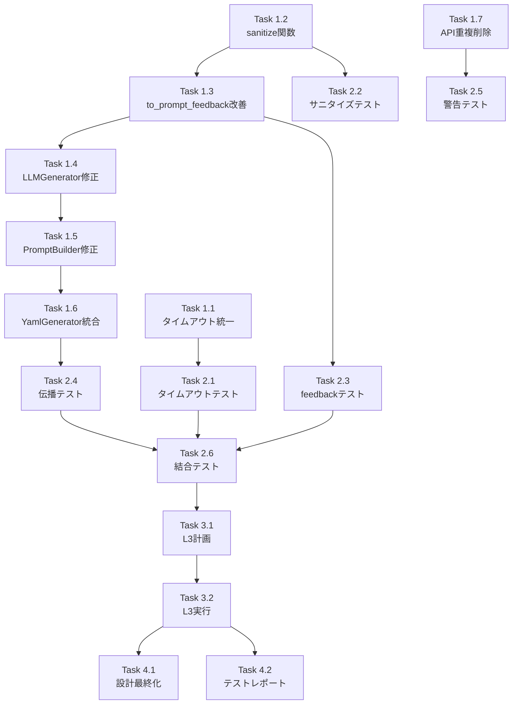

# 作業計画書: Issue #343 V2 Workflow Generator 品質改善

## Issue: V2 Workflow Generator 品質改善: タイムアウト単位・エラーフィードバック・プロンプト重複

**Issue番号**: #343
**サイズ**: M
**優先度**: High
**依存Issue**: #342（完了済み）

---

## 参照ドキュメント

| ドキュメント | 状態 | 備考 |
|------------|------|------|
| `dev-reports/feature/issue/343/design-policy.md` | ✅ 承認済み | 設計方針書 |
| `dev-reports/feature/issue/343/architecture-review.md` | ✅ 承認済み | アーキテクチャレビュー（5/5） |
| `dev-reports/feature/issue/342/architecture-design.md` | 参照 | V2基盤アーキテクチャ |

---

## 詳細タスク分解

### Phase 1: 実装タスク

#### Task 1.1: タイムアウト単位統一（プロンプト修正）

- **所要時間**: 1時間
- **成果物**:
  - `expertAgent/aiagent/langgraph/jobGeneratorV2/workflows/workflow_gen/prompt_builder/rules/agent_rules.py`
- **依存**: なし
- **内容**:
  - `timeout: 30` → `timeout: 30000` に変更
  - 説明文に「milliseconds」を明記
  - すべてのtimeout例をミリ秒単位に統一

#### Task 1.2: セキュリティ機能実装（sanitize_error_message）

- **所要時間**: 1.5時間
- **成果物**:
  - `expertAgent/aiagent/langgraph/jobGeneratorV2/validators/__init__.py`
- **依存**: なし
- **内容**:
  - `sanitize_error_message()` 関数の実装
  - `SENSITIVE_PATTERNS` 定義（ユーザーパス、トークン、パスワード）
  - 制御文字の除去、特殊文字エスケープ
  - 長さ制限（MAX_MESSAGE_LENGTH = 500）

#### Task 1.3: ValidationResult.to_prompt_feedback() 改善

- **所要時間**: 2時間
- **成果物**:
  - `expertAgent/aiagent/langgraph/jobGeneratorV2/pipeline/validation_pipeline.py`
- **依存**: Task 1.2
- **内容**:
  - `to_prompt_feedback(max_errors=5, max_total_length=2000)` シグネチャ追加
  - エラーの重大度順ソート（critical → major → minor）
  - サニタイズ処理の呼び出し
  - 長さ制限と切り詰め処理

#### Task 1.4: LLMGenerator パラメータ追加

- **所要時間**: 1.5時間
- **成果物**:
  - `expertAgent/aiagent/langgraph/jobGeneratorV2/workflows/workflow_gen/llm_generator.py`
- **依存**: Task 1.3
- **内容**:
  - `generate_from_task()` に `error_feedback: str = ""` パラメータ追加
  - `prompt_builder.build()` への `error_feedback` 渡し

#### Task 1.5: PromptBuilder パラメータ追加

- **所要時間**: 1時間
- **成果物**:
  - `expertAgent/aiagent/langgraph/jobGeneratorV2/workflows/workflow_gen/prompt_builder/__init__.py`
  - `expertAgent/aiagent/langgraph/jobGeneratorV2/workflows/workflow_gen/prompt_builder/assembler.py`
- **依存**: Task 1.4
- **内容**:
  - `build()` に `error_feedback: str = ""` パラメータ追加
  - `assemble_prompt()` に `error_feedback` パラメータ追加
  - `WorkflowPrompt.error_feedback` フィールドへの設定

#### Task 1.6: YamlGenerator エラーフィードバック統合

- **所要時間**: 2時間
- **成果物**:
  - `expertAgent/aiagent/langgraph/jobGeneratorV2/workflows/workflow_gen/yaml_generator.py`
- **依存**: Task 1.5
- **内容**:
  - リトライループ内で `validation_result.to_prompt_feedback()` 呼び出し
  - `llm_generator.generate_from_task(..., error_feedback=error_feedback)` 渡し
  - 初回生成時は `error_feedback=""` を明示

#### Task 1.7: API情報重複削除（Phase 1: 非推奨化）

- **所要時間**: 1.5時間
- **成果物**:
  - `expertAgent/aiagent/langgraph/jobGeneratorV2/workflows/workflow_gen/prompt_builder/assembler.py`
- **依存**: なし
- **内容**:
  - `recommended_apis` と `api_mappings` 両方提供時の警告追加
  - `APISchemaInjector` の結果を優先使用
  - `api_constraints` セクションのシンプル化

---

### Phase 2: TDD テストタスク（CI実行可能）

#### Task 2.1: タイムアウト単位テスト

- **所要時間**: 1時間
- **成果物**:
  - `expertAgent/tests/unit/test_job_generator_v2/test_timeout_unit.py`
- **カバレッジ目標**: 95%
- **テスト内容**:
  - プロンプト内のtimeoutが30000（ミリ秒）であること
  - 説明文に "milliseconds" が含まれること
  - バリデータがミリ秒値を正常に受け入れること

#### Task 2.2: エラーサニタイズテスト

- **所要時間**: 1.5時間
- **成果物**:
  - `expertAgent/tests/unit/test_job_generator_v2/test_error_sanitize.py`
- **カバレッジ目標**: 95%
- **テスト内容**:
  - `sanitize_error_message()` が機密情報をマスクすること
  - 制御文字が除去されること
  - 長さ制限が適用されること
  - 特殊文字がエスケープされること

#### Task 2.3: ValidationResult.to_prompt_feedback テスト

- **所要時間**: 1.5時間
- **成果物**:
  - `expertAgent/tests/unit/test_job_generator_v2/test_prompt_feedback.py`
- **カバレッジ目標**: 90%
- **テスト内容**:
  - max_errors 制限が機能すること
  - max_total_length 制限が機能すること
  - エラーが重大度順にソートされること
  - サニタイズが適用されること

#### Task 2.4: エラーフィードバック伝播テスト

- **所要時間**: 2時間
- **成果物**:
  - `expertAgent/tests/unit/test_job_generator_v2/test_error_feedback_propagation.py`
- **カバレッジ目標**: 90%
- **テスト内容**:
  - `LLMGenerator.generate_from_task()` が `error_feedback` を受け取ること
  - `PromptBuilder.build()` が `error_feedback` を渡すこと
  - `WorkflowPrompt.error_feedback` に値が設定されること
  - リトライ時に前回エラーがフィードバックに含まれること

#### Task 2.5: API情報重複警告テスト

- **所要時間**: 1時間
- **成果物**:
  - `expertAgent/tests/unit/test_job_generator_v2/test_api_info_deduplication.py`
- **カバレッジ目標**: 90%
- **テスト内容**:
  - 重複時に `DeprecationWarning` が出力されること
  - `APISchemaInjector` が優先されること

#### Task 2.6: 結合テスト（LLMリトライフロー）

- **所要時間**: 2時間
- **成果物**:
  - `expertAgent/tests/integration/test_issue_343_llm_retry_flow.py`
- **シナリオ数**: 3
- **テスト内容**:
  - バリデーション失敗 → エラーフィードバック生成 → リトライ
  - フィードバックがプロンプトに含まれること
  - 2回目以降のリトライでフィードバックが更新されること

---

### Phase 3: L3ローカル受入テスト【必須】

#### Task 3.1: L3受入テスト計画

- **所要時間**: 0.5時間
- **成果物**: 受入テストシナリオ（本セクション参照）

#### Task 3.2: L3受入テスト実行

- **所要時間**: 1.5時間
- **成果物**:
  - `expertAgent/tests/acceptance/test_issue_343_workflow_quality.py`
- **必須内容**:
  - サービス起動確認
  - 実際のJob Generator API呼び出し
  - LLMリトライフロー確認
  - エビデンス収集

---

### Phase 4: ドキュメントタスク

#### Task 4.1: 設計ドキュメント最終化

- **所要時間**: 0.5時間
- **成果物**: `dev-reports/feature/issue/343/design-policy.md` 更新
- **内容**: 実装結果の反映、変更点の追記

#### Task 4.2: テスト結果レポート

- **所要時間**: 0.5時間
- **成果物**: `dev-reports/feature/issue/343/test-report.md`
- **内容**: テストカバレッジ、受入テスト結果

---

## タスク依存関係



---

## 作業スケジュール

### Day 1 (8時間)

| 時間 | タスク | 成果物 |
|------|-------|--------|
| 09:00-10:00 | Task 1.1（タイムアウト統一） | agent_rules.py |
| 10:00-11:30 | Task 1.2（sanitize関数） | validators/__init__.py |
| 11:30-12:00 | Task 2.1（タイムアウトテスト） | test_timeout_unit.py |
| 13:00-15:00 | Task 1.3（to_prompt_feedback改善） | validation_pipeline.py |
| 15:00-16:30 | Task 2.2, 2.3（サニタイズ・feedbackテスト） | test_error_sanitize.py, test_prompt_feedback.py |
| 16:30-18:00 | Task 1.4, 1.5（LLMGenerator/PromptBuilder修正） | llm_generator.py, assembler.py |

### Day 2 (6時間)

| 時間 | タスク | 成果物 |
|------|-------|--------|
| 09:00-11:00 | Task 1.6（YamlGenerator統合） | yaml_generator.py |
| 11:00-12:30 | Task 1.7（API重複削除） | assembler.py |
| 13:30-15:30 | Task 2.4（伝播テスト） | test_error_feedback_propagation.py |
| 15:30-16:30 | Task 2.5（警告テスト） | test_api_info_deduplication.py |
| 16:30-18:30 | Task 2.6（結合テスト） | test_issue_343_llm_retry_flow.py |

### Day 3 (3時間)

| 時間 | タスク | 成果物 |
|------|-------|--------|
| 09:00-09:30 | Task 3.1（L3計画確認） | - |
| 09:30-11:00 | Task 3.2（L3実行） | test_issue_343_workflow_quality.py |
| 11:00-12:00 | Task 4.1, 4.2（ドキュメント・PR作成） | 各種md |

**総作業時間**: 17時間（約2.5日）

---

## L3受入テスト計画【必須セクション】

### Step 1: サービス起動確認

```bash
# サービス起動（ハイブリッドモード推奨）
./scripts/dev-hybrid.sh

# ヘルスチェック
curl -sf http://localhost:8004/health && echo "✅ expertAgent: healthy"
curl -sf http://localhost:8001/health && echo "✅ jobqueue: healthy"
curl -sf http://localhost:8003/health && echo "✅ myVault: healthy"
```

### Step 2: Job Generator API 呼び出し（エラーフィードバック確認）

```bash
# Job Generation リクエスト（LLM呼び出しあり）
curl -s -X POST http://localhost:8004/v1/job-generator/generate \
  -H "Content-Type: application/json" \
  -d '{
    "user_requirement": "毎日9時にGoogle Driveからファイル一覧を取得し、新規ファイルがあればSlackに通知する",
    "project_id": "test-project",
    "max_tasks": 3
  }' | jq .

# 期待するレスポンス:
# - HTTPステータス: 200
# - status: "success" または "partial_success"
# - workflow_yaml が生成されていること
```

### Step 3: バリデーションエラー時のリトライ確認

```bash
# サーバーログでリトライ動作を確認
tail -100 expertAgent/logs/expertagent.log | grep -E "(retry|error_feedback|ValidationError)"

# 期待する動作:
# 1. バリデーションエラー発生時に "error_feedback" がログに出現
# 2. リトライ時に "Previous Generation Errors" がプロンプトに含まれる
```

### Step 4: タイムアウト単位確認

```bash
# 生成されたYAMLのtimeout値を確認
curl -s -X POST http://localhost:8004/v1/job-generator/generate \
  -H "Content-Type: application/json" \
  -d '{
    "user_requirement": "Google Calendarからイベント一覧を取得する",
    "project_id": "test-project",
    "max_tasks": 1
  }' | jq '.workflow_yaml' | grep -i timeout

# 期待する結果:
# - timeout値が1000以上（ミリ秒単位）であること
# - 30などの秒単位の値が出現しないこと
```

### Step 5: エビデンス収集

```bash
# レスポンスをファイルに保存
curl -s -X POST http://localhost:8004/v1/job-generator/generate \
  -H "Content-Type: application/json" \
  -d '{
    "user_requirement": "テスト用のワークフロー生成",
    "project_id": "test-project",
    "max_tasks": 2
  }' > /tmp/issue_343_acceptance_response.json

# 確認
cat /tmp/issue_343_acceptance_response.json | jq '.status, .workflow_yaml | length'
```

---

## チェックポイント

| タイミング | 確認事項 | 対応 |
|-----------|---------|------|
| Task 1.3完了時 | `to_prompt_feedback()` がサニタイズを適用 | 単体テスト実行 |
| Task 1.6完了時 | リトライフローでフィードバックが渡る | ログ確認 |
| Phase 2完了時 | カバレッジ90%以上 | `pytest --cov` 実行 |
| Phase 3完了時 | L3テスト全パス | 実サービス確認 |

---

## リスクと対策

| リスク | 発生確率 | 影響 | 対策 |
|-------|---------|------|------|
| LLM API レート制限 | 中 | テスト遅延 | モック使用、APIキー確認 |
| フィードバック形式でLLM混乱 | 低 | 品質低下 | フィードバック簡潔化 |
| 既存テスト破損 | 低 | CI失敗 | 既存テスト確認後に修正 |

---

## 成果物チェックリスト

### コード

- [ ] `validators/__init__.py` - `sanitize_error_message()` 追加
- [ ] `pipeline/validation_pipeline.py` - `to_prompt_feedback()` 改善
- [ ] `prompt_builder/rules/agent_rules.py` - タイムアウトミリ秒化
- [ ] `workflows/workflow_gen/llm_generator.py` - パラメータ追加
- [ ] `workflows/workflow_gen/prompt_builder/assembler.py` - パラメータ追加、API重複警告
- [ ] `workflows/workflow_gen/yaml_generator.py` - エラーフィードバック統合

### テスト

- [ ] `tests/unit/test_job_generator_v2/test_timeout_unit.py`
- [ ] `tests/unit/test_job_generator_v2/test_error_sanitize.py`
- [ ] `tests/unit/test_job_generator_v2/test_prompt_feedback.py`
- [ ] `tests/unit/test_job_generator_v2/test_error_feedback_propagation.py`
- [ ] `tests/unit/test_job_generator_v2/test_api_info_deduplication.py`
- [ ] `tests/integration/test_issue_343_llm_retry_flow.py`
- [ ] `tests/acceptance/test_issue_343_workflow_quality.py`

### ドキュメント

- [ ] `dev-reports/feature/issue/343/design-policy.md` 更新
- [ ] `dev-reports/feature/issue/343/test-report.md`

---

## Definition of Done

Issue完了条件：

- [ ] すべての実装タスクが完了
- [ ] 単体テストカバレッジ90%以上
- [ ] 結合テスト全シナリオパス
- [ ] **L3受入テスト全パス**（実サービス起動・API呼び出し確認）
- [ ] CI/CDグリーン
- [ ] コードレビュー承認
- [ ] ドキュメント更新完了

### 受入条件（Issue記載）との対応

| 受入条件 | 検証タスク |
|---------|-----------|
| タイムアウト単位がプロンプトとバリデータで統一 | Task 2.1, L3 Step 4 |
| LLMリトライ時にエラーフィードバックが渡される | Task 2.4, Task 2.6, L3 Step 3 |
| API情報ソースが整理・統合されている | Task 2.5 |
| 単体テストで上記が検証される | Phase 2 全タスク |
| 結合テストでLLM生成→検証→リトライフローが正常動作 | Task 2.6, L3 Step 2 |

---

## 次のアクション

作業計画承認後：

1. **ブランチ作成**: `issue/343-v2-workflow-quality`
2. **worktree作成**（推奨）: 並列作業時
3. **TDD開始**: Phase 1 + Phase 2 を交互に実施
4. **進捗報告**: `/progress-report` で定期報告

---

**作成日**: 2026-01-09
**作成者**: Claude Code
**対象Issue**: #343
