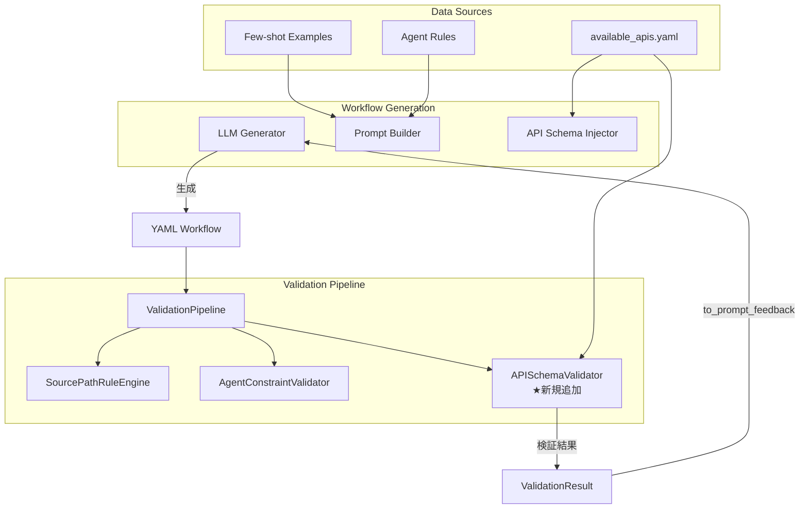

# 設計方針書: Issue #344 - APIスキーマ検証機構の実装とプロンプト整合性改善

## 概要

- **作成日**: 2026-01-09
- **対象Issue**: #344 - V2 Workflow Generator: APIスキーマ検証機構の実装とプロンプト整合性改善
- **対象プロジェクト**: expertAgent
- **ラベル**: `bug`, `enhancement`

---

## 現状調査サマリ

### 対象プロジェクト
- **プロジェクト名**: expertAgent
- **主要モジュール**: `aiagent/langgraph/jobGeneratorV2/validators/`

### 発生した問題

Google Search API呼び出しでHTTP 422エラーが発生:

| 生成されたパラメータ | 正しいパラメータ | エラー種別 |
|-------------------|----------------|----------|
| `query` (string) | `queries` (array) | パラメータ名・型不一致 |
| `num_results` | `num` | パラメータ名不一致 |
| `:source.query` | `:source.user_input.query` | パス参照不一致 |

### 根本原因

1. **プロンプト内の矛盾する情報**: Few-shot examplesとAgent Rulesが古い形式（単数形）を示す一方、APIスキーマは新しい形式（複数形）を要求
2. **検証機構の欠落**: bodyパラメータとAPIスキーマの整合性を検証する機構が存在しない

### 既存アーキテクチャパターン

| パターン | 使用箇所 | 目的 |
|---------|---------|------|
| **Strategy Pattern** | `WorkflowValidator` 基底クラス | 異なる検証ロジックを交換可能にする |
| **Observer Pattern** | `ValidationPipeline` | 検証結果をLangfuseに送信 |
| **Composite Pattern** | `ValidationPipeline.validators` | 複数バリデーターを統一的に扱う |
| **Dataclass** | `ValidationError`, `ValidationResult` | 構造化されたエラー情報 |

### 既存バリデーターの構成

```
ValidationPipeline
├── SourcePathRuleEngine      → パス参照検証 (:source.user_input.*, etc.)
├── AgentConstraintValidator  → Agent固有制約 (timeout, env vars, JS式)
└── [未実装] APISchemaValidator → APIスキーマ検証 ← 今回追加
```

### 類似機能の設計

#### WorkflowValidator 基底クラス（validators/__init__.py）

```python
class WorkflowValidator(ABC):
    @abstractmethod
    def validate(self, workflow: dict[str, Any]) -> list[ValidationError]:
        pass
```

#### ValidationError データクラス

```python
@dataclass
class ValidationError:
    code: ValidationErrorCode
    message: str
    location: str         # e.g., 'nodes.search.agent'
    suggestion: str = ""
    severity: str = "major"  # "critical", "major", "minor"
```

#### ValidationResult データクラス

```python
@dataclass
class ValidationResult:
    is_valid: bool
    errors: list[ValidationError]

    def to_prompt_feedback(self, max_errors: int = 5, max_total_length: int = 2000) -> str:
        # LLMリトライ用にエラーをフォーマット
```

### モジュール間依存関係

```
yaml_generator.py
    ├── LLMGenerator
    │   └── PromptBuilder
    │       ├── APISchemaInjector  ← API仕様注入
    │       └── assembler.py       ← プロンプト組み立て
    └── ValidationPipeline         ← 検証オーケストレータ
        ├── SourcePathRuleEngine
        ├── AgentConstraintValidator
        └── [NEW] APISchemaValidator
```

### 既存API設計パターン

- **エンドポイント命名規則**: `/aiagent-api/v1/{category}/{operation}`
- **レスポンス形式**: JSON（エラー時は`ValidationError`リスト）
- **エラーハンドリング**: `ValidationErrorCode` enumによる分類

### 参照したドキュメント

| ドキュメント | 関連内容 |
|-------------|---------|
| `docs/spec/job-generation-workflow.md` | 7段階LangGraphワークフロー、V2 Job Generator仕様 |
| `docs/arch/service-dependencies.md` | マイクロサービス構成、サービス間通信 |
| `validators/__init__.py` | WorkflowValidator基底クラス、ValidationError/Result |
| `validation_pipeline.py` | ValidationPipelineオーケストレータ |
| `api_schema_injector.py` | APISchemaInjectorの実装パターン |

### 設計上の制約

1. **既存パターン踏襲**: WorkflowValidator基底クラスを継承すること
2. **ValidationPipeline統合**: 既存のvalidatorsリストに追加する形式
3. **エラーコード体系**: ValidationErrorCode enumに新規コード追加
4. **Langfuse連携**: 検証結果をObservabilityに送信

---

## 1. アーキテクチャ設計

### システム構成図



### レイヤー構成

既存のV2 Job Generatorレイヤー構成に準拠:

| レイヤー | 責務 | 関連ファイル |
|---------|------|-------------|
| **生成層** | LLMによるYAML生成 | `llm_generator.py`, `yaml_generator.py` |
| **プロンプト層** | プロンプト構築・情報注入 | `prompt_builder/`, `injectors/` |
| **検証層** | 生成物の検証 | `validators/`, `validation_pipeline.py` |
| **スキーマ層** | API仕様定義 | `schemas/available_apis.yaml` |

---

## 2. 技術選定

| カテゴリ | 選定技術 | 選定理由 | 既存との整合性 |
|---------|---------|---------|---------------|
| 言語 | Python 3.11+ | 既存スタック | ✅ 完全整合 |
| 基底クラス | WorkflowValidator (ABC) | 既存パターン | ✅ 完全整合 |
| データクラス | @dataclass | 既存パターン | ✅ 完全整合 |
| スキーマ形式 | YAML | 既存available_apis.yaml | ✅ 完全整合 |
| 正規表現 | re (標準ライブラリ) | 既存使用 | ✅ 完全整合 |
| テスト | pytest + pytest-cov | 既存スタック | ✅ 完全整合 |

---

## 3. 設計パターン

既存コードベースで使用されているパターンを踏襲:

### 3.1 Strategy Pattern（継続使用）

```python
# 新規バリデーター: WorkflowValidator基底クラスを継承
class APISchemaValidator(WorkflowValidator):
    def validate(self, workflow: dict[str, Any]) -> list[ValidationError]:
        # API スキーマとbodyパラメータの検証
        pass
```

### 3.2 Observer Pattern（継続使用）

ValidationPipelineの既存Observer機構を活用:

```python
# ValidationPipeline内
for validator in self.validators:
    errors = validator.validate(workflow)
    self._notify_observers(errors)  # Langfuse送信
```

### 3.3 新規パターン導入なし

既存パターンで全要件を満たせるため、新規パターンは導入しない。

---

## 4. データモデル設計

### 4.1 ValidationErrorCode 拡張

```python
class ValidationErrorCode(Enum):
    # 既存コード
    INVALID_SOURCE_PATH = "invalid_source_path"
    INVALID_TIMEOUT = "invalid_timeout"
    JS_EXPRESSION_IN_TEMPLATE = "js_expression_in_template"
    ENV_VAR_IN_URL = "env_var_in_url"

    # 新規追加
    UNKNOWN_API_PARAMETER = "unknown_api_parameter"       # 未定義パラメータ
    MISSING_REQUIRED_PARAMETER = "missing_required_param" # 必須パラメータ欠落
    PARAMETER_TYPE_MISMATCH = "parameter_type_mismatch"  # 型不一致
    PARAMETER_NAME_MISMATCH = "parameter_name_mismatch"  # 名前類似（typo検出）
```

### 4.2 APIスキーマ構造

```yaml
# schemas/available_apis.yaml (既存ファイル拡張)
apis:
  google_search:
    endpoint: /v1/utility/google_search
    method: POST
    request_schema:
      queries:
        type: array
        items: string
        required: true
        description: "検索クエリの配列"
      num:
        type: integer
        required: false
        default: 3
        max: 10
        description: "結果件数"
    response_schema:
      results:
        type: array
        description: "検索結果リスト"
      search_results_count:
        type: integer
```

### 4.3 類似パラメータ名マッピング

```python
# よくある間違いの検出用
PARAMETER_ALIASES = {
    "google_search": {
        "query": "queries",      # 単数形 → 複数形
        "num_results": "num",    # 長い名前 → 短縮形
        "count": "num",          # 別名
    },
    "gmail_search": {
        "max": "max_results",
        "limit": "max_results",
    }
}
```

---

## 5. API設計（内部インターフェース）

### 5.1 APISchemaValidator クラス

```python
class APISchemaValidator(WorkflowValidator):
    """
    ワークフローのbodyパラメータをAPIスキーマと照合するバリデーター。

    検証項目:
    - パラメータ名がAPIスキーマに定義されているか
    - パラメータ型が一致するか（array vs string）
    - 必須パラメータがすべて含まれているか
    - 類似パラメータ名の検出（typo修正提案）
    """

    def __init__(self, api_specs: dict[str, APISpec] | None = None):
        """
        Args:
            api_specs: APIスキーマ定義。Noneの場合はデフォルトをロード
        """
        pass

    def validate(self, workflow: dict[str, Any]) -> list[ValidationError]:
        """
        ワークフローを検証し、エラーリストを返す。

        Args:
            workflow: GraphAI YAML形式のワークフロー辞書

        Returns:
            検証エラーのリスト（空=検証成功）
        """
        pass

    def _extract_api_endpoint(self, url: str) -> str | None:
        """URLからAPIエンドポイントパスを抽出"""
        pass

    def _validate_body_params(
        self,
        body: dict[str, Any],
        schema: dict[str, ParamSchema],
        node_name: str
    ) -> list[ValidationError]:
        """bodyパラメータをスキーマと照合"""
        pass

    def _suggest_similar_param(
        self,
        param_name: str,
        api_name: str
    ) -> str | None:
        """類似パラメータ名を提案（typo修正）"""
        pass
```

### 5.2 エラーメッセージ形式

```python
# 具体的で修正可能なエラーメッセージ
ValidationError(
    code=ValidationErrorCode.PARAMETER_NAME_MISMATCH,
    message="パラメータ 'query' はAPI 'google_search' に存在しません",
    location="nodes.google_search_api.inputs.body.query",
    suggestion="もしかして 'queries' (配列型) ですか？",
    severity="critical"
)
```

---

## 6. セキュリティ設計

### 6.1 既存sanitize_error_message関数の活用

```python
from .validators import sanitize_error_message

# エラーメッセージ生成時にサニタイズ
def _create_error(self, raw_message: str, ...) -> ValidationError:
    return ValidationError(
        message=sanitize_error_message(raw_message),  # 機密情報除去
        ...
    )
```

### 6.2 ReDoS対策

Issue #343で実装済みの正規表現パターンを踏襲:

```python
# 長さ制限付き正規表現
URL_PATTERN = re.compile(r"https?://[^\s]{1,500}")  # 最大500文字

# 入力長検証
def validate(self, workflow: dict) -> list[ValidationError]:
    # ワークフローサイズ制限
    if len(json.dumps(workflow)) > 100_000:
        return [ValidationError(..., message="Workflow too large")]
```

---

## 7. パフォーマンス設計

### 7.1 スキーマキャッシング

```python
class APISchemaValidator(WorkflowValidator):
    _schema_cache: ClassVar[dict[str, APISpec]] = {}

    @classmethod
    def _load_schemas(cls) -> dict[str, APISpec]:
        if not cls._schema_cache:
            cls._schema_cache = load_yaml("schemas/available_apis.yaml")
        return cls._schema_cache
```

### 7.2 早期終了

```python
def validate(self, workflow: dict) -> list[ValidationError]:
    errors = []

    # critical エラーが多い場合は早期終了
    for node_name, node in workflow.get("nodes", {}).items():
        node_errors = self._validate_node(node_name, node)
        errors.extend(node_errors)

        if len(errors) >= 10:  # 上限に達したら終了
            break

    return errors
```

### 7.3 セキュリティ考慮（アーキテクチャレビュー指摘対応）

```python
import yaml

# ⚠️ 重要: YAMLファイル読み込み時は必ず yaml.safe_load() を使用
# yaml.load() の使用は禁止（CWE-502: 安全でないデシリアライゼーション対策）

@classmethod
def _load_schemas(cls) -> dict[str, APISpec]:
    if not cls._schema_cache:
        with open(cls._specs_path) as f:
            # ✅ 安全: yaml.safe_load() を使用
            raw_data = yaml.safe_load(f)
            cls._schema_cache = cls._parse_schemas(raw_data)
    return cls._schema_cache

# ファイルパス検証（パストラバーサル防止）
def _validate_specs_path(self, path: str | Path) -> Path:
    resolved = Path(path).resolve()
    allowed_dir = Path(__file__).parent.parent / "schemas"
    if not str(resolved).startswith(str(allowed_dir.resolve())):
        raise ValueError(f"Invalid schema path: {path}")
    return resolved
```

---

## 8. 設計判断とトレードオフ

### 判断1: WorkflowValidator継承 vs 独立実装

| 選択肢 | メリット | デメリット |
|--------|---------|-----------|
| **WorkflowValidator継承（採用）** | 既存パターン踏襲、ValidationPipeline統合が容易 | 基底クラス変更時の影響 |
| 独立実装 | 自由度が高い | 統合コストが高い、パターン不一致 |

**判断根拠**: 既存のSourcePathRuleEngine、AgentConstraintValidatorと同じパターンを使用することで、コードベースの一貫性を維持。

### 判断2: スキーマ定義場所

| 選択肢 | メリット | デメリット |
|--------|---------|-----------|
| **既存available_apis.yaml拡張（採用）** | APISchemaInjectorと共有、DRY原則 | ファイルサイズ増加 |
| 新規ファイル作成 | 関心の分離 | 情報の重複、同期の必要 |

**判断根拠**: APIスキーマは注入と検証の両方で使用されるため、単一ソースの原則（Single Source of Truth）を適用。

### 判断3: 類似パラメータ名検出

| 選択肢 | メリット | デメリット |
|--------|---------|-----------|
| **静的マッピング（採用）** | 確実な検出、予測可能 | マッピング維持コスト |
| 編集距離計算 | 柔軟、新APIにも対応 | 誤検出リスク、計算コスト |

**判断根拠**: 既知のtypoパターン（query→queries, num_results→num）は有限であり、静的マッピングで十分にカバー可能。

### 想定されるリスクと対策

| リスク | 発生確率 | 影響度 | 対策 |
|--------|---------|--------|------|
| 新APIのスキーマ未定義 | 中 | 高 | 未定義APIはスキップ＋WARNING出力 |
| スキーマ定義ミス | 低 | 高 | スキーマ自体のテスト追加 |
| 過剰検出（false positive） | 中 | 中 | severity="minor"で警告のみ |

---

## 9. 実装計画

### Phase 1: APISchemaValidator の実装（4h）

**新規ファイル**: `expertAgent/aiagent/langgraph/jobGeneratorV2/validators/api_schema_validator.py`

- [ ] `APISchemaValidator` クラス実装
- [ ] `ValidationErrorCode` 拡張
- [ ] パラメータ名検証ロジック
- [ ] 型検証ロジック
- [ ] 必須パラメータ検証
- [ ] 類似パラメータ名提案

### Phase 2: プロンプト整合性改善（2h）

**修正対象**:
- `agent_rules.py`: Google Search例を`queries`形式に更新
- `api_rules.py`: APIパラメータ説明の整合性確認
- `few_shot/*.yaml`: サンプルを新形式に更新

### Phase 3: ValidationPipeline統合（1h）

**修正対象**: `validation_pipeline.py`

```python
self.validators = [
    SourcePathRuleEngine(),
    AgentConstraintValidator(),
    APISchemaValidator(api_specs),  # 新規追加
]
```

### Phase 4: テスト追加（3h）

**新規テストファイル**:
- `test_api_schema_validator.py`: 単体テスト
- `test_api_schema_validation_flow.py`: 結合テスト

**カバレッジ目標**:
- 単体テスト: 90%以上
- 結合テスト: 50%以上

---

## 10. テスト設計

### 10.1 単体テスト設計

```python
# tests/unit/test_job_generator_v2/test_api_schema_validator.py

class TestAPISchemaValidator:
    """APISchemaValidator単体テスト"""

    @pytest.fixture
    def validator(self):
        return APISchemaValidator()

    # 正常系
    def test_valid_google_search_params(self, validator):
        """正しいgoogle_searchパラメータは検証成功"""
        workflow = {
            "nodes": {
                "search": {
                    "agent": "fetchAgent",
                    "inputs": {
                        "url": "http://localhost:8004/aiagent-api/v1/utility/google_search",
                        "body": {
                            "queries": [":source.user_input.query"],
                            "num": 3
                        }
                    }
                }
            }
        }
        errors = validator.validate(workflow)
        assert len(errors) == 0

    # 異常系: パラメータ名不一致
    def test_invalid_param_name_query(self, validator):
        """'query'(単数形)は'queries'(複数形)の誤り"""
        workflow = {
            "nodes": {
                "search": {
                    "agent": "fetchAgent",
                    "inputs": {
                        "url": "http://localhost:8004/aiagent-api/v1/utility/google_search",
                        "body": {"query": "test"}  # 誤: queryではなくqueries
                    }
                }
            }
        }
        errors = validator.validate(workflow)
        assert len(errors) > 0
        assert errors[0].code == ValidationErrorCode.PARAMETER_NAME_MISMATCH
        assert "queries" in errors[0].suggestion

    def test_invalid_param_name_num_results(self, validator):
        """'num_results'は'num'の誤り"""
        workflow = {
            "nodes": {
                "search": {
                    "agent": "fetchAgent",
                    "inputs": {
                        "url": "http://localhost:8004/aiagent-api/v1/utility/google_search",
                        "body": {"queries": ["test"], "num_results": 3}
                    }
                }
            }
        }
        errors = validator.validate(workflow)
        assert any(e.code == ValidationErrorCode.PARAMETER_NAME_MISMATCH for e in errors)

    # 異常系: 型不一致
    def test_invalid_param_type_string_vs_array(self, validator):
        """queries: string型はarray型の誤り"""
        workflow = {
            "nodes": {
                "search": {
                    "agent": "fetchAgent",
                    "inputs": {
                        "url": "http://localhost:8004/aiagent-api/v1/utility/google_search",
                        "body": {"queries": "single string"}  # 誤: 配列であるべき
                    }
                }
            }
        }
        errors = validator.validate(workflow)
        assert any(e.code == ValidationErrorCode.PARAMETER_TYPE_MISMATCH for e in errors)

    # 異常系: 必須パラメータ欠落
    def test_missing_required_param(self, validator):
        """必須パラメータ'queries'欠落"""
        workflow = {
            "nodes": {
                "search": {
                    "agent": "fetchAgent",
                    "inputs": {
                        "url": "http://localhost:8004/aiagent-api/v1/utility/google_search",
                        "body": {"num": 3}  # queries欠落
                    }
                }
            }
        }
        errors = validator.validate(workflow)
        assert any(e.code == ValidationErrorCode.MISSING_REQUIRED_PARAMETER for e in errors)
```

### 10.2 スキーマ定義テスト（アーキテクチャレビュー指摘対応）

```python
# tests/unit/test_job_generator_v2/test_api_schema_definitions.py

class TestAPISchemaDefinitions:
    """APIスキーマ定義の整合性テスト"""

    def test_google_search_schema_has_required_fields(self):
        """google_searchスキーマに必須フィールドが存在する"""
        validator = APISchemaValidator()
        schema = validator._get_api_schema("google_search")

        assert schema is not None, "google_search schema must exist"
        assert "queries" in schema.request_schema
        assert schema.request_schema["queries"]["required"] is True
        assert schema.request_schema["queries"]["type"] == "array"

    def test_google_search_schema_has_optional_num(self):
        """google_searchスキーマにオプションのnumフィールドが存在する"""
        validator = APISchemaValidator()
        schema = validator._get_api_schema("google_search")

        assert "num" in schema.request_schema
        assert schema.request_schema["num"]["required"] is False
        assert schema.request_schema["num"]["type"] == "integer"

    def test_gmail_search_schema_exists(self):
        """gmail_searchスキーマが定義されている"""
        validator = APISchemaValidator()
        schema = validator._get_api_schema("gmail_search")

        assert schema is not None, "gmail_search schema must exist"
        assert "max_results" in schema.request_schema

    def test_all_required_apis_have_schemas(self):
        """主要APIすべてにスキーマが定義されている"""
        validator = APISchemaValidator()
        required_apis = ["google_search", "gmail_search", "fetch_web_content"]

        for api_name in required_apis:
            schema = validator._get_api_schema(api_name)
            assert schema is not None, f"{api_name} schema must exist"
            assert hasattr(schema, "request_schema"), f"{api_name} must have request_schema"

    def test_parameter_aliases_cover_common_typos(self):
        """PARAMETER_ALIASESが一般的なtypoをカバーしている"""
        from expertAgent.aiagent.langgraph.jobGeneratorV2.validators.api_schema_validator import PARAMETER_ALIASES

        # google_searchの主要typo
        assert "query" in PARAMETER_ALIASES.get("google_search", {})
        assert PARAMETER_ALIASES["google_search"]["query"] == "queries"

        assert "num_results" in PARAMETER_ALIASES.get("google_search", {})
        assert PARAMETER_ALIASES["google_search"]["num_results"] == "num"
```

### 10.3 結合テスト設計

```python
# tests/integration/test_api_schema_validation_flow.py

class TestAPISchemaValidationFlow:
    """APIスキーマ検証フロー結合テスト"""

    @pytest.fixture
    def pipeline(self):
        return ValidationPipeline()

    def test_pipeline_includes_api_schema_validator(self, pipeline):
        """ValidationPipelineにAPISchemaValidatorが含まれる"""
        validator_types = [type(v).__name__ for v in pipeline.validators]
        assert "APISchemaValidator" in validator_types

    def test_full_validation_catches_api_errors(self, pipeline):
        """パイプライン全体でAPIスキーマエラーを検出"""
        workflow = {
            "nodes": {
                "search": {
                    "agent": "fetchAgent",
                    "inputs": {
                        "url": "http://localhost:8004/aiagent-api/v1/utility/google_search",
                        "body": {
                            "query": ":source.query",  # 2エラー: param名、パス参照
                            "num_results": 3           # 1エラー: param名
                        }
                    }
                }
            }
        }
        result = pipeline.validate(workflow)
        assert not result.is_valid
        assert len(result.errors) >= 2

    def test_validation_feedback_for_llm_retry(self, pipeline):
        """エラー時のLLMフィードバックが具体的"""
        workflow = {...}  # エラーを含むワークフロー
        result = pipeline.validate(workflow)
        feedback = result.to_prompt_feedback()

        assert "queries" in feedback  # 修正提案を含む
        assert "配列" in feedback or "array" in feedback.lower()
```

---

## 11. 受入条件

| No | 受入条件 | 検証方法 |
|----|---------|---------|
| 1 | **APIスキーマ検証**: 生成されたワークフローのbodyパラメータがAPIスキーマと照合され、不一致時にエラーが報告される | 単体テスト `test_api_schema_validator.py` |
| 2 | **プロンプト整合性**: Few-shot examples、Agent Rules、API RulesがAPIスキーマと一貫した情報を提供する | プロンプト出力の目視確認 + 結合テスト |
| 3 | **検証カバレッジ**: 主要API（google_search, gmail_search, fetch_web_content）のスキーマ検証が実装される | スキーマ定義確認 + 単体テスト |
| 4 | **リグレッション防止**: 単体テスト・結合テストで検証漏れのケースがカバーされる | カバレッジ90%以上 |
| 5 | **エラーメッセージ品質**: 検証エラー時に具体的な修正提案がLLMにフィードバックされる | `to_prompt_feedback()` のテスト |

---

## 12. 参照ドキュメント

| ドキュメント | 参照内容 |
|-------------|---------|
| `docs/spec/job-generation-workflow.md` | V2 Job Generator仕様、7段階ワークフロー |
| `docs/arch/service-dependencies.md` | サービス間依存関係 |
| `validators/__init__.py` | WorkflowValidator基底クラス、ValidationError |
| `validation_pipeline.py` | ValidationPipelineの実装パターン |
| `agent_constraint_validator.py` | 類似バリデーターの実装例 |
| `source_path_rule_engine.py` | 類似バリデーターの実装例 |
| `api_schema_injector.py` | APIスキーマの読み込みパターン |
| `dev-reports/feature/issue/342/workflow-bug-analysis/ai-agent-improvement-design-policy.md` | 関連改善設計方針 |

---

## 変更履歴

| 日付 | バージョン | 変更内容 |
|------|-----------|---------|
| 2026-01-09 | 1.0 | 初版作成 |
| 2026-01-09 | 1.1 | アーキテクチャレビュー指摘対応: 7.3セキュリティ考慮、10.2スキーマ定義テスト追加 |
