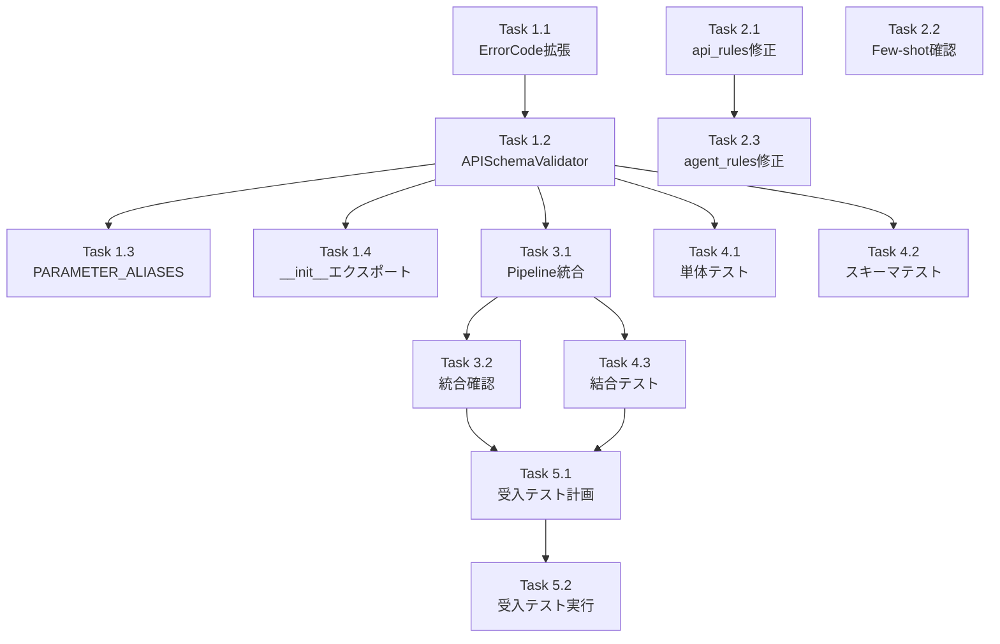

# 作業計画書: Issue #344 - APIスキーマ検証機構の実装とプロンプト整合性改善

## Issue概要

**Issue番号**: #344
**タイトル**: V2 Workflow Generator: APIスキーマ検証機構の実装とプロンプト整合性改善
**サイズ**: M（Medium）
**作業見積**: 10時間
**優先度**: High
**依存Issue**: なし（#343は完了済み）
**ラベル**: `bug`, `enhancement`

---

## 問題の根本原因（確認済み）

### 原因1: プロンプト内の矛盾する情報

| ファイル | 現状 | 問題 |
|---------|------|------|
| `api_rules.py:37` | `query: :source.query` | 単数形・古い形式 |
| `search_pattern.yaml` | `queries: [":source.keyword"]` | ✅ 正しい複数形 |
| `available_apis.yaml` | `queries: array` | ✅ 正しいスキーマ |

### 原因2: 検証機構の欠落

```
現在の ValidationPipeline:
├── SourcePathRuleEngine      → パス文法のみ
└── AgentConstraintValidator  → timeout, env vars のみ

❌ APISchemaValidator         → 存在しない！（body未検証）
```

---

## 詳細タスク分解

### Phase 1: APISchemaValidator の実装（4時間）

- [ ] **Task 1.1**: ValidationErrorCode 拡張
  - 所要時間: 0.5時間
  - 成果物: `validators/__init__.py` 修正
  - 依存: なし
  - 追加コード:
    ```python
    UNKNOWN_API_PARAMETER = "unknown_api_parameter"
    MISSING_REQUIRED_PARAMETER = "missing_required_param"
    PARAMETER_TYPE_MISMATCH = "parameter_type_mismatch"
    PARAMETER_NAME_MISMATCH = "parameter_name_mismatch"
    ```

- [ ] **Task 1.2**: APISchemaValidator クラス実装
  - 所要時間: 2.5時間
  - 成果物: `validators/api_schema_validator.py` 新規作成
  - 依存: Task 1.1
  - 主要機能:
    - fetchAgent ノードの抽出
    - URL から API エンドポイント特定
    - body パラメータと API スキーマ照合
    - パラメータ名/型/必須性の検証
    - 類似パラメータ名の提案（typo検出）

- [ ] **Task 1.3**: PARAMETER_ALIASES 定義
  - 所要時間: 0.5時間
  - 成果物: `validators/api_schema_validator.py` 内
  - 依存: Task 1.2
  - 定義内容:
    ```python
    PARAMETER_ALIASES = {
        "google_search": {
            "query": "queries",
            "num_results": "num",
            "count": "num",
        },
        "gmail_search": {
            "max": "max_results",
            "limit": "max_results",
        }
    }
    ```

- [ ] **Task 1.4**: validators/__init__.py エクスポート追加
  - 所要時間: 0.5時間
  - 成果物: `validators/__init__.py` 修正
  - 依存: Task 1.2

### Phase 2: プロンプト整合性改善（2時間）

- [ ] **Task 2.1**: api_rules.py 修正
  - 所要時間: 1時間
  - 成果物: `prompt_builder/rules/api_rules.py`
  - 依存: なし
  - 修正内容:
    - 37行目: `query: :source.query` → `queries: [":source.user_input.query"]`
    - Gmail例も `max_results` に統一

- [ ] **Task 2.2**: Few-shot examples 確認・修正
  - 所要時間: 0.5時間
  - 成果物: `prompt_builder/few_shot/*.yaml`
  - 依存: なし
  - 確認対象:
    - `search_pattern.yaml` ✅ 正しい形式
    - `api_call_pattern.yaml` 要確認
    - その他パターン 要確認

- [ ] **Task 2.3**: agent_rules.py 修正
  - 所要時間: 0.5時間
  - 成果物: `prompt_builder/rules/agent_rules.py`
  - 依存: なし
  - 修正内容:
    - 27行目: `query: :source.query` → `queries: [":source.user_input.query"]`

### Phase 3: ValidationPipeline 統合（1時間）

- [ ] **Task 3.1**: ValidationPipeline への APISchemaValidator 追加
  - 所要時間: 0.5時間
  - 成果物: `pipeline/validation_pipeline.py`
  - 依存: Task 1.2
  - 修正内容:
    ```python
    self.validators = [
        SourcePathRuleEngine(),
        AgentConstraintValidator(),
        APISchemaValidator(),  # 新規追加
    ]
    ```

- [ ] **Task 3.2**: 統合動作確認
  - 所要時間: 0.5時間
  - 成果物: 動作確認ログ
  - 依存: Task 3.1

### Phase 4: テスト追加（3時間）- TDD

- [ ] **Task 4.1**: 単体テスト（APISchemaValidator）
  - 所要時間: 1.5時間
  - 成果物: `tests/unit/test_job_generator_v2/test_api_schema_validator.py`
  - 依存: Task 1.2
  - テストケース:
    - 正常系: 正しいパラメータ → エラーなし
    - パラメータ名不一致: `query` vs `queries`
    - パラメータ名不一致: `num_results` vs `num`
    - 型不一致: string vs array
    - 必須パラメータ欠落
    - 類似パラメータ名提案

- [ ] **Task 4.2**: スキーマ定義テスト
  - 所要時間: 0.5時間
  - 成果物: `tests/unit/test_job_generator_v2/test_api_schema_definitions.py`
  - 依存: Task 1.2
  - テストケース:
    - スキーマ存在確認
    - 必須フィールド確認
    - PARAMETER_ALIASES カバレッジ確認

- [ ] **Task 4.3**: 結合テスト（ValidationPipeline）
  - 所要時間: 1時間
  - 成果物: `tests/integration/test_api_schema_validation_flow.py`
  - 依存: Task 3.1
  - テストケース:
    - パイプラインに APISchemaValidator が含まれる
    - パイプライン全体でAPIスキーマエラーを検出
    - エラーフィードバックに修正提案が含まれる

---

## タスク依存関係



---

## 作業スケジュール

### Day 1 (5時間)

| 時間 | タスク | 成果物 |
|------|-------|-------|
| 09:00-09:30 | Task 1.1 (ErrorCode拡張) | `validators/__init__.py` |
| 09:30-12:00 | Task 1.2 (APISchemaValidator) | `validators/api_schema_validator.py` |
| 13:00-13:30 | Task 1.3 (PARAMETER_ALIASES) | 上記ファイル内 |
| 13:30-14:00 | Task 1.4 (__init__エクスポート) | `validators/__init__.py` |
| 14:00-15:30 | Task 4.1 (単体テスト) | `test_api_schema_validator.py` |

### Day 2 (5時間)

| 時間 | タスク | 成果物 |
|------|-------|-------|
| 09:00-10:00 | Task 2.1 (api_rules修正) | `api_rules.py` |
| 10:00-10:30 | Task 2.2 (Few-shot確認) | `few_shot/*.yaml` |
| 10:30-11:00 | Task 2.3 (agent_rules修正) | `agent_rules.py` |
| 11:00-11:30 | Task 3.1 (Pipeline統合) | `validation_pipeline.py` |
| 11:30-12:00 | Task 3.2 (統合確認) | 動作確認ログ |
| 13:00-13:30 | Task 4.2 (スキーマテスト) | `test_api_schema_definitions.py` |
| 13:30-14:30 | Task 4.3 (結合テスト) | `test_api_schema_validation_flow.py` |
| 14:30-15:30 | Task 5.1-5.2 (受入テスト) | 受入テスト結果 |

**総作業時間**: 10時間（2日）

---

## チェックポイント

| タイミング | 確認事項 | 対応 |
|-----------|---------|------|
| Task 1.2完了時 | APISchemaValidator単体動作 | pytest実行 |
| Task 3.1完了時 | ValidationPipeline統合 | パイプラインテスト |
| Phase 4完了時 | カバレッジ90%以上 | 未達なら追加テスト |
| PR作成前 | CI/CDパス | エラー時は修正 |

---

## リスクと対策

| リスク | 発生確率 | 影響 | 対策 |
|-------|---------|------|------|
| 既存テストへの影響 | 中 | テスト失敗 | 影響範囲確認後に修正 |
| プロンプト変更による品質低下 | 低 | LLM出力品質低下 | 結合テストで確認 |
| 新規API追加時のスキーマ未定義 | 中 | 検出漏れ | WARNING出力で対応 |

---

## 成果物チェックリスト

### コード（新規作成）
- [ ] `expertAgent/aiagent/langgraph/jobGeneratorV2/validators/api_schema_validator.py`

### コード（修正）
- [ ] `expertAgent/aiagent/langgraph/jobGeneratorV2/validators/__init__.py`
- [ ] `expertAgent/aiagent/langgraph/jobGeneratorV2/pipeline/validation_pipeline.py`
- [ ] `expertAgent/aiagent/langgraph/jobGeneratorV2/workflows/workflow_gen/prompt_builder/rules/api_rules.py`
- [ ] `expertAgent/aiagent/langgraph/jobGeneratorV2/workflows/workflow_gen/prompt_builder/rules/agent_rules.py`

### テスト（新規作成）
- [ ] `expertAgent/tests/unit/test_job_generator_v2/test_api_schema_validator.py`
- [ ] `expertAgent/tests/unit/test_job_generator_v2/test_api_schema_definitions.py`
- [ ] `expertAgent/tests/integration/test_api_schema_validation_flow.py`

### 受入テスト
- [ ] `expertAgent/tests/acceptance/test_issue_344_acceptance.py`

---

## L3受入テスト計画（具体的なコマンド）

### Step 1: サービス起動確認

```bash
# サービス起動（ハイブリッドモード推奨）
./scripts/dev-hybrid.sh

# ヘルスチェック
curl -sf http://localhost:8004/health && echo "✅ expertAgent: healthy"
curl -sf http://localhost:8005/health && echo "✅ graphAiServer: healthy"
curl -sf http://localhost:8003/health && echo "✅ myVault: healthy"
```

### Step 2: APIスキーマ検証の動作確認

```bash
# 誤ったパラメータを含むワークフローで検証エラーを確認
# (テスト用エンドポイントまたはPythonスクリプトで実行)

# Python経由での検証
cd expertAgent
python -c "
from aiagent.langgraph.jobGeneratorV2.pipeline.validation_pipeline import ValidationPipeline

workflow = {
    'version': '0.5',
    'nodes': {
        'source': {},
        'search': {
            'agent': 'fetchAgent',
            'inputs': {
                'url': 'http://localhost:8004/aiagent-api/v1/utility/google_search',
                'method': 'POST',
                'body': {
                    'query': ':source.keyword',  # 誤: queries であるべき
                    'num_results': 3             # 誤: num であるべき
                }
            }
        }
    }
}

pipeline = ValidationPipeline()
result = pipeline.validate(workflow)

print(f'Is valid: {result.is_valid}')
print(f'Errors: {len(result.errors)}')
for error in result.errors:
    print(f'  - [{error.code}] {error.message}')
    if error.suggestion:
        print(f'    Suggestion: {error.suggestion}')
"
```

### Step 3: 正常系ワークフローの検証

```bash
# 正しいパラメータを含むワークフロー → エラーなし
python -c "
from aiagent.langgraph.jobGeneratorV2.pipeline.validation_pipeline import ValidationPipeline

workflow = {
    'version': '0.5',
    'nodes': {
        'source': {},
        'search': {
            'agent': 'fetchAgent',
            'inputs': {
                'url': 'http://localhost:8004/aiagent-api/v1/utility/google_search',
                'method': 'POST',
                'body': {
                    'queries': [':source.user_input.keyword'],  # 正しい
                    'num': 3                                     # 正しい
                }
            }
        }
    }
}

pipeline = ValidationPipeline()
result = pipeline.validate(workflow)

print(f'Is valid: {result.is_valid}')
assert result.is_valid, 'Valid workflow should pass validation'
print('✅ Valid workflow passed validation')
"
```

### Step 4: E2Eテスト（実際のワークフロー生成）

```bash
# Job Generator API を呼び出し、生成されたワークフローを確認
curl -s -X POST http://localhost:8004/aiagent-api/v1/job-generator/v2/generate \
  -H "Content-Type: application/json" \
  -d '{
    "taskmaster_id": "tm_test",
    "tasks": [{
      "id": "task_1",
      "name": "Google Search Task",
      "description": "キーワードで検索する",
      "input_schema": {
        "type": "object",
        "properties": {
          "keyword": {"type": "string"}
        }
      },
      "output_schema": {
        "type": "object",
        "properties": {
          "results": {"type": "array"}
        }
      }
    }]
  }' | jq '.workflow_yaml' -r

# 期待する結果:
# - queries: (複数形) が使用されている
# - num: (短縮形) が使用されている
```

### Step 5: エビデンス収集

```bash
# テスト実行結果をファイルに保存
cd expertAgent
pytest tests/unit/test_job_generator_v2/test_api_schema_validator.py -v > /tmp/unit_test_results.txt
pytest tests/integration/test_api_schema_validation_flow.py -v >> /tmp/integration_test_results.txt

# カバレッジ確認
pytest tests/unit/test_job_generator_v2/test_api_schema_validator.py --cov=aiagent.langgraph.jobGeneratorV2.validators --cov-report=term-missing
```

---

## Definition of Done

Issue完了条件：
- [ ] すべてのタスクが完了
- [ ] 単体テストカバレッジ90%以上
- [ ] 結合テスト全シナリオパス
- [ ] **L3受入テスト全パス**（実際のサービス起動・API呼び出し確認）
- [ ] CI/CDグリーン
- [ ] コードレビュー承認
- [ ] ドキュメント更新完了（本作業計画書）

---

## 次のアクション

作業計画承認後：
1. **ブランチ作成**: `issue/344-api-schema-validator`
2. **TDD開始**: PM Auto-Dev または手動実装
3. **タスク実行**: 計画に従って実装
4. **進捗報告**: `/progress-report` で定期報告

---

## 参照ドキュメント

| ドキュメント | 関連内容 |
|-------------|---------|
| `dev-reports/feature/issue/344/design-policy.md` | 設計方針書（承認済み） |
| `dev-reports/feature/issue/344/architecture-review.md` | アーキテクチャレビュー（承認済み） |
| `docs/spec/job-generation-workflow.md` | V2 Job Generator仕様 |
| `validators/__init__.py` | WorkflowValidator基底クラス |
| `api_schema_injector.py` | APIスキーマ読み込みパターン |

---

## 変更履歴

| 日付 | バージョン | 変更内容 |
|------|-----------|---------|
| 2026-01-09 | 1.0 | 初版作成 |
