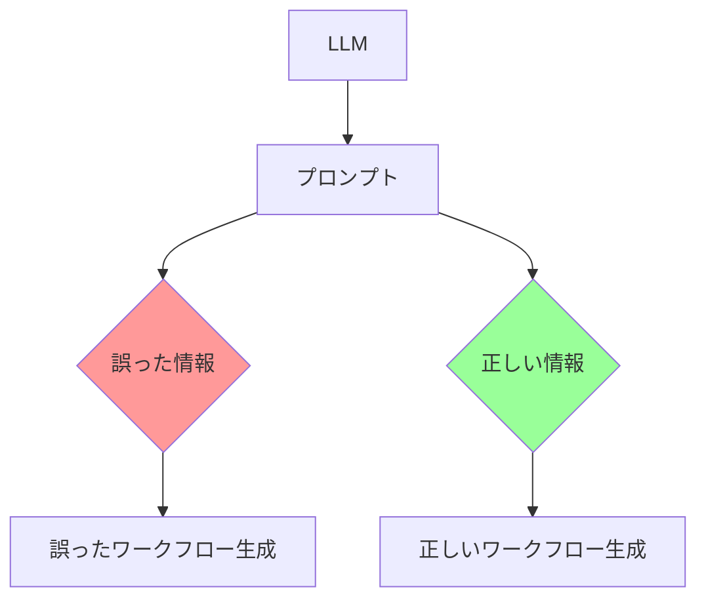

# 設計方針書: Issue #345 LLMプロンプトのAgent出力形式誤記載修正

## 現状調査サマリ

### 対象プロジェクト
- **プロジェクト名**: expertAgent
- **主要モジュール**: `expertAgent/aiagent/langgraph/jobGeneratorV2/workflows/workflow_gen/prompt_builder/`

### 問題の概要

ワークフロー生成LLMに渡すプロンプトに、GraphAI Agentの出力形式に関する**誤った情報**が含まれており、これが原因で誤ったワークフローが生成されている。

| 問題 | 誤った記載 | 正しい動作 |
|------|-----------|-----------|
| fetchAgent出力形式 | `.result`でラップされる | HTTPレスポンスボディを直接返す |
| mapAgentサブグラフ | `item_source: {}` | `row: {}`（デフォルト） |
| Agent出力形式説明 | 欠落 | mapAgent/arrayJoinAgentの出力形式 |

### 既存アーキテクチャパターン

#### プロンプトビルダーの構成
```
prompt_builder/
├── rules/
│   ├── reference_rules.py    # 参照構文ルール
│   ├── agent_rules.py        # Agent別ルール
│   ├── api_rules.py          # API呼び出しルール
│   └── base_rules.py         # 基本ルール
├── few_shot/
│   ├── api_call_pattern.yaml # API呼び出しパターン
│   ├── search_pattern.yaml   # 検索パターン
│   ├── gmail_send_pattern.yaml
│   ├── slack_notify_pattern.yaml
│   ├── llm_chain_pattern.yaml
│   └── map_pattern.yaml      # mapAgentパターン
└── system/
    └── workflow_generator.py # システムプロンプト
```

#### 正しいAgent出力形式（GRAPHAI_WORKFLOW_GENERATION_RULES.md より）

| Agent | 出力形式 | アクセスパターン |
|-------|---------|-----------------|
| **fetchAgent** | HTTPレスポンスボディ直接 | `:node.field` |
| **mapAgent** (compositeResult: true) | `{isResultノード名: [...]}` | `:mapNode.resultNodeName` |
| **mapAgent** (compositeResultKey) | 配列直接 | `:mapNode` |
| **arrayJoinAgent** | `{text: "..."}` | `:node.text` |

### 参照したドキュメント
- `graphAiServer/docs/COMMON_ERRORS.md` - 正しい情報が記載
- `graphAiServer/docs/GRAPHAI_WORKFLOW_GENERATION_RULES.md` - 正しい情報が記載
- `expertAgent/docs/API_REFERENCE.md` - API応答形式

### 設計上の制約
- 既存のワークフローとの後方互換性は不要（プロンプトの修正のみ）
- 単体テストは既存のテストが全てパスすることが要件

---

## アーキテクチャ設計

### 修正範囲

本Issueはドキュメント/プロンプト修正であり、アーキテクチャ変更は不要。



### 影響分析

| コンポーネント | 影響 | 修正内容 |
|---------------|------|---------|
| `reference_rules.py` | 高 | `.result`記述削除 |
| `agent_rules.py` | 高 | fetchAgent/mapAgentルール修正 |
| `api_rules.py` | 高 | Response Access説明の`.result`記述削除 |
| `workflow_generator.py` | 中 | システムプロンプト修正 |
| Few-Shotパターン (6ファイル) | 高 | `.result.`参照修正 |

---

## 技術選定

本Issueは既存コードの修正のため、新規技術選定は不要。

| カテゴリ | 現行技術 | 変更 |
|---------|---------|------|
| 言語 | Python 3.12 | 変更なし |
| フレームワーク | FastAPI + LangGraph | 変更なし |
| テスト | pytest | 変更なし |

---

## 設計パターン

既存の設計パターンを維持：

- **定数パターン**: ルール文字列は定数として定義
- **ファクトリ関数パターン**: `get_*_rules()` 関数でルール取得
- **Few-Shotパターン**: YAMLファイルで例示

---

## 詳細修正設計

### 問題1: fetchAgent出力形式の誤記載

#### 修正対象ファイルと内容

**1. `reference_rules.py`**

```python
# 削除する記述
# L17: ":node_name.result.field" - For fetchAgent API responses
# L19-24: When using fetchAgent, the API response is wrapped in .result
# L41: DON'T forget .result for fetchAgent responses

# 追加する記述
# fetchAgentはHTTPレスポンスボディを直接返す
# APIが {status: "ok", data: {...}} を返す場合:
#   - :node.status でアクセス
#   - :node.data.field でアクセス
```

**2. `agent_rules.py`**

```python
# 修正前 (L16)
# Access response data with :node_name.result.field

# 修正後
# Access response data with :node_name.field (direct HTTP response access)
```

**3. `api_rules.py`**

```python
# 修正前 (L66-69)
### Response Access
API responses are wrapped in `.result`:
```yaml
# Response: { "messages": [...] }
# Access: :api_node.result.messages
```

# 修正後
### Response Access
fetchAgent returns HTTP response body directly:
```yaml
# Response: { "messages": [...] }
# Access: :api_node.messages
```
```

**4. `workflow_generator.py`**

```python
# 修正前 (L39)
# - `:node_name.result.field` - For fetchAgent responses

# 修正後
# - `:node_name.field` - Direct access to fetchAgent HTTP response
```

**5. Few-Shotパターン修正**

| ファイル | 修正前 | 修正後 |
|---------|--------|--------|
| `api_call_pattern.yaml` L57-58 | `:call_api.result.result` | `:call_api.result` |
| `search_pattern.yaml` L58 | `:search_api.result.search_results` | `:search_api.search_results` |
| `gmail_send_pattern.yaml` L60-61 | `:send_email.result.result/message_id` | `:send_email.result/message_id` |
| `slack_notify_pattern.yaml` L58-59 | `:notify_slack.result.ok/ts` | `:notify_slack.ok/ts` |
| `llm_chain_pattern.yaml` L81 | `:analyze_content.result.result` | `:analyze_content.result` |

### 問題2: mapAgentノード名の誤記載

#### 修正対象

**1. `agent_rules.py`**

```python
# 修正前 (L98, L102)
# item_source: {}
# item: :item_source

# 修正後
# row: {}  # mapAgentのデフォルト静的ノード
# item: :row
```

**2. `map_pattern.yaml`**

```yaml
# 修正前 (L52, L57-58, L65)
# item_source: {}
# id: :item_source.id
# content: :item_source.content

# 修正後
# row: {}  # mapAgentデフォルト
# id: :row.id
# content: :row.content
```

### 問題3: Agent出力形式の文書化不足

#### 追加するドキュメント

**`agent_rules.py` に追加**

```python
MAP_AGENT_OUTPUT_RULES = """### mapAgent Output Format

#### compositeResult: true (推奨)
Output: { "isResultNodeName": [...] }
Reference: :mapAgentNode.isResultNodeName

```yaml
process_items:
  agent: mapAgent
  params:
    compositeResult: true
  graph:
    nodes:
      row: {}
      format_item:
        # ...
        isResult: true  # この名前がキーになる

# 参照: :process_items.format_item (配列)
```

#### compositeResultKey: "key"
Output: [...] (配列直接)
Reference: :mapAgentNode

```yaml
process_items:
  agent: mapAgent
  params:
    compositeResult: true
    compositeResultKey: result
  # ...
# 参照: :process_items (配列直接)
```
"""

ARRAY_JOIN_AGENT_RULES = """### arrayJoinAgent Output Format

Output: { "text": "joined string" }
Reference: :arrayJoinAgentNode.text

```yaml
join_results:
  agent: arrayJoinAgent
  inputs:
    array: :previous_node.items
  params:
    separator: "\\n"

# 参照: :join_results.text
```

IMPORTANT: arrayJoinAgent always outputs an object with .text property.
DO NOT reference :arrayJoinAgentNode directly (returns object, not string).
"""
```

---

## セキュリティ設計

本Issueはセキュリティに影響なし（プロンプト修正のみ）。

---

## パフォーマンス設計

本Issueはパフォーマンスに影響なし。

---

## テスト設計

### 修正確認テスト

既存の単体テストが全てパスすることを確認：

```bash
cd expertAgent
uv run pytest tests/unit/test_job_generator_v2/ -v
```

### 追加推奨テスト

1. **プロンプト内容検証テスト**: 生成されるプロンプトに誤った記述が含まれないことを確認
2. **Few-Shot参照形式テスト**: YAMLパターン内の参照が正しい形式であることを検証

---

## 設計判断とトレードオフ

### 判断1: 既存ワークフローの修正は行わない

**理由**:
- 本Issueはプロンプト修正のみが対象
- 既存ワークフローの修正は別Issue（または手動対応）で実施
- 既存ワークフローの動作確認は別途必要

**トレードオフ**:
- 既存の誤ったワークフローは残る
- 新規生成ワークフローのみ正しくなる

### 判断2: mapAgentの`item_source`と`row`の両方を文書化

**理由**:
- `row`がデフォルトだが、`item_source`も動作する
- 混乱を避けるため、`row`を推奨として明記

**代替案**:
- `item_source`の記載を完全削除 → 既存ワークフローとの混乱を招く可能性

### 判断3: arrayJoinAgentの`.text`アクセスを強調

**理由**:
- これを忘れると`[object Object]`エラーが発生
- COMMON_ERRORS.mdにも記載されている頻出エラー

---

## 実装手順

### Phase 1: ルールファイル修正
1. `reference_rules.py` の `.result` 記述削除
2. `agent_rules.py` の fetchAgent/mapAgent ルール修正
3. `api_rules.py` の Response Access 説明修正（`.result`削除）
4. `agent_rules.py` に mapAgent出力形式/arrayJoinAgent出力形式を追加
5. `workflow_generator.py` のシステムプロンプト修正

### Phase 2: Few-Shotパターン修正
1. 6つのYAMLファイルの `.result.` 参照を修正
2. `map_pattern.yaml` の `item_source` を `row` に修正

### Phase 3: テスト実行
1. 既存単体テストの実行
2. プロンプト生成の手動確認

---

## 参照ドキュメント

| ドキュメント | 関連内容 |
|-------------|---------|
| `graphAiServer/docs/COMMON_ERRORS.md` | 正しいAgent出力形式 |
| `graphAiServer/docs/GRAPHAI_WORKFLOW_GENERATION_RULES.md` | 正しいワークフロー構文 |
| `expertAgent/docs/API_REFERENCE.md` | API応答形式 |
| Issue #345 | 問題の詳細と受入条件 |

---

## 受入条件チェックリスト

### ルールファイル修正
- [ ] `reference_rules.py`から`.result`に関する誤った記述を削除
- [ ] `agent_rules.py`のfetchAgentルールを修正（`.result`削除）
- [ ] `agent_rules.py`のmapAgentルールを修正（`row: {}`に変更）
- [ ] `api_rules.py`のResponse Access説明を修正（`.result`削除）
- [ ] `workflow_generator.py`のシステムプロンプトを修正

### Few-Shotパターン修正
- [ ] `api_call_pattern.yaml`の`.result.`参照を修正
- [ ] `search_pattern.yaml`の`.result.`参照を修正
- [ ] `gmail_send_pattern.yaml`の`.result.`参照を修正
- [ ] `slack_notify_pattern.yaml`の`.result.`参照を修正
- [ ] `llm_chain_pattern.yaml`の`.result.`参照を修正
- [ ] `map_pattern.yaml`の`item_source`を`row`に修正

### ドキュメント追加
- [ ] mapAgentの出力形式に関する説明を追加（compositeResult, compositeResultKey）
- [ ] arrayJoinAgentの出力形式に関する説明を追加（`.text`プロパティ）

### 検証
- [ ] 修正後、既存の単体テストが全てパスすること
- [ ] プロンプト生成結果に誤った`.result.`パターンが含まれないこと
