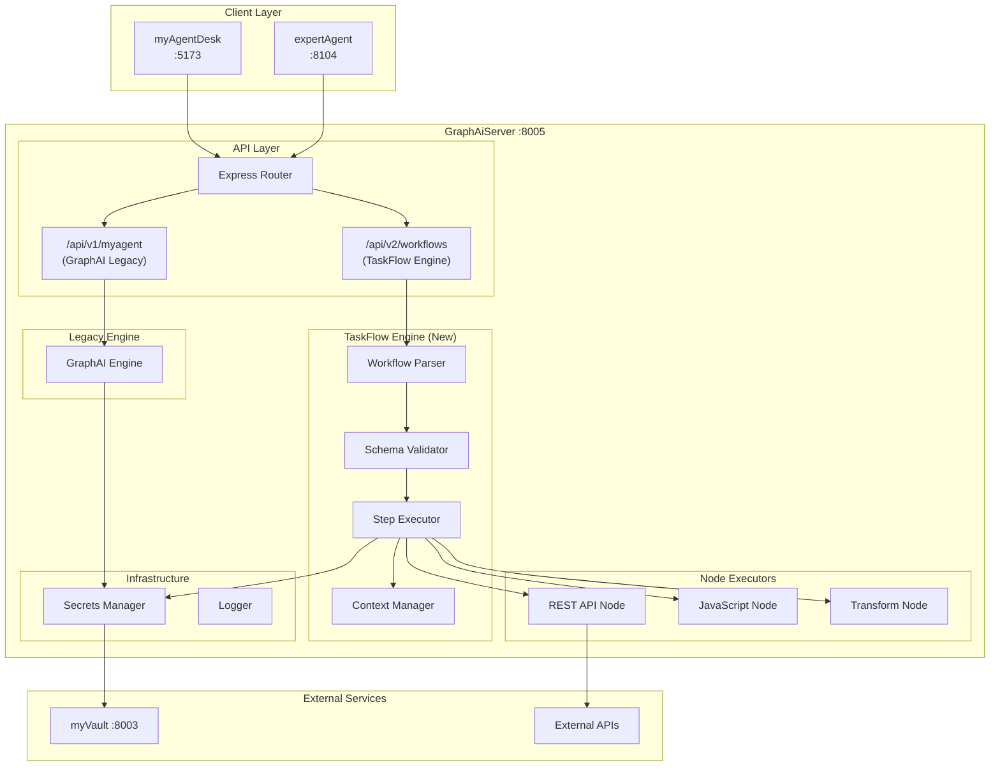
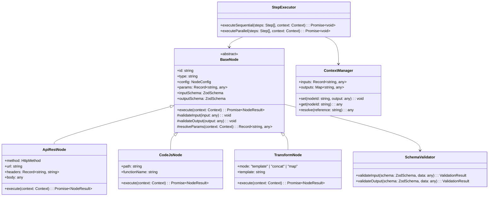
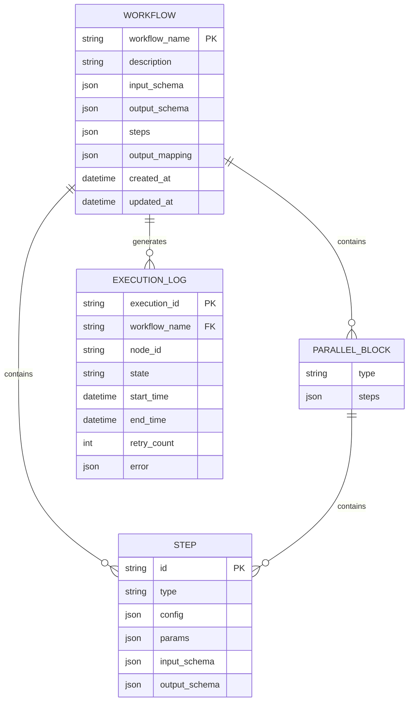
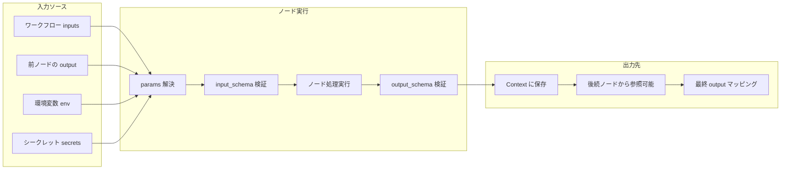
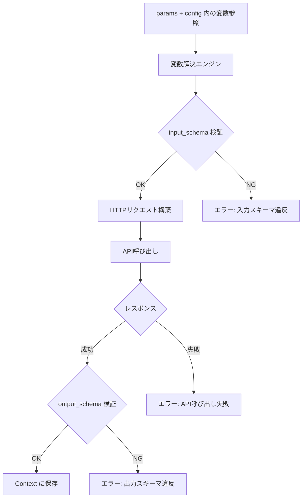
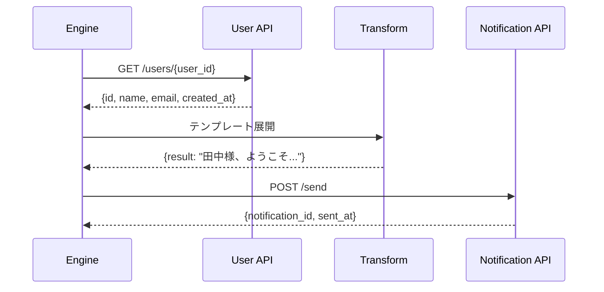
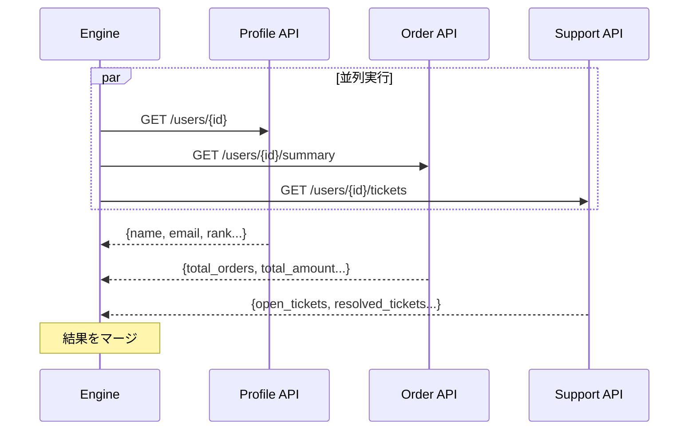
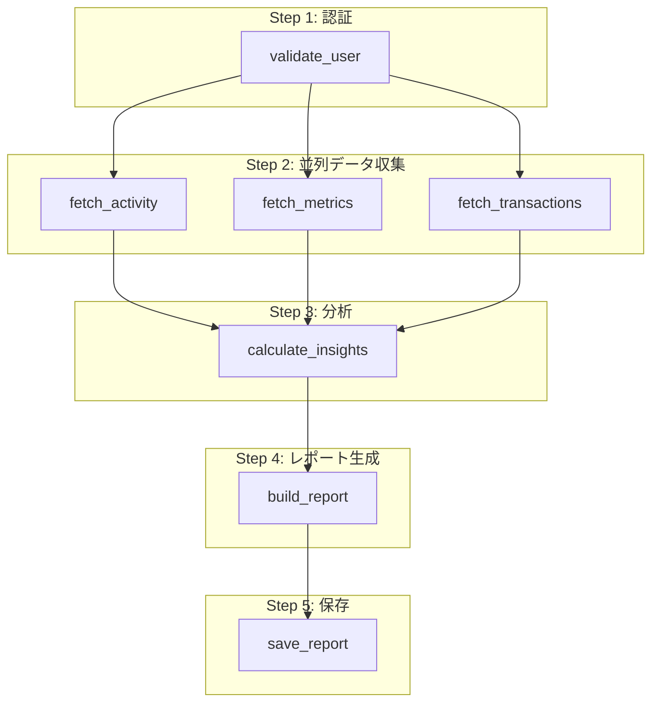
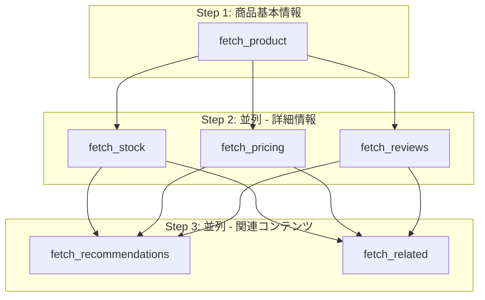

# 設計方針書: Issue #348 - モジュール化されたタスク定義に基づく並列API実行エンジン

## 現状調査サマリ

### 対象プロジェクト
- **プロジェクト名**: GraphAiServer
- **主要モジュール**: src/services/graphai.ts, src/app.ts
- **技術スタック**: TypeScript/Node.js + Express

### 既存アーキテクチャパターン

| パターン | 使用箇所 | 目的 |
|---------|---------|------|
| Service Layer | `services/graphai.ts` | ワークフロー実行ロジックのカプセル化 |
| Factory Pattern | GraphAI Agent生成 | Agent種別に応じたインスタンス生成 |
| Template Pattern | YAML → GraphData変換 | ワークフロー定義の統一的な処理 |
| Adapter Pattern | `secretsManager.ts` | MyVault/環境変数の統一インターフェース |

### 類似機能の設計

**GraphAI ワークフロー実行**:
- YAML定義 → パース → 環境変数/シークレット注入 → GraphAI実行 → 結果抽出
- `results`, `errors`, `logs` の3構造でレスポンス

**expertAgent Job Generator V2**:
- LLM生成 → バリデーション → タスク分割 → ワークフロー生成
- `JobGeneratorV2Adapter` でLLM呼び出しとバリデーションを分離

### 既存API設計パターン

| 項目 | 現行パターン |
|------|-------------|
| エンドポイント命名規則 | `/api/v1/{resource}/{category}/{model}` |
| レスポンス形式 | `{ results, errors, logs }` |
| エラーハンドリング | 200 (成功) / 500 (ノードエラーあり) / 400 (バリデーション) |
| 認証 | `X-Admin-Token` (管理API) |

### 参照したドキュメント

| ドキュメント | 関連する内容 |
|-------------|-------------|
| `docs/design/architecture-overview.md` | サービス構成、ポート、レイヤー構成 |
| `docs/arch/service-dependencies.md` | サービス間通信、依存関係、API統合 |
| `graphAiServer/src/services/graphai.ts` | 現行ワークフロー実行エンジンの実装 |
| `graphAiServer/src/app.ts` | Expressルーティング、エンドポイント定義 |

### 設計上の制約

1. **既存GraphAI機能との併存**: 段階的移行のため既存エンドポイントは維持
2. **TypeScript/Node.js**: graphAiServerの既存スタックを継続
3. **MyVault統合**: シークレット管理は既存パターンを踏襲
4. **レスポンス形式**: `results`, `errors`, `logs` 構造を維持

---

## アーキテクチャ設計

### システム構成図



### レイヤー構成

```
graphAiServer/
├── src/
│   ├── app.ts                          # Express アプリケーション
│   ├── index.ts                        # エントリーポイント
│   │
│   ├── api/                            # API Layer (New)
│   │   ├── v1/                         # Legacy GraphAI API
│   │   │   └── myagent.ts
│   │   └── v2/                         # TaskFlow Engine API
│   │       ├── workflows.ts            # ワークフロー実行
│   │       └── tasks.ts                # タスク管理
│   │
│   ├── engine/                         # TaskFlow Engine Core (New)
│   │   ├── parser/
│   │   │   └── workflow-parser.ts      # ワークフロー定義解析
│   │   ├── executor/
│   │   │   ├── step-executor.ts        # ステップ実行制御
│   │   │   └── parallel-executor.ts    # 並列実行制御
│   │   ├── context/
│   │   │   └── context-manager.ts      # コンテキスト管理
│   │   └── validator/
│   │       └── schema-validator.ts     # I/Oスキーマ検証
│   │
│   ├── nodes/                          # Node Executors (New)
│   │   ├── base-node.ts                # 基底クラス
│   │   ├── api-rest-node.ts            # REST API Node
│   │   ├── code-js-node.ts             # JavaScript Node
│   │   └── transform-node.ts           # Transform Node
│   │
│   ├── services/                       # Existing Services
│   │   ├── graphai.ts                  # Legacy GraphAI Engine
│   │   ├── secretsManager.ts           # シークレット管理
│   │   └── myvaultClient.ts            # MyVault クライアント
│   │
│   └── types/                          # Type Definitions
│       ├── workflow.ts                 # 既存型定義
│       └── taskflow.ts                 # TaskFlow型定義 (New)
│
├── config/
│   ├── graphai/                        # Legacy YAML ワークフロー
│   └── taskflow/                       # TaskFlow JSON 定義 (New)
│       ├── tasks/                      # モジュール化されたタスク定義
│       └── workflows/                  # ワークフロー定義
│
└── tests/
    ├── unit/
    │   └── engine/                     # TaskFlow Engine テスト
    └── integration/
        └── api/v2/                     # v2 API テスト
```

---

## 技術選定

| カテゴリ | 選定技術 | 選定理由 | 既存との整合性 |
|---------|---------|---------|---------------|
| 言語 | TypeScript 5.x | 既存スタックと同一 | 完全互換 |
| ランタイム | Node.js 20+ | 既存環境と同一 | 完全互換 |
| フレームワーク | Express.js | 既存ルーティングに追加 | 完全互換 |
| スキーマ検証 | Zod | TypeScript ファーストで型推論優秀 | 新規導入 |
| テンプレート | Handlebars | Transform Node で使用、軽量 | 新規導入 |
| JS実行 | vm2/isolated-vm | セキュアなサンドボックス実行 | 新規導入 |
| 並列実行 | Promise.all + Promise.allSettled | Node.js ネイティブ | 既存パターン |
| ログ | 既存Logger | 統一されたログ形式 | 既存踏襲 |

### 技術選定の詳細理由

**Zod を選定した理由**:
1. TypeScriptとの親和性が高く、型推論が優秀
2. JSON Schemaからの変換/エクスポートが可能
3. エラーメッセージが分かりやすい
4. Issue要件の「JSON Schema/Zod互換形式」に合致

**Handlebars を選定した理由**:
1. Transform Node のテンプレート処理に最適
2. セキュリティ面でSafe（XSS対策済み）
3. Mustacheとの互換性がありシンプル
4. Issue要件の「Mustache/Handlebars等」に合致

---

## 設計パターン

### 採用パターン一覧

| パターン | 適用箇所 | 理由 |
|---------|---------|------|
| **Strategy Pattern** | Node Executors | 各ノード種別の実行戦略を差し替え可能に |
| **Chain of Responsibility** | Step Executor | 直列ステップの連鎖実行 |
| **Factory Pattern** | Node生成 | type フィールドに応じたノード生成 |
| **Observer Pattern** | 実行ログ | 実行状態の変化を通知 |
| **Template Method** | Base Node | ノード実行の共通フロー定義 |

### クラス設計



---

## データモデル設計

### ワークフロー定義スキーマ



### TypeScript型定義

```typescript
// types/taskflow.ts

import { z } from 'zod';

// ============================================================
// 基本型定義
// ============================================================

/** HTTPメソッド */
export type HttpMethod = 'GET' | 'POST' | 'PUT' | 'DELETE' | 'PATCH';

/** ノード種別 */
export type NodeType = 'api_rest' | 'code_js' | 'transform';

/** 実行状態 */
export type NodeState = 'pending' | 'running' | 'completed' | 'failed' | 'skipped';

// ============================================================
// スキーマ定義 (Zod)
// ============================================================

/** 簡易型スキーマ（Issue要件に準拠） */
export const SimpleTypeSchema = z.enum([
  'string', 'number', 'boolean', 'array', 'object', 'null'
]);

/** I/Oスキーマ定義 */
export const IOSchema = z.record(z.string(), SimpleTypeSchema);
export type IOSchemaType = z.infer<typeof IOSchema>;

// ============================================================
// ノード設定
// ============================================================

/** REST API Node 設定 */
export const ApiRestConfigSchema = z.object({
  method: z.enum(['GET', 'POST', 'PUT', 'DELETE', 'PATCH']),
  url: z.string().refine(
    (url) => url.startsWith('https://') || url.startsWith('${env.') || url.startsWith('${secrets.'),
    { message: 'URL must use HTTPS protocol' }
  ),
  headers: z.record(z.string(), z.string()).optional(),
  body: z.any().optional(),
  timeout_ms: z.number().default(30000),
  verify_ssl: z.boolean().default(true),  // SSL証明書検証（本番では必須）
});

/** JavaScript Node 設定 */
export const CodeJsConfigSchema = z.object({
  path: z.string(),
  function_name: z.string().default('main'),
});

/** Transform Node 設定 */
export const TransformConfigSchema = z.object({
  mode: z.enum(['template', 'concat', 'map']).default('template'),
  template: z.string().optional(),
});

// ============================================================
// ステップ定義
// ============================================================

/** 基本ステップ */
export const BaseStepSchema = z.object({
  id: z.string(),
  type: z.enum(['api_rest', 'code_js', 'transform']),
  description: z.string().optional(),
  config: z.union([ApiRestConfigSchema, CodeJsConfigSchema, TransformConfigSchema]),
  params: z.record(z.string(), z.any()).default({}),
  input_schema: IOSchema.optional(),
  output_schema: IOSchema.optional(),
});

/** 並列ブロック */
export const ParallelBlockSchema = z.object({
  type: z.literal('parallel'),
  steps: z.array(z.lazy(() => BaseStepSchema)),
});

/** ステップ（基本 or 並列） */
export const StepSchema = z.union([BaseStepSchema, ParallelBlockSchema]);

// ============================================================
// ワークフロー定義
// ============================================================

/** ワークフロー定義 */
export const WorkflowDefinitionSchema = z.object({
  workflow_name: z.string(),
  description: z.string().optional(),
  input_schema: IOSchema,
  output_schema: IOSchema,
  steps: z.array(StepSchema),
  output: z.record(z.string(), z.string()), // output_schemaへのマッピング
});

export type WorkflowDefinition = z.infer<typeof WorkflowDefinitionSchema>;

// ============================================================
// 実行結果
// ============================================================

/** ノード実行ログ */
export interface NodeLog {
  nodeId: string;
  state: NodeState;
  startTime: number;
  endTime: number;
  retryCount: number;
  error?: {
    message: string;
    stack?: string;
  };
}

/** ノードエラー */
export interface NodeError {
  message: string;
  stack?: string;
  code?: string;
}

/** ワークフロー実行結果 */
export interface WorkflowResult {
  results: Record<string, any>;
  errors: Record<string, NodeError>;
  logs: NodeLog[];
}
```

---

## API設計

### エンドポイント設計

| エンドポイント | メソッド | 用途 | 認証 |
|--------------|---------|------|------|
| `/api/v2/workflows` | POST | ワークフロー実行 | なし |
| `/api/v2/workflows/validate` | POST | ワークフロー定義検証 | なし |
| `/api/v2/workflows/register` | POST | ワークフロー登録 | Admin Token |
| `/api/v2/workflows/{name}` | GET | ワークフロー定義取得 | なし |
| `/api/v2/workflows/{name}` | DELETE | ワークフロー削除 | Admin Token |
| `/api/v2/tasks` | GET | タスク定義一覧 | なし |
| `/api/v2/tasks/{id}` | GET | タスク定義取得 | なし |

### リクエスト/レスポンス形式

**ワークフロー実行リクエスト**:
```json
{
  "workflow_name": "user_analysis",
  "inputs": {
    "user_id": "12345",
    "include_history": true
  },
  "project": "default_project"
}
```

**ワークフロー実行レスポンス** (既存形式と互換):
```json
{
  "results": {
    "inputs": { "user_id": "12345", "include_history": true },
    "fetch_user": { "id": "12345", "name": "田中太郎", "age": 35 },
    "fetch_orders": { "total_count": 42 },
    "calc_score": { "score": 0.85 },
    "build_text": { "result": "田中太郎様の注文数は42件です。" },
    "_output": {
      "user_name": "田中太郎",
      "analysis_text": "田中太郎様の注文数は42件です。",
      "risk_score": 0.85
    }
  },
  "errors": {},
  "logs": [
    {
      "nodeId": "fetch_user",
      "state": "completed",
      "startTime": 1704067200000,
      "endTime": 1704067200150,
      "retryCount": 0
    },
    {
      "nodeId": "fetch_orders",
      "state": "completed",
      "startTime": 1704067200160,
      "endTime": 1704067200320,
      "retryCount": 0
    }
  ]
}
```

**エラーレスポンス**:
```json
{
  "results": {
    "inputs": { "user_id": "invalid" },
    "fetch_user": null
  },
  "errors": {
    "fetch_user": {
      "message": "User not found",
      "code": "NOT_FOUND",
      "stack": "Error: User not found\n    at ..."
    }
  },
  "logs": [
    {
      "nodeId": "fetch_user",
      "state": "failed",
      "startTime": 1704067200000,
      "endTime": 1704067200100,
      "retryCount": 0,
      "error": {
        "message": "User not found"
      }
    }
  ]
}
```

### 変数参照記法

Issue要件に基づく `${...}` 形式の参照記法:

| 記法 | 説明 | 例 |
|------|------|-----|
| `${inputs.field}` | ワークフロー入力パラメータ | `${inputs.user_id}` |
| `${node_id.output.field}` | 他ノードの出力 | `${fetch_user.output.name}` |
| `${env.VAR_NAME}` | 環境変数 | `${env.API_KEY}` |
| `${secrets.KEY}` | MyVaultシークレット | `${secrets.ANTHROPIC_API_KEY}` |

---

## ノード種別仕様（詳細）

### 概要: データフローモデル



### 共通仕様: インプットの方法

#### 1. params によるデータ注入

`params` フィールドで、ノードに渡すデータを定義します。変数参照記法で動的に値を解決します。

```json
{
  "params": {
    "static_value": "固定文字列",
    "from_inputs": "${inputs.user_id}",
    "from_previous_node": "${fetch_user.output.name}",
    "from_env": "${env.API_BASE_URL}",
    "from_secrets": "${secrets.API_KEY}",
    "nested_access": "${fetch_data.output.items[0].id}",
    "with_default": "${inputs.optional_field ?? 'default_value'}"
  }
}
```

#### 2. 変数参照記法の詳細

| 記法パターン | 説明 | 例 |
|-------------|------|-----|
| `${inputs.field}` | ワークフロー実行時の入力パラメータ | `${inputs.user_id}` → `"12345"` |
| `${inputs.nested.field}` | ネストされた入力フィールド | `${inputs.options.limit}` → `10` |
| `${node_id.output}` | ノード出力全体 | `${fetch_user.output}` → `{id, name, email}` |
| `${node_id.output.field}` | ノード出力の特定フィールド | `${fetch_user.output.name}` → `"田中太郎"` |
| `${node_id.output.arr[0]}` | 配列要素アクセス | `${get_list.output.items[0]}` → 最初の要素 |
| `${node_id.output.arr[*].field}` | 配列の各要素からフィールド抽出 | `${get_users.output.users[*].id}` → `["1","2","3"]` |
| `${env.VAR_NAME}` | 環境変数 | `${env.API_BASE_URL}` → `"https://api.example.com"` |
| `${secrets.KEY}` | MyVaultシークレット | `${secrets.ANTHROPIC_API_KEY}` → `"sk-ant-..."` |

#### 3. input_schema による検証

ノード実行前に、解決された `params` が `input_schema` に適合するか検証します。

```json
{
  "input_schema": {
    "user_id": "string",
    "limit": "number",
    "include_details": "boolean",
    "tags": "array",
    "metadata": "object"
  }
}
```

**検証エラー時の動作**:
- ノード実行はスキップされる
- `errors` にスキーマ違反の詳細が記録される
- 後続ノードはこのノードの出力を参照できない（`null`）

### 共通仕様: アウトプットの使い方

#### 1. output の構造

各ノードの実行結果は、`results` オブジェクトに `node_id` をキーとして格納されます。

```json
{
  "results": {
    "inputs": { ... },
    "fetch_user": {
      "id": "12345",
      "name": "田中太郎",
      "email": "tanaka@example.com"
    },
    "calc_score": {
      "score": 0.85,
      "grade": "A"
    }
  }
}
```

#### 2. 後続ノードからの参照

後続ノードの `params` で、前のノードの出力を参照します。

```json
{
  "id": "send_notification",
  "params": {
    "recipient": "${fetch_user.output.email}",
    "message": "スコア: ${calc_score.output.score}点（${calc_score.output.grade}）"
  }
}
```

#### 3. output_schema による検証

ノード実行後に、出力が `output_schema` に適合するか検証します。

```json
{
  "output_schema": {
    "id": "string",
    "name": "string",
    "created_at": "string"
  }
}
```

**検証エラー時の動作**:
- 出力は `null` として記録
- `errors` にスキーマ違反の詳細が記録される
- 後続ノードはこのノードの出力を参照できない

#### 4. 最終出力マッピング

ワークフローの `output` フィールドで、最終的な出力構造を定義します。

```json
{
  "output_schema": {
    "user_name": "string",
    "total_score": "number",
    "summary": "string"
  },
  "output": {
    "user_name": "${fetch_user.output.name}",
    "total_score": "${calc_score.output.score}",
    "summary": "${build_summary.output.result}"
  }
}
```

**結果の格納**:
```json
{
  "results": {
    "inputs": { ... },
    "fetch_user": { ... },
    "calc_score": { ... },
    "build_summary": { ... },
    "_output": {
      "user_name": "田中太郎",
      "total_score": 0.85,
      "summary": "田中太郎様のスコアは0.85点です。"
    }
  }
}
```

---

### Type A: REST API Node (`type: "api_rest"`) - 詳細仕様

外部APIへのHTTPリクエストを実行するノードです。

#### 完全な定義例

```json
{
  "id": "create_order",
  "type": "api_rest",
  "description": "注文を作成する",
  "config": {
    "method": "POST",
    "url": "${env.ORDER_API_URL}/orders",
    "headers": {
      "Authorization": "Bearer ${secrets.ORDER_API_KEY}",
      "Content-Type": "application/json",
      "X-Request-ID": "${inputs.request_id}"
    },
    "body": {
      "user_id": "${inputs.user_id}",
      "items": "${cart.output.items}",
      "shipping_address": "${fetch_user.output.address}",
      "total_amount": "${calc_total.output.amount}"
    },
    "timeout_ms": 30000
  },
  "params": {},
  "input_schema": {
    "user_id": "string",
    "items": "array",
    "shipping_address": "object",
    "total_amount": "number"
  },
  "output_schema": {
    "order_id": "string",
    "status": "string",
    "created_at": "string"
  }
}
```

#### config フィールド詳細

| フィールド | 型 | 必須 | 説明 |
|-----------|-----|------|------|
| `method` | string | ○ | HTTPメソッド (`GET`, `POST`, `PUT`, `DELETE`, `PATCH`) |
| `url` | string | ○ | リクエストURL（**HTTPS必須**、変数参照可能） |
| `headers` | object | - | リクエストヘッダー（変数参照可能） |
| `body` | any | - | リクエストボディ（変数参照可能、POST/PUT/PATCH時） |
| `timeout_ms` | number | - | タイムアウト（デフォルト: 30000ms） |
| `verify_ssl` | boolean | - | SSL証明書検証（デフォルト: true、本番では必須） |

**セキュリティ制約**:
- URL は `https://` で始まる必要があります（SSRF対策）
- プライベートIPアドレス（127.x.x.x, 10.x.x.x, 192.168.x.x 等）へのアクセスは禁止
- クラウドメタデータエンドポイント（169.254.169.254等）へのアクセスは禁止
- 許可ドメインリストが設定されている場合、リスト外へのアクセスは禁止

#### インプットの流れ



#### アウトプットの構造

**成功時**:
```json
{
  "results": {
    "create_order": {
      "order_id": "ORD-2024-001",
      "status": "pending",
      "created_at": "2024-01-15T10:30:00Z"
    }
  }
}
```

**エラー時**:
```json
{
  "results": {
    "create_order": null
  },
  "errors": {
    "create_order": {
      "message": "API returned 400: Invalid user_id",
      "code": "API_ERROR",
      "details": {
        "status_code": 400,
        "response_body": { "error": "Invalid user_id" }
      }
    }
  }
}
```

---

### Type B: JavaScript Node (`type: "code_js"`) - 詳細仕様

カスタムJavaScriptロジックを実行するノードです。

#### 完全な定義例

```json
{
  "id": "calculate_discount",
  "type": "code_js",
  "description": "会員ランクと購入金額に基づいて割引率を計算",
  "config": {
    "path": "./scripts/discount_calculator.js",
    "function_name": "calculateDiscount"
  },
  "params": {
    "member_rank": "${fetch_user.output.rank}",
    "purchase_amount": "${calc_subtotal.output.amount}",
    "coupon_code": "${inputs.coupon_code}",
    "is_first_purchase": "${fetch_user.output.order_count === 0}"
  },
  "input_schema": {
    "member_rank": "string",
    "purchase_amount": "number",
    "coupon_code": "string",
    "is_first_purchase": "boolean"
  },
  "output_schema": {
    "discount_rate": "number",
    "discount_amount": "number",
    "applied_promotions": "array"
  }
}
```

#### JavaScriptファイルの規約

```javascript
// scripts/discount_calculator.js

/**
 * 割引計算関数
 * @param {Object} params - ノードから渡されるパラメータ
 * @returns {Object} 計算結果
 */
function calculateDiscount(params) {
  const { member_rank, purchase_amount, coupon_code, is_first_purchase } = params;

  let discount_rate = 0;
  const applied_promotions = [];

  // 会員ランク割引
  const rankDiscounts = { bronze: 0.03, silver: 0.05, gold: 0.10, platinum: 0.15 };
  if (rankDiscounts[member_rank]) {
    discount_rate += rankDiscounts[member_rank];
    applied_promotions.push(`${member_rank}会員割引`);
  }

  // 初回購入割引
  if (is_first_purchase) {
    discount_rate += 0.10;
    applied_promotions.push('初回購入10%OFF');
  }

  // クーポン適用（簡易例）
  if (coupon_code === 'SUMMER2024') {
    discount_rate += 0.05;
    applied_promotions.push('サマーキャンペーン5%OFF');
  }

  const discount_amount = Math.floor(purchase_amount * discount_rate);

  return {
    discount_rate,
    discount_amount,
    applied_promotions
  };
}

// エクスポート（必須）
module.exports = { calculateDiscount };
```

#### config フィールド詳細

| フィールド | 型 | 必須 | 説明 |
|-----------|-----|------|------|
| `path` | string | ○ | JavaScriptファイルのパス（`./scripts/` 配下） |
| `function_name` | string | - | 実行する関数名（デフォルト: `main`） |

#### サンドボックス制約

| 制約項目 | 値 | 説明 |
|---------|-----|------|
| 実行時間 | 5秒 | 超過時はタイムアウトエラー |
| メモリ | 128MB | 超過時はメモリエラー |
| ファイルシステム | 禁止 | `fs` モジュール使用不可 |
| ネットワーク | 禁止 | `http`, `https` 使用不可 |
| 外部モジュール | ホワイトリスト | `lodash`, `dayjs` のみ許可 |

#### アウトプットの構造

**成功時**:
```json
{
  "results": {
    "calculate_discount": {
      "discount_rate": 0.18,
      "discount_amount": 1800,
      "applied_promotions": ["gold会員割引", "初回購入10%OFF", "サマーキャンペーン5%OFF"]
    }
  }
}
```

---

### Type C: Transform Node (`type: "transform"`) - 詳細仕様

データの変換・整形を行うノードです。外部APIを呼び出さず、純粋なデータ操作のみを行います。

#### config.mode の詳細

##### mode: "template" - テンプレート展開

```json
{
  "id": "build_email_body",
  "type": "transform",
  "config": {
    "mode": "template",
    "template": "{{user_name}}様\n\nご注文ありがとうございます。\n\n【注文内容】\n注文番号: {{order_id}}\n合計金額: ¥{{total_amount}}\n\n{{#if has_discount}}\n割引適用: -¥{{discount_amount}}\n{{/if}}\n\nお届け予定日: {{delivery_date}}"
  },
  "params": {
    "user_name": "${fetch_user.output.name}",
    "order_id": "${create_order.output.order_id}",
    "total_amount": "${calc_total.output.amount}",
    "has_discount": "${calc_discount.output.discount_amount > 0}",
    "discount_amount": "${calc_discount.output.discount_amount}",
    "delivery_date": "${calc_delivery.output.date}"
  },
  "output_schema": {
    "result": "string"
  }
}
```

**出力**:
```json
{
  "result": "田中太郎様\n\nご注文ありがとうございます。\n\n【注文内容】\n注文番号: ORD-2024-001\n合計金額: ¥10000\n\n割引適用: -¥1800\n\nお届け予定日: 2024-01-20"
}
```

##### mode: "concat" - 文字列・配列の結合

```json
{
  "id": "merge_tags",
  "type": "transform",
  "config": {
    "mode": "concat",
    "separator": ", ",
    "fields": ["category_tags", "user_tags", "promotion_tags"]
  },
  "params": {
    "category_tags": "${fetch_product.output.tags}",
    "user_tags": "${fetch_user.output.preferences}",
    "promotion_tags": "${get_promotions.output.applicable_tags}"
  },
  "output_schema": {
    "result": "string"
  }
}
```

**入力例**:
```json
{
  "category_tags": ["electronics", "smartphone"],
  "user_tags": ["premium", "tech-lover"],
  "promotion_tags": ["summer-sale"]
}
```

**出力**:
```json
{
  "result": "electronics, smartphone, premium, tech-lover, summer-sale"
}
```

##### mode: "map" - 配列要素の変換

```json
{
  "id": "format_order_items",
  "type": "transform",
  "config": {
    "mode": "map",
    "source_field": "items",
    "template": "・{{name}} x {{quantity}} = ¥{{subtotal}}"
  },
  "params": {
    "items": "${fetch_cart.output.items}"
  },
  "input_schema": {
    "items": "array"
  },
  "output_schema": {
    "result": "array"
  }
}
```

**入力例**:
```json
{
  "items": [
    { "name": "商品A", "quantity": 2, "subtotal": 2000 },
    { "name": "商品B", "quantity": 1, "subtotal": 3000 }
  ]
}
```

**出力**:
```json
{
  "result": [
    "・商品A x 2 = ¥2000",
    "・商品B x 1 = ¥3000"
  ]
}
```

##### mode: "merge" - オブジェクトのマージ

```json
{
  "id": "build_api_payload",
  "type": "transform",
  "config": {
    "mode": "merge",
    "strategy": "deep"
  },
  "params": {
    "base": "${get_defaults.output.config}",
    "user_settings": "${fetch_user.output.preferences}",
    "request_overrides": "${inputs.options}"
  },
  "output_schema": {
    "result": "object"
  }
}
```

---

## ワークフローパターン別サンプル

### パターン1: 直列のみ（Sequential Only）

最もシンプルなパターン。各ステップが前のステップの完了を待って順次実行されます。

#### ユースケース: ユーザー情報取得 → 挨拶文生成 → 通知送信

```json
{
  "workflow_name": "welcome_notification",
  "description": "新規ユーザーへのウェルカム通知を送信",

  "input_schema": {
    "user_id": "string"
  },

  "output_schema": {
    "notification_id": "string",
    "sent_at": "string"
  },

  "steps": [
    {
      "id": "fetch_user",
      "type": "api_rest",
      "description": "ユーザー情報を取得",
      "config": {
        "method": "GET",
        "url": "${env.USER_API_URL}/users/${inputs.user_id}",
        "headers": {
          "Authorization": "Bearer ${secrets.USER_API_KEY}"
        }
      },
      "output_schema": {
        "id": "string",
        "name": "string",
        "email": "string",
        "created_at": "string"
      }
    },
    {
      "id": "build_message",
      "type": "transform",
      "description": "ウェルカムメッセージを生成",
      "config": {
        "mode": "template",
        "template": "{{name}}様、ようこそ！\n\nアカウント登録が完了しました。\n登録日時: {{created_at}}\n\nご不明な点がございましたら、お気軽にお問い合わせください。"
      },
      "params": {
        "name": "${fetch_user.output.name}",
        "created_at": "${fetch_user.output.created_at}"
      },
      "output_schema": {
        "result": "string"
      }
    },
    {
      "id": "send_notification",
      "type": "api_rest",
      "description": "通知を送信",
      "config": {
        "method": "POST",
        "url": "${env.NOTIFICATION_API_URL}/send",
        "headers": {
          "Authorization": "Bearer ${secrets.NOTIFICATION_API_KEY}",
          "Content-Type": "application/json"
        },
        "body": {
          "to": "${fetch_user.output.email}",
          "subject": "ようこそ！アカウント登録完了のお知らせ",
          "body": "${build_message.output.result}"
        }
      },
      "output_schema": {
        "notification_id": "string",
        "sent_at": "string"
      }
    }
  ],

  "output": {
    "notification_id": "${send_notification.output.notification_id}",
    "sent_at": "${send_notification.output.sent_at}"
  }
}
```

#### 実行フロー図



---

### パターン2: 並列のみ（Parallel Only）

複数の独立したAPIを同時に呼び出し、結果を統合するパターン。

#### ユースケース: 複数ソースからデータ収集 → 統合

```json
{
  "workflow_name": "aggregate_user_data",
  "description": "複数ソースからユーザーデータを収集して統合",

  "input_schema": {
    "user_id": "string"
  },

  "output_schema": {
    "user_profile": "object",
    "order_summary": "object",
    "support_history": "object"
  },

  "steps": [
    {
      "type": "parallel",
      "steps": [
        {
          "id": "fetch_profile",
          "type": "api_rest",
          "description": "プロフィール情報を取得",
          "config": {
            "method": "GET",
            "url": "${env.PROFILE_API_URL}/users/${inputs.user_id}",
            "headers": { "Authorization": "Bearer ${secrets.PROFILE_API_KEY}" }
          },
          "output_schema": {
            "name": "string",
            "email": "string",
            "member_since": "string",
            "rank": "string"
          }
        },
        {
          "id": "fetch_orders",
          "type": "api_rest",
          "description": "注文履歴サマリーを取得",
          "config": {
            "method": "GET",
            "url": "${env.ORDER_API_URL}/users/${inputs.user_id}/summary",
            "headers": { "Authorization": "Bearer ${secrets.ORDER_API_KEY}" }
          },
          "output_schema": {
            "total_orders": "number",
            "total_amount": "number",
            "last_order_date": "string"
          }
        },
        {
          "id": "fetch_support",
          "type": "api_rest",
          "description": "サポート履歴を取得",
          "config": {
            "method": "GET",
            "url": "${env.SUPPORT_API_URL}/users/${inputs.user_id}/tickets",
            "headers": { "Authorization": "Bearer ${secrets.SUPPORT_API_KEY}" }
          },
          "output_schema": {
            "open_tickets": "number",
            "resolved_tickets": "number",
            "avg_resolution_time": "number"
          }
        }
      ]
    }
  ],

  "output": {
    "user_profile": "${fetch_profile.output}",
    "order_summary": "${fetch_orders.output}",
    "support_history": "${fetch_support.output}"
  }
}
```

#### 実行フロー図



---

### パターン3: 直列 → 並列 → 直列（Sequential-Parallel-Sequential）

前処理 → 並列データ収集 → 後処理の典型的なパターン。

#### ユースケース: ユーザー認証 → 並列データ取得 → レポート生成

```json
{
  "workflow_name": "user_analysis_report",
  "description": "ユーザー分析レポートを生成",

  "input_schema": {
    "user_id": "string",
    "report_type": "string"
  },

  "output_schema": {
    "report_id": "string",
    "report_url": "string",
    "generated_at": "string"
  },

  "steps": [
    {
      "id": "validate_user",
      "type": "api_rest",
      "description": "ユーザーの存在確認と権限チェック",
      "config": {
        "method": "GET",
        "url": "${env.AUTH_API_URL}/users/${inputs.user_id}/validate",
        "headers": { "Authorization": "Bearer ${secrets.AUTH_API_KEY}" }
      },
      "output_schema": {
        "is_valid": "boolean",
        "permissions": "array",
        "user_name": "string"
      }
    },
    {
      "type": "parallel",
      "steps": [
        {
          "id": "fetch_activity",
          "type": "api_rest",
          "description": "アクティビティログを取得",
          "config": {
            "method": "GET",
            "url": "${env.ACTIVITY_API_URL}/users/${inputs.user_id}/logs?limit=100",
            "headers": { "Authorization": "Bearer ${secrets.ACTIVITY_API_KEY}" }
          },
          "output_schema": {
            "logs": "array",
            "total_count": "number"
          }
        },
        {
          "id": "fetch_metrics",
          "type": "api_rest",
          "description": "メトリクスデータを取得",
          "config": {
            "method": "GET",
            "url": "${env.METRICS_API_URL}/users/${inputs.user_id}/metrics",
            "headers": { "Authorization": "Bearer ${secrets.METRICS_API_KEY}" }
          },
          "output_schema": {
            "engagement_score": "number",
            "retention_rate": "number",
            "churn_risk": "number"
          }
        },
        {
          "id": "fetch_transactions",
          "type": "api_rest",
          "description": "取引データを取得",
          "config": {
            "method": "GET",
            "url": "${env.TRANSACTION_API_URL}/users/${inputs.user_id}/transactions",
            "headers": { "Authorization": "Bearer ${secrets.TRANSACTION_API_KEY}" }
          },
          "output_schema": {
            "transactions": "array",
            "total_revenue": "number"
          }
        }
      ]
    },
    {
      "id": "calculate_insights",
      "type": "code_js",
      "description": "データを分析してインサイトを生成",
      "config": {
        "path": "./scripts/user_insights.js",
        "function_name": "analyze"
      },
      "params": {
        "user_name": "${validate_user.output.user_name}",
        "activity_logs": "${fetch_activity.output.logs}",
        "metrics": "${fetch_metrics.output}",
        "transactions": "${fetch_transactions.output.transactions}",
        "report_type": "${inputs.report_type}"
      },
      "output_schema": {
        "summary": "string",
        "key_metrics": "object",
        "recommendations": "array"
      }
    },
    {
      "id": "build_report",
      "type": "transform",
      "description": "レポートHTMLを生成",
      "config": {
        "mode": "template",
        "template": "<html><head><title>{{user_name}}様 分析レポート</title></head><body><h1>ユーザー分析レポート</h1><h2>サマリー</h2><p>{{summary}}</p><h2>主要指標</h2><ul>{{#each key_metrics}}<li>{{@key}}: {{this}}</li>{{/each}}</ul><h2>推奨アクション</h2><ol>{{#each recommendations}}<li>{{this}}</li>{{/each}}</ol></body></html>"
      },
      "params": {
        "user_name": "${validate_user.output.user_name}",
        "summary": "${calculate_insights.output.summary}",
        "key_metrics": "${calculate_insights.output.key_metrics}",
        "recommendations": "${calculate_insights.output.recommendations}"
      },
      "output_schema": {
        "result": "string"
      }
    },
    {
      "id": "save_report",
      "type": "api_rest",
      "description": "レポートを保存",
      "config": {
        "method": "POST",
        "url": "${env.STORAGE_API_URL}/reports",
        "headers": {
          "Authorization": "Bearer ${secrets.STORAGE_API_KEY}",
          "Content-Type": "application/json"
        },
        "body": {
          "user_id": "${inputs.user_id}",
          "report_type": "${inputs.report_type}",
          "content": "${build_report.output.result}",
          "format": "html"
        }
      },
      "output_schema": {
        "report_id": "string",
        "report_url": "string",
        "generated_at": "string"
      }
    }
  ],

  "output": {
    "report_id": "${save_report.output.report_id}",
    "report_url": "${save_report.output.report_url}",
    "generated_at": "${save_report.output.generated_at}"
  }
}
```

#### 実行フロー図



---

### パターン4: ネストした並列（Nested Parallel）

並列ブロックの後にさらに条件に応じた並列処理を行うパターン。

#### ユースケース: 商品詳細取得 → 並列で在庫・価格・レビュー取得 → 並列でレコメンド・関連商品取得

```json
{
  "workflow_name": "product_detail_page",
  "description": "商品詳細ページに必要な全データを取得",

  "input_schema": {
    "product_id": "string",
    "user_id": "string"
  },

  "output_schema": {
    "product": "object",
    "stock": "object",
    "pricing": "object",
    "reviews": "object",
    "recommendations": "array",
    "related_products": "array"
  },

  "steps": [
    {
      "id": "fetch_product",
      "type": "api_rest",
      "description": "商品基本情報を取得",
      "config": {
        "method": "GET",
        "url": "${env.CATALOG_API_URL}/products/${inputs.product_id}",
        "headers": { "Authorization": "Bearer ${secrets.CATALOG_API_KEY}" }
      },
      "output_schema": {
        "id": "string",
        "name": "string",
        "category_id": "string",
        "brand_id": "string",
        "description": "string"
      }
    },
    {
      "type": "parallel",
      "steps": [
        {
          "id": "fetch_stock",
          "type": "api_rest",
          "description": "在庫情報を取得",
          "config": {
            "method": "GET",
            "url": "${env.INVENTORY_API_URL}/products/${inputs.product_id}/stock",
            "headers": { "Authorization": "Bearer ${secrets.INVENTORY_API_KEY}" }
          },
          "output_schema": {
            "available": "number",
            "reserved": "number",
            "warehouse_location": "string"
          }
        },
        {
          "id": "fetch_pricing",
          "type": "api_rest",
          "description": "価格情報を取得",
          "config": {
            "method": "GET",
            "url": "${env.PRICING_API_URL}/products/${inputs.product_id}/price?user_id=${inputs.user_id}",
            "headers": { "Authorization": "Bearer ${secrets.PRICING_API_KEY}" }
          },
          "output_schema": {
            "base_price": "number",
            "discount_price": "number",
            "currency": "string"
          }
        },
        {
          "id": "fetch_reviews",
          "type": "api_rest",
          "description": "レビュー情報を取得",
          "config": {
            "method": "GET",
            "url": "${env.REVIEW_API_URL}/products/${inputs.product_id}/reviews?limit=10",
            "headers": { "Authorization": "Bearer ${secrets.REVIEW_API_KEY}" }
          },
          "output_schema": {
            "average_rating": "number",
            "total_reviews": "number",
            "reviews": "array"
          }
        }
      ]
    },
    {
      "type": "parallel",
      "steps": [
        {
          "id": "fetch_recommendations",
          "type": "api_rest",
          "description": "パーソナライズされたレコメンドを取得",
          "config": {
            "method": "POST",
            "url": "${env.RECOMMEND_API_URL}/recommend",
            "headers": {
              "Authorization": "Bearer ${secrets.RECOMMEND_API_KEY}",
              "Content-Type": "application/json"
            },
            "body": {
              "user_id": "${inputs.user_id}",
              "product_id": "${inputs.product_id}",
              "category_id": "${fetch_product.output.category_id}",
              "limit": 5
            }
          },
          "output_schema": {
            "recommendations": "array"
          }
        },
        {
          "id": "fetch_related",
          "type": "api_rest",
          "description": "関連商品を取得",
          "config": {
            "method": "GET",
            "url": "${env.CATALOG_API_URL}/products/${inputs.product_id}/related?brand_id=${fetch_product.output.brand_id}&limit=8",
            "headers": { "Authorization": "Bearer ${secrets.CATALOG_API_KEY}" }
          },
          "output_schema": {
            "related_products": "array"
          }
        }
      ]
    }
  ],

  "output": {
    "product": "${fetch_product.output}",
    "stock": "${fetch_stock.output}",
    "pricing": "${fetch_pricing.output}",
    "reviews": "${fetch_reviews.output}",
    "recommendations": "${fetch_recommendations.output.recommendations}",
    "related_products": "${fetch_related.output.related_products}"
  }
}
```

#### 実行フロー図



---

### パターン5: データ変換チェーン（Transform Chain）

複数のTransformノードを連鎖させて、段階的にデータを加工するパターン。

#### ユースケース: 生データ取得 → フィルタリング → フォーマット → テンプレート展開

```json
{
  "workflow_name": "daily_sales_report",
  "description": "日次売上レポートを生成",

  "input_schema": {
    "date": "string",
    "region": "string"
  },

  "output_schema": {
    "report_text": "string",
    "summary": "object"
  },

  "steps": [
    {
      "id": "fetch_sales",
      "type": "api_rest",
      "description": "売上データを取得",
      "config": {
        "method": "GET",
        "url": "${env.SALES_API_URL}/daily?date=${inputs.date}&region=${inputs.region}",
        "headers": { "Authorization": "Bearer ${secrets.SALES_API_KEY}" }
      },
      "output_schema": {
        "transactions": "array",
        "total_count": "number"
      }
    },
    {
      "id": "filter_completed",
      "type": "code_js",
      "description": "完了済み取引のみをフィルタリング",
      "config": {
        "path": "./scripts/sales_filter.js",
        "function_name": "filterCompleted"
      },
      "params": {
        "transactions": "${fetch_sales.output.transactions}"
      },
      "output_schema": {
        "filtered": "array",
        "excluded_count": "number"
      }
    },
    {
      "id": "calculate_summary",
      "type": "code_js",
      "description": "サマリー統計を計算",
      "config": {
        "path": "./scripts/sales_summary.js",
        "function_name": "calculateSummary"
      },
      "params": {
        "transactions": "${filter_completed.output.filtered}"
      },
      "output_schema": {
        "total_revenue": "number",
        "average_order_value": "number",
        "top_products": "array",
        "hourly_breakdown": "object"
      }
    },
    {
      "id": "format_currency",
      "type": "transform",
      "description": "金額をフォーマット",
      "config": {
        "mode": "template",
        "template": "¥{{total_revenue}}"
      },
      "params": {
        "total_revenue": "${calculate_summary.output.total_revenue}"
      },
      "output_schema": {
        "result": "string"
      }
    },
    {
      "id": "format_products",
      "type": "transform",
      "description": "トップ商品リストをフォーマット",
      "config": {
        "mode": "map",
        "template": "{{rank}}. {{name}} ({{count}}件)"
      },
      "params": {
        "items": "${calculate_summary.output.top_products}"
      },
      "output_schema": {
        "result": "array"
      }
    },
    {
      "id": "build_report",
      "type": "transform",
      "description": "最終レポートを生成",
      "config": {
        "mode": "template",
        "template": "【日次売上レポート】\n日付: {{date}}\n地域: {{region}}\n\n■ サマリー\n総売上: {{total_revenue_formatted}}\n平均注文額: ¥{{average_order_value}}\n取引件数: {{transaction_count}}件\n\n■ トップ商品\n{{#each top_products}}{{this}}\n{{/each}}\n\n■ 時間帯別売上\n{{#each hourly_breakdown}}{{@key}}時: ¥{{this}}\n{{/each}}"
      },
      "params": {
        "date": "${inputs.date}",
        "region": "${inputs.region}",
        "total_revenue_formatted": "${format_currency.output.result}",
        "average_order_value": "${calculate_summary.output.average_order_value}",
        "transaction_count": "${filter_completed.output.filtered.length}",
        "top_products": "${format_products.output.result}",
        "hourly_breakdown": "${calculate_summary.output.hourly_breakdown}"
      },
      "output_schema": {
        "result": "string"
      }
    }
  ],

  "output": {
    "report_text": "${build_report.output.result}",
    "summary": "${calculate_summary.output}"
  }
}
```

---

### パターン6: エラーハンドリング付き（With Error Handling）

一部のノードが失敗しても、他のノードは継続実行するパターン。

```json
{
  "workflow_name": "resilient_data_fetch",
  "description": "一部失敗しても継続するデータ取得",

  "input_schema": {
    "user_id": "string"
  },

  "output_schema": {
    "user_data": "object",
    "fetch_status": "object"
  },

  "steps": [
    {
      "type": "parallel",
      "steps": [
        {
          "id": "fetch_profile",
          "type": "api_rest",
          "config": {
            "method": "GET",
            "url": "${env.PROFILE_API_URL}/users/${inputs.user_id}",
            "headers": { "Authorization": "Bearer ${secrets.PROFILE_API_KEY}" },
            "timeout_ms": 5000
          },
          "output_schema": { "name": "string", "email": "string" }
        },
        {
          "id": "fetch_preferences",
          "type": "api_rest",
          "config": {
            "method": "GET",
            "url": "${env.PREFERENCES_API_URL}/users/${inputs.user_id}",
            "headers": { "Authorization": "Bearer ${secrets.PREFERENCES_API_KEY}" },
            "timeout_ms": 5000
          },
          "output_schema": { "theme": "string", "language": "string" }
        },
        {
          "id": "fetch_notifications",
          "type": "api_rest",
          "config": {
            "method": "GET",
            "url": "${env.NOTIFICATION_API_URL}/users/${inputs.user_id}/settings",
            "headers": { "Authorization": "Bearer ${secrets.NOTIFICATION_API_KEY}" },
            "timeout_ms": 5000
          },
          "output_schema": { "email_enabled": "boolean", "push_enabled": "boolean" }
        }
      ]
    },
    {
      "id": "merge_results",
      "type": "code_js",
      "description": "結果をマージし、エラーをハンドリング",
      "config": {
        "path": "./scripts/merge_with_defaults.js",
        "function_name": "mergeWithDefaults"
      },
      "params": {
        "profile": "${fetch_profile.output ?? {}}",
        "preferences": "${fetch_preferences.output ?? { theme: 'light', language: 'ja' }}",
        "notifications": "${fetch_notifications.output ?? { email_enabled: true, push_enabled: false }}",
        "errors": {
          "profile": "${fetch_profile.error ?? null}",
          "preferences": "${fetch_preferences.error ?? null}",
          "notifications": "${fetch_notifications.error ?? null}"
        }
      },
      "output_schema": {
        "user_data": "object",
        "fetch_status": "object"
      }
    }
  ],

  "output": {
    "user_data": "${merge_results.output.user_data}",
    "fetch_status": "${merge_results.output.fetch_status}"
  }
}
```

#### 実行結果例（一部失敗時）

```json
{
  "results": {
    "inputs": { "user_id": "12345" },
    "fetch_profile": { "name": "田中太郎", "email": "tanaka@example.com" },
    "fetch_preferences": null,
    "fetch_notifications": { "email_enabled": true, "push_enabled": true },
    "merge_results": {
      "user_data": {
        "name": "田中太郎",
        "email": "tanaka@example.com",
        "theme": "light",
        "language": "ja",
        "email_enabled": true,
        "push_enabled": true
      },
      "fetch_status": {
        "profile": "success",
        "preferences": "failed",
        "notifications": "success"
      }
    },
    "_output": { ... }
  },
  "errors": {
    "fetch_preferences": {
      "message": "Service temporarily unavailable",
      "code": "SERVICE_UNAVAILABLE"
    }
  },
  "logs": [ ... ]
}
```

---

## セキュリティ設計

### 認証・認可

| 対象 | 方式 | 実装 |
|------|------|------|
| 管理API | Admin Token | `X-Admin-Token` ヘッダー |
| シークレット | MyVault統合 | `X-Service` + `X-Token` |
| 外部API認証 | 変数参照 | `${secrets.KEY}` 形式 |

### SSRF (Server-Side Request Forgery) 対策

外部API呼び出し時のSSRF攻撃を防止するため、以下の対策を実装します。

#### 1. URL検証ルール

```typescript
// engine/validator/url-validator.ts

import { URL } from 'url';

/** 許可ドメインのホワイトリスト（環境変数で設定） */
const ALLOWED_DOMAINS = (process.env.TASKFLOW_ALLOWED_DOMAINS || '')
  .split(',')
  .filter(Boolean);

/** プライベートIPレンジ */
const PRIVATE_IP_RANGES = [
  /^127\./,                    // Loopback
  /^10\./,                     // Class A private
  /^172\.(1[6-9]|2[0-9]|3[01])\./, // Class B private
  /^192\.168\./,               // Class C private
  /^169\.254\./,               // Link-local
  /^0\./,                      // Current network
  /^::1$/,                     // IPv6 loopback
  /^fc00:/i,                   // IPv6 private
  /^fe80:/i,                   // IPv6 link-local
];

/** 禁止ホスト名 */
const BLOCKED_HOSTNAMES = [
  'localhost',
  'metadata.google.internal',      // GCP metadata
  '169.254.169.254',               // AWS/Azure/GCP metadata
  'metadata.azure.com',            // Azure metadata
];

export interface UrlValidationResult {
  valid: boolean;
  error?: string;
}

export function validateUrl(urlString: string): UrlValidationResult {
  try {
    const url = new URL(urlString);

    // 1. HTTPS強制
    if (url.protocol !== 'https:') {
      return { valid: false, error: 'Only HTTPS protocol is allowed' };
    }

    // 2. プライベートIP禁止
    if (isPrivateIP(url.hostname)) {
      return { valid: false, error: 'Private IP addresses are not allowed' };
    }

    // 3. 禁止ホスト名チェック
    if (BLOCKED_HOSTNAMES.includes(url.hostname.toLowerCase())) {
      return { valid: false, error: 'Blocked hostname' };
    }

    // 4. ホワイトリストチェック（設定されている場合）
    if (ALLOWED_DOMAINS.length > 0 && !matchesWhitelist(url.hostname)) {
      return { valid: false, error: 'Domain not in allowed list' };
    }

    return { valid: true };
  } catch (e) {
    return { valid: false, error: 'Invalid URL format' };
  }
}

function isPrivateIP(hostname: string): boolean {
  return PRIVATE_IP_RANGES.some(range => range.test(hostname));
}

function matchesWhitelist(hostname: string): boolean {
  return ALLOWED_DOMAINS.some(domain => {
    if (domain.startsWith('*.')) {
      // ワイルドカード: *.example.com は sub.example.com にマッチ
      const suffix = domain.slice(1); // .example.com
      return hostname.endsWith(suffix) || hostname === domain.slice(2);
    }
    return hostname === domain;
  });
}
```

#### 2. 環境変数設定

```bash
# 許可ドメインリスト（カンマ区切り）
TASKFLOW_ALLOWED_DOMAINS=api.example.com,*.internal.company.com,api.openai.com

# 開発環境のみHTTP許可（本番では絶対に設定しない）
TASKFLOW_ALLOW_HTTP=false
```

#### 3. ApiRestNode での適用

```typescript
// nodes/api-rest-node.ts

import { validateUrl } from '../engine/validator/url-validator';

async execute(context: Context): Promise<NodeResult> {
  // URL解決（変数参照を展開）
  const resolvedUrl = context.resolve(this.config.url);

  // SSRF対策: URL検証
  const validation = validateUrl(resolvedUrl);
  if (!validation.valid) {
    throw new SecurityError(`URL validation failed: ${validation.error}`);
  }

  // SSL証明書検証（デフォルト有効）
  const agent = new https.Agent({
    rejectUnauthorized: this.config.verify_ssl !== false
  });

  // API呼び出し実行
  const response = await fetch(resolvedUrl, {
    method: this.config.method,
    headers: this.resolvedHeaders,
    body: this.resolvedBody,
    agent,
    timeout: this.config.timeout_ms
  });

  // ...
}
```

### TLS/HTTPS 強制

| 項目 | 設定 | 説明 |
|------|------|------|
| プロトコル | HTTPS のみ | HTTP は禁止（開発環境除く） |
| SSL検証 | デフォルト有効 | `verify_ssl: true` |
| TLSバージョン | 1.2以上 | 古いバージョンは拒否 |

**重要**: 本番環境では `TASKFLOW_ALLOW_HTTP=true` を設定しないこと。

### 入力バリデーション

1. **ワークフロー定義検証**: Zodスキーマによる静的検証
2. **入力パラメータ検証**: input_schema による実行時検証
3. **出力検証**: output_schema による結果検証
4. **パストラバーサル防止**: ファイルパス正規化とホワイトリスト
5. **URL検証**: SSRF対策による外部URL検証

### JavaScript Node セキュリティ

```typescript
// nodes/code-js-node.ts

import ivm from 'isolated-vm';

const isolate = new ivm.Isolate({ memoryLimit: 128 }); // 128MB制限

async function executeSecurely(code: string, params: any): Promise<any> {
  const context = await isolate.createContext();
  const jail = context.global;

  // 安全なAPIのみ公開
  await jail.set('params', new ivm.ExternalCopy(params).copyInto());
  await jail.set('console', {
    log: (...args: any[]) => console.log('[JS Node]', ...args)
  });

  // タイムアウト付き実行 (5秒)
  const script = await isolate.compileScript(code);
  const result = await script.run(context, { timeout: 5000 });

  return result;
}
```

---

## パフォーマンス設計

### 並列実行戦略

```typescript
// engine/executor/parallel-executor.ts

async function executeParallel(
  steps: Step[],
  context: ContextManager
): Promise<void> {
  const results = await Promise.allSettled(
    steps.map(step => executeStep(step, context))
  );

  // 結果をコンテキストにマージ
  results.forEach((result, index) => {
    const step = steps[index];
    if (result.status === 'fulfilled') {
      context.set(step.id, result.value);
    } else {
      context.setError(step.id, result.reason);
    }
  });
}
```

### キャッシング戦略

| 対象 | 方式 | TTL |
|------|------|-----|
| ワークフロー定義 | インメモリ | 5分 |
| シークレット | MyVault経由 | 既存設定 |
| JavaScript モジュール | require キャッシュ | Node.js 標準 |

### タイムアウト設定

| 対象 | デフォルト | 最大 |
|------|-----------|------|
| ワークフロー全体 | 300秒 | 600秒 |
| REST API Node | 30秒 | 120秒 |
| JavaScript Node | 5秒 | 30秒 |
| Transform Node | 1秒 | 5秒 |

---

## 設計判断とトレードオフ

### 判断1: GraphAI と TaskFlow Engine の併存

**選択**: 既存GraphAI機能を維持しつつ、新エンジンを `/api/v2/` で追加

**理由**:
- 段階的移行が可能
- 既存ワークフローの互換性維持
- リスク最小化

**トレードオフ**:
- コードベースの一時的な複雑化
- メンテナンス対象が2系統になる

### 判断2: Zod による型検証

**選択**: JSON Schema ではなく Zod を採用

**理由**:
- TypeScript との親和性
- 実行時とコンパイル時の両方で検証可能
- エラーメッセージが分かりやすい

**トレードオフ**:
- JSON Schema 互換ツールとの連携に変換が必要
- 学習コスト（ただし TypeScript 経験者には親しみやすい）

### 判断3: JavaScript Node のサンドボックス

**選択**: `isolated-vm` による完全隔離実行

**理由**:
- セキュリティ最優先
- V8 Isolate による高速な隔離
- メモリ・CPU 制限が可能

**トレードオフ**:
- Node.js ネイティブモジュールは使用不可
- 外部ライブラリの使用制限

### 判断4: LLM生成精度向上のためのシンプル化

**選択**: GraphAI の複雑な YAML 形式から、シンプルな JSON 形式へ

**理由**:
- Issue要件「GraphAIでは機能がリッチである一方で複雑な記述となるためLLMから精度の高い定義が出力できていない」
- JSON はLLMの生成精度が高い
- スキーマが明確で検証が容易

**トレードオフ**:
- GraphAI の高度な機能（ループ、条件分岐など）は初期段階では未対応
- 将来的に拡張が必要になる可能性

---

## 実装フェーズ

### Phase 1: 基盤構築 (推奨: 最初に実装)
- [ ] TypeScript 型定義 (`types/taskflow.ts`)
- [ ] Zod スキーマ定義
- [ ] Context Manager 実装
- [ ] Schema Validator 実装
- [ ] **URL Validator 実装 (SSRF対策)** ← Must Fix

### Phase 2: ノード実装
- [ ] Base Node 抽象クラス
- [ ] REST API Node (**HTTPS強制・SSRF対策含む**) ← Must Fix
- [ ] Transform Node
- [ ] JavaScript Node (サンドボックス)

### Phase 3: 実行エンジン
- [ ] Step Executor (直列実行)
- [ ] Parallel Executor (並列実行)
- [ ] Workflow Parser
- [ ] 実行ログ収集

### Phase 4: API 統合
- [ ] Express ルーティング追加
- [ ] `/api/v2/workflows` エンドポイント
- [ ] エラーハンドリング
- [ ] 既存レスポンス形式との互換

### Phase 5: テスト・ドキュメント
- [ ] 単体テスト (90%+ カバレッジ)
- [ ] 結合テスト
- [ ] 受入テスト
- [ ] API ドキュメント

---

## 参照ドキュメント

| ドキュメント | 内容 |
|-------------|------|
| [Issue #348](https://github.com/kewton/MySwiftAgent/issues/348) | 機能要件・仕様 |
| [architecture-overview.md](../../docs/design/architecture-overview.md) | システムアーキテクチャ |
| [service-dependencies.md](../../docs/arch/service-dependencies.md) | サービス間依存関係 |
| [GRAPHAI_WORKFLOW_GENERATION_RULES.md](../../graphAiServer/docs/GRAPHAI_WORKFLOW_GENERATION_RULES.md) | 既存ワークフロー生成ルール |
| [CLAUDE.md](../../CLAUDE.md) | 開発ガイドライン |

---

**ドキュメント作成日**: 2026-01-10
**最終更新日**: 2026-01-10
**対象Issue**: #348
**ステータス**: レビュー済み（Must Fix対応完了）

---

## 変更履歴

| 日付 | 変更内容 |
|------|---------|
| 2026-01-10 | 初版作成 |
| 2026-01-10 | アーキテクチャレビュー実施、Must Fix項目対応 |
|            | - SSRF対策（URL検証、プライベートIP禁止、ドメインホワイトリスト）追加 |
|            | - TLS/HTTPS強制（verify_ssl設定）追加 |
|            | - ApiRestConfigSchemaにセキュリティ制約追加 |
