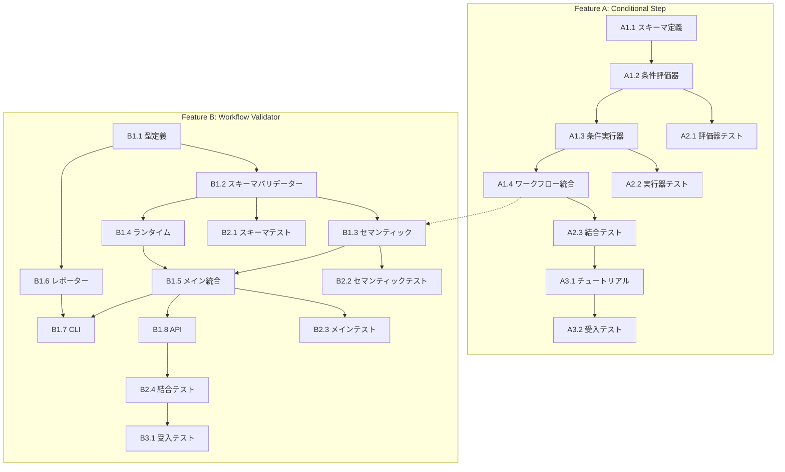

# Issue #348 V2 TaskFlow Engine Extensions - 作業計画書

## Issue: V2 TaskFlow Engine 拡張機能（Conditional Step + Workflow Validator）

**Issue番号**: #348（拡張フェーズ）
**サイズ**: L
**作業見積**: 11日（Conditional: 4.5日 + Validator: 6.5日）
**優先度**: High
**依存Issue**: #348基本実装（完了済み）

## 概要

V2 TaskFlow Engineに以下の2つの拡張機能を追加：

1. **Conditional Step**: `type: "conditional"` によるif/else分岐実行
2. **Workflow Validator**: 3層バリデーション + エージェントフィードバック

## 詳細タスク分解

---

## Feature A: Conditional Step (if/else分岐)

### Phase A1: 実装タスク

- [ ] **Task A1.1**: スキーマ定義（workflow-schema.ts拡張）
  - 所要時間: 2時間
  - 成果物: `graphAiServer/src/types/workflow-schema.ts`
  - 依存: なし
  - 内容:
    - `ConditionExpressionSchema` 追加（正規表現による厳格なパターン）
    - `ConditionalBlockSchema` 定義
    - `StepSchema` 更新（union型にconditional追加）

- [ ] **Task A1.2**: 条件式評価器実装（security-hardened）
  - 所要時間: 6時間
  - 成果物: `graphAiServer/src/engine/executor/condition-evaluator.ts`
  - 依存: Task A1.1
  - 内容:
    - `parseConditionExpression()`: 条件式パース
    - `parseAllowedValue()`: ホワイトリスト方式値パース
    - `evaluateCondition()`: 安全な条件評価
    - `compareValues()`: 比較演算

- [ ] **Task A1.3**: 条件実行器実装（関数ベース）
  - 所要時間: 2時間
  - 成果物: `graphAiServer/src/engine/executor/conditional-executor.ts`
  - 依存: Task A1.2
  - 内容:
    - `executeConditional()`: 条件分岐実行
    - 再帰深度制限（MAX_NESTING_DEPTH = 10）
    - ネストされたparallel/conditional対応

- [ ] **Task A1.4**: ワークフロー実行器統合
  - 所要時間: 2時間
  - 成果物: `graphAiServer/src/engine/executor/workflow-executor.ts`（更新）
  - 依存: Task A1.3
  - 内容:
    - `step.type === 'conditional'` 分岐追加
    - `executeConditional` 呼び出し統合

### Phase A2: テストタスク (TDD)

- [ ] **Task A2.1**: 条件式評価器 単体テスト
  - 所要時間: 4時間
  - 成果物: `graphAiServer/src/engine/executor/__tests__/condition-evaluator.test.ts`
  - カバレッジ目標: 95%
  - テストケース:
    - 文字列比較 (`==`, `!=`)
    - 数値比較 (`>`, `<`, `>=`, `<=`)
    - boolean/null比較
    - 無効な式の拒否
    - セキュリティテスト（インジェクション対策）

- [ ] **Task A2.2**: 条件実行器 単体テスト
  - 所要時間: 3時間
  - 成果物: `graphAiServer/src/engine/executor/__tests__/conditional-executor.test.ts`
  - カバレッジ目標: 90%
  - テストケース:
    - then分岐実行
    - else分岐実行
    - ネストされた条件
    - 深度制限超過エラー

- [ ] **Task A2.3**: 結合テスト（ワークフロー全体）
  - 所要時間: 3時間
  - 成果物: `graphAiServer/src/engine/__tests__/conditional-workflow-integration.test.ts`
  - シナリオ数: 5
  - テストケース:
    - 条件付きAPIコール
    - parallel内のconditional
    - conditional内のparallel
    - エラーハンドリング

### Phase A3: 受入テスト (L3)

- [ ] **Task A3.1**: チュートリアル例作成
  - 所要時間: 1時間
  - 成果物: `graphAiServer/config/taskflow/tutorial/8_conditional.json`

- [ ] **Task A3.2**: L3受入テスト実行
  - 所要時間: 1時間
  - 成果物: `graphAiServer/tests/acceptance/test_issue_348_conditional.sh`

---

## Feature B: Workflow Validator

### Phase B1: 実装タスク

- [ ] **Task B1.1**: バリデーション型定義
  - 所要時間: 2時間
  - 成果物: `graphAiServer/src/engine/validator/types.ts`
  - 依存: なし
  - 内容:
    - `ValidationSeverity`, `ValidationIssue`
    - `AgentFeedback`（エージェントフィードバック）
    - `ValidationResult`, `BatchValidationResult`

- [ ] **Task B1.2**: スキーマバリデーター実装
  - 所要時間: 2時間
  - 成果物: `graphAiServer/src/engine/validator/schema-validator.ts`
  - 依存: Task B1.1
  - 内容:
    - Zodスキーマによる構文検証
    - エラーパス情報付与

- [ ] **Task B1.3**: セマンティックバリデーター実装
  - 所要時間: 6時間
  - 成果物: `graphAiServer/src/engine/validator/semantic-validator.ts`
  - 依存: Task B1.2
  - 内容:
    - 変数参照整合性チェック
    - Step ID重複チェック
    - 出力マッピング検証
    - エージェントフィードバック生成

- [ ] **Task B1.4**: ランタイムバリデーター実装
  - 所要時間: 4時間
  - 成果物: `graphAiServer/src/engine/validator/runtime-validator.ts`
  - 依存: Task B1.2
  - 内容:
    - URL到達性チェック
    - タイムアウト処理

- [ ] **Task B1.5**: メインバリデーター統合
  - 所要時間: 2時間
  - 成果物: `graphAiServer/src/engine/validator/workflow-validator.ts`
  - 依存: Task B1.3, B1.4
  - 内容:
    - 依存性注入パターン
    - パストラバーサル対策
    - レベル別バリデーション統合
    - `generateAgentSummary()` 実装

- [ ] **Task B1.6**: レポーター実装
  - 所要時間: 2時間
  - 成果物: `graphAiServer/src/engine/validator/validation-reporter.ts`
  - 依存: Task B1.1
  - 内容:
    - テキスト出力
    - JSON出力
    - バッチレポート

- [ ] **Task B1.7**: CLIコマンド実装
  - 所要時間: 2時間
  - 成果物: `graphAiServer/src/cli/validate.ts`
  - 依存: Task B1.5, B1.6
  - 内容:
    - ファイル/ディレクトリ指定
    - オプション（level, strict, format）

- [ ] **Task B1.8**: APIエンドポイント実装
  - 所要時間: 2時間
  - 成果物: `graphAiServer/src/routes/validate.ts`
  - 依存: Task B1.5
  - 内容:
    - `POST /api/v2/workflows/validate`
    - `includeAgentFeedback` オプション

### Phase B2: テストタスク (TDD)

- [ ] **Task B2.1**: スキーマバリデーター 単体テスト
  - 所要時間: 2時間
  - 成果物: `graphAiServer/src/engine/validator/__tests__/schema-validator.test.ts`
  - カバレッジ目標: 95%

- [ ] **Task B2.2**: セマンティックバリデーター 単体テスト
  - 所要時間: 3時間
  - 成果物: `graphAiServer/src/engine/validator/__tests__/semantic-validator.test.ts`
  - カバレッジ目標: 90%
  - テストケース:
    - 未定義step参照検出
    - 重複ID検出
    - エージェントフィードバック生成

- [ ] **Task B2.3**: メインバリデーター 単体テスト
  - 所要時間: 2時間
  - 成果物: `graphAiServer/src/engine/validator/__tests__/workflow-validator.test.ts`
  - テストケース:
    - パストラバーサル攻撃拒否
    - 依存性注入
    - レベル別バリデーション

- [ ] **Task B2.4**: 結合テスト
  - 所要時間: 2時間
  - 成果物: `graphAiServer/src/engine/validator/__tests__/validator-integration.test.ts`
  - シナリオ数: 5

### Phase B3: 受入テスト (L3)

- [ ] **Task B3.1**: L3受入テスト実行
  - 所要時間: 1時間
  - 成果物: `graphAiServer/tests/acceptance/test_issue_348_validator.sh`

---

## タスク依存関係



## 作業スケジュール

### Day 1 (8時間) - Conditional Step 基盤
| 時間 | タスク |
|------|--------|
| 09:00-11:00 | Task A1.1: スキーマ定義 |
| 11:00-17:00 | Task A1.2: 条件評価器（security-hardened） |

### Day 2 (8時間) - Conditional Step 完成
| 時間 | タスク |
|------|--------|
| 09:00-11:00 | Task A1.3: 条件実行器 |
| 11:00-13:00 | Task A1.4: ワークフロー統合 |
| 14:00-18:00 | Task A2.1: 評価器単体テスト |

### Day 3 (8時間) - Conditional Step テスト
| 時間 | タスク |
|------|--------|
| 09:00-12:00 | Task A2.2: 実行器単体テスト |
| 13:00-16:00 | Task A2.3: 結合テスト |
| 16:00-17:00 | Task A3.1: チュートリアル作成 |
| 17:00-18:00 | Task A3.2: 受入テスト |

### Day 4 (8時間) - Validator 基盤
| 時間 | タスク |
|------|--------|
| 09:00-11:00 | Task B1.1: 型定義 |
| 11:00-13:00 | Task B1.2: スキーマバリデーター |
| 14:00-20:00 | Task B1.3: セマンティックバリデーター |

### Day 5 (8時間) - Validator 実装
| 時間 | タスク |
|------|--------|
| 09:00-13:00 | Task B1.4: ランタイムバリデーター |
| 14:00-16:00 | Task B1.5: メイン統合 |
| 16:00-18:00 | Task B1.6: レポーター |

### Day 6 (8時間) - Validator CLI/API
| 時間 | タスク |
|------|--------|
| 09:00-11:00 | Task B1.7: CLI実装 |
| 11:00-13:00 | Task B1.8: API実装 |
| 14:00-16:00 | Task B2.1: スキーマバリデーターテスト |
| 16:00-19:00 | Task B2.2: セマンティックバリデーターテスト |

### Day 7 (6時間) - Validator テスト完了
| 時間 | タスク |
|------|--------|
| 09:00-11:00 | Task B2.3: メインバリデーターテスト |
| 11:00-13:00 | Task B2.4: 結合テスト |
| 14:00-15:00 | Task B3.1: 受入テスト |

**総作業時間**: 54時間（約7日）

---

## チェックポイント

| タイミング | 確認事項 | 対応 |
|-----------|---------|------|
| Day 2完了時 | 条件評価器セキュリティテスト | 脆弱性があれば修正 |
| Day 3完了時 | Conditional Step機能完成 | CIグリーン確認 |
| Day 5完了時 | Validator基本機能完成 | エージェントフィードバック確認 |
| Day 7完了時 | 全機能完成 | 全テストパス確認 |

---

## リスクと対策

| リスク | 発生確率 | 影響 | 対策 |
|-------|---------|------|------|
| 条件式パース複雑化 | 中 | 2時間遅延 | シンプルなパターンに限定 |
| セキュリティ脆弱性発見 | 低 | 4時間遅延 | ホワイトリスト方式を厳守 |
| 既存テスト破損 | 低 | 2時間遅延 | 変更は後方互換性維持 |
| エージェント統合複雑化 | 中 | 3時間遅延 | シンプルなフィードバック形式 |

---

## 成果物チェックリスト

### Feature A: Conditional Step

#### コード
- [ ] `graphAiServer/src/types/workflow-schema.ts` (更新)
- [ ] `graphAiServer/src/engine/executor/condition-evaluator.ts` (新規)
- [ ] `graphAiServer/src/engine/executor/conditional-executor.ts` (新規)
- [ ] `graphAiServer/src/engine/executor/workflow-executor.ts` (更新)

#### テスト
- [ ] `graphAiServer/src/engine/executor/__tests__/condition-evaluator.test.ts`
- [ ] `graphAiServer/src/engine/executor/__tests__/conditional-executor.test.ts`
- [ ] `graphAiServer/src/engine/__tests__/conditional-workflow-integration.test.ts`

#### チュートリアル
- [ ] `graphAiServer/config/taskflow/tutorial/8_conditional.json`

### Feature B: Workflow Validator

#### コード
- [ ] `graphAiServer/src/engine/validator/types.ts` (新規)
- [ ] `graphAiServer/src/engine/validator/schema-validator.ts` (新規)
- [ ] `graphAiServer/src/engine/validator/semantic-validator.ts` (新規)
- [ ] `graphAiServer/src/engine/validator/runtime-validator.ts` (新規)
- [ ] `graphAiServer/src/engine/validator/workflow-validator.ts` (新規)
- [ ] `graphAiServer/src/engine/validator/validation-reporter.ts` (新規)
- [ ] `graphAiServer/src/cli/validate.ts` (新規)
- [ ] `graphAiServer/src/routes/validate.ts` (新規)

#### テスト
- [ ] `graphAiServer/src/engine/validator/__tests__/schema-validator.test.ts`
- [ ] `graphAiServer/src/engine/validator/__tests__/semantic-validator.test.ts`
- [ ] `graphAiServer/src/engine/validator/__tests__/workflow-validator.test.ts`
- [ ] `graphAiServer/src/engine/validator/__tests__/validator-integration.test.ts`

---

## L3受入テスト計画（具体的なコマンド）

### Step 1: サービス起動確認

```bash
# サービス起動
./scripts/dev-hybrid.sh

# ヘルスチェック
curl -sf http://localhost:8000/health && echo "graphAiServer: healthy"
```

### Step 2: Conditional Step 動作確認

```bash
# チュートリアル8: Conditional分岐ワークフロー登録
curl -s -X POST "http://localhost:8000/api/v2/workflows/register" \
  -H "Content-Type: application/json" \
  -H "X-Admin-Token: $ADMIN_TOKEN" \
  -d '{
    "workflow_name": "tutorial_8_conditional",
    "definition": {
      "workflow_name": "tutorial_8_conditional",
      "input_schema": {"status": "string"},
      "output_schema": {"message": "string"},
      "steps": [
        {
          "type": "conditional",
          "condition": "${inputs.status} == '\''active'\''",
          "then": [
            {"id": "active_msg", "type": "transform", "config": {"mode": "template", "template": "User is ACTIVE"}, "params": {}}
          ],
          "else": [
            {"id": "inactive_msg", "type": "transform", "config": {"mode": "template", "template": "User is INACTIVE"}, "params": {}}
          ]
        }
      ],
      "output": {"message": "${active_msg.output.result ?? inactive_msg.output.result}"}
    }
  }'

# 実行テスト: then分岐
curl -s -X POST "http://localhost:8000/api/v2/workflows" \
  -H "Content-Type: application/json" \
  -d '{"workflow_name": "tutorial_8_conditional", "inputs": {"status": "active"}}'
# 期待: {"message": "User is ACTIVE"}

# 実行テスト: else分岐
curl -s -X POST "http://localhost:8000/api/v2/workflows" \
  -H "Content-Type: application/json" \
  -d '{"workflow_name": "tutorial_8_conditional", "inputs": {"status": "inactive"}}'
# 期待: {"message": "User is INACTIVE"}
```

### Step 3: Workflow Validator 動作確認

```bash
# 正常なワークフロー検証
curl -s -X POST "http://localhost:8000/api/v2/workflows/validate" \
  -H "Content-Type: application/json" \
  -d '{
    "definition": {
      "workflow_name": "valid_workflow",
      "steps": [{"id": "step1", "type": "transform", "config": {"mode": "template", "template": "Hello"}, "params": {}}],
      "output": {"result": "${step1.output.result}"}
    }
  }'
# 期待: {"valid": true, ...}

# エラーのあるワークフロー検証（未定義step参照）
curl -s -X POST "http://localhost:8000/api/v2/workflows/validate" \
  -H "Content-Type: application/json" \
  -d '{
    "definition": {
      "workflow_name": "invalid_workflow",
      "steps": [{"id": "step1", "type": "transform", "config": {"mode": "template", "template": "Hello"}, "params": {}}],
      "output": {"result": "${undefined_step.output.result}"}
    },
    "options": {"includeAgentFeedback": true}
  }'
# 期待: {"valid": false, "issues": [...], "agentSummary": {...}}

# CLI検証
npx taskflow validate config/taskflow/tutorial/
# 期待: 全ファイルValid
```

### Step 4: エビデンス収集

```bash
# 受入テスト結果をファイルに保存
curl -s ... > /tmp/conditional_test_result.json
curl -s ... > /tmp/validator_test_result.json

# ログ確認
tail -50 graphAiServer/logs/*.log | grep -E "(ERROR|WARNING)"
```

---

## Definition of Done

Issue完了条件：
- [ ] すべてのタスクが完了
- [ ] 単体テストカバレッジ90%以上
- [ ] 結合テスト全シナリオパス
- [ ] **L3受入テスト全パス**（Conditional + Validator）
- [ ] CI/CDグリーン
- [ ] セキュリティテストパス（条件式インジェクション対策）
- [ ] コードレビュー承認
- [ ] チュートリアル更新完了

---

## 次のアクション

作業計画承認後：
1. **ブランチ作成**: `issue/348-v2-extensions`
2. **TDD開始**: Phase A1から順次実装
3. **進捗報告**: `/progress-report`で定期報告
4. **PR作成**: 全タスク完了後
