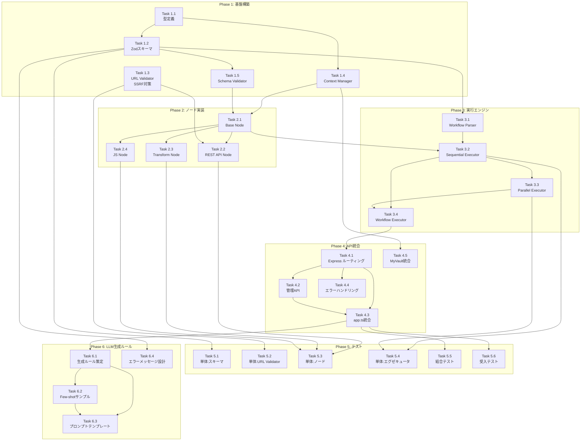

# 作業計画書: Issue #348 - TaskFlow Engine実装

## Issue概要

| 項目 | 内容 |
|------|------|
| **Issue番号** | #348 |
| **タイトル** | モジュール化されたタスク定義に基づく並列API実行エンジンの実装 |
| **サイズ** | L (Large) |
| **作業見積** | 48時間（6日間） |
| **優先度** | High |
| **依存Issue** | なし |
| **対象プロジェクト** | GraphAiServer |

## 前提ドキュメント

| ドキュメント | 状態 | パス |
|-------------|------|------|
| 設計方針書 | 完了 | `dev-reports/feature/issue/348/design-policy.md` |
| アーキテクチャレビュー | 承認済み | `dev-reports/feature/issue/348/architecture-review.md` |

---

## 詳細タスク分解

### Phase 1: 基盤構築（8時間）

#### Task 1.1: TypeScript型定義
- **所要時間**: 2時間
- **成果物**: `graphAiServer/src/types/taskflow.ts`
- **依存**: なし
- **内容**:
  - [ ] `NodeType`, `NodeState`, `HttpMethod` 型定義
  - [ ] `IOSchemaType` 型定義
  - [ ] `ApiRestConfig`, `CodeJsConfig`, `TransformConfig` 型定義
  - [ ] `WorkflowDefinition` 型定義
  - [ ] `NodeResult`, `WorkflowResult` 型定義

#### Task 1.2: Zodスキーマ定義
- **所要時間**: 2時間
- **成果物**: `graphAiServer/src/engine/schemas/workflow-schema.ts`
- **依存**: Task 1.1
- **内容**:
  - [ ] `SimpleTypeSchema` 定義
  - [ ] `IOSchema` 定義
  - [ ] `ApiRestConfigSchema` (HTTPS検証付き)
  - [ ] `CodeJsConfigSchema`
  - [ ] `TransformConfigSchema`
  - [ ] `WorkflowDefinitionSchema`

#### Task 1.3: URL Validator実装（SSRF対策）【Must Fix】
- **所要時間**: 2時間
- **成果物**: `graphAiServer/src/engine/validator/url-validator.ts`
- **依存**: なし
- **内容**:
  - [ ] プライベートIPレンジ検出
  - [ ] 禁止ホスト名チェック（localhost, metadata等）
  - [ ] ドメインホワイトリスト機能
  - [ ] HTTPS強制検証
  - [ ] 環境変数 `TASKFLOW_ALLOWED_DOMAINS` 対応

#### Task 1.4: Context Manager実装
- **所要時間**: 1.5時間
- **成果物**: `graphAiServer/src/engine/context/context-manager.ts`
- **依存**: Task 1.1
- **内容**:
  - [ ] `inputs` 格納
  - [ ] ノード出力の保存・取得
  - [ ] 変数参照解決 (`${node_id.output.field}`)
  - [ ] 環境変数解決 (`${env.VAR}`)
  - [ ] シークレット解決 (`${secrets.KEY}`)

#### Task 1.5: Schema Validator実装
- **所要時間**: 0.5時間
- **成果物**: `graphAiServer/src/engine/validator/schema-validator.ts`
- **依存**: Task 1.2
- **内容**:
  - [ ] `validateInput()` メソッド
  - [ ] `validateOutput()` メソッド
  - [ ] エラーメッセージ整形

---

### Phase 2: ノード実装（10時間）

#### Task 2.1: Base Node抽象クラス
- **所要時間**: 1.5時間
- **成果物**: `graphAiServer/src/nodes/base-node.ts`
- **依存**: Task 1.4, Task 1.5
- **内容**:
  - [ ] 抽象クラス `BaseNode` 定義
  - [ ] `execute()` 抽象メソッド
  - [ ] `validateInput()` / `validateOutput()` 共通処理
  - [ ] `resolveParams()` 変数解決
  - [ ] ログ出力共通処理

#### Task 2.2: REST API Node実装【Must Fix含む】
- **所要時間**: 3時間
- **成果物**: `graphAiServer/src/nodes/api-rest-node.ts`
- **依存**: Task 2.1, Task 1.3
- **内容**:
  - [ ] HTTPリクエスト構築
  - [ ] **URL検証（SSRF対策）**
  - [ ] **HTTPS強制・SSL検証**
  - [ ] ヘッダー・ボディの変数解決
  - [ ] タイムアウト処理
  - [ ] レスポンスパース
  - [ ] エラーハンドリング

#### Task 2.3: Transform Node実装
- **所要時間**: 2.5時間
- **成果物**: `graphAiServer/src/nodes/transform-node.ts`
- **依存**: Task 2.1
- **内容**:
  - [ ] `mode: "template"` - Handlebars展開
  - [ ] `mode: "concat"` - 文字列/配列結合
  - [ ] `mode: "map"` - 配列要素変換
  - [ ] `mode: "merge"` - オブジェクトマージ
  - [ ] Handlebarsセキュア設定（noEscape禁止）

#### Task 2.4: JavaScript Node実装
- **所要時間**: 3時間
- **成果物**: `graphAiServer/src/nodes/code-js-node.ts`
- **依存**: Task 2.1
- **内容**:
  - [ ] `isolated-vm` サンドボックス初期化
  - [ ] JSファイルロード（パス検証）
  - [ ] 関数実行（タイムアウト5秒）
  - [ ] メモリ制限（128MB）
  - [ ] 許可モジュールホワイトリスト
  - [ ] 結果抽出

---

### Phase 3: 実行エンジン（8時間）

#### Task 3.1: Workflow Parser実装
- **所要時間**: 2時間
- **成果物**: `graphAiServer/src/engine/parser/workflow-parser.ts`
- **依存**: Task 1.2
- **内容**:
  - [ ] JSON解析
  - [ ] Zodスキーマ検証
  - [ ] ノードインスタンス生成（Factory）
  - [ ] 依存関係解析
  - [ ] 入力スキーマ検証

#### Task 3.2: Sequential Executor実装
- **所要時間**: 2時間
- **成果物**: `graphAiServer/src/engine/executor/sequential-executor.ts`
- **依存**: Task 2.1, Task 3.1
- **内容**:
  - [ ] ステップ順次実行
  - [ ] コンテキスト更新
  - [ ] エラー伝播
  - [ ] 実行ログ収集

#### Task 3.3: Parallel Executor実装
- **所要時間**: 2時間
- **成果物**: `graphAiServer/src/engine/executor/parallel-executor.ts`
- **依存**: Task 3.2
- **内容**:
  - [ ] `Promise.allSettled` による並列実行
  - [ ] 部分失敗時の継続実行
  - [ ] 結果マージ
  - [ ] 並列実行ログ

#### Task 3.4: Workflow Executor統合
- **所要時間**: 2時間
- **成果物**: `graphAiServer/src/engine/executor/workflow-executor.ts`
- **依存**: Task 3.2, Task 3.3
- **内容**:
  - [ ] Sequential/Parallel切り替え
  - [ ] 最終出力マッピング
  - [ ] `output_schema` 検証
  - [ ] `WorkflowResult` 構築

---

### Phase 4: API統合（6時間）

#### Task 4.1: Express ルーティング追加
- **所要時間**: 1.5時間
- **成果物**: `graphAiServer/src/api/v2/workflows.ts`
- **依存**: Task 3.4
- **内容**:
  - [ ] `POST /api/v2/workflows` - ワークフロー実行
  - [ ] `POST /api/v2/workflows/validate` - 定義検証
  - [ ] リクエストボディパース
  - [ ] レスポンス形式統一

#### Task 4.2: 管理API実装
- **所要時間**: 1.5時間
- **成果物**: `graphAiServer/src/api/v2/workflows.ts` (追記)
- **依存**: Task 4.1
- **内容**:
  - [ ] `POST /api/v2/workflows/register` - ワークフロー登録
  - [ ] `GET /api/v2/workflows/{name}` - 定義取得
  - [ ] `DELETE /api/v2/workflows/{name}` - 削除
  - [ ] `X-Admin-Token` 認証

#### Task 4.3: app.ts統合
- **所要時間**: 1時間
- **成果物**: `graphAiServer/src/app.ts` (修正)
- **依存**: Task 4.1, Task 4.2
- **内容**:
  - [ ] v2ルーター登録
  - [ ] エラーハンドラー追加
  - [ ] ヘルスチェック拡張

#### Task 4.4: エラーハンドリング統一
- **所要時間**: 1時間
- **成果物**: `graphAiServer/src/api/v2/error-handler.ts`
- **依存**: Task 4.1
- **内容**:
  - [ ] 400/500エラー形式統一
  - [ ] 本番環境スタックトレース隠蔽
  - [ ] セキュリティイベントログ

#### Task 4.5: MyVault統合
- **所要時間**: 1時間
- **成果物**: `graphAiServer/src/engine/context/context-manager.ts` (修正)
- **依存**: Task 1.4
- **内容**:
  - [ ] 既存 `secretsManager` 連携
  - [ ] `${secrets.KEY}` 解決
  - [ ] キャッシュ戦略

---

### Phase 5: テスト実装（8時間）

#### Task 5.1: 単体テスト - 型・スキーマ
- **所要時間**: 1時間
- **成果物**: `graphAiServer/tests/unit/engine/test-schemas.ts`
- **依存**: Task 1.2
- **カバレッジ目標**: 95%
- **内容**:
  - [ ] Zodスキーマ検証テスト
  - [ ] 型変換テスト

#### Task 5.2: 単体テスト - URL Validator
- **所要時間**: 1時間
- **成果物**: `graphAiServer/tests/unit/engine/test-url-validator.ts`
- **依存**: Task 1.3
- **カバレッジ目標**: 100%
- **内容**:
  - [ ] プライベートIP拒否テスト
  - [ ] 禁止ホスト拒否テスト
  - [ ] HTTPS強制テスト
  - [ ] ホワイトリストテスト

#### Task 5.3: 単体テスト - ノード
- **所要時間**: 2時間
- **成果物**: `graphAiServer/tests/unit/nodes/`
- **依存**: Task 2.2, Task 2.3, Task 2.4
- **カバレッジ目標**: 90%
- **内容**:
  - [ ] `test-api-rest-node.ts`
  - [ ] `test-transform-node.ts`
  - [ ] `test-code-js-node.ts`

#### Task 5.4: 単体テスト - エグゼキュータ
- **所要時間**: 1.5時間
- **成果物**: `graphAiServer/tests/unit/engine/test-executors.ts`
- **依存**: Task 3.2, Task 3.3
- **カバレッジ目標**: 90%
- **内容**:
  - [ ] 直列実行テスト
  - [ ] 並列実行テスト
  - [ ] エラー伝播テスト

#### Task 5.5: 結合テスト
- **所要時間**: 1.5時間
- **成果物**: `graphAiServer/tests/integration/test-workflow-execution.ts`
- **依存**: Task 4.3
- **シナリオ数**: 5
- **内容**:
  - [ ] 直列ワークフロー実行
  - [ ] 並列ワークフロー実行
  - [ ] 混合パターン実行
  - [ ] エラーハンドリング
  - [ ] 出力マッピング

#### Task 5.6: 受入テスト
- **所要時間**: 1時間
- **成果物**: `graphAiServer/tests/acceptance/test_issue_348_acceptance.py`
- **依存**: Task 4.3
- **内容**:
  - [ ] サービス起動確認
  - [ ] API エンドポイント呼び出し
  - [ ] ワークフロー実行確認
  - [ ] エビデンス収集

---

### Phase 6: ワークフロー生成ルール・ガイドライン作成（8時間）

**目的**: ミドルエンドLLM（gemini-flash、claude-haiku等）がTaskFlowワークフローを高精度で生成できるよう、明確なルールとガイドラインを策定する。

#### Task 6.1: ワークフロー生成ルール策定
- **所要時間**: 3時間
- **成果物**: `graphAiServer/docs/TASKFLOW_GENERATION_RULES.md`
- **依存**: Phase 4完了
- **内容**:
  - [ ] JSON構造ルール（必須フィールド、型制約）
  - [ ] ノード種別選択ガイドライン
    - `api_rest`: 外部API呼び出しが必要な場合
    - `code_js`: 計算・ロジック処理が必要な場合
    - `transform`: データ整形・テンプレート展開の場合
  - [ ] 変数参照記法ルール（`${node_id.output.field}` 等）
  - [ ] 並列実行の判断基準
  - [ ] 禁止パターン・アンチパターン

#### Task 6.2: Few-shotサンプル作成
- **所要時間**: 2.5時間
- **成果物**: `graphAiServer/docs/examples/`
- **依存**: Task 6.1
- **内容**:
  - [ ] `01_simple_api_call.json` - 単一API呼び出し
  - [ ] `02_sequential_workflow.json` - 直列ワークフロー
  - [ ] `03_parallel_workflow.json` - 並列ワークフロー
  - [ ] `04_mixed_pattern.json` - 直列+並列混合
  - [ ] `05_transform_chain.json` - データ変換チェーン
  - [ ] `06_error_handling.json` - エラーハンドリング付き
  - [ ] 各サンプルに「なぜこのパターンを選んだか」の解説コメント

#### Task 6.3: LLMプロンプトテンプレート作成
- **所要時間**: 1.5時間
- **成果物**: `graphAiServer/docs/prompts/workflow_generator_system.md`
- **依存**: Task 6.1, Task 6.2
- **内容**:
  - [ ] System Promptテンプレート
  - [ ] ノード種別選択の判断フロー
  - [ ] 入出力スキーマ設計ガイド
  - [ ] 並列化判断の思考プロセス
  - [ ] 出力フォーマット指定（JSON Schema）

#### Task 6.4: バリデーションエラーメッセージ設計
- **所要時間**: 1時間
- **成果物**: `graphAiServer/src/engine/validator/error-messages.ts`
- **依存**: Task 1.2
- **内容**:
  - [ ] LLMが理解しやすいエラーメッセージ設計
  - [ ] 修正提案の自動生成
  - [ ] エラーコード体系（リトライ判断用）
  - [ ] エラー → 修正アクションのマッピング

**Phase 6 設計方針**:

```
┌─────────────────────────────────────────────────────────────┐
│ LLM Workflow Generation Flow                                │
├─────────────────────────────────────────────────────────────┤
│                                                             │
│  1. System Prompt (Task 6.3)                                │
│     └─ ルール・制約の注入                                    │
│                                                             │
│  2. Few-shot Examples (Task 6.2)                            │
│     └─ パターン別の具体例                                    │
│                                                             │
│  3. User Request                                            │
│     └─ タスク要件・利用可能API情報                           │
│                                                             │
│  4. LLM Generation (gemini-flash / claude-haiku)            │
│     └─ TaskFlow JSON出力                                    │
│                                                             │
│  5. Validation (Task 6.4)                                   │
│     └─ エラー時は修正提案付きでリトライ                       │
│                                                             │
└─────────────────────────────────────────────────────────────┘
```

---

## タスク依存関係



---

## 作業スケジュール

### Day 1（8時間）- Phase 1完了

| 時間 | タスク | 成果物 |
|------|--------|--------|
| 09:00-11:00 | Task 1.1 型定義 | `types/taskflow.ts` |
| 11:00-13:00 | Task 1.2 Zodスキーマ | `schemas/workflow-schema.ts` |
| 14:00-16:00 | Task 1.3 URL Validator | `validator/url-validator.ts` |
| 16:00-17:30 | Task 1.4 Context Manager | `context/context-manager.ts` |
| 17:30-18:00 | Task 1.5 Schema Validator | `validator/schema-validator.ts` |

### Day 2（8時間）- Phase 2完了

| 時間 | タスク | 成果物 |
|------|--------|--------|
| 09:00-10:30 | Task 2.1 Base Node | `nodes/base-node.ts` |
| 10:30-13:30 | Task 2.2 REST API Node | `nodes/api-rest-node.ts` |
| 14:30-17:00 | Task 2.3 Transform Node | `nodes/transform-node.ts` |
| 17:00-20:00 | Task 2.4 JS Node | `nodes/code-js-node.ts` |

### Day 3（8時間）- Phase 3完了

| 時間 | タスク | 成果物 |
|------|--------|--------|
| 09:00-11:00 | Task 3.1 Workflow Parser | `parser/workflow-parser.ts` |
| 11:00-13:00 | Task 3.2 Sequential Executor | `executor/sequential-executor.ts` |
| 14:00-16:00 | Task 3.3 Parallel Executor | `executor/parallel-executor.ts` |
| 16:00-18:00 | Task 3.4 Workflow Executor | `executor/workflow-executor.ts` |

### Day 4（8時間）- Phase 4 + テスト開始

| 時間 | タスク | 成果物 |
|------|--------|--------|
| 09:00-10:30 | Task 4.1 Expressルーティング | `api/v2/workflows.ts` |
| 10:30-12:00 | Task 4.2 管理API | `api/v2/workflows.ts` |
| 13:00-14:00 | Task 4.3 app.ts統合 | `app.ts` |
| 14:00-15:00 | Task 4.4 エラーハンドリング | `api/v2/error-handler.ts` |
| 15:00-16:00 | Task 4.5 MyVault統合 | `context-manager.ts` |
| 16:00-17:00 | Task 5.1 単体テスト:スキーマ | `tests/unit/` |
| 17:00-18:00 | Task 5.2 単体テスト:URL Validator | `tests/unit/` |

### Day 5（8時間）- テスト完了

| 時間 | タスク | 成果物 |
|------|--------|--------|
| 09:00-11:00 | Task 5.3 単体テスト:ノード | `tests/unit/nodes/` |
| 11:00-12:30 | Task 5.4 単体テスト:エグゼキュータ | `tests/unit/engine/` |
| 13:30-15:00 | Task 5.5 結合テスト | `tests/integration/` |
| 15:00-16:00 | Task 5.6 受入テスト | `tests/acceptance/` |
| 16:00-18:00 | Task 6.4 エラーメッセージ設計 | `validator/error-messages.ts` |

### Day 6（8時間）- LLM生成ルール + PR作成

| 時間 | タスク | 成果物 |
|------|--------|--------|
| 09:00-12:00 | Task 6.1 ワークフロー生成ルール策定 | `docs/TASKFLOW_GENERATION_RULES.md` |
| 13:00-15:30 | Task 6.2 Few-shotサンプル作成 | `docs/examples/*.json` |
| 15:30-17:00 | Task 6.3 LLMプロンプトテンプレート | `docs/prompts/workflow_generator_system.md` |
| 17:00-18:00 | コードレビュー準備・PR作成 | PR |

---

## チェックポイント

| タイミング | 確認事項 | 対応 |
|-----------|---------|------|
| Phase 1完了時 | 型定義・バリデータ動作確認 | 単体テスト実行 |
| Task 2.2完了時 | SSRF対策・HTTPS強制確認 | セキュリティテスト |
| Phase 2完了時 | 各ノード単独動作確認 | 手動テスト |
| Phase 3完了時 | ワークフロー実行確認 | サンプルワークフロー |
| Phase 4完了時 | API動作確認 | curl テスト |
| Phase 5完了時 | テストカバレッジ確認 | 90%以上 |
| Task 6.1完了時 | ルール網羅性確認 | レビュー |
| Task 6.2完了時 | サンプル実行確認 | 全サンプルをv2 APIで実行 |
| PR作成前 | CI/CDパス確認 | 全テスト実行 |

---

## リスクと対策

| リスク | 発生確率 | 影響 | 対策 |
|-------|---------|------|------|
| isolated-vm互換性問題 | 中 | 実装遅延1日 | 代替としてvm2を検討 |
| Handlebars脆弱性 | 低 | セキュリティリスク | セキュア設定徹底 |
| 並列実行デッドロック | 低 | 実行停止 | タイムアウト設定 |
| MyVault連携エラー | 低 | シークレット取得失敗 | 既存パターン踏襲 |
| テストカバレッジ不足 | 中 | 品質低下 | 追加テスト時間確保 |

---

## 成果物チェックリスト

### 新規ファイル

#### types/
- [ ] `graphAiServer/src/types/taskflow.ts`

#### engine/
- [ ] `graphAiServer/src/engine/schemas/workflow-schema.ts`
- [ ] `graphAiServer/src/engine/validator/url-validator.ts`
- [ ] `graphAiServer/src/engine/validator/schema-validator.ts`
- [ ] `graphAiServer/src/engine/context/context-manager.ts`
- [ ] `graphAiServer/src/engine/parser/workflow-parser.ts`
- [ ] `graphAiServer/src/engine/executor/sequential-executor.ts`
- [ ] `graphAiServer/src/engine/executor/parallel-executor.ts`
- [ ] `graphAiServer/src/engine/executor/workflow-executor.ts`

#### nodes/
- [ ] `graphAiServer/src/nodes/base-node.ts`
- [ ] `graphAiServer/src/nodes/api-rest-node.ts`
- [ ] `graphAiServer/src/nodes/transform-node.ts`
- [ ] `graphAiServer/src/nodes/code-js-node.ts`

#### api/
- [ ] `graphAiServer/src/api/v2/workflows.ts`
- [ ] `graphAiServer/src/api/v2/error-handler.ts`

### 修正ファイル
- [ ] `graphAiServer/src/app.ts` - v2ルーター追加

### テストファイル
- [ ] `graphAiServer/tests/unit/engine/test-schemas.ts`
- [ ] `graphAiServer/tests/unit/engine/test-url-validator.ts`
- [ ] `graphAiServer/tests/unit/nodes/test-api-rest-node.ts`
- [ ] `graphAiServer/tests/unit/nodes/test-transform-node.ts`
- [ ] `graphAiServer/tests/unit/nodes/test-code-js-node.ts`
- [ ] `graphAiServer/tests/unit/engine/test-executors.ts`
- [ ] `graphAiServer/tests/integration/test-workflow-execution.ts`
- [ ] `graphAiServer/tests/acceptance/test_issue_348_acceptance.py`

### ドキュメント・ルール（Phase 6）
- [ ] `graphAiServer/docs/TASKFLOW_GENERATION_RULES.md`
- [ ] `graphAiServer/docs/examples/01_simple_api_call.json`
- [ ] `graphAiServer/docs/examples/02_sequential_workflow.json`
- [ ] `graphAiServer/docs/examples/03_parallel_workflow.json`
- [ ] `graphAiServer/docs/examples/04_mixed_pattern.json`
- [ ] `graphAiServer/docs/examples/05_transform_chain.json`
- [ ] `graphAiServer/docs/examples/06_error_handling.json`
- [ ] `graphAiServer/docs/prompts/workflow_generator_system.md`
- [ ] `graphAiServer/src/engine/validator/error-messages.ts`

---

## L3受入テスト計画【必須セクション】

### Step 1: サービス起動確認

```bash
# サービス起動
./scripts/dev-hybrid.sh

# ヘルスチェック
curl -sf http://localhost:8005/health && echo "✅ graphAiServer: healthy"
curl -sf http://localhost:8003/health && echo "✅ myVault: healthy"
```

### Step 2: v2 API エンドポイント呼び出し

#### 2.1 ワークフロー定義検証

```bash
# 正常系: 有効なワークフロー定義
curl -s -X POST http://localhost:8005/api/v2/workflows/validate \
  -H "Content-Type: application/json" \
  -d '{
    "workflow_name": "test_workflow",
    "input_schema": {"user_id": "string"},
    "output_schema": {"result": "string"},
    "steps": [
      {
        "id": "fetch_data",
        "type": "api_rest",
        "config": {
          "method": "GET",
          "url": "https://jsonplaceholder.typicode.com/users/${inputs.user_id}"
        }
      }
    ],
    "output": {"result": "${fetch_data.output.name}"}
  }' | jq .

# 期待するレスポンス:
# {"valid": true, "errors": []}

# 異常系: 無効なスキーマ
curl -s -X POST http://localhost:8005/api/v2/workflows/validate \
  -H "Content-Type: application/json" \
  -d '{
    "workflow_name": "invalid",
    "steps": []
  }' | jq .

# 期待するレスポンス:
# {"valid": false, "errors": [...]}
```

#### 2.2 ワークフロー実行

```bash
# 正常系: 直列ワークフロー実行
curl -s -X POST http://localhost:8005/api/v2/workflows \
  -H "Content-Type: application/json" \
  -d '{
    "workflow_name": "user_fetch",
    "inputs": {"user_id": "1"},
    "definition": {
      "workflow_name": "user_fetch",
      "input_schema": {"user_id": "string"},
      "output_schema": {"user_name": "string"},
      "steps": [
        {
          "id": "fetch_user",
          "type": "api_rest",
          "config": {
            "method": "GET",
            "url": "https://jsonplaceholder.typicode.com/users/${inputs.user_id}"
          }
        }
      ],
      "output": {"user_name": "${fetch_user.output.name}"}
    }
  }' | jq .

# 期待するレスポンス:
# {
#   "results": {
#     "inputs": {"user_id": "1"},
#     "fetch_user": {"id": 1, "name": "Leanne Graham", ...},
#     "_output": {"user_name": "Leanne Graham"}
#   },
#   "errors": {},
#   "logs": [...]
# }
```

#### 2.3 SSRF対策確認

```bash
# SSRF攻撃テスト: プライベートIP拒否
curl -s -X POST http://localhost:8005/api/v2/workflows \
  -H "Content-Type: application/json" \
  -d '{
    "workflow_name": "ssrf_test",
    "inputs": {},
    "definition": {
      "workflow_name": "ssrf_test",
      "input_schema": {},
      "output_schema": {"data": "string"},
      "steps": [
        {
          "id": "attack",
          "type": "api_rest",
          "config": {
            "method": "GET",
            "url": "http://169.254.169.254/latest/meta-data/"
          }
        }
      ],
      "output": {"data": "${attack.output}"}
    }
  }' -w "\nHTTP Status: %{http_code}\n"

# 期待するレスポンス:
# HTTP Status: 400
# {"error": "URL validation failed: ..."}
```

#### 2.4 並列実行確認

```bash
# 並列ワークフロー実行
curl -s -X POST http://localhost:8005/api/v2/workflows \
  -H "Content-Type: application/json" \
  -d '{
    "workflow_name": "parallel_fetch",
    "inputs": {},
    "definition": {
      "workflow_name": "parallel_fetch",
      "input_schema": {},
      "output_schema": {"user_count": "number", "post_count": "number"},
      "steps": [
        {
          "type": "parallel",
          "steps": [
            {
              "id": "fetch_users",
              "type": "api_rest",
              "config": {"method": "GET", "url": "https://jsonplaceholder.typicode.com/users"}
            },
            {
              "id": "fetch_posts",
              "type": "api_rest",
              "config": {"method": "GET", "url": "https://jsonplaceholder.typicode.com/posts"}
            }
          ]
        }
      ],
      "output": {
        "user_count": "${fetch_users.output.length}",
        "post_count": "${fetch_posts.output.length}"
      }
    }
  }' | jq .

# 期待するレスポンス: 両方のAPI結果が取得されていること
```

### Step 3: エビデンス収集

```bash
# レスポンスをファイルに保存
curl -s -X POST http://localhost:8005/api/v2/workflows ... \
  > /tmp/issue_348_acceptance_response.json

# サービスログ確認
tail -100 graphAiServer/logs/graphaiserver.log | grep -E "(ERROR|WARNING|v2)"
```

---

## Definition of Done

Issue完了条件：

### コード品質
- [ ] すべてのタスクが完了（Phase 1〜6）
- [ ] 単体テストカバレッジ 90%以上
- [ ] 結合テスト全シナリオパス
- [ ] 静的解析エラーなし（TypeScript）

### セキュリティ
- [ ] SSRF対策実装・テスト完了
- [ ] HTTPS強制実装・テスト完了
- [ ] サンドボックス（isolated-vm）動作確認

### 受入テスト
- [ ] L3受入テスト全パス
- [ ] v2 API エンドポイント動作確認
- [ ] 並列実行動作確認
- [ ] エラーハンドリング確認

### LLM生成ルール（Phase 6）
- [ ] `TASKFLOW_GENERATION_RULES.md` 作成完了
- [ ] Few-shotサンプル6パターン作成完了
- [ ] 全サンプルがv2 APIで正常実行確認
- [ ] LLMプロンプトテンプレート作成完了
- [ ] エラーメッセージがLLM修正可能な形式

### ドキュメント
- [ ] API仕様書作成
- [ ] README更新

### CI/CD
- [ ] CI/CDグリーン
- [ ] コードレビュー承認

---

## 次のアクション

作業計画承認後：

1. **ブランチ作成**: `issue/348-taskflow-engine`
2. **worktree作成**: `git worktree add ../issue-348 issue/348-taskflow-engine`
3. **依存パッケージ追加**:
   ```bash
   cd graphAiServer
   npm install zod isolated-vm handlebars
   npm install -D @types/handlebars
   ```
4. **タスク実行**: Phase 1から順次実装
5. **進捗報告**: `/progress-report`で定期報告

---

**作成日**: 2026-01-10
**対象Issue**: #348
**ステータス**: 承認待ち
