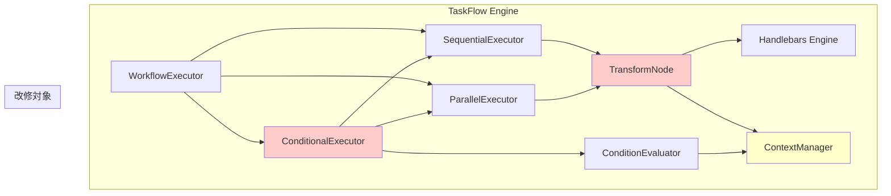

# 設計方針書: TaskFlow V2 Transform/Conditional 課題修正

## Issue情報

- **Issue番号**: #349
- **タイトル**: TaskFlow V2: チュートリアル検証で発見された課題（Transform/Conditional）
- **対象プロジェクト**: graphAiServer
- **ラベル**: enhancement, feature

---

## 現状調査サマリ

### 対象プロジェクト

- **プロジェクト名**: graphAiServer
- **主要モジュール**:
  - `src/nodes/transform-node.ts` - Transform ノード実装
  - `src/engine/executor/conditional-executor.ts` - 条件分岐実行
  - `src/engine/executor/condition-evaluator.ts` - 条件式評価
  - `src/engine/context/context-manager.ts` - コンテキスト管理

### 既存アーキテクチャパターン

| パターン | 使用箇所 | 目的 |
|---------|---------|------|
| **Strategy Pattern** | TransformNode (mode: template/concat/map/merge) | 変換モードの切り替え |
| **Factory Pattern** | createTransformNode() | ノードインスタンス生成 |
| **Context Pattern** | ContextManager | 実行コンテキストの一元管理 |
| **Executor Pattern** | SequentialExecutor, ParallelExecutor, ConditionalExecutor | 実行戦略の分離 |

### 類似機能の設計

| 機能 | 実装方法 | 参考ポイント |
|-----|---------|-------------|
| Template Mode | Handlebarsでの変数展開 | ヘルパー関数の登録方式 |
| Concat Mode | 配列/文字列の結合 | 型に応じた処理分岐 |
| Condition Evaluation | ホワイトリスト方式 | セキュリティを重視した安全な評価 |

### 発見された課題

#### 課題1: Map モードの `@index` ヘルパー未対応

**根本原因**: Handlebarsは `{{@index}}` を `#each` ブロック内でのみ認識する特殊変数として扱う。現在の実装では `@index` をコンテキストオブジェクトのプロパティとして設定しているが、Handlebarsは `{{@index}}` 構文を通常の変数参照として解釈しない。

```typescript
// 現状のコード (transform-node.ts:192-201)
const context = {
  ...params,
  '@index': index,      // 設定しているが...
  '@first': index === 0,
  '@last': index === source.length - 1,
  ...item,
};
return this.compiledTemplate!(context);  // {{@index}} は認識されない
```

**影響**: 番号付きリスト生成ができない（Tutorial 9）

#### 課題2: Merge モードのJSON文字列パース問題

**根本原因**: `executeMerge` 関数は、パラメータ値が JSON 文字列の場合でも文字列として扱い、オブジェクトへのパースを行わない。Template モードで生成された JSON 文字列を Merge モードで使用する際に問題が発生。

```typescript
// 現状のコード (transform-node.ts:217-237)
for (const [key, value] of Object.entries(params)) {
  if (value !== null && typeof value === 'object' && !Array.isArray(value)) {
    // JSON文字列は typeof === 'string' なのでここに入らない
```

**影響**: 設定のマージ、デフォルト値適用パターンが正しく動作しない（Tutorial 11）

#### 課題3: 条件分岐の出力マッピング設計課題

**根本原因**: 条件分岐で実行されなかったブランチのノード出力は存在しないため、output マッピングで静的に参照すると undefined になる。

```json
// Tutorial 12 の問題箇所
"output": {
  "grade": "${grade_excellent.output.result}",  // score < 80 の場合 undefined
  ...
}
```

**影響**: 条件分岐の結果を出力に反映できない（Tutorial 12, 13, 17）

#### 課題4: 出力型バリデーション警告

**根本原因**: Template モードで配列を生成しても、Handlebars の出力は常に文字列。`output_schema` で `array` と定義しても、実際の出力は文字列として扱われる。

**影響**: 型厳密なクライアントとの連携で問題になる可能性（Tutorial 4）

### 参照したドキュメント

- `docs/arch/service-dependencies.md` - サービス間依存関係
- `graphAiServer/src/nodes/transform-node.ts` - Transform ノード実装（280行）
- `graphAiServer/src/engine/executor/conditional-executor.ts` - 条件分岐実行（250行）
- `graphAiServer/src/engine/executor/condition-evaluator.ts` - 条件式評価（327行）
- `graphAiServer/src/engine/context/context-manager.ts` - コンテキスト管理（496行）
- `graphAiServer/config/taskflow/tutorial/9_transform_map.json` - Map チュートリアル
- `graphAiServer/config/taskflow/tutorial/11_transform_merge.json` - Merge チュートリアル
- `graphAiServer/config/taskflow/tutorial/12_conditional_basic.json` - 条件分岐チュートリアル

---

## アーキテクチャ設計

### システム構成図



### 改修対象のレイヤー構成

| レイヤー | モジュール | 改修内容 |
|---------|----------|---------|
| **ノード層** | transform-node.ts | Map `@index` 対応、Merge JSON パース |
| **実行層** | conditional-executor.ts | 条件分岐結果のコンテキスト格納 |
| **コンテキスト層** | context-manager.ts | 条件分岐結果の参照対応 |

---

## 技術選定

| カテゴリ | 選定技術 | 選定理由 | 既存との整合性 |
|---------|---------|---------|---------------|
| テンプレートエンジン | Handlebars（既存） | 既存資産活用、ヘルパー登録で拡張可能 | ✅ 完全互換 |
| JSON パース | 標準 JSON.parse | 追加依存なし | ✅ 既存パターン |
| 条件分岐結果格納 | ContextManager 拡張 | 既存パターンの延長 | ✅ 設計一貫性 |

---

## 設計パターン

### 採用パターンと理由

1. **Helper Registration Pattern** (課題1対応)
   - Handlebars にカスタムヘルパーを登録して `@index` 等を認識させる
   - 既存の eq, ne, lt, gt 等と同じ方式

2. **Type Coercion Pattern** (課題2対応)
   - 入力値の型を検出し、JSON 文字列の場合は自動パース
   - 既存の parseAllowedValue と類似した考え方

3. **Result Aggregation Pattern** (課題3対応)
   - 条件分岐の結果を特別なキー（`_conditional_result`）でコンテキストに格納
   - 既存の outputs Map を活用

---

## データモデル設計

### 条件分岐結果の格納構造

```typescript
// ContextManager への追加
interface ConditionalResult {
  conditionId: string;      // 条件ブロックの識別子（自動生成）
  branchTaken: 'then' | 'else' | 'none';
  executedNodeIds: string[];
  result: unknown;          // 実行されたブランチの最終ノード出力
}

// コンテキストでの格納
context.conditionalResults: Map<string, ConditionalResult>
```

### 参照構文

```
${_conditional[0].result}           // 1番目の条件分岐の結果
${_conditional[1].branchTaken}      // 2番目の条件分岐の実行ブランチ

// または Coalesce 構文（推奨）
${grade_excellent.output.result ?? grade_good.output.result ?? grade_fail.output.result}
```

---

## API設計

### 既存API設計パターンへの準拠

**変更なし**: 外部APIエンドポイントへの変更は不要。内部実装のみの改修。

### 新規参照構文

| 構文 | 説明 | 例 |
|-----|------|-----|
| `${ref ?? default}` | デフォルト値（既存） | `${score ?? 0}` |
| `${ref1 ?? ref2 ?? ref3}` | チェーン Coalesce（新規） | `${a.result ?? b.result ?? c.result}` |
| `${_conditional[n].result}` | 条件分岐結果（新規） | `${_conditional[0].result}` |

---

## 詳細設計

### 課題1: Map モードの `@index` ヘルパー対応

#### 設計方針

**方針A**: カスタムヘルパー登録（推奨）

```typescript
// transform-node.ts に追加
handlebars.registerHelper('@index', function(this: { '@index': number }) {
  return this['@index'];
});

handlebars.registerHelper('@first', function(this: { '@first': boolean }) {
  return this['@first'];
});

handlebars.registerHelper('@last', function(this: { '@last': boolean }) {
  return this['@last'];
});
```

**方針B**: 変数名変更（代替案）
- `@index` → `idx` または `_index`
- ただし、Handlebars の標準的な命名規則と異なり、学習コストが上がる

#### 選定: 方針A

- Handlebars の標準的な `#each` ブロックと同じ変数名を使用可能
- 既存のチュートリアル修正不要
- ユーザー学習コストを最小化

#### 実装詳細

```typescript
// transform-node.ts line 24-48 に追加
const handlebars = Handlebars.create();

// Register @index, @first, @last helpers for map mode
handlebars.registerHelper('@index', function(this: Record<string, unknown>) {
  const value = this['@index'];
  return typeof value === 'number' ? value : '';
});

handlebars.registerHelper('@first', function(this: Record<string, unknown>) {
  return !!this['@first'];
});

handlebars.registerHelper('@last', function(this: Record<string, unknown>) {
  return !!this['@last'];
});
```

---

### 課題2: Merge モードのJSON文字列パース対応

#### 設計方針

**方針A**: 自動JSON検出・パース（推奨）

```typescript
private executeMerge(params: Record<string, unknown>): { result: Record<string, unknown> } {
  const strategy = this.config.strategy || 'shallow';
  const result: Record<string, unknown> = {};

  for (const [key, value] of Object.entries(params)) {
    // JSON文字列の自動パース
    let processedValue = value;
    if (typeof value === 'string' && this.isJsonString(value)) {
      try {
        processedValue = JSON.parse(value);
      } catch {
        processedValue = value;  // パース失敗時は文字列のまま
      }
    }

    if (processedValue !== null && typeof processedValue === 'object' && !Array.isArray(processedValue)) {
      // ... existing merge logic
    }
  }
}

private isJsonString(str: string): boolean {
  const trimmed = str.trim();
  return (trimmed.startsWith('{') && trimmed.endsWith('}')) ||
         (trimmed.startsWith('[') && trimmed.endsWith(']'));
}
```

**方針B**: 明示的な `parse_json` オプション追加（代替案）
- `config.parse_json: true` で明示的にパースを有効化
- より厳密だが、設定が増える

#### 選定: 方針A

- 直感的な動作（JSON文字列は自動的にオブジェクトになる）
- 後方互換性あり（文字列はそのまま保持）
- チュートリアル修正不要

---

### 課題3: 条件分岐の出力マッピング

#### 設計方針

**方針A**: Coalesce チェーン構文の拡張（推奨）

```typescript
// context-manager.ts の parseReference を拡張
// 既存: ${ref ?? default}
// 新規: ${ref1 ?? ref2 ?? ref3}

function parseReference(reference: string): ParsedReference | null {
  // 複数の ?? を処理
  if (reference.includes('??')) {
    const parts = reference.split('??').map((p) => p.trim());
    // 最初に値が見つかった参照を返す
    return {
      source: 'coalesce',
      references: parts.map(p => parseReference(p)),
      ...
    };
  }
  // ... existing logic
}
```

使用例：
```json
"output": {
  "grade": "${grade_excellent.output.result ?? grade_good.output.result ?? grade_fail.output.result}"
}
```

**方針B**: `_conditional` 変数の自動生成（代替案）

```typescript
// conditional-executor.ts で結果を格納
const result = await executeConditional(block, nodes, context);
context.setConditionalResult(index, {
  branchTaken: result.branchTaken,
  result: lastExecutedNodeOutput
});
```

使用例：
```json
"output": {
  "grade": "${_conditional[0].result}"
}
```

**方針C**: ハイブリッド（両方実装）

- Coalesce チェーンは汎用的で再利用性が高い
- `_conditional` は条件分岐専用だが直感的

#### 選定: 方針C（ハイブリッド）

1. **Coalesce チェーン**: 汎用性が高く、他のユースケースにも適用可能
2. **`_conditional` 変数**: 条件分岐の結果を直接参照可能で、複雑な分岐でも簡潔に記述可能

**優先順位**:
1. まず Coalesce チェーンを実装（汎用性重視）
2. 必要に応じて `_conditional` を追加（Phase 2）

---

### 課題4: 出力型バリデーション警告

#### 設計方針

**方針A**: 警告を情報レベルに格下げ（推奨）

- Template モードの出力は常に文字列であることが仕様
- 型の不一致は警告ではなく情報として記録
- バリデーションを緩和し、実用性を優先

**方針B**: JSON自動パース機能の追加（代替案）

- Template モードの出力が JSON 形式の場合、自動的にパースして型を合わせる
- ただし、意図しない変換が発生する可能性あり

#### 選定: 方針A

- Template モードの出力は文字列という明確な仕様
- 型を厳密にしたい場合は後続の Transform ノードでパース
- 最小限の変更で解決

---

## セキュリティ設計

### 既存のセキュリティ設計の踏襲

| 項目 | 既存実装 | 維持方針 |
|-----|---------|---------|
| 条件評価 | ホワイトリスト方式（eval/Function 禁止） | 変更なし |
| テンプレート | Handlebars サンドボックス | 変更なし |
| ネスト制限 | MAX_NESTING_DEPTH = 10 | 変更なし |

### 新規セキュリティ考慮事項

1. **JSON パース**:
   - `JSON.parse` のみ使用（eval 禁止）
   - 循環参照チェックは JSON.parse が自動的に処理

2. **Coalesce チェーン**:
   - 最大チェーン数を制限（例: 10個まで）
   - 無限参照ループの防止

### 【必須】Coalesceチェーン数上限の実装設計

#### 定数定義

```typescript
// context-manager.ts に追加
/**
 * Maximum number of references in a coalesce chain.
 * Prevents performance degradation and potential DoS attacks.
 */
export const MAX_COALESCE_REFERENCES = 10;
```

#### 実装詳細

```typescript
// context-manager.ts - parseReference関数の拡張
function parseCoalesceChain(reference: string): ParsedReference | null {
  if (!reference.includes('??')) {
    return null;  // Not a coalesce chain
  }

  const parts = reference.split('??').map((p) => p.trim());

  // Security check: limit chain length
  if (parts.length > MAX_COALESCE_REFERENCES) {
    throw new Error(
      `Coalesce chain exceeds maximum length (${MAX_COALESCE_REFERENCES}): ` +
      `found ${parts.length} references in "${reference.substring(0, 50)}..."`
    );
  }

  // Parse each reference in the chain
  const references: ParsedReference[] = [];
  for (const part of parts) {
    const parsed = parseReference(part);
    if (parsed) {
      references.push(parsed);
    } else {
      // Last part might be a literal default value
      references.push({
        source: 'literal',
        value: parseLiteralValue(part),
        path: [],
        original: part,
      });
    }
  }

  return {
    source: 'coalesce',
    references,
    path: [],
    original: reference,
  };
}
```

#### エラーメッセージ仕様

| エラーコード | メッセージ | 発生条件 |
|-------------|----------|---------|
| `COALESCE_CHAIN_TOO_LONG` | `Coalesce chain exceeds maximum length (10)` | チェーン数 > 10 |
| `COALESCE_CIRCULAR_REF` | `Circular reference detected in coalesce chain` | 循環参照検出時 |

### 【必須】循環参照検出の実装設計

#### 設計方針

参照解決中のパスをスタックで追跡し、同一参照が再度出現した場合にエラーとする。

#### 実装詳細

```typescript
// context-manager.ts - ContextManagerクラスに追加

/** Set of references currently being resolved (for circular detection) */
private resolvingReferences: Set<string> = new Set();

/**
 * Resolve a variable reference with circular reference detection
 * @param reference - Reference string (without ${})
 * @returns Resolved value
 * @throws Error if circular reference detected
 */
async resolveReference(reference: string): Promise<unknown> {
  // Normalize reference for comparison
  const normalizedRef = reference.trim();

  // Check for circular reference
  if (this.resolvingReferences.has(normalizedRef)) {
    throw new Error(
      `Circular reference detected: "${normalizedRef}" is already being resolved. ` +
      `Resolution stack: [${Array.from(this.resolvingReferences).join(' -> ')}]`
    );
  }

  // Add to resolution stack
  this.resolvingReferences.add(normalizedRef);

  try {
    // Handle coalesce chain
    if (normalizedRef.includes('??')) {
      return await this.resolveCoalesceChain(normalizedRef);
    }

    // Existing resolution logic...
    const parsed = parseReference(normalizedRef);
    // ... rest of existing logic
  } finally {
    // Remove from resolution stack (cleanup)
    this.resolvingReferences.delete(normalizedRef);
  }
}

/**
 * Resolve a coalesce chain (${a ?? b ?? c})
 * Returns the first non-null/undefined value
 */
private async resolveCoalesceChain(reference: string): Promise<unknown> {
  const parts = reference.split('??').map((p) => p.trim());

  // Security check (redundant but defensive)
  if (parts.length > MAX_COALESCE_REFERENCES) {
    throw new Error(`Coalesce chain exceeds maximum length (${MAX_COALESCE_REFERENCES})`);
  }

  for (let i = 0; i < parts.length; i++) {
    const part = parts[i];
    const isLast = i === parts.length - 1;

    try {
      // Try to resolve as reference
      if (part.match(/^[a-zA-Z_]/)) {
        const value = await this.resolveReference(part);
        if (value !== undefined && value !== null) {
          return value;
        }
      } else if (isLast) {
        // Last part: treat as literal default
        return parseLiteralValue(part);
      }
    } catch (error) {
      // If resolution fails, continue to next in chain
      if (!isLast) {
        continue;
      }
      throw error;
    }
  }

  return undefined;
}
```

#### 循環参照の検出例

```typescript
// 例1: 直接循環
// ${a ?? a} -> Error: Circular reference detected

// 例2: 間接循環（ノード出力経由）
// node_a の params: { ref: "${node_b.output.result}" }
// node_b の params: { ref: "${node_a.output.result}" }
// -> 実行時にノードレベルで検出（既存のDAG検証で防止）

// 例3: Coalesce内循環
// ${a.output ?? b.output ?? a.output}
// -> "a.output" が2回出現するが、最初の解決で値が見つかれば問題なし
// -> 最初の解決がnull/undefinedで2回目に到達した場合もスタックから削除済みなのでOK
```

#### テストケース仕様

```typescript
describe('Circular Reference Detection', () => {
  it('should detect direct circular reference', async () => {
    await expect(context.resolveReference('a ?? a'))
      .rejects.toThrow('Circular reference detected');
  });

  it('should allow same reference in non-circular chain', async () => {
    // ${a ?? b ?? a} - 'a' appears twice but not circular
    // First 'a' resolved -> returns value or continues
    // Second 'a' resolved after first completed -> OK
    context.setOutput('a', null);
    context.setOutput('b', 'value_b');
    const result = await context.resolveReference('a.output ?? b.output ?? a.output');
    expect(result).toBe('value_b');
  });

  it('should limit coalesce chain length', async () => {
    const longChain = Array(15).fill('ref').join(' ?? ');
    await expect(context.resolveReference(longChain))
      .rejects.toThrow('Coalesce chain exceeds maximum length');
  });
});
```

---

## パフォーマンス設計

### 影響分析

| 機能 | パフォーマンス影響 | 対策 |
|-----|------------------|------|
| @index ヘルパー | 軽微（ヘルパー呼び出しコスト） | なし |
| JSON 自動パース | 軽微（文字列チェック + パース） | isJsonString による早期判定 |
| Coalesce チェーン | 軽微（複数参照解決） | 最初に見つかった値で終了 |

### ベンチマーク基準

既存の Tutorial 1-8 の実行時間を基準とし、10% 以上の劣化がないことを確認。

---

## 設計判断とトレードオフ

### 判断1: `@index` ヘルパー登録 vs 変数名変更

| 選択肢 | メリット | デメリット |
|--------|---------|-----------|
| **ヘルパー登録（採用）** | Handlebars 標準との一貫性、学習コスト低 | ヘルパー関数のオーバーヘッド |
| 変数名変更 | シンプルな実装 | チュートリアル修正必要、非標準 |

**決定**: ヘルパー登録を採用。Handlebars の標準的な使い方との一貫性を優先。

### 判断2: JSON 自動パース vs 明示的オプション

| 選択肢 | メリット | デメリット |
|--------|---------|-----------|
| **自動パース（採用）** | 直感的、設定不要 | 意図しないパースの可能性（低い） |
| 明示的オプション | 厳密な制御 | 設定が増える |

**決定**: 自動パースを採用。JSON形式の検出は高精度で、意図しない変換リスクは低い。

### 判断3: 条件分岐出力の参照方式

| 選択肢 | メリット | デメリット |
|--------|---------|-----------|
| **Coalesce チェーン（採用）** | 汎用的、他のユースケースにも適用可能 | 記述が長くなる |
| `_conditional` 変数 | 簡潔 | 条件分岐専用、実装コスト高 |
| **ハイブリッド（採用）** | 両方のメリット | 実装コスト |

**決定**: Phase 1 で Coalesce チェーンを実装し、Phase 2 で必要に応じて `_conditional` を追加。

---

## 実装計画

### Phase 1: 高優先度課題（推奨: Issue #349 で対応）

| 優先度 | 課題 | 対応 | 見積り |
|--------|------|------|--------|
| 🔴 高 | Merge JSON 解析 | 自動パース実装 | 0.5日 |
| 🔴 高 | Coalesce チェーン | context-manager 拡張 | 1日 |
| 🟡 中 | Map @index | ヘルパー登録 | 0.5日 |

### Phase 2: 低優先度（別 Issue で検討）

| 優先度 | 課題 | 対応 | 見積り |
|--------|------|------|--------|
| 🟢 低 | 出力型警告 | 警告レベル調整 | 0.25日 |
| 🟢 低 | `_conditional` 変数 | context 拡張 | 1日 |

---

## テスト計画

### 単体テスト（必須）

1. **transform-node.test.ts**
   - Map モードの `@index`, `@first`, `@last` ヘルパー動作
   - Merge モードの JSON 文字列自動パース
   - 既存テストの回帰確認

2. **context-manager.test.ts**
   - Coalesce チェーン構文のパース
   - 複数参照の解決順序
   - デフォルト値との組み合わせ
   - 【追加】Coalesceチェーン数上限の検証（MAX_COALESCE_REFERENCES = 10）
   - 【追加】循環参照検出のテスト
   - 【追加】エラーメッセージの検証

### 結合テスト（必須）

1. **Tutorial 9**: Map モードの番号付きリスト生成
2. **Tutorial 11**: Merge モードの設定マージ
3. **Tutorial 12, 13**: 条件分岐の出力マッピング

### 受入テスト

- Tutorial 9, 11, 12, 13, 17 が期待通りに動作すること
- 既存の Tutorial 1-8 が回帰しないこと

---

## 参照ドキュメント

- [docs/arch/service-dependencies.md](../../../docs/arch/service-dependencies.md)
- [graphAiServer/docs/GRAPHAI_WORKFLOW_GENERATION_RULES.md](../../../graphAiServer/docs/GRAPHAI_WORKFLOW_GENERATION_RULES.md)
- [Handlebars Built-in Helpers](https://handlebarsjs.com/guide/builtin-helpers.html)

---

## 変更履歴

| 日付 | 版 | 変更内容 |
|-----|---|---------|
| 2026-01-10 | 1.0 | 初版作成 |
| 2026-01-10 | 1.1 | アーキテクチャレビュー対応：Coalesceチェーン数上限・循環参照検出の詳細設計追加 |

---

## アーキテクチャレビュー対応状況

| 指摘事項 | 対応状況 | 対応内容 |
|---------|---------|---------|
| Coalesceチェーン数上限の定数定義 | ✅ 対応完了 | `MAX_COALESCE_REFERENCES = 10` の詳細設計を追加 |
| 循環参照検出ロジックの設計 | ✅ 対応完了 | `resolvingReferences` Set による検出ロジックを追加 |
| テストケースの具体化 | ✅ 対応完了 | テスト計画にセキュリティテストを追加 |

**レビュー結果**: 条件付き承認 → **承認**（必須改善項目対応完了）
