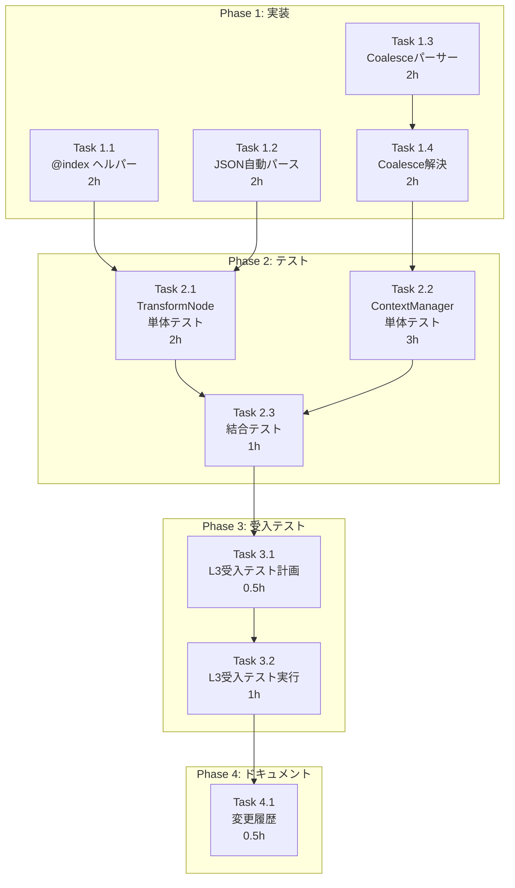

# 作業計画書: Issue #349

## Issue概要

```markdown
## Issue: TaskFlow V2: チュートリアル検証で発見された課題（Transform/Conditional）
**Issue番号**: #349
**サイズ**: M（Medium）
**作業見積**: 16時間（2日）
**優先度**: High
**依存Issue**: なし
**対象プロジェクト**: graphAiServer
```

### 課題サマリ

| 優先度 | 課題 | 対応 | 見積り |
|--------|------|------|--------|
| 🔴 高 | Merge JSON 解析 | 自動パース実装 | 4時間 |
| 🔴 高 | Coalesce チェーン | context-manager 拡張 | 8時間 |
| 🟡 中 | Map @index | ヘルパー登録 | 4時間 |

### 受入条件

- [ ] Map モードで `@index`, `@first`, `@last` ヘルパーが正しく展開される
- [ ] Merge モードでJSON文字列が自動的にパースされる
- [ ] 条件分岐の結果を出力に反映する方法（Coalesceチェーン）が提供される
- [ ] Tutorial 9, 11, 12, 13, 17 が期待通りに動作する

---

## 詳細タスク分解

### Phase 1: 実装タスク（8時間）

#### Task 1.1: Map モード @index ヘルパー実装

- **所要時間**: 2時間
- **成果物**: `graphAiServer/src/nodes/transform-node.ts`
- **依存**: なし
- **詳細**:
  ```typescript
  // 追加するヘルパー登録
  handlebars.registerHelper('@index', function(this: Record<string, unknown>) {
    const value = this['@index'];
    return typeof value === 'number' ? value : '';
  });
  handlebars.registerHelper('@first', function(this: Record<string, unknown>) {
    return !!this['@first'];
  });
  handlebars.registerHelper('@last', function(this: Record<string, unknown>) {
    return !!this['@last'];
  });
  ```

#### Task 1.2: Merge モード JSON自動パース実装

- **所要時間**: 2時間
- **成果物**: `graphAiServer/src/nodes/transform-node.ts`
- **依存**: なし
- **詳細**:
  ```typescript
  // executeMerge関数に追加
  private isJsonString(str: string): boolean {
    const trimmed = str.trim();
    return (trimmed.startsWith('{') && trimmed.endsWith('}')) ||
           (trimmed.startsWith('[') && trimmed.endsWith(']'));
  }

  // JSON文字列の自動パース処理を追加
  ```

#### Task 1.3: Coalesceチェーン構文パーサー実装

- **所要時間**: 2時間
- **成果物**: `graphAiServer/src/engine/context/context-manager.ts`
- **依存**: なし
- **詳細**:
  - `MAX_COALESCE_REFERENCES = 10` 定数追加
  - `parseCoalesceChain()` 関数追加
  - 複数 `??` 演算子の分割処理

#### Task 1.4: Coalesceチェーン解決ロジック実装

- **所要時間**: 2時間
- **成果物**: `graphAiServer/src/engine/context/context-manager.ts`
- **依存**: Task 1.3
- **詳細**:
  - `resolvingReferences: Set<string>` 追加（循環参照検出用）
  - `resolveCoalesceChain()` メソッド追加
  - `resolveReference()` メソッド拡張

---

### Phase 2: テストタスク（TDD - CI実行可能）（6時間）

#### Task 2.1: TransformNode 単体テスト

- **所要時間**: 2時間
- **成果物**: `graphAiServer/tests/unit/nodes/transform-node.test.ts`
- **依存**: Task 1.1, Task 1.2
- **カバレッジ目標**: 95%
- **テストケース**:
  ```typescript
  describe('Map mode @index helpers', () => {
    it('should expand @index in template', async () => {
      // テスト実装
    });
    it('should expand @first and @last', async () => {
      // テスト実装
    });
  });

  describe('Merge mode JSON parsing', () => {
    it('should auto-parse JSON string params', async () => {
      // テスト実装
    });
    it('should handle invalid JSON gracefully', async () => {
      // テスト実装
    });
  });
  ```

#### Task 2.2: ContextManager 単体テスト

- **所要時間**: 3時間
- **成果物**: `graphAiServer/tests/unit/engine/context/context-manager.test.ts`（新規）
- **依存**: Task 1.3, Task 1.4
- **カバレッジ目標**: 95%
- **テストケース**:
  ```typescript
  describe('Coalesce chain resolution', () => {
    it('should resolve first non-null value', async () => {
      // ${a ?? b ?? c} -> first non-null
    });
    it('should return last literal default', async () => {
      // ${a ?? b ?? 'default'} -> 'default'
    });
    it('should limit chain length', async () => {
      // > 10 references -> error
    });
  });

  describe('Circular reference detection', () => {
    it('should detect direct circular reference', async () => {
      // ${a ?? a} -> error
    });
    it('should allow same reference after resolution', async () => {
      // ${a ?? b ?? a} -> OK (first a resolved before second)
    });
  });
  ```

#### Task 2.3: 結合テスト

- **所要時間**: 1時間
- **成果物**: `graphAiServer/tests/integration/workflow-execution.test.ts`（追記）
- **依存**: Task 2.1, Task 2.2
- **シナリオ数**: 5
- **テストシナリオ**:
  1. Tutorial 9: Map モード番号付きリスト
  2. Tutorial 11: Merge モード設定マージ
  3. Tutorial 12: 条件分岐 Coalesce出力
  4. Tutorial 13: ネスト条件分岐
  5. 回帰テスト: Tutorial 1-8

---

### Phase 3: L3受入テストタスク【必須】（1.5時間）

#### Task 3.1: L3受入テスト計画

- **所要時間**: 0.5時間
- **成果物**: 受入テストシナリオ（本ドキュメント内に記載済み）
- **依存**: Phase 2完了

#### Task 3.2: L3受入テスト実行

- **所要時間**: 1時間
- **成果物**: `graphAiServer/tests/acceptance/test_issue_349_acceptance.sh`
- **依存**: Task 3.1
- **必須内容**:
  - サービス起動確認（ヘルスチェック）
  - Tutorial 9, 11, 12, 13, 17 のワークフロー実行
  - 期待出力との比較検証
  - エビデンス収集

---

### Phase 4: ドキュメントタスク（0.5時間）

#### Task 4.1: 変更履歴更新

- **所要時間**: 0.5時間
- **成果物**:
  - `dev-reports/feature/issue/349/progress-report.md`（完了報告）
- **依存**: Phase 3完了

---

## タスク依存関係



---

## 作業スケジュール

### Day 1（8時間）

| 時間 | タスク | 成果物 |
|------|-------|--------|
| 09:00-11:00 | Task 1.1: @index ヘルパー実装 | transform-node.ts |
| 11:00-13:00 | Task 1.2: JSON自動パース実装 | transform-node.ts |
| 14:00-16:00 | Task 1.3: Coalesceパーサー実装 | context-manager.ts |
| 16:00-18:00 | Task 1.4: Coalesce解決ロジック実装 | context-manager.ts |

### Day 2（8時間）

| 時間 | タスク | 成果物 |
|------|-------|--------|
| 09:00-11:00 | Task 2.1: TransformNode単体テスト | transform-node.test.ts |
| 11:00-14:00 | Task 2.2: ContextManager単体テスト | context-manager.test.ts |
| 14:00-15:00 | Task 2.3: 結合テスト | workflow-execution.test.ts |
| 15:00-15:30 | Task 3.1: L3受入テスト計画確認 | - |
| 15:30-16:30 | Task 3.2: L3受入テスト実行 | test_issue_349_acceptance.sh |
| 16:30-17:00 | Task 4.1: ドキュメント更新 | progress-report.md |
| 17:00-18:00 | PR作成・レビュー準備 | PR |

**総作業時間**: 16時間（2日）

---

## チェックポイント

| タイミング | 確認事項 | 対応 |
|-----------|---------|------|
| Task 1.2完了時 | JSON自動パースの動作確認 | Tutorial 11でマニュアルテスト |
| Task 1.4完了時 | Coalesceチェーンの動作確認 | REPLでクイックテスト |
| Phase 2完了時 | カバレッジ95%達成 | 未達の場合追加テスト |
| Phase 3完了時 | 全Tutorial動作確認 | 失敗時は修正 |
| PR作成前 | CI/CDパス | エラー時は修正 |

---

## リスクと対策

| リスク | 発生確率 | 影響 | 対策 |
|-------|---------|------|------|
| Handlebarsヘルパー登録の技術的問題 | 低 | 実装遅延2時間 | 代替案（変数名変更）を準備 |
| Coalesceチェーン実装の複雑化 | 中 | 実装遅延4時間 | 設計方針書の詳細設計に従う |
| 既存テストの回帰失敗 | 低 | テスト修正2時間 | 段階的実装で早期検出 |
| Tutorial更新の必要性 | 中 | 追加作業1時間 | Coalesce構文への更新 |

---

## 成果物チェックリスト

### コード

- [ ] `graphAiServer/src/nodes/transform-node.ts`
  - [ ] @index, @first, @last ヘルパー登録
  - [ ] isJsonString() メソッド追加
  - [ ] executeMerge() JSON自動パース

- [ ] `graphAiServer/src/engine/context/context-manager.ts`
  - [ ] MAX_COALESCE_REFERENCES 定数
  - [ ] resolvingReferences Set
  - [ ] parseCoalesceChain() 関数
  - [ ] resolveCoalesceChain() メソッド
  - [ ] resolveReference() 拡張

### テスト

- [ ] `graphAiServer/tests/unit/nodes/transform-node.test.ts`
  - [ ] Map @index テスト
  - [ ] Merge JSON パーステスト

- [ ] `graphAiServer/tests/unit/engine/context/context-manager.test.ts`（新規）
  - [ ] Coalesceチェーンテスト
  - [ ] 循環参照検出テスト

- [ ] `graphAiServer/tests/integration/workflow-execution.test.ts`
  - [ ] Tutorial 9, 11, 12, 13 結合テスト

- [ ] `graphAiServer/tests/acceptance/test_issue_349_acceptance.sh`
  - [ ] L3受入テストスクリプト

### ドキュメント

- [ ] `dev-reports/feature/issue/349/progress-report.md`

---

## L3受入テスト計画【必須セクション】

### Step 1: サービス起動確認

```bash
# サービス起動（ハイブリッドモード推奨）
./scripts/dev-hybrid.sh

# ヘルスチェック
curl -sf http://localhost:8105/health && echo "✅ graphAiServer: healthy"
curl -sf http://localhost:8103/health && echo "✅ myVault: healthy"
```

### Step 2: Tutorial 9 - Map @index テスト

```bash
# Tutorial 9: Map モード番号付きリスト
curl -s -X POST http://localhost:8105/api/v2/workflows/execute \
  -H "Content-Type: application/json" \
  -d '{
    "workflow_path": "tutorial/9_transform_map.json",
    "inputs": {
      "products": [
        {"name": "りんご", "price": 150},
        {"name": "みかん", "price": 100},
        {"name": "バナナ", "price": 200}
      ]
    }
  }' | jq '.results._output'

# 期待するレスポンス:
# {
#   "numbered_list": "0. りんご\n1. みかん\n2. バナナ (最後)",
#   ...
# }

# 検証: @index が数値として展開されていること
curl -s -X POST http://localhost:8105/api/v2/workflows/execute \
  -H "Content-Type: application/json" \
  -d '{...}' | jq -r '.results._output.numbered_list' | grep -E "^[0-9]+\. " && echo "✅ @index test passed"
```

### Step 3: Tutorial 11 - Merge JSON パーステスト

```bash
# Tutorial 11: Merge モード設定マージ
curl -s -X POST http://localhost:8105/api/v2/workflows/execute \
  -H "Content-Type: application/json" \
  -d '{
    "workflow_path": "tutorial/11_transform_merge.json",
    "inputs": {
      "user_settings": {
        "theme": "dark",
        "notifications": {
          "push": true
        }
      }
    }
  }' | jq '.results._output'

# 期待するレスポンス:
# {
#   "shallow_config": {
#     "theme": "dark",
#     "language": "ja",
#     "notifications": {"push": true},
#     "limits": {"max_items": 100}
#   },
#   ...
# }

# 検証: JSON文字列がオブジェクトとしてマージされていること
curl -s -X POST http://localhost:8105/api/v2/workflows/execute \
  -H "Content-Type: application/json" \
  -d '{...}' | jq '.results._output.shallow_config.theme' | grep -q "dark" && echo "✅ Merge JSON parse test passed"
```

### Step 4: Tutorial 12 - 条件分岐 Coalesce テスト

```bash
# Tutorial 12: 条件分岐（score=85 -> grade_excellent実行）
curl -s -X POST http://localhost:8105/api/v2/workflows/execute \
  -H "Content-Type: application/json" \
  -d '{
    "workflow_path": "tutorial/12_conditional_basic.json",
    "inputs": {
      "score": 85
    }
  }' | jq '.results._output'

# 期待するレスポンス:
# {
#   "grade": "A (優秀)",
#   "passed": true,
#   "message": "おめでとうございます！85点で合格です。"
# }

# Tutorial 12: 条件分岐（score=45 -> else分岐実行）
curl -s -X POST http://localhost:8105/api/v2/workflows/execute \
  -H "Content-Type: application/json" \
  -d '{
    "workflow_path": "tutorial/12_conditional_basic.json",
    "inputs": {
      "score": 45
    }
  }' | jq '.results._output'

# 期待するレスポンス:
# {
#   "grade": "C (不合格)",
#   "passed": false,
#   "message": "残念ながら45点で不合格です。60点以上が必要です。"
# }

# 検証: grade が空でないこと（Coalesceチェーンが機能）
curl -s -X POST http://localhost:8105/api/v2/workflows/execute \
  -H "Content-Type: application/json" \
  -d '{"workflow_path": "tutorial/12_conditional_basic.json", "inputs": {"score": 45}}' \
  | jq -r '.results._output.grade' | grep -v "null" && echo "✅ Coalesce chain test passed"
```

### Step 5: 回帰テスト - Tutorial 1-8

```bash
# Tutorial 1: Hello World
curl -s -X POST http://localhost:8105/api/v2/workflows/execute \
  -H "Content-Type: application/json" \
  -d '{"workflow_path": "tutorial/1_hello.json", "inputs": {}}' \
  | jq '.errors' | grep -q '{}' && echo "✅ Tutorial 1 regression passed"

# Tutorial 8: Transform Template
curl -s -X POST http://localhost:8105/api/v2/workflows/execute \
  -H "Content-Type: application/json" \
  -d '{"workflow_path": "tutorial/8_transform_template.json", "inputs": {"user_name": "テスト", "items": ["A", "B"]}}' \
  | jq '.errors' | grep -q '{}' && echo "✅ Tutorial 8 regression passed"
```

### Step 6: エビデンス収集

```bash
# 全テスト結果をファイルに保存
mkdir -p /tmp/issue349_acceptance

curl -s -X POST http://localhost:8105/api/v2/workflows/execute \
  -H "Content-Type: application/json" \
  -d '{"workflow_path": "tutorial/9_transform_map.json", "inputs": {"products": [{"name": "りんご", "price": 150}]}}' \
  > /tmp/issue349_acceptance/tutorial9_result.json

curl -s -X POST http://localhost:8105/api/v2/workflows/execute \
  -H "Content-Type: application/json" \
  -d '{"workflow_path": "tutorial/11_transform_merge.json", "inputs": {"user_settings": {"theme": "dark"}}}' \
  > /tmp/issue349_acceptance/tutorial11_result.json

curl -s -X POST http://localhost:8105/api/v2/workflows/execute \
  -H "Content-Type: application/json" \
  -d '{"workflow_path": "tutorial/12_conditional_basic.json", "inputs": {"score": 85}}' \
  > /tmp/issue349_acceptance/tutorial12_score85_result.json

curl -s -X POST http://localhost:8105/api/v2/workflows/execute \
  -H "Content-Type: application/json" \
  -d '{"workflow_path": "tutorial/12_conditional_basic.json", "inputs": {"score": 45}}' \
  > /tmp/issue349_acceptance/tutorial12_score45_result.json

echo "✅ Evidence collected in /tmp/issue349_acceptance/"
ls -la /tmp/issue349_acceptance/
```

---

## Definition of Done

Issue完了条件：

- [ ] すべてのタスクが完了
- [ ] 単体テストカバレッジ95%以上（対象ファイル）
- [ ] 結合テスト全シナリオパス
- [ ] **L3受入テスト全パス**
  - [ ] Tutorial 9: @index が数値として展開
  - [ ] Tutorial 11: JSON文字列がオブジェクトとしてマージ
  - [ ] Tutorial 12: Coalesceチェーンで条件分岐結果取得
  - [ ] Tutorial 1-8: 回帰なし
- [ ] CI/CDグリーン
- [ ] コードレビュー承認
- [ ] ドキュメント更新完了

---

## 次のアクション

作業計画承認後：

1. **ブランチ作成**: `git checkout -b issue/349-taskflow-v2-transform-conditional`
2. **TDD実装開始**: `/pm-auto-dev #349` で自動実装
3. **進捗報告**: `/progress-report` で定期報告
4. **PR作成**: `/pm-create-pr` でPR作成

---

## 参照ドキュメント

- [設計方針書](./design-policy.md)
- [アーキテクチャレビュー](./architecture-review.md)
- [graphAiServer/docs/GRAPHAI_WORKFLOW_GENERATION_RULES.md](../../../graphAiServer/docs/GRAPHAI_WORKFLOW_GENERATION_RULES.md)

---

## 変更履歴

| 日付 | 版 | 変更内容 |
|-----|---|---------|
| 2026-01-10 | 1.0 | 初版作成 |
