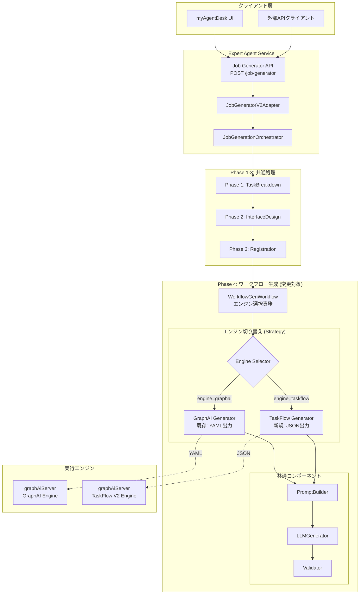
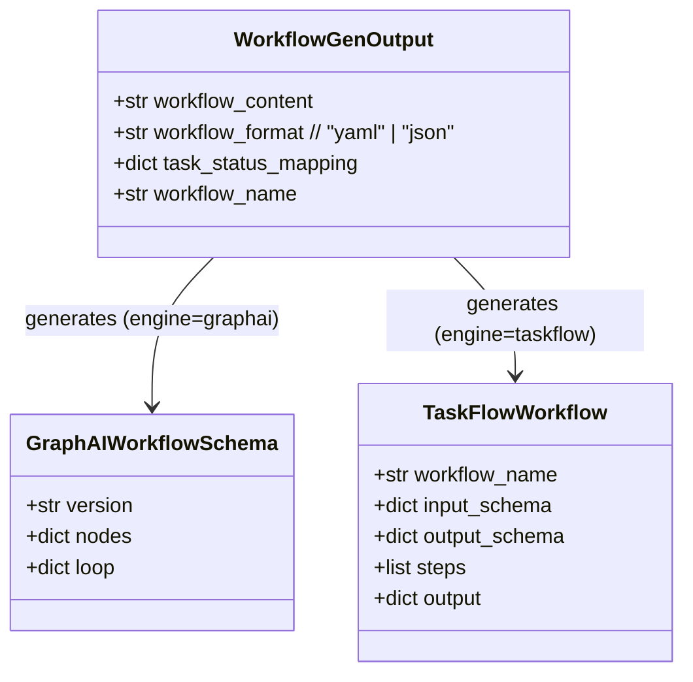

# 設計方針書: ワークフロー生成エージェントV2の対象エンジン切り替え

**Issue**: #350
**作成日**: 2026-01-11
**最終更新**: 2026-01-11（アーキテクチャレビュー反映）
**対象プロジェクト**: expertAgent (jobGeneratorV2)

---

## 現状調査サマリ

### 対象プロジェクト
- **プロジェクト名**: expertAgent
- **主要モジュール**: `expertAgent/aiagent/langgraph/jobGeneratorV2/`
- **関連サービス**: graphAiServer (TaskFlow V2実行エンジン)

### 既存アーキテクチャパターン

| パターン | 使用箇所 | 目的 |
|---------|---------|------|
| **Sub-workflow** | `LLMGeneratorSubWorkflow`, `YamlGeneratorSubWorkflow` | 機能単位の分離・再利用性 |
| **ValidationPipeline** | `validators/` | 多層検証パイプライン |
| **Orchestrator** | `orchestrator.py` | 4フェーズの順次実行制御 |
| **PromptBuilder** | `prompt_builder/` | LLMプロンプトの動的組み立て |
| **ErrorRecoveryManager** | `recovery.py` | エラー時の回復判定 |

### 現在のワークフロー生成出力形式

**GraphAI YAML 0.5形式**:
```yaml
version: "0.5"
nodes:
  source: {}
  task_001:
    agent: fetchAgent
    inputs:
      url: ":source.${EXPERTAGENT_BASE_URL}/api/endpoint"
    params:
      timeout: 30
  task_002:
    agent: stringTemplateAgent
    inputs:
      data: ":source.task_001"
    isResult: true
```

### TaskFlow V2 JSON形式（切り替え先）

**TaskFlow V2 JSON形式**:
```json
{
  "workflow_name": "example_workflow",
  "description": "Example workflow",
  "input_schema": { "user_input": "string" },
  "output_schema": { "result": "string" },
  "steps": [
    {
      "id": "step_001",
      "type": "api_rest",
      "config": {
        "method": "POST",
        "url": "https://api.example.com/endpoint",
        "headers": { "Content-Type": "application/json" },
        "body": { "input": "${inputs.user_input}" }
      }
    },
    {
      "id": "step_002",
      "type": "transform",
      "config": {
        "mode": "template",
        "template": "Result: ${step_001.data}"
      }
    }
  ],
  "output": { "result": "${step_002}" }
}
```

### GraphAI YAML vs TaskFlow V2 比較

| 観点 | GraphAI YAML | TaskFlow V2 JSON |
|------|-------------|-----------------|
| **フォーマット** | YAML | JSON |
| **ステップ定義** | `nodes` + `agent/inputs/params` | `steps` + `type/config` |
| **実行フロー** | Node-Edge DAG | Sequential/Parallel/Conditional |
| **変数参照** | `:source.nodeId.field` | `${inputs.field}`, `${step_id.output}` |
| **エージェント種類** | 40+種類 | 3種類 (api_rest, code_js, transform) |
| **バリデーション** | GraphAI内部 | 3層 (Schema→Semantic→Runtime) |
| **セキュリティ** | URL環境変数置換 | HTTPS強制、SSRF対策、パス走査保護 |
| **シークレット** | 環境変数経由 | `${secrets.KEY}` 直接参照 |

### 参照したドキュメント
- `docs/spec/job-generation-workflow.md`: Job Generator仕様
- `docs/arch/service-dependencies.md`: サービス依存関係
- `graphAiServer/docs/TASKFLOW_GENERATION_RULES.md`: TaskFlow生成ルール
- `graphAiServer/src/engine/schemas/workflow-schema.ts`: TaskFlowスキーマ定義

### 設計上の制約
1. **既存APIインターフェース維持**: `JobGeneratorResponse`形式は変更しない
2. **Phase 1-3は変更不要**: タスク分解・インターフェース設計・登録は共通
3. **Phase 4のみ変更**: ワークフロー生成部分のみをTaskFlow V2対応に
4. **後方互換性**: GraphAI YAML生成機能は残す（設定で切り替え可能に）

---

## アーキテクチャ設計

### システム構成図



### レイヤー構成（MF-1修正: エンジン選択責務の明確化）

| レイヤー | コンポーネント | 変更範囲 |
|---------|--------------|---------|
| **APIレイヤー** | `job_generator_endpoints.py` | 変更なし |
| **アダプターレイヤー** | `adapter.py` | engine設定追加（受け渡しのみ） |
| **オーケストレーションレイヤー** | `orchestrator.py` | **engine設定の受け渡しのみ**（選択ロジックなし） |
| **ワークフロー生成レイヤー** | `workflows/workflow_gen/workflow.py` | **エンジン選択ロジック（Strategy適用）** |
| **プロンプトビルダー** | `prompt_builder/` | TaskFlow用ルール追加 |
| **バリデーション** | `validators/` | TaskFlowスキーマ検証追加 |

> **注**: 現在の実装では、エンジン選択（LLM vs Template等）は`YamlGeneratorSubWorkflow`層で処理されています。
> 本設計でもこの責務配置を踏襲し、`WorkflowGenWorkflow`でStrategy選択を行います。

---

## 技術選定

| カテゴリ | 選定技術 | 選定理由 | 既存との整合性 |
|---------|---------|---------|---------------|
| **出力形式** | JSON | TaskFlow V2仕様準拠 | YAML出力と併存可能 |
| **スキーマ検証** | Pydantic | 既存パターン踏襲 | `schemas.py`と同様 |
| **LLM** | Gemini 3 Flash / Claude Haiku | 既存設定維持 | 変更なし |
| **プロンプト構築** | PromptBuilder | 既存パターン拡張 | ルールファイル追加のみ |

### 既存技術スタックとの整合性

- **LangChain**: LLM連携は既存のまま維持
- **Pydantic**: TaskFlow用スキーマモデルを追加
- **ValidationPipeline**: TaskFlow用バリデーター追加

---

## 設計パターン

### 採用パターン

| パターン | 用途 | 既存との整合性 |
|---------|------|---------------|
| **Strategy Pattern** | エンジン切り替え (GraphAI/TaskFlow) | 新規導入（拡張性確保） |
| **Factory Pattern** | Generator/Validator生成 | 既存パターン踏襲 |
| **Sub-workflow Pattern** | TaskFlowGeneratorSubWorkflow | 既存パターン踏襲 |
| **Builder Pattern** | TaskFlow JSON構築 | PromptBuilderと同様 |

### Strategy Pattern適用箇所

```python
# workflows/workflow_gen/engine_strategy.py (新規)
from abc import ABC, abstractmethod
from typing import Protocol

class WorkflowGeneratorStrategy(Protocol):
    """ワークフロー生成戦略のインターフェース"""

    async def generate(
        self,
        task_definitions: list[dict],
        interfaces: dict,
        context: ExecutionContext
    ) -> WorkflowOutput:
        ...

    def get_prompt_rules(self) -> list[str]:
        ...

    def get_validator(self) -> WorkflowValidator:
        ...

class GraphAIGeneratorStrategy:
    """GraphAI YAML生成戦略（既存）"""
    ...

class TaskFlowGeneratorStrategy:
    """TaskFlow V2 JSON生成戦略（新規）"""
    ...
```

### Strategy選択の実装箇所（MF-1修正）

```python
# workflows/workflow_gen/workflow.py
class WorkflowGenWorkflow:
    """ワークフロー生成ワークフロー - エンジン選択責務を持つ"""

    def __init__(self, engine: str = "taskflow"):
        self.strategy = self._create_strategy(engine)

    def _create_strategy(self, engine: str) -> WorkflowGeneratorStrategy:
        """Factory Method: エンジンに応じたStrategy生成"""
        if engine == "taskflow":
            return TaskFlowGeneratorStrategy()
        elif engine == "graphai":
            return GraphAIGeneratorStrategy()
        raise ValueError(f"Unknown engine: {engine}")

    async def execute(
        self,
        task_definitions: list[dict],
        interfaces: dict,
        context: ExecutionContext
    ) -> WorkflowGenOutput:
        return await self.strategy.generate(task_definitions, interfaces, context)
```

---

## データモデル設計

### TaskFlow V2 Pydanticスキーマ（SF-1改善: Discriminated Union）

```python
# workflows/workflow_gen/schemas/taskflow_schema.py (新規)
from pydantic import BaseModel, Field, model_validator
from typing import Literal, Any
from enum import Enum

class IOSchemaType(str, Enum):
    STRING = "string"
    NUMBER = "number"
    BOOLEAN = "boolean"
    ARRAY = "array"
    OBJECT = "object"
    NULL = "null"

class ApiRestConfig(BaseModel):
    """api_rest ノードの設定"""
    method: Literal["GET", "POST", "PUT", "DELETE", "PATCH"]
    url: str = Field(..., pattern=r"^https://")
    headers: dict[str, str] = {}
    body: dict | None = None
    timeout_ms: int = Field(default=30000, ge=1000, le=300000)
    verify_ssl: bool = True

class TransformConfig(BaseModel):
    """transform ノードの設定"""
    mode: Literal["template", "concat", "map", "merge"]
    template: str | None = None
    separator: str | None = None
    fields: list[str] | None = None

    @model_validator(mode="after")
    def validate_mode_specific_fields(self) -> "TransformConfig":
        """モードに応じた必須フィールドを検証"""
        if self.mode == "template" and not self.template:
            raise ValueError("template is required when mode is 'template'")
        if self.mode == "concat" and not self.separator:
            raise ValueError("separator is required when mode is 'concat'")
        if self.mode in ("map", "merge") and not self.fields:
            raise ValueError(f"fields is required when mode is '{self.mode}'")
        return self

class CodeJsConfig(BaseModel):
    """code_js ノードの設定"""
    path: str
    function_name: str

# SF-1改善: Discriminated Union with model_validator
class TaskFlowStep(BaseModel):
    """TaskFlowステップ - typeに基づくconfig検証"""
    id: str = Field(..., pattern=r"^[a-zA-Z_][a-zA-Z0-9_-]*$")
    type: Literal["api_rest", "transform", "code_js"]
    config: dict[str, Any]  # 型はtypeに基づいて検証
    params: dict = {}

    @model_validator(mode="after")
    def validate_config_by_type(self) -> "TaskFlowStep":
        """typeに基づいてconfigを適切なモデルで検証"""
        config_models = {
            "api_rest": ApiRestConfig,
            "transform": TransformConfig,
            "code_js": CodeJsConfig,
        }
        model = config_models.get(self.type)
        if model:
            # configを適切なモデルで検証（エラーは自動的に伝播）
            model.model_validate(self.config)
        return self

class ParallelBlock(BaseModel):
    """並列実行ブロック"""
    parallel: list[TaskFlowStep]

class ConditionalBlock(BaseModel):
    """条件分岐ブロック"""
    condition: str  # e.g., "${step_id.status} == 'success'"
    if_true: list[TaskFlowStep]
    if_false: list[TaskFlowStep] = []

class TaskFlowWorkflow(BaseModel):
    """TaskFlow V2 ワークフロー定義"""
    workflow_name: str = Field(..., pattern=r"^[a-zA-Z_][a-zA-Z0-9_-]*$")
    description: str | None = None
    input_schema: dict[str, IOSchemaType]
    output_schema: dict[str, IOSchemaType]
    steps: list[TaskFlowStep | ParallelBlock | ConditionalBlock]
    output: dict[str, str]  # e.g., {"result": "${step_002}"}
```

### 既存スキーマとの関係



---

## API設計

### リクエスト拡張

```python
# 既存のJobGeneratorRequestに engine パラメータを追加
class JobGeneratorRequest(BaseModel):
    user_requirement: str
    project_id: str = "default"
    max_tasks: int = 10
    engine: Literal["graphai", "taskflow"] = "taskflow"  # 新規追加（デフォルト: taskflow）
```

### レスポンス拡張

```python
# WorkflowGenOutputの拡張
class WorkflowGenOutput(BaseModel):
    workflow_content: str  # YAML or JSON文字列
    workflow_format: Literal["yaml", "json"]  # 新規追加
    task_status_mapping: dict[str, str]
    workflow_name: str
```

### エンドポイント変更なし

| エンドポイント | メソッド | 変更 |
|--------------|---------|------|
| `/job-generator` | POST | リクエストに`engine`パラメータ追加 |
| `/jobs/{job_id}/status` | GET | 変更なし |

---

## Few-shot Examples構造（SF-2改善）

### ディレクトリ構成

```
expertAgent/aiagent/langgraph/jobGeneratorV2/
└── workflows/
    └── workflow_gen/
        └── prompt_builder/
            └── few_shot/
                ├── selector.py              # 新規: パターン選択ロジック
                ├── graphai/                 # 既存（移動）
                │   ├── api_call_pattern.yaml
                │   ├── llm_chain_pattern.yaml
                │   ├── map_pattern.yaml
                │   └── search_pattern.yaml
                └── taskflow/                # 新規
                    ├── api_rest_pattern.yaml
                    ├── transform_pattern.yaml
                    ├── parallel_pattern.yaml
                    └── conditional_pattern.yaml
```

### パターン選択ロジック（selector.py）

```python
# workflows/workflow_gen/prompt_builder/few_shot/selector.py
from enum import Enum
from pathlib import Path
from typing import Protocol
import yaml

class TaskPattern(str, Enum):
    """タスクパターン分類"""
    API_CALL = "api_call"           # 外部API呼び出し
    DATA_TRANSFORM = "transform"     # データ変換
    LLM_CHAIN = "llm_chain"         # LLM連鎖
    PARALLEL = "parallel"           # 並列処理
    CONDITIONAL = "conditional"     # 条件分岐
    SEARCH = "search"               # 検索・取得

class FewShotSelector:
    """Few-shot例選択器"""

    PATTERN_MAPPING = {
        # GraphAI用
        "graphai": {
            TaskPattern.API_CALL: "graphai/api_call_pattern.yaml",
            TaskPattern.LLM_CHAIN: "graphai/llm_chain_pattern.yaml",
            TaskPattern.DATA_TRANSFORM: "graphai/map_pattern.yaml",
            TaskPattern.SEARCH: "graphai/search_pattern.yaml",
        },
        # TaskFlow V2用
        "taskflow": {
            TaskPattern.API_CALL: "taskflow/api_rest_pattern.yaml",
            TaskPattern.DATA_TRANSFORM: "taskflow/transform_pattern.yaml",
            TaskPattern.PARALLEL: "taskflow/parallel_pattern.yaml",
            TaskPattern.CONDITIONAL: "taskflow/conditional_pattern.yaml",
        },
    }

    def __init__(self, base_path: Path):
        self.base_path = base_path

    def select_examples(
        self,
        engine: str,
        task_patterns: list[TaskPattern],
        max_examples: int = 3
    ) -> list[dict]:
        """タスクパターンに基づいてFew-shot例を選択"""
        examples = []
        mapping = self.PATTERN_MAPPING.get(engine, {})

        for pattern in task_patterns[:max_examples]:
            if pattern in mapping:
                example_path = self.base_path / mapping[pattern]
                if example_path.exists():
                    with open(example_path) as f:
                        examples.append(yaml.safe_load(f))

        return examples

    def detect_patterns(self, task_definitions: list[dict]) -> list[TaskPattern]:
        """タスク定義からパターンを推定"""
        patterns = []
        for task in task_definitions:
            description = task.get("description", "").lower()
            if any(kw in description for kw in ["api", "http", "fetch", "call"]):
                patterns.append(TaskPattern.API_CALL)
            elif any(kw in description for kw in ["transform", "convert", "format"]):
                patterns.append(TaskPattern.DATA_TRANSFORM)
            elif any(kw in description for kw in ["llm", "ai", "generate", "analyze"]):
                patterns.append(TaskPattern.LLM_CHAIN)
            elif any(kw in description for kw in ["parallel", "concurrent", "同時"]):
                patterns.append(TaskPattern.PARALLEL)
            elif any(kw in description for kw in ["if", "condition", "分岐"]):
                patterns.append(TaskPattern.CONDITIONAL)
        return list(set(patterns))  # 重複除去
```

### TaskFlow用Few-shot例（api_rest_pattern.yaml）

```yaml
# few_shot/taskflow/api_rest_pattern.yaml
name: "API REST Pattern"
description: "外部REST APIを呼び出すパターン"
use_case: "外部サービスとの連携、データ取得、Webhook送信"

example:
  workflow_name: "fetch_user_data"
  description: "ユーザーデータをAPIから取得して変換"
  input_schema:
    user_id: "string"
  output_schema:
    user_name: "string"
    email: "string"
  steps:
    - id: "fetch_user"
      type: "api_rest"
      config:
        method: "GET"
        url: "https://api.example.com/users/${inputs.user_id}"
        headers:
          Authorization: "Bearer ${secrets.API_TOKEN}"
        timeout_ms: 10000
    - id: "extract_data"
      type: "transform"
      config:
        mode: "template"
        template: |
          {
            "user_name": "${fetch_user.data.name}",
            "email": "${fetch_user.data.email}"
          }
  output:
    user_name: "${extract_data.user_name}"
    email: "${extract_data.email}"

key_points:
  - "URLにはHTTPSを必ず使用"
  - "認証情報は${secrets.KEY}で参照"
  - "タイムアウトは適切に設定（デフォルト30秒）"
```

---

## ファイル構成（変更・追加箇所）

```
expertAgent/aiagent/langgraph/jobGeneratorV2/
├── adapter.py                          # 変更: engine設定追加（受け渡しのみ）
├── orchestrator.py                     # 変更なし（engine受け渡しのみ）
├── workflows/
│   └── workflow_gen/
│       ├── workflow.py                 # 変更: Strategy選択ロジック追加
│       ├── engine_strategy.py          # 新規: Strategy interface
│       ├── graphai_generator.py        # リファクタ: 既存ロジック移動
│       ├── taskflow_generator.py       # 新規: TaskFlow生成
│       ├── schemas/
│       │   ├── graphai_schema.py       # 既存維持
│       │   └── taskflow_schema.py      # 新規: TaskFlowスキーマ（SF-1改善済）
│       └── prompt_builder/
│           ├── rules/
│           │   ├── graphai_rules.py    # リネーム（既存）
│           │   └── taskflow_rules.py   # 新規: TaskFlowルール
│           └── few_shot/
│               ├── selector.py         # 新規: パターン選択（SF-2改善）
│               ├── graphai/            # 移動（既存）
│               └── taskflow/           # 新規: TaskFlow例示
├── validators/
│   ├── graphai_validator.py            # リネーム（既存）
│   └── taskflow_validator.py           # 新規: TaskFlow検証
```

---

## 実装フェーズ

### Phase 1: 基盤整備（変更なし確認）
1. 既存コードのリファクタリング準備
2. GraphAI関連コードの明示的な分離
3. Strategy Patternの基盤クラス作成

### Phase 2: TaskFlow生成機能
1. `taskflow_schema.py` - Pydanticスキーマ定義（SF-1改善含む）
2. `taskflow_rules.py` - LLMプロンプトルール
3. `taskflow_generator.py` - JSON生成ロジック
4. Few-shot examples追加（SF-2改善含む）

### Phase 3: バリデーション
1. `taskflow_validator.py` - スキーマ検証
2. ValidationPipelineへの統合
3. エラーフィードバック形式対応（C-3国際化準備含む）

### Phase 4: 統合・テスト
1. WorkflowGenWorkflowへのエンジン切り替え統合
2. 単体テスト（90%カバレッジ）
3. 結合テスト（graphAiServerとの連携確認）
4. 受入テスト

---

## セキュリティ設計

### TaskFlow V2のセキュリティ機能活用

| セキュリティ機能 | 実装方針 |
|----------------|---------|
| **HTTPS強制** | `url`フィールドのバリデーションで強制 |
| **SSRF対策** | プライベートIP（127.x, 10.x, 192.168.x）をブロック |
| **パス走査保護** | `..`を含むパスを拒否 |
| **シークレット参照** | `${secrets.KEY}`形式でmyVault経由取得 |

### code_js ノードの制限（C-2対応）

LLM生成時の`code_js`ノード使用制限を設けます。

```python
# validators/taskflow_validator.py
class TaskFlowSecurityValidator:
    """TaskFlowセキュリティ検証"""

    # C-2: code_jsのホワイトリスト関数
    ALLOWED_CODE_JS_FUNCTIONS = [
        "formatDate",
        "parseJson",
        "stringConcat",
        "arrayFilter",
        "objectMerge",
    ]

    def validate_code_js_restrictions(self, step: TaskFlowStep) -> ValidationResult:
        """code_jsノードの制限検証"""
        if step.type != "code_js":
            return ValidationResult(valid=True)

        config = CodeJsConfig.model_validate(step.config)

        # ホワイトリストチェック
        if config.function_name not in self.ALLOWED_CODE_JS_FUNCTIONS:
            return ValidationResult(
                valid=False,
                error=f"Function '{config.function_name}' is not in the allowed list. "
                      f"Allowed functions: {', '.join(self.ALLOWED_CODE_JS_FUNCTIONS)}",
                suggestion="Use transform node or pre-approved functions only."
            )

        return ValidationResult(valid=True)
```

**LLMプロンプトへの制約追加**:
```yaml
# prompt_builder/rules/taskflow_rules.py
CODE_JS_RESTRICTIONS = """
## code_js ノードの使用制限

code_js ノードは以下の事前承認された関数のみ使用可能です：
- formatDate: 日付フォーマット変換
- parseJson: JSON文字列のパース
- stringConcat: 文字列結合
- arrayFilter: 配列フィルタリング
- objectMerge: オブジェクトマージ

カスタムJavaScript関数が必要な場合は、transform ノードで代替してください。
"""
```

### 生成されるワークフローのセキュリティ検証

```python
# validators/taskflow_validator.py
class TaskFlowSecurityValidator:
    PRIVATE_IP_PATTERNS = [
        r"^https?://127\.",
        r"^https?://10\.",
        r"^https?://192\.168\.",
        r"^https?://169\.254\.",
        r"^https?://localhost",
    ]

    def validate_url(self, url: str) -> ValidationResult:
        # HTTPS必須チェック
        if not url.startswith("https://"):
            return ValidationResult(
                valid=False,
                error="URL must use HTTPS protocol"
            )

        # プライベートIPブロック
        for pattern in self.PRIVATE_IP_PATTERNS:
            if re.match(pattern, url):
                return ValidationResult(
                    valid=False,
                    error=f"Private IP addresses are not allowed: {url}"
                )

        return ValidationResult(valid=True)
```

---

## パフォーマンス設計

### 既存パフォーマンス基準維持

| 指標 | 現状 | 目標 |
|------|------|------|
| ワークフロー生成時間 | 3-5分 | 3-5分（維持） |
| 初回成功率 | 70% | 75%以上（改善） |
| リトライ回数 | 最大5回 | 最大5回（維持） |

### TaskFlow V2による改善期待

- **シンプルな構造**: 3種類のノードタイプのみでLLM出力が安定
- **厳格なバリデーション**: 3層検証で早期エラー検出
- **明確な変数参照**: `${}`形式で参照エラー減少

---

## 設計判断とトレードオフ

### 判断1: エンジン切り替え方式

**選択**: Strategy Patternによる動的切り替え

| 選択肢 | メリット | デメリット |
|--------|---------|-----------|
| **Strategy Pattern（採用）** | 拡張性高、テスト容易、後方互換性維持 | 初期実装コスト |
| 条件分岐 | 実装簡単 | 保守性低、テスト困難 |
| 完全置き換え | シンプル | 後方互換性なし |

**根拠**: 既存GraphAI機能を維持しながら、将来的なエンジン追加にも対応できる

### 判断2: デフォルトエンジン

**選択**: TaskFlow V2をデフォルトに

**根拠**:
- Issue要件「TaskFlow V2に切り替えたい」に準拠
- TaskFlow V2のセキュリティ機能が優れている
- シンプルな構造でLLM生成精度向上が期待できる

### 判断3: プロンプトビルダーの共有

**選択**: 共通PromptBuilderを維持し、ルールファイルで差分吸収

| 選択肢 | メリット | デメリット |
|--------|---------|-----------|
| **共通PromptBuilder + ルールファイル（採用）** | DRY原則、保守性高 | ルール設計が必要 |
| エンジン別PromptBuilder | 独立性高 | コード重複 |

**根拠**: 既存PromptBuilder構造を活用し、ルールファイル追加のみで対応

### 想定リスクと対策

| リスク | 影響度 | 対策 |
|--------|-------|------|
| LLM出力の安定性 | 中 | Few-shot examples充実、リトライ機構維持 |
| 既存機能の退行 | 高 | GraphAI生成の単体テスト維持 |
| graphAiServer連携エラー | 中 | 結合テストで早期検出 |

---

## テスト計画（SF-3改善: 詳細テストケース）

### 単体テスト（90%カバレッジ）

#### test_taskflow_schema.py

| テストケース | 目的 |
|-------------|------|
| `test_valid_api_rest_step` | 正常なapi_restステップの検証 |
| `test_valid_transform_step` | 正常なtransformステップの検証 |
| `test_valid_code_js_step` | 正常なcode_jsステップの検証 |
| `test_invalid_url_http` | HTTP URLの拒否確認 |
| `test_invalid_step_id_format` | 不正なステップID形式の拒否 |
| `test_discriminated_union_api_rest` | api_rest型のconfig検証 |
| `test_discriminated_union_transform` | transform型のconfig検証 |
| `test_discriminated_union_invalid_config` | 不正なconfig型の拒否 |
| `test_transform_mode_template_requires_template` | templateモードでtemplate必須 |
| `test_transform_mode_concat_requires_separator` | concatモードでseparator必須 |
| `test_parallel_block_validation` | ParallelBlockの検証 |
| `test_conditional_block_validation` | ConditionalBlockの検証 |
| `test_workflow_complete_validation` | 完全なワークフローの検証 |

#### test_taskflow_generator.py

| テストケース | 目的 |
|-------------|------|
| `test_generate_simple_api_workflow` | 単純なAPI呼び出しワークフロー生成 |
| `test_generate_transform_workflow` | データ変換ワークフロー生成 |
| `test_generate_parallel_workflow` | 並列実行ワークフロー生成 |
| `test_generate_conditional_workflow` | 条件分岐ワークフロー生成 |
| `test_generate_with_secrets` | シークレット参照を含むワークフロー生成 |
| `test_validation_error_feedback` | バリデーションエラー時のフィードバック |
| `test_llm_retry_on_validation_failure` | 検証失敗時のLLMリトライ |
| `test_few_shot_example_selection` | Few-shot例の適切な選択 |
| `test_output_json_format` | 出力がJSON形式であることの確認 |

#### test_taskflow_validator.py

| テストケース | 目的 |
|-------------|------|
| `test_validate_https_url` | HTTPS URLの検証 |
| `test_reject_http_url` | HTTP URLの拒否 |
| `test_reject_private_ip_127` | 127.x.x.x の拒否 |
| `test_reject_private_ip_10` | 10.x.x.x の拒否 |
| `test_reject_private_ip_192_168` | 192.168.x.x の拒否 |
| `test_reject_localhost` | localhost の拒否 |
| `test_code_js_allowed_function` | 許可された関数の受け入れ |
| `test_code_js_disallowed_function` | 非許可関数の拒否 |
| `test_path_traversal_rejection` | パス走査攻撃の拒否 |
| `test_validation_pipeline_integration` | ValidationPipelineとの統合 |

#### test_engine_strategy.py

| テストケース | 目的 |
|-------------|------|
| `test_create_taskflow_strategy` | TaskFlow Strategy生成 |
| `test_create_graphai_strategy` | GraphAI Strategy生成 |
| `test_unknown_engine_raises_error` | 不明エンジンでエラー |
| `test_strategy_protocol_compliance` | Protocol準拠の確認 |
| `test_default_engine_is_taskflow` | デフォルトがtaskflowであること |

#### test_few_shot_selector.py（SF-2追加）

| テストケース | 目的 |
|-------------|------|
| `test_select_api_call_examples` | API呼び出しパターンの例選択 |
| `test_select_transform_examples` | 変換パターンの例選択 |
| `test_detect_patterns_from_task` | タスク定義からのパターン検出 |
| `test_max_examples_limit` | 最大例数の制限 |
| `test_engine_specific_examples` | エンジン別の例選択 |

### 結合テスト（50%カバレッジ）

#### test_orchestrator_engine_switch.py

| テストケース | 目的 |
|-------------|------|
| `test_orchestrator_passes_engine_to_workflow_gen` | engine設定の受け渡し |
| `test_full_pipeline_with_taskflow` | TaskFlowでの完全パイプライン |
| `test_full_pipeline_with_graphai` | GraphAIでの完全パイプライン |
| `test_engine_switch_preserves_phase_1_3` | Phase 1-3が共通であること |

#### test_taskflow_execution.py

| テストケース | 目的 |
|-------------|------|
| `test_generated_workflow_executes_in_graphaiserver` | 生成ワークフローがgraphAiServerで実行可能 |
| `test_workflow_with_secrets_integration` | シークレット連携の確認 |
| `test_parallel_execution_in_engine` | 並列実行の確認 |
| `test_conditional_execution_in_engine` | 条件分岐実行の確認 |

### 受入テスト

#### test_issue_350_acceptance.py

| テストケース | 目的 |
|-------------|------|
| `test_e2e_taskflow_generation_from_natural_language` | 自然言語からTaskFlow生成 |
| `test_e2e_workflow_execution_success` | 生成ワークフローの実行成功 |
| `test_e2e_engine_parameter_respected` | engineパラメータの反映 |
| `test_e2e_backward_compatibility_graphai` | GraphAI後方互換性 |

---

## GraphAI廃止ロードマップ（C-1対応）

### 移行計画

| Phase | 時期 | 内容 | 詳細 |
|-------|------|------|------|
| **Phase 1** | Issue #350（現在） | TaskFlow V2をデフォルト化 | `engine=graphai`で既存機能維持 |
| **Phase 2** | +6ヶ月後 | 新規ワークフローはTaskFlow V2のみ | 既存GraphAIワークフロー移行ツール提供 |
| **Phase 3** | +12ヶ月後 | GraphAI生成機能を廃止 | Deprecated警告後に削除 |

### Phase 2: 移行ツール設計（概要）

```python
# tools/migrate_graphai_to_taskflow.py
class GraphAIToTaskFlowMigrator:
    """GraphAI YAMLからTaskFlow V2 JSONへの移行ツール"""

    def migrate(self, graphai_yaml: str) -> str:
        """
        GraphAI YAMLをTaskFlow V2 JSONに変換

        変換ルール:
        - nodes → steps
        - agent → type (マッピング)
        - :source.nodeId → ${nodeId}
        - isResult → output
        """
        ...

    AGENT_TYPE_MAPPING = {
        "fetchAgent": "api_rest",
        "stringTemplateAgent": "transform",
        "geminiAgent": "api_rest",  # LLM APIはapi_restで表現
        "anthropicAgent": "api_rest",
    }
```

### Phase 3: 廃止通知

```python
# workflows/workflow_gen/workflow.py
import warnings

class WorkflowGenWorkflow:
    def __init__(self, engine: str = "taskflow"):
        if engine == "graphai":
            warnings.warn(
                "GraphAI engine is deprecated and will be removed in version X.X. "
                "Please migrate to TaskFlow V2 using the migration tool.",
                DeprecationWarning,
                stacklevel=2
            )
        self.strategy = self._create_strategy(engine)
```

---

## エラーメッセージ国際化計画（C-3対応）

### エラーコード体系

```python
# validators/error_codes.py
from enum import Enum

class ValidationErrorCode(str, Enum):
    """バリデーションエラーコード"""
    # スキーマエラー (1xxx)
    INVALID_STEP_ID = "E1001"
    INVALID_URL_FORMAT = "E1002"
    MISSING_REQUIRED_FIELD = "E1003"

    # セキュリティエラー (2xxx)
    HTTP_NOT_ALLOWED = "E2001"
    PRIVATE_IP_NOT_ALLOWED = "E2002"
    PATH_TRAVERSAL_DETECTED = "E2003"
    CODE_JS_FUNCTION_NOT_ALLOWED = "E2004"

    # 参照エラー (3xxx)
    INVALID_VARIABLE_REFERENCE = "E3001"
    CIRCULAR_REFERENCE_DETECTED = "E3002"
    UNDEFINED_STEP_REFERENCE = "E3003"
```

### メッセージカタログ構造

```python
# validators/messages/__init__.py
ERROR_MESSAGES = {
    "en": {
        "E1001": "Invalid step ID format: {step_id}. Must match pattern: ^[a-zA-Z_][a-zA-Z0-9_-]*$",
        "E2001": "HTTP protocol is not allowed. Use HTTPS instead: {url}",
        "E2004": "Function '{function_name}' is not in the allowed list. Allowed: {allowed_list}",
    },
    "ja": {
        "E1001": "ステップIDの形式が不正です: {step_id}。パターン: ^[a-zA-Z_][a-zA-Z0-9_-]*$",
        "E2001": "HTTPプロトコルは許可されていません。HTTPSを使用してください: {url}",
        "E2004": "関数 '{function_name}' は許可リストに含まれていません。許可: {allowed_list}",
    },
}
```

### ValidationResult拡張

```python
# validators/types.py
from dataclasses import dataclass
from typing import Any

@dataclass
class ValidationResult:
    valid: bool
    error_code: str | None = None
    error_params: dict[str, Any] | None = None
    suggestion: str | None = None

    def get_message(self, locale: str = "en") -> str:
        """ローカライズされたエラーメッセージを取得"""
        if self.valid or not self.error_code:
            return ""
        template = ERROR_MESSAGES.get(locale, {}).get(self.error_code, "")
        return template.format(**(self.error_params or {}))
```

---

## 参照ドキュメント

- [Job Generation Workflow仕様](../../docs/spec/job-generation-workflow.md)
- [サービス依存関係](../../docs/arch/service-dependencies.md)
- [TaskFlow生成ルール](../../graphAiServer/docs/TASKFLOW_GENERATION_RULES.md)
- [GraphAIワークフロー生成ルール](../../graphAiServer/docs/GRAPHAI_WORKFLOW_GENERATION_RULES.md)

---

## 変更履歴

| 日付 | 変更内容 |
|------|---------|
| 2026-01-11 | 初版作成 |
| 2026-01-11 | アーキテクチャレビュー反映（MF-1, SF-1〜3, C-1〜3） |

---

**設計方針書更新完了**: 2026-01-11
