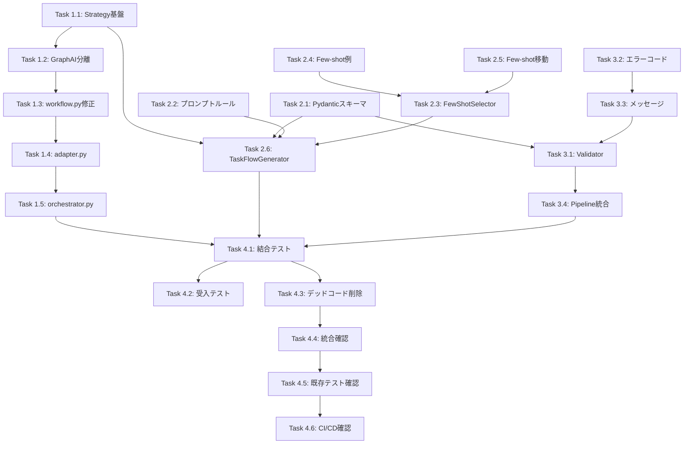

# 作業計画書: Issue #350 ワークフロー生成エージェントV2の対象エンジン切り替え

**Issue**: #350
**作成日**: 2026-01-11
**対象プロジェクト**: expertAgent (jobGeneratorV2)
**参照設計書**: [design-policy.md](./design-policy.md)
**アーキテクチャレビュー**: [architecture-review.md](./architecture-review.md)

---

## 実装概要

GraphAI YAML形式からTaskFlow V2 JSON形式へのワークフロー生成エンジン切り替えを実装します。
Strategy Patternを用いて、既存GraphAI機能を維持しつつTaskFlow V2をデフォルトエンジンとします。

### 主要変更点
1. Strategy Patternによるエンジン切り替え機構
2. TaskFlow V2用Pydanticスキーマ（Discriminated Union）
3. TaskFlow V2用プロンプトルール・Few-shot例
4. TaskFlow V2用バリデーター
5. 既存コードのリファクタリング（GraphAI関連の分離）

---

## タスク一覧

### Phase 1: 基盤整備（5タスク）

#### Task 1.1: Strategy Pattern基盤クラス作成
- **ファイル**: `workflows/workflow_gen/engine_strategy.py` (新規)
- **内容**:
  - `WorkflowGeneratorStrategy` Protocol定義
  - `generate()`, `get_prompt_rules()`, `get_validator()` メソッド定義
- **単体テスト**: `test_engine_strategy.py`
- **受入条件**:
  - [ ] Protocol定義が存在する
  - [ ] GraphAI/TaskFlow両Strategyが実装可能なインターフェース

#### Task 1.2: 既存GraphAI生成ロジックの分離
- **ファイル**:
  - `workflows/workflow_gen/yaml_generator.py` → `workflows/workflow_gen/graphai_generator.py` (リネーム)
  - `workflows/workflow_gen/graphai_generator.py` (修正)
- **内容**:
  - 既存YamlGeneratorをGraphAIGeneratorStrategyとしてラップ
  - Strategy Protocolに準拠するように調整
- **デッドコードチェック**:
  - [ ] 旧`yaml_generator.py`からの未使用import削除
  - [ ] `workflow.py`での旧参照を更新

#### Task 1.3: WorkflowGenWorkflowへのStrategy選択ロジック追加
- **ファイル**: `workflows/workflow_gen/workflow.py`
- **内容**:
  - `_create_strategy()` Factory Methodの実装
  - `engine`パラメータの追加（デフォルト: "taskflow"）
- **単体テスト**:
  - `test_create_taskflow_strategy`
  - `test_create_graphai_strategy`
  - `test_unknown_engine_raises_error`
  - `test_default_engine_is_taskflow`

#### Task 1.4: adapter.pyへのengine設定追加
- **ファイル**: `adapter.py`
- **内容**:
  - `JobGeneratorRequest`に`engine`パラメータ追加
  - orchestratorへのengine受け渡し
- **デッドコードチェック**:
  - [ ] 不要なimport文がないこと

#### Task 1.5: orchestrator.pyのengine受け渡し確認
- **ファイル**: `orchestrator.py`
- **内容**:
  - Phase 4 (WorkflowGen) へのengineパラメータ伝播確認
- **注意**: 選択ロジックはorchestratorに置かない（MF-1修正による設計）

---

### Phase 2: TaskFlow生成機能（6タスク）

#### Task 2.1: TaskFlow V2 Pydanticスキーマ定義
- **ファイル**: `workflows/workflow_gen/schemas/taskflow_schema.py` (新規)
- **内容**:
  - `ApiRestConfig`, `TransformConfig`, `CodeJsConfig` 定義
  - `TaskFlowStep` (Discriminated Union with `model_validator`)
  - `ParallelBlock`, `ConditionalBlock` 定義
  - `TaskFlowWorkflow` 定義
- **単体テスト**: `test_taskflow_schema.py`
  - 13テストケース（設計書記載）

#### Task 2.2: TaskFlow用プロンプトルール作成
- **ファイル**: `workflows/workflow_gen/prompt_builder/rules/taskflow_rules.py` (新規)
- **内容**:
  - TaskFlow V2生成ルール
  - ステップタイプ説明（api_rest, transform, code_js）
  - 変数参照形式（`${inputs.field}`, `${step_id.output}`）
  - セキュリティ制約（HTTPS強制、code_jsホワイトリスト）
- **デッドコードチェック**:
  - [ ] 既存`api_rules.py`等との重複排除

#### Task 2.3: Few-shot Selector実装
- **ファイル**: `workflows/workflow_gen/prompt_builder/few_shot/selector.py` (新規)
- **内容**:
  - `TaskPattern` Enum
  - `FewShotSelector` クラス
  - `select_examples()`, `detect_patterns()` メソッド
- **単体テスト**: `test_few_shot_selector.py`
  - 5テストケース（設計書記載）

#### Task 2.4: TaskFlow用Few-shot例作成
- **ファイル**:
  - `few_shot/taskflow/api_rest_pattern.yaml` (新規)
  - `few_shot/taskflow/transform_pattern.yaml` (新規)
  - `few_shot/taskflow/parallel_pattern.yaml` (新規)
  - `few_shot/taskflow/conditional_pattern.yaml` (新規)
- **内容**: 各パターンのFew-shot例（設計書に詳細記載）

#### Task 2.5: 既存Few-shot例のディレクトリ移動
- **ファイル**:
  - `few_shot/*.yaml` → `few_shot/graphai/*.yaml`
- **デッドコードチェック**:
  - [ ] 移動後の旧パスへの参照が残っていないこと
  - [ ] assembler.pyでのパス更新確認

#### Task 2.6: TaskFlowGeneratorStrategy実装
- **ファイル**: `workflows/workflow_gen/taskflow_generator.py` (新規)
- **内容**:
  - `TaskFlowGeneratorStrategy` クラス
  - `generate()` - LLM呼び出し・JSON生成
  - `get_prompt_rules()` - TaskFlowルール取得
  - `get_validator()` - TaskFlowValidator取得
- **単体テスト**: `test_taskflow_generator.py`
  - 9テストケース（設計書記載）

---

### Phase 3: バリデーション（4タスク）

#### Task 3.1: TaskFlowValidator実装
- **ファイル**: `validators/taskflow_validator.py` (新規)
- **内容**:
  - `TaskFlowSchemaValidator` - Pydanticスキーマ検証
  - `TaskFlowSecurityValidator` - セキュリティ検証
    - HTTPS強制
    - SSRF対策（プライベートIPブロック）
    - パス走査保護
    - code_jsホワイトリスト
- **単体テスト**: `test_taskflow_validator.py`
  - 10テストケース（設計書記載）

#### Task 3.2: エラーコード体系の実装（C-3対応）
- **ファイル**: `validators/error_codes.py` (新規)
- **内容**:
  - `ValidationErrorCode` Enum
  - エラーコード体系（E1xxx: スキーマ, E2xxx: セキュリティ, E3xxx: 参照）

#### Task 3.3: メッセージカタログ実装（C-3対応）
- **ファイル**: `validators/messages/__init__.py` (新規)
- **内容**:
  - `ERROR_MESSAGES` 辞書（en, ja）
  - `ValidationResult.get_message()` 拡張

#### Task 3.4: ValidationPipelineへの統合
- **ファイル**: `validators/__init__.py`, 関連ファイル
- **内容**:
  - TaskFlowValidatorのパイプライン登録
  - エンジン別バリデーター選択ロジック

---

### Phase 4: 統合・テスト（6タスク）

#### Task 4.1: 結合テスト作成
- **ファイル**:
  - `tests/integration/test_orchestrator_engine_switch.py` (新規)
  - `tests/integration/test_taskflow_execution.py` (新規)
- **内容**:
  - Orchestratorのengine受け渡しテスト（4ケース）
  - graphAiServerとの連携テスト（4ケース）

#### Task 4.2: 受入テスト作成（実践的L3テスト）
- **ファイル**: `tests/acceptance/test_issue_350_acceptance.py` (新規)
- **内容**:
  - 実際のサービス起動が必要なE2Eテスト
  - 詳細は下記「受入テスト詳細」セクション参照

#### Task 4.3: デッドコード検出・削除
- **対象**: Phase 1-3で変更した全ファイル
- **チェック項目**:
  - [ ] 未使用import文の削除
  - [ ] 旧ファイル名への参照削除
  - [ ] 未使用関数・クラスの削除
  - [ ] 旧Few-shotパスへの参照削除
- **検証方法**:
  ```bash
  # Ruffによる未使用import検出
  ruff check expertAgent/aiagent/langgraph/jobGeneratorV2/ --select F401

  # 旧ファイル名への参照検索
  grep -r "yaml_generator" expertAgent/aiagent/langgraph/jobGeneratorV2/
  grep -r "few_shot/api_call" expertAgent/aiagent/langgraph/jobGeneratorV2/
  ```

#### Task 4.4: 実装検証エージェントによる統合確認
- **目的**: 定義したが使用されていないコード（デッドコード）の検出
- **チェック項目**:
  - [ ] `TaskFlowGeneratorStrategy`が`workflow.py`で使用されている
  - [ ] `FewShotSelector`が`assembler.py`または`taskflow_generator.py`で使用されている
  - [ ] `TaskFlowValidator`がValidationPipelineで使用されている
  - [ ] エラーコードがバリデーターで使用されている

#### Task 4.5: 既存テストの維持確認
- **目的**: GraphAI生成機能の退行防止
- **チェック項目**:
  - [ ] 既存GraphAI関連テストが全てPASS
  - [ ] カバレッジが低下していないこと

#### Task 4.6: CI/CDパイプライン確認
- **実行コマンド**:
  ```bash
  ./scripts/pre-push-check-all.sh
  ```
- **チェック項目**:
  - [ ] 単体テストカバレッジ90%以上
  - [ ] 結合テストカバレッジ50%以上
  - [ ] Ruff/MyPyエラーゼロ

---

## 受入テスト詳細（実践的L3テスト）

### 前提条件
- expertAgent, graphAiServerが起動済み
- 環境変数（APIキー等）が設定済み

### テストケース

#### AC-1: 自然言語からTaskFlow V2ワークフロー生成
```bash
# テストコマンド
curl -X POST http://localhost:8004/job-generator \
  -H "Content-Type: application/json" \
  -d '{
    "user_requirement": "天気APIから東京の天気を取得して、日本語でフォーマットする",
    "project_id": "test",
    "engine": "taskflow"
  }'
```
**受入条件**:
- [ ] HTTP 200が返る
- [ ] `workflow_format`が`"json"`
- [ ] `workflow_content`がJSON形式
- [ ] ステップに`api_rest`と`transform`が含まれる

#### AC-2: 生成されたワークフローのgraphAiServerでの実行
```bash
# Step 1: ワークフロー生成（AC-1の結果を使用）
WORKFLOW_JSON=$(curl -s -X POST http://localhost:8004/job-generator \
  -H "Content-Type: application/json" \
  -d '{"user_requirement": "HTTPSでJSONを取得", "engine": "taskflow"}' \
  | jq -r '.workflow_content')

# Step 2: graphAiServerでの実行
curl -X POST http://localhost:8005/api/taskflow/execute \
  -H "Content-Type: application/json" \
  -d "{\"workflow\": $WORKFLOW_JSON, \"inputs\": {}}"
```
**受入条件**:
- [ ] graphAiServerで実行可能
- [ ] エラーなく完了する

#### AC-3: engineパラメータの動作確認
```bash
# TaskFlow (デフォルト)
curl -X POST http://localhost:8004/job-generator \
  -H "Content-Type: application/json" \
  -d '{"user_requirement": "APIを呼び出す", "project_id": "test"}'
# 期待: workflow_format = "json"

# GraphAI (明示指定)
curl -X POST http://localhost:8004/job-generator \
  -H "Content-Type: application/json" \
  -d '{"user_requirement": "APIを呼び出す", "project_id": "test", "engine": "graphai"}'
# 期待: workflow_format = "yaml"
```
**受入条件**:
- [ ] デフォルト（engine未指定）でTaskFlow V2が使用される
- [ ] `engine: "graphai"`でGraphAI YAMLが生成される

#### AC-4: 後方互換性（GraphAI）の確認
```bash
curl -X POST http://localhost:8004/job-generator \
  -H "Content-Type: application/json" \
  -d '{
    "user_requirement": "SlackにメッセージをPOSTする",
    "project_id": "test",
    "engine": "graphai"
  }'
```
**受入条件**:
- [ ] GraphAI YAML形式で生成される
- [ ] 既存フォーマットと互換性がある
- [ ] graphAiServerのGraphAIエンジンで実行可能

#### AC-5: セキュリティ検証（HTTP URLの拒否）
```bash
curl -X POST http://localhost:8004/job-generator \
  -H "Content-Type: application/json" \
  -d '{
    "user_requirement": "http://example.com からデータを取得する",
    "project_id": "test",
    "engine": "taskflow"
  }'
```
**受入条件**:
- [ ] 生成されるワークフローにHTTP URLが含まれない、またはバリデーションエラー
- [ ] HTTPSへの変換またはエラーメッセージが返る

#### AC-6: セキュリティ検証（プライベートIPの拒否）
```bash
# LLMに意図的にプライベートIPを含むワークフロー生成を依頼
curl -X POST http://localhost:8004/job-generator \
  -H "Content-Type: application/json" \
  -d '{
    "user_requirement": "192.168.1.1 のローカルAPIを呼び出す",
    "project_id": "test",
    "engine": "taskflow"
  }'
```
**受入条件**:
- [ ] バリデーションエラーが返る
- [ ] エラーメッセージにSSRF対策の旨が含まれる

---

## デッドコードチェック詳細

### チェック対象ファイル

| ファイル | チェック観点 |
|---------|------------|
| `workflow.py` | 旧`YamlGenerator`への直接参照がないこと |
| `adapter.py` | 未使用importがないこと |
| `orchestrator.py` | engine設定関連の未使用変数がないこと |
| `assembler.py` | 旧Few-shotパスへの参照がないこと |
| `validators/__init__.py` | 未使用バリデーターのimportがないこと |

### 自動検出コマンド

```bash
# 1. 未使用import検出
ruff check expertAgent/aiagent/langgraph/jobGeneratorV2/ --select F401,F811

# 2. 未使用変数検出
ruff check expertAgent/aiagent/langgraph/jobGeneratorV2/ --select F841

# 3. 未使用関数検出（vulture使用）
pip install vulture
vulture expertAgent/aiagent/langgraph/jobGeneratorV2/ --min-confidence 80

# 4. 旧ファイル参照検索
grep -rn "from.*yaml_generator import" expertAgent/
grep -rn "from.*YamlGenerator" expertAgent/
```

### 手動検証項目

1. **Strategy統合確認**: 新規作成した各Strategyクラスが`workflow.py`の`_create_strategy()`で使用されているか
2. **Validator統合確認**: `taskflow_validator.py`がValidationPipelineに登録されているか
3. **FewShot統合確認**: `selector.py`が`taskflow_generator.py`または`assembler.py`で使用されているか
4. **エラーコード統合確認**: `error_codes.py`のコードがバリデーターで使用されているか

---

## 依存関係



---

## 成果物一覧

### 新規ファイル
| ファイル | 説明 |
|---------|------|
| `engine_strategy.py` | Strategy Pattern基盤 |
| `taskflow_generator.py` | TaskFlow生成ロジック |
| `schemas/taskflow_schema.py` | Pydanticスキーマ |
| `prompt_builder/rules/taskflow_rules.py` | プロンプトルール |
| `prompt_builder/few_shot/selector.py` | Few-shot選択器 |
| `prompt_builder/few_shot/taskflow/*.yaml` | Few-shot例 |
| `validators/taskflow_validator.py` | バリデーター |
| `validators/error_codes.py` | エラーコード体系 |
| `validators/messages/__init__.py` | メッセージカタログ |
| `tests/unit/test_taskflow_*.py` | 単体テスト |
| `tests/integration/test_*_engine_*.py` | 結合テスト |
| `tests/acceptance/test_issue_350_acceptance.py` | 受入テスト |

### 変更ファイル
| ファイル | 変更内容 |
|---------|---------|
| `workflow.py` | Strategy選択ロジック追加 |
| `adapter.py` | engineパラメータ追加 |
| `yaml_generator.py` | `graphai_generator.py`へリネーム・修正 |
| `assembler.py` | Few-shotパス更新 |
| `validators/__init__.py` | TaskFlowValidator登録 |

---

## 完了基準

- [ ] 全21タスク完了
- [ ] 単体テストカバレッジ90%以上
- [ ] 結合テストカバレッジ50%以上
- [ ] 受入テスト6ケース全てPASS
- [ ] デッドコードチェック完了（Ruff/vultureエラーゼロ）
- [ ] 実装検証エージェントによる統合確認完了
- [ ] CI/CDパイプラインPASS
- [ ] 既存GraphAIテスト全てPASS（退行なし）

---

## 変更履歴

| 日付 | 変更内容 |
|------|---------|
| 2026-01-11 | 初版作成 |

---

**作業計画書作成完了**: 2026-01-11
