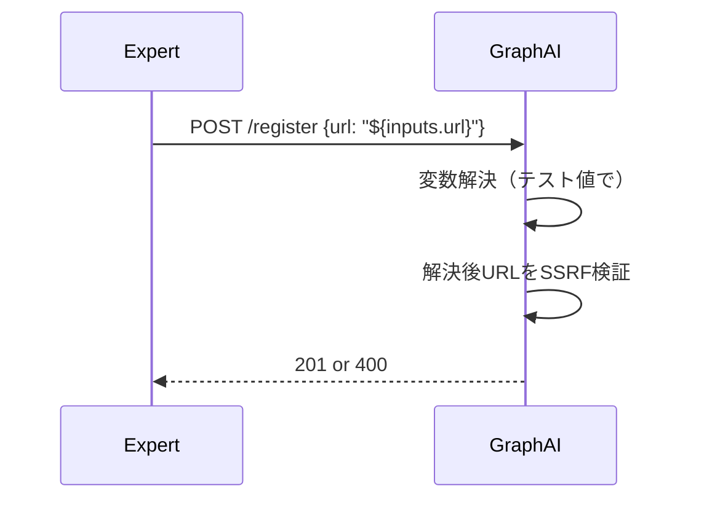

# アーキテクチャレビュー: Issue #352

## レビュー対象

| 項目 | 内容 |
|------|------|
| 対象ドキュメント | `dev-reports/issue-352/design-policy.md` |
| Issue番号 | #352 |
| レビュー日 | 2026-01-12 |
| レビュアー | Claude Code (architecture-review skill) |

---

## 1. 設計原則の遵守確認

### SOLID原則チェック

| 原則 | 状態 | 評価 | コメント |
|------|------|------|----------|
| **S**ingle Responsibility | OK | Pass | URL検証は`url-validator.ts`、スキーマ検証は`workflow-schema.ts`に分離されている |
| **O**pen/Closed | OK | Pass | 正規表現パターン拡張で対応、既存ロジックの構造は変更なし |
| **L**iskov Substitution | N/A | - | 継承関係なし |
| **I**nterface Segregation | OK | Pass | 検証関数は単一目的で設計されている |
| **D**ependency Inversion | OK | Pass | パターン定義を定数化し、検証ロジックと分離 |

### その他の原則

| 原則 | 状態 | 評価 | コメント |
|------|------|------|----------|
| KISS | OK | Pass | 正規表現パターンの拡張のみで最小限の変更 |
| YAGNI | OK | Pass | 「両システム統一」は将来検討とし、今回はスコープ外 |
| DRY | **要改善** | Warn | 同一パターンが2箇所で重複定義される予定（後述） |

---

## 2. アーキテクチャ評価

### 構造的品質

| 評価項目 | スコア | コメント |
|---------|--------|----------|
| モジュール性 | ⭐⭐⭐⭐☆ (4/5) | URL検証とスキーマ検証が適切に分離 |
| 結合度 | ⭐⭐⭐⭐☆ (4/5) | 疎結合、ただしパターン重複あり |
| 凝集度 | ⭐⭐⭐⭐⭐ (5/5) | 各モジュールが単一目的を果たす |
| 拡張性 | ⭐⭐⭐⭐☆ (4/5) | パターン変更で容易に拡張可能 |
| 保守性 | ⭐⭐⭐☆☆ (3/5) | パターン重複により同期維持が必要 |

### パフォーマンス観点

| 項目 | 評価 | コメント |
|------|------|----------|
| レスポンスタイム | 影響なし | 正規表現マッチングは軽量（O(n)） |
| スループット | 影響なし | バリデーション処理負荷は無視できる |
| リソース使用効率 | 良好 | 追加のメモリ割り当てなし |
| スケーラビリティ | 影響なし | ステートレスな検証処理 |

---

## 3. セキュリティレビュー

### OWASP Top 10 チェック

| 項目 | 状態 | コメント |
|------|------|----------|
| A01: アクセス制御の不備 | N/A | 本変更はアクセス制御に影響なし |
| A02: 暗号化の失敗 | N/A | 本変更は暗号化に影響なし |
| A03: インジェクション | **要確認** | 正規表現でホワイトリスト検証（後述） |
| A04: 安全でない設計 | OK | 実行時SSRF検証を維持 |
| A05: セキュリティ設定ミス | OK | 本番環境でHTTP禁止を維持 |
| A06: 脆弱なコンポーネント | N/A | 新規依存なし |
| A07: 認証の失敗 | N/A | 本変更は認証に影響なし |
| A08: ソフトウェアとデータの整合性 | OK | 検証ロジックの整合性確保 |
| A09: ログとモニタリング不足 | OK | 既存のログ機構を維持 |
| A10: SSRF | **重要** | 詳細レビュー実施（後述） |

### SSRF保護の詳細レビュー

#### 現状の保護機構

```
スキーマ検証時（workflow-schema.ts）
  └─ 変数参照 → スキップ（実行時に検証）
  └─ 固定URL → HTTPS強制

実行時検証（url-validator.ts）
  └─ 変数解決後のURL → SSRF検証
      ├─ プライベートIP拒否
      ├─ メタデータエンドポイント拒否
      └─ ドメインホワイトリスト
```

#### セキュリティ評価

| リスク | 評価 | 対策 |
|--------|------|------|
| 変数参照でSSRF回避 | 低 | 実行時に解決後URLを検証（二重防御） |
| 不正な変数形式 | 低 | 正規表現でホワイトリスト検証 |
| 開発モード悪用 | 中 | 環境変数による制御（既存設計） |

#### 推奨事項

1. **変数参照パターンの厳格化（OK）**
   - 設計方針書で正規表現パターン採用を確認
   - `${123invalid}` 等の不正形式を拒否

2. **実行時SSRF検証の維持（OK）**
   - 変数解決後に`validateUrl()`を呼び出し
   - 既存の保護機構が有効

---

## 4. 既存システムとの整合性

### 統合ポイント

| 項目 | 状態 | コメント |
|------|------|----------|
| API互換性 | OK | API仕様変更なし、バリデーション緩和のみ |
| データモデル整合性 | OK | スキーマ構造変更なし |
| 認証/認可の一貫性 | N/A | 本変更は認証に影響なし |
| ログ/監視の統合 | OK | 既存のログ機構を維持 |

### 技術スタックの適合性

| 項目 | 評価 | コメント |
|------|------|----------|
| 既存技術との親和性 | ⭐⭐⭐⭐⭐ | TypeScript/Zod既存パターンを踏襲 |
| チームのスキルセット | ⭐⭐⭐⭐⭐ | 既存コードベースの拡張のみ |
| 運用負荷への影響 | ⭐⭐⭐⭐⭐ | 追加の運用作業なし |

### パターン整合性の検証

#### expertAgent (Python)
```python
# variable_patterns.py:24-26
TASKFLOW_VARIABLE_PATTERN = re.compile(
    r"\$\{[a-zA-Z_][a-zA-Z0-9_-]*(?:\.[a-zA-Z_][a-zA-Z0-9_-]*)*\}"
)
```

#### GraphAiServer (TypeScript) - 提案
```typescript
// workflow-schema.ts (提案)
const TASKFLOW_VAR_PATTERN = /^\$\{[a-zA-Z_][a-zA-Z0-9_-]*(?:\.[a-zA-Z_][a-zA-Z0-9_-]*)*\}/;
```

**差異分析:**
| 項目 | Python | TypeScript | 整合性 |
|------|--------|------------|--------|
| 基本パターン | 同一 | 同一 | OK |
| アンカー | なし（`search`使用） | `^`（先頭一致） | **要確認** |
| 末尾`}`の扱い | パターンに含む | パターンに含まない | **要確認** |

---

## 5. リスク評価

| リスク種別 | 内容 | 影響度 | 発生確率 | 対策優先度 |
|-----------|------|-------|---------|-----------|
| 技術的リスク | 正規表現パターン不一致 | 高 | 中 | **高** |
| 技術的リスク | パターン重複によるメンテナンス負荷 | 中 | 高 | 中 |
| 運用リスク | 後方互換性破損 | 低 | 低 | 低 |
| セキュリティリスク | 不正変数参照によるSSRF | 低 | 低 | 低 |
| ビジネスリスク | 既存ワークフロー登録失敗継続 | 高 | 確実 | **高** |

---

## 6. 改善提案

### 必須改善項目（Must Fix）

#### MF-1: 正規表現パターンの末尾処理を明確化

**問題:**
設計方針書の提案パターンで、変数参照の末尾`}`の扱いが曖昧。

**現在の提案:**
```typescript
const TASKFLOW_VAR_PATTERN = /^\$\{[a-zA-Z_][a-zA-Z0-9_-]*(?:\.[a-zA-Z_][a-zA-Z0-9_-]*)*\}/;
```

**問題のケース:**
- `${inputs.url}/path` → 末尾に`}`がないとマッチしない可能性

**修正案:**
```typescript
// 変数参照で始まるURLを許可（後続パスあり）
const TASKFLOW_VAR_PATTERN = /^\$\{[a-zA-Z_][a-zA-Z0-9_-]*(?:\.[a-zA-Z_][a-zA-Z0-9_-]*)*\}/;

// 検証ロジック
if (url.startsWith('${')) {
  // 変数参照部分を抽出して検証
  const varMatch = url.match(/^\$\{[^}]+\}/);
  if (varMatch && TASKFLOW_VAR_PATTERN.test(varMatch[0])) {
    return true;
  }
}
```

#### MF-2: url-validator.tsとworkflow-schema.tsの両方を更新

**問題:**
設計方針書では両ファイルの更新が記載されているが、パターン定義が重複する。

**修正案:**
共通定数をエクスポートして再利用:

```typescript
// constants/variable-patterns.ts (新規)
export const TASKFLOW_VAR_PATTERN = /^\$\{[a-zA-Z_][a-zA-Z0-9_-]*(?:\.[a-zA-Z_][a-zA-Z0-9_-]*)*\}/;

export function isValidTaskflowVariable(str: string): boolean {
  const varMatch = str.match(/^\$\{[^}]+\}/);
  return varMatch !== null && TASKFLOW_VAR_PATTERN.test(varMatch[0]);
}
```

### 推奨改善項目（Should Fix）

#### SF-1: テストケースの網羅性向上

**現在の提案:**
- `${inputs.base_url}` 許可
- `${step_001.output.url}` 許可
- `${123invalid}` 拒否

**追加推奨テストケース:**
```typescript
// 境界値テスト
'${a}' // 最短の有効な変数
'${_}' // アンダースコア開始
'${a-b.c-d}' // ハイフン含む
'${inputs.url}/api/v1/users' // 後続パスあり
'${inputs.url}?query=1' // クエリパラメータあり

// 異常系テスト
'${}' // 空の変数
'${.invalid}' // ドット開始
'${invalid.}' // ドット終了
'${in valid}' // スペース含む
'${123}' // 数字開始
'https://${inputs.host}/path' // 変数が途中（現在対象外）
```

#### SF-2: エラーメッセージの改善

**現在の提案:**
```
URL must use HTTPS protocol or be a TaskFlow variable reference (${inputs.*}, ${step_id.output.*}, ${env.*}, ${secrets.*})
```

**改善案:**
```
URL must use HTTPS protocol (https://) or start with a TaskFlow variable reference.
Valid variable formats: ${inputs.field}, ${step_id.output.field}, ${env.VAR}, ${secrets.KEY}
Example: ${inputs.base_url}/api/v1/endpoint
```

### 検討事項（Consider）

#### C-1: 将来的なパターン共通化

**現状:**
- Python: `variable_patterns.py`
- TypeScript: 各ファイルでパターン定義

**将来検討:**
- JSON Schemaでパターン定義を共有
- OpenAPI仕様でパターンを一元管理
- CI/CDでパターン整合性チェック

#### C-2: 変数参照のセマンティック検証

**現状:**
構文的な検証のみ（正規表現パターン）

**将来検討:**
- `${step_999.output}` → 存在しないステップIDの検出
- `${inputs.undefined_field}` → 未定義入力フィールドの警告
- 実行前の静的解析機能

---

## 7. ベストプラクティスとの比較

### 業界標準との差異

| 項目 | 業界標準 | 現在の設計 | 評価 |
|------|---------|-----------|------|
| 変数参照構文 | `${var}`, `{{var}}`, `$var` | `${var}` | 適切 |
| スキーマ検証 | 登録時 + 実行時 | 登録時（構文）+ 実行時（セマンティック） | 適切 |
| SSRF保護 | 実行時検証 | 実行時検証 | 適切 |
| エラーメッセージ | 詳細な指示 | 基本的な情報 | 改善可 |

### 代替アーキテクチャ案

#### 代替案1: 登録時に変数を解決



**メリット:**
- 登録時にセキュリティ問題を検出
- 実行時エラーを削減

**デメリット:**
- テスト値の定義が必要
- 動的なURL（`${step.output.url}`）は検証不可
- 複雑性増加

**結論:** 不採用（現設計が適切）

#### 代替案2: 変数タイプ別の厳格な検証

```typescript
// URL許可変数タイプを限定
const URL_ALLOWED_SOURCES = ['inputs', 'env', 'secrets'];
// stepの出力はURL用途では危険とみなす
```

**メリット:**
- セキュリティ強化
- 攻撃面の縮小

**デメリット:**
- ユースケースの制限（ステップ間でURLを渡せない）
- 既存のワークフローが壊れる可能性

**結論:** 不採用（ユースケース制限が過度）

---

## 8. 総合評価

### レビューサマリ

| 項目 | 評価 |
|------|------|
| **全体評価** | ⭐⭐⭐⭐☆（4/5） |
| **強み** | 最小限の変更、既存パターン踏襲、セキュリティ維持 |
| **弱み** | パターン重複、テストケース不足 |

### 詳細評価

| 観点 | スコア | コメント |
|------|--------|----------|
| 設計原則遵守 | 4/5 | DRY原則違反（パターン重複） |
| セキュリティ | 5/5 | SSRF保護維持、ホワイトリスト検証 |
| 保守性 | 3/5 | パターン同期が必要 |
| 実装容易性 | 5/5 | 既存コードの軽微な修正のみ |
| テスト容易性 | 4/5 | 追加テストケース推奨 |

### 総評

設計方針書は問題の根本原因を正確に特定し、最小限の変更で解決する適切なアプローチを提案しています。GraphAiServer側のみの修正という判断は、OpenAI Structured Output互換性維持と実行エンジンとの整合性確保の観点から妥当です。

**主な改善点:**
1. 正規表現パターンの末尾処理を明確化（MF-1）
2. パターン定義の共通化を検討（MF-2）
3. テストケースの網羅性向上（SF-1）

### 承認判定

| 判定 | 状態 |
|------|------|
| **承認（Approved）** | ✅ |
| 条件付き承認（Conditionally Approved） | |
| 要再設計（Needs Major Changes） | |

**実装完了:**
- MF-1（パターン末尾処理）: `startsWithValidVariable()` で解決 ✅
- MF-2（パターン共通化）: `variable-patterns.ts` モジュール作成 ✅
- SF-1（テスト追加）: 117件のテストケース追加 ✅
- SF-2（エラーメッセージ改善）: `URL_VALIDATION_SHORT_MESSAGE` 追加 ✅

### 次のステップ

1. [x] MF-1, MF-2の対応を設計方針書に反映
2. [x] 単体テストケースの詳細設計（SF-1参照）
3. [x] 実装着手
4. [ ] 受入テスト実行

---

## 付録: チェックリスト

### 実装前確認

- [x] 正規表現パターンがexpertAgentと整合している
- [x] 変数参照後のパス（`${var}/path`）がサポートされている
- [x] エラーメッセージが更新されている
- [x] 既存テストが全てパスする

### 実装後確認

- [x] 新規テストケースが追加されている（117件）
- [ ] 受入テストが実行されている
- [x] ドキュメントが更新されている
- [x] セキュリティレビューが完了している

---

**レビュー完了日**: 2026-01-12
**レビュアー**: Claude Code (architecture-review skill)
**実装完了日**: 2026-01-12
**単体テスト結果**: 117件パス
