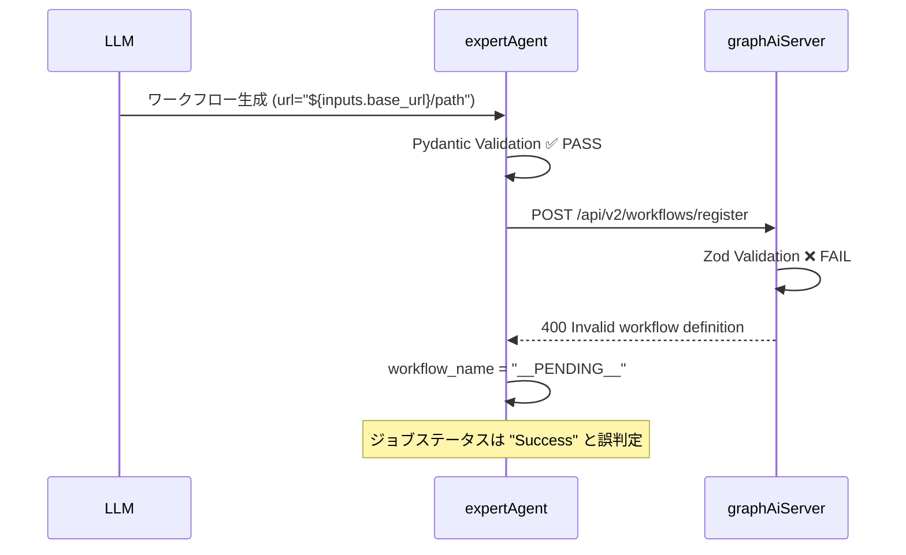
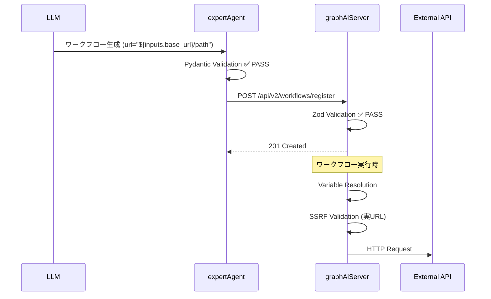
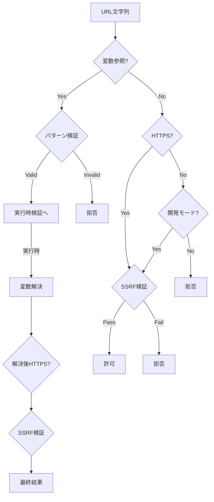

# 設計方針書: Issue #352 - TaskFlow V2 URL変数参照バリデーション不整合

## Issue情報

| 項目 | 内容 |
|------|------|
| Issue番号 | #352 |
| タイトル | TaskFlow V2: expertAgentとGraphAiServerのURL変数参照バリデーション不整合により登録失敗 |
| 対象プロジェクト | expertAgent, graphAiServer |
| 種別 | bug fix |
| 関連Issue | #350 (TaskFlow V2 Architecture), #351 (output field validation) |

---

## 現状調査サマリ

### 対象プロジェクト

- **expertAgent**: Pydanticによるワークフロー生成時のスキーマバリデーション
- **graphAiServer**: Zodによるワークフロー登録時のスキーマバリデーション

### 問題の根本原因

| コンポーネント | ファイル | 許可する変数参照 |
|---------------|---------|-----------------|
| **expertAgent (Pydantic)** | `taskflow_schema.py:121-135` | `${` で始まる全ての変数参照 |
| **GraphAiServer (Zod)** | `workflow-schema.ts:66-83` | `${env.}` または `${secrets.}` のみ |
| **GraphAiServer (実行時)** | `context-manager.ts:103-130` | `${inputs.}`, `${node_id.output.}`, `${env.}`, `${secrets.}` 全て |

### バリデーション不整合の影響

| 変数参照 | expertAgent | GraphAiServer Zod | GraphAiServer 実行時 | 結果 |
|---------|-------------|-------------------|---------------------|------|
| `${secrets.KEY}` | PASS | PASS | PASS | **OK** |
| `${env.VAR}` | PASS | PASS | PASS | **OK** |
| `${inputs.url}` | PASS | **FAIL** | PASS | **登録失敗** |
| `${step_001.output}` | PASS | **FAIL** | PASS | **登録失敗** |

### 既存アーキテクチャパターン

1. **変数パターン定義**: `expertAgent/variable_patterns.py`
   - `TASKFLOW_VARIABLE_PATTERN`: `\$\{[a-zA-Z_][a-zA-Z0-9_-]*(?:\.[a-zA-Z_][a-zA-Z0-9_-]*)*\}`
   - `${inputs.query}`, `${step_001.output}`, `${secrets.API_KEY}` など全てにマッチ

2. **URL検証パターン**: `graphAiServer/workflow-schema.ts`
   - 現在: `${env.}` と `${secrets.}` のみ許可
   - 実行エンジンとの不整合

3. **実行時変数解決**: `graphAiServer/context-manager.ts`
   - `inputs`, `env`, `secrets`, `output` の4種類をサポート
   - URL内の変数は実行時に解決される

### 参照したドキュメント

- `docs/arch/service-dependencies.md`: サービス間依存関係
- `expertAgent/docs/API_REFERENCE.md`: expertAgent API仕様
- `graphAiServer/docs/TASKFLOW_GENERATION_RULES.md`: ワークフロー生成ルール

### 設計上の制約

1. **セキュリティ要件**: HTTPS強制、SSRF保護は維持
2. **後方互換性**: 既存の `${env.}`, `${secrets.}` は引き続き動作
3. **OpenAI Structured Output互換**: expertAgentのスキーマは変更不可

---

## アーキテクチャ設計

### システム構成図

```mermaid
graph TD
    subgraph "expertAgent (Python)"
        LLM[LLM生成] --> PYDANTIC[Pydantic Validation<br/>taskflow_schema.py]
    end

    subgraph "graphAiServer (TypeScript)"
        ZOD[Zod Validation<br/>workflow-schema.ts]
        EXEC[Variable Resolution<br/>context-manager.ts]
        SSRF[SSRF Protection<br/>url-validator.ts]
    end

    PYDANTIC -->|POST /api/v2/workflows/register| ZOD
    ZOD -->|FAIL: ${inputs.url}| ERROR[登録失敗]
    ZOD -->|PASS| EXEC
    EXEC --> SSRF
    SSRF -->|URL検証| API[外部API]

    style ERROR fill:#ffcccc
    style ZOD fill:#fff3cd
```

### 現状のデータフロー（問題あり）



### 修正後のデータフロー



---

## 技術選定

### 修正対象コンポーネント

| コンポーネント | 選定技術 | 修正内容 | 既存との整合性 |
|---------------|---------|---------|---------------|
| graphAiServer | TypeScript/Zod | URL変数参照パターン拡張 | 既存のZodスキーマ拡張 |
| graphAiServer | TypeScript | URL検証関数更新 | url-validator.ts拡張 |

### 選定理由

1. **GraphAiServer側のみ修正（推奨）**
   - expertAgentのPydanticスキーマはOpenAI Structured Output互換が必要
   - GraphAiServerの実行エンジンは既に全変数タイプをサポート
   - スキーマと実行の整合性を取る

2. **両方を統一（将来検討）**
   - 共通の変数パターン定義を作成
   - 長期的なメンテナンス性向上
   - 今回は見送り（スコープ外）

---

## 設計パターン

### 適用パターン

1. **Strategy Pattern（既存踏襲）**
   - URL検証で開発モード/本番モードを切り替え
   - `isDevModeEnabled()` による動作変更

2. **Whitelist Pattern（既存踏襲）**
   - 許可される変数参照パターンを明示的に定義
   - セキュリティ観点から重要

### 変数参照パターン定義

```typescript
/**
 * TaskFlow V2で許可される変数参照パターン
 *
 * 形式: ${source.path.to.field}
 *
 * source:
 *   - inputs: ワークフロー入力パラメータ
 *   - env: 環境変数
 *   - secrets: MyVaultシークレット
 *   - {step_id}: 前ステップの出力
 */
const TASKFLOW_VARIABLE_PATTERN = /^\$\{[a-zA-Z_][a-zA-Z0-9_-]*(?:\.[a-zA-Z_][a-zA-Z0-9_-]*)*\}/;
```

---

## データモデル設計

### 変更なし

既存のデータモデル（WorkflowDefinition, Step等）に変更はありません。
バリデーションロジックのみの修正です。

---

## API設計

### 変更なし

API仕様に変更はありません。
バリデーションエラーの発生条件が緩和されるのみです。

### エラーハンドリング改善（副次的）

```typescript
// 現在
{
  "message": "URL must use HTTPS protocol or be a variable reference (${env.VAR} or ${secrets.KEY})"
}

// 修正後
{
  "message": "URL must use HTTPS protocol or be a TaskFlow variable reference (${inputs.*}, ${step_id.output.*}, ${env.*}, ${secrets.*})"
}
```

---

## セキュリティ設計

### セキュリティ原則維持

1. **HTTPS強制**: 変数参照以外のURLはHTTPS必須（既存維持）
2. **SSRF保護**: 実行時の変数解決後にURL検証（既存維持）
3. **変数参照パターン検証**: 不正な形式を拒否

### セキュリティ検証フロー



### 許可される変数参照パターン

| パターン | 例 | 用途 |
|---------|---|------|
| `${inputs.*}` | `${inputs.base_url}` | 入力パラメータ参照 |
| `${step_id.output.*}` | `${fetch_user.output.api_url}` | 前ステップ出力参照 |
| `${env.*}` | `${env.API_BASE_URL}` | 環境変数参照 |
| `${secrets.*}` | `${secrets.API_KEY}` | シークレット参照 |

---

## パフォーマンス設計

### 影響なし

- バリデーションの正規表現パターンは軽量
- 既存のパフォーマンス特性を維持

---

## 設計判断とトレードオフ

### 判断1: GraphAiServer側のみ修正

**採用理由:**
- expertAgentのスキーマはOpenAI Structured Output互換が必要
- GraphAiServerの実行エンジンは既に全変数をサポート
- 最小限の変更で問題解決

**代替案:**
- 両方で共通パターン定義を使用
- 却下理由: スコープが大きくなり、リスク増加

### 判断2: 正規表現パターンによるホワイトリスト検証

**採用理由:**
- 既存のexpertAgent実装と整合
- セキュリティ観点で明示的
- パターンの拡張が容易

**代替案:**
- `${` で始まる全てを許可
- 却下理由: 不正な形式（`${123invalid}`等）を通してしまう

### 判断3: SSRF検証は実行時のまま

**採用理由:**
- 変数参照はスキーマ検証時に値が不明
- 実行時に解決後の実URLを検証するのが正しい
- 既存のセキュリティモデルを維持

**リスク:**
- なし（既存の設計を踏襲）

---

## 実装計画

### Phase 0: 共通モジュール作成 ✅ 実装完了

**対象ファイル:** `graphAiServer/src/engine/constants/variable-patterns.ts` (新規)

アーキテクチャレビューのMF-2に対応し、パターン定義を共通化:

```typescript
// 共通モジュール: variable-patterns.ts
export const TASKFLOW_VARIABLE_PATTERN = /^\$\{[a-zA-Z_][a-zA-Z0-9_-]*(?:\.[a-zA-Z_][a-zA-Z0-9_-]*)*\}$/;
export function startsWithValidVariable(url: string): boolean { ... }
export const URL_VALIDATION_SHORT_MESSAGE = '...';
```

### Phase 1: GraphAiServer Zodスキーマ修正 ✅ 実装完了

**対象ファイル:** `graphAiServer/src/engine/schemas/workflow-schema.ts`

**実装内容:**
```typescript
import { startsWithValidVariable, URL_VALIDATION_SHORT_MESSAGE } from '../constants/variable-patterns.js';

const httpsUrlSchema = z.string().refine(
  (url) => {
    // Issue #352: Allow all valid TaskFlow variable references
    if (startsWithValidVariable(url)) {
      return true;
    }
    // ... rest of validation
  },
  { message: URL_VALIDATION_SHORT_MESSAGE }
);
```

### Phase 2: URL Validator更新 ✅ 実装完了

**対象ファイル:** `graphAiServer/src/engine/validator/url-validator.ts`

**実装内容:**
```typescript
import { startsWithValidVariable } from '../constants/variable-patterns.js';

export function validateUrl(urlString: string): UrlValidationResult {
  // Issue #352: Handle all TaskFlow variable references
  if (startsWithValidVariable(urlString)) {
    return { valid: true };
  }
  // ... rest of validation
}
```

### Phase 3: テスト追加 ✅ 実装完了

**追加ファイル:**
- `graphAiServer/tests/unit/engine/constants/variable-patterns.test.ts` (新規)
- `graphAiServer/tests/unit/engine/url-validator.test.ts` (更新)

**追加テストケース (117テスト):**
- `${inputs.base_url}` を含むURLが許可される ✅
- `${step_001.output.url}` を含むURLが許可される ✅
- `${123invalid}` は拒否される ✅
- `${inputs.url}/path` のような複合パターンが許可される ✅
- エッジケース（空変数、深いネスト、ハイフン付きID等） ✅

### Phase 4: 受入テスト

**対象ファイル:** `graphAiServer/tests/acceptance/test_issue_352_acceptance.py`

**テスト内容:**
1. `${inputs.}` 変数参照を含むワークフローが登録できる
2. `${step.output}` 変数参照を含むワークフローが登録できる
3. 登録後の実行で変数が正しく解決される
4. 不正な変数参照は拒否される

---

## 受入条件マッピング

| 受入条件 | 実装内容 | 検証方法 |
|---------|---------|---------|
| `${inputs.}` 許可 | workflow-schema.ts パターン拡張 | 単体テスト + 受入テスト |
| `${step.output}` 許可 | workflow-schema.ts パターン拡張 | 単体テスト + 受入テスト |
| バリデーション整合 | 両スキーマで同じパターン許可 | 結合テスト |
| 登録失敗時エラー | (副次的Issue - スコープ外) | - |
| 既存テストパス | 回帰テスト | CI実行 |
| 新規テスト追加 | Phase 3, 4 | テストファイル確認 |

---

## リスクと対策

| リスク | 影響度 | 対策 |
|--------|-------|------|
| 正規表現パターンミス | 高 | expertAgentの実装を参照、詳細なテスト |
| 後方互換性破損 | 中 | 既存テストの回帰確認 |
| セキュリティホール | 高 | SSRF検証は実行時維持、パターン厳格化 |

---

## 変更影響範囲

### 影響を受けるファイル

| ファイル | 変更内容 | 状態 |
|---------|---------|------|
| `graphAiServer/src/engine/constants/variable-patterns.ts` | 共通パターン定義モジュール（新規） | ✅ 実装完了 |
| `graphAiServer/src/engine/schemas/workflow-schema.ts` | URL検証パターン拡張 | ✅ 実装完了 |
| `graphAiServer/src/engine/validator/url-validator.ts` | 変数参照検証更新 | ✅ 実装完了 |
| `graphAiServer/tests/unit/engine/constants/variable-patterns.test.ts` | 共通モジュールテスト（新規） | ✅ 実装完了 |
| `graphAiServer/tests/unit/engine/url-validator.test.ts` | Issue #352テスト追加 | ✅ 実装完了 |
| `graphAiServer/tests/acceptance/test_issue_352_acceptance.py` | 受入テスト追加 | 未実装 |

### 影響を受けないファイル

- expertAgent のスキーマ（変更不要）
- GraphAiServer の context-manager.ts（既に全変数サポート）
- 既存のワークフロー定義

---

## 参照ドキュメント

- [service-dependencies.md](../../docs/arch/service-dependencies.md)
- [expertAgent API_REFERENCE.md](../../expertAgent/docs/API_REFERENCE.md)
- [TASKFLOW_GENERATION_RULES.md](../../graphAiServer/docs/TASKFLOW_GENERATION_RULES.md)
- [variable_patterns.py](../../expertAgent/aiagent/langgraph/jobGeneratorV2/workflows/workflow_gen/schemas/variable_patterns.py)

---

**作成日**: 2026-01-12
**作成者**: Claude Code (design-policy skill)
**レビュー**: 未レビュー
**実装状態**: Phase 0-3 完了（単体テスト117件パス）
