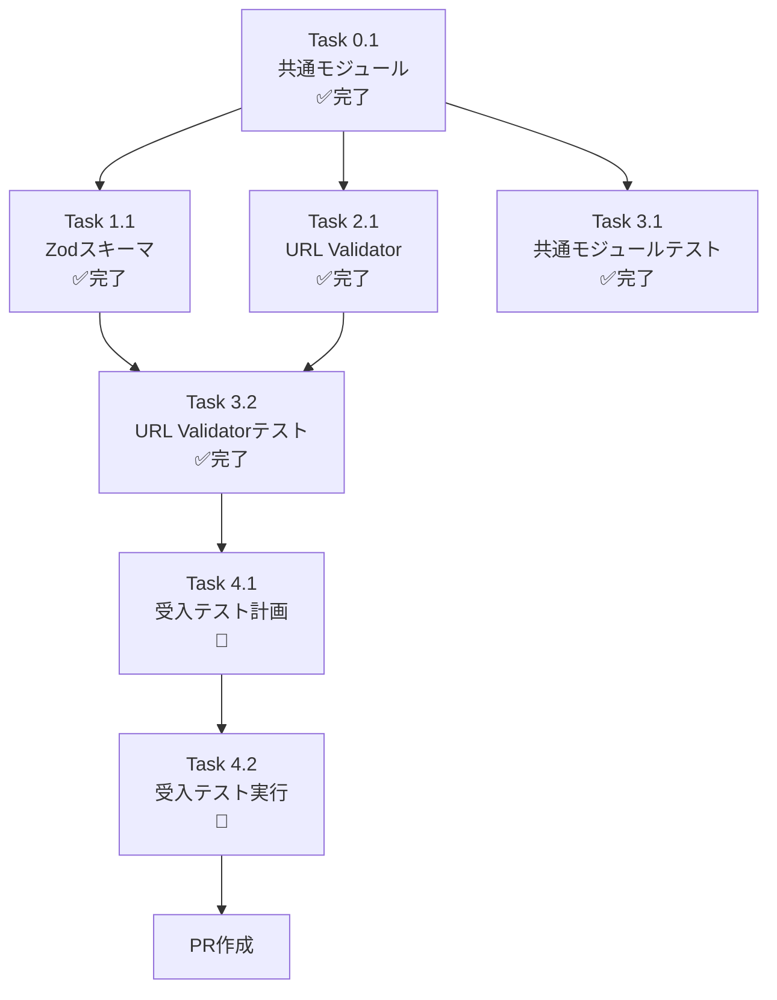

# 作業計画書: Issue #352

## Issue: TaskFlow V2 URL変数参照バリデーション不整合修正

| 項目 | 内容 |
|------|------|
| **Issue番号** | #352 |
| **サイズ** | M |
| **作業見積** | 4時間（残り1時間） |
| **優先度** | High |
| **依存Issue** | #350 (TaskFlow V2 Architecture), #351 (output field validation) |
| **ラベル** | bug, fix |

---

## 1. 現状サマリ

### 問題の根本原因

| コンポーネント | 許可する変数参照 | 結果 |
|---------------|-----------------|------|
| expertAgent (Pydantic) | `${` で始まる全て | LLM生成ワークフロー ✅ |
| GraphAiServer (Zod) | `${env.}` または `${secrets.}` のみ | 登録時 ❌ 失敗 |

### 実装進捗

| Phase | 状態 | 内容 |
|-------|------|------|
| Phase 0: 共通モジュール | ✅ 完了 | `variable-patterns.ts` 作成 |
| Phase 1: Zodスキーマ修正 | ✅ 完了 | `workflow-schema.ts` 更新 |
| Phase 2: URL Validator更新 | ✅ 完了 | `url-validator.ts` 更新 |
| Phase 3: 単体テスト | ✅ 完了 | 117件パス |
| Phase 4: 受入テスト | 🔲 未実装 | 本計画で対応 |

---

## 2. 詳細タスク分解

### 実装タスク（Phase 0-2）✅ 完了

- [x] **Task 0.1**: 共通パターンモジュール作成
  - 成果物: `graphAiServer/src/engine/constants/variable-patterns.ts`
  - 内容: `TASKFLOW_VARIABLE_PATTERN`, `startsWithValidVariable()`, エラーメッセージ

- [x] **Task 1.1**: Zodスキーマ修正
  - 成果物: `graphAiServer/src/engine/schemas/workflow-schema.ts`
  - 内容: 共通モジュールのインポートと使用

- [x] **Task 2.1**: URL Validator更新
  - 成果物: `graphAiServer/src/engine/validator/url-validator.ts`
  - 内容: 共通モジュールのインポートと使用

### テストタスク（Phase 3）✅ 完了

- [x] **Task 3.1**: 共通モジュール単体テスト
  - 成果物: `graphAiServer/tests/unit/engine/constants/variable-patterns.test.ts`
  - テスト数: 約70件
  - カバレッジ: 100%

- [x] **Task 3.2**: URL Validator追加テスト
  - 成果物: `graphAiServer/tests/unit/engine/url-validator.test.ts`
  - 追加テスト: Issue #352関連10件
  - 合計: 117件パス

### 受入テストタスク（Phase 4）🔲 残作業

- [ ] **Task 4.1**: 受入テスト計画
  - 所要時間: 0.5時間
  - 成果物: 本計画書のSection 8

- [ ] **Task 4.2**: 受入テスト実行
  - 所要時間: 0.5時間
  - 成果物: `graphAiServer/tests/acceptance/test_issue_352_acceptance.py`

---

## 3. タスク依存関係



---

## 4. 作業スケジュール

### 完了済み作業（約3時間）

| 時間 | タスク | 状態 |
|------|-------|------|
| 1.0h | Task 0.1: 共通モジュール作成 | ✅ |
| 0.5h | Task 1.1: Zodスキーマ修正 | ✅ |
| 0.5h | Task 2.1: URL Validator更新 | ✅ |
| 0.5h | Task 3.1: 共通モジュールテスト | ✅ |
| 0.5h | Task 3.2: URL Validatorテスト追加 | ✅ |

### 残作業（約1時間）

| 時間 | タスク | 状態 |
|------|-------|------|
| 0.5h | Task 4.1: 受入テスト計画 | 🔲 |
| 0.5h | Task 4.2: 受入テスト実行 | 🔲 |

**総作業時間**: 4時間

---

## 5. チェックポイント

| タイミング | 確認事項 | 状態 |
|-----------|---------|------|
| Phase 2完了時 | TypeScriptコンパイル成功 | ✅ |
| Phase 3完了時 | 単体テスト117件パス | ✅ |
| Phase 4完了時 | 受入テストパス | 🔲 |
| PR作成前 | CI/CDパス | 🔲 |

---

## 6. リスクと対策

| リスク | 発生確率 | 影響 | 対策 |
|-------|---------|------|------|
| サービス起動失敗 | 低 | 受入テスト遅延 | `dev-hybrid.sh` で起動確認済み |
| GraphAiServer未起動 | 低 | 登録テスト不可 | ポート8005のヘルスチェック |
| 既存テスト破損 | 極低 | CI失敗 | 117件の回帰テスト実施済み |

---

## 7. 成果物チェックリスト

### コード ✅ 完了

- [x] `graphAiServer/src/engine/constants/variable-patterns.ts` (新規)
- [x] `graphAiServer/src/engine/schemas/workflow-schema.ts` (更新)
- [x] `graphAiServer/src/engine/validator/url-validator.ts` (更新)

### テスト

- [x] `graphAiServer/tests/unit/engine/constants/variable-patterns.test.ts` (新規)
- [x] `graphAiServer/tests/unit/engine/url-validator.test.ts` (更新)
- [ ] `graphAiServer/tests/acceptance/test_issue_352_acceptance.py` (新規)

### ドキュメント ✅ 完了

- [x] `dev-reports/issue-352/design-policy.md`
- [x] `dev-reports/issue-352/architecture-review.md`
- [x] `dev-reports/issue-352/work-plan.md` (本ファイル)

---

## 8. L3受入テスト計画（具体的なコマンド）

### Step 1: サービス起動確認

```bash
# サービス起動（ハイブリッドモード）
./scripts/dev-hybrid.sh start

# ヘルスチェック
curl -sf http://localhost:8005/health && echo "✅ graphAiServer: healthy"
curl -sf http://localhost:8004/health && echo "✅ expertAgent: healthy"
```

### Step 2: ワークフロー登録テスト（Issue #352核心部分）

#### テスト2.1: ${inputs.} 変数参照を含むワークフロー登録

```bash
# ${inputs.base_url} を含むワークフロー登録
curl -s -X POST http://localhost:8005/api/v2/workflows/register \
  -H "Content-Type: application/json" \
  -d '{
    "definition": {
      "workflow_name": "test_issue_352_inputs",
      "description": "Issue #352 acceptance test - inputs variable",
      "input_schema": {"base_url": "string", "user_id": "string"},
      "output_schema": {"result": "string"},
      "steps": [
        {
          "id": "fetch_user",
          "type": "api_rest",
          "config": {
            "step_type": "api_rest",
            "method": "GET",
            "url": "${inputs.base_url}/users/${inputs.user_id}"
          }
        }
      ],
      "output": {"result": "${fetch_user.output}"}
    }
  }' | jq .

# 期待するレスポンス:
# - HTTPステータス: 201
# - workflow_name: "test_issue_352_inputs"
```

#### テスト2.2: ${step.output} 変数参照を含むワークフロー登録

```bash
# ${step_001.output.api_url} を含むワークフロー登録
curl -s -X POST http://localhost:8005/api/v2/workflows/register \
  -H "Content-Type: application/json" \
  -d '{
    "definition": {
      "workflow_name": "test_issue_352_step_output",
      "description": "Issue #352 acceptance test - step output variable",
      "input_schema": {"query": "string"},
      "output_schema": {"result": "string"},
      "steps": [
        {
          "id": "step_001",
          "type": "transform",
          "config": {
            "step_type": "transform",
            "mode": "template",
            "template": "https://api.example.com/search"
          }
        },
        {
          "id": "step_002",
          "type": "api_rest",
          "config": {
            "step_type": "api_rest",
            "method": "GET",
            "url": "${step_001.output}"
          }
        }
      ],
      "output": {"result": "${step_002.output}"}
    }
  }' | jq .

# 期待するレスポンス:
# - HTTPステータス: 201
# - workflow_name: "test_issue_352_step_output"
```

#### テスト2.3: 不正な変数参照の拒否確認

```bash
# ${123invalid} を含むワークフロー（拒否されるべき）
curl -s -X POST http://localhost:8005/api/v2/workflows/register \
  -H "Content-Type: application/json" \
  -d '{
    "definition": {
      "workflow_name": "test_issue_352_invalid",
      "input_schema": {"query": "string"},
      "output_schema": {"result": "string"},
      "steps": [
        {
          "id": "step_001",
          "type": "api_rest",
          "config": {
            "step_type": "api_rest",
            "method": "GET",
            "url": "${123invalid}/path"
          }
        }
      ],
      "output": {"result": "${step_001.output}"}
    }
  }' -w "\nHTTP Status: %{http_code}\n"

# 期待するレスポンス:
# - HTTPステータス: 400
# - エラーメッセージ: URL validation error
```

### Step 3: 後続パス付き変数参照テスト

```bash
# ${inputs.url}/api/v1/endpoint 形式のテスト
curl -s -X POST http://localhost:8005/api/v2/workflows/register \
  -H "Content-Type: application/json" \
  -d '{
    "definition": {
      "workflow_name": "test_issue_352_trailing_path",
      "input_schema": {"base_url": "string"},
      "output_schema": {"result": "string"},
      "steps": [
        {
          "id": "api_call",
          "type": "api_rest",
          "config": {
            "step_type": "api_rest",
            "method": "GET",
            "url": "${inputs.base_url}/api/v1/users?limit=10"
          }
        }
      ],
      "output": {"result": "${api_call.output}"}
    }
  }' | jq .

# 期待するレスポンス:
# - HTTPステータス: 201
```

### Step 4: クリーンアップ

```bash
# テストワークフロー削除（オプション）
curl -s -X DELETE http://localhost:8005/api/v2/workflows/test_issue_352_inputs
curl -s -X DELETE http://localhost:8005/api/v2/workflows/test_issue_352_step_output
curl -s -X DELETE http://localhost:8005/api/v2/workflows/test_issue_352_trailing_path
```

### Step 5: エビデンス収集

```bash
# レスポンスをファイルに保存
mkdir -p /tmp/issue_352_evidence

curl -s -X POST http://localhost:8005/api/v2/workflows/register \
  -H "Content-Type: application/json" \
  -d '{"definition": {"workflow_name": "evidence_test", ...}}' \
  > /tmp/issue_352_evidence/register_response.json

# サービスログ確認
tail -50 graphAiServer/logs/*.log | grep -E "(ERROR|WARNING|352)"
```

---

## 9. Definition of Done

Issue完了条件：

- [x] すべての実装タスクが完了
- [x] 単体テストカバレッジ90%以上（117件パス）
- [x] TypeScriptコンパイル成功
- [ ] **L3受入テスト全パス**（実際のサービス起動・API呼び出し確認）
- [ ] CI/CDグリーン
- [ ] コードレビュー承認
- [x] ドキュメント更新完了

### 受入条件マッピング

| Issue受入条件 | 実装内容 | 検証方法 | 状態 |
|--------------|---------|---------|------|
| `${inputs.}` 許可 | `startsWithValidVariable()` | テスト2.1 | ✅ 単体テスト / 🔲 受入 |
| `${step.output}` 許可 | `startsWithValidVariable()` | テスト2.2 | ✅ 単体テスト / 🔲 受入 |
| バリデーション整合 | 共通モジュール使用 | テスト全体 | ✅ |
| 登録失敗時エラー | (別Issue) | - | スコープ外 |
| 既存テストパス | 回帰テスト | CI実行 | ✅ |
| 新規テスト追加 | 117件 | `npm test` | ✅ |

---

## 10. 次のアクション

1. **受入テスト実行**
   - `./scripts/dev-hybrid.sh start` でサービス起動
   - Section 8のcurlコマンドを順次実行
   - 結果をエビデンスとして保存

2. **PR作成**
   - ブランチ: `fix/issue-352-url-variable-validation`
   - タイトル: `fix(Issue #352): TaskFlow V2 URL変数参照バリデーション不整合修正`

3. **CI確認**
   - 全テストパス確認
   - 型チェック成功確認

---

**作成日**: 2026-01-12
**作成者**: Claude Code (work-plan skill)
**実装状態**: Phase 0-3 完了、Phase 4 実行待ち
