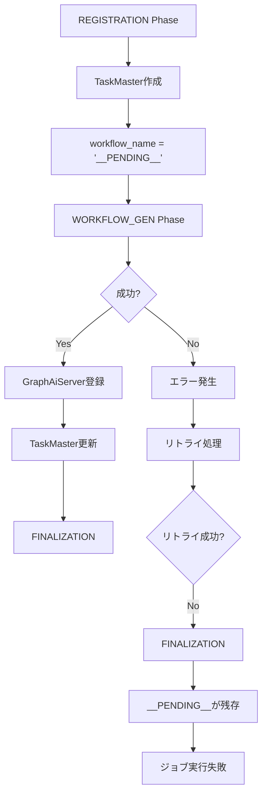
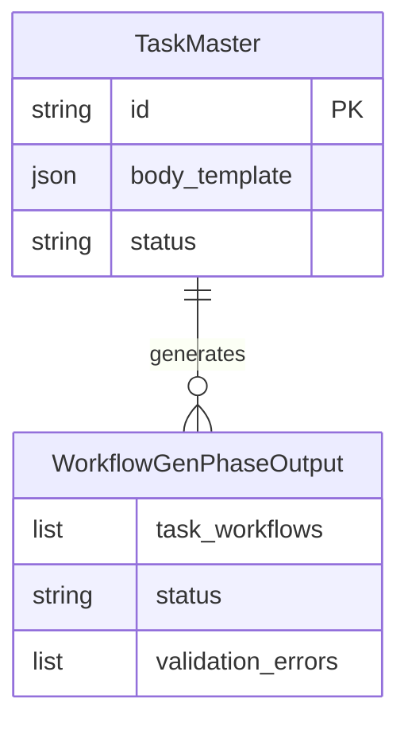
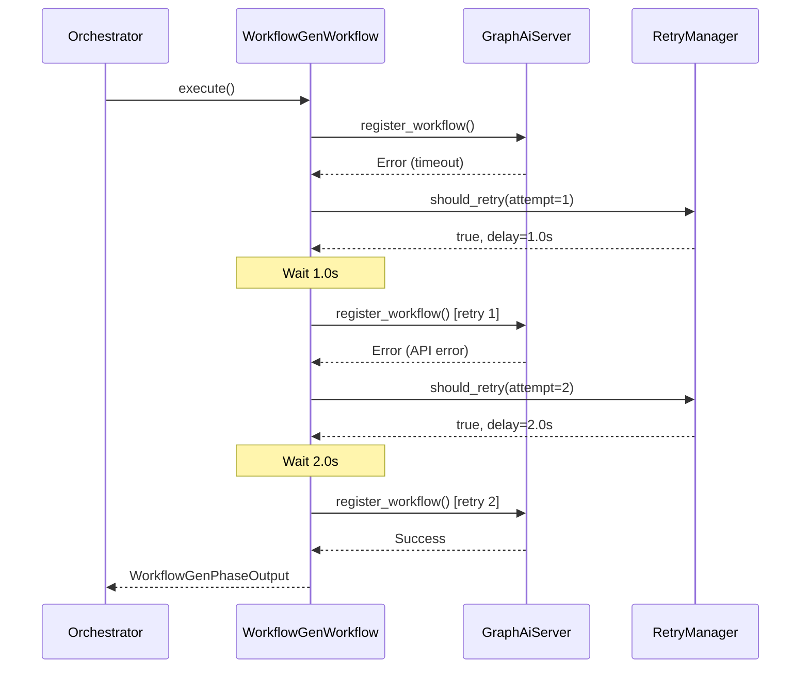
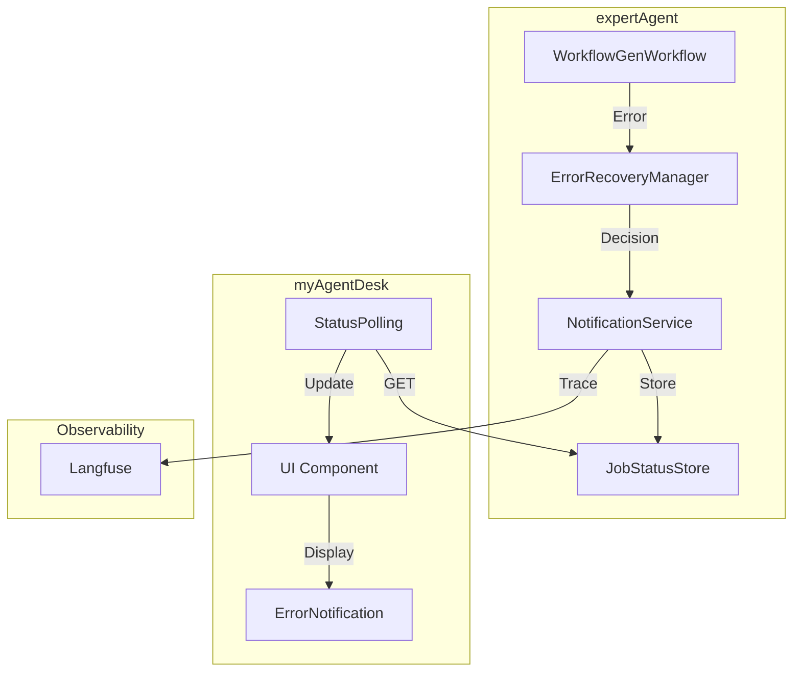

# Issue #353: Job Generator V2 WORKFLOW_GEN フェーズ未完了時のエラーハンドリング改善 設計方針書

## 1. 問題の概要

Job Generator V2において、WORKFLOW_GENフェーズが正常に完了しない場合、TaskMasterの`workflow_name`にプレースホルダー`__PENDING__`が残存し、ジョブ実行時に`Workflow '__PENDING__' not found`エラーが発生する。

## 2. 現状調査結果

### 2.1 アーキテクチャ分析



### 2.2 既存のエラーハンドリングメカニズム

| コンポーネント | 現状の実装 | 問題点 |
|--------------|----------|--------|
| ErrorType | 6種類（TRANSIENT, VALIDATION等）定義 | WORKFLOW_GEN固有のエラータイプなし |
| ErrorRecoveryStrategy | 最大3回のリトライ | リトライ後も失敗時の処理が不十分 |
| ValidationPipeline | スキーマ検証等 | `__PENDING__`残存チェックなし |
| Orchestrator | フェーズ遷移制御 | FINALIZATION前の完了検証なし |

### 2.3 既存パターンとの整合性

- **Strategy Pattern**: WorkflowGeneratorStrategyで既にTaskFlow/GraphAI切り替え実装済み
- **Observer Pattern**: ValidationObserverでLangfuse統合済み
- **Protocol-based Architecture**: 各フェーズが統一インターフェース実装済み

## 3. 設計方針

### 3.1 レイヤー構成

```mermaid
graph TD
    subgraph "Application Layer"
        A[Job Generator API]
        B[Workflow Generator API]
    end

    subgraph "Business Logic Layer"
        C[JobGenerationOrchestrator]
        D[WorkflowGenWorkflow]
        E[ValidationPipeline]
        F[ErrorRecoveryManager]
    end

    subgraph "Data Access Layer"
        G[JobQueue API Client]
        H[GraphAiServer Client]
    end

    A --> C
    B --> D
    C --> D
    C --> E
    C --> F
    D --> H
    E --> G
```



### 3.2 技術選定

| カテゴリ | 選定技術 | 理由 | 既存との整合性 |
|---------|---------|------|---------------|
| バリデーター実装 | Protocol Pattern | 既存ValidationPipelineと統一 | ✅ 既存パターン踏襲 |
| エラー処理 | ErrorType拡張 | 既存ErrorRecoveryStrategyと連携 | ✅ 既存の6種類に追加 |
| 状態管理 | ExecutionContext活用 | 既存のStorageContext内で管理 | ✅ 既存構造を拡張 |
| 通信方式 | 既存APIクライアント | JobQueueClient使用 | ✅ 変更なし |

### 3.3 設計パターン

#### 3.3.1 新規バリデーター追加（Chain of Responsibilityパターン継続）

```python
class PendingWorkflowValidator(ValidationProtocol):
    """WORKFLOW_GENフェーズ完了検証バリデーター"""

    async def validate(
        self,
        context: ExecutionContext
    ) -> ValidationResult:
        # 全TaskMasterのworkflow_nameをチェック
        # __PENDING__が残っていたらエラー
```

#### 3.3.2 エラータイプ拡張

```python
class ErrorType(Enum):
    # 既存の6種類
    TRANSIENT = "transient"
    VALIDATION = "validation"
    COMPATIBILITY = "compatibility"
    BUSINESS = "business"
    FATAL = "fatal"
    API = "api"

    # 新規追加
    INCOMPLETE_WORKFLOW = "incomplete_workflow"  # WORKFLOW_GEN未完了エラー
```

#### 3.3.3 フェーズ遷移ガード強化

```python
class JobGenerationOrchestrator:
    async def _can_proceed_to_finalization(
        self,
        phase_outputs: dict[Phase, Any],
        context: ExecutionContext,
    ) -> tuple[bool, Optional[str]]:
        """FINALIZATION移行前の検証"""
        # PendingWorkflowValidatorを実行
        # 失敗時はエラーメッセージ返却
```

## 4. データモデル設計

### 4.1 既存モデルの拡張



### 4.2 バリデーション結果モデル

```python
@dataclass
class PendingWorkflowValidationResult:
    """__PENDING__検証結果"""
    has_pending: bool
    pending_task_master_ids: list[str]
    task_details: list[dict]  # ID, name, body_template
```

## 5. API設計

### 5.1 内部API（既存APIを活用）

| API | 用途 | 変更有無 |
|-----|------|----------|
| JobQueue `/api/v1/task-masters/{id}` | TaskMaster取得 | 変更なし |
| GraphAiServer `/api/v2/workflows/register` | Workflow登録 | 変更なし |
| JobQueue `/api/v1/task-masters/{id}` (PATCH) | TaskMaster更新 | 変更なし |

### 5.2 エラーレスポンス拡張

```json
{
  "status": "incomplete_workflow",
  "job_id": "550e8400-e29b-41d4-a716-446655440000",
  "job_master_id": null,
  "error_message": "WORKFLOW_GEN phase failed to complete. 2 task(s) still have __PENDING__ workflow_name.",
  "validation_errors": [
    {
      "type": "INCOMPLETE_WORKFLOW",
      "task_master_id": "tm_01KEQQMBEZX5E0G8ZDGGR0ZAWP",
      "task_name": "Google検索の実行",
      "details": "workflow_name is still __PENDING__"
    }
  ]
}
```

## 6. セキュリティ設計

- 既存のmyVault連携を継続使用
- APIキー管理の変更なし
- 新規エンドポイントなしのため、追加認証不要

## 7. パフォーマンス設計

### 7.1 キャッシング戦略

- TaskMaster情報は既存のExecutionContext.storage_contextでキャッシュ
- 追加のキャッシュ実装は不要

### 7.2 非同期処理

- 既存の非同期パターンを踏襲
- バリデーション処理も`async/await`で実装

## 8. 設計上の決定事項とトレードオフ

### 8.1 採用した設計の理由

| 決定事項 | 理由 | トレードオフ |
|---------|------|------------|
| バリデーター追加方式 | 既存のValidationPipelineに統合しやすい | 新規クラス追加によるコード量増加 |
| エラータイプ拡張 | 既存のErrorRecoveryStrategyと連携可能 | Enumの後方互換性に注意必要 |
| FINALIZATION前チェック | 問題の根本解決に最適 | フェーズ遷移ロジックの複雑化 |

### 8.2 代替案の検討

| 代替案 | 却下理由 |
|-------|---------|
| WORKFLOW_GEN内でのロールバック | フェーズ境界を超えた処理は複雑性増大 |
| 新規エンドポイント追加 | 既存APIで十分対応可能 |
| TaskMaster状態にフラグ追加 | スキーマ変更は影響範囲大 |

### 8.3 想定されるリスクと対策

| リスク | 影響度 | 対策 |
|-------|--------|------|
| 既存ジョブへの影響 | 低 | バリデーションは新規ジョブのみ適用 |
| パフォーマンス劣化 | 低 | TaskMaster数は通常1-10個程度 |
| エラー処理の複雑化 | 中 | 十分なユニットテスト実装 |

## 9. 実装優先順位

### Phase 1: コア機能実装（必須）
1. `PendingWorkflowValidator`クラス実装
2. `ErrorType.INCOMPLETE_WORKFLOW`追加
3. Orchestratorへのバリデーション統合

### Phase 2: エラーハンドリング改善
1. リトライメカニズムの強化
2. エラーメッセージの詳細化
3. Langfuseへのエラートレース追加

### Phase 3: 既存データ修復（オプション）
1. `__PENDING__`検出API実装
2. 手動修復ツールの提供
3. 自動修復機能の検討

## 10. 制約条件への準拠

### CLAUDE.mdの原則遵守
- ✅ **SOLID原則**: 単一責任（バリデーター）、開放閉鎖（拡張可能）
- ✅ **KISS原則**: 既存構造を活用したシンプルな解決策
- ✅ **YAGNI原則**: 必要最小限の機能追加
- ✅ **DRY原則**: 既存のValidationPipeline再利用

## 11. 参照ドキュメント

- [expertAgent/docs/API_REFERENCE.md](../../../../../expertAgent/docs/API_REFERENCE.md) - Job Generator API仕様
- [docs/spec/job-generation-workflow.md](../../../../../docs/spec/job-generation-workflow.md) - LangGraphエージェント設計
- [docs/arch/service-dependencies.md](../../../../../docs/arch/service-dependencies.md) - サービス間依存関係

## 12. 次のステップ

1. 本設計方針のレビューと承認
2. 実装計画（work-plan.md）の作成
3. Phase 1の実装開始
4. 単体テスト・結合テスト作成
5. 受入テスト計画の立案

---

## Appendix A: リトライロジック詳細仕様

### A.1 現状分析

既存の`RetryState`クラスと`ErrorRecoveryManager`を調査した結果：

| 項目 | 現状の実装 | 問題点 |
|------|----------|--------|
| 最大リトライ回数 | 各フェーズ3回、全体5回 | ✅ 適切 |
| リトライ間隔 | 即時リトライ | ❌ exponential backoffなし |
| タイムアウト | 未設定 | ❌ 無限待機の可能性 |
| フェーズ別設定 | 統一設定 | ⚠️ WORKFLOW_GEN用の調整必要 |

### A.2 WORKFLOW_GEN専用リトライ設定

WORKFLOW_GENフェーズは外部API（GraphAiServer、LLM API）に依存するため、専用のリトライ設定を定義：

```python
@dataclass
class WorkflowGenRetryConfig:
    """WORKFLOW_GEN専用リトライ設定"""

    # 基本設定
    max_retries: int = 3
    base_delay_seconds: float = 1.0
    max_delay_seconds: float = 30.0
    exponential_base: float = 2.0

    # タイムアウト設定
    llm_timeout_seconds: float = 120.0  # LLM生成タイムアウト
    registration_timeout_seconds: float = 30.0  # GraphAiServer登録タイムアウト
    total_phase_timeout_seconds: float = 300.0  # フェーズ全体タイムアウト

    # 条件付きリトライ
    retry_on_timeout: bool = True
    retry_on_validation_error: bool = True
    retry_on_api_error: bool = True
```

### A.3 Exponential Backoff実装

```python
async def calculate_retry_delay(
    attempt: int,
    config: WorkflowGenRetryConfig
) -> float:
    """リトライ遅延時間を計算（exponential backoff + jitter）

    Args:
        attempt: リトライ回数（1-indexed）
        config: リトライ設定

    Returns:
        遅延時間（秒）
    """
    # Exponential backoff: base_delay * (exponential_base ^ (attempt - 1))
    delay = config.base_delay_seconds * (config.exponential_base ** (attempt - 1))

    # Jitter: ±20%のランダム化で同時リトライを防止
    jitter = delay * 0.2 * (2 * random.random() - 1)
    delay += jitter

    # 最大遅延を超えないように制限
    return min(delay, config.max_delay_seconds)
```

### A.4 リトライシーケンス図



### A.5 タイムアウト処理

```python
async def execute_with_timeout(
    coro: Coroutine[Any, Any, T],
    timeout_seconds: float,
    error_type: ErrorType,
    error_message: str,
) -> T:
    """タイムアウト付きで非同期処理を実行

    Args:
        coro: 実行するコルーチン
        timeout_seconds: タイムアウト秒数
        error_type: タイムアウト時のエラータイプ
        error_message: タイムアウト時のエラーメッセージ

    Returns:
        コルーチンの戻り値

    Raises:
        WorkflowError: タイムアウト発生時
    """
    try:
        return await asyncio.wait_for(coro, timeout=timeout_seconds)
    except asyncio.TimeoutError:
        raise WorkflowError(
            message=error_message,
            error_type=error_type,
            details={"timeout_seconds": timeout_seconds},
        )
```

### A.6 設定値の根拠

| 設定項目 | 値 | 根拠 |
|---------|-----|------|
| max_retries | 3 | 既存の全フェーズ共通設定を踏襲 |
| base_delay_seconds | 1.0 | 一般的なAPIリトライ初期値 |
| max_delay_seconds | 30.0 | ユーザー体感を考慮した最大待機時間 |
| exponential_base | 2.0 | 標準的なexponential backoff係数 |
| llm_timeout_seconds | 120.0 | Claude API推奨値（長いプロンプト考慮） |
| registration_timeout_seconds | 30.0 | 内部API呼び出しの妥当な上限 |
| total_phase_timeout_seconds | 300.0 | 5分以内にフェーズ完了を期待 |

---

## Appendix B: エラー通知機構の実装方針

### B.1 現状分析

既存の実装状況：

| コンポーネント | 現状 | 課題 |
|--------------|------|------|
| `ErrorRecoveryDecision.should_notify_user` | フラグ定義済み | 実際の通知処理未実装 |
| myAgentDesk `/api/jobs/[jobId]/status` | ポーリング方式 | エラー詳細の即座通知なし |
| Langfuse統合 | トレーシング実装済み | エラー通知には未活用 |

### B.2 エラー通知アーキテクチャ



### B.3 エラー通知レベル定義

```python
class NotificationLevel(Enum):
    """エラー通知レベル"""

    INFO = "info"          # 情報（リトライ中など）
    WARNING = "warning"    # 警告（リトライ回数が増加）
    ERROR = "error"        # エラー（フェーズ失敗）
    CRITICAL = "critical"  # 重大（回復不可能）
```

### B.4 通知メッセージ構造

```python
@dataclass
class ErrorNotification:
    """エラー通知メッセージ"""

    # 識別情報
    job_id: str
    phase: Phase
    timestamp: datetime

    # 通知内容
    level: NotificationLevel
    title: str
    message: str
    details: dict[str, Any]

    # アクション
    suggested_actions: list[str]
    can_retry: bool
    requires_user_action: bool

    # トレース
    langfuse_trace_id: Optional[str] = None
```

### B.5 通知シナリオ別メッセージ

| シナリオ | レベル | タイトル | メッセージ例 |
|---------|--------|---------|-------------|
| リトライ中 | INFO | ワークフロー生成を再試行中 | "一時的なエラーが発生しました。自動的に再試行しています（2/3回目）" |
| `__PENDING__`検出 | ERROR | ワークフロー生成未完了 | "2つのタスクでワークフロー生成が完了しませんでした。詳細を確認してください。" |
| タイムアウト | WARNING | 処理時間超過 | "LLM処理がタイムアウトしました。再試行を実行します。" |
| 最大リトライ超過 | CRITICAL | ワークフロー生成失敗 | "最大リトライ回数に達しました。手動での対応が必要です。" |

### B.6 myAgentDesk UI実装方針

#### B.6.1 ステータス表示コンポーネント

```svelte
<!-- GenerationStatus.svelte -->
<script lang="ts">
    export let jobStatus: JobStatus;
    export let notification: ErrorNotification | null;

    $: statusClass = getStatusClass(notification?.level);
</script>

{#if notification}
    <div class="notification {statusClass}">
        <div class="notification-header">
            <span class="icon">{getIcon(notification.level)}</span>
            <span class="title">{notification.title}</span>
        </div>
        <p class="message">{notification.message}</p>

        {#if notification.suggested_actions.length > 0}
            <div class="actions">
                <p>推奨アクション:</p>
                <ul>
                    {#each notification.suggested_actions as action}
                        <li>{action}</li>
                    {/each}
                </ul>
            </div>
        {/if}

        {#if notification.langfuse_trace_id}
            <a href={getLangfuseUrl(notification.langfuse_trace_id)}
               target="_blank"
               class="trace-link">
                詳細ログを確認
            </a>
        {/if}
    </div>
{/if}
```

#### B.6.2 ポーリング拡張

```typescript
// expert-agent.ts に追加
interface JobStatusResponse {
    // 既存フィールド
    status: string;
    progress: number | null;
    phase: string | null;

    // 新規追加: エラー通知
    notification: {
        level: 'info' | 'warning' | 'error' | 'critical';
        title: string;
        message: string;
        details: Record<string, unknown>;
        suggested_actions: string[];
        can_retry: boolean;
        requires_user_action: boolean;
        langfuse_trace_id: string | null;
    } | null;

    // 新規追加: __PENDING__検出情報
    pending_workflows: {
        task_master_id: string;
        task_name: string;
        body_template: Record<string, unknown>;
    }[] | null;
}
```

### B.7 API拡張

#### B.7.1 expertAgent側のレスポンス拡張

`GET /api/v1/jobs/{job_id}/status` のレスポンスに以下を追加：

```json
{
  "status": "failed",
  "progress": 75,
  "phase": "workflow_gen",
  "notification": {
    "level": "error",
    "title": "WORKFLOW_GEN phase incomplete",
    "message": "2 task(s) still have __PENDING__ workflow_name",
    "details": {
      "pending_count": 2,
      "total_tasks": 3
    },
    "suggested_actions": [
      "Check GraphAiServer connectivity",
      "Verify LLM API key in myVault",
      "Review Langfuse trace for detailed error logs"
    ],
    "can_retry": true,
    "requires_user_action": false,
    "langfuse_trace_id": "trace_abc123"
  },
  "pending_workflows": [
    {
      "task_master_id": "tm_01KEQQMBEZX5E0G8ZDGGR0ZAWP",
      "task_name": "Google検索の実行",
      "body_template": {
        "workflow_name": "__PENDING__",
        "inputs": "{{job.body}}",
        "project": "{{job.project}}"
      }
    }
  ]
}
```

### B.8 実装優先順位

| 優先度 | 項目 | 工数目安 |
|--------|------|---------|
| P1 | `ErrorNotification`モデル定義 | 0.5日 |
| P1 | expertAgent APIレスポンス拡張 | 1日 |
| P2 | myAgentDesk通知コンポーネント | 1日 |
| P2 | ポーリングロジック更新 | 0.5日 |
| P3 | Langfuseトレースリンク統合 | 0.5日 |

---

## Appendix C: 更新履歴

| 日付 | バージョン | 変更内容 |
|------|----------|---------|
| 2026-01-12 | 1.0 | 初版作成 |
| 2026-01-12 | 1.1 | Appendix A, B追加（リトライロジック詳細仕様、エラー通知機構実装方針） |