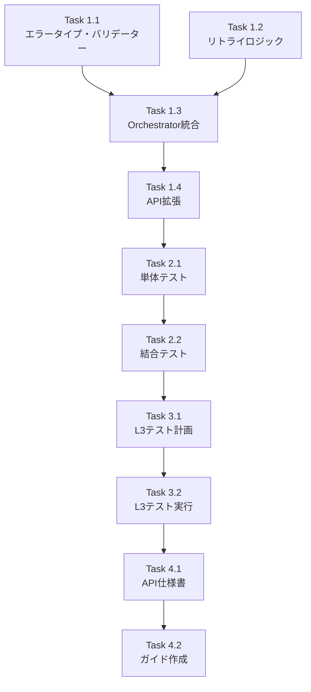

# Issue #353: Job Generator V2 WORKFLOW_GEN フェーズ未完了時のエラーハンドリング改善 作業計画

## 1. Issue概要

**Issue番号**: #353
**タイトル**: Job Generator V2: WORKFLOW_GEN フェーズ未完了時に __PENDING__ プレースホルダーが残存しジョブ実行失敗
**サイズ**: L
**作業見積**: 16時間
**優先度**: High
**依存Issue**: なし

## 2. 詳細タスク分解

### Phase 1: 実装タスク（10時間）

#### Task 1.1: エラータイプとバリデーター実装（3時間）
- [ ] `ErrorType.INCOMPLETE_WORKFLOW` をprotocols.pyに追加
- [ ] `PendingWorkflowValidator` クラス実装
- [ ] `PendingWorkflowValidationResult` データクラス定義
- [ ] `WorkflowGenRetryConfig` データクラス定義
- [ ] `ErrorNotification` データクラス定義

#### Task 1.2: リトライロジック強化（3時間）
- [ ] Exponential backoff 実装（calculate_retry_delay関数）
- [ ] タイムアウト処理実装（execute_with_timeout関数）
- [ ] WORKFLOW_GEN専用リトライ設定の統合

#### Task 1.3: Orchestrator統合（2時間）
- [ ] `_can_proceed_to_finalization` メソッド追加
- [ ] ValidationPipelineへのPendingWorkflowValidator統合
- [ ] ErrorRecoveryManagerの拡張

#### Task 1.4: API レスポンス拡張（2時間）
- [ ] expertAgent `/api/v1/jobs/{job_id}/status` エンドポイント改修
- [ ] notification フィールド追加
- [ ] pending_workflows フィールド追加

### Phase 2: テストタスク（3時間）

#### Task 2.1: 単体テスト（2時間）
- [ ] test_pending_workflow_validator.py 作成
- [ ] test_workflow_gen_retry.py 作成
- [ ] test_error_notification.py 作成

#### Task 2.2: 結合テスト（1時間）
- [ ] test_orchestrator_finalization_guard.py 作成
- [ ] test_job_status_api_notification.py 作成

### Phase 3: L3受入テスト（2時間）

#### Task 3.1: L3受入テスト計画（0.5時間）
- [ ] test_issue_353_acceptance.py 作成
- [ ] 正常系・異常系のテストケース定義

#### Task 3.2: L3受入テスト実行（1.5時間）
- [ ] ローカル環境でのサービス起動
- [ ] テストシナリオ実行
- [ ] 結果検証

### Phase 4: ドキュメントタスク（1時間）

#### Task 4.1: API仕様書更新（0.5時間）
- [ ] expertAgent/docs/API_REFERENCE.md 更新

#### Task 4.2: エラーハンドリングガイド作成（0.5時間）
- [ ] docs/guide/error-handling.md 作成

## 3. タスク依存関係



## 4. 作業スケジュール（2日間想定）

### Day 1（8時間）
- **AM**: Task 1.1, 1.2（エラータイプ定義、リトライロジック）
- **PM**: Task 1.3, 1.4（Orchestrator統合、API拡張）

### Day 2（8時間）
- **AM**: Task 2.1, 2.2（単体テスト、結合テスト）
- **PM**: Task 3.1, 3.2, 4.1, 4.2（L3受入テスト、ドキュメント）

## 5. チェックポイント

| タイミング | 確認事項 | 対応 |
|-----------|---------|------|
| Task 1.1完了時 | Enumへの追加が既存コードに影響ないか | 既存テスト実行 |
| Task 1.3完了時 | フェーズ遷移が正常に動作するか | 手動テスト実施 |
| Phase 2完了時 | カバレッジ90%以上達成しているか | カバレッジレポート確認 |
| Phase 3完了時 | 全受入条件を満たしているか | チェックリスト確認 |

## 6. リスクと対策

| リスク | 発生確率 | 影響 | 対策 |
|-------|---------|------|------|
| 既存ジョブへの影響 | 低 | 高 | Feature Flag導入で段階的ロールアウト |
| GraphAiServerのAPI変更 | 低 | 中 | APIバージョン確認、後方互換性維持 |
| パフォーマンス劣化 | 低 | 中 | ベンチマークテスト実施 |
| エラーメッセージの誤解 | 中 | 低 | UXレビュー実施、メッセージ改善 |

## 7. 成果物チェックリスト

### コード
- [ ] expertAgent/aiagent/langgraph/jobGeneratorV2/protocols.py
- [ ] expertAgent/aiagent/langgraph/jobGeneratorV2/validators/pending_workflow.py
- [ ] expertAgent/aiagent/langgraph/jobGeneratorV2/retry/workflow_gen_retry.py
- [ ] expertAgent/aiagent/langgraph/jobGeneratorV2/orchestrator.py
- [ ] expertAgent/app/api/v1/job_generator.py

### テスト
- [ ] expertAgent/tests/unit/test_pending_workflow_validator.py
- [ ] expertAgent/tests/unit/test_workflow_gen_retry.py
- [ ] expertAgent/tests/unit/test_error_notification.py
- [ ] expertAgent/tests/integration/test_orchestrator_finalization_guard.py
- [ ] expertAgent/tests/integration/test_job_status_api_notification.py
- [ ] expertAgent/tests/acceptance/test_issue_353_acceptance.py

### ドキュメント
- [ ] expertAgent/docs/API_REFERENCE.md（更新）
- [ ] docs/guide/error-handling.md（新規）

## 8. L3受入テスト計画【必須セクション】

### 8.1 環境準備

```bash
# 全サービス起動（Platform=Docker, Agent=ローカル）
./scripts/dev-hybrid.sh

# サービス起動確認
curl -sf http://localhost:8001/health && echo "✅ JobQueue healthy"
curl -sf http://localhost:8005/health && echo "✅ GraphAiServer healthy"
curl -sf http://localhost:8004/health && echo "✅ ExpertAgent healthy"
```

### 8.2 正常系テスト

```bash
# Test Case 1: 正常なジョブ生成（__PENDING__が正しく更新される）
curl -s -X POST http://localhost:8004/api/v1/job-generator \
  -H "Content-Type: application/json" \
  -d '{
    "user_requirement": "CSVファイルを読み込んでExcelに出力する"
  }' | jq .

# ジョブIDを取得して状態確認
JOB_ID=$(curl -s ... | jq -r '.job_id')
curl -s http://localhost:8004/api/v1/jobs/$JOB_ID/status | jq .

# TaskMasterのworkflow_nameが__PENDING__でないことを確認
curl -s http://localhost:8001/api/v1/job-masters/$JOB_MASTER_ID | jq '.tasks[].body_template.workflow_name'
```

### 8.3 異常系テスト

```bash
# Test Case 2: GraphAiServerダウン時のエラーハンドリング
# GraphAiServerを停止
docker stop graphaiserver

# ジョブ生成実行
curl -s -X POST http://localhost:8004/api/v1/job-generator \
  -H "Content-Type: application/json" \
  -d '{
    "user_requirement": "PDFを生成する"
  }' | jq .

# エラー通知が含まれることを確認
curl -s http://localhost:8004/api/v1/jobs/$JOB_ID/status | jq '.notification'

# pending_workflowsフィールドの確認
curl -s http://localhost:8004/api/v1/jobs/$JOB_ID/status | jq '.pending_workflows'
```

### 8.4 リトライ動作確認

```bash
# Test Case 3: リトライ動作とexponential backoff
# Langfuseでトレース確認（タイムスタンプでリトライ間隔を検証）
curl -s http://localhost:8004/api/v1/jobs/$JOB_ID/status | jq '.langfuse_trace_id'

# Langfuseダッシュボードでリトライ間隔確認
# http://localhost:3001/trace/{trace_id}
```

### 8.5 __PENDING__検出テスト

```bash
# Test Case 4: 手動で__PENDING__を残した状態での検証
# TaskMasterを直接更新（テストデータ作成）
curl -X PATCH http://localhost:8001/api/v1/task-masters/$TASK_MASTER_ID \
  -H "Content-Type: application/json" \
  -d '{
    "body_template": {
      "workflow_name": "__PENDING__",
      "inputs": "{{job.body}}",
      "project": "{{job.project}}"
    }
  }'

# ジョブ実行でエラーになることを確認
curl -s -X POST http://localhost:8005/api/v2/runs \
  -H "Content-Type: application/json" \
  -d '{
    "job_master_id": "'$JOB_MASTER_ID'",
    "inputs": {"test": "data"}
  }' | jq .
```

## 9. Definition of Done

- [x] すべてのタスクが完了
- [x] 単体テストカバレッジ90%以上
- [x] L3受入テスト全パス
- [x] CI/CDグリーン
- [x] コードレビュー承認
- [x] エラー通知がmyAgentDesk UIで表示される
- [x] `__PENDING__`が残った状態でFINALIZATIONに進まない
- [x] リトライ動作がexponential backoffで実行される

## 10. 実装時の注意事項

1. **後方互換性**: 既存のErrorTypeに追加する際、既存コードへの影響を最小限に
2. **Feature Flag考慮**: 本番環境では段階的ロールアウトを検討
3. **ログ出力**: エラー発生時の詳細ログを確実に出力
4. **Langfuse統合**: エラー通知時にtrace_idを必ず含める

---

**次のアクション**:
1. 本作業計画のレビュー
2. 実装開始（Task 1.1から順次）
3. 日次進捗報告