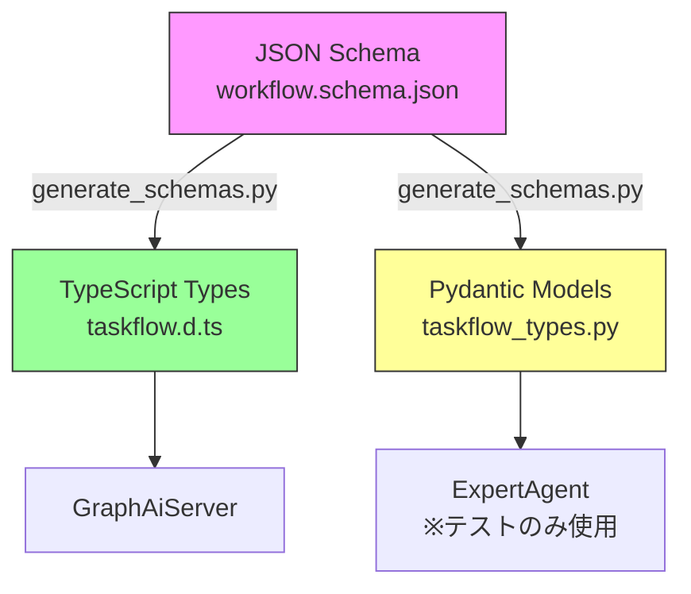

# datamodel-code-generator 依存関係管理 設計方針書

**作成日**: 2026-01-13
**関連Issue**: #357 (JSON Schema Single Source of Truth)
**作成者**: Claude Opus 4.5

---

## 1. 概要

### 1.1 課題

`scripts/generate_schemas.py`スクリプトはJSON SchemaからPydanticモデルを生成するため`datamodel-code-generator`パッケージを必要としますが、プロジェクトの依存関係として宣言されていません。

### 1.2 影響

- CI/CDでのスキーマ生成失敗
- 新規開発者のセットアップ困難
- スキーマ再生成の信頼性低下

---

## 2. 現状調査結果

### 2.1 既存アーキテクチャ



### 2.2 依存関係管理パターン

| パターン | 使用場所 | 管理ツール | 特徴 |
|---------|---------|-----------|------|
| project.dependencies | 各サービス | UV | 実行時必須 |
| project.optional-dependencies | 各サービス | UV | 開発ツール |
| dependency-groups | 一部サービス | UV | 新形式 |
| npx | スクリプト内 | npm | 一時実行 |

### 2.3 スクリプトの位置づけ

- **場所**: `/scripts/generate_schemas.py`（ルートレベル）
- **用途**: 開発時のスキーマ再生成（Single Source of Truth）
- **頻度**: JSON Schema変更時のみ（低頻度）
- **利用者**: 開発者、CI/CD（将来）

---

## 3. 設計方針

### 3.1 依存関係宣言方式

**選定案: オプション依存関係としてルートpyproject.tomlに追加**

```toml
# /pyproject.toml
[project.optional-dependencies]
schema-gen = [
    "datamodel-code-generator>=0.25.0",
    "jsonschema>=4.0.0",  # スキーマ検証用
]
```

### 3.2 選定理由

| 評価項目 | 理由 |
|---------|------|
| **整合性** | 既存のdev依存関係パターンと一致 |
| **アクセス性** | ルートからの`uv sync --extra schema-gen`で利用可能 |
| **明確性** | スキーマ生成専用の依存グループとして明確 |
| **CI/CD統合** | GitHub Actionsで簡単に追加インストール可能 |

### 3.3 代替案の比較

| 方式 | メリット | デメリット | 採用 |
|------|---------|-----------|------|
| ルートoptional-dependencies | 標準的、CI統合容易 | ルート肥大化 | ✅ |
| scripts/requirements.txt | 独立性高い | 非標準、管理分散 | ❌ |
| expertAgent内optional-dependencies | 自然な配置 | TypeScript生成と不整合 | ❌ |

---

## 4. 実装設計

### 4.1 依存関係の追加

```toml
# /pyproject.toml への追加
[project.optional-dependencies]
# 既存のdev依存は維持
dev = [
    "ruff",
    "mypy",
    # ...
]

# 新規追加
schema-gen = [
    "datamodel-code-generator>=0.25.0",
    "jsonschema>=4.0.0",
]
```

### 4.2 インストール方法

```bash
# 開発者向け（ローカル）
uv sync --extra schema-gen

# CI向け（将来の拡張）
uv sync --extra dev --extra schema-gen
```

### 4.3 ドキュメント更新

```markdown
# README.md への追記
## Schema Generation

JSON Schemaからコード生成を行う場合:
```bash
uv sync --extra schema-gen
python scripts/generate_schemas.py
```
```

---

## 5. CI/CD統合設計（将来拡張）

### 5.1 GitHub Actions ワークフロー拡張

```yaml
# .github/workflows/contract-tests.yml への追加
on:
  pull_request:
    paths:
      # 既存のパス
      - 'expertAgent/aiagent/langgraph/jobGeneratorV2/**'
      # 追加
      - 'shared/schemas/taskflow/v1/*.json'
      - 'scripts/generate_schemas.py'

jobs:
  schema-generation:
    name: Verify Schema Generation
    runs-on: ubuntu-latest
    steps:
      - uses: actions/checkout@v4
      - uses: actions/setup-python@v4
        with:
          python-version: '3.12'
      - uses: astral-sh/setup-uv@v3

      - name: Install dependencies
        run: uv sync --extra schema-gen

      - name: Generate schemas
        run: python scripts/generate_schemas.py

      - name: Check for uncommitted changes
        run: |
          git diff --exit-code || (
            echo "Error: Generated schemas are not up to date"
            echo "Run 'python scripts/generate_schemas.py' and commit changes"
            exit 1
          )
```

### 5.2 Make タスクの追加

```makefile
# Makefile への追加
.PHONY: generate-schemas
generate-schemas: ## Generate TypeScript and Python schemas from JSON Schema
	@echo "Generating schemas from JSON Schema..."
	@uv sync --extra schema-gen
	@python scripts/generate_schemas.py

.PHONY: check-schemas
check-schemas: generate-schemas ## Check if generated schemas are up to date
	@git diff --exit-code --quiet || (echo "Schemas out of date!" && exit 1)
```

---

## 6. 設計上の決定事項とトレードオフ

### 6.1 採用した設計の理由

| 決定事項 | 理由 | トレードオフ |
|---------|------|------------|
| オプション依存関係 | 全開発者が必要としない | 明示的インストールが必要 |
| ルートレベル配置 | スクリプトがルートにある | プロジェクトルート肥大化 |
| UV統合 | 既存ツールチェーンと一致 | UV非対応環境で困難 |

### 6.2 代替案との比較

**採用案の優位性**:
1. **標準的**: Python packagingのベストプラクティスに準拠
2. **統一的**: UV/uv.lockで他の依存関係と統一管理
3. **拡張可能**: 将来的にpre-commitやCI統合が容易

### 6.3 想定されるリスクと対策

| リスク | 可能性 | 影響 | 対策 |
|--------|-------|------|------|
| バージョン競合 | 低 | 中 | 定期的な依存関係更新 |
| CI実行時間増加 | 中 | 低 | キャッシュ活用 |
| 手動実行忘れ | 高 | 中 | CI自動チェック実装 |

---

## 7. セキュリティ考慮事項

### 7.1 依存関係のセキュリティ

- `datamodel-code-generator`: 信頼できるOSSプロジェクト
- 定期的な脆弱性スキャン実施（dependabot）
- 最小権限の原則: スキーマ生成のみに使用

### 7.2 生成コードの安全性

- 入力: 管理されたJSON Schema（バージョン管理下）
- 出力: 型定義のみ（実行コードなし）
- リスクレベル: 低

---

## 8. 実装手順

### 8.1 即座の対応（Phase 1）

1. `/pyproject.toml`に`schema-gen`オプション依存関係を追加
2. `README.md`にインストール手順を追記
3. 動作確認とテスト

### 8.2 将来の拡張（Phase 2）

1. GitHub Actions workflowにスキーマ生成チェックを追加
2. Makefileにタスクを追加
3. pre-commitフックの検討

---

## 9. 参照ドキュメント

- Issue #357: JSON Schema Single Source of Truth
- `/dev-reports/feature/issue/357/implementation-gaps.md`
- `/scripts/generate_schemas.py`
- `/shared/schemas/taskflow/v1/workflow.schema.json`

---

## 10. 承認

この設計方針は以下の原則に準拠しています：

- ✅ **KISS原則**: シンプルな依存関係宣言
- ✅ **YAGNI原則**: 必要最小限の変更
- ✅ **DRY原則**: 既存パターンの再利用
- ✅ **整合性**: 既存アーキテクチャとの一致