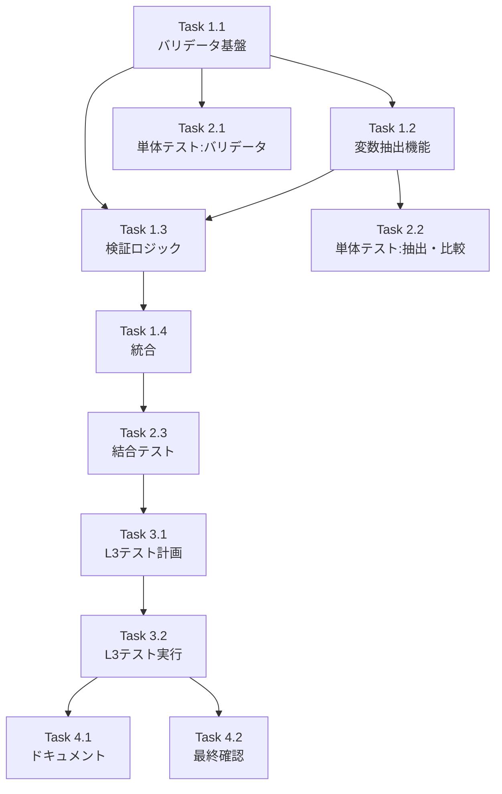

# Issue #358: body_template整合性バリデーション - 作業計画書

## Issue: feat(jobGeneratorV2): ジョブ生成時のbody_template整合性バリデーション追加
**Issue番号**: #358
**サイズ**: M（中規模）
**作業見積**: 16時間
**優先度**: High
**依存Issue**: #354, #355, #357（参照のみ、ブロッカーなし）

## 1. 実装概要

Job Generator V2のREGISTRATIONフェーズにおいて、TaskMasterの`body_template`に含まれるテンプレート変数の整合性を事前検証する機能を実装します。これにより、実行時エラーを防止し、明確なエラーメッセージを提供します。

## 2. 詳細タスク分解

### Phase 1: 実装タスク（8時間）

#### Task 1.1: バリデータ基盤の実装（3時間）
- [ ] `BodyTemplateValidator`クラスの実装
- [ ] `BodyTemplateValidationResult`データクラスの定義
- [ ] `ValidationError`、`ValidationWarning`、`RequiredField`データクラスの定義
- [ ] `ValidationStrategy`プロトコルの定義

#### Task 1.2: テンプレート変数抽出機能（2時間）
- [ ] `template_variable_extractor.py`の実装
- [ ] 正規表現パターン `r'\{\{([^}]+)\}\}'` による変数抽出
- [ ] 再帰的な辞書・リスト探索ロジック
- [ ] `TemplateVariable`データクラスの実装

#### Task 1.3: 検証ロジックの実装（2時間）
- [ ] `validate_job_body_references()`メソッドの実装
- [ ] `validate_task_references()`メソッドの実装
- [ ] `TaskFlowValidationStrategy`クラスの実装
- [ ] `GraphAIValidationStrategy`クラスの実装
- [ ] スキーマ比較ユーティリティ（`schema_comparator.py`）の実装

#### Task 1.4: REGISTRATIONフェーズへの統合（1時間）
- [ ] `MasterManagerSubWorkflow`へのバリデータ統合
- [ ] `create_masters()`メソッドの修正
- [ ] エラーハンドリングとログ出力の実装
- [ ] `_format_validation_errors()`メソッドの実装

### Phase 2: テストタスク（TDD - CI実行可能）（4時間）

#### Task 2.1: 単体テスト - バリデータ（2時間）
- [ ] `test_body_template_validator.py`の作成
- [ ] 正常系テストケース（GraphAI/TaskFlow両エンジン）
- [ ] 異常系テストケース（各種エラーパターン）
- [ ] エッジケーステスト（空テンプレート、深いネスト等）

#### Task 2.2: 単体テスト - 抽出・比較機能（1時間）
- [ ] `test_template_variable_extractor.py`の作成
- [ ] `test_schema_comparator.py`の作成
- [ ] 複雑なテンプレート構造のテスト

#### Task 2.3: 結合テスト（1時間）
- [ ] `test_registration_validation.py`の作成
- [ ] REGISTRATIONフェーズ全体の動作確認
- [ ] エラー時のワークフロー中断確認
- [ ] 既存ワークフローとの互換性確認

### Phase 3: L3ローカル受入テスト（2時間）【必須】

#### Task 3.1: L3受入テスト計画（0.5時間）
- [ ] 受入テストシナリオの作成
- [ ] テストデータの準備
- [ ] 期待結果の定義

#### Task 3.2: L3受入テスト実装・実行（1.5時間）
- [ ] `test_issue_358_acceptance.py`の作成
- [ ] 実APIを使用したE2Eテストの実装
- [ ] 各受入条件の検証

### Phase 4: ドキュメント・仕上げタスク（2時間）

#### Task 4.1: 技術ドキュメント更新（1時間）
- [ ] `expertAgent/docs/API_REFERENCE.md`への機能追記
- [ ] バリデーションエラーコード一覧の作成
- [ ] 統合ガイドの作成

#### Task 4.2: 最終確認・リファクタリング（1時間）
- [ ] コードレビュー指摘事項の修正
- [ ] パフォーマンス最適化
- [ ] 将来の拡張ポイントのコメント追加

## 3. タスク依存関係



## 4. 作業スケジュール

### Day 1（8時間）
- **午前（4時間）**: Task 1.1 + Task 1.2
- **午後（4時間）**: Task 1.3 + Task 1.4

### Day 2（8時間）
- **午前（4時間）**: Task 2.1 + Task 2.2 + Task 2.3
- **午後（4時間）**: Task 3.1 + Task 3.2 + Task 4.1 + Task 4.2

## 5. チェックポイント

| タイミング | 確認事項 | 対応 |
|-----------|---------|------|
| Task 1.2完了時 | 変数抽出が正しく動作するか | 単体テストで確認 |
| Task 1.4完了時 | 既存フローを壊していないか | 既存テストの実行 |
| Phase 2完了時 | カバレッジ90%以上達成 | カバレッジレポート確認 |
| Phase 3完了時 | 全受入条件を満たしているか | 受入テスト結果確認 |

## 6. リスクと対策

| リスク | 発生確率 | 影響 | 対策 |
|-------|---------|------|------|
| 既存ワークフローへの影響 | 低 | 高 | 包括的な結合テスト実施 |
| パフォーマンス劣化 | 中 | 中 | キャッシング実装、プロファイリング |
| 過度に厳格な検証 | 中 | 中 | 警告レベルの導入、段階的適用 |
| スキーマ比較の複雑性 | 高 | 低 | シンプルな実装から開始 |

## 7. 成果物チェックリスト

### コード
- [ ] `validators/body_template_validator.py`
- [ ] `validators/template_variable_extractor.py`
- [ ] `validators/schema_comparator.py`
- [ ] `workflows/registration/master_manager.py`（修正）

### テスト
- [ ] `tests/unit/validators/test_body_template_validator.py`
- [ ] `tests/unit/validators/test_template_variable_extractor.py`
- [ ] `tests/unit/validators/test_schema_comparator.py`
- [ ] `tests/integration/test_registration_validation.py`
- [ ] `tests/acceptance/test_issue_358_acceptance.py`

### ドキュメント
- [ ] API Reference更新
- [ ] エラーコード一覧
- [ ] 統合ガイド

## 8. L3受入テスト計画【必須セクション】

### テスト環境準備

```bash
# サービス起動確認
curl -sf http://localhost:8104/health && echo "✅ ExpertAgent healthy"
curl -sf http://localhost:8001/health && echo "✅ JobQueue healthy"
```

### 受入テストシナリオ

#### 1. 正常系：有効なbody_templateでのジョブ生成

```bash
# 正常なジョブ生成リクエスト
curl -s -X POST http://localhost:8104/aiagent-api/v1/job/generate \
  -H "Content-Type: application/json" \
  -d '{
    "requirement": "ファイルの内容を読み取ってサマリーを生成",
    "engine": "taskflow",
    "project_id": "test-project"
  }' | jq -r '.job_id'
```

期待結果：ジョブが正常に生成され、job_idが返却される

#### 2. 異常系：無効なtask参照でのエラー

```bash
# 意図的に不正なbody_templateを生成させるリクエスト
curl -s -X POST http://localhost:8104/aiagent-api/v1/job/generate \
  -H "Content-Type: application/json" \
  -d '{
    "requirement": "存在しないタスクの結果を参照してレポート作成",
    "force_invalid_reference": true,
    "engine": "taskflow"
  }'
```

期待結果：明確なエラーメッセージ（"Invalid task reference"を含む）

#### 3. 警告系：スキーマ不一致の検出

```bash
# スキーマ不一致を含むワークフロー生成
curl -s -X POST http://localhost:8104/aiagent-api/v1/job/generate \
  -H "Content-Type: application/json" \
  -d '{
    "requirement": "異なる形式のデータを連鎖させる処理",
    "test_schema_mismatch": true,
    "engine": "taskflow"
  }'
```

期待結果：ジョブは生成されるが、警告ログが出力される

#### 4. 必須パラメータ抽出の確認

```bash
# 生成されたジョブの必須パラメータ情報を確認
JOB_ID=$(curl -s -X POST ... | jq -r '.job_id')
curl -s http://localhost:8001/jobs/${JOB_ID} | jq '.required_body_fields'
```

期待結果：必須フィールドのリストが返却される

### 受入判定基準

- [ ] 全ての正常系テストがパスする
- [ ] エラー時に具体的なエラーメッセージが表示される
- [ ] 既存のジョブ生成機能に影響がない
- [ ] パフォーマンス劣化が5%以内

## 9. Definition of Done

Issue完了条件：
- [x] すべての実装タスクが完了
- [x] 単体テストカバレッジ90%以上達成
- [x] 結合テストが全てパス
- [x] L3受入テスト全項目がパス
- [x] CI/CDパイプラインがグリーン
- [x] コードレビューで承認取得
- [x] ドキュメント更新完了
- [x] パフォーマンステストで劣化5%以内確認

## 10. 実装開始前チェックリスト

- [ ] 設計方針書のレビュー完了
- [ ] 依存Issueの進捗確認
- [ ] 開発環境の準備完了
- [ ] テストデータの準備完了
- [ ] ブランチ作成（`feature/issue-358-body-template-validation`）

---

**注記**: 本作業計画は設計方針書およびアーキテクチャレビューの内容に基づいて作成されています。実装中に新たな課題が発見された場合は、適宜計画を更新してください。