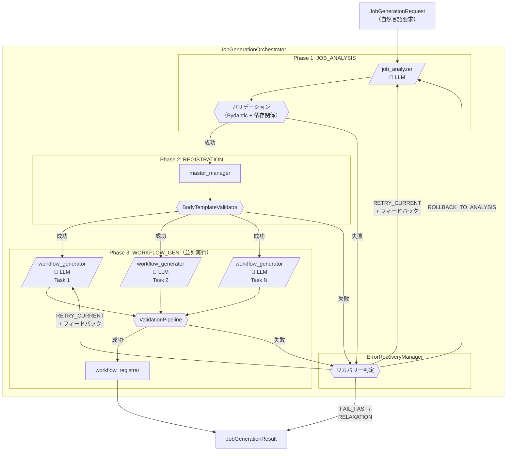
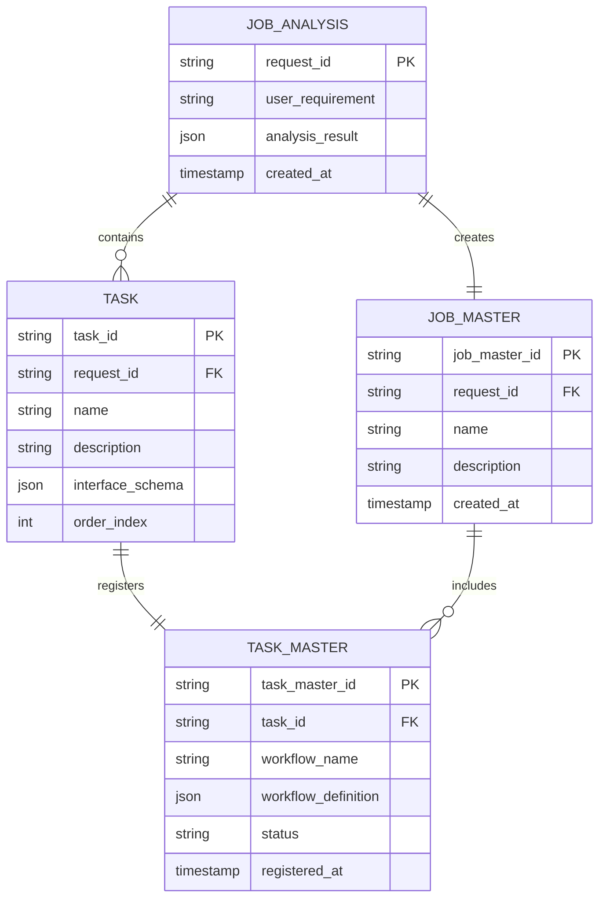
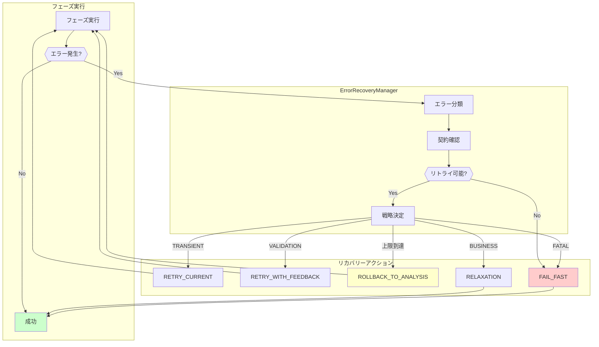

# 設計方針書: jobGeneratorV2 3フェーズ統一ID方式リファクタリング

## 1. 概要

### 1.1 背景

現在のjobGeneratorV2は4フェーズ構成で複雑化しており、各フェーズで異なるデータ形式（リスト、辞書、インデックス）を使用することで、バグの温床となっている。Issue #342で追加されたパッチクラス（TaskIdMapping、SkipAggregator）は一時的な解決策であり、904行に及ぶオーケストレーターは保守性が低下している。

### 1.2 目的

jobGeneratorV2を段階的にリファクタリングし、以下を実現する：
- フェーズ数を4から3に削減
- 統一ID（task_id）によるデータ管理
- LLM呼び出し回数の大幅削減（17-18回→6回）
- コード量の削減（904行→約300行）
- 保守性と拡張性の向上

### 1.3 設計原則

1. **統一ID原則**: task_idを全フェーズで一貫使用
2. **インデックス排除原則**: すべてのルックアップをtask_idベースに
3. **明示的エラー原則**: サイレントフォールバックなし
4. **並列化原則**: Phase 3のタスク処理を並列実行
5. **SOLID原則準拠**: 単一責任、開放/閉鎖、リスコフ置換、インターフェース分離、依存性逆転

## 2. アーキテクチャ設計

### 2.1 システム構成図



### 2.2 レイヤー構成

| レイヤー | 責任範囲 | 主要コンポーネント |
|---------|---------|------------------|
| **プレゼンテーション層** | API入出力 | JobGeneratorV2Adapter |
| **オーケストレーション層** | フェーズ制御 | JobGenerationOrchestrator |
| **ビジネスロジック層** | 各フェーズ実装 | job_analyzer, master_manager, workflow_generator |
| **データアクセス層** | DB操作 | JobQueue API, PostgreSQL |
| **インフラ層** | 外部連携 | myVault, Langfuse, LLM API |

### 2.3 フェーズ詳細

#### Phase 1: JOB_ANALYSIS
- **目的**: タスク分解とインターフェース設計を1回のLLM呼び出しで実行
- **入力**: user_requirement, capabilities, max_tasks
- **出力**: JobAnalysisResponse（tasks[], interfaces{}, job_body_parameters）
- **LLMモデル**: gemini-3-flash-preview（デフォルト）

#### Phase 2: REGISTRATION
- **目的**: データベース登録（LLM不要）
- **入力**: JobAnalysisResponse
- **出力**: task_id → task_master_id の辞書形式マッピング
- **特徴**: インデックスは使用しない

#### Phase 3: WORKFLOW_GEN
- **目的**: 各タスクのTaskFlow JSONを生成
- **入力**: task_id, task_master_id, interface, context
- **出力**: TaskFlowWorkflow（workflow_name, steps[], output）
- **特徴**: 各タスクの処理は完全に独立、並列実行可能

## 3. 技術選定

### 3.1 技術スタック

| カテゴリ | 選定技術 | 選定理由 | 既存との整合性 |
|---------|---------|---------|---------------|
| **言語/フレームワーク** | Python 3.11+ / FastAPI | 既存コードベースとの整合性、型ヒント対応 | ✅ 完全互換 |
| **ワークフローエンジン** | LangGraph | グラフベース制御フロー、エラーリカバリ機能 | ✅ 既存使用 |
| **データベース** | PostgreSQL | TaskMaster/JobMaster永続化 | ✅ 既存使用 |
| **キャッシュ** | Valkey (Redis互換) | セッション管理、一時データ | ✅ Platform層で稼働中 |
| **LLMプロバイダ** | Google Gemini | コスト効率、構造化出力対応 | ✅ myVault経由で設定可 |
| **観測可能性** | Langfuse | LLMトレース、コスト分析 | ✅ 既存統合済み |
| **バリデーション** | Pydantic v2 | 型安全性、JSONスキーマ生成 | ✅ 既存使用 |

### 3.2 モデル設定方針

| 設定項目 | 値 | 管理方法 |
|----------|---|---------|
| **デフォルトモデル** | gemini-3-flash-preview | ハードコード |
| **job_analyzer用** | myVault: `JOB_GENERATOR_ANALYSIS_MODEL` | 動的取得 |
| **workflow_generator用** | myVault: `WORKFLOW_GENERATOR_MODEL` | 動的取得 |
| **温度設定** | 0.7 | 設定ファイル |
| **最大トークン** | 4096 | 設定ファイル |

## 4. 設計パターン

### 4.1 統一IDパターン

```python
@dataclass
class UnifiedTaskIdentifier:
    """タスク識別子の統一管理"""
    task_id: str  # 例: "task_001"
    task_master_id: Optional[str] = None  # 例: "tm_xxx"

    def __hash__(self):
        return hash(self.task_id)

    def __eq__(self, other):
        return self.task_id == other.task_id
```

### 4.2 並列実行パターン（例外処理強化版）

```python
@dataclass
class TaskResult:
    """個別タスクの実行結果"""
    task_id: str
    success: bool
    workflow: Optional[TaskFlowWorkflow] = None
    error: Optional[TaskExecutionError] = None
    retry_count: int = 0
    execution_time_ms: float = 0.0

@dataclass
class ParallelExecutionResult:
    """並列実行の集約結果"""
    successful_tasks: List[TaskResult]
    failed_tasks: List[TaskResult]
    total_execution_time_ms: float

    @property
    def all_succeeded(self) -> bool:
        return len(self.failed_tasks) == 0

    @property
    def partial_success(self) -> bool:
        return len(self.successful_tasks) > 0 and len(self.failed_tasks) > 0

    @property
    def all_failed(self) -> bool:
        return len(self.successful_tasks) == 0 and len(self.failed_tasks) > 0

    def get_error_summary(self) -> str:
        """失敗タスクのエラーサマリを生成"""
        if not self.failed_tasks:
            return ""
        errors = [f"- {t.task_id}: {t.error.message}" for t in self.failed_tasks]
        return f"Failed tasks ({len(self.failed_tasks)}):\n" + "\n".join(errors)

async def parallel_workflow_generation(
    tasks: List[UnifiedTaskIdentifier],
    max_concurrent: int = 5,
    timeout_per_task: float = 60.0
) -> ParallelExecutionResult:
    """Phase 3の並列実行（例外処理強化版）

    Args:
        tasks: 処理対象のタスク識別子リスト
        max_concurrent: 最大同時実行数（デフォルト: 5）
        timeout_per_task: タスクあたりのタイムアウト秒数（デフォルト: 60秒）

    Returns:
        ParallelExecutionResult: 成功/失敗タスクを分類した集約結果

    Note:
        - 個別タスクの失敗は他のタスクに影響しない
        - タイムアウトはタスク単位で適用
        - すべての結果（成功/失敗）が集約されて返却される
    """
    start_time = time.monotonic()
    semaphore = asyncio.Semaphore(max_concurrent)

    async def execute_with_timeout(task: UnifiedTaskIdentifier) -> TaskResult:
        async with semaphore:
            task_start = time.monotonic()
            try:
                workflow = await asyncio.wait_for(
                    generate_workflow_for_task(task),
                    timeout=timeout_per_task
                )
                return TaskResult(
                    task_id=task.task_id,
                    success=True,
                    workflow=workflow,
                    execution_time_ms=(time.monotonic() - task_start) * 1000
                )
            except asyncio.TimeoutError:
                return TaskResult(
                    task_id=task.task_id,
                    success=False,
                    error=TaskExecutionError(
                        error_type=ErrorType.TRANSIENT,
                        message=f"Task execution timed out after {timeout_per_task}s",
                        recoverable=True
                    ),
                    execution_time_ms=(time.monotonic() - task_start) * 1000
                )
            except ValidationError as e:
                return TaskResult(
                    task_id=task.task_id,
                    success=False,
                    error=TaskExecutionError(
                        error_type=ErrorType.VALIDATION,
                        message=str(e),
                        recoverable=True,
                        details=e.errors()
                    ),
                    execution_time_ms=(time.monotonic() - task_start) * 1000
                )
            except LLMError as e:
                return TaskResult(
                    task_id=task.task_id,
                    success=False,
                    error=TaskExecutionError(
                        error_type=ErrorType.API,
                        message=str(e),
                        recoverable=e.is_retryable
                    ),
                    execution_time_ms=(time.monotonic() - task_start) * 1000
                )
            except Exception as e:
                logger.exception(f"Unexpected error for task {task.task_id}")
                return TaskResult(
                    task_id=task.task_id,
                    success=False,
                    error=TaskExecutionError(
                        error_type=ErrorType.FATAL,
                        message=f"Unexpected error: {str(e)}",
                        recoverable=False
                    ),
                    execution_time_ms=(time.monotonic() - task_start) * 1000
                )

    # 全タスクを並列実行（例外は個別にキャッチ済み）
    results = await asyncio.gather(
        *[execute_with_timeout(task) for task in tasks]
    )

    # 成功/失敗を分類
    successful = [r for r in results if r.success]
    failed = [r for r in results if not r.success]

    total_time = (time.monotonic() - start_time) * 1000

    return ParallelExecutionResult(
        successful_tasks=successful,
        failed_tasks=failed,
        total_execution_time_ms=total_time
    )
```

### 4.3 バリデーションパイプライン

```python
class ValidationPipeline:
    """チェーンパターンによるバリデーション"""
    def __init__(self):
        self.validators = [
            StructuralValidator(),    # 構造検証
            SchemaValidator(),        # JSONスキーマ検証
            DependencyValidator(),    # 依存関係検証
            SemanticValidator()       # 意味的検証
        ]

    def validate(self, data: Any) -> ValidationResult:
        for validator in self.validators:
            result = validator.validate(data)
            if not result.is_valid:
                return result
        return ValidationResult(is_valid=True)
```

## 5. データモデル設計

### 5.1 ER図



### 5.2 データフロー

```
JobGenerationRequest
    ↓
JobAnalysisResponse {
    tasks: [{
        task_id: "task_001",
        name: "Send Email",
        interface: { input: {...}, output: {...} }
    }],
    job_body_parameters: {...}
}
    ↓
RegistrationOutput {
    task_id_to_master_id: {
        "task_001": "tm_xxx",
        "task_002": "tm_yyy"
    },
    job_master_id: "jm_zzz"
}
    ↓
WorkflowGenPhaseOutput {
    task_workflows: {
        "task_001": { workflow_name: "send_email", ... },
        "task_002": { workflow_name: "notify_slack", ... }
    }
}
```

## 6. API設計

### 6.1 エンドポイント設計

既存のAPIエンドポイントは維持し、内部実装のみをリファクタリングする：

| エンドポイント | メソッド | 説明 |
|--------------|---------|------|
| `/api/v1/job-generator` | POST | ジョブ生成（非同期） |
| `/api/v1/jobs/{job_id}/status` | GET | ステータス確認 |
| `/api/v1/workflow-generator` | POST | ワークフロー生成 |

### 6.2 リクエスト/レスポンス形式

既存のインターフェースを維持：

```json
// Request
{
  "user_requirement": "PDFファイルをGoogle Driveにアップロードして完了通知",
  "max_retry": 5
}

// Response
{
  "status": "success",
  "job_id": "550e8400-e29b-41d4-a716-446655440000",
  "job_master_id": "jm_01K89W9DBHAPWMMZVHWT2N7GX9",
  "task_breakdown": [...],
  "evaluation_result": {...}
}
```

## 7. セキュリティ設計

### 7.1 認証/認可

- 既存のmyVault統合を維持
- Service Token方式による認証
- APIキーの暗号化保存

### 7.2 データ保護

- LLMへの入力データサニタイゼーション
- 機密情報のマスキング
- 監査ログの記録

### 7.3 脆弱性対策

- インジェクション攻撃の防止
- レート制限の実装
- タイムアウト設定の適用

## 8. エラーハンドリング設計

### 8.1 エラータイプ定義

各フェーズで発生しうるエラーを明確に分類し、リカバリー戦略を定義する。

```python
from enum import Enum
from dataclasses import dataclass
from typing import Optional, Dict, Any

class ErrorType(Enum):
    """エラー種別の定義"""
    TRANSIENT = "transient"       # 一時的エラー（リトライ可能）
    VALIDATION = "validation"     # バリデーションエラー（修正後リトライ）
    API = "api"                   # 外部API呼び出しエラー
    BUSINESS = "business"         # ビジネスロジックエラー（要求緩和が必要）
    FATAL = "fatal"               # 致命的エラー（即時停止）

class RecoveryStrategy(Enum):
    """リカバリー戦略の定義"""
    RETRY_CURRENT = "retry_current"           # 現在のフェーズをリトライ
    RETRY_WITH_FEEDBACK = "retry_with_feedback"  # フィードバック付きリトライ
    ROLLBACK_TO_ANALYSIS = "rollback_to_analysis"  # Phase 1からやり直し
    RELAXATION = "relaxation"                 # 要求緩和を提案
    FAIL_FAST = "fail_fast"                   # 即座に失敗終了

@dataclass
class PhaseError:
    """フェーズエラーの詳細情報"""
    phase: str
    error_type: ErrorType
    message: str
    details: Optional[Dict[str, Any]] = None
    recoverable: bool = True
    suggested_strategy: Optional[RecoveryStrategy] = None
    retry_count: int = 0
    max_retries: int = 3
```

### 8.2 フェーズ別エラーハンドリング契約

各フェーズで発生するエラーとその対処方法を明示的に定義する。

#### Phase 1: JOB_ANALYSIS エラー契約

| エラー種別 | 発生条件 | リカバリー戦略 | 最大リトライ |
|-----------|---------|---------------|-------------|
| `VALIDATION` | Pydanticスキーマ不適合 | `RETRY_WITH_FEEDBACK` | 3回 |
| `VALIDATION` | 循環参照検出 | `RETRY_WITH_FEEDBACK` | 3回 |
| `VALIDATION` | タスク数超過 | `RELAXATION` | 0回 |
| `API` | LLM API呼び出し失敗 | `RETRY_CURRENT` | 3回 |
| `API` | LLM APIレート制限 | `RETRY_CURRENT` (exponential backoff) | 5回 |
| `BUSINESS` | 実現不可能なタスク | `RELAXATION` | 0回 |
| `FATAL` | 認証エラー | `FAIL_FAST` | 0回 |

```python
@dataclass
class JobAnalysisErrorContract:
    """Phase 1のエラー契約"""

    @staticmethod
    def get_recovery_strategy(error: PhaseError) -> RecoveryStrategy:
        """エラータイプに基づくリカバリー戦略を決定"""
        strategy_map = {
            ErrorType.VALIDATION: RecoveryStrategy.RETRY_WITH_FEEDBACK,
            ErrorType.API: RecoveryStrategy.RETRY_CURRENT,
            ErrorType.BUSINESS: RecoveryStrategy.RELAXATION,
            ErrorType.FATAL: RecoveryStrategy.FAIL_FAST,
        }
        return strategy_map.get(error.error_type, RecoveryStrategy.FAIL_FAST)

    @staticmethod
    def get_max_retries(error: PhaseError) -> int:
        """エラータイプに基づく最大リトライ回数"""
        retry_map = {
            ErrorType.VALIDATION: 3,
            ErrorType.API: 3,
            ErrorType.BUSINESS: 0,
            ErrorType.FATAL: 0,
        }
        return retry_map.get(error.error_type, 0)

    @staticmethod
    def create_feedback(error: PhaseError) -> Optional[str]:
        """リトライ時のフィードバックメッセージを生成"""
        if error.error_type == ErrorType.VALIDATION:
            return f"""
前回の出力でバリデーションエラーが発生しました。
エラー内容: {error.message}
詳細: {error.details}

以下の点を修正して再生成してください:
- JSON構造が正しいことを確認
- 必須フィールドがすべて含まれていることを確認
- タスク間の依存関係に循環がないことを確認
"""
        return None
```

#### Phase 2: REGISTRATION エラー契約

| エラー種別 | 発生条件 | リカバリー戦略 | 最大リトライ |
|-----------|---------|---------------|-------------|
| `VALIDATION` | BodyTemplate不整合 | `ROLLBACK_TO_ANALYSIS` | 0回 |
| `VALIDATION` | インターフェース不整合 | `ROLLBACK_TO_ANALYSIS` | 0回 |
| `API` | JobQueue API呼び出し失敗 | `RETRY_CURRENT` | 3回 |
| `TRANSIENT` | DB接続タイムアウト | `RETRY_CURRENT` | 3回 |
| `FATAL` | データ整合性エラー | `FAIL_FAST` | 0回 |

```python
@dataclass
class RegistrationErrorContract:
    """Phase 2のエラー契約"""

    @staticmethod
    def get_recovery_strategy(error: PhaseError) -> RecoveryStrategy:
        strategy_map = {
            ErrorType.VALIDATION: RecoveryStrategy.ROLLBACK_TO_ANALYSIS,
            ErrorType.API: RecoveryStrategy.RETRY_CURRENT,
            ErrorType.TRANSIENT: RecoveryStrategy.RETRY_CURRENT,
            ErrorType.FATAL: RecoveryStrategy.FAIL_FAST,
        }
        return strategy_map.get(error.error_type, RecoveryStrategy.FAIL_FAST)

    @staticmethod
    def should_rollback(error: PhaseError) -> bool:
        """Phase 1へのロールバックが必要かを判定"""
        return error.error_type == ErrorType.VALIDATION
```

#### Phase 3: WORKFLOW_GEN エラー契約

| エラー種別 | 発生条件 | リカバリー戦略 | 最大リトライ | 影響範囲 |
|-----------|---------|---------------|-------------|---------|
| `VALIDATION` | TaskFlow JSON不正 | `RETRY_WITH_FEEDBACK` | 3回 | 該当タスクのみ |
| `API` | LLM API呼び出し失敗 | `RETRY_CURRENT` | 3回 | 該当タスクのみ |
| `TRANSIENT` | タイムアウト | `RETRY_CURRENT` | 2回 | 該当タスクのみ |
| `BUSINESS` | 生成不可能なワークフロー | 部分成功として継続 | 0回 | 該当タスクのみ |
| `FATAL` | 全タスク失敗 | `ROLLBACK_TO_ANALYSIS` | 0回 | 全体 |

```python
@dataclass
class WorkflowGenErrorContract:
    """Phase 3のエラー契約"""

    @staticmethod
    def get_recovery_strategy(error: PhaseError) -> RecoveryStrategy:
        strategy_map = {
            ErrorType.VALIDATION: RecoveryStrategy.RETRY_WITH_FEEDBACK,
            ErrorType.API: RecoveryStrategy.RETRY_CURRENT,
            ErrorType.TRANSIENT: RecoveryStrategy.RETRY_CURRENT,
            ErrorType.BUSINESS: RecoveryStrategy.RELAXATION,  # 部分成功として継続
            ErrorType.FATAL: RecoveryStrategy.ROLLBACK_TO_ANALYSIS,
        }
        return strategy_map.get(error.error_type, RecoveryStrategy.FAIL_FAST)

    @staticmethod
    def is_task_isolated_error(error: PhaseError) -> bool:
        """エラーが該当タスクのみに影響するかを判定"""
        isolated_types = {ErrorType.VALIDATION, ErrorType.API, ErrorType.TRANSIENT}
        return error.error_type in isolated_types
```

### 8.3 ErrorRecoveryManager実装

```python
class ErrorRecoveryManager:
    """エラーリカバリーの統合管理"""

    def __init__(self, max_total_retries: int = 5):
        self.max_total_retries = max_total_retries
        self.total_retry_count = 0
        self.phase_retry_counts: Dict[str, int] = {}
        self.error_history: List[PhaseError] = []

        # フェーズ別エラー契約の登録
        self.contracts = {
            "JOB_ANALYSIS": JobAnalysisErrorContract(),
            "REGISTRATION": RegistrationErrorContract(),
            "WORKFLOW_GEN": WorkflowGenErrorContract(),
        }

    def handle_error(self, error: PhaseError) -> RecoveryAction:
        """エラーを処理しリカバリーアクションを決定"""
        self.error_history.append(error)

        # 総リトライ回数チェック
        if self.total_retry_count >= self.max_total_retries:
            logger.warning(f"Total retry limit reached ({self.max_total_retries})")
            return RecoveryAction(
                strategy=RecoveryStrategy.FAIL_FAST,
                reason="Total retry limit exceeded",
                error_summary=self._generate_error_summary()
            )

        # フェーズ別契約からリカバリー戦略を取得
        contract = self.contracts.get(error.phase)
        if not contract:
            return RecoveryAction(
                strategy=RecoveryStrategy.FAIL_FAST,
                reason=f"Unknown phase: {error.phase}"
            )

        strategy = contract.get_recovery_strategy(error)
        max_retries = contract.get_max_retries(error)

        # フェーズ別リトライ回数チェック
        phase_retries = self.phase_retry_counts.get(error.phase, 0)
        if phase_retries >= max_retries:
            logger.warning(f"Phase {error.phase} retry limit reached ({max_retries})")
            # リトライ上限に達した場合、次の戦略へエスカレーション
            strategy = self._escalate_strategy(strategy)

        # リトライカウント更新
        if strategy in {RecoveryStrategy.RETRY_CURRENT, RecoveryStrategy.RETRY_WITH_FEEDBACK}:
            self.phase_retry_counts[error.phase] = phase_retries + 1
            self.total_retry_count += 1

        # フィードバック生成（該当する場合）
        feedback = None
        if strategy == RecoveryStrategy.RETRY_WITH_FEEDBACK:
            feedback = contract.create_feedback(error)

        return RecoveryAction(
            strategy=strategy,
            feedback=feedback,
            retry_count=phase_retries + 1,
            max_retries=max_retries
        )

    def _escalate_strategy(self, current: RecoveryStrategy) -> RecoveryStrategy:
        """リトライ上限到達時の戦略エスカレーション"""
        escalation_map = {
            RecoveryStrategy.RETRY_CURRENT: RecoveryStrategy.ROLLBACK_TO_ANALYSIS,
            RecoveryStrategy.RETRY_WITH_FEEDBACK: RecoveryStrategy.ROLLBACK_TO_ANALYSIS,
            RecoveryStrategy.ROLLBACK_TO_ANALYSIS: RecoveryStrategy.FAIL_FAST,
            RecoveryStrategy.RELAXATION: RecoveryStrategy.FAIL_FAST,
        }
        return escalation_map.get(current, RecoveryStrategy.FAIL_FAST)

    def _generate_error_summary(self) -> str:
        """エラー履歴のサマリを生成"""
        if not self.error_history:
            return "No errors recorded"

        summary_lines = ["Error Summary:"]
        for i, error in enumerate(self.error_history, 1):
            summary_lines.append(
                f"  {i}. [{error.phase}] {error.error_type.value}: {error.message}"
            )
        return "\n".join(summary_lines)

@dataclass
class RecoveryAction:
    """リカバリーアクションの詳細"""
    strategy: RecoveryStrategy
    feedback: Optional[str] = None
    retry_count: int = 0
    max_retries: int = 0
    reason: Optional[str] = None
    error_summary: Optional[str] = None
```

### 8.4 並列実行エラー集約

Phase 3の並列実行では、個別タスクエラーを集約し、適切なリカバリー判断を行う。

```python
class ParallelExecutionErrorAggregator:
    """並列実行のエラー集約と判断"""

    def __init__(self, recovery_manager: ErrorRecoveryManager):
        self.recovery_manager = recovery_manager

    def aggregate_and_decide(
        self,
        result: ParallelExecutionResult
    ) -> AggregatedRecoveryDecision:
        """並列実行結果を集約しリカバリー判断を行う"""

        # 全成功の場合
        if result.all_succeeded:
            return AggregatedRecoveryDecision(
                overall_status="success",
                proceed=True,
                successful_workflows=[r.workflow for r in result.successful_tasks]
            )

        # 部分成功の場合
        if result.partial_success:
            # リトライ可能なエラーのみの場合はリトライ
            retryable_failures = [
                f for f in result.failed_tasks
                if f.error and f.error.recoverable
            ]

            if retryable_failures:
                return AggregatedRecoveryDecision(
                    overall_status="partial_retry",
                    proceed=False,
                    tasks_to_retry=[f.task_id for f in retryable_failures],
                    successful_workflows=[r.workflow for r in result.successful_tasks],
                    error_summary=result.get_error_summary()
                )

            # リトライ不可能なエラーの場合は部分成功として継続
            return AggregatedRecoveryDecision(
                overall_status="partial_success",
                proceed=True,
                successful_workflows=[r.workflow for r in result.successful_tasks],
                failed_task_ids=[f.task_id for f in result.failed_tasks],
                error_summary=result.get_error_summary()
            )

        # 全失敗の場合
        if result.all_failed:
            # Phase 1へロールバック
            return AggregatedRecoveryDecision(
                overall_status="all_failed",
                proceed=False,
                recovery_strategy=RecoveryStrategy.ROLLBACK_TO_ANALYSIS,
                error_summary=result.get_error_summary()
            )

        # デフォルト（到達しないはず）
        return AggregatedRecoveryDecision(
            overall_status="unknown",
            proceed=False,
            recovery_strategy=RecoveryStrategy.FAIL_FAST
        )

@dataclass
class AggregatedRecoveryDecision:
    """集約されたリカバリー判断"""
    overall_status: str  # success, partial_success, partial_retry, all_failed
    proceed: bool
    successful_workflows: List[TaskFlowWorkflow] = field(default_factory=list)
    failed_task_ids: List[str] = field(default_factory=list)
    tasks_to_retry: List[str] = field(default_factory=list)
    recovery_strategy: Optional[RecoveryStrategy] = None
    error_summary: Optional[str] = None
```

### 8.5 エラーハンドリングフロー図



## 9. パフォーマンス設計

### 8.1 最適化戦略

| 項目 | 現状 | 改善後 | 効果 |
|-----|------|-------|------|
| **LLM呼び出し回数** | 17-18回 | 6回 | 66%削減 |
| **並列実行** | なし | Phase 3並列化 | N倍高速化 |
| **キャッシング** | なし | Valkey利用 | 重複処理削減 |
| **バッチ処理** | 個別実行 | バッチ化 | API呼び出し削減 |

### 8.2 スケーリング方針

- 水平スケーリング: Phase 3の並列度調整
- 垂直スケーリング: ワーカープロセス数調整
- キャッシュ戦略: よく使われるテンプレートのキャッシュ

## 9. 実装計画

### 9.1 Phase 0: 不要コードの調査と削除

**期間**: 1-2日

**タスク**:
1. 使用されていないクラス・関数の特定
2. パッチクラスの依存関係調査
3. デッドコードパスの検出
4. 削除計画の作成と実行

**成果物**:
- 不要コード一覧（ファイル、行番号、理由）
- 削除後の影響範囲分析

### 9.2 Phase 1: コア実装

**期間**: 3-4日

**タスク**:
1. 3フェーズ構造の実装
2. 統一IDシステムの導入
3. 並列実行メカニズムの実装
4. バリデーションパイプラインの構築

### 9.3 Phase 2: 統合とテスト

**期間**: 2-3日

**タスク**:
1. 既存APIとの統合
2. 単体テスト作成（カバレッジ90%以上）
3. 結合テスト実装
4. Contract Test導入

### 9.4 Phase 3: 移行と展開

**期間**: 1-2日

**タスク**:
1. 段階的移行計画の実行
2. パフォーマンス測定
3. ドキュメント作成
4. 本番環境への展開

## 10. 設計上の決定事項とトレードオフ

### 10.1 採用した設計の理由

| 決定事項 | 理由 | トレードオフ |
|---------|------|------------|
| **3フェーズ構造** | シンプルさと明確な責任分離 | 柔軟性の若干の低下 |
| **統一ID（task_id）** | データ整合性とバグ削減 | 移行作業の必要性 |
| **Phase 3並列化** | パフォーマンス向上 | 実装の複雑化 |
| **Geminiデフォルト** | コスト効率と性能バランス | ベンダーロックイン |

### 10.2 代替案との比較

| 案 | 長所 | 短所 | 採用理由/却下理由 |
|----|------|------|-----------------|
| **現状維持（4フェーズ）** | 変更リスクなし | 複雑性、バグ継続 | 技術的負債の蓄積により却下 |
| **2フェーズ構造** | より単純 | 責任が不明確 | 適切な分離ができないため却下 |
| **完全リライト（V3）** | クリーンな実装 | 移行コスト大 | 段階的改善が可能なため却下 |
| **統一ID案** | 整合性、保守性 | 移行作業必要 | **長期的メリットが大きいため採用** |

### 10.3 想定されるリスクと対策

| リスク | 影響度 | 発生確率 | 対策 |
|-------|-------|---------|------|
| **移行時の不具合** | 高 | 中 | 段階的移行、十分なテスト |
| **パフォーマンス劣化** | 中 | 低 | 事前測定、並列化で対処 |
| **既存APIとの非互換** | 高 | 低 | アダプター層で吸収 |
| **LLMコスト増加** | 低 | 低 | 効率的なプロンプト設計 |

## 11. 検証計画

### 11.1 単体テスト戦略

```python
# 例: 統一IDのテスト
def test_unified_task_identifier():
    task1 = UnifiedTaskIdentifier("task_001")
    task2 = UnifiedTaskIdentifier("task_001", "tm_xxx")

    assert task1 == task2  # task_idのみで等価判定
    assert hash(task1) == hash(task2)

    # 辞書のキーとして使用可能
    mapping = {task1: "value"}
    assert mapping[task2] == "value"
```

### 11.2 結合テスト計画

1. **E2Eシナリオテスト**: 実際のユーザー要求からジョブ生成まで
2. **並列実行テスト**: Phase 3の並列度変更時の動作確認
3. **エラーリカバリテスト**: 各種エラーパターンでの復旧確認
4. **性能テスト**: レスポンスタイム、スループット測定

### 11.3 受け入れ基準

- [ ] 単体テストカバレッジ90%以上
- [ ] 結合テストカバレッジ50%以上
- [ ] LLM呼び出し回数が6回以下
- [ ] 5タスクの処理時間が現行比50%以下
- [ ] オーケストレーターコードが300行以下

## 12. ドキュメント要件

### 12.1 作成予定ドキュメント

| ドキュメント | 配置場所 | 優先度 |
|-------------|---------|--------|
| アーキテクチャ設計書 | `docs/design/job-generator-v2-architecture.md` | 高 |
| API仕様書更新 | `expertAgent/docs/API_REFERENCE.md` | 高 |
| 移行ガイド | `docs/migration/job-generator-v2-migration.md` | 中 |
| 運用ガイド | `docs/ops/job-generator-operations.md` | 中 |
| 開発者ガイド | `expertAgent/docs/development-guide.md` | 高 |

### 12.2 コード内ドキュメント

- 各クラス/関数にdocstring必須
- 複雑なロジックにはインラインコメント
- 型ヒントの完全な記述

## 13. 今後の拡張性

### 13.1 将来的な機能拡張

1. **ストリーミング対応**: Server-Sent Eventsによるリアルタイム進捗
2. **マルチモデル対応**: Claude、GPT-4等の動的切り替え
3. **テンプレート機能**: よく使うパターンの保存/再利用
4. **分析ダッシュボード**: 使用状況、エラー率の可視化

### 13.2 技術的拡張ポイント

- プラグイン機構の導入
- カスタムバリデーターの追加
- ワークフロー言語の拡張（GraphAI以外）
- マルチテナント対応

## 14. まとめ

本設計方針は、jobGeneratorV2の段階的リファクタリングにより、以下を実現します：

1. **シンプルさ**: 4フェーズ→3フェーズ、統一ID管理
2. **効率性**: LLM呼び出し66%削減、並列実行
3. **保守性**: コード量66%削減、パッチクラス排除
4. **信頼性**: 明示的エラー、包括的バリデーション
5. **拡張性**: クリーンなアーキテクチャ、将来対応

既存のコードベースとの整合性を保ちながら、技術的負債を解消し、より堅牢でスケーラブルなシステムを構築します。

---

**作成日**: 2026年1月14日
**作成者**: Claude Opus 4.5
**Issue**: #359